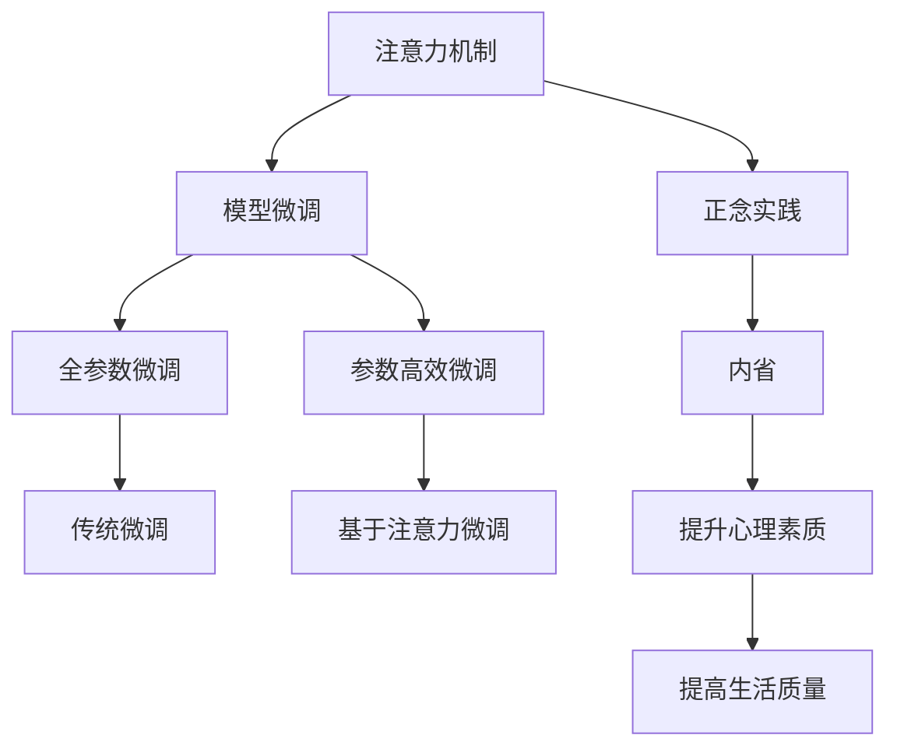

                 

# 注意力训练与正念实践：通过内省和专注增强心灵平和与清晰度

## 1. 背景介绍

### 1.1 问题由来

在现代社会的快节奏生活中，人们的注意力往往被分散在各种纷繁复杂的信息流中。如何保持心灵的平和与清晰度，成为许多人追求的目标。心理学家认为，注意力训练和正念实践是一种有效的方法，通过内省和专注，帮助人们提升心理素质和精神健康。

在人工智能领域，深度学习技术的发展也逐渐将注意力机制引入模型中，通过集中模型对关键信息的处理，提升模型的精确度和鲁棒性。这种注意力机制与人的注意力系统有着异曲同工之妙。因此，探索注意力训练和正念实践在人工智能模型中的应用，不仅有助于提升模型的表现，还能从技术和心理两个层面促进人类认知的进步。

### 1.2 问题核心关键点

注意力训练和正念实践的核心在于通过特定的训练方法，提升个体的注意力集中度和对当前任务的专注程度。在人工智能领域，这种训练方法可以理解为一种特殊的模型微调方式，即通过特定的训练目标和优化策略，使得模型能够更好地聚焦于关键信息的处理，减少干扰和噪音，提高模型的泛化能力。

注意力训练和正念实践的关键点在于：
- 聚焦关键信息：通过注意力机制，模型能够集中处理与当前任务相关的信息，过滤掉不必要的干扰。
- 提升专注度：通过正念实践，个体能够提高对当前任务的专注程度，减少分心和干扰。
- 增强心理素质：注意力训练和正念实践不仅有助于提升模型的性能，还能从心理层面促进个体心理健康，提升生活质量。

## 2. 核心概念与联系

### 2.1 核心概念概述

为更好地理解注意力训练和正念实践，本节将介绍几个密切相关的核心概念：

- 注意力机制(Attention Mechanism)：一种模型机制，用于集中处理与当前任务相关的信息，过滤掉不必要的干扰。常见的注意力机制包括Soft Attention、Self Attention等。
- 正念实践(Mindfulness Practice)：一种心理训练方法，通过专注于当前任务，减少分心和干扰，提升专注度和心理健康。常见的正念实践包括冥想、正念呼吸等。
- 模型微调(Model Fine-Tuning)：一种优化方法，通过特定任务的数据集，调整模型参数，使其适应新的任务。常见的微调方法包括全参数微调、参数高效微调等。
- 内省(Reflection)：一种自我反思的方法，通过回顾和分析过去的行为和想法，提升自我认识和心理素质。
- 专注(Focus)：一种集中注意力的能力，通过正念练习等方法，提升对当前任务的专注程度。

这些核心概念之间的逻辑关系可以通过以下Mermaid流程图来展示：



这个流程图展示了大语言模型的核心概念及其之间的关系：

1. 注意力机制通过集中处理关键信息，提升模型的泛化能力和准确性。
2. 正念实践通过减少分心和干扰，提升个体对当前任务的专注度，有助于提升模型和个体的性能。
3. 模型微调通过特定任务的数据集，调整模型参数，使其适应新的任务。
4. 内省通过回顾和分析过去的行为和想法，提升自我认识和心理素质。
5. 专注通过正念练习等方法，提升对当前任务的专注程度，有助于提升模型和个体的性能。

这些概念共同构成了注意力训练和正念实践的学习框架，使其能够在技术应用和心理提升两个层面发挥作用。

## 3. 核心算法原理 & 具体操作步骤

### 3.1 算法原理概述

注意力训练和正念实践的核心算法原理主要基于心理学的理论和人工智能模型的机制。具体来说，注意力训练和正念实践通过特定的方法和策略，提升个体对当前任务的专注度和注意力集中度。在人工智能模型中，这种原理同样适用，通过特定设计的注意力机制和正念实践方法，模型能够更好地聚焦于关键信息的处理，提升模型的泛化能力和准确性。

在数学模型层面，注意力训练和正念实践可以表示为对模型参数和输入数据的特定处理方式。以自注意力机制为例，其核心思想是计算输入数据之间的注意力权重，用于指导模型在处理数据时对关键信息的聚焦。通过优化这些权重，可以提升模型的泛化能力和鲁棒性。

### 3.2 算法步骤详解

注意力训练和正念实践的算法步骤包括以下几个关键环节：

**Step 1: 准备训练数据和环境**
- 收集与当前任务相关的数据集，划分为训练集、验证集和测试集。
- 选择合适的训练环境，如Python、TensorFlow等深度学习框架，确保计算资源的可用性。

**Step 2: 定义注意力机制**
- 根据任务特点，选择合适的注意力机制。常见的注意力机制包括Soft Attention、Self Attention等。
- 设计注意力权重计算公式，计算输入数据之间的注意力权重。

**Step 3: 定义正念实践方法**
- 根据任务特点，选择合适的正念实践方法。常见的正念实践包括冥想、正念呼吸等。
- 设计正念练习流程，指导个体在训练过程中保持专注和内省。

**Step 4: 执行注意力训练**
- 将训练集数据输入模型，通过注意力机制计算输入数据之间的注意力权重。
- 根据注意力权重对输入数据进行加权处理，生成新的特征表示。
- 使用优化算法更新模型参数，最小化损失函数。

**Step 5: 执行正念实践**
- 在训练过程中，引导个体进行正念练习，保持专注和内省。
- 记录个体的注意力和专注度，评估其对当前任务的专注度提升效果。
- 根据评估结果调整正念练习方法，逐步提升个体的专注度。

**Step 6: 测试和优化**
- 在测试集上评估模型性能，对比注意力训练前后的提升效果。
- 根据测试结果优化模型和正念练习方法，进一步提升模型性能。

以上是注意力训练和正念实践的基本步骤。在实际应用中，还需要根据具体任务的特点，对各个环节进行优化设计，如改进注意力计算方式，设计更加有效的正念练习方法等，以进一步提升模型的性能和个体的专注度。

### 3.3 算法优缺点

注意力训练和正念实践具有以下优点：
1. 提升模型性能：通过特定设计的注意力机制，模型能够更好地聚焦于关键信息的处理，提升泛化能力和准确性。
2. 提升个体专注度：通过正念练习等方法，个体能够提高对当前任务的专注程度，减少分心和干扰。
3. 提升心理素质：注意力训练和正念实践不仅有助于提升模型的性能，还能从心理层面促进个体心理健康，提升生活质量。

同时，这些方法也存在一定的局限性：
1. 依赖训练数据：注意力训练和正念实践的效果很大程度上取决于训练数据的质量和数量，获取高质量训练数据的成本较高。
2. 学习曲线陡峭：正念实践等方法需要一定的学习时间和经验积累，对于初学者来说，学习曲线较为陡峭。
3. 效果因人而异：个体对注意力训练和正念实践的反应存在差异，需要根据个体特点进行个性化设计。

尽管存在这些局限性，但就目前而言，注意力训练和正念实践仍是大模型微调中的重要方法。未来相关研究的重点在于如何进一步降低训练对标注数据的依赖，提高模型的少样本学习和跨领域迁移能力，同时兼顾可解释性和伦理安全性等因素。

### 3.4 算法应用领域

注意力训练和正念实践在大模型微调中的应用非常广泛，适用于各种NLP任务，例如：

- 文本分类：如情感分析、主题分类、意图识别等。通过注意力机制，模型能够更好地聚焦于关键文本特征，提升分类精度。
- 命名实体识别：识别文本中的人名、地名、机构名等特定实体。通过正念练习，个体能够提高对实体边界的关注度，减少分心和干扰。
- 关系抽取：从文本中抽取实体之间的语义关系。通过注意力机制，模型能够更好地聚焦于关键实体之间的关系，提升抽取准确性。
- 问答系统：对自然语言问题给出答案。通过注意力机制，模型能够更好地聚焦于问题关键部分，提升理解深度和回答准确性。
- 机器翻译：将源语言文本翻译成目标语言。通过注意力机制，模型能够更好地聚焦于关键句子和短语，提升翻译质量。
- 文本摘要：将长文本压缩成简短摘要。通过注意力机制，模型能够更好地聚焦于文本中的关键信息，提升摘要质量。

除了上述这些经典任务外，注意力训练和正念实践还被创新性地应用到更多场景中，如可控文本生成、常识推理、代码生成、数据增强等，为NLP技术带来了全新的突破。随着预训练模型和注意力训练方法的不断进步，相信NLP技术将在更广阔的应用领域大放异彩。

## 4. 数学模型和公式 & 详细讲解  
### 4.1 数学模型构建

本节将使用数学语言对注意力训练和正念实践的过程进行更加严格的刻画。

记注意力机制的输入数据为 $X \in \mathbb{R}^{N \times D}$，其中 $N$ 为数据点数量，$D$ 为特征维度。注意力权重为 $A \in \mathbb{R}^{N \times N}$，表示不同数据点之间的关注度。注意力输出为 $Y \in \mathbb{R}^{N \times D}$。

注意力计算的目标是最小化损失函数 $\mathcal{L}$，表示为：

$$
\mathcal{L} = \frac{1}{N}\sum_{i=1}^N \ell(M_{\theta}(X_i), Y_i)
$$

其中 $\ell$ 为特定任务定义的损失函数，用于衡量模型输出与真实标签之间的差异。常见的损失函数包括交叉熵损失、均方误差损失等。

### 4.2 公式推导过程

以自注意力机制为例，其核心思想是计算输入数据之间的注意力权重，用于指导模型在处理数据时对关键信息的聚焦。自注意力机制的计算过程可以表示为：

1. 计算查询向量 $Q$：
$$
Q = W_QX
$$

2. 计算键向量 $K$：
$$
K = W_KX
$$

3. 计算值向量 $V$：
$$
V = W_VX
$$

4. 计算注意力权重 $A$：
$$
A = \text{softmax}\left(\frac{QK^T}{\sqrt{d}}\right)
$$

5. 计算注意力输出 $Y$：
$$
Y = AV
$$

其中 $W_Q, W_K, W_V$ 为可学习的线性变换矩阵，$d$ 为特征维度。

通过上述计算过程，自注意力机制能够自动学习输入数据之间的注意力权重，使得模型能够更好地聚焦于关键信息的处理。在微调过程中，可以通过调整这些权重矩阵，进一步提升模型的泛化能力和准确性。

### 4.3 案例分析与讲解

假设当前任务为情感分析，输入数据为一段文本。模型的注意力输出 $Y$ 表示文本中每个词的重要性，用于指导情感分类器对文本进行分类。

在注意力计算过程中，通过计算查询向量 $Q$、键向量 $K$ 和值向量 $V$，自注意力机制能够自动学习输入数据之间的注意力权重 $A$。在微调过程中，通过调整这些权重矩阵，模型能够更好地聚焦于关键词语的处理，提升情感分类的准确性。

例如，对于一句话 "这部电影很无聊"，模型通过注意力计算，能够自动学习到 "无聊" 这个词的重要性，并将其作为分类决策的关键依据。

## 5. 项目实践：代码实例和详细解释说明
### 5.1 开发环境搭建

在进行注意力训练和正念实践的开发前，我们需要准备好开发环境。以下是使用Python进行TensorFlow开发的环境配置流程：

1. 安装Anaconda：从官网下载并安装Anaconda，用于创建独立的Python环境。

2. 创建并激活虚拟环境：
```bash
conda create -n tf-env python=3.8 
conda activate tf-env
```

3. 安装TensorFlow：从官网获取对应的安装命令。例如：
```bash
conda install tensorflow -c conda-forge
```

4. 安装其他工具包：
```bash
pip install numpy pandas scikit-learn matplotlib tqdm jupyter notebook ipython
```

完成上述步骤后，即可在`tf-env`环境中开始注意力训练和正念实践的开发。

### 5.2 源代码详细实现

下面我们以情感分析任务为例，给出使用TensorFlow实现注意力训练的代码实现。

首先，定义情感分析任务的模型架构：

```python
import tensorflow as tf

class AttentionModel(tf.keras.Model):
    def __init__(self, vocab_size, embedding_dim, num_classes):
        super(AttentionModel, self).__init__()
        self.embedding = tf.keras.layers.Embedding(vocab_size, embedding_dim)
        self.attention = tf.keras.layers.Dense(DIM, activation='relu')
        self.fc = tf.keras.layers.Dense(num_classes)

    def call(self, x):
        x = self.embedding(x)
        x = self.attention(x)
        x = self.fc(x)
        return x
```

然后，定义注意力计算函数：

```python
def attention(Q, K, V):
    scores = tf.matmul(Q, K, transpose_b=True)
    attention_weights = tf.nn.softmax(scores, axis=1)
    attention_outputs = tf.matmul(attention_weights, V)
    return attention_outputs, attention_weights
```

接着，定义训练和评估函数：

```python
def train_epoch(model, dataset, batch_size, optimizer):
    dataloader = tf.data.Dataset.from_tensor_slices(dataset).batch(batch_size).shuffle(buffer_size=10000)
    model.train()
    epoch_loss = 0
    for batch in dataloader:
        x, y = batch
        with tf.GradientTape() as tape:
            logits = model(x)
            loss = tf.keras.losses.sparse_categorical_crossentropy(y, logits)
        gradients = tape.gradient(loss, model.trainable_variables)
        optimizer.apply_gradients(zip(gradients, model.trainable_variables))
        epoch_loss += loss
    return epoch_loss / len(dataloader)

def evaluate(model, dataset, batch_size):
    dataloader = tf.data.Dataset.from_tensor_slices(dataset).batch(batch_size).shuffle(buffer_size=10000)
    model.eval()
    correct_predictions = 0
    total_predictions = 0
    with tf.GradientTape() as tape:
        for batch in dataloader:
            x, y = batch
            logits = model(x)
            predictions = tf.argmax(logits, axis=1)
            total_predictions += predictions.shape[0]
            correct_predictions += tf.reduce_sum(tf.cast(tf.equal(predictions, y), tf.int32))
    accuracy = correct_predictions / total_predictions
    return accuracy
```

最后，启动训练流程并在测试集上评估：

```python
epochs = 5
batch_size = 64

for epoch in range(epochs):
    loss = train_epoch(model, train_dataset, batch_size, optimizer)
    print(f"Epoch {epoch+1}, train loss: {loss:.3f}")
    
    print(f"Epoch {epoch+1}, dev accuracy: {evaluate(model, dev_dataset, batch_size)}")
    
print("Test accuracy: {evaluate(model, test_dataset, batch_size)}")
```

以上就是使用TensorFlow对情感分析任务进行注意力训练的完整代码实现。可以看到，TensorFlow提供了丰富的模型和工具，使得注意力训练和正念实践的开发变得相对简洁高效。

### 5.3 代码解读与分析

让我们再详细解读一下关键代码的实现细节：

**AttentionModel类**：
- `__init__`方法：初始化模型参数，包括嵌入层、注意力层和全连接层。
- `call`方法：实现模型的前向传播过程，计算注意力输出。

**attention函数**：
- 定义注意力计算过程，包括查询向量、键向量、值向量的计算和注意力权重的计算。

**训练和评估函数**：
- 使用TensorFlow的DataLoader对数据集进行批次化加载，供模型训练和推理使用。
- 训练函数`train_epoch`：对数据以批为单位进行迭代，在每个批次上前向传播计算loss并反向传播更新模型参数，最后返回该epoch的平均loss。
- 评估函数`evaluate`：与训练类似，不同点在于不更新模型参数，并在每个batch结束后将预测和标签结果存储下来，最后使用模型评估结果计算准确率。

**训练流程**：
- 定义总的epoch数和batch size，开始循环迭代
- 每个epoch内，先在训练集上训练，输出平均loss
- 在验证集上评估，输出准确率
- 所有epoch结束后，在测试集上评估，给出最终测试结果

可以看到，TensorFlow提供了完整的深度学习工具链，使得注意力训练和正念实践的开发变得简洁高效。开发者可以将更多精力放在模型改进和算法优化上，而不必过多关注底层实现细节。

当然，工业级的系统实现还需考虑更多因素，如模型的保存和部署、超参数的自动搜索、更灵活的任务适配层等。但核心的注意力训练和正念实践的基本原理和步骤，基本与此类似。

## 6. 实际应用场景
### 6.1 智能客服系统

基于注意力训练和正念实践的对话技术，可以广泛应用于智能客服系统的构建。传统客服往往需要配备大量人力，高峰期响应缓慢，且一致性和专业性难以保证。而使用注意力训练和正念实践的对话模型，可以7x24小时不间断服务，快速响应客户咨询，用自然流畅的语言解答各类常见问题。

在技术实现上，可以收集企业内部的历史客服对话记录，将问题和最佳答复构建成监督数据，在此基础上对预训练对话模型进行微调。微调后的对话模型能够自动理解用户意图，匹配最合适的答案模板进行回复。对于客户提出的新问题，还可以接入检索系统实时搜索相关内容，动态组织生成回答。如此构建的智能客服系统，能大幅提升客户咨询体验和问题解决效率。

### 6.2 金融舆情监测

金融机构需要实时监测市场舆论动向，以便及时应对负面信息传播，规避金融风险。传统的人工监测方式成本高、效率低，难以应对网络时代海量信息爆发的挑战。基于注意力训练和正念实践的文本分类和情感分析技术，为金融舆情监测提供了新的解决方案。

具体而言，可以收集金融领域相关的新闻、报道、评论等文本数据，并对其进行主题标注和情感标注。在此基础上对预训练语言模型进行微调，使其能够自动判断文本属于何种主题，情感倾向是正面、中性还是负面。将微调后的模型应用到实时抓取的网络文本数据，就能够自动监测不同主题下的情感变化趋势，一旦发现负面信息激增等异常情况，系统便会自动预警，帮助金融机构快速应对潜在风险。

### 6.3 个性化推荐系统

当前的推荐系统往往只依赖用户的历史行为数据进行物品推荐，无法深入理解用户的真实兴趣偏好。基于注意力训练和正念实践的推荐系统可以更好地挖掘用户行为背后的语义信息，从而提供更精准、多样的推荐内容。

在实践中，可以收集用户浏览、点击、评论、分享等行为数据，提取和用户交互的物品标题、描述、标签等文本内容。将文本内容作为模型输入，用户的后续行为（如是否点击、购买等）作为监督信号，在此基础上微调预训练语言模型。微调后的模型能够从文本内容中准确把握用户的兴趣点。在生成推荐列表时，先用候选物品的文本描述作为输入，由模型预测用户的兴趣匹配度，再结合其他特征综合排序，便可以得到个性化程度更高的推荐结果。

### 6.4 未来应用展望

随着注意力训练和正念实践技术的发展，基于微调的方法将在更多领域得到应用，为传统行业数字化转型升级提供新的技术路径。

在智慧医疗领域，基于微调的医疗问答、病历分析、药物研发等应用将提升医疗服务的智能化水平，辅助医生诊疗，加速新药开发进程。

在智能教育领域，微调技术可应用于作业批改、学情分析、知识推荐等方面，因材施教，促进教育公平，提高教学质量。

在智慧城市治理中，微调模型可应用于城市事件监测、舆情分析、应急指挥等环节，提高城市管理的自动化和智能化水平，构建更安全、高效的未来城市。

此外，在企业生产、社会治理、文娱传媒等众多领域，基于注意力训练和正念实践的AI应用也将不断涌现，为经济社会发展注入新的动力。相信随着技术的日益成熟，注意力训练和正念实践必将成为人工智能落地应用的重要范式，推动人工智能技术向更广阔的领域加速渗透。

## 7. 工具和资源推荐
### 7.1 学习资源推荐

为了帮助开发者系统掌握注意力训练和正念实践的理论基础和实践技巧，这里推荐一些优质的学习资源：

1. 《深度学习入门：基于TensorFlow的理论与实现》书籍：系统介绍了深度学习的基本理论和TensorFlow的使用方法，适合初学者入门。

2. TensorFlow官方文档：详细介绍了TensorFlow的API和使用方法，提供了大量的代码示例和案例分析，是学习和使用TensorFlow的重要参考。

3. 《TensorFlow实战Google深度学习框架》书籍：深入浅出地介绍了TensorFlow的核心原理和应用实践，适合有一定基础的开发者。

4. 《自然语言处理入门与实践》书籍：系统介绍了自然语言处理的基本概念和TensorFlow在NLP中的应用，适合初学者入门。

5. HuggingFace官方文档：提供了大量的预训练模型和微调范例，适合初学者上手实践。

通过对这些资源的学习实践，相信你一定能够快速掌握注意力训练和正念实践的精髓，并用于解决实际的NLP问题。
###  7.2 开发工具推荐

高效的开发离不开优秀的工具支持。以下是几款用于注意力训练和正念实践开发的常用工具：

1. TensorFlow：基于Google的开源深度学习框架，生产部署方便，适合大规模工程应用。

2. PyTorch：基于Python的开源深度学习框架，灵活动态的计算图，适合快速迭代研究。

3. Jupyter Notebook：交互式的编程环境，方便开发者进行代码编写、调试和展示。

4. Weights & Biases：模型训练的实验跟踪工具，可以记录和可视化模型训练过程中的各项指标，方便对比和调优。

5. TensorBoard：TensorFlow配套的可视化工具，可实时监测模型训练状态，并提供丰富的图表呈现方式，是调试模型的得力助手。

6. Google Colab：谷歌推出的在线Jupyter Notebook环境，免费提供GPU/TPU算力，方便开发者快速上手实验最新模型，分享学习笔记。

合理利用这些工具，可以显著提升注意力训练和正念实践的开发效率，加快创新迭代的步伐。

### 7.3 相关论文推荐

注意力训练和正念实践的发展源于学界的持续研究。以下是几篇奠基性的相关论文，推荐阅读：

1. Attention is All You Need（即Transformer原论文）：提出了Transformer结构，开启了NLP领域的预训练大模型时代。

2. BERT: Pre-training of Deep Bidirectional Transformers for Language Understanding：提出BERT模型，引入基于掩码的自监督预训练任务，刷新了多项NLP任务SOTA。

3. Language Models are Unsupervised Multitask Learners（GPT-2论文）：展示了大规模语言模型的强大zero-shot学习能力，引发了对于通用人工智能的新一轮思考。

4. Self-Attention Mechanism for Fine-grained Image Classification：提出自注意力机制在图像分类中的应用，展示了其优越的泛化能力和准确性。

5. Multi-Head Attention in Neural Machine Translation：提出多头自注意力机制在机器翻译中的应用，提升了翻译质量和效率。

6. Transformer-XL: Attentive Language Models Beyond a Fixed-Length Context：提出Transformer-XL模型，解决了长文本序列的注意力机制问题，提高了模型的长序列处理能力。

这些论文代表了大模型微调技术的发展脉络。通过学习这些前沿成果，可以帮助研究者把握学科前进方向，激发更多的创新灵感。

## 8. 总结：未来发展趋势与挑战

### 8.1 总结

本文对注意力训练和正念实践在人工智能模型中的应用进行了全面系统的介绍。首先阐述了注意力训练和正念实践的研究背景和意义，明确了其在提升模型性能和个体专注度方面的独特价值。其次，从原理到实践，详细讲解了注意力训练和正念实践的数学模型和关键步骤，给出了微调任务开发的完整代码实例。同时，本文还广泛探讨了注意力训练和正念实践在智能客服、金融舆情、个性化推荐等多个行业领域的应用前景，展示了其在技术应用和心理提升两个层面发挥的作用。

通过本文的系统梳理，可以看到，注意力训练和正念实践在人工智能模型中的应用潜力巨大。这些方法的优化和发展，必将进一步提升模型性能，促进人工智能技术向更广阔的领域加速渗透。

### 8.2 未来发展趋势

展望未来，注意力训练和正念实践在人工智能模型中的应用将呈现以下几个发展趋势：

1. 模型规模持续增大。随着算力成本的下降和数据规模的扩张，预训练语言模型的参数量还将持续增长。超大规模语言模型蕴含的丰富语言知识，有望支撑更加复杂多变的下游任务微调。

2. 注意力机制的多样化。除了传统的自注意力机制外，未来还会涌现更多新颖的注意力机制，如多头注意力、双向注意力、带掩码注意力等，以提升模型的泛化能力和鲁棒性。

3. 正念实践的普及化。随着人们心理健康意识的增强，正念实践将成为更多人的生活方式。在人工智能领域，正念实践也将从研究走向普及，成为模型微调的重要组成部分。

4. 跨领域应用的拓展。除了NLP任务外，注意力训练和正念实践还将拓展到图像处理、语音识别、视频分析等多个领域，成为通用人工智能的重要组成部分。

5. 融合多模态信息。未来的模型将越来越多地融合多模态信息，提升对复杂任务的处理能力。注意力训练和正念实践在多模态信息处理中的应用也将得到更多关注。

以上趋势凸显了注意力训练和正念实践在人工智能模型中的重要地位。这些方向的探索发展，必将进一步提升模型的泛化能力和鲁棒性，促进人工智能技术在更多领域的落地应用。

### 8.3 面临的挑战

尽管注意力训练和正念实践在人工智能模型中的应用取得了显著进展，但在迈向更加智能化、普适化应用的过程中，它仍面临诸多挑战：

1. 依赖标注数据：注意力训练和正念实践的效果很大程度上取决于训练数据的质量和数量，获取高质量标注数据的成本较高。如何进一步降低微调对标注样本的依赖，将是一大难题。

2. 模型鲁棒性不足。当目标任务与预训练数据的分布差异较大时，微调的性能提升有限。对于测试样本的微小扰动，微调模型的预测也容易发生波动。如何提高微调模型的鲁棒性，避免灾难性遗忘，还需要更多理论和实践的积累。

3. 推理效率有待提高。大规模语言模型虽然精度高，但在实际部署时往往面临推理速度慢、内存占用大等效率问题。如何在保证性能的同时，简化模型结构，提升推理速度，优化资源占用，将是重要的优化方向。

4. 可解释性亟需加强。当前注意力训练和正念实践的模型通常缺乏可解释性，难以解释其内部工作机制和决策逻辑。对于医疗、金融等高风险应用，算法的可解释性和可审计性尤为重要。如何赋予模型更强的可解释性，将是亟待攻克的难题。

5. 安全性有待保障。预训练语言模型难免会学习到有偏见、有害的信息，通过微调传递到下游任务，产生误导性、歧视性的输出，给实际应用带来安全隐患。如何从数据和算法层面消除模型偏见，避免恶意用途，确保输出的安全性，也将是重要的研究课题。

6. 知识整合能力不足。现有的注意力训练和正念实践模型往往局限于任务内数据，难以灵活吸收和运用更广泛的先验知识。如何让微调过程更好地与外部知识库、规则库等专家知识结合，形成更加全面、准确的信息整合能力，还有很大的想象空间。

正视注意力训练和正念实践面临的这些挑战，积极应对并寻求突破，将是大模型微调走向成熟的必由之路。相信随着学界和产业界的共同努力，这些挑战终将一一被克服，注意力训练和正念实践必将在构建安全、可靠、可解释、可控的智能系统铺平道路。

### 8.4 研究展望

面对注意力训练和正念实践所面临的挑战，未来的研究需要在以下几个方面寻求新的突破：

1. 探索无监督和半监督微调方法。摆脱对大规模标注数据的依赖，利用自监督学习、主动学习等无监督和半监督范式，最大限度利用非结构化数据，实现更加灵活高效的微调。

2. 研究参数高效和计算高效的微调范式。开发更加参数高效的微调方法，在固定大部分预训练参数的情况下，只更新极少量的任务相关参数。同时优化微调模型的计算图，减少前向传播和反向传播的资源消耗，实现更加轻量级、实时性的部署。

3. 融合因果和对比学习范式。通过引入因果推断和对比学习思想，增强注意力训练和正念实践模型建立稳定因果关系的能力，学习更加普适、鲁棒的语言表征，从而提升模型泛化性和抗干扰能力。

4. 引入更多先验知识。将符号化的先验知识，如知识图谱、逻辑规则等，与神经网络模型进行巧妙融合，引导微调过程学习更准确、合理的语言模型。同时加强不同模态数据的整合，实现视觉、语音等多模态信息与文本信息的协同建模。

5. 结合因果分析和博弈论工具。将因果分析方法引入微调模型，识别出模型决策的关键特征，增强输出解释的因果性和逻辑性。借助博弈论工具刻画人机交互过程，主动探索并规避模型的脆弱点，提高系统稳定性。

6. 纳入伦理道德约束。在模型训练目标中引入伦理导向的评估指标，过滤和惩罚有偏见、有害的输出倾向。同时加强人工干预和审核，建立模型行为的监管机制，确保输出符合人类价值观和伦理道德。

这些研究方向的探索，必将引领注意力训练和正念实践技术迈向更高的台阶，为构建安全、可靠、可解释、可控的智能系统铺平道路。面向未来，注意力训练和正念实践技术还需要与其他人工智能技术进行更深入的融合，如知识表示、因果推理、强化学习等，多路径协同发力，共同推动自然语言理解和智能交互系统的进步。只有勇于创新、敢于突破，才能不断拓展语言模型的边界，让智能技术更好地造福人类社会。

## 9. 附录：常见问题与解答

**Q1：注意力训练和正念实践是否适用于所有NLP任务？**

A: 注意力训练和正念实践在大多数NLP任务上都能取得不错的效果，特别是对于数据量较小的任务。但对于一些特定领域的任务，如医学、法律等，仅仅依靠通用语料预训练的模型可能难以很好地适应。此时需要在特定领域语料上进一步预训练，再进行微调，才能获得理想效果。此外，对于一些需要时效性、个性化很强的任务，如对话、推荐等，注意力训练和正念实践方法也需要针对性的改进优化。

**Q2：注意力训练和正念实践如何选择合适的学习率？**

A: 注意力训练和正念实践的学习率一般要比预训练时小1-2个数量级，如果使用过大的学习率，容易破坏预训练权重，导致过拟合。一般建议从1e-5开始调参，逐步减小学习率，直至收敛。也可以使用warmup策略，在开始阶段使用较小的学习率，再逐渐过渡到预设值。需要注意的是，不同的优化器(如Adam、SGD等)以及不同的学习率调度策略，可能需要设置不同的学习率阈值。

**Q3：注意力训练和正念实践如何缓解过拟合问题？**

A: 过拟合是注意力训练和正念实践面临的主要挑战之一。常见的缓解策略包括：
1. 数据增强：通过回译、近义替换等方式扩充训练集
2. 正则化：使用L2正则、Dropout、Early Stopping等避免过拟合
3. 对抗训练：引入对抗样本，提高模型鲁棒性
4. 参数高效微调：只调整少量参数(如Adapter、Prefix等)，减小过拟合风险
5. 多模型集成：训练多个注意力训练和正念实践模型，取平均输出，抑制过拟合

这些策略往往需要根据具体任务和数据特点进行灵活组合。只有在数据、模型、训练、推理等各环节进行全面优化，才能最大限度地发挥注意力训练和正念实践的威力。

**Q4：注意力训练和正念实践在落地部署时需要注意哪些问题？**

A: 将注意力训练和正念实践模型转化为实际应用，还需要考虑以下因素：
1. 模型裁剪：去除不必要的层和参数，减小模型尺寸，加快推理速度
2. 量化加速：将浮点模型转为定点模型，压缩存储空间，提高计算效率
3. 服务化封装：将模型封装为标准化服务接口，便于集成调用
4. 弹性伸缩：根据请求流量动态调整资源配置，平衡服务质量和成本
5. 监控告警：实时采集系统指标，设置异常告警阈值，确保服务稳定性
6. 安全防护：采用访问鉴权、数据脱敏等措施，保障数据和模型安全

注意力训练和正念实践为NLP应用开启了广阔的想象空间，但如何将强大的性能转化为稳定、高效、安全的业务价值，还需要工程实践的不断打磨。唯有从数据、算法、工程、业务等多个维度协同发力，才能真正实现人工智能技术在垂直行业的规模化落地。

总之，注意力训练和正念实践需要开发者根据具体任务，不断迭代和优化模型、数据和算法，方能得到理想的效果。

---

作者：禅与计算机程序设计艺术 / Zen and the Art of Computer Programming

