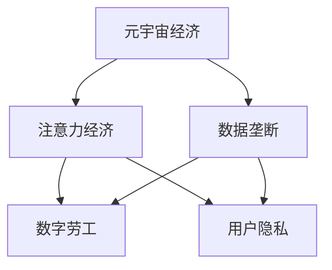

                 

# 注意力资本主义批判:元宇宙经济中的剥削与异化

> 关键词：元宇宙经济,注意力经济,注意力资本主义,剥削与异化,数据垄断,数字劳工,用户隐私

## 1. 背景介绍

### 1.1 问题由来
随着数字技术的迅猛发展，尤其是移动互联网、人工智能和虚拟现实技术的成熟，一个全新的数字经济形态——元宇宙（Metaverse）正在逐步形成。元宇宙作为虚拟空间和现实世界的深度融合，其经济模式正逐渐从传统的物质生产向注意力经济转变。在这一过程中，资本、数据和劳动等生产要素发生了重大的变化，引发了关于注意力资本主义的一系列讨论。

元宇宙经济的核心在于吸引用户注意力，通过各种内容和服务获取用户的持续参与和互动。然而，在数字化资本的驱动下，注意力经济逐渐演变为一种新的剥削和异化形式，即“注意力资本主义”（Attention Capitalism）。注意力资本主义不仅改变了人类社会的生产方式和消费模式，也引发了诸多伦理和社会问题。

### 1.2 问题核心关键点
注意力资本主义的本质是数字资本通过各种手段吸引用户注意力，进而获取经济价值。这一过程中，用户作为注意力资源，成为资本运作的对象，面临被剥削和异化的风险。资本家通过算法优化、个性化推荐等技术手段，精确操控用户注意力，从而实现对数据和劳动的深度剥削。同时，用户的数据和隐私权也面临着被滥用的风险。

注意力资本主义的核心理念包括以下几个方面：

- **数据垄断**：数字资本通过收集和分析用户行为数据，形成数据垄断，进而获取巨大的经济利益。
- **数字劳工**：用户投入大量时间和精力，在虚拟空间中参与内容创作、互动等活动，这些劳动在资本家的运营体系中被异化，难以获得应有的回报。
- **用户隐私**：用户数据成为资本运作的关键资源，隐私保护成为数字经济中的重要问题。

## 2. 核心概念与联系

### 2.1 核心概念概述

在深入探讨注意力资本主义之前，首先介绍几个核心概念：

- **元宇宙经济**：由虚拟空间和现实世界深度融合形成的经济形态，以吸引和利用用户注意力为核心的经济活动。
- **注意力经济**：以吸引和利用用户注意力为核心，获取经济价值的经济模式。
- **数据垄断**：通过数据收集、分析和应用，形成对数据的控制和利用，进而获取经济利益的现象。
- **数字劳工**：用户在虚拟空间中进行内容创作、互动等劳动，这些劳动在资本运营体系中被异化，难以获得应有回报。
- **用户隐私**：用户在数字平台上的行为数据和个人信息，隐私保护是数字经济中的重要议题。

这些概念之间的联系可以通过以下Mermaid流程图来展示：



这个流程图展示了元宇宙经济和注意力资本主义中的核心概念及其相互关系：

1. 元宇宙经济通过吸引用户注意力，形成经济活动。
2. 注意力经济是元宇宙经济的核心，通过精准营销、个性化推荐等方式获取用户注意力，获取经济价值。
3. 数据垄断是注意力经济的重要组成部分，通过收集和分析用户数据，形成对数据的控制。
4. 数字劳工是用户参与元宇宙经济的重要形式，用户通过内容创作、互动等劳动贡献价值。
5. 用户隐私是注意力资本主义中的一个重要问题，用户数据成为资本运营的核心资源。

这些概念共同构成了元宇宙经济和注意力资本主义的框架，使得注意力资本主义的剥削与异化问题得以充分展现。

## 3. 核心算法原理 & 具体操作步骤
### 3.1 算法原理概述

注意力资本主义的实现主要依赖于两大核心算法：个性化推荐和数据挖掘。这些算法通过精准操控用户注意力，实现对数据和劳动的深度剥削。

个性化推荐算法通过分析用户的历史行为数据，预测其偏好，并推荐相关内容。通过不断的用户行为数据收集和分析，算法可以不断优化推荐效果，增强用户粘性，从而形成数据垄断。

数据挖掘算法通过挖掘用户行为数据，分析用户特征和兴趣，实现对用户的精准营销和内容推送。这些算法通过不断的迭代优化，可以更精确地把握用户需求，进而获取更大的经济利益。

### 3.2 算法步骤详解

基于注意力资本主义的推荐和挖掘算法，其具体的操作步骤如下：

**Step 1: 数据收集与预处理**
- 收集用户的行为数据，如浏览记录、点击行为、评论内容等。
- 对数据进行预处理，如去噪、标准化等，以提高数据质量。

**Step 2: 特征提取**
- 使用机器学习或深度学习算法，提取用户的特征向量，如兴趣标签、行为模式等。
- 使用自然语言处理技术，提取文本内容的关键词和语义信息。

**Step 3: 模型训练与优化**
- 训练推荐模型和数据挖掘模型，使用交叉熵、均方误差等损失函数进行优化。
- 应用正则化技术，如L2正则、Dropout等，防止模型过拟合。

**Step 4: 推荐与挖掘**
- 根据模型预测结果，推荐相关内容或进行精准营销。
- 使用数据挖掘算法，分析用户行为数据，发现新的用户兴趣和需求。

**Step 5: 反馈与迭代**
- 收集用户反馈，调整模型参数和策略，提高推荐效果和用户满意度。
- 持续迭代优化模型，以适应用户行为和数据的变化。

### 3.3 算法优缺点

个性化推荐和数据挖掘算法具有以下优点：
1. 提高用户满意度：通过精准推荐和精准营销，增强用户粘性，提高用户满意度。
2. 获取经济利益：通过收集和分析用户数据，形成数据垄断，获取巨大经济利益。

同时，这些算法也存在以下局限性：
1. 数据隐私问题：收集大量用户数据，侵犯用户隐私，引发伦理争议。
2. 用户被剥削：用户的行为数据被资本家掌控，难以获得应有回报。
3. 算法不公平：算法存在偏见和歧视，可能对某些用户群体不公平。

### 3.4 算法应用领域

个性化推荐和数据挖掘算法不仅在元宇宙经济中得到广泛应用，也在各类电子商务、社交媒体、在线教育等领域得到了广泛应用。

1. **电子商务**：通过推荐系统，提升用户购物体验，增加销售额。
2. **社交媒体**：通过精准营销，提高用户粘性，增加平台活跃度。
3. **在线教育**：通过个性化推荐，提高学习效果，增加用户粘性。

除了上述这些领域外，个性化推荐和数据挖掘算法还在新闻聚合、金融投资、健康医疗等多个行业得到应用，成为推动数字化转型的重要工具。

## 4. 数学模型和公式 & 详细讲解 & 举例说明（备注：数学公式请使用latex格式，latex嵌入文中独立段落使用 $$，段落内使用 $)
### 4.1 数学模型构建

本节将使用数学语言对注意力资本主义的推荐和挖掘算法进行更加严格的刻画。

设用户集合为 $U$，内容集合为 $C$，用户行为数据为 $D$。记 $D=\{(x_i,y_i)\}_{i=1}^N$，其中 $x_i$ 为用户行为数据，$y_i \in \{0,1\}$ 表示用户是否对内容 $c_i$ 感兴趣。

定义推荐模型为 $M_{\theta}(x_i)$，其中 $\theta$ 为模型参数。推荐模型的目标是最小化预测误差，即：

$$
\mathcal{L}(\theta) = \frac{1}{N} \sum_{i=1}^N \ell(M_{\theta}(x_i),y_i)
$$

其中 $\ell$ 为损失函数，如交叉熵损失函数。

### 4.2 公式推导过程

以二分类任务为例，推导推荐模型的损失函数和梯度计算公式。

假设推荐模型 $M_{\theta}$ 在输入 $x$ 上的输出为 $\hat{y}=M_{\theta}(x) \in [0,1]$，表示用户对内容的感兴趣程度。真实标签 $y \in \{0,1\}$。则二分类交叉熵损失函数定义为：

$$
\ell(M_{\theta}(x),y) = -[y\log \hat{y} + (1-y)\log (1-\hat{y})]
$$

将其代入经验风险公式，得：

$$
\mathcal{L}(\theta) = -\frac{1}{N}\sum_{i=1}^N [y_i\log M_{\theta}(x_i)+(1-y_i)\log(1-M_{\theta}(x_i))]
$$

根据链式法则，损失函数对参数 $\theta_k$ 的梯度为：

$$
\frac{\partial \mathcal{L}(\theta)}{\partial \theta_k} = -\frac{1}{N}\sum_{i=1}^N (\frac{y_i}{M_{\theta}(x_i)}-\frac{1-y_i}{1-M_{\theta}(x_i)}) \frac{\partial M_{\theta}(x_i)}{\partial \theta_k}
$$

其中 $\frac{\partial M_{\theta}(x_i)}{\partial \theta_k}$ 可进一步递归展开，利用自动微分技术完成计算。

### 4.3 案例分析与讲解

以推荐系统为例，解释以上公式的应用。

假设推荐模型为线性分类器 $M_{\theta}(x)=\theta^Tx$，其中 $\theta$ 为权重向量。对于每个用户 $x_i$，其行为数据 $x_i$ 和推荐标签 $y_i$，损失函数为：

$$
\ell(M_{\theta}(x_i),y_i) = -[y_i\log \theta^Tx_i+(1-y_i)\log (1-\theta^Tx_i)]
$$

在训练过程中，使用梯度下降算法更新模型参数：

$$
\theta \leftarrow \theta - \eta \nabla_{\theta}\mathcal{L}(\theta)
$$

其中 $\eta$ 为学习率，$\nabla_{\theta}\mathcal{L}(\theta)$ 为损失函数对参数 $\theta$ 的梯度。

## 5. 项目实践：代码实例和详细解释说明
### 5.1 开发环境搭建

在进行推荐系统实践前，我们需要准备好开发环境。以下是使用Python进行PyTorch开发的环境配置流程：

1. 安装Anaconda：从官网下载并安装Anaconda，用于创建独立的Python环境。

2. 创建并激活虚拟环境：
```bash
conda create -n pytorch-env python=3.8 
conda activate pytorch-env
```

3. 安装PyTorch：根据CUDA版本，从官网获取对应的安装命令。例如：
```bash
conda install pytorch torchvision torchaudio cudatoolkit=11.1 -c pytorch -c conda-forge
```

4. 安装其他必要的库：
```bash
pip install numpy pandas sklearn matplotlib torchtext
```

完成上述步骤后，即可在`pytorch-env`环境中开始推荐系统实践。

### 5.2 源代码详细实现

这里我们以推荐系统为例，给出使用Transformers库进行推荐模型微调的PyTorch代码实现。

首先，定义推荐任务的数据处理函数：

```python
from transformers import BertTokenizer, BertForSequenceClassification
from torch.utils.data import Dataset
import torch

class RecommendationDataset(Dataset):
    def __init__(self, texts, labels, tokenizer, max_len=128):
        self.texts = texts
        self.labels = labels
        self.tokenizer = tokenizer
        self.max_len = max_len
        
    def __len__(self):
        return len(self.texts)
    
    def __getitem__(self, item):
        text = self.texts[item]
        label = self.labels[item]
        
        encoding = self.tokenizer(text, return_tensors='pt', max_length=self.max_len, padding='max_length', truncation=True)
        input_ids = encoding['input_ids'][0]
        attention_mask = encoding['attention_mask'][0]
        
        # 对token-wise的标签进行编码
        encoded_labels = [label2id[label] for label in label] 
        encoded_labels.extend([label2id['O']] * (self.max_len - len(encoded_labels)))
        labels = torch.tensor(encoded_labels, dtype=torch.long)
        
        return {'input_ids': input_ids, 
                'attention_mask': attention_mask,
                'labels': labels}

# 标签与id的映射
label2id = {'O': 0, 'A': 1}
id2label = {v: k for k, v in label2id.items()}

# 创建dataset
tokenizer = BertTokenizer.from_pretrained('bert-base-cased')

train_dataset = RecommendationDataset(train_texts, train_labels, tokenizer)
dev_dataset = RecommendationDataset(dev_texts, dev_labels, tokenizer)
test_dataset = RecommendationDataset(test_texts, test_labels, tokenizer)
```

然后，定义模型和优化器：

```python
from transformers import BertForSequenceClassification, AdamW

model = BertForSequenceClassification.from_pretrained('bert-base-cased', num_labels=len(label2id))

optimizer = AdamW(model.parameters(), lr=2e-5)
```

接着，定义训练和评估函数：

```python
from torch.utils.data import DataLoader
from tqdm import tqdm
from sklearn.metrics import classification_report

device = torch.device('cuda') if torch.cuda.is_available() else torch.device('cpu')
model.to(device)

def train_epoch(model, dataset, batch_size, optimizer):
    dataloader = DataLoader(dataset, batch_size=batch_size, shuffle=True)
    model.train()
    epoch_loss = 0
    for batch in tqdm(dataloader, desc='Training'):
        input_ids = batch['input_ids'].to(device)
        attention_mask = batch['attention_mask'].to(device)
        labels = batch['labels'].to(device)
        model.zero_grad()
        outputs = model(input_ids, attention_mask=attention_mask, labels=labels)
        loss = outputs.loss
        epoch_loss += loss.item()
        loss.backward()
        optimizer.step()
    return epoch_loss / len(dataloader)

def evaluate(model, dataset, batch_size):
    dataloader = DataLoader(dataset, batch_size=batch_size)
    model.eval()
    preds, labels = [], []
    with torch.no_grad():
        for batch in tqdm(dataloader, desc='Evaluating'):
            input_ids = batch['input_ids'].to(device)
            attention_mask = batch['attention_mask'].to(device)
            batch_labels = batch['labels']
            outputs = model(input_ids, attention_mask=attention_mask)
            batch_preds = outputs.logits.argmax(dim=2).to('cpu').tolist()
            batch_labels = batch_labels.to('cpu').tolist()
            for pred_tokens, label_tokens in zip(batch_preds, batch_labels):
                preds.append(pred_tokens[:len(label_tokens)])
                labels.append(label_tokens)
                
    print(classification_report(labels, preds))
```

最后，启动训练流程并在测试集上评估：

```python
epochs = 5
batch_size = 16

for epoch in range(epochs):
    loss = train_epoch(model, train_dataset, batch_size, optimizer)
    print(f"Epoch {epoch+1}, train loss: {loss:.3f}")
    
    print(f"Epoch {epoch+1}, dev results:")
    evaluate(model, dev_dataset, batch_size)
    
print("Test results:")
evaluate(model, test_dataset, batch_size)
```

以上就是使用PyTorch对推荐系统进行微调的完整代码实现。可以看到，得益于Transformers库的强大封装，我们可以用相对简洁的代码完成推荐系统的微调。

### 5.3 代码解读与分析

让我们再详细解读一下关键代码的实现细节：

**RecommendationDataset类**：
- `__init__`方法：初始化文本、标签、分词器等关键组件。
- `__len__`方法：返回数据集的样本数量。
- `__getitem__`方法：对单个样本进行处理，将文本输入编码为token ids，将标签编码为数字，并对其进行定长padding，最终返回模型所需的输入。

**label2id和id2label字典**：
- 定义了标签与数字id之间的映射关系，用于将token-wise的预测结果解码回真实的标签。

**训练和评估函数**：
- 使用PyTorch的DataLoader对数据集进行批次化加载，供模型训练和推理使用。
- 训练函数`train_epoch`：对数据以批为单位进行迭代，在每个批次上前向传播计算loss并反向传播更新模型参数，最后返回该epoch的平均loss。
- 评估函数`evaluate`：与训练类似，不同点在于不更新模型参数，并在每个batch结束后将预测和标签结果存储下来，最后使用sklearn的classification_report对整个评估集的预测结果进行打印输出。

**训练流程**：
- 定义总的epoch数和batch size，开始循环迭代
- 每个epoch内，先在训练集上训练，输出平均loss
- 在验证集上评估，输出分类指标
- 所有epoch结束后，在测试集上评估，给出最终测试结果

可以看到，PyTorch配合Transformers库使得推荐系统微调的代码实现变得简洁高效。开发者可以将更多精力放在数据处理、模型改进等高层逻辑上，而不必过多关注底层的实现细节。

当然，工业级的系统实现还需考虑更多因素，如模型的保存和部署、超参数的自动搜索、更灵活的任务适配层等。但核心的微调范式基本与此类似。

## 6. 实际应用场景
### 6.1 智能客服系统

基于推荐系统的智能客服系统可以广泛应用于客户服务领域。传统客服往往需要配备大量人力，高峰期响应缓慢，且一致性和专业性难以保证。而使用推荐系统的智能客服系统，可以通过精准推荐相关问题和解决方案，显著提升客户咨询体验。

在技术实现上，可以收集企业内部的历史客服对话记录，将问题和最佳答复构建成监督数据，在此基础上对推荐系统进行微调。微调后的推荐系统能够自动理解用户意图，推荐最合适的答案模板进行回复。对于客户提出的新问题，还可以接入检索系统实时搜索相关内容，动态组织生成回答。如此构建的智能客服系统，能大幅提升客户咨询体验和问题解决效率。

### 6.2 金融舆情监测

金融机构需要实时监测市场舆论动向，以便及时应对负面信息传播，规避金融风险。传统的人工监测方式成本高、效率低，难以应对网络时代海量信息爆发的挑战。基于推荐系统的文本分类和情感分析技术，为金融舆情监测提供了新的解决方案。

具体而言，可以收集金融领域相关的新闻、报道、评论等文本数据，并对其进行主题标注和情感标注。在此基础上对推荐系统进行微调，使其能够自动判断文本属于何种主题，情感倾向是正面、中性还是负面。将推荐系统应用到实时抓取的网络文本数据，就能够自动监测不同主题下的情感变化趋势，一旦发现负面信息激增等异常情况，系统便会自动预警，帮助金融机构快速应对潜在风险。

### 6.3 个性化推荐系统

当前的推荐系统往往只依赖用户的历史行为数据进行物品推荐，无法深入理解用户的真实兴趣偏好。基于推荐系统的推荐模型，可以更好地挖掘用户行为背后的语义信息，从而提供更精准、多样的推荐内容。

在实践中，可以收集用户浏览、点击、评论、分享等行为数据，提取和用户交互的物品标题、描述、标签等文本内容。将文本内容作为模型输入，用户的后续行为（如是否点击、购买等）作为监督信号，在此基础上微调推荐系统模型。微调后的模型能够从文本内容中准确把握用户的兴趣点。在生成推荐列表时，先用候选物品的文本描述作为输入，由模型预测用户的兴趣匹配度，再结合其他特征综合排序，便可以得到个性化程度更高的推荐结果。

### 6.4 未来应用展望

随着推荐系统的不断发展，基于推荐系统的推荐算法将在更多领域得到应用，为各行业带来变革性影响。

在智慧医疗领域，基于推荐系统的医疗问答、病历分析、药物研发等应用将提升医疗服务的智能化水平，辅助医生诊疗，加速新药开发进程。

在智能教育领域，推荐系统的推荐算法可应用于作业批改、学情分析、知识推荐等方面，因材施教，促进教育公平，提高教学质量。

在智慧城市治理中，推荐系统的推荐算法可应用于城市事件监测、舆情分析、应急指挥等环节，提高城市管理的自动化和智能化水平，构建更安全、高效的未来城市。

此外，在企业生产、社会治理、文娱传媒等众多领域，基于推荐系统的推荐算法也将不断涌现，为数字化转型提供新的动力。相信随着技术的日益成熟，推荐系统必将在更广阔的应用领域大放异彩。

## 7. 工具和资源推荐
### 7.1 学习资源推荐

为了帮助开发者系统掌握推荐系统的理论基础和实践技巧，这里推荐一些优质的学习资源：

1. 《推荐系统基础》系列博文：由推荐系统专家撰写，深入浅出地介绍了推荐系统的基本原理和经典算法。

2. CS291《信息检索与推荐系统》课程：斯坦福大学开设的推荐系统经典课程，涵盖推荐系统的理论基础和算法实现，适合系统学习。

3. 《推荐系统实战》书籍：深度学习推荐系统领域的入门和实战指南，介绍了推荐系统的各类算法和实际应用。

4. Kaggle推荐系统竞赛：参与推荐系统竞赛，实战练习各类推荐算法，提升算法实践能力。

5. TensorFlow官方文档：推荐系统的TensorFlow实现，提供丰富的代码样例，适合快速上手。

通过对这些资源的学习实践，相信你一定能够快速掌握推荐系统的精髓，并用于解决实际的推荐问题。
###  7.2 开发工具推荐

高效的开发离不开优秀的工具支持。以下是几款用于推荐系统开发的常用工具：

1. TensorFlow：由Google主导开发的开源深度学习框架，生产部署方便，适合大规模工程应用。

2. PyTorch：基于Python的开源深度学习框架，灵活动态的计算图，适合快速迭代研究。

3. Scikit-learn：Python机器学习库，提供丰富的数据预处理和模型评估工具，方便推荐系统开发。

4. Pandas：Python数据分析库，方便处理和分析推荐系统所需的大量数据。

5. Matplotlib：Python绘图库，提供强大的数据可视化功能，帮助理解模型效果和优化方向。

合理利用这些工具，可以显著提升推荐系统的开发效率，加快创新迭代的步伐。

### 7.3 相关论文推荐

推荐系统的研究源于学界的持续研究。以下是几篇奠基性的相关论文，推荐阅读：

1. Matrix Factorization Techniques for Recommender Systems（协同过滤算法）：提出了基于矩阵分解的推荐算法，成为推荐系统的经典基础算法。

2. Deep Collaborative Filtering（深度推荐算法）：提出了基于深度神经网络的推荐算法，提升了推荐系统的准确性和泛化能力。

3. Attention Is All You Need（Transformer模型）：提出了Transformer结构，适用于自然语言处理领域的推荐系统。

4. Semi-supervised Learning for Text Recommendation（半监督文本推荐算法）：提出了基于半监督学习的文本推荐算法，提升了推荐系统的鲁棒性和泛化能力。

5. Feature Engineering for Text Recommendation（特征工程文本推荐算法）：提出了基于特征工程的文本推荐算法，提升了推荐系统的多样性和个性化能力。

这些论文代表了大推荐系统的研究进展，通过学习这些前沿成果，可以帮助研究者把握学科前进方向，激发更多的创新灵感。

## 8. 总结：未来发展趋势与挑战

### 8.1 总结

本文对基于推荐系统的注意力资本主义进行了全面系统的介绍。首先阐述了注意力资本主义的核心概念和基本原理，明确了推荐系统在数字化经济中的重要地位和应用前景。其次，从原理到实践，详细讲解了推荐算法的数学模型和实现细节，给出了推荐系统的代码实例和详细解释说明。同时，本文还广泛探讨了推荐系统在智能客服、金融舆情、个性化推荐等多个行业领域的应用场景，展示了推荐系统的巨大潜力。

通过本文的系统梳理，可以看到，基于推荐系统的注意力资本主义正在成为数字经济的重要组成部分，极大地拓展了推荐系统的应用边界，催生了更多的落地场景。受益于数据驱动的精准推荐，推荐系统能够更好地适配用户需求，提升用户体验和经济效益。未来，伴随推荐算法的不断优化和创新，推荐系统必将在更广泛的领域发挥重要作用。

### 8.2 未来发展趋势

展望未来，基于推荐系统的注意力资本主义将呈现以下几个发展趋势：

1. **推荐算法的多样化**：推荐系统将引入更多的算法和模型，如协同过滤、深度学习、知识图谱等，提升推荐效果和用户体验。

2. **推荐系统的个性化**：推荐系统将更加注重个性化推荐，通过用户画像、行为分析等技术手段，提供更精准、更符合用户需求的推荐内容。

3. **推荐系统的实时化**：推荐系统将更加注重实时推荐，通过实时数据流处理和推理，提升推荐系统的响应速度和用户体验。

4. **推荐系统的跨模态化**：推荐系统将引入更多模态信息，如图像、视频、语音等，实现跨模态推荐，提升推荐内容的多样性和丰富性。

5. **推荐系统的社会化**：推荐系统将引入社会化推荐，通过用户社区、社交网络等社会化因素，提升推荐系统的交互性和参与度。

这些趋势凸显了推荐系统的广阔前景，将进一步提升用户满意度和平台价值，推动数字经济的深度发展。

### 8.3 面临的挑战

尽管基于推荐系统的注意力资本主义取得了显著进展，但在迈向更加智能化、普适化应用的过程中，它仍面临着诸多挑战：

1. **数据隐私问题**：推荐系统需要大量用户数据，涉及用户隐私保护问题，引发伦理争议。

2. **推荐系统的公平性**：推荐系统存在偏见和歧视，可能对某些用户群体不公平。

3. **推荐系统的鲁棒性**：推荐系统面临对抗攻击、异常数据等风险，需要提升鲁棒性。

4. **推荐系统的可解释性**：推荐系统的决策过程难以解释，用户难以理解推荐内容的来源和依据。

5. **推荐系统的资源消耗**：推荐系统需要大量计算资源，面临算力成本和硬件瓶颈的挑战。

6. **推荐系统的安全风险**：推荐系统可能成为恶意攻击的目标，面临安全风险。

这些挑战需要通过算法优化、数据治理、隐私保护、安全性保障等多方面的努力来解决，确保推荐系统的健康发展。

### 8.4 研究展望

面对基于推荐系统的注意力资本主义所面临的种种挑战，未来的研究需要在以下几个方面寻求新的突破：

1. **推荐算法的公平性**：引入公平性约束，避免对某些用户群体不公平的推荐。

2. **推荐系统的透明性**：增强推荐系统的透明性，使用户能够理解推荐内容的依据和来源。

3. **推荐系统的鲁棒性**：提升推荐系统的鲁棒性，抵御对抗攻击和异常数据的影响。

4. **推荐系统的可解释性**：引入可解释性技术，提高推荐系统的可解释性，增强用户信任。

5. **推荐系统的隐私保护**：引入隐私保护技术，保护用户数据隐私，确保数据安全。

这些研究方向的探索，将引领推荐系统迈向更加智能化、普适化和公平化的方向，为用户提供更优质的推荐服务。面向未来，推荐系统还需要与其他人工智能技术进行更深入的融合，如知识图谱、因果推理、强化学习等，共同推动推荐系统技术的发展和应用。只有勇于创新、敢于突破，才能不断拓展推荐系统的边界，让推荐技术更好地服务于社会和用户。

## 9. 附录：常见问题与解答

**Q1：推荐系统如何避免对某些用户群体不公平的推荐？**

A: 推荐系统可以通过引入公平性约束，避免对某些用户群体不公平的推荐。具体方法包括：

1. **公平性评估**：在推荐模型训练过程中，引入公平性评估指标，如平衡准确率、误差率差异等，对推荐结果进行公平性评估。

2. **多样性约束**：在推荐模型训练过程中，引入多样性约束，确保推荐结果中不同群体的用户数达到预设比例。

3. **特征工程**：通过特征工程，增加对特定用户群体的关注，如在用户画像中增加性别、年龄、地域等特征，提升对特定群体的推荐效果。

这些方法可以在推荐模型的设计过程中，从源头上避免对某些用户群体不公平的推荐，提升推荐系统的公平性和普适性。

**Q2：推荐系统如何提高推荐内容的可解释性？**

A: 推荐系统可以通过以下方法提高推荐内容的可解释性：

1. **特征解释**：在推荐模型的训练过程中，引入可解释的特征工程方法，如LIME、SHAP等，解释模型预测的依据。

2. **推荐解释**：在推荐系统的输出过程中，引入推荐解释功能，如推荐理由、相似商品等信息，帮助用户理解推荐内容。

3. **用户反馈**：在推荐系统中引入用户反馈机制，通过用户对推荐内容的评价和反馈，不断优化推荐模型，提高推荐内容的可解释性。

这些方法可以在推荐模型的设计和实现过程中，增强推荐系统的可解释性，提升用户对推荐内容的信任度和满意度。

**Q3：推荐系统如何应对对抗攻击和异常数据？**

A: 推荐系统可以通过以下方法应对对抗攻击和异常数据：

1. **鲁棒性设计**：在推荐模型的设计过程中，引入鲁棒性设计，如对抗训练、异常检测等，增强模型的鲁棒性。

2. **数据清洗**：在推荐系统的数据预处理过程中，进行数据清洗和去噪，去除异常数据和噪声数据，提升推荐模型的准确性。

3. **异常检测**：在推荐系统的数据预处理过程中，引入异常检测算法，识别和剔除异常数据，提升推荐模型的鲁棒性。

这些方法可以在推荐模型的设计和实现过程中，增强推荐系统的鲁棒性，提升推荐模型的准确性和鲁棒性。

**Q4：推荐系统如何优化资源消耗？**

A: 推荐系统可以通过以下方法优化资源消耗：

1. **模型压缩**：在推荐模型的设计和实现过程中，引入模型压缩技术，如剪枝、量化等，减小模型的存储空间和计算量。

2. **分布式训练**：在推荐系统的训练过程中，引入分布式训练技术，提升训练速度和资源利用率。

3. **硬件优化**：在推荐系统的部署过程中，引入硬件优化技术，如GPU加速、分布式计算等，提升推荐系统的计算速度和资源利用率。

这些方法可以在推荐系统的设计和实现过程中，优化推荐系统的资源消耗，提升推荐系统的效率和性能。

---

作者：禅与计算机程序设计艺术 / Zen and the Art of Computer Programming

