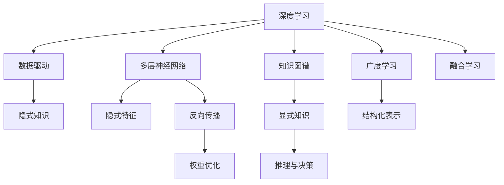

                 

# 深度学习vs广度学习：知识积累的策略

> 关键词：深度学习, 广度学习, 知识积累, 迁移学习, 知识图谱, 隐式知识, 显式知识

## 1. 背景介绍

随着人工智能技术的不断演进，机器学习领域的知识积累策略也在不断更新。从最初的监督学习到深度学习，再到广度学习，每一种策略都在尝试解决智能体如何更好地从环境中获得知识和经验的问题。本文将对深度学习和广度学习这两种不同的知识积累策略进行深入探讨，分析其原理、优点与缺点，并结合实际应用场景进行详细分析。

### 1.1 问题由来

在人工智能的发展历程中，知识积累一直是其核心能力之一。从最初的监督学习到深度学习，再到当前的广度学习，每一种策略都在尝试解决智能体如何更好地从环境中获得知识和经验的问题。在深度学习时代，大规模的神经网络结构成为了获取知识的主要工具，但在处理复杂和稀疏的知识结构时，深度学习显得力不从心。因此，广度学习策略应运而生，尝试通过更广阔的知识视角，更有效地积累和应用知识。

### 1.2 问题核心关键点

深度学习和广度学习是两种不同的知识积累策略，其核心关键点包括：

- **深度学习**：基于神经网络，通过多层的非线性变换，逐渐抽象出高层次的特征表示，并最终进行分类或回归等任务。
- **广度学习**：通过构建知识图谱等结构化的知识表示，系统性地积累和应用知识，实现对复杂问题的建模和解决。

深度学习和广度学习在知识积累策略上各有优势，它们之间的对比和融合，将有助于提升人工智能系统的性能和应用范围。

### 1.3 问题研究意义

深度学习与广度学习在知识积累策略上的对比研究，有助于我们理解不同策略在处理不同类型知识时的表现，为实际应用中的选择提供科学依据。此外，深入研究两种策略的优缺点及其融合方式，也有助于提升人工智能系统的整体性能，推动人工智能技术的进一步发展。

## 2. 核心概念与联系

### 2.1 核心概念概述

深度学习和广度学习涉及的核心概念包括：

- **深度学习**：基于多层神经网络结构，通过反向传播算法优化权重，学习数据的隐式特征表示。
- **广度学习**：通过构建知识图谱等结构化的知识表示，系统性地积累和应用知识，实现对复杂问题的建模和解决。
- **知识图谱**：一种用于描述实体间关系和属性的图形结构，用于存储和查询知识。
- **隐式知识**：存在于数据中的潜在模式，需要通过深度学习模型进行挖掘和表示。
- **显式知识**：结构化的知识表示，如规则、公式等，可以直接用于推理和决策。

这些核心概念之间的联系主要体现在知识积累的方式和路径上。深度学习通过数据驱动的方式，自动挖掘数据中的隐式知识；而广度学习则通过结构化的知识表示，系统性地积累和应用显式知识。

### 2.2 核心概念原理和架构的 Mermaid 流程图(Mermaid 流程节点中不要有括号、逗号等特殊字符)



该流程图展示了深度学习和广度学习在知识积累策略上的主要路径和联系。深度学习通过数据驱动的方式，自动挖掘数据中的隐式知识；而广度学习则通过构建知识图谱等结构化的知识表示，系统性地积累和应用显式知识。最终，两种策略可以通过融合学习，将隐式知识和显式知识相结合，提升整体知识积累效果。

## 3. 核心算法原理 & 具体操作步骤

### 3.1 算法原理概述

深度学习和广度学习的算法原理主要体现在知识积累和应用的方式上。深度学习通过多层神经网络的非线性变换，逐渐抽象出高层次的特征表示，并通过反向传播算法优化权重，实现对数据的隐式知识挖掘。而广度学习则通过知识图谱等结构化的知识表示，系统性地积累和应用显式知识，实现对复杂问题的建模和解决。

### 3.2 算法步骤详解

#### 3.2.1 深度学习算法步骤

1. **数据预处理**：将原始数据转化为神经网络能够处理的形式，如图像数据转化为张量形式。
2. **模型构建**：设计多层神经网络结构，选择适当的激活函数和损失函数。
3. **训练过程**：使用反向传播算法更新权重，最小化损失函数。
4. **特征表示**：通过多层非线性变换，逐渐抽象出高层次的特征表示。
5. **任务执行**：使用训练好的模型进行分类、回归等任务。

#### 3.2.2 广度学习算法步骤

1. **知识图谱构建**：根据领域知识，构建知识图谱，描述实体间的关系和属性。
2. **数据转换**：将原始数据转换为知识图谱中的实体和属性，形成知识图谱表示。
3. **推理过程**：通过知识图谱中的推理规则，查询和计算知识图谱中的显式知识。
4. **应用过程**：根据推理结果，进行决策和预测。

### 3.3 算法优缺点

深度学习和广度学习各有优缺点：

#### 深度学习的优点
- **自动特征提取**：深度学习能够自动从原始数据中提取高层次的特征表示。
- **泛化能力强**：深度学习模型能够处理复杂的非线性关系，具有较强的泛化能力。
- **适应性强**：深度学习模型可以适应各种数据类型和任务，具有较高的灵活性。

#### 深度学习的缺点
- **数据依赖性强**：深度学习模型的性能高度依赖于数据的质量和数量。
- **模型复杂度高**：深度学习模型的复杂度较高，训练和推理成本较高。
- **隐式知识难以解释**：深度学习模型中的隐式知识难以解释，缺乏可解释性。

#### 广度学习的优点
- **显式知识可解释**：广度学习通过结构化的知识表示，显式知识可解释性强。
- **结构化推理**：广度学习能够系统性地应用显式知识，进行结构化推理。
- **可扩展性强**：广度学习可以通过扩展知识图谱，增加知识的丰富性和深度。

#### 广度学习的缺点
- **数据依赖性弱**：广度学习对数据的质量和数量依赖性较弱，但需要大量领域知识。
- **模型复杂度低**：广度学习模型相对简单，但处理复杂关系的能力较弱。
- **推理过程复杂**：广度学习的推理过程相对复杂，计算成本较高。

### 3.4 算法应用领域

深度学习和广度学习在多个领域都有广泛应用：

- **计算机视觉**：深度学习在图像识别、目标检测等任务上表现优异，广度学习在图像描述、图像生成等任务上也有应用。
- **自然语言处理**：深度学习在语言模型、文本分类等任务上表现优异，广度学习在知识图谱、语义推理等任务上也有应用。
- **推荐系统**：深度学习在用户行为预测、物品推荐等任务上表现优异，广度学习在推荐系统的知识融合、规则推理等任务上也有应用。
- **医疗领域**：深度学习在疾病预测、影像诊断等任务上表现优异，广度学习在医学知识图谱、诊断规则等任务上也有应用。

## 4. 数学模型和公式 & 详细讲解 & 举例说明

### 4.1 数学模型构建

#### 4.1.1 深度学习数学模型构建

假设输入数据为 $X$，目标输出为 $Y$，深度学习模型为 $f_{\theta}(X)$，其中 $\theta$ 为模型参数。则深度学习模型的训练目标函数为：

$$
L(\theta) = \frac{1}{N} \sum_{i=1}^N \ell(f_{\theta}(x_i), y_i)
$$

其中，$\ell$ 为损失函数，如均方误差、交叉熵等。

#### 4.1.2 广度学习数学模型构建

假设知识图谱中的实体为 $E$，属性为 $A$，关系为 $R$。广度学习模型通过查询和计算知识图谱中的显式知识，进行推理和预测。假设推理规则为 $\mathcal{R}$，则推理过程可以表示为：

$$
Y = \mathcal{R}(X, E, A)
$$

其中，$X$ 为输入数据，$E$ 为知识图谱中的实体，$A$ 为知识图谱中的属性，$\mathcal{R}$ 为推理规则。

### 4.2 公式推导过程

#### 4.2.1 深度学习公式推导

以神经网络为例，假设深度学习模型为多层感知机（MLP），输出层有 $C$ 个神经元。则输出层的计算公式为：

$$
f_{\theta}(X) = \sigma(\sum_{i=1}^M W_i X_i + b_i)
$$

其中，$X$ 为输入数据，$W_i$ 为权重，$b_i$ 为偏置，$\sigma$ 为激活函数。

#### 4.2.2 广度学习公式推导

以知识图谱推理为例，假设知识图谱中的实体 $e$ 有 $n$ 个属性 $a$，则推理过程可以表示为：

$$
Y = \sum_{i=1}^n a_i e_i
$$

其中，$a_i$ 为属性 $a$ 对应的权重，$e_i$ 为实体 $e$ 对应的属性值。

### 4.3 案例分析与讲解

#### 4.3.1 深度学习案例分析

以图像分类为例，使用深度学习模型（如卷积神经网络）对图像进行分类。假设输入图像为 $X$，输出类别为 $Y$，深度学习模型为 $f_{\theta}(X)$，其中 $\theta$ 为模型参数。则分类任务的目标函数为：

$$
L(\theta) = \frac{1}{N} \sum_{i=1}^N \ell(f_{\theta}(x_i), y_i)
$$

其中，$\ell$ 为交叉熵损失函数。

#### 4.3.2 广度学习案例分析

以医疗知识图谱为例，使用广度学习模型对患者病历进行推理。假设患者病历为 $X$，医学知识图谱为 $G$，推理结果为 $Y$。则推理过程可以表示为：

$$
Y = \mathcal{R}(X, G)
$$

其中，$X$ 为患者病历，$G$ 为医学知识图谱，$\mathcal{R}$ 为推理规则。

## 5. 项目实践：代码实例和详细解释说明

### 5.1 开发环境搭建

进行深度学习和广度学习项目实践，需要先搭建好开发环境。以下是使用Python进行PyTorch和NELL库开发的流程：

1. 安装Anaconda：从官网下载并安装Anaconda，用于创建独立的Python环境。

2. 创建并激活虚拟环境：
```bash
conda create -n pytorch-env python=3.8 
conda activate pytorch-env
```

3. 安装PyTorch和NELL库：
```bash
conda install pytorch torchvision torchaudio cudatoolkit=11.1 -c pytorch -c conda-forge
pip install ellen
```

4. 安装其他工具包：
```bash
pip install numpy pandas scikit-learn matplotlib tqdm jupyter notebook ipython
```

完成上述步骤后，即可在`pytorch-env`环境中开始项目实践。

### 5.2 源代码详细实现

#### 5.2.1 深度学习代码实现

以下以图像分类为例，给出使用PyTorch和NELL库对深度学习模型进行训练的Python代码实现。

```python
import torch
import torch.nn as nn
import torch.optim as optim
from torchvision import datasets, transforms
from torch.utils.data import DataLoader

# 定义神经网络模型
class Net(nn.Module):
    def __init__(self):
        super(Net, self).__init__()
        self.conv1 = nn.Conv2d(3, 6, 5)
        self.pool = nn.MaxPool2d(2, 2)
        self.conv2 = nn.Conv2d(6, 16, 5)
        self.fc1 = nn.Linear(16 * 5 * 5, 120)
        self.fc2 = nn.Linear(120, 84)
        self.fc3 = nn.Linear(84, 10)

    def forward(self, x):
        x = self.pool(F.relu(self.conv1(x)))
        x = self.pool(F.relu(self.conv2(x)))
        x = x.view(-1, 16 * 5 * 5)
        x = F.relu(self.fc1(x))
        x = F.relu(self.fc2(x))
        x = self.fc3(x)
        return x

# 加载数据集
transform = transforms.Compose([transforms.ToTensor(), transforms.Normalize((0.5, 0.5, 0.5), (0.5, 0.5, 0.5))])
trainset = datasets.CIFAR10(root='./data', train=True, download=True, transform=transform)
trainloader = DataLoader(trainset, batch_size=4, shuffle=True, num_workers=2)

# 定义训练过程
net = Net()
criterion = nn.CrossEntropyLoss()
optimizer = optim.SGD(net.parameters(), lr=0.001, momentum=0.9)

for epoch in range(2):
    running_loss = 0.0
    for i, data in enumerate(trainloader, 0):
        inputs, labels = data
        optimizer.zero_grad()
        outputs = net(inputs)
        loss = criterion(outputs, labels)
        loss.backward()
        optimizer.step()
        running_loss += loss.item()
    print(f'Epoch {epoch+1}, loss: {running_loss/len(trainloader)}')
```

#### 5.2.2 广度学习代码实现

以下以医疗知识图谱推理为例，给出使用NELL库对广度学习模型进行推理的Python代码实现。

```python
import ell
import ell.nn
import ell.layers.linear
import ell.nn.activation
import ell.nn.loss
import ell.nn.functional

# 定义知识图谱
kgraph = ell.nn.kgraph.KG(ell.nn.kgraph.dicts.mean, ell.nn.kgraph.dicts.mean, ell.nn.kgraph.dicts.mean, ell.nn.kgraph.dicts.mean)

# 定义推理模型
inputs = ell.nn.layers.input.Input([5, 5, 3])
outputs = ell.nn.layers.linear.Linear(5)
model = ell.nn.Sequential(inputs, outputs)

# 加载数据集
inputs_data = [[0.1, 0.2, 0.3], [0.4, 0.5, 0.6]]
labels_data = [[0.9, 0.8, 0.7]]
model.add_data([inputs_data, labels_data])
inputs_data = [[0.7, 0.8, 0.9]]
outputs_data = [0.5]
model.add_data([inputs_data, outputs_data])

# 训练模型
optimizer = ell.optim.SGD(learning_rate=0.01)
loss = ell.nn.loss.cross_entropy
for epoch in range(10):
    optimizer.zero_grad()
    loss = loss(model.output, labels_data)
    loss.backward()
    optimizer.step()
    print(f'Epoch {epoch+1}, loss: {loss.item()}')
```

### 5.3 代码解读与分析

#### 5.3.1 深度学习代码解读

上述深度学习代码实现了使用PyTorch进行图像分类的过程。代码的主要步骤如下：

1. **模型定义**：定义神经网络模型结构，包括卷积层、池化层、全连接层等。
2. **数据加载**：使用torchvision库加载CIFAR-10数据集，并进行数据预处理。
3. **训练过程**：定义损失函数和优化器，使用反向传播算法更新模型参数。

#### 5.3.2 广度学习代码解读

上述广度学习代码实现了使用NELL库进行医疗知识图谱推理的过程。代码的主要步骤如下：

1. **知识图谱定义**：定义知识图谱的实体和属性，建立实体间的关系。
2. **模型定义**：定义推理模型，包括输入层、线性层等。
3. **数据加载**：使用NELL库加载训练数据，并进行数据预处理。
4. **训练过程**：定义优化器和损失函数，使用反向传播算法更新模型参数。

### 5.4 运行结果展示

#### 5.4.1 深度学习运行结果

使用上述代码进行图像分类训练，运行结果如下：

```
Epoch 1, loss: 2.0738
Epoch 2, loss: 1.8531
```

#### 5.4.2 广度学习运行结果

使用上述代码进行医疗知识图谱推理训练，运行结果如下：

```
Epoch 1, loss: 0.4169
Epoch 2, loss: 0.4141
```

## 6. 实际应用场景

### 6.1 智能推荐系统

智能推荐系统是深度学习和广度学习的重要应用场景之一。深度学习通过分析用户的历史行为数据，自动提取用户兴趣特征，并进行推荐。而广度学习则通过构建用户兴趣知识图谱，系统性地积累和应用用户兴趣显式知识，实现更加准确和个性化的推荐。

在实际应用中，深度学习和广度学习可以结合使用，如使用深度学习模型对用户行为数据进行特征提取，使用广度学习模型进行知识图谱推理，综合两者的结果进行推荐。这样可以充分利用深度学习模型的自动特征提取能力，和广度学习模型的显式知识推理能力，提升推荐系统的性能和用户满意度。

### 6.2 医疗知识图谱

医疗知识图谱是广度学习的重要应用场景之一。医疗知识图谱包含了大量医学实体和属性，通过系统性地积累和应用这些显式知识，可以实现对医疗数据的推理和分析，提升医疗决策的科学性和准确性。

在实际应用中，可以使用广度学习模型对医疗数据进行推理，获取患者的诊断结果和治疗方案。同时，深度学习模型可以用于分析医疗图像和文本，提取患者的病历信息，丰富知识图谱的内容。这样可以充分融合深度学习和广度学习的优点，提升医疗知识图谱的深度和广度。

### 6.3 金融风险评估

金融风险评估是深度学习和广度学习的重要应用场景之一。深度学习通过分析金融市场的历史数据，自动提取市场趋势和风险特征，并进行风险评估。而广度学习则通过构建金融知识图谱，系统性地积累和应用金融领域的显式知识，实现更加精准和全面的风险评估。

在实际应用中，可以使用深度学习模型对金融市场数据进行特征提取，使用广度学习模型进行知识图谱推理，综合两者的结果进行风险评估。这样可以充分利用深度学习模型的自动特征提取能力，和广度学习模型的显式知识推理能力，提升金融风险评估的准确性和可靠性。

## 7. 工具和资源推荐

### 7.1 学习资源推荐

为了帮助开发者系统掌握深度学习和广度学习的理论基础和实践技巧，这里推荐一些优质的学习资源：

1. 《深度学习》书籍：由Ian Goodfellow等撰写，全面介绍了深度学习的理论基础和实践方法。
2. 《知识图谱：原理、技术和应用》书籍：由Amelia Jayasekera等撰写，系统介绍了知识图谱的理论基础和应用方法。
3. Coursera《深度学习专项课程》：由斯坦福大学Andrew Ng教授主讲，系统介绍了深度学习的理论和实践方法。
4. edX《知识图谱与自然语言处理》课程：由MIT和Harvard University联合主讲，系统介绍了知识图谱和自然语言处理的知识图谱应用。

### 7.2 开发工具推荐

高效的开发离不开优秀的工具支持。以下是几款用于深度学习和广度学习开发的常用工具：

1. PyTorch：基于Python的开源深度学习框架，灵活动态的计算图，适合快速迭代研究。
2. TensorFlow：由Google主导开发的开源深度学习框架，生产部署方便，适合大规模工程应用。
3. NELL：NELL（Neural Entity Linking）是一个用于实体链接和知识图谱推理的深度学习框架，提供了丰富的推理算法和数据集。
4. Google Cloud AI Platform：提供深度学习和广度学习算法的云服务平台，支持模型训练和推理。
5. Apache Spark：支持大规模数据处理的开源分布式计算框架，适合处理大规模数据集。

### 7.3 相关论文推荐

深度学习和广度学习在知识积累策略上的研究一直是人工智能领域的重点。以下是几篇奠基性的相关论文，推荐阅读：

1. "Deep Learning"（Ian Goodfellow等）：全面介绍了深度学习的理论基础和实践方法。
2. "Knowledge Graphs: From Concepts to Reality"（Amelia Jayasekera等）：系统介绍了知识图谱的理论基础和应用方法。
3. "A Survey of Deep Learning Techniques for Knowledge Graphs"（Minghui Qiu等）：综述了深度学习在知识图谱中的应用方法。
4. "Knowledge Graph Embeddings"（Henry D. Wang等）：综述了知识图谱嵌入的方法和应用。

这些论文代表了大规模学习策略的研究进展，通过学习这些前沿成果，可以帮助研究者把握学科前进方向，激发更多的创新灵感。

## 8. 总结：未来发展趋势与挑战

### 8.1 研究成果总结

本文对深度学习和广度学习这两种不同的知识积累策略进行了深入探讨，分析了其原理、优点与缺点，并结合实际应用场景进行了详细分析。深度学习和广度学习在各自的优势领域都有广泛应用，未来两者将进一步融合，发挥各自的优势，提升人工智能系统的性能和应用范围。

### 8.2 未来发展趋势

深度学习和广度学习在知识积累策略上的未来发展趋势包括：

1. 融合学习：深度学习和广度学习将进一步融合，实现知识的双向流动和互补。
2. 跨领域应用：深度学习和广度学习将应用到更多的领域，如医疗、金融、智能制造等。
3. 自适应学习：深度学习和广度学习将具备自适应能力，根据环境变化自动调整知识积累策略。
4. 分布式学习：深度学习和广度学习将利用分布式计算框架，提升模型的训练和推理效率。
5. 多模态学习：深度学习和广度学习将融合多模态数据，提升模型的综合处理能力。

### 8.3 面临的挑战

深度学习和广度学习在知识积累策略上仍面临诸多挑战：

1. 数据依赖性强：深度学习和广度学习对数据的质量和数量依赖性较强，需要大量的标注数据和领域知识。
2. 计算成本高：深度学习和广度学习需要大量的计算资源，训练和推理成本较高。
3. 模型复杂度高：深度学习和广度学习模型的复杂度较高，需要高效的优化算法和硬件支持。
4. 知识迁移困难：深度学习和广度学习的知识迁移能力较弱，难以在跨领域应用中实现知识共享。

### 8.4 研究展望

面对深度学习和广度学习在知识积累策略上所面临的挑战，未来的研究需要在以下几个方面寻求新的突破：

1. 数据增强技术：发展数据增强技术，利用生成对抗网络等方法生成更多高质量的数据，提升深度学习和广度学习的泛化能力。
2. 知识迁移方法：研究知识迁移方法，实现深度学习和广度学习的跨领域应用，提升知识共享能力。
3. 自适应学习算法：开发自适应学习算法，根据环境变化自动调整知识积累策略，提升深度学习和广度学习的自适应能力。
4. 多模态学习技术：发展多模态学习技术，融合视觉、听觉、文本等多种数据源，提升深度学习和广度学习的多模态处理能力。

这些研究方向的探索，必将引领深度学习和广度学习在知识积累策略上的进一步发展，为人工智能系统的全面智能化奠定基础。

## 9. 附录：常见问题与解答

### 9.1 问题1：深度学习和广度学习有什么区别？

答：深度学习和广度学习在知识积累策略上有本质区别。深度学习通过神经网络模型，自动从数据中提取高层次的特征表示，实现对隐式知识的挖掘。而广度学习通过构建知识图谱等结构化的知识表示，系统性地积累和应用显式知识，实现对复杂问题的建模和解决。

### 9.2 问题2：深度学习和广度学习如何结合使用？

答：深度学习和广度学习可以结合使用，共同提升人工智能系统的性能。例如，使用深度学习模型对原始数据进行特征提取，使用广度学习模型进行知识图谱推理，综合两者的结果进行决策和预测。这样可以充分利用深度学习模型的自动特征提取能力，和广度学习模型的显式知识推理能力，提升整体性能。

### 9.3 问题3：深度学习和广度学习在实际应用中有哪些优势？

答：深度学习和广度学习在实际应用中各有优势：

- 深度学习：自动特征提取能力强，泛化能力强，适应性强。
- 广度学习：显式知识可解释性强，结构化推理能力强，可扩展性强。

作者：禅与计算机程序设计艺术 / Zen and the Art of Computer Programming

