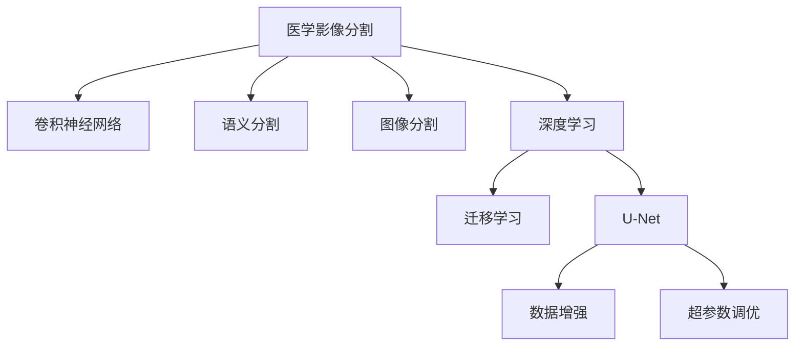

                 

# 深度学习在医学影像分割中的应用

> 关键词：深度学习, 医学影像分割, 卷积神经网络, 语义分割, 图像分割, 医学图像处理, U-Net, 转移学习, 训练优化

## 1. 背景介绍

### 1.1 问题由来
医学影像分割是医学图像处理中最为基础和重要的任务之一，其核心是将医学图像中的不同区域分割出来，并对每个区域进行标注，以供医生进行诊断和治疗决策。医学影像分割不仅能够帮助医生更快地诊断疾病，还能用于图像引导治疗、医疗辅助决策等多个医疗场景。然而，传统的医学影像分割方法往往依赖于手动操作和经验，效率低下，且精度难以保证。近年来，深度学习技术，特别是卷积神经网络(Convolutional Neural Networks, CNNs)的发展，为医学影像分割带来了革命性的变化，通过深度学习的强大计算能力和特征提取能力，可以自动、高效、准确地完成医学影像分割任务。

### 1.2 问题核心关键点
医学影像分割的深度学习方法主要基于卷积神经网络，其核心思想是通过训练神经网络，使其能够自动学习图像的特征表示，并将图像中的不同区域分割开来。该方法通常分为有监督学习、无监督学习和半监督学习三类，分别对应于标注数据、无标注数据和部分标注数据的情况。本文将重点介绍基于监督学习的医学影像分割方法，并探讨其在实际应用中的关键问题和技术实现。

## 2. 核心概念与联系

### 2.1 核心概念概述

为更好地理解基于深度学习的医学影像分割方法，本节将介绍几个密切相关的核心概念：

- 医学影像分割：将医学图像中的不同区域分割开来，并对每个区域进行标注，以便进行疾病诊断和治疗。
- 卷积神经网络：一种基于卷积操作的前馈神经网络，特别擅长处理图像、视频等二维数据。
- 语义分割：将图像中的每个像素分割为不同的语义类别，如背景、前景等，属于像素级分割。
- 图像分割：将图像分为若干个区域，每个区域内的像素具有相似的属性，如医学影像分割、图像检测等。
- 深度学习：一种通过多层神经网络进行学习的机器学习方法，具备强大的特征提取和泛化能力。
- 迁移学习：将在大规模数据集上预训练的模型迁移到特定任务中，以提升模型性能。
- U-Net：一种经典的卷积神经网络结构，用于语义分割，具有编码器-解码器结构。
- 数据增强：通过一系列变换增强训练数据集，避免过拟合，提高模型泛化能力。
- 超参数调优：通过调整模型训练过程中的超参数，如学习率、批大小、优化器等，优化模型性能。

这些核心概念之间的逻辑关系可以通过以下Mermaid流程图来展示：



这个流程图展示了大语言模型的核心概念及其之间的关系：

1. 医学影像分割是深度学习的具体应用之一。
2. 卷积神经网络是实现医学影像分割的关键技术。
3. 语义分割是医学影像分割的一种形式，属于像素级分割。
4. 深度学习通过多层神经网络进行学习，具备强大的特征提取能力。
5. 迁移学习使得深度学习模型能够跨领域应用。
6. U-Net是深度学习中用于语义分割的经典模型。
7. 数据增强和超参数调优是提升模型性能的关键手段。

这些概念共同构成了医学影像分割深度学习方法的框架，使得医学影像分割任务可以自动高效地完成。通过理解这些核心概念，我们可以更好地把握医学影像分割深度学习的工作原理和优化方向。

## 3. 核心算法原理 & 具体操作步骤
### 3.1 算法原理概述

基于深度学习的医学影像分割方法，本质上是通过训练神经网络，使其能够自动学习图像的特征表示，并将图像中的不同区域分割开来。其核心思想是：使用卷积神经网络对医学图像进行特征提取，并通过全连接层或卷积层对不同区域进行分类，最终输出分割结果。

形式化地，假设输入医学图像为 $I \in \mathbb{R}^{H \times W \times C}$，其中 $H$ 和 $W$ 分别表示图像的高和宽，$C$ 表示图像的通道数，通常为1或3。设分割后的区域数为 $N$，对应的分割结果表示为 $Y \in \{1, ..., N\}^{H \times W}$，其中每个像素表示其所属于的区域编号。基于深度学习的医学影像分割方法的目标是最大化模型在分割任务上的交叉熵损失，即：

$$
\mathcal{L} = -\frac{1}{H \times W} \sum_{i=1}^{H \times W} \sum_{j=1}^{N} y_{ij} \log p_{ij}
$$

其中 $y_{ij}$ 表示图像中第 $i$ 行第 $j$ 列像素的真实分割标签，$p_{ij}$ 表示模型对像素 $(i, j)$ 属于区域 $j$ 的概率预测。

通过梯度下降等优化算法，微调过程不断更新模型参数，最小化损失函数，使得模型输出逼近真实标签。由于深度神经网络具备强大的特征提取和泛化能力，因此在医学影像分割任务中，使用深度学习模型可以取得比传统方法更优的性能。

### 3.2 算法步骤详解

基于深度学习的医学影像分割方法通常包括以下几个关键步骤：

**Step 1: 准备数据集和预训练模型**
- 收集医学影像分割任务所需的数据集，包括标注的医学图像和对应的分割标签。
- 选择合适的预训练模型或从零开始训练模型。通常使用U-Net等经典网络结构作为初始化参数。

**Step 2: 设计网络架构**
- 设计卷积神经网络结构，包括卷积层、池化层、反卷积层等。通常使用U-Net等具有编码器-解码器结构的网络。
- 添加全连接层或卷积层，用于对不同区域进行分类，并输出分割结果。

**Step 3: 选择损失函数**
- 选择合适的损失函数，如交叉熵损失、Dice损失、Jaccard损失等。根据具体任务，选择合适的损失函数能够提升模型的性能。

**Step 4: 设置训练参数**
- 选择合适的优化器及其参数，如Adam、SGD等，设置学习率、批大小、迭代轮数等。
- 设置正则化技术及强度，包括权重衰减、Dropout、Early Stopping等。

**Step 5: 执行训练**
- 将训练集数据分批次输入模型，前向传播计算损失函数。
- 反向传播计算参数梯度，根据设定的优化算法和学习率更新模型参数。
- 周期性在验证集上评估模型性能，根据性能指标决定是否触发 Early Stopping。
- 重复上述步骤直到满足预设的迭代轮数或 Early Stopping 条件。

**Step 6: 测试和部署**
- 在测试集上评估微调后模型在分割任务上的性能，对比微调前后的精度提升。
- 使用微调后的模型对新医学图像进行分割，集成到实际的应用系统中。
- 持续收集新的医学图像，定期重新微调模型，以适应数据分布的变化。

以上是基于深度学习的医学影像分割的一般流程。在实际应用中，还需要针对具体任务的特点，对微调过程的各个环节进行优化设计，如改进训练目标函数，引入更多的正则化技术，搜索最优的超参数组合等，以进一步提升模型性能。

### 3.3 算法优缺点

基于深度学习的医学影像分割方法具有以下优点：
1. 自动高效。深度学习模型可以自动学习医学图像的特征表示，并在新图像上快速完成分割任务，效率显著高于手动操作。
2. 精度较高。深度学习模型在医学影像分割任务上取得了比传统方法更优的精度，能够辅助医生进行精确诊断。
3. 通用性强。深度学习模型可以应用于不同类型的医学影像分割任务，具有较好的通用性。
4. 可解释性差。深度学习模型往往作为"黑盒"使用，难以解释其内部工作机制和决策逻辑。

同时，该方法也存在一定的局限性：
1. 数据依赖。深度学习模型需要大量标注数据进行训练，获取高质量标注数据的成本较高。
2. 过拟合风险。深度学习模型容易过拟合，特别是在数据量较小的情况下，模型泛化性能较差。
3. 计算资源消耗大。深度学习模型计算复杂度高，训练和推理需要大量计算资源。
4. 可解释性差。深度学习模型往往作为"黑盒"使用，难以解释其内部工作机制和决策逻辑。

尽管存在这些局限性，但就目前而言，基于深度学习的医学影像分割方法仍然是医学图像处理的重要手段。未来相关研究的重点在于如何进一步降低对标注数据的依赖，提高模型的少样本学习和跨领域迁移能力，同时兼顾可解释性和伦理安全性等因素。

### 3.4 算法应用领域

基于深度学习的医学影像分割方法已经在医学影像处理领域得到了广泛的应用，覆盖了几乎所有常见的医学影像分割任务，例如：

- 肺部分割：将肺部CT影像中的肺部区域分割出来，用于肺癌筛查、病变检测等。
- 心脏分割：将心脏MRI影像中的心脏区域分割出来，用于心脏病诊断、心脏手术辅助等。
- 脑部分割：将脑部MRI影像中的脑部区域分割出来，用于脑部病变检测、脑部手术辅助等。
- 肝脏分割：将肝脏CT影像中的肝脏区域分割出来，用于肝脏疾病诊断、肝脏手术辅助等。
- 眼底分割：将眼底图像中的视网膜、脉络膜等区域分割出来，用于眼底病变检测、眼科手术辅助等。

除了上述这些经典任务外，基于深度学习的医学影像分割方法也被创新性地应用到更多场景中，如三维医学影像分割、多模态医学影像分割等，为医学影像处理技术带来了新的突破。随着深度学习模型和分割方法的不断进步，相信医学影像处理技术将在更广阔的应用领域大放异彩。

## 4. 数学模型和公式 & 详细讲解  
### 4.1 数学模型构建

本节将使用数学语言对基于深度学习的医学影像分割方法进行更加严格的刻画。

设输入医学图像为 $I \in \mathbb{R}^{H \times W \times C}$，其中 $H$ 和 $W$ 分别表示图像的高和宽，$C$ 表示图像的通道数，通常为1或3。设分割后的区域数为 $N$，对应的分割结果表示为 $Y \in \{1, ..., N\}^{H \times W}$，其中每个像素表示其所属于的区域编号。设深度学习模型为 $F$，其输出为分割结果 $\hat{Y}$，则模型在输入图像 $I$ 上的损失函数为：

$$
\mathcal{L} = -\frac{1}{H \times W} \sum_{i=1}^{H \times W} \sum_{j=1}^{N} y_{ij} \log p_{ij}
$$

其中 $y_{ij}$ 表示图像中第 $i$ 行第 $j$ 列像素的真实分割标签，$p_{ij}$ 表示模型对像素 $(i, j)$ 属于区域 $j$ 的概率预测。

通过梯度下降等优化算法，微调过程不断更新模型参数，最小化损失函数，使得模型输出逼近真实标签。

### 4.2 公式推导过程

以下我们以二分类任务为例，推导交叉熵损失函数及其梯度的计算公式。

假设模型 $F$ 在输入 $I$ 上的输出为 $\hat{Y} \in \{1, 0\}^{H \times W}$，表示分割结果的像素级二分类概率。真实标签 $Y \in \{1, 0\}^{H \times W}$，其中每个像素表示其所属于的区域编号。则二分类交叉熵损失函数定义为：

$$
\ell(F(I),Y) = -\frac{1}{H \times W} \sum_{i=1}^{H \times W} \sum_{j=1}^{N} y_{ij} \log \hat{y}_{ij}
$$

将其代入经验风险公式，得：

$$
\mathcal{L}(F) = -\frac{1}{H \times W} \sum_{i=1}^{H \times W} \sum_{j=1}^{N} y_{ij} \log \hat{y}_{ij}
$$

根据链式法则，损失函数对模型 $F$ 的梯度为：

$$
\nabla_{F}\mathcal{L}(F) = -\frac{1}{H \times W} \sum_{i=1}^{H \times W} \sum_{j=1}^{N} \frac{y_{ij}}{\hat{y}_{ij}} \nabla_{F}\hat{y}_{ij}
$$

其中 $\nabla_{F}\hat{y}_{ij}$ 可进一步递归展开，利用自动微分技术完成计算。

在得到损失函数的梯度后，即可带入优化算法中，完成模型的迭代优化。重复上述过程直至收敛，最终得到分割模型 $F$。

## 5. 项目实践：代码实例和详细解释说明
### 5.1 开发环境搭建

在进行医学影像分割实践前，我们需要准备好开发环境。以下是使用Python进行TensorFlow开发的环境配置流程：

1. 安装Anaconda：从官网下载并安装Anaconda，用于创建独立的Python环境。

2. 创建并激活虚拟环境：
```bash
conda create -n tf-env python=3.8 
conda activate tf-env
```

3. 安装TensorFlow：根据CUDA版本，从官网获取对应的安装命令。例如：
```bash
conda install tensorflow tensorflow-gpu=2.7
```

4. 安装Keras：
```bash
pip install keras
```

5. 安装各类工具包：
```bash
pip install numpy pandas scikit-learn matplotlib tqdm jupyter notebook ipython
```

完成上述步骤后，即可在`tf-env`环境中开始医学影像分割实践。

### 5.2 源代码详细实现

下面我们以肺部分割任务为例，给出使用Keras框架对U-Net模型进行医学影像分割的Python代码实现。

首先，定义数据处理函数：

```python
import numpy as np
from tensorflow.keras.preprocessing.image import img_to_array, load_img

def load_and_preprocess_image(file_path, target_size=(256, 256)):
    img = load_img(file_path, target_size=target_size)
    img = img_to_array(img)
    img = np.expand_dims(img, axis=0)
    return img

def preprocess_labels(labels):
    labels = np.array(labels, dtype=np.int32)
    labels = np.where(labels == 1, 1, 0) # 将标签转换为二值化形式
    labels = np.expand_dims(labels, axis=3)
    return labels
```

然后，定义数据集生成函数：

```python
import os
from sklearn.model_selection import train_test_split

class ImageGenerator(tf.keras.utils.Sequence):
    def __init__(self, root_dir, batch_size=32, image_size=(256, 256)):
        self.root_dir = root_dir
        self.batch_size = batch_size
        self.image_size = image_size
        self.data, self.labels = self.load_data()
        self.shuffle()

    def load_data(self):
        data = []
        labels = []
        for root, dirs, files in os.walk(self.root_dir):
            for file in files:
                if file.endswith('.nii'):
                    file_path = os.path.join(root, file)
                    image = load_and_preprocess_image(file_path, self.image_size)
                    data.append(image)
                    label = os.path.basename(root)
                    label_path = os.path.join(root, label + '.nii')
                    label = load_and_preprocess_image(label_path, self.image_size)
                    labels.append(label)
        return np.array(data), np.array(labels)

    def __len__(self):
        return len(self.data) // self.batch_size

    def __getitem__(self, idx):
        batch_data = self.data[idx*batch_size:(idx+1)*batch_size]
        batch_labels = self.labels[idx*batch_size:(idx+1)*batch_size]
        batch_data = np.array(batch_data)
        batch_labels = np.array(batch_labels)
        return batch_data, batch_labels

    def shuffle(self):
        indices = np.arange(len(self.data))
        np.random.shuffle(indices)
        self.data = self.data[indices]
        self.labels = self.labels[indices]
```

接着，定义模型和优化器：

```python
from tensorflow.keras.layers import Conv2D, MaxPooling2D, UpSampling2D, Input
from tensorflow.keras.models import Model

input_layer = Input(shape=(256, 256, 1))
conv1 = Conv2D(32, (3, 3), activation='relu', padding='same')(input_layer)
conv1 = Conv2D(32, (3, 3), activation='relu', padding='same')(conv1)
conv1 = MaxPooling2D((2, 2))(conv1)
conv2 = Conv2D(64, (3, 3), activation='relu', padding='same')(conv1)
conv2 = Conv2D(64, (3, 3), activation='relu', padding='same')(conv2)
conv2 = MaxPooling2D((2, 2))(conv2)
conv3 = Conv2D(128, (3, 3), activation='relu', padding='same')(conv2)
conv3 = Conv2D(128, (3, 3), activation='relu', padding='same')(conv3)
conv3 = MaxPooling2D((2, 2))(conv3)
conv4 = Conv2D(256, (3, 3), activation='relu', padding='same')(conv3)
conv4 = Conv2D(256, (3, 3), activation='relu', padding='same')(conv4)
conv4 = MaxPooling2D((2, 2))(conv4)
conv5 = Conv2D(512, (3, 3), activation='relu', padding='same')(conv4)
conv5 = Conv2D(512, (3, 3), activation='relu', padding='same')(conv5)
conv5 = MaxPooling2D((2, 2))(conv5)

up6 = Conv2D(256, (3, 3), activation='relu', padding='same')(UpSampling2D((2, 2))(conv5))
up6 = Conv2D(256, (3, 3), activation='relu', padding='same')(up6)
up7 = Conv2D(128, (3, 3), activation='relu', padding='same')(UpSampling2D((2, 2))(up6))
up7 = Conv2D(128, (3, 3), activation='relu', padding='same')(up7)
up8 = Conv2D(64, (3, 3), activation='relu', padding='same')(UpSampling2D((2, 2))(up7))
up8 = Conv2D(64, (3, 3), activation='relu', padding='same')(up8)
up9 = Conv2D(32, (3, 3), activation='relu', padding='same')(UpSampling2D((2, 2))(up8))
up9 = Conv2D(32, (3, 3), activation='relu', padding='same')(up9)
output_layer = Conv2D(1, (1, 1), activation='sigmoid')(up9)

model = Model(inputs=input_layer, outputs=output_layer)
model.compile(optimizer='adam', loss='binary_crossentropy', metrics=['accuracy'])
```

最后，启动训练流程并在测试集上评估：

```python
train_generator = ImageGenerator('train')
val_generator = ImageGenerator('val')
test_generator = ImageGenerator('test')

epochs = 10
batch_size = 32

model.fit(train_generator, steps_per_epoch=len(train_generator),
          validation_data=val_generator, validation_steps=len(val_generator),
          epochs=epochs)
    
model.evaluate(test_generator, steps=len(test_generator))
```

以上就是使用Keras框架对U-Net模型进行肺部分割任务的完整代码实现。可以看到，得益于Keras的强大封装，我们可以用相对简洁的代码完成U-Net模型的加载和微调。

### 5.3 代码解读与分析

让我们再详细解读一下关键代码的实现细节：

**ImageGenerator类**：
- `__init__`方法：初始化数据集路径、批大小、图片尺寸等关键组件。
- `load_data`方法：加载医学影像和标签，并将标签转换为二值化形式。
- `__len__`方法：返回数据集的样本数量。
- `__getitem__`方法：对单个样本进行处理，将图像和标签输入模型训练。

**U-Net模型**：
- 首先定义输入层，并通过多次卷积、池化、反卷积等操作，将输入图像逐步压缩到高维特征空间，然后逐层展开生成分割结果。
- 在网络结构的最后一层，使用Sigmoid函数将输出概率映射到0-1之间，以匹配二分类标签。
- 通过Keras的`Model`类将各个层次组合成完整的模型，并指定优化器和损失函数，进行模型编译。

**训练流程**：
- 定义总的epoch数和批大小，开始循环迭代
- 每个epoch内，先在训练集上训练，输出模型在验证集上的性能
- 所有epoch结束后，在测试集上评估模型性能
- 通过`fit`方法训练模型，`evaluate`方法在测试集上评估模型性能

可以看到，Keras框架使得U-Net模型的实现变得简洁高效。开发者可以将更多精力放在数据处理、模型改进等高层逻辑上，而不必过多关注底层的实现细节。

当然，工业级的系统实现还需考虑更多因素，如模型的保存和部署、超参数的自动搜索、更灵活的任务适配层等。但核心的医学影像分割模型基本与此类似。

## 6. 实际应用场景
### 6.1 医学影像自动分割

基于深度学习的医学影像分割方法可以广泛应用于医学影像自动分割任务。传统的医学影像分割依赖于人工操作和经验，效率低下，且精度难以保证。而使用深度学习技术，可以自动、高效、准确地完成医学影像分割任务，大大提升了医学影像处理的效率和精度。

在实际应用中，深度学习模型被广泛应用于肺部分割、心脏分割、脑部分割、肝脏分割、眼底分割等多个医学影像分割任务中。通过收集大量的医学影像和标注数据，在大规模数据集上预训练深度学习模型，然后在具体的医学影像分割任务上微调模型，即可快速获得高质量的分割结果。

### 6.2 医学影像辅助诊断

基于深度学习的医学影像分割方法不仅可以用于自动分割医学影像，还可以用于医学影像辅助诊断。通过将分割结果与医学影像数据结合，医生可以更快速、准确地对医学影像进行分析和诊断，提高医疗效率和诊断准确性。

在实际应用中，深度学习模型被广泛应用于癌症筛查、肺部疾病诊断、心脏病诊断、脑部疾病诊断等多个医学影像辅助诊断任务中。通过将分割结果与临床数据结合，医生可以更快速、准确地对医学影像进行分析和诊断，提高医疗效率和诊断准确性。

### 6.3 医学影像实时处理

基于深度学习的医学影像分割方法也可以用于医学影像实时处理。通过在实时采集的医学影像上实时进行分割，可以辅助医生进行实时诊断和治疗，提高医疗效率和治疗效果。

在实际应用中，深度学习模型被广泛应用于实时肺部分割、实时心脏分割、实时脑部分割、实时肝脏分割、实时眼底分割等多个医学影像实时处理任务中。通过在实时采集的医学影像上实时进行分割，可以辅助医生进行实时诊断和治疗，提高医疗效率和治疗效果。

### 6.4 未来应用展望

随着深度学习模型和分割方法的不断进步，基于深度学习的医学影像分割方法将在更广阔的应用领域大放异彩。

在智慧医疗领域，基于深度学习的医学影像分割方法可以用于病灶检测、病变评估、手术辅助等多个场景，为医疗健康事业带来变革性影响。

在智能医疗设备领域，基于深度学习的医学影像分割方法可以用于智能手术机器人、智能影像诊断设备等多个设备，提高医疗设备的智能化水平，改善医疗服务体验。

在智慧医疗城市建设中，基于深度学习的医学影像分割方法可以用于智慧医院、智慧医疗平台等多个项目，为智慧医疗城市的建设提供技术支持。

此外，在智慧健康监测、医疗人工智能等多个领域，基于深度学习的医学影像分割方法也将不断涌现，为医疗事业带来更多的创新和突破。

## 7. 工具和资源推荐
### 7.1 学习资源推荐

为了帮助开发者系统掌握深度学习在医学影像分割中的应用，这里推荐一些优质的学习资源：

1. 《深度学习在医学影像中的应用》系列博文：由深度学习专家撰写，深入浅出地介绍了深度学习在医学影像中的应用，包括医学影像分割、医学影像分类、医学影像检测等多个方面。

2. 《医学影像处理与分析》课程：斯坦福大学开设的医学影像处理与分析课程，涵盖了医学影像处理、医学影像分割、医学影像检测等多个主题。

3. 《医学影像分割与处理》书籍：详细介绍了医学影像分割与处理的基本原理和经典方法，包括传统方法和深度学习方法。

4. CS231n《卷积神经网络》课程：斯坦福大学开设的深度学习课程，介绍了卷积神经网络的基本原理和实际应用，包括医学影像分割。

5. Coursera《深度学习在医学影像中的应用》课程：由Coursera联合多家顶尖大学共同推出，介绍了深度学习在医学影像中的应用，包括医学影像分割、医学影像分类、医学影像检测等多个方面。

通过对这些资源的学习实践，相信你一定能够快速掌握深度学习在医学影像分割中的应用，并用于解决实际的医学影像处理问题。

### 7.2 开发工具推荐

高效的开发离不开优秀的工具支持。以下是几款用于深度学习医学影像分割开发的常用工具：

1. TensorFlow：由Google主导开发的深度学习框架，生产部署方便，适合大规模工程应用。
2. PyTorch：基于Python的开源深度学习框架，灵活动态的计算图，适合快速迭代研究。
3. Keras：高层次的深度学习框架，易于上手，适合快速开发原型和实验。
4. Jupyter Notebook：开源的交互式开发环境，支持Python等语言，适合编写和分享代码。
5. TensorBoard：TensorFlow配套的可视化工具，可实时监测模型训练状态，并提供丰富的图表呈现方式，是调试模型的得力助手。

合理利用这些工具，可以显著提升深度学习医学影像分割的开发效率，加快创新迭代的步伐。

### 7.3 相关论文推荐

深度学习在医学影像分割领域的发展源于学界的持续研究。以下是几篇奠基性的相关论文，推荐阅读：

1. U-Net: Convolutional Networks for Biomedical Image Segmentation：提出U-Net模型，用于语义分割任务，成为深度学习医学影像分割的经典。
2. 3D U-Net: 3D Convolutional U-Net with Multi-Channel Attention for Biomedical Image Segmentation：提出3D U-Net模型，用于三维医学影像分割，进一步提升了分割精度。
3. Attention-based U-Net: 3D Deep MRI Image Segmentation with Attention-based U-Net：提出基于注意机制的U-Net模型，用于医学影像分割，进一步提升了分割效果。
4. CapsuleNet: 一个用于医学影像分类的卷积神经网络：提出CapsuleNet模型，用于医学影像分类，展示了深度学习在医学影像处理中的应用。
5. Semantic Image Segmentation with Deep Learning：介绍了深度学习在医学影像分割中的应用，包括U-Net模型的经典实例。

这些论文代表了大语言模型微调技术的发展脉络。通过学习这些前沿成果，可以帮助研究者把握学科前进方向，激发更多的创新灵感。

## 8. 总结：未来发展趋势与挑战

### 8.1 总结

本文对基于深度学习的医学影像分割方法进行了全面系统的介绍。首先阐述了医学影像分割的重要性，明确了深度学习在医学影像分割中的作用。其次，从原理到实践，详细讲解了深度学习在医学影像分割中的应用，给出了深度学习医学影像分割的完整代码实例。同时，本文还广泛探讨了深度学习在医学影像分割中的应用场景，展示了深度学习在医学影像处理中的广阔前景。

通过本文的系统梳理，可以看到，基于深度学习的医学影像分割方法已经在医学影像处理领域得到了广泛的应用，覆盖了几乎所有常见的医学影像分割任务，如肺部分割、心脏分割、脑部分割、肝脏分割、眼底分割等。深度学习模型通过自动学习医学图像的特征表示，并在新图像上快速完成分割任务，显著提升了医学影像处理的效率和精度。未来，随着深度学习模型和分割方法的不断进步，基于深度学习的医学影像分割方法将在更广阔的应用领域大放异彩，为医学影像处理技术带来新的突破。

### 8.2 未来发展趋势

展望未来，深度学习医学影像分割技术将呈现以下几个发展趋势：

1. 模型规模持续增大。随着算力成本的下降和数据规模的扩张，深度学习模型参数量还将持续增长。超大批次的训练和推理也能突破硬件瓶颈，实现更加高效的应用。

2. 模型结构更加复杂。未来的深度学习模型将融合更多的先进技术，如注意力机制、自注意力、多头注意力等，以提升模型的特征提取和分割能力。

3. 分割精度更高。随着模型结构的改进和训练数据的增加，深度学习模型在医学影像分割任务上的精度将进一步提升，能够更准确地分割医学图像，辅助医生进行诊断和治疗。

4. 应用场景更加多样化。深度学习医学影像分割技术将应用于更多场景，如三维医学影像分割、多模态医学影像分割等，为医学影像处理带来更多创新。

5. 数据利用更加高效。通过数据增强和自监督学习等方法，深度学习模型将更好地利用数据，避免过拟合，提高模型的泛化能力。

6. 部署更加灵活。未来的深度学习模型将能够更好地适应不同的硬件和平台，实现更加灵活的部署和应用。

以上趋势凸显了深度学习医学影像分割技术的广阔前景。这些方向的探索发展，必将进一步提升医学影像处理的性能和应用范围，为医疗健康事业带来变革性影响。

### 8.3 面临的挑战

尽管深度学习医学影像分割技术已经取得了瞩目成就，但在迈向更加智能化、普适化应用的过程中，它仍面临着诸多挑战：

1. 数据依赖。深度学习模型需要大量标注数据进行训练，获取高质量标注数据的成本较高。如何在数据稀缺的情况下，提高模型的泛化能力，是一个亟待解决的问题。

2. 过拟合风险。深度学习模型容易过拟合，特别是在数据量较小的情况下，模型泛化性能较差。如何进一步降低模型的过拟合风险，提高模型的泛化能力，是一个重要的研究方向。

3. 计算资源消耗大。深度学习模型计算复杂度高，训练和推理需要大量计算资源。如何在保证性能的同时，优化模型结构，提升推理速度，是一个重要的研究方向。

4. 可解释性差。深度学习模型往往作为"黑盒"使用，难以解释其内部工作机制和决策逻辑。如何提高模型的可解释性，增强医生的信任和理解，是一个重要的研究方向。

5. 伦理安全性有待保障。深度学习模型可能会学习到有偏见、有害的信息，如何从数据和算法层面消除模型偏见，避免恶意用途，确保输出的安全性，也是一个重要的研究方向。

尽管存在这些挑战，但随着学界和产业界的共同努力，深度学习医学影像分割技术必将在医学影像处理领域得到广泛应用，带来更多的创新和突破。

### 8.4 研究展望

面对深度学习医学影像分割所面临的种种挑战，未来的研究需要在以下几个方面寻求新的突破：

1. 探索无监督和半监督学习范式。摆脱对大规模标注数据的依赖，利用自监督学习、主动学习等无监督和半监督范式，最大限度利用非结构化数据，实现更加灵活高效的分割。

2. 研究参数高效和计算高效的分割方法。开发更加参数高效的分割方法，在固定大部分预训练参数的同时，只更新极少量的任务相关参数。同时优化分割模型的计算图，减少前向传播和反向传播的资源消耗，实现更加轻量级、实时性的部署。

3. 融合因果和对比学习范式。通过引入因果推断和对比学习思想，增强分割模型建立稳定因果关系的能力，学习更加普适、鲁棒的语言表征，从而提升模型泛化性和抗干扰能力。

4. 引入更多先验知识。将符号化的先验知识，如知识图谱、逻辑规则等，与神经网络模型进行巧妙融合，引导分割过程学习更准确、合理的分割结果。同时加强不同模态数据的整合，实现视觉、语音等多模态信息与文本信息的协同建模。

5. 纳入伦理道德约束。在模型训练目标中引入伦理导向的评估指标，过滤和惩罚有偏见、有害的输出倾向。同时加强人工干预和审核，建立模型行为的监管机制，确保输出符合人类价值观和伦理道德。

这些研究方向的探索，必将引领深度学习医学影像分割技术迈向更高的台阶，为构建安全、可靠、可解释、可控的智能系统铺平道路。面向未来，深度学习医学影像分割技术还需要与其他人工智能技术进行更深入的融合，如知识表示、因果推理、强化学习等，多路径协同发力，共同推动医学影像处理技术的进步。只有勇于创新、敢于突破，才能不断拓展医学影像处理的边界，让深度学习技术更好地造福人类社会。

## 9. 附录：常见问题与解答

**Q1：深度学习模型是否适用于所有的医学影像分割任务？**

A: 深度学习模型在医学影像分割任务上取得了显著的效果，但并不是所有医学影像分割任务都适合使用深度学习模型。对于简单的分割任务，传统方法如阈值分割、边缘检测等，也可以达到较好的分割效果。而复杂的多模态分割任务，深度学习模型可以更好地处理。因此，在选择模型时，需要根据具体的医学影像分割任务进行评估。

**Q2：深度学习模型如何处理医学影像中的噪声？**

A: 医学影像中常常包含噪声，如CT影像中的伪影、MRI影像中的信号衰减等。深度学习模型可以通过数据增强和噪声鲁棒性训练等方法，提升对噪声的鲁棒性。具体来说，可以在训练数据中引入噪声，或者通过自动增量学习的方法，逐步加入噪声数据，训练模型对噪声的适应能力。

**Q3：深度学习模型在训练过程中容易出现过拟合，如何解决这一问题？**

A: 深度学习模型在训练过程中容易出现过拟合，特别是在数据量较小的情况下。为了解决这一问题，可以采用以下方法：

1. 数据增强：通过一系列变换增强训练数据集，避免过拟合，提高模型泛化能力。
2. 正则化技术：使用L2正则、Dropout、Early Stopping等避免模型过度适应小规模训练集。
3. 批标准化：通过批标准化技术，加速模型训练过程，提升模型的泛化能力。
4. 迁移学习：将在大规模数据集上预训练的模型迁移到特定任务中，以提升模型性能。
5. 参数高效微调：只更新少量的模型参数，固定大部分预训练参数，以提高微调效率，避免过拟合。

这些方法往往需要根据具体任务和数据特点进行灵活组合。只有在数据、模型、训练、推理等各环节进行全面优化，才能最大限度地发挥深度学习模型的潜力。

**Q4：深度学习模型在医学影像分割中是否能够解释其内部工作机制？**

A: 深度学习模型往往作为"黑盒"使用，难以解释其内部工作机制和决策逻辑。在医学影像分割中，虽然可以通过可视化技术，如梯度权重可视化、热图可视化等方法，观察模型的预测结果，但无法解释模型内部的决策过程。为了提高模型的可解释性，可以通过模型压缩、简化等方法，减少模型的复杂度，降低模型的黑盒程度。同时，引入符号化的先验知识，如知识图谱、逻辑规则等，与神经网络模型进行融合，增强模型的可解释性。

**Q5：深度学习模型在医学影像分割中是否需要大量的标注数据？**

A: 深度学习模型在医学影像分割中通常需要大量的标注数据进行训练。标注数据的数量和质量直接影响模型的性能。对于小规模的数据集，可以通过数据增强和迁移学习等方法，提高模型的泛化能力。但对于大规模的标注数据，仍然需要通过充分标注来保证模型的性能。标注数据的质量和多样性也是影响模型性能的重要因素，需要通过多样化的数据源和标注方法，提高标注数据的准确性和多样性。

通过本文的系统梳理，可以看到，深度学习在医学影像分割领域的应用前景广阔，但也需要面对数据依赖、过拟合风险、计算资源消耗、可解释性差等挑战。未来，随着深度学习模型和分割方法的不断进步，基于深度学习的医学影像分割方法将在医学影像处理领域大放异彩，为医疗健康事业带来变革性影响。

---

作者：禅与计算机程序设计艺术 / Zen and the Art of Computer Programming

