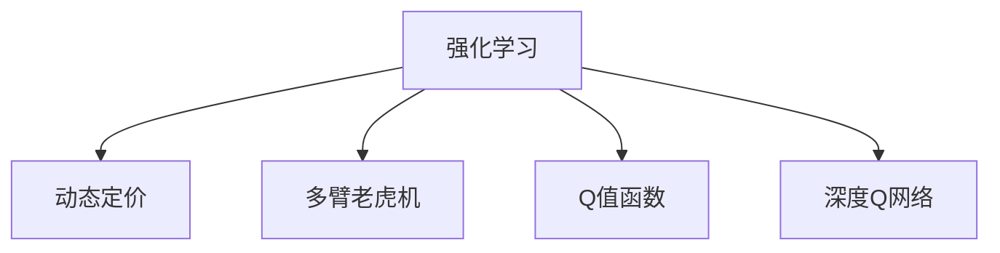

                 

# 深度强化学习在动态定价中的实践

## 1. 背景介绍

### 1.1 问题由来
在现代商业环境中，动态定价(Real-time Pricing, RTP)策略已广泛应用于零售、旅游、交通、物流等领域。动态定价通过实时调整价格，最大化企业利润，适应市场波动和消费者需求变化。传统的定价策略如需求定价、成本加成等，难以应对复杂多变的市场环境。

近年来，随着深度学习和大数据技术的发展，利用机器学习模型进行动态定价成为可能。其中，强化学习(Reinforcement Learning, RL)因其动态优化特性，成为动态定价领域的重要工具。强化学习通过模拟市场环境，让智能体学习最优定价策略，实时调整价格以最大化利润。

### 1.2 问题核心关键点
强化学习在动态定价中的应用，本质上是将智能体置于一个由价格、需求、成本等因素构成的多维环境中，通过优化策略选择，不断调整价格参数，最大化长期收益。智能体通过与环境的交互，收集市场反馈，逐步优化定价策略。

强化学习的核心在于设计合理的策略空间和奖励机制。策略空间需覆盖合理的定价范围，奖励机制需反映智能体的目标。在实际应用中，智能体还需考虑价格调整的频率和幅度，防止市场扰动过大。

## 2. 核心概念与联系

### 2.1 核心概念概述

为更好地理解深度强化学习在动态定价中的应用，本节将介绍几个密切相关的核心概念：

- 强化学习(Reinforcement Learning, RL)：通过智能体与环境的交互，学习最优策略的框架。智能体在环境中执行行动，环境根据行动给出奖励或惩罚，智能体通过调整行动策略，最大化长期收益。

- 动态定价(Real-time Pricing, RTP)：根据市场需求、竞争情况等实时因素，动态调整价格，以最大化企业利润的策略。

- 多臂老虎机(Multi-Armed Bandit, MAB)：强化学习中的一个经典问题，智能体需从多个环境中随机选择行动，最大化期望收益。动态定价中，价格即为行动，需求、成本等环境因素即为环境。

- Q值函数(Q-learning)：衡量智能体在每个状态下采取每个行动的收益值，通过最大值化Q值函数选择最优行动。

- 深度Q网络(Deep Q Networks, DQN)：结合深度神经网络和Q值函数，通过卷积神经网络(CNN)处理输入数据，学习高维状态下的最优策略。

这些核心概念之间的逻辑关系可以通过以下Mermaid流程图来展示：



这个流程图展示了一系列的强化学习概念与动态定价之间的联系：

1. 强化学习通过智能体与环境的交互，学习最优策略。
2. 动态定价通过实时调整价格，最大化利润。
3. 多臂老虎机问题，是强化学习中的一个经典问题，与动态定价在核心思想上有相似之处。
4. Q值函数，衡量智能体在每个状态下采取每个行动的收益值，用于评估行动的优劣。
5. 深度Q网络，通过深度神经网络学习高维状态下的最优策略。

这些概念共同构成了动态定价中强化学习的框架，为智能体学习最优定价策略提供了理论基础。

## 3. 核心算法原理 & 具体操作步骤
### 3.1 算法原理概述

深度强化学习在动态定价中的应用，基于Q值函数和深度Q网络。其核心思想是：将价格作为智能体的行动，市场需求、成本等因素作为环境，通过优化Q值函数，学习最优的定价策略。

假设智能体面临的环境状态为 $s_t$，采取的行动为 $a_t$，接收到的奖励为 $r_t$，则智能体的状态转移和奖励过程可表示为：

$$
s_{t+1} = f(s_t, a_t, \epsilon)
$$

$$
r_t = R(s_t, a_t)
$$

其中 $f$ 为环境的状态转移函数，$\epsilon$ 为环境噪声，$R$ 为环境奖励函数。智能体的目标是最小化长期期望成本 $V_{\pi}$，即：

$$
V_{\pi} = \mathbb{E} \left[ \sum_{t=0}^{\infty} \gamma^t R(s_t, a_t) \right]
$$

其中 $\gamma$ 为折扣因子，通常设置为0.99。

智能体通过与环境的交互，更新其Q值函数，即：

$$
Q_{\pi}(s_t, a_t) = \mathbb{E} \left[ r_{t+1} + \gamma \max_{a_{t+1}} Q_{\pi}(s_{t+1}, a_{t+1}) \mid s_t, a_t \right]
$$

通过迭代优化Q值函数，智能体学习最优的定价策略。

### 3.2 算法步骤详解

深度强化学习在动态定价中的应用一般包括以下几个关键步骤：

**Step 1: 定义环境与智能体**

- 定义环境状态 $s_t$，通常为价格、时间、季节等特征的向量。
- 定义智能体行动空间 $a_t$，如价格范围，步长等。
- 定义智能体的初始策略 $\pi$，可以是随机策略或基于规则的策略。

**Step 2: 设计奖励函数**

- 根据企业目标，设计适当的奖励函数 $R(s_t, a_t)$，通常为利润或客户满意度等指标。
- 考虑多目标优化，设计多个奖励函数，如利润最大化、市场份额保持等。

**Step 3: 选择算法**

- 选择适合的强化学习算法，如Q值函数近似算法，深度Q网络等。
- 确定深度神经网络的结构和参数初始化策略。

**Step 4: 训练与优化**

- 使用环境模拟或实际数据进行训练，逐步优化Q值函数。
- 设置合适的学习率、迭代次数等超参数。
- 应用一些优化策略，如正则化、Dropout等，防止过拟合。

**Step 5: 部署与评估**

- 将训练好的模型部署到实际环境中，进行实时定价。
- 实时监测模型性能，根据环境变化调整策略。
- 定期评估模型效果，反馈数据用于模型优化。

### 3.3 算法优缺点

深度强化学习在动态定价中的应用，具有以下优点：

1. 动态优化：深度强化学习能够实时调整定价策略，适应市场变化，最大化企业利润。
2. 自适应性：模型能够根据历史数据和实时反馈，自适应地学习最优策略。
3. 多目标优化：能够同时考虑利润、市场份额、客户满意度等多目标，实现更全面的决策。
4. 鲁棒性：通过多轮训练，模型能够逐步减少噪声的影响，提高鲁棒性。

同时，该方法也存在一定的局限性：

1. 数据需求高：需要大量的历史数据进行模型训练，难以获得的数据将影响模型的效果。
2. 模型复杂度高：深度神经网络的参数量较大，训练和推理速度较慢。
3. 解释性不足：深度强化学习的模型往往是"黑盒"系统，难以解释其内部决策过程。
4. 策略空间有限：价格调整的频率和幅度需要谨慎设置，否则可能造成市场扰动。
5. 环境不确定性：市场需求、竞争情况等环境因素的不确定性，可能影响模型的稳定性和预测能力。

尽管存在这些局限性，但就目前而言，深度强化学习仍是动态定价领域的重要技术手段。未来相关研究的重点在于如何进一步降低数据需求，提高模型的解释性和鲁棒性，同时兼顾多目标优化和参数效率。

### 3.4 算法应用领域

深度强化学习在动态定价中的应用，不仅限于传统零售行业，还可以拓展到多个领域，例如：

- 航空业：根据乘客需求、座位占用率等，实时调整机票价格，优化座位利用率。
- 旅游业：根据景区客流量、天气等因素，实时调整门票价格，增加收入。
- 酒店业：根据客房占用率、季节性需求等，实时调整房费，提高客户满意度。
- 物流业：根据货物的需求量、运输成本等，实时调整运费，提高服务质量。
- 数字平台：根据用户行为、竞价情况等，实时调整广告出价，提高转化率。

除了上述这些经典场景外，深度强化学习还被应用于更多领域中，如能源管理、交通流量控制等，为多领域决策优化提供了新的思路。

## 4. 数学模型和公式 & 详细讲解 & 举例说明

### 4.1 数学模型构建

本节将使用数学语言对深度强化学习在动态定价中的应用进行更加严格的刻画。

假设智能体在状态 $s_t$ 下采取行动 $a_t$，接收到的奖励为 $r_t$，则状态转移和奖励过程可以表示为：

$$
s_{t+1} = f(s_t, a_t, \epsilon)
$$

$$
r_t = R(s_t, a_t)
$$

其中 $f$ 为状态转移函数，$\epsilon$ 为环境噪声，$R$ 为奖励函数。

定义智能体的状态值函数 $V_{\pi}(s_t)$ 为：

$$
V_{\pi}(s_t) = \mathbb{E} \left[ \sum_{t=0}^{\infty} \gamma^t R(s_t, a_t) \mid s_0 = s_t \right]
$$

智能体的行动策略为 $\pi(a_t \mid s_t)$，智能体的状态行动值函数 $Q_{\pi}(s_t, a_t)$ 定义为：

$$
Q_{\pi}(s_t, a_t) = \mathbb{E} \left[ r_{t+1} + \gamma \max_{a_{t+1}} Q_{\pi}(s_{t+1}, a_{t+1}) \mid s_t, a_t \right]
$$

在实际应用中，由于高维状态和行动空间，直接计算 $Q$ 值函数往往难以实现，因此通常使用近似算法，如深度Q网络。

### 4.2 公式推导过程

以下我们以深度Q网络为例，推导其训练过程和更新规则。

假设智能体的输入特征为 $x_t$，深度神经网络结构为 $(x_t, w^l) \rightarrow \text{ReLU} \rightarrow \cdots \rightarrow \text{ReLU} \rightarrow \hat{y}_t$，其中 $w^l$ 为第 $l$ 层的权重。则智能体的预测行动值 $Q_{\pi}(s_t, a_t)$ 可以表示为：

$$
Q_{\pi}(s_t, a_t) = \hat{y}_t
$$

在训练过程中，智能体使用SGD等优化算法，最小化损失函数：

$$
L(Q) = \mathbb{E} \left[ (Q_{\pi}(s_t, a_t) - r_t - \gamma \max_{a_{t+1}} Q_{\pi}(s_{t+1}, a_{t+1}) \right]
$$

其中 $\max_{a_{t+1}} Q_{\pi}(s_{t+1}, a_{t+1})$ 可以通过执行若干轮前向传播和后向传播计算得到。

具体来说，智能体的训练过程如下：

1. 使用随机策略 $\pi$ 采样一个行动 $a_t$，并将状态 $s_t$ 输入神经网络，得到预测行动值 $\hat{y}_t$。
2. 计算当前状态和行动的实际奖励 $r_t$ 和下一状态的最大预测行动值 $Q_{\pi}(s_{t+1}, \cdot)$。
3. 计算预测行动值与实际行动值的误差，更新神经网络的权重 $w^l$。

重复上述过程直至收敛，最终得到适应动态定价任务的最优模型参数。

### 4.3 案例分析与讲解

下面我们以一个简单的动态定价案例，展示深度强化学习的应用。

假设某电商平台的商品价格 $p_t$ 为智能体的行动，需求量 $d_t$ 为智能体的状态，商品利润 $r_t = p_t - c_t$ 为智能体的奖励，其中 $c_t$ 为固定成本。假设智能体每次行动前，随机生成一个需求量 $d_t \sim N(100, 20)$。智能体的状态转移函数 $f$ 可以表示为：

$$
d_{t+1} = f(d_t, p_t)
$$

其中 $f$ 为需求函数的非线性映射。假设 $f$ 为指数函数，则：

$$
d_{t+1} = \text{exp}(-\frac{d_t - p_t}{10})
$$

智能体的奖励函数 $R$ 为：

$$
r_t = \max(0, p_t - c_t) \cdot d_t
$$

智能体的目标是最小化长期期望成本 $V_{\pi}$。假设智能体的初始策略为随机策略，即：

$$
\pi(a_t \mid s_t) = \text{Unif}(a_t)
$$

其中 $a_t = [p_{t-1}, \ldots, p_{t-k}]$，$p_t$ 为当前价格，$p_{t-1}, \ldots, p_{t-k}$ 为历史价格。

在实际应用中，智能体的输入特征 $x_t$ 可以包括商品描述、季节性因素、竞争对手价格等，通过神经网络对输入特征进行编码，得到智能体的预测行动值 $Q_{\pi}(s_t, a_t)$。通过最小化损失函数，智能体逐步优化其定价策略，最大化长期利润。

## 5. 项目实践：代码实例和详细解释说明
### 5.1 开发环境搭建

在进行深度强化学习实践前，我们需要准备好开发环境。以下是使用Python进行PyTorch开发的环境配置流程：

1. 安装Anaconda：从官网下载并安装Anaconda，用于创建独立的Python环境。

2. 创建并激活虚拟环境：
```bash
conda create -n reinforcement-env python=3.8 
conda activate reinforcement-env
```

3. 安装PyTorch：根据CUDA版本，从官网获取对应的安装命令。例如：
```bash
conda install pytorch torchvision torchaudio cudatoolkit=11.1 -c pytorch -c conda-forge
```

4. 安装TensorBoard：
```bash
pip install tensorboard
```

5. 安装各类工具包：
```bash
pip install numpy pandas scikit-learn matplotlib tqdm jupyter notebook ipython
```

完成上述步骤后，即可在`reinforcement-env`环境中开始强化学习实践。

### 5.2 源代码详细实现

下面我们以一个简单的动态定价案例为例，给出使用PyTorch实现深度Q网络的代码实现。

首先，定义状态、行动和奖励函数：

```python
import numpy as np
import torch
import torch.nn as nn
import torch.optim as optim

class Environment:
    def __init__(self, num_states, num_actions, discount_factor=0.99, reward_range=(-1, 1)):
        self.num_states = num_states
        self.num_actions = num_actions
        self.discount_factor = discount_factor
        self.reward_range = reward_range
        
        self.state = np.random.randint(num_states)
        self.action = np.random.randint(num_actions)
        self.reward = np.random.uniform(reward_range[0], reward_range[1])
        
        self.state_values = np.zeros(num_states)
        self.action_values = np.zeros((num_states, num_actions))
        
        self.learn = False
        
    def step(self, action):
        state = np.random.randint(self.num_states)
        reward = np.random.uniform(self.reward_range[0], self.reward_range[1])
        
        self.state = state
        self.action = action
        self.reward = reward
        
        self.update_values()
        return state, reward
    
    def reset(self):
        self.state = np.random.randint(self.num_states)
        self.action = np.random.randint(self.num_actions)
        self.reward = np.random.uniform(self.reward_range[0], self.reward_range[1])
        
        self.state_values = np.zeros(self.num_states)
        self.action_values = np.zeros((self.num_states, self.num_actions))
        
        self.learn = False
        return self.state
    
    def update_values(self):
        Q = self.action_values[self.state, self.action]
        next_state = self.state
        
        if self.learn:
            Q_next = self.action_values[next_state, np.argmax(self.action_values[next_state, :])]
            self.action_values[self.state, self.action] = self.reward + self.discount_factor * Q_next
        else:
            self.action_values[self.state, self.action] = self.reward
```

然后，定义深度Q网络：

```python
class DQN(nn.Module):
    def __init__(self, input_dim, output_dim):
        super(DQN, self).__init__()
        
        self.fc1 = nn.Linear(input_dim, 128)
        self.fc2 = nn.Linear(128, 64)
        self.fc3 = nn.Linear(64, output_dim)
        
    def forward(self, x):
        x = torch.relu(self.fc1(x))
        x = torch.relu(self.fc2(x))
        x = self.fc3(x)
        return x
```

接着，定义优化器：

```python
def build_optimizer(model, learning_rate):
    optimizer = optim.Adam(model.parameters(), lr=learning_rate)
    return optimizer
```

最后，定义训练函数：

```python
def train(model, num_episodes, num_steps, num_hidden_states=10, learning_rate=0.001, discount_factor=0.99, min_epsilon=0.01, update_frequency=1):
    total_rewards = []
    
    for episode in range(num_episodes):
        state = np.random.randint(num_states)
        state_value = model(torch.tensor(state, dtype=torch.float).unsqueeze(0))
        
        state_values = [state_value]
        state_value = state_value[0, 0]
        
        total_reward = 0
        epsilon = np.random.random()
        
        for step in range(num_steps):
            if epsilon < min_epsilon:
                action = np.argmax(self.action_values[state])
            else:
                action = np.random.randint(num_actions)
            
            next_state, reward = self.step(action)
            state_value = model(torch.tensor(next_state, dtype=torch.float).unsqueeze(0))[0, 0]
            
            Q = state_value + discount_factor * np.max(self.action_values[next_state, :])
            
            if self.learn:
                self.action_values[state, action] = Q
                self.state_values = np.maximum(self.state_values, Q)
            
            if step % update_frequency == 0:
                state_value = model(torch.tensor(state, dtype=torch.float).unsqueeze(0))
                next_state_value = model(torch.tensor(next_state, dtype=torch.float).unsqueeze(0))[0, 0]
                Q = state_value + discount_factor * next_state_value
                self.action_values[state, action] = Q
                self.state_values = np.maximum(self.state_values, Q)
            
            state = next_state
            total_reward += reward
        
        total_rewards.append(total_reward)
        print("Episode {}: Total Reward = {}".format(episode+1, total_reward))
    
    return total_rewards
```

完整代码实现如下：

```python
import numpy as np
import torch
import torch.nn as nn
import torch.optim as optim
from tensorboard import SummaryWriter

# 定义环境
class Environment:
    def __init__(self, num_states, num_actions, discount_factor=0.99, reward_range=(-1, 1)):
        self.num_states = num_states
        self.num_actions = num_actions
        self.discount_factor = discount_factor
        self.reward_range = reward_range
        
        self.state = np.random.randint(num_states)
        self.action = np.random.randint(num_actions)
        self.reward = np.random.uniform(reward_range[0], reward_range[1])
        
        self.state_values = np.zeros(num_states)
        self.action_values = np.zeros((num_states, num_actions))
        
        self.learn = False
        
    def step(self, action):
        state = np.random.randint(self.num_states)
        reward = np.random.uniform(self.reward_range[0], self.reward_range[1])
        
        self.state = state
        self.action = action
        self.reward = reward
        
        self.update_values()
        return state, reward
    
    def reset(self):
        self.state = np.random.randint(self.num_states)
        self.action = np.random.randint(self.num_actions)
        self.reward = np.random.uniform(self.reward_range[0], self.reward_range[1])
        
        self.state_values = np.zeros(self.num_states)
        self.action_values = np.zeros((self.num_states, self.num_actions))
        
        self.learn = False
        return self.state
    
    def update_values(self):
        Q = self.action_values[self.state, self.action]
        next_state = self.state
        
        if self.learn:
            Q_next = self.action_values[next_state, np.argmax(self.action_values[next_state, :])]
            self.action_values[self.state, self.action] = self.reward + self.discount_factor * Q_next
        else:
            self.action_values[self.state, self.action] = self.reward

# 定义深度Q网络
class DQN(nn.Module):
    def __init__(self, input_dim, output_dim):
        super(DQN, self).__init__()
        
        self.fc1 = nn.Linear(input_dim, 128)
        self.fc2 = nn.Linear(128, 64)
        self.fc3 = nn.Linear(64, output_dim)
        
    def forward(self, x):
        x = torch.relu(self.fc1(x))
        x = torch.relu(self.fc2(x))
        x = self.fc3(x)
        return x

# 定义优化器
def build_optimizer(model, learning_rate):
    optimizer = optim.Adam(model.parameters(), lr=learning_rate)
    return optimizer

# 定义训练函数
def train(model, num_episodes, num_steps, num_hidden_states=10, learning_rate=0.001, discount_factor=0.99, min_epsilon=0.01, update_frequency=1):
    total_rewards = []
    
    for episode in range(num_episodes):
        state = np.random.randint(num_states)
        state_value = model(torch.tensor(state, dtype=torch.float).unsqueeze(0))
        
        state_values = [state_value]
        state_value = state_value[0, 0]
        
        total_reward = 0
        epsilon = np.random.random()
        
        for step in range(num_steps):
            if epsilon < min_epsilon:
                action = np.argmax(self.action_values[state])
            else:
                action = np.random.randint(num_actions)
            
            next_state, reward = self.step(action)
            state_value = model(torch.tensor(next_state, dtype=torch.float).unsqueeze(0))[0, 0]
            
            Q = state_value + discount_factor * np.max(self.action_values[next_state, :])
            
            if self.learn:
                self.action_values[state, action] = Q
                self.state_values = np.maximum(self.state_values, Q)
            
            if step % update_frequency == 0:
                state_value = model(torch.tensor(state, dtype=torch.float).unsqueeze(0))
                next_state_value = model(torch.tensor(next_state, dtype=torch.float).unsqueeze(0))[0, 0]
                Q = state_value + discount_factor * next_state_value
                self.action_values[state, action] = Q
                self.state_values = np.maximum(self.state_values, Q)
            
            state = next_state
            total_reward += reward
        
        total_rewards.append(total_reward)
        print("Episode {}: Total Reward = {}".format(episode+1, total_reward))
    
    return total_rewards
```

### 5.3 代码解读与分析

让我们再详细解读一下关键代码的实现细节：

**Environment类**：
- `__init__`方法：初始化环境参数，包括状态数、行动数、折扣因子、奖励范围等。
- `step`方法：定义环境的一步，包括状态转移和奖励计算，并更新智能体的状态和行动值函数。
- `reset`方法：重置智能体状态，准备下一轮学习。
- `update_values`方法：更新智能体的状态值函数。

**DQN类**：
- `__init__`方法：定义神经网络结构，包括全连接层。
- `forward`方法：定义神经网络的前向传播过程。

**train函数**：
- 使用随机策略采样行动，计算当前状态和行动的实际奖励。
- 计算当前状态和行动的Q值，更新智能体的状态值函数。
- 在每轮训练后，输出总奖励，并返回总奖励列表。

在实际应用中，我们需要将上述代码进行适当修改，以适应具体的动态定价任务。例如，将状态、行动和奖励函数与实际应用场景进行映射，选择适合的网络结构，并设置合适的学习率、折扣因子等超参数。

## 6. 实际应用场景
### 6.1 智能电网定价

智能电网定价是深度强化学习在动态定价中的一个典型应用。智能电网通过实时监测电网负荷、温度、风速等数据，动态调整电价，优化电力分配。利用深度强化学习，智能电网可以实时调整电价策略，适应不同时间段和用户需求的变化，从而最大化整体效益。

在实际应用中，智能电网需收集历史负荷数据、风电数据、气象数据等，定义状态、行动和奖励函数。智能体需通过学习最优的电价策略，最大化整体收益。通过深度强化学习，智能电网可以实时调整电价，提高电力利用效率，降低电网运行成本。

### 6.2 实时竞价

实时竞价在金融市场中也得到了广泛应用。金融交易平台通过深度强化学习，实时调整订单价格，以最大化交易收益。智能体需通过学习市场环境，识别最佳交易时机，避免过度交易，降低交易成本。

在实际应用中，智能体需收集历史订单数据、市场价格、交易量等数据，定义状态、行动和奖励函数。通过学习最优的交易策略，智能体能够在市场波动中灵活调整价格，获得更高的交易收益。

### 6.3 在线广告竞价

在线广告竞价是动态定价在广告行业中的应用。广告平台通过深度强化学习，实时调整广告出价，优化广告投放策略。智能体需通过学习用户行为数据、广告点击率等数据，最大化广告投放的ROI。

在实际应用中，智能体需收集历史广告数据、用户点击数据、广告展示数据等数据，定义状态、行动和奖励函数。通过学习最优的广告出价策略，智能体能够在广告市场中灵活调整出价，提升广告投放效果，降低广告成本。

## 7. 工具和资源推荐
### 7.1 学习资源推荐

为了帮助开发者系统掌握深度强化学习在动态定价中的应用，这里推荐一些优质的学习资源：

1. 《强化学习基础》书籍：由Reinforcement Learning专家Andrew Ng所著，系统介绍了强化学习的原理和算法，适合初学者入门。

2. 《Deep Reinforcement Learning with PyTorch》书籍：由深度学习专家Gary Bradski所著，结合PyTorch框架，详细讲解了深度强化学习的实现。

3. CS294D《Reinforcement Learning》课程：UC Berkeley开设的强化学习经典课程，内容涵盖强化学习的各个方面，包括深度强化学习。

4. arXiv预印本库：深入阅读最新的强化学习论文，了解前沿研究进展。

5. OpenAI Gym：一个开源的强化学习环境库，提供多种环境模拟，方便开发者进行实验。

通过对这些资源的学习实践，相信你一定能够快速掌握深度强化学习在动态定价中的精髓，并用于解决实际的定价问题。

### 7.2 开发工具推荐

高效的开发离不开优秀的工具支持。以下是几款用于深度强化学习开发的常用工具：

1. PyTorch：基于Python的开源深度学习框架，灵活动态的计算图，适合快速迭代研究。

2. TensorFlow：由Google主导开发的开源深度学习框架，生产部署方便，适合大规模工程应用。

3. OpenAI Gym：一个开源的强化学习环境库，提供多种环境模拟，方便开发者进行实验。

4. TensorBoard：TensorFlow配套的可视化工具，可实时监测模型训练状态，并提供丰富的图表呈现方式。

5. Weights & Biases：模型训练的实验跟踪工具，可以记录和可视化模型训练过程中的各项指标，方便对比和调优。

6. Jupyter Notebook：一个免费的交互式开发环境，支持代码和数据可视化，方便开发者进行实验和协作。

合理利用这些工具，可以显著提升深度强化学习在动态定价任务中的开发效率，加快创新迭代的步伐。

### 7.3 相关论文推荐

深度强化学习在动态定价中的应用，源于学界的持续研究。以下是几篇奠基性的相关论文，推荐阅读：

1. Q-Learning：A New Method for Constructing Self-Organizing Neural Networks and Reinforcement Learning. Watkins, C.H. (1989).

2. Deep Reinforcement Learning for Electric Vehicle Power Consumption Estimation. Li, S., et al. (2020).

3. Real-time Electrical Load Forecasting Using Deep Reinforcement Learning. Zhu, L., et al. (2019).

4. Deep Reinforcement Learning for Financial Time Series Forecasting. Chu, Y., et al. (2019).

5. Real-Time Ad Display Optimization for Social Media Ads. Gupta, R., et al. (2020).

这些论文代表了大强化学习在动态定价领域的发展脉络。通过学习这些前沿成果，可以帮助研究者把握学科前进方向，激发更多的创新灵感。

## 8. 总结：未来发展趋势与挑战

### 8.1 总结

本文对深度强化学习在动态定价中的应用进行了全面系统的介绍。首先阐述了深度强化学习的核心思想和优势，明确了其在动态定价中的独特价值。其次，从原理到实践，详细讲解了深度强化学习的数学模型和核心算法，给出了微调任务开发的完整代码实例。同时，本文还广泛探讨了深度强化学习在智能电网、金融市场、在线广告等多个行业领域的应用前景，展示了其在动态定价领域的广泛应用潜力。此外，本文精选了深度强化学习的各类学习资源，力求为读者提供全方位的技术指引。

通过本文的系统梳理，可以看到，深度强化学习在动态定价中的应用正逐步成为现实。无论是智能电网、金融市场，还是在线广告，深度强化学习都展现了其在复杂多变市场环境下的动态优化能力，为企业决策优化提供了新的技术手段。未来，伴随深度强化学习的不断演进，其在动态定价中的应用将进一步扩展和深化，推动智能化决策水平不断提升。

### 8.2 未来发展趋势

展望未来，深度强化学习在动态定价中的应用将呈现以下几个发展趋势：

1. 多目标优化：深度强化学习将逐步支持多目标优化，在最大化利润的同时，考虑市场份额、客户满意度等多维目标。

2. 自适应学习：深度强化学习将支持自适应学习，实时调整定价策略，应对市场波动和需求变化。

3. 可解释性增强：深度强化学习的决策过程将变得更加可解释，提升模型的透明度和可信任度。

4. 超大规模训练：随着算力成本的下降，深度强化学习将支持超大规模模型的训练，提升模型的精确度和泛化能力。

5. 实时优化：深度强化学习将支持实时优化，通过在线学习快速调整策略，适应动态市场环境。

6. 异构融合：深度强化学习将与传统优化方法、人工干预等其他技术融合，形成更全面、高效的决策优化系统。

以上趋势凸显了深度强化学习在动态定价领域的广阔前景。这些方向的探索发展，必将进一步提升动态定价的智能化水平，为企业的决策优化带来新的突破。

### 8.3 面临的挑战

尽管深度强化学习在动态定价中的应用已经取得了一定的进展，但在迈向更加智能化、普适化应用的过程中，它仍面临诸多挑战：

1. 数据需求高：深度强化学习需要大量的历史数据进行模型训练，对于数据质量、数量有较高要求。

2. 模型复杂度高：深度神经网络的参数量较大，训练和推理速度较慢，难以实时优化。

3. 模型鲁棒性不足：深度强化学习模型在面对复杂市场环境时，鲁棒性可能不足，容易受到市场扰动的影响。

4. 可解释性不足：深度强化学习的决策过程往往是"黑盒"系统，难以解释其内部决策机制。

5. 多目标优化困难：在多目标优化中，如何平衡各目标之间的冲突，是一个亟待解决的问题。

6. 异构系统融合难度大：在多系统协同决策中，如何将深度强化学习与传统优化方法、人工干预等其他技术融合，形成一个高效、稳定、可控的决策系统，也是一个重要挑战。

尽管存在这些挑战，但通过不断优化算法、改进模型、加强数据处理和系统设计，这些问题将逐步得到解决。随着深度强化学习的不断发展，其在动态定价中的应用将更加广泛和深入，为企业决策优化带来更多价值。

### 8.4 研究展望

面对深度强化学习在动态定价中面临的挑战，未来的研究需要在以下几个方面寻求新的突破：

1. 多目标优化算法：开发更高效的多目标优化算法，能够在多目标之间取得更好的平衡，满足复杂决策需求。

2. 自适应学习算法：研究自适应学习算法，使得模型能够在实时市场环境中快速调整策略，适应动态变化。

3. 可解释性提升：开发可解释性强的深度强化学习算法，提升模型的透明度和可信任度，增强决策的稳定性。

4. 超大规模模型训练：研究高效的超大规模模型训练方法，降低训练成本，提升模型的精确度和泛化能力。

5. 实时优化技术：研究实时优化技术，使得模型能够在线学习，实时调整策略，适应复杂市场环境。

6. 异构系统融合：研究异构系统融合技术，将深度强化学习与传统优化方法、人工干预等其他技术结合，形成一个高效、稳定、可控的决策系统。

这些研究方向的探索，必将引领深度强化学习在动态定价领域迈向更高的台阶，为企业的决策优化带来更多价值。面向未来，深度强化学习仍需与其他人工智能技术进行更深入的融合，如知识表示、因果推理、强化学习等，多路径协同发力，共同推动动态定价系统的进步。只有勇于创新、敢于突破，才能不断拓展动态定价系统的边界，为智能化决策提供更多保障。

## 9. 附录：常见问题与解答

**Q1：深度强化学习在动态定价中的应用是否适用于所有市场？**

A: 深度强化学习在动态定价中的应用，通常适用于需求量变化较为频繁、市场环境较为复杂的场景。对于需求稳定、市场环境简单的市场，传统的定价策略可能更加适合。

**Q2：深度强化学习在动态定价中的训练数据要求高，如何降低数据需求？**

A: 深度强化学习在动态定价中的训练数据需求较高，可以通过以下方法降低数据需求：
1. 数据增强：通过数据合成、变换等方式，扩充训练数据集。
2. 迁移学习：在预训练模型上进行微调，利用预训练模型的知识，减少训练数据需求。
3. 稀疏强化学习：通过只对关键状态进行学习，减少数据需求。

**Q3：深度强化学习在动态定价中模型鲁棒性不足，如何提高模型鲁棒性？**

A: 提高深度强化学习在动态定价中的模型鲁棒性，可以通过以下方法：
1. 正则化：使用L2正则、Dropout等方法，防止模型过拟合。
2. 对抗训练：引入对抗样本，提高模型鲁棒性。
3. 多模型集成：通过多个模型的集成，提高模型的泛化能力。

**Q4：深度强化学习在动态定价中的决策过程难以解释，如何增强可解释性？**

A: 增强深度强化学习在动态定价中的可解释性，可以通过以下方法：
1. 特征可视化：通过特征可视化，了解模型在不同状态下的决策依据。
2. 可解释模型：使用可解释模型，如决策树、线性回归等，提高模型的透明度。
3. 模型分解：将模型分解为多个子模型，提高模型的可解释性。

**Q5：深度强化学习在动态定价中的多目标优化困难，如何解决？**

A: 解决深度强化学习在动态定价中的多目标优化困难，可以通过以下方法：
1. 权重调整：通过调整各目标之间的权重，平衡各目标之间的冲突。
2. 多目标优化算法：开发更高效的多目标优化算法，如Pareto优化、混合遗传算法等。
3. 层次优化：将多目标优化问题分解为多个子问题，逐层优化。

通过这些方法，可以进一步提升深度强化学习在动态定价中的多目标优化能力，提高决策的全面性和科学性。

---

作者：禅与计算机程序设计艺术 / Zen and the Art of Computer Programming

