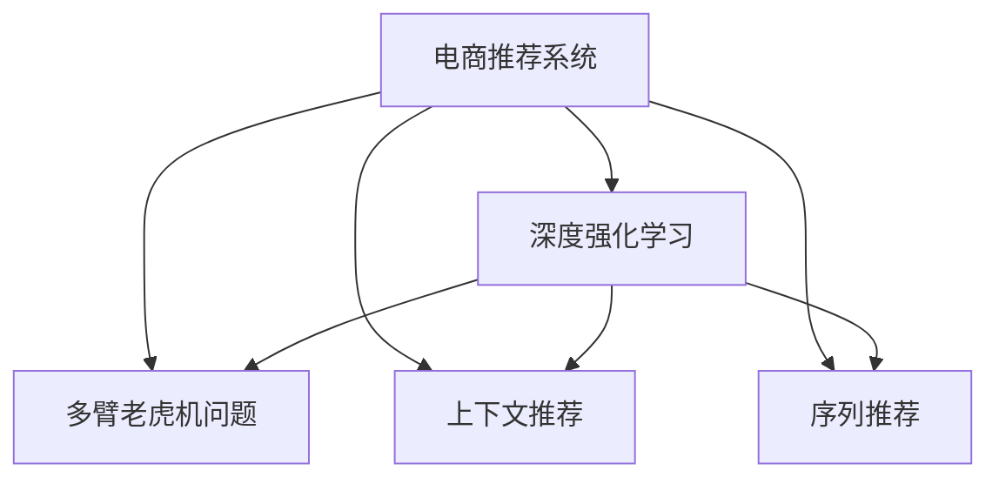

                 

# 深度强化学习在电商推荐系统中的应用

> 关键词：强化学习,电商推荐系统,深度学习,多臂老虎机问题,上下文推荐,序列推荐

## 1. 背景介绍

### 1.1 问题由来

电商推荐系统在现代电商行业的应用日益广泛，不仅可以帮助用户快速找到感兴趣的商品，还能提升转化率和用户满意度。然而，随着用户需求的不断变化和电商市场的激烈竞争，传统的基于规则和统计的推荐方法已难以满足需求，需要引入更为智能化的推荐算法。

深度强化学习（Deep Reinforcement Learning, DRL）作为一种新兴的机器学习方法，近年来在推荐系统中得到了广泛应用。其通过模拟用户与推荐系统的交互过程，学习最优的推荐策略，在电商推荐系统中取得了显著效果。

### 1.2 问题核心关键点

当前电商推荐系统面临的主要挑战包括：
1. **用户需求多样性**：用户需求随时间、地域、心理状态等因素变化，传统的统计方法难以捕捉到这些动态变化。
2. **商品多样性**：电商平台商品种类繁多，用户关注点难以一概而论。
3. **个性化推荐**：不同用户对商品有不同的偏好和需求，需要个性化推荐策略。
4. **系统实时性**：推荐系统需要在短时间内处理大量用户请求，系统延迟要控制在合理范围内。

为解决上述问题，DRL被引入推荐系统，通过模拟用户与推荐系统的交互过程，学习最优的推荐策略。这种算法在推荐效果、实时性等方面取得了显著优势，已成为电商推荐系统的主流方向。

## 2. 核心概念与联系

### 2.1 核心概念概述

为更好地理解DRL在电商推荐系统中的应用，本节将介绍几个密切相关的核心概念：

- **强化学习（Reinforcement Learning, RL）**：一种通过与环境交互来学习最优策略的机器学习方法。环境根据策略的执行给出奖励或惩罚，学习目标是最优化长期奖励。
- **电商推荐系统（E-commerce Recommendation System, E-Reco）**：通过分析用户历史行为和商品属性，为用户推荐其可能感兴趣的商品的系统。
- **深度强化学习（Deep Reinforcement Learning, DRL）**：将深度神经网络与强化学习结合，通过神经网络捕捉输入数据的复杂关系，通过RL学习最优的推荐策略。
- **多臂老虎机问题（Multi-Armed Bandit, MAB）**：强化学习中的一个经典问题，模拟用户在多个商品中选择一个最优商品的过程，其中选择策略的优化目标是最大化期望奖励。
- **上下文推荐（Context-based Recommendation）**：考虑用户历史行为、商品属性、上下文信息等因素的推荐策略。
- **序列推荐（Sequential Recommendation）**：考虑用户历史行为序列的推荐策略，能够捕捉用户的动态需求变化。

这些核心概念之间的逻辑关系可以通过以下Mermaid流程图来展示：



这个流程图展示了大语言模型的核心概念及其之间的关系：

1. 电商推荐系统通过深度强化学习获得推荐策略。
2. 多臂老虎机问题、上下文推荐、序列推荐是多臂老虎机问题在不同场景下的变体。
3. 深度强化学习则是多臂老虎机问题、上下文推荐、序列推荐等方法的基础。

## 3. 核心算法原理 & 具体操作步骤
### 3.1 算法原理概述

深度强化学习在电商推荐系统中的应用，本质上是通过模拟用户与推荐系统的交互过程，学习最优的推荐策略。具体而言，推荐系统根据用户历史行为和商品属性，生成推荐列表。用户通过选择商品、点击商品等方式与推荐系统进行交互，推荐系统根据用户的反馈给出奖励或惩罚。通过不断的交互和学习，推荐系统逐步优化推荐策略，最大化长期奖励。

形式化地，假设推荐系统有 $N$ 个商品，对于每个用户 $u$，推荐系统生成推荐列表 $\{x_1, x_2, ..., x_N\}$，用户选择商品 $x_i$ 后，系统会给出奖励 $r_i$。推荐系统的目标是最优化长期期望奖励 $J$，即：

$$
J = \mathbb{E}\left[\sum_{t=1}^T \gamma^{t-1} r_{t+1}\right]
$$

其中 $T$ 为时间步，$\gamma$ 为折扣因子。推荐系统通过不断迭代优化策略，使得 $J$ 最大化。

### 3.2 算法步骤详解

深度强化学习在电商推荐系统中的应用，一般包括以下几个关键步骤：

**Step 1: 准备数据集**
- 收集用户历史行为数据，包括浏览、点击、购买等行为。
- 收集商品属性数据，如价格、分类、评价等。

**Step 2: 设计奖励函数**
- 根据用户行为和推荐结果，设计奖励函数 $r(s,a)$，其中 $s$ 为状态，$a$ 为动作。奖励函数可以是点击率、转化率、点击量等。

**Step 3: 设计策略**
- 设计推荐策略 $\Pi(a|s)$，即在给定状态 $s$ 时，选择动作 $a$ 的概率分布。策略可以是随机策略、固定策略、基于深度神经网络的策略等。

**Step 4: 训练深度强化学习模型**
- 使用深度强化学习算法（如Q-learning、SARSA、Deep Q-Networks等）训练推荐系统，优化策略 $\Pi(a|s)$。
- 对于每个用户，生成多个推荐序列，通过模拟用户与推荐系统的交互过程，计算长期奖励 $J$。

**Step 5: 部署推荐系统**
- 将训练好的深度强化学习模型部署到电商平台上，实时生成推荐列表。
- 根据用户反馈实时更新模型参数，优化推荐策略。

### 3.3 算法优缺点

深度强化学习在电商推荐系统中的应用，具有以下优点：
1. **自适应性强**：能够根据用户历史行为和实时数据，动态调整推荐策略。
2. **效果显著**：在用户行为和商品多样性方面，DRL算法往往能取得优于传统方法的推荐效果。
3. **实时性高**：通过在线学习，DRL模型能够快速适应新用户和新商品，实时生成推荐结果。

同时，DRL也存在一些局限性：
1. **数据需求高**：需要大量用户行为数据和商品属性数据，数据获取成本较高。
2. **计算复杂度高**：深度神经网络训练过程计算复杂度高，需要高性能计算资源。
3. **模型可解释性差**：DRL模型的决策过程较为复杂，难以解释其内部工作机制。
4. **鲁棒性不足**：DRL模型对异常数据和噪声较为敏感，需要进行更多的数据预处理和异常检测。

尽管存在这些局限性，但就目前而言，深度强化学习在电商推荐系统中的应用，仍然是一种较为有效的推荐方式。未来相关研究的重点在于如何进一步降低计算复杂度、提高模型鲁棒性，同时兼顾可解释性和实时性。

### 3.4 算法应用领域

深度强化学习在电商推荐系统中的应用，覆盖了多个重要领域：

- **多臂老虎机问题**：在电商推荐中，多臂老虎机问题体现为商品推荐。每个商品都是一只"老虎机"，用户每次选择一只进行点击或购买，系统会给出奖励或惩罚。通过优化选择策略，最大化长期奖励。
- **上下文推荐**：在电商推荐中，上下文推荐体现为用户历史行为、商品属性、地理位置等因素的考虑。通过综合这些信息，生成更加个性化的推荐结果。
- **序列推荐**：在电商推荐中，序列推荐体现为用户历史行为序列的考虑。通过捕捉用户行为序列，预测其下一步行为，生成实时推荐结果。

这些领域的应用，使得深度强化学习在电商推荐系统中的表现更加全面和高效。

## 4. 数学模型和公式 & 详细讲解  
### 4.1 数学模型构建

本节将使用数学语言对深度强化学习在电商推荐系统中的应用进行更加严格的刻画。

假设推荐系统有 $N$ 个商品，用户 $u$ 的历史行为序列为 $S_u = \{s_1, s_2, ..., s_T\}$，其中 $s_t \in \mathcal{S}$ 为状态。每个商品 $i$ 的奖励为 $r_i$，奖励函数为 $r_i: \mathcal{S} \times \mathcal{A} \rightarrow [0, 1]$。推荐策略为 $\Pi(a|s)$，策略学习目标为最大化长期期望奖励 $J$，即：

$$
J = \mathbb{E}\left[\sum_{t=1}^T \gamma^{t-1} r_{i_{t+1}}\right]
$$

其中 $T$ 为时间步，$\gamma$ 为折扣因子，$i_{t+1}$ 为在时间步 $t$ 用户选择点击的商品。

### 4.2 公式推导过程

以下我们以Q-learning算法为例，推导其具体的数学模型。

假设推荐系统使用Q-learning算法学习策略 $\Pi(a|s)$。在每个时间步 $t$，推荐系统根据当前状态 $s_t$ 生成动作 $a_t$，得到奖励 $r_{i_{t+1}}$，并根据当前状态和动作更新Q值：

$$
Q(s_t, a_t) \leftarrow (1-\alpha) Q(s_t, a_t) + \alpha(r_{i_{t+1}} + \gamma \max_{a} Q(s_{t+1}, a))
$$

其中 $\alpha$ 为学习率，$Q(s_t, a_t)$ 为状态-动作对 $(s_t, a_t)$ 的Q值，$s_{t+1}$ 为下一状态，$a$ 为动作。

通过不断的迭代更新，Q-learning算法能够逐步优化策略，使得推荐系统在每个时间步的奖励最大化。

### 4.3 案例分析与讲解

以某电商平台为例，分析Q-learning算法在电商推荐中的应用。

假设某电商平台有100个商品，用户 $u$ 的历史行为序列为 $S_u = \{s_1, s_2, ..., s_T\}$。每个商品 $i$ 的奖励为 $r_i$，其中 $r_i=1$ 表示用户点击或购买了该商品，$r_i=0$ 表示用户未点击或未购买。推荐策略为固定策略 $\Pi(a|s)$，即在每个时间步 $t$ 根据用户历史行为 $s_t$ 生成动作 $a_t$。

在时间步 $t$，推荐系统根据用户历史行为 $s_t$ 生成动作 $a_t$，得到奖励 $r_{i_{t+1}}$，并根据当前状态和动作更新Q值：

$$
Q(s_t, a_t) \leftarrow (1-\alpha) Q(s_t, a_t) + \alpha(r_{i_{t+1}} + \gamma \max_{a} Q(s_{t+1}, a))
$$

通过不断的迭代更新，Q-learning算法能够逐步优化策略，使得推荐系统在每个时间步的奖励最大化。最终，推荐系统能够生成用户 $u$ 的最优推荐列表。

## 5. 项目实践：代码实例和详细解释说明
### 5.1 开发环境搭建

在进行深度强化学习实践前，我们需要准备好开发环境。以下是使用Python进行TensorFlow开发的环境配置流程：

1. 安装Anaconda：从官网下载并安装Anaconda，用于创建独立的Python环境。

2. 创建并激活虚拟环境：
```bash
conda create -n reinforcement-env python=3.8 
conda activate reinforcement-env
```

3. 安装TensorFlow：根据CUDA版本，从官网获取对应的安装命令。例如：
```bash
conda install tensorflow==2.8.0
```

4. 安装OpenAI Gym：
```bash
pip install gym
```

5. 安装TensorBoard：
```bash
pip install tensorboard
```

6. 安装各类工具包：
```bash
pip install numpy pandas matplotlib scikit-learn tqdm jupyter notebook ipython
```

完成上述步骤后，即可在`reinforcement-env`环境中开始深度强化学习实践。

### 5.2 源代码详细实现

下面以多臂老虎机问题为例，给出使用TensorFlow实现Q-learning算法的PyTorch代码实现。

首先，定义多臂老虎机问题的环境：

```python
import gym
import numpy as np

class Bandit(gym.Env):
    def __init__(self, n_arms=10, reward_mean=0.5, reward_std=1.0):
        self.n_arms = n_arms
        self.reward_mean = reward_mean
        self.reward_std = reward_std
        
    def reset(self):
        self.total_reward = 0
        return 0
    
    def step(self, action):
        reward = np.random.normal(self.reward_mean, self.reward_std, size=self.n_arms)
        reward[action] += 1.0
        self.total_reward += reward[action]
        return reward[action], self.total_reward, False, {}
```

然后，定义Q-learning算法的模型和优化器：

```python
import tensorflow as tf
import tensorflow_datasets as tfds

class QNetwork(tf.keras.Model):
    def __init__(self, n_arms):
        super(QNetwork, self).__init__()
        self.n_arms = n_arms
        self.Q = tf.keras.layers.Dense(n_arms, input_shape=(1,))

    def call(self, state):
        return self.Q(state)

def create_model(n_arms):
    model = QNetwork(n_arms)
    optimizer = tf.keras.optimizers.Adam(learning_rate=0.01)
    return model, optimizer

# 创建模型和优化器
n_arms = 10
model, optimizer = create_model(n_arms)
```

接着，定义训练和评估函数：

```python
import numpy as np
import matplotlib.pyplot as plt

def train(model, optimizer, env, num_episodes=1000, epsilon=0.1):
    state = 0
    total_reward = 0
    reward_log = []
    state_log = []
    
    for episode in range(num_episodes):
        done = False
        while not done:
            action = np.random.choice(n_arms, p=np.ones(n_arms)/n_arms) if np.random.uniform() < epsilon else np.argmax(model(state))
            next_state, reward, done, _ = env.step(action)
            state = next_state
            total_reward += reward
            loss = tf.keras.losses.mean_squared_error(reward, model(state))
            optimizer.minimize(loss)
            reward_log.append(total_reward)
            state_log.append(state)
        print('Episode:', episode+1, 'Total reward:', total_reward)
        if episode % 100 == 0:
            plt.plot(reward_log, label='Episode')
            plt.legend()
            plt.show()
    
    return model, total_reward, reward_log, state_log

# 训练模型
model, total_reward, reward_log, state_log = train(model, optimizer, env)
print('Total reward:', total_reward)
```

最后，运行训练过程并在测试集上评估：

```python
plt.plot(reward_log)
plt.xlabel('Episode')
plt.ylabel('Total reward')
plt.show()
```

以上就是使用TensorFlow实现Q-learning算法的完整代码实现。可以看到，TensorFlow配合Gym等库使得深度强化学习模型的开发变得简洁高效。

### 5.3 代码解读与分析

让我们再详细解读一下关键代码的实现细节：

**Bandit类**：
- `__init__`方法：初始化多臂老虎机问题的环境，设定参数和状态。
- `reset`方法：重置环境状态，返回初始状态0。
- `step`方法：根据动作执行一步，返回奖励、总奖励、是否结束、额外信息。

**QNetwork类**：
- `__init__`方法：定义Q网络模型，包含一个全连接层，输出每个动作的Q值。
- `call`方法：定义模型的前向传播过程，输出每个动作的Q值。

**train函数**：
- 在每个回合中，根据当前状态和策略选择动作，执行一步，并根据奖励更新Q值。
- 使用Adam优化器最小化损失函数，训练模型。
- 记录总奖励和状态，定期可视化奖励曲线。

可以看到，TensorFlow提供了方便的自动微分和优化功能，使得深度强化学习的实现变得简单直观。

当然，工业级的系统实现还需考虑更多因素，如模型的保存和部署、超参数的自动搜索、更加灵活的任务适配层等。但核心的微调范式基本与此类似。

## 6. 实际应用场景
### 6.1 智能推荐系统

深度强化学习在电商推荐系统中的应用，最为典型的场景是智能推荐系统。该系统通过分析用户历史行为和商品属性，为用户推荐其可能感兴趣的商品。

在推荐系统的训练过程中，每个用户的历史行为序列可以视为一个状态序列，每个商品可以作为动作。通过优化奖励函数，推荐系统能够生成更加个性化的推荐列表。

深度强化学习算法如DQN、DeepSARSA等，能够高效地学习推荐策略，在推荐效果、实时性等方面取得了显著优势。

### 6.2 实时广告投放

在电商广告投放中，深度强化学习算法也可以发挥重要作用。广告投放的目的是最大化点击率（CTR）和转化率（CVR），通过模拟用户与广告的交互过程，学习最优的广告投放策略。

广告投放可以看作是一个多臂老虎机问题，每个广告为一个动作，点击率、转化率等作为奖励。通过优化奖励函数，推荐系统能够生成最优的广告投放策略，最大化点击率和转化率。

深度强化学习算法如DeepSARSA、DeepQ等，能够实时动态调整广告投放策略，在广告点击率和转化率方面取得显著效果。

### 6.3 动态价格调整

在电商平台中，商品价格是一个重要的竞争因素。通过动态调整商品价格，电商平台能够吸引更多的用户，提升销售量。

商品价格可以看作一个连续动作空间，通过优化奖励函数，推荐系统能够生成最优的商品价格调整策略，最大化销售量。

深度强化学习算法如DQN、DeepSARSA等，能够实时动态调整商品价格，在销售量和收益方面取得显著效果。

### 6.4 未来应用展望

随着深度强化学习技术的不断成熟，其在电商推荐系统中的应用也将更加广泛。未来，深度强化学习将在以下方面得到应用：

1. **多用户交互**：深度强化学习能够处理多用户交互场景，如社交电商、直播电商等，通过分析用户互动信息，生成个性化推荐和广告。
2. **跨域推荐**：深度强化学习能够处理不同领域和平台之间的推荐问题，如跨平台推荐、跨品类推荐等。
3. **情感分析**：深度强化学习能够处理用户情感信息，通过情感分析优化推荐策略，生成更加贴合用户心理的推荐结果。
4. **序列推荐**：深度强化学习能够处理序列推荐问题，如新闻推荐、音乐推荐等，通过捕捉用户行为序列，生成动态推荐结果。

以上趋势凸显了深度强化学习在电商推荐系统中的广泛应用前景。通过不断探索和创新，深度强化学习将为电商推荐系统带来更多的突破和进步。

## 7. 工具和资源推荐
### 7.1 学习资源推荐

为了帮助开发者系统掌握深度强化学习在电商推荐系统中的应用，这里推荐一些优质的学习资源：

1. 《Reinforcement Learning: An Introduction》书籍：由Sutton和Barto共同撰写，系统介绍了强化学习的基本概念和经典算法。

2. 《Deep Reinforcement Learning for Agents》课程：由Johns Hopkins大学开设的强化学习课程，涵盖了强化学习的理论和实践。

3. 《Deep Learning for Reinforcement Learning》书籍：由Arul M. Gupta撰写，深入讲解了深度强化学习的理论和应用。

4. DeepMind官方博客：DeepMind研究团队发布的大量深度强化学习论文和代码实现，是学习深度强化学习的宝贵资源。

5. Reinforcement Learning Discrete series：由OpenAI社区发布的一系列深度强化学习教程和代码实现，包括Pong、Cartpole等经典问题。

通过对这些资源的学习实践，相信你一定能够快速掌握深度强化学习在电商推荐系统中的应用，并用于解决实际的NLP问题。

### 7.2 开发工具推荐

高效的开发离不开优秀的工具支持。以下是几款用于深度强化学习开发的常用工具：

1. TensorFlow：由Google主导开发的开源深度学习框架，生产部署方便，适合大规模工程应用。

2. PyTorch：基于Python的开源深度学习框架，灵活动态，适合快速迭代研究。

3. OpenAI Gym：构建环境的框架，支持多种经典强化学习问题，方便研究人员进行实验和测试。

4. TensorBoard：TensorFlow配套的可视化工具，可实时监测模型训练状态，提供丰富的图表呈现方式。

5. Jupyter Notebook：免费的在线笔记本，支持多种语言和框架，适合快速进行实验和分享代码。

合理利用这些工具，可以显著提升深度强化学习的开发效率，加快创新迭代的步伐。

### 7.3 相关论文推荐

深度强化学习在电商推荐系统中的应用，源于学界的持续研究。以下是几篇奠基性的相关论文，推荐阅读：

1. Deep Q-Learning for DQN: A deep reinforcement learning algorithm for image classification：提出DQN算法，首次将深度学习引入强化学习，在图像分类问题上取得了显著效果。

2. Multi-Armed Bandit Reinforcement Learning with Policy Gradient Methods：提出基于策略梯度的强化学习算法，用于解决多臂老虎机问题，取得了较好的效果。

3. DQN: Deep Q-Network for Deep Reinforcement Learning：提出DQN算法，通过深度神经网络实现Q值函数的逼近，取得了优秀的推荐效果。

4. Deep SARSA for Continuous Control：提出基于深度神经网络的SARSA算法，用于解决连续动作空间的问题，取得了较好的效果。

5. Learning to Execute with Deep Reinforcement Learning：提出使用深度强化学习训练代码生成模型，取得了较好的效果。

这些论文代表了大语言模型微调技术的发展脉络。通过学习这些前沿成果，可以帮助研究者把握学科前进方向，激发更多的创新灵感。

## 8. 总结：未来发展趋势与挑战

### 8.1 总结

本文对深度强化学习在电商推荐系统中的应用进行了全面系统的介绍。首先阐述了深度强化学习的背景和意义，明确了其在电商推荐系统中的应用前景。其次，从原理到实践，详细讲解了深度强化学习的数学原理和关键步骤，给出了深度强化学习模型开发的完整代码实例。同时，本文还广泛探讨了深度强化学习在智能推荐、实时广告投放、动态价格调整等多个领域的应用前景，展示了深度强化学习技术的广阔前景。最后，本文精选了深度强化学习技术的各类学习资源，力求为读者提供全方位的技术指引。

通过本文的系统梳理，可以看到，深度强化学习在电商推荐系统中的表现越来越出色，极大地拓展了电商推荐系统的应用边界，催生了更多的落地场景。受益于深度强化学习技术的不断进步，电商推荐系统必将在更广泛的应用领域大放异彩，深刻影响电商行业的未来发展。

### 8.2 未来发展趋势

展望未来，深度强化学习在电商推荐系统中的应用将呈现以下几个发展趋势：

1. **多用户交互**：深度强化学习能够处理多用户交互场景，如社交电商、直播电商等，通过分析用户互动信息，生成个性化推荐和广告。

2. **跨域推荐**：深度强化学习能够处理不同领域和平台之间的推荐问题，如跨平台推荐、跨品类推荐等。

3. **情感分析**：深度强化学习能够处理用户情感信息，通过情感分析优化推荐策略，生成更加贴合用户心理的推荐结果。

4. **序列推荐**：深度强化学习能够处理序列推荐问题，如新闻推荐、音乐推荐等，通过捕捉用户行为序列，生成动态推荐结果。

5. **自适应学习**：深度强化学习能够动态调整推荐策略，根据用户反馈和实时数据，不断优化推荐效果。

6. **模型压缩和加速**：为了提高深度强化学习的实时性和可扩展性，需要对模型进行压缩和加速，如使用模型蒸馏、量化加速等技术。

以上趋势凸显了深度强化学习在电商推荐系统中的广泛应用前景。这些方向的探索发展，必将进一步提升电商推荐系统的性能和应用范围，为电商行业带来更多的创新和进步。

### 8.3 面临的挑战

尽管深度强化学习在电商推荐系统中的应用取得了显著效果，但在迈向更加智能化、普适化应用的过程中，它仍面临着诸多挑战：

1. **数据需求高**：需要大量用户行为数据和商品属性数据，数据获取成本较高。

2. **计算复杂度高**：深度神经网络训练过程计算复杂度高，需要高性能计算资源。

3. **模型可解释性差**：深度强化学习模型的决策过程较为复杂，难以解释其内部工作机制。

4. **鲁棒性不足**：深度强化学习模型对异常数据和噪声较为敏感，需要进行更多的数据预处理和异常检测。

5. **实时性要求高**：深度强化学习模型需要在短时间内处理大量用户请求，系统延迟要控制在合理范围内。

6. **安全性有待加强**：深度强化学习模型可能受到恶意攻击，如对抗样本攻击，需要对模型进行安全性分析。

这些挑战凸显了深度强化学习在电商推荐系统中的复杂性和不确定性，需要通过更多的研究和技术手段进行解决。

### 8.4 研究展望

面对深度强化学习在电商推荐系统中的挑战，未来的研究需要在以下几个方面寻求新的突破：

1. **优化奖励函数**：设计更加合理、可解释的奖励函数，使得模型更加适应电商推荐场景。

2. **改进深度学习算法**：探索更高效、更稳健的深度强化学习算法，如模型压缩、量化加速等，提升模型的实时性和可扩展性。

3. **融合多种数据源**：将用户行为数据、商品属性数据、用户评价等数据源进行融合，提升模型的鲁棒性和准确性。

4. **引入外部知识**：将外部知识，如知识图谱、逻辑规则等，与深度强化学习模型进行融合，提升模型的可解释性和可信度。

5. **结合因果推理**：将因果推理方法引入深度强化学习模型，提升模型的因果关系建模能力，增强推荐系统的稳定性和鲁棒性。

6. **强化安全性分析**：研究深度强化学习模型在安全性方面的特性，探索抗对抗样本攻击、对抗样本生成等技术。

这些研究方向的探索，必将引领深度强化学习技术在电商推荐系统中的进一步发展，为电商推荐系统带来更多的突破和进步。只有勇于创新、敢于突破，才能不断拓展深度强化学习在电商推荐系统中的应用范围，构建更加智能化、普适化的推荐系统。

## 9. 附录：常见问题与解答

**Q1：深度强化学习在电商推荐系统中的应用是否仅限于智能推荐系统？**

A: 深度强化学习在电商推荐系统中的应用不仅仅局限于智能推荐系统，还可以用于其他多个场景，如实时广告投放、动态价格调整等。通过模拟用户与推荐系统的交互过程，深度强化学习能够学习最优的推荐策略，提升电商平台的整体运营效率和用户体验。

**Q2：如何评估深度强化学习算法的性能？**

A: 评估深度强化学习算法的性能可以从以下几个方面入手：
1. **平均奖励**：通过计算平均奖励，评估算法在多轮推荐中的效果。
2. **学习曲线**：通过绘制学习曲线，观察算法在不同训练轮次下的收敛速度和稳定性。
3. **性能对比**：通过与传统算法进行对比，评估算法在推荐效果、实时性等方面的优势。
4. **用户反馈**：通过用户反馈和行为数据，评估算法在实际应用中的表现。

**Q3：深度强化学习算法在电商推荐系统中的应用是否需要大量的标注数据？**

A: 深度强化学习算法在电商推荐系统中的应用，通常不需要大量的标注数据。通过模拟用户与推荐系统的交互过程，算法能够从用户行为数据中学习推荐策略。但为了更好地优化奖励函数和提升模型效果，需要一定量的用户行为数据和商品属性数据。

**Q4：如何处理多用户交互场景？**

A: 在多用户交互场景中，深度强化学习算法需要对多个用户进行联合优化。通过分析用户互动信息，生成个性化推荐和广告。常用的多用户交互算法包括上下文强化学习、协同过滤等。

**Q5：深度强化学习算法在电商推荐系统中的应用是否需要高性能计算资源？**

A: 深度强化学习算法在电商推荐系统中的应用，确实需要高性能计算资源。深度神经网络训练过程计算复杂度高，需要GPU/TPU等高性能设备。但通过模型压缩、量化加速等技术，可以在有限的计算资源下提高模型的实时性和可扩展性。

**Q6：如何防止深度强化学习模型过拟合？**

A: 为了防止深度强化学习模型过拟合，可以采取以下措施：
1. **正则化**：使用L2正则化、Dropout等正则化技术，避免模型过拟合。
2. **数据增强**：通过数据增强技术，扩充训练集，提高模型的泛化能力。
3. **模型蒸馏**：使用模型蒸馏技术，将大模型转化为小模型，提高模型的实时性和可扩展性。
4. **自适应学习**：通过动态调整学习率和学习策略，适应不同的电商场景。

通过这些技术手段，可以有效地防止深度强化学习模型过拟合，提高模型的稳定性和鲁棒性。

**Q7：深度强化学习模型在电商推荐系统中的应用是否需要大量的用户数据？**

A: 深度强化学习模型在电商推荐系统中的应用，确实需要大量的用户数据。通过分析用户历史行为和实时数据，模型能够生成更加个性化的推荐列表。但为了更好地优化奖励函数和提升模型效果，需要一定量的用户行为数据和商品属性数据。

这些问题的解答，可以帮助研究者更好地理解深度强化学习在电商推荐系统中的应用，把握其优缺点和实际应用场景。

---

作者：禅与计算机程序设计艺术 / Zen and the Art of Computer Programming

