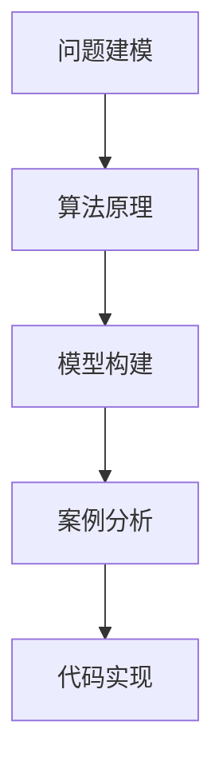

                 

# 深度思考:直击问题本质的利器

> 关键词：深度思考,问题本质,算法原理,软件开发,模型构建,案例分析,代码实现,未来趋势

## 1. 背景介绍

### 1.1 问题由来
在当今快速变化的科技环境中，软件开发和算法设计面临前所未有的挑战。随着技术的不断进步，如何开发出高效、可靠、易于维护的软件系统，成为了众多开发者关注的焦点。而深度思考，作为解决复杂问题、提升软件质量的重要手段，成为了软件开发中不可或缺的能力。本文旨在深入探讨深度思考的基本原理和方法，帮助开发者提升问题解决能力，构建更高质量的软件系统。

### 1.2 问题核心关键点
深度思考是指通过多角度、多层次、多维度对问题进行全面分析，从而找到问题本质，并制定出切实有效的解决方案的过程。它不仅包括技术层面的算法原理和模型构建，还涵盖了社会、心理等多个维度的考量。本文将围绕深度思考的核心概念和关键方法，进行系统性的分析和讲解。

## 2. 核心概念与联系

### 2.1 核心概念概述

深度思考涉及多个关键概念，包括但不限于：

- 问题建模：通过对问题的本质进行抽象和分析，构建出问题的数学或逻辑模型。
- 算法原理：包括经典算法和最新研究，如贪心算法、动态规划、图论算法、最优化理论等。
- 模型构建：选择或设计合适的模型结构，如线性回归、神经网络、贝叶斯网络等。
- 案例分析：通过具体案例展示问题解决过程，包括数据预处理、特征工程、模型训练和评估等。
- 代码实现：将算法和模型转化为可执行的软件代码，确保其正确性和高效性。

这些概念之间的联系可以通过以下Mermaid流程图来展示：



这个流程图展示深度思考过程的关键步骤和其内部逻辑关系：首先，通过对问题进行建模，将问题抽象为数学或逻辑模型；然后，依据问题模型选择合适的算法和模型；接着，通过具体案例展示问题解决过程；最后，将算法和模型转化为实际可执行的软件代码。

## 3. 核心算法原理 & 具体操作步骤
### 3.1 算法原理概述

深度思考的算法原理，主要围绕如何对问题进行建模和求解。对于大多数实际问题，都需要进行以下步骤：

1. **问题抽象**：将实际问题抽象为数学或逻辑模型。这一步要求开发者具备良好的抽象思维能力，能够将复杂问题转化为可操作的模型。
2. **问题求解**：选择或设计合适的算法和模型，求解得到问题的解。这一步涉及算法的正确性和效率，是问题解决的核心。
3. **结果验证**：对解的有效性和正确性进行验证，确保得到的结果符合实际情况。这一步要求开发者具备严谨的逻辑思维和实证精神。

### 3.2 算法步骤详解

以下将以一个简单的优化问题为例，详细讲解深度思考的算法步骤：

1. **问题抽象**：假设要在一个凸多边形的内部，寻找一个点，使得该点到多边形各个顶点的距离之和最小。
2. **算法选择**：可以采用最小二乘法或动态规划等算法进行求解。
3. **模型构建**：将问题转化为求解线性方程组的数学模型。
4. **案例分析**：通过具体案例，展示模型构建和算法求解的过程。
5. **代码实现**：将模型和算法转化为可执行的代码，进行模拟和验证。

### 3.3 算法优缺点

深度思考算法具有以下优点：
- 能够将复杂问题转化为可操作的模型，便于分析和求解。
- 能够通过多种算法选择，找到最优或次优解。
- 具有实证性，通过具体案例验证算法的正确性和有效性。

同时，深度思考算法也存在以下缺点：
- 需要对问题进行深入的抽象和分析，对开发者的数学和算法基础要求较高。
- 算法的选择和设计需要结合具体问题特点，可能存在复杂度高、计算量大等问题。
- 对于非结构化问题，模型构建和算法求解的复杂度更高。

### 3.4 算法应用领域

深度思考算法在软件开发和算法设计中有着广泛的应用，包括但不限于：

- 数据挖掘和机器学习：通过深度思考，选择或设计合适的算法和模型，进行数据分析和预测。
- 软件工程：通过深度思考，设计高效、可靠的软件架构和算法，提升软件开发效率和质量。
- 网络安全：通过深度思考，分析网络攻击行为，设计安全防护措施，提升网络安全性。
- 自然语言处理：通过深度思考，选择或设计合适的模型和算法，进行文本处理和分析。
- 系统优化：通过深度思考，分析系统瓶颈，设计优化算法，提升系统性能。

## 4. 数学模型和公式 & 详细讲解 & 举例说明

### 4.1 数学模型构建

深度思考的数学模型构建，通常包括以下几个步骤：

1. **问题抽象**：将实际问题转化为数学表达式或方程组。
2. **模型选择**：选择或设计合适的数学模型，如线性回归、神经网络、贝叶斯网络等。
3. **模型训练**：通过训练数据，优化模型参数，使其能够更好地拟合实际数据。
4. **模型评估**：通过测试数据，评估模型的性能和泛化能力。

### 4.2 公式推导过程

以线性回归为例，推导其公式和算法过程：

假设有一个样本数据集 $(x_i, y_i)$，其中 $x_i$ 是输入特征，$y_i$ 是输出标签。假设模型为 $y=f(x;\theta)$，其中 $\theta$ 是模型参数。通过最小二乘法，可以求解最优的模型参数 $\theta$，使得模型的预测值与实际值之间的误差最小。

数学公式推导如下：

$$
\min_{\theta} \sum_{i=1}^{n} (y_i - f(x_i;\theta))^2
$$

根据梯度下降算法，求解最优的 $\theta$ 需要计算损失函数关于 $\theta$ 的梯度，并设置合适的学习率 $\eta$，更新参数 $\theta$：

$$
\theta \leftarrow \theta - \eta \nabla_{\theta} \sum_{i=1}^{n} (y_i - f(x_i;\theta))^2
$$

### 4.3 案例分析与讲解

假设有一个房价预测问题，目标是根据房屋的特征（如面积、位置、房间数等），预测其市场价格。

1. **问题抽象**：将房价问题抽象为线性回归模型，假设房价与特征之间存在线性关系。
2. **模型构建**：选择线性回归模型，构建回归方程 $y=\beta_0+\sum_{i=1}^{n}\beta_ix_i$。
3. **数据准备**：收集房屋特征和市场价格的数据，进行数据预处理和特征工程。
4. **模型训练**：使用训练数据集，通过梯度下降算法，训练模型参数 $\beta_0, \beta_1, \cdots, \beta_n$。
5. **模型评估**：使用测试数据集，评估模型的预测精度和泛化能力。

## 5. 项目实践：代码实例和详细解释说明

### 5.1 开发环境搭建

在进行深度思考算法实践时，需要配置好开发环境。以下是Python环境配置的步骤：

1. 安装Python：根据系统平台，从官网下载并安装Python。
2. 安装Pip：执行命令 `python -m pip install pip` 安装Pip。
3. 安装Pandas、NumPy、Scikit-Learn等数据处理和算法库。
4. 安装Jupyter Notebook 或 PyCharm 等IDE。

### 5.2 源代码详细实现

以下以线性回归模型为例，给出Python代码实现：

```python
import numpy as np
from sklearn.linear_model import LinearRegression

# 假设有一个样本数据集
X = np.array([[1, 2, 3], [4, 5, 6], [7, 8, 9]])
y = np.array([2, 4, 6])

# 构建线性回归模型
model = LinearRegression()

# 训练模型
model.fit(X, y)

# 使用测试数据进行预测
X_test = np.array([[10, 11, 12]])
y_pred = model.predict(X_test)

print(y_pred)
```

### 5.3 代码解读与分析

上述代码实现了线性回归模型的基本功能，具体分析如下：

1. **数据准备**：使用NumPy库，定义输入特征矩阵 $X$ 和输出标签向量 $y$。
2. **模型构建**：使用Scikit-Learn库中的LinearRegression模型，构建线性回归模型。
3. **模型训练**：使用训练数据集，调用模型的fit方法进行模型训练。
4. **模型预测**：使用测试数据集，调用模型的predict方法进行预测，输出预测结果。

## 6. 实际应用场景

### 6.1 金融风险评估

深度思考算法在金融风险评估中有着广泛应用，通过分析历史数据和市场趋势，构建出风险评估模型，帮助投资者做出科学决策。

具体步骤包括：

1. **问题抽象**：将金融风险评估问题抽象为线性回归或决策树模型。
2. **数据准备**：收集历史交易数据、市场指标、公司财务数据等，进行数据预处理和特征工程。
3. **模型构建**：选择或设计合适的模型，构建出风险评估模型。
4. **模型训练**：使用训练数据集，训练模型参数。
5. **模型评估**：使用测试数据集，评估模型性能和泛化能力。

### 6.2 医疗诊断支持

深度思考算法在医疗诊断支持中也有重要应用，通过分析患者病历和医疗数据，构建出诊断模型，帮助医生做出准确诊断。

具体步骤包括：

1. **问题抽象**：将医疗诊断问题抽象为分类或回归模型。
2. **数据准备**：收集患者病历、检查结果、基因数据等，进行数据预处理和特征工程。
3. **模型构建**：选择或设计合适的模型，构建出诊断模型。
4. **模型训练**：使用训练数据集，训练模型参数。
5. **模型评估**：使用测试数据集，评估模型性能和泛化能力。

### 6.3 自动驾驶系统

深度思考算法在自动驾驶系统中也有重要应用，通过分析车辆传感器数据和环境信息，构建出决策模型，实现自动驾驶功能。

具体步骤包括：

1. **问题抽象**：将自动驾驶问题抽象为强化学习模型。
2. **数据准备**：收集车辆传感器数据、环境信息、交通规则等，进行数据预处理和特征工程。
3. **模型构建**：选择或设计合适的模型，构建出决策模型。
4. **模型训练**：使用训练数据集，训练模型参数。
5. **模型评估**：使用测试数据集，评估模型性能和泛化能力。

### 6.4 未来应用展望

随着深度思考算法的不断发展和完善，其在更多领域的应用前景将更加广阔。未来，深度思考算法将在以下几个方向得到应用：

1. **智能制造**：通过分析生产数据和设备状态，构建出预测和优化模型，实现智能制造。
2. **智慧城市**：通过分析城市数据和居民行为，构建出预测和优化模型，提升城市治理效率。
3. **智能家居**：通过分析用户行为和环境信息，构建出智能推荐模型，提升家居生活体验。
4. **自动客服**：通过分析客户行为和对话记录，构建出对话生成模型，实现智能客服。

## 7. 工具和资源推荐

### 7.1 学习资源推荐

为了帮助开发者掌握深度思考算法的理论和实践，这里推荐以下学习资源：

1. 《深度学习》（Ian Goodfellow, Yoshua Bengio 和 Aaron Courville 著）：深入介绍深度学习的基础理论和算法原理，是深度思考算法的必读书籍。
2. Coursera《机器学习》课程：由斯坦福大学教授 Andrew Ng 开设，系统讲解机器学习的基本概念和算法实现。
3 Udacity《深度学习专项课程》：包含多个深度学习相关的课程，涵盖从基础到高级的深度思考算法。
4 Kaggle竞赛：通过参与Kaggle竞赛，锻炼深度思考算法的应用能力和实践能力。
5 arXiv论文：阅读最新的深度思考算法研究论文，跟踪前沿进展。

### 7.2 开发工具推荐

以下推荐一些常用的深度思考算法开发工具：

1. PyTorch：开源深度学习框架，支持动态计算图和GPU加速，适合快速迭代开发。
2. TensorFlow：由Google主导的开源深度学习框架，支持大规模分布式计算，适合生产环境部署。
3. Scikit-Learn：基于Python的机器学习库，提供丰富的模型选择和工具支持。
4. Jupyter Notebook：交互式编程环境，方便开发和分享代码。
5. Git和GitHub：版本控制和代码托管平台，便于团队协作和代码管理。

### 7.3 相关论文推荐

深度思考算法的最新研究成果不断涌现，以下是几篇有影响力的论文推荐：

1. LeCun, Y., Bottou, L., Bengio, Y., & Haffner, P. (1998). Gradient-based learning applied to document recognition. Proceedings of the IEEE.
2 Bengio, Y., Ducharme, R., & Vincent, P. (2003). A neural probabilistic language model. Advances in neural information processing systems.
3 Goodfellow, I., Bengio, Y., & Courville, A. (2016). Deep learning. MIT Press.
4 He, K., Zhang, X., Ren, S., & Sun, J. (2016). Deep residual learning for image recognition. Proceedings of the IEEE Conference on Computer Vision and Pattern Recognition.
5 Hinton, G. E., Osindero, S., & Teh, Y. W. (2006). A fast learning algorithm for deep belief nets. Neural Computation.
6 Chen, T., Papernot, N., Goodfellow, I., & Corrado, G. (2017). Targeted adversarial attacks on neural networks. Advances in Neural Information Processing Systems.
7 Sutskever, I., Vinyals, O., & Le, Q. V. (2014). Sequence to sequence learning with neural networks. Advances in Neural Information Processing Systems.

## 8. 总结：未来发展趋势与挑战

### 8.1 总结

深度思考算法在软件开发和算法设计中具有重要地位，是提升问题解决能力、构建高效软件系统的关键手段。通过深入分析深度思考的核心概念和关键方法，可以帮助开发者系统掌握算法原理和实践技巧，提升问题解决能力。本文从问题建模、算法选择、模型构建、案例分析、代码实现等方面，对深度思考算法的理论和实践进行了系统性阐述。

### 8.2 未来发展趋势

未来，深度思考算法将在以下几个方向得到进一步发展：

1. **多模态融合**：深度思考算法将更多地融合视觉、听觉、文本等多种模态数据，构建出更加全面、准确的问题模型。
2. **自监督学习**：深度思考算法将更多地利用自监督学习，减少对标注数据的依赖，提高模型的泛化能力。
3. **元学习**：深度思考算法将更多地利用元学习，构建出能够快速适应新任务的模型，提升模型迁移能力。
4. **可解释性**：深度思考算法将更多地关注模型的可解释性，通过符号化表示和可视化技术，提升模型决策的可理解性。
5. **模型压缩和加速**：深度思考算法将更多地关注模型的压缩和加速，通过量化、剪枝、蒸馏等技术，提升模型推理效率和资源利用率。

### 8.3 面临的挑战

尽管深度思考算法在诸多领域取得了显著进展，但仍面临诸多挑战：

1. **数据依赖**：深度思考算法高度依赖标注数据，标注数据质量不高将直接影响算法性能。
2. **模型复杂性**：深度思考算法通常涉及复杂的模型结构和参数优化，需要高水平的技术和资源支持。
3. **泛化能力**：深度思考算法通常需要大量数据进行训练，否则容易过拟合，泛化能力较弱。
4. **可解释性**：深度思考算法通常是"黑盒"模型，难以解释其内部决策过程，缺乏透明性。
5. **资源消耗**：深度思考算法通常需要大量的计算资源和存储空间，限制了其在资源受限环境中的应用。

### 8.4 研究展望

深度思考算法的研究方向将集中在以下几个方面：

1. **自适应学习**：开发更加自适应的深度思考算法，能够在不同数据分布和任务场景中快速调整模型参数，提升模型泛化能力。
2. **混合方法**：探索深度思考算法与其他机器学习方法（如传统机器学习、贝叶斯网络等）的结合，构建出更加全面、灵活的模型。
3. **鲁棒性提升**：开发更加鲁棒的深度思考算法，能够应对数据噪声和异常情况，提高模型稳定性和可靠性。
4. **跨领域应用**：推动深度思考算法在更多领域的应用，如智能制造、智慧城市、自动驾驶等，实现跨领域知识融合和应用。
5. **伦理和隐私保护**：关注深度思考算法的伦理和隐私问题，通过透明性和可解释性提升算法可信度，确保数据和模型安全。

通过不断探索和创新，深度思考算法将进一步提升问题解决能力，推动软件开发和算法设计的智能化进程，为人类社会带来更多创新和变革。

## 9. 附录：常见问题与解答

**Q1：如何选择合适的算法和模型？**

A: 选择合适的算法和模型，需要考虑以下几个方面：

1. **问题类型**：根据问题类型选择合适的算法和模型，如分类问题选择SVM，回归问题选择线性回归等。
2. **数据特点**：根据数据特点选择合适的算法和模型，如数据量少选择神经网络，数据量多选择深度学习。
3. **资源限制**：根据资源限制选择合适的算法和模型，如内存有限选择轻量级模型，计算资源丰富选择复杂模型。
4. **可解释性要求**：根据可解释性要求选择合适的算法和模型，如需要解释性选择符号化模型，不需要解释性选择黑盒模型。

**Q2：如何处理过拟合问题？**

A: 处理过拟合问题，可以采取以下措施：

1. **数据增强**：通过数据增强技术，扩充训练集，增加模型泛化能力。
2. **正则化**：通过L2正则化、Dropout等技术，减少模型复杂度，防止过拟合。
3. **早停策略**：通过早停策略，在验证集性能不再提升时停止训练，防止过拟合。
4. **模型选择**：通过模型选择，选择泛化能力更强的模型，防止过拟合。
5. **集成学习**：通过集成学习，将多个模型组合起来，提升模型泛化能力，防止过拟合。

**Q3：如何评估模型性能？**

A: 评估模型性能，可以采取以下措施：

1. **准确率**：计算模型预测结果与真实结果的匹配度，评估分类模型的性能。
2. **均方误差**：计算模型预测结果与真实结果的误差，评估回归模型的性能。
3. **F1分数**：计算模型预测结果的精确率和召回率，评估分类模型的性能。
4. **ROC曲线**：绘制ROC曲线，评估分类模型的性能。
5. **混淆矩阵**：计算混淆矩阵，评估分类模型的性能。

**Q4：如何提高模型泛化能力？**

A: 提高模型泛化能力，可以采取以下措施：

1. **数据增强**：通过数据增强技术，扩充训练集，增加模型泛化能力。
2. **正则化**：通过L2正则化、Dropout等技术，减少模型复杂度，防止过拟合。
3. **早停策略**：通过早停策略，在验证集性能不再提升时停止训练，防止过拟合。
4. **模型选择**：通过模型选择，选择泛化能力更强的模型，防止过拟合。
5. **集成学习**：通过集成学习，将多个模型组合起来，提升模型泛化能力，防止过拟合。

**Q5：如何提升模型可解释性？**

A: 提升模型可解释性，可以采取以下措施：

1. **符号化表示**：通过符号化表示，将模型输出转化为易于理解的符号表达式。
2. **可视化技术**：通过可视化技术，展示模型内部工作机制和决策过程。
3. **LIME和SHAP**：通过LIME和SHAP等工具，解释模型局部预测结果。
4. **模型融合**：通过模型融合，将多个可解释性较好的模型组合起来，提升模型可解释性。
5. **规则提取**：通过规则提取技术，将模型转化为规则形式，提升模型可解释性。

---

作者：禅与计算机程序设计艺术 / Zen and the Art of Computer Programming

