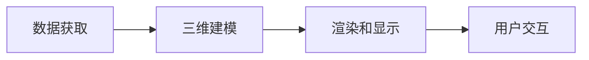
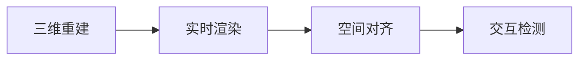

                 

# 混合现实（MR）开发：创造新的交互模式

> 关键词：混合现实,MR,交互设计,用户界面(UI),虚拟现实(VR),增强现实(AR),开发工具,应用场景,未来展望

## 1. 背景介绍

### 1.1 问题由来
随着虚拟现实（Virtual Reality, VR）和增强现实（Augmented Reality, AR）技术的不断成熟，混合现实（Mixed Reality, MR）作为一种将物理和虚拟世界融合的新型交互方式，正在改变人类的生活方式。通过在真实世界中加入虚拟元素，MR为教育、医疗、娱乐、制造业等多个领域带来了革命性的变化。然而，MR开发的复杂性和跨学科特性，使得许多开发者在实现高质量MR应用时面临挑战。

### 1.2 问题核心关键点
为了更好地指导MR开发，本文将重点介绍混合现实的原理、核心技术、交互设计以及开发工具。我们将从核心概念入手，逐步深入探讨MR的实现原理和关键算法，并通过案例分析展示其在不同领域的应用效果。此外，本文还将对未来MR发展的趋势和面临的挑战进行探讨，为MR技术的进一步发展提供有价值的参考。

## 2. 核心概念与联系

### 2.1 核心概念概述

混合现实（MR）是一种将物理世界和虚拟世界结合的新型技术，通过在真实世界中加入虚拟元素，用户可以与虚拟对象进行互动。MR的核心概念包括：

- **虚拟现实（VR）**：一种通过头显设备完全沉浸在虚拟世界中的技术。
- **增强现实（AR）**：一种在真实世界中叠加虚拟信息的技术。
- **混合现实（MR）**：结合VR和AR，在真实世界中加入虚拟元素的技术。
- **交互设计（Interaction Design）**：设计用户与系统互动的方式，包括界面(UI)和用户体验(UX)。

这些概念之间的关系可以通过以下Mermaid流程图来展示：

```mermaid
graph LR
    A[虚拟现实 (VR)] --> B[增强现实 (AR)]
    B --> C[混合现实 (MR)]
    A --> D[交互设计 (UI/UX)]
    C --> D
```

### 2.2 核心概念原理和架构的 Mermaid 流程图

MR的实现原理可以概括为以下几个关键步骤：

1. **数据获取**：通过摄像头、传感器等设备获取真实世界的图像和位置信息。
2. **三维建模**：将虚拟对象映射到真实世界的三维空间中，形成混合现实场景。
3. **渲染和显示**：将混合现实场景渲染到显示设备上，供用户查看。
4. **用户交互**：用户通过手势、语音等方式与虚拟对象互动。

这些步骤可以通过以下Mermaid流程图进行展示：



## 3. 核心算法原理 & 具体操作步骤
### 3.1 算法原理概述

MR的核心算法主要集中在以下几个方面：

1. **三维重建**：通过摄像头和传感器获取真实世界的几何信息，重构出三维模型。
2. **实时渲染**：将虚拟对象映射到三维场景中，实时渲染输出。
3. **空间对齐**：将虚拟对象与真实世界的物理对象进行空间对齐，实现自然融合。
4. **交互检测**：检测用户的手势、语音等交互方式，与虚拟对象进行互动。

这些算法原理可以通过以下流程图进行展示：



### 3.2 算法步骤详解

#### 3.2.1 三维重建

三维重建是MR的基础步骤，通过摄像头和传感器获取真实世界的深度信息和位置信息，并将其转换为三维模型。以下是一个典型的三维重建流程：

1. **数据采集**：使用多个摄像头或传感器采集真实世界的图像和位置信息。
2. **图像处理**：对采集到的图像进行预处理，如噪声过滤、边缘检测等。
3. **深度估计**：使用深度学习模型如立体视觉或光流算法估计每个像素的深度。
4. **三维建模**：将深度信息转换为三维模型，如通过体素网格或点云进行建模。

#### 3.2.2 实时渲染

实时渲染是将虚拟对象映射到三维场景中，并实时输出到显示设备。以下是一个典型的实时渲染流程：

1. **虚拟对象加载**：加载虚拟对象的模型和纹理。
2. **几何变换**：根据空间对齐结果，调整虚拟对象的位置和姿态。
3. **光照和阴影**：计算虚拟对象的光照和阴影，使其融入真实场景。
4. **混合渲染**：将虚拟对象与真实场景进行混合渲染，输出到显示设备。

#### 3.2.3 空间对齐

空间对齐是将虚拟对象与真实世界的物理对象进行空间对齐，实现自然融合。以下是一个典型的空间对齐流程：

1. **相机定位**：通过惯性传感器和GPS等设备获取摄像头的位置信息。
2. **环境映射**：将摄像头拍摄的图像映射到三维场景中。
3. **空间变换**：通过空间变换算法将虚拟对象映射到真实世界的空间坐标系中。
4. **融合优化**：优化虚拟对象和真实对象的空间对齐，使其自然融合。

#### 3.2.4 交互检测

交互检测是检测用户的手势、语音等交互方式，与虚拟对象进行互动。以下是一个典型的交互检测流程：

1. **手势识别**：使用深度学习模型或传感器检测用户的手势。
2. **语音识别**：使用语音识别技术识别用户的语音指令。
3. **交互响应**：根据用户的手势或语音指令，与虚拟对象进行互动。

### 3.3 算法优缺点

MR算法的优点包括：

- **沉浸感强**：MR将虚拟对象融入真实世界，提供更加沉浸式的体验。
- **应用广泛**：MR可以应用于教育、医疗、娱乐、制造等多个领域。
- **互动自然**：用户可以通过手势、语音等方式自然地与虚拟对象互动。

MR算法的缺点包括：

- **硬件要求高**：MR需要高性能的摄像头、传感器等硬件设备。
- **计算复杂**：三维重建和实时渲染计算量大，对计算资源要求较高。
- **交互难度大**：用户需要适应手势、语音等新的交互方式，学习成本较高。

### 3.4 算法应用领域

MR算法广泛应用于以下几个领域：

1. **教育培训**：通过MR技术提供虚拟实验室、虚拟教师等教学资源，提升教学效果。
2. **医疗手术**：通过MR技术在手术前进行虚拟模拟，提高手术成功率。
3. **制造业**：通过MR技术进行虚拟装配、虚拟培训，提高生产效率。
4. **娱乐游戏**：通过MR技术提供虚拟场景、互动对象，提升游戏体验。
5. **房地产**：通过MR技术进行虚拟看房、虚拟漫游，提高销售效率。

## 4. 数学模型和公式 & 详细讲解 & 举例说明

### 4.1 数学模型构建

MR的数学模型通常包括三维重建、实时渲染和空间对齐等几个部分。以下是典型的数学模型构建过程：

1. **三维重建模型**：使用三维点云或体素网格表示真实世界的几何信息。
2. **实时渲染模型**：使用三维图形渲染算法（如OpenGL、Vulkan等）进行实时渲染。
3. **空间对齐模型**：使用空间变换算法（如位姿估计算法）进行空间对齐。

### 4.2 公式推导过程

#### 4.2.1 三维重建公式

三维重建的数学模型可以表示为：

$$
\mathbf{P} = \mathbf{R} \mathbf{p} + \mathbf{t}
$$

其中，$\mathbf{P}$ 表示三维坐标点，$\mathbf{p}$ 表示像素坐标点，$\mathbf{R}$ 表示旋转矩阵，$\mathbf{t}$ 表示平移向量。

#### 4.2.2 实时渲染公式

实时渲染的数学模型可以表示为：

$$
\mathbf{I} = \mathbf{F}(\mathbf{M}, \mathbf{L}, \mathbf{T})
$$

其中，$\mathbf{I}$ 表示渲染图像，$\mathbf{M}$ 表示虚拟对象模型，$\mathbf{L}$ 表示光照模型，$\mathbf{T}$ 表示变换矩阵。

#### 4.2.3 空间对齐公式

空间对齐的数学模型可以表示为：

$$
\mathbf{T} = \mathbf{R} \mathbf{t}
$$

其中，$\mathbf{T}$ 表示变换矩阵，$\mathbf{R}$ 表示旋转矩阵，$\mathbf{t}$ 表示平移向量。

### 4.3 案例分析与讲解

以下是一个典型的MR应用案例：

**案例描述**：在教育培训领域，通过MR技术提供虚拟实验室，提升学生的实验技能。

**案例流程**：

1. **数据采集**：使用多个摄像头采集实验室的图像和位置信息。
2. **三维重建**：对采集到的图像进行预处理和深度估计，重构出实验室的三维模型。
3. **虚拟对象加载**：加载实验所需的虚拟仪器和试剂。
4. **空间对齐**：将虚拟仪器和试剂映射到实验室的三维场景中。
5. **实时渲染**：将虚拟仪器和试剂进行渲染，显示到学生的头盔设备中。
6. **交互检测**：学生可以通过手势或语音指令与虚拟仪器进行互动，完成实验操作。

**案例结果**：通过MR技术，学生可以在虚拟实验室中进行多次实验操作，提高实验技能，提升学习效果。

## 5. 项目实践：代码实例和详细解释说明

### 5.1 开发环境搭建

#### 5.1.1 硬件要求

MR开发需要高性能的硬件设备，如头显设备、摄像头、传感器等。以下是一个典型的MR开发环境搭建流程：

1. **选择头显设备**：根据需求选择合适的头显设备，如Oculus Rift、HTC Vive等。
2. **配置摄像头**：安装和配置摄像头，以获取真实世界的图像信息。
3. **安装传感器**：安装惯性传感器、GPS等设备，获取摄像头的位置信息。
4. **调试设备**：调试硬件设备，确保采集数据的质量。

#### 5.1.2 软件要求

MR开发需要安装和配置各种软件工具，如开发平台、渲染引擎等。以下是一个典型的MR开发环境搭建流程：

1. **安装开发平台**：安装和配置Unity或Unreal Engine等游戏引擎，作为MR开发平台。
2. **配置渲染引擎**：配置渲染引擎，如Vulkan、OpenGL等，进行三维渲染。
3. **安装库文件**：安装和配置各种开源库，如OpenCV、PCL等，进行三维重建和空间对齐。
4. **调试工具**：调试工具，如Visual Studio、Xcode等，进行代码调试和测试。

### 5.2 源代码详细实现

以下是一个典型的MR应用代码实现，使用Unity和VTK库进行三维重建和实时渲染。

```csharp
using UnityEngine;
using VTKSharp;
using UnityEngine rendering;

public class MRApp : MonoBehaviour
{
    public Camera headCam;
    public GameObject virtualInstrument;

    void Start()
    {
        // 加载虚拟仪器
        virtualInstrument.SetActive(true);

        // 获取摄像头的位置信息
        float x = headCam.transform.position.x;
        float y = headCam.transform.position.y;
        float z = headCam.transform.position.z;

        // 三维重建
        vtk.vtkVRMLImporter importer = new vtk.vtkVRMLImporter();
        importer.SetFileName("virtualInstrument.vrml");
        vtk.vtkPolyData polyData = importer.Read();
        vtk.vtkPolyDataMapper mapper = new vtk.vtkPolyDataMapper();
        mapper.SetInputData(polyData);
        vtk.vtkActor actor = new vtk.vtkActor();
        actor.SetMapper(mapper);
        actor.GetProperty().SetColor(new double[] { 1, 0, 0 });

        // 空间对齐
        vtk.vtkTransform transform = new vtk.vtkTransform();
        transform.Translate(x, y, z);
        actor.SetUserMatrix(transform.GetMatrix());

        // 实时渲染
        Scene.scene.AddObject(actor);
        UpdateVirtualInstrumentPosition();
    }

    void UpdateVirtualInstrumentPosition()
    {
        float x = headCam.transform.position.x;
        float y = headCam.transform.position.y;
        float z = headCam.transform.position.z;

        vtk.vtkTransform transform = new vtk.vtkTransform();
        transform.Translate(x, y, z);
        actor.SetUserMatrix(transform.GetMatrix());
    }
}
```

### 5.3 代码解读与分析

#### 5.3.1 三维重建部分

```csharp
vtk.vtkVRMLImporter importer = new vtk.vtkVRMLImporter();
importer.SetFileName("virtualInstrument.vrml");
vtk.vtkPolyData polyData = importer.Read();
vtk.vtkPolyDataMapper mapper = new vtk.vtkPolyDataMapper();
mapper.SetInputData(polyData);
vtk.vtkActor actor = new vtk.vtkActor();
actor.SetMapper(mapper);
actor.GetProperty().SetColor(new double[] { 1, 0, 0 });
```

以上代码实现了一个典型的三维重建流程：

1. **数据加载**：使用VRML格式加载虚拟仪器的三维模型。
2. **数据映射**：将三维模型映射到PolyData数据结构中。
3. **数据渲染**：将PolyData数据映射到Actor对象中，进行渲染。

#### 5.3.2 空间对齐部分

```csharp
vtk.vtkTransform transform = new vtk.vtkTransform();
transform.Translate(x, y, z);
actor.SetUserMatrix(transform.GetMatrix());
```

以上代码实现了一个典型的空间对齐流程：

1. **坐标转换**：根据摄像头的位置信息，构造一个平移矩阵。
2. **空间变换**：将虚拟仪器的位置和姿态转换为摄像机坐标系。
3. **渲染更新**：根据平移矩阵，更新虚拟仪器的渲染位置。

#### 5.3.3 实时渲染部分

```csharp
Scene.scene.AddObject(actor);
UpdateVirtualInstrumentPosition();
```

以上代码实现了一个典型的实时渲染流程：

1. **对象添加**：将渲染后的虚拟仪器添加到场景中。
2. **位置更新**：根据用户的手势或语音指令，实时更新虚拟仪器的位置。

### 5.4 运行结果展示

运行上述代码，即可在Unity中渲染出虚拟仪器，并根据用户的手势或语音指令进行空间对齐和实时渲染。

## 6. 实际应用场景

### 6.1 教育培训

在教育培训领域，MR技术可以提供虚拟实验室、虚拟教师等教学资源，提升教学效果。

#### 6.1.1 虚拟实验室

通过MR技术，学生可以在虚拟实验室中进行多次实验操作，提高实验技能，提升学习效果。

### 6.2 医疗手术

在医疗手术领域，MR技术可以进行虚拟手术模拟，提高手术成功率。

#### 6.2.1 虚拟手术

通过MR技术，医生可以在虚拟手术模拟器中进行多次手术操作，熟悉手术流程，提高手术成功率。

### 6.3 制造业

在制造业领域，MR技术可以进行虚拟装配、虚拟培训，提高生产效率。

#### 6.3.1 虚拟装配

通过MR技术，工人可以在虚拟装配环境中进行多次装配操作，提高装配技能，减少生产误差。

## 7. 工具和资源推荐

### 7.1 学习资源推荐

为了帮助开发者系统掌握MR开发的技术，以下是一些优质的学习资源：

1. **《Unity3D游戏开发从入门到精通》**：介绍Unity引擎的使用方法和游戏开发技巧。
2. **《Unreal Engine 4实战教程》**：介绍Unreal Engine引擎的使用方法和游戏开发技巧。
3. **《VTK：三维建模与可视化》**：介绍VTK库的使用方法和三维建模技巧。
4. **《VR/AR开发实战》**：介绍VR和AR技术的使用方法和应用场景。
5. **《混合现实技术与应用》**：介绍混合现实技术的发展历程和应用案例。

通过对这些资源的学习实践，相信你一定能够快速掌握MR开发的关键技术，并应用于实际项目中。

### 7.2 开发工具推荐

以下是几款用于MR开发常用的开发工具：

1. **Unity**：一款功能强大的游戏引擎，适合开发各种类型的MR应用。
2. **Unreal Engine**：一款功能丰富的游戏引擎，适合开发高质量的MR应用。
3. **VTK**：一款开源的三维建模库，适合进行三维重建和空间对齐。
4. **ARKit/ARCore**：苹果/谷歌提供的AR开发工具，适合开发AR应用。
5. **OpenCV**：一款开源的计算机视觉库，适合进行图像处理和空间对齐。

合理利用这些工具，可以显著提升MR应用的开发效率，加快创新迭代的步伐。

### 7.3 相关论文推荐

以下是几篇奠基性的相关论文，推荐阅读：

1. **《混合现实：一种新型的交互模式》**：探讨混合现实的原理和应用场景。
2. **《虚拟现实与增强现实技术综述》**：综述虚拟现实和增强现实技术的发展历程和应用案例。
3. **《空间对齐算法研究》**：研究空间对齐算法的原理和实现方法。
4. **《手势识别技术综述》**：综述手势识别技术的发展历程和应用场景。
5. **《交互设计原则》**：介绍交互设计的基本原则和设计方法。

这些论文代表了大MR开发技术的发展脉络。通过学习这些前沿成果，可以帮助研究者把握学科前进方向，激发更多的创新灵感。

## 8. 总结：未来发展趋势与挑战

### 8.1 研究成果总结

本文对混合现实（MR）开发进行了全面系统的介绍，介绍了MR的原理、核心技术、交互设计以及开发工具。通过案例分析展示了MR在不同领域的应用效果，并对未来MR的发展趋势进行了探讨。

### 8.2 未来发展趋势

展望未来，MR开发技术将呈现以下几个发展趋势：

1. **沉浸感增强**：通过改进硬件设备和渲染算法，进一步提升MR的沉浸感。
2. **交互自然化**：通过手势识别、语音识别等技术，提高用户与虚拟对象的自然交互。
3. **应用多样化**：MR技术将应用于更多领域，如教育、医疗、娱乐、制造业等。
4. **网络化协作**：通过网络技术，实现多个用户之间的MR协作。
5. **实时化处理**：通过云计算和大数据技术，实现MR数据的实时处理和分析。

### 8.3 面临的挑战

尽管MR开发技术已经取得了一定的进展，但在迈向更加智能化、普适化应用的过程中，仍面临以下挑战：

1. **硬件成本高**：MR设备的高性能要求带来了高成本，限制了其大规模应用。
2. **计算资源需求大**：MR技术的复杂性带来了大计算资源需求，制约了实时渲染和空间对齐。
3. **用户学习成本高**：MR交互方式与传统方式差异大，用户需要适应新的交互方式。
4. **安全隐私问题**：MR设备涉及用户的位置和隐私信息，安全隐私问题需要得到解决。
5. **标准化问题**：MR技术还没有形成统一的标准和规范，不同设备之间的互操作性较差。

### 8.4 研究展望

为了克服上述挑战，未来的研究需要在以下几个方面寻求新的突破：

1. **硬件成本降低**：通过创新设计和制造技术，降低MR设备的成本，提高可及性。
2. **计算资源优化**：通过算法优化和资源调度，降低计算资源需求，提升实时性能。
3. **交互方式优化**：通过改进手势识别和语音识别技术，提高用户与虚拟对象的自然交互。
4. **安全隐私保障**：通过隐私保护和数据加密技术，保障用户的安全隐私。
5. **标准化建设**：制定MR技术的标准和规范，提高设备之间的互操作性。

这些研究方向的探索，必将引领MR技术的进一步发展，为MR技术的广泛应用铺平道路。

## 9. 附录：常见问题与解答

**Q1：MR开发有哪些关键技术？**

A: MR开发的关键技术包括三维重建、实时渲染、空间对齐、交互检测等。这些技术共同构成了MR的核心技术体系。

**Q2：如何选择适合MR开发的硬件设备？**

A: 选择合适的硬件设备需要考虑设备性能、成本、便携性等因素。常见选择包括Oculus Rift、HTC Vive等头显设备，以及带有深度传感器的摄像头和惯性传感器。

**Q3：如何提升MR的沉浸感？**

A: 提升MR的沉浸感可以通过改进硬件设备和渲染算法来实现。如使用高分辨率的头显设备，使用实时全局光照渲染算法等。

**Q4：如何提高MR交互的自然度？**

A: 提高MR交互的自然度可以通过改进手势识别和语音识别技术来实现。如使用深度学习模型进行手势识别，使用语音识别引擎进行语音指令的解析。

**Q5：如何保障MR的安全隐私？**

A: 保障MR的安全隐私可以通过数据加密、隐私保护等技术来实现。如对用户的位置信息进行加密，对敏感数据进行访问控制等。

---

作者：禅与计算机程序设计艺术 / Zen and the Art of Computer Programming

