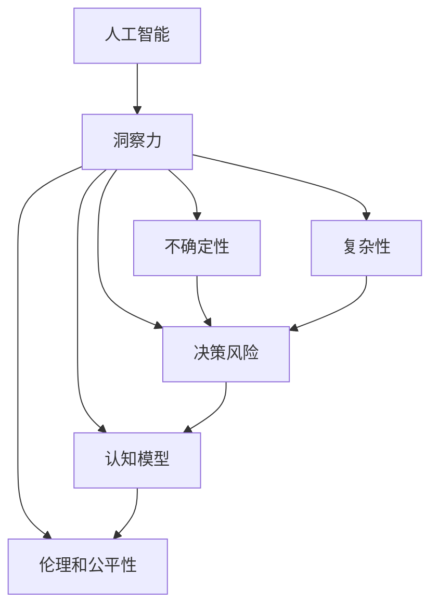

                 

# 理解洞察力的局限：承认不确定性和复杂性

> 关键词：人工智能，洞察力，不确定性，复杂性，AI伦理，决策支持，认知模型

## 1. 背景介绍

### 1.1 问题由来

在人工智能(AI)领域，洞察力一直是研究的热点之一。它指的是一种能够从数据中提取有用信息，从而做出合理决策的能力。然而，随着AI技术的不断发展和应用，人们开始意识到，洞察力并非总是可靠或无偏差的。尤其是在复杂和不确定性高的场景下，洞察力可能带来严重的误导，甚至导致灾难性的后果。

这一现象引发了广泛关注，促使研究人员和从业者深入探讨AI系统的决策过程和其对现实世界的影响。本文将从核心概念和算法原理出发，详细探讨AI洞察力的局限性，并提出如何承认不确定性和复杂性的建议。

### 1.2 问题核心关键点

1. **人工智能系统的复杂性**：AI系统由大量数据、模型和算法组成，结构复杂，易于出错。
2. **不确定性**：AI系统在处理数据时，不可避免地存在数据噪声、模型假设和参数不确定性。
3. **决策风险**：AI系统的决策可能会对人类社会造成深远影响，因此决策风险至关重要。
4. **认知模型的局限**：现有认知模型在解释和预测人类行为时存在局限，影响AI系统的性能。
5. **伦理和公平性**：AI系统的决策过程和结果需要符合伦理和公平性标准，避免偏见和歧视。

这些关键点揭示了AI洞察力的局限性，并提示了承认不确定性和复杂性的重要性。

### 1.3 问题研究意义

研究AI洞察力的局限性，对于提升AI系统的可靠性和鲁棒性，确保其在复杂和不确定性高的场景下仍能发挥作用具有重要意义：

1. **提高决策质量**：识别和规避AI系统在决策过程中的潜在风险，确保决策更加准确和可靠。
2. **增强系统透明度**：提高AI系统的决策过程可解释性，帮助用户理解AI系统的行为和决策依据。
3. **保障伦理合规**：确保AI系统的决策符合伦理和公平性标准，避免对特定群体造成不公平待遇。
4. **推动AI技术发展**：通过深入理解AI系统的局限性，推动AI技术向更稳健、更可靠的方向发展。

## 2. 核心概念与联系

### 2.1 核心概念概述

为了更好地理解AI洞察力的局限性，本文将详细介绍几个核心概念：

- **人工智能**：利用算法和模型处理数据的智能系统，广泛应用于图像识别、自然语言处理、机器学习等领域。
- **洞察力**：指从数据中提取有用信息，并据此做出合理决策的能力。
- **不确定性**：指系统在处理数据时存在的不确定性，如数据噪声、模型假设和参数不确定性。
- **复杂性**：指AI系统由大量组件组成，结构复杂，易于出错。
- **决策风险**：指AI系统决策对人类社会可能带来的风险和影响。
- **认知模型**：用于解释和预测人类行为的心理模型。
- **伦理和公平性**：确保AI系统符合伦理和公平性标准的原则。

这些概念相互联系，共同构成了AI系统的决策过程和其对现实世界的影响框架。

### 2.2 核心概念原理和架构的 Mermaid 流程图(Mermaid 流程节点中不要有括号、逗号等特殊字符)



这个流程图展示了各个核心概念之间的逻辑关系：

1. 人工智能系统通过洞察力提取有用信息，并据此做出决策。
2. 洞察力的提取和决策的生成涉及不确定性、复杂性和决策风险。
3. 认知模型用于解释和预测人类行为，影响洞察力的提取。
4. 伦理和公平性是确保AI系统符合道德标准的原则。

这些概念共同作用，决定着AI系统的性能和影响。

## 3. 核心算法原理 & 具体操作步骤

### 3.1 算法原理概述

AI洞察力的局限性主要体现在其处理数据和做出决策时的复杂性和不确定性。基于此，本文将介绍一种基于认知模型的决策支持算法，用于评估AI洞察力的可靠性和准确性。

该算法基于以下原理：

1. **认知模型的应用**：利用认知模型解释和预测人类行为，评估AI系统洞察力的准确性。
2. **不确定性的量化**：通过量化数据噪声、模型假设和参数不确定性，评估AI系统洞察力的可靠性。
3. **决策风险的评估**：评估AI系统决策对人类社会可能带来的风险和影响，确保决策符合伦理和公平性标准。

### 3.2 算法步骤详解

基于上述原理，本文将详细介绍该算法的详细步骤：

**Step 1: 数据预处理**

- 收集和清洗数据，去除噪声和异常值。
- 进行数据增强，以提高模型的泛化能力。

**Step 2: 模型训练**

- 使用认知模型解释和预测人类行为。
- 训练AI系统，使其能够从数据中提取有用信息。
- 应用正则化技术，防止过拟合。

**Step 3: 不确定性量化**

- 计算数据噪声和模型假设的影响。
- 评估参数不确定性，确定最优的参数设置。

**Step 4: 决策风险评估**

- 评估AI系统决策对人类社会可能带来的风险和影响。
- 确保决策符合伦理和公平性标准。

**Step 5: 结果输出**

- 输出AI系统的洞察力和决策结果。
- 提供决策解释，帮助用户理解AI系统的行为和决策依据。

### 3.3 算法优缺点

该算法的优点包括：

- **全面性**：考虑到数据噪声、模型假设、参数不确定性和决策风险等多个方面，确保洞察力的可靠性和准确性。
- **透明性**：通过提供决策解释，增强AI系统的透明度，帮助用户理解其行为和决策依据。
- **伦理合规**：确保AI系统决策符合伦理和公平性标准，避免对特定群体造成不公平待遇。

然而，该算法也存在一些缺点：

- **计算复杂性**：评估决策风险和不确定性需要大量计算资源，可能影响系统的实时性。
- **模型依赖性**：认知模型的选择和训练对算法性能至关重要，但现有认知模型存在局限性。
- **可解释性局限**：虽然提供决策解释，但某些决策过程可能仍难以完全解释，特别是在处理复杂任务时。

### 3.4 算法应用领域

该算法适用于需要高可靠性和透明性的决策支持场景，包括：

- **金融风险管理**：评估AI系统在金融市场中的决策风险，确保其符合伦理和公平性标准。
- **医疗诊断**：利用AI系统评估医疗诊断的准确性和可靠性，确保其符合伦理和公平性标准。
- **智能交通**：评估AI系统在智能交通中的决策风险，确保其符合伦理和公平性标准。
- **智能制造**：利用AI系统评估制造过程的决策风险，确保其符合伦理和公平性标准。

## 4. 数学模型和公式 & 详细讲解 & 举例说明

### 4.1 数学模型构建

本文将构建一个用于评估AI系统决策风险和不确定性的数学模型。

假设AI系统的输入为 $X$，输出为 $Y$，模型的决策过程可以表示为：

$$ Y = f(X; \theta) $$

其中 $f$ 为模型，$\theta$ 为模型参数。模型的决策风险可以表示为 $R(Y)$，不确定性可以表示为 $U(X)$。

### 4.2 公式推导过程

根据上述模型，我们可以推导出决策风险和不确定性的评估公式：

**决策风险评估**：

$$ R(Y) = E[|Y - \hat{Y}|] $$

其中 $E$ 为期望，$\hat{Y}$ 为模型的预测输出。

**不确定性评估**：

$$ U(X) = \sqrt{\frac{\sum_{i=1}^n (X_i - \mu)^2}{n}} $$

其中 $X_i$ 为输入样本，$\mu$ 为输入样本的均值，$n$ 为样本数量。

### 4.3 案例分析与讲解

以金融风险管理为例，我们可以使用上述模型评估AI系统在金融市场中的决策风险和不确定性。

假设AI系统输入为历史交易数据 $X$，输出为投资策略 $Y$。我们可以使用回归模型进行训练，计算决策风险和不确定性：

**决策风险评估**：

$$ R(Y) = E[|Y - \hat{Y}|] $$

其中 $E$ 为期望，$\hat{Y}$ 为模型的预测输出。

**不确定性评估**：

$$ U(X) = \sqrt{\frac{\sum_{i=1}^n (X_i - \mu)^2}{n}} $$

其中 $X_i$ 为历史交易数据，$\mu$ 为历史交易数据的均值，$n$ 为历史交易数据的数量。

## 5. 项目实践：代码实例和详细解释说明

### 5.1 开发环境搭建

为了实现上述算法，我们需要搭建相应的开发环境。以下是使用Python进行Scikit-learn和TensorFlow开发的环境配置流程：

1. 安装Anaconda：从官网下载并安装Anaconda，用于创建独立的Python环境。

2. 创建并激活虚拟环境：
```bash
conda create -n AI-env python=3.8 
conda activate AI-env
```

3. 安装Scikit-learn和TensorFlow：
```bash
pip install scikit-learn tensorflow
```

4. 安装各类工具包：
```bash
pip install numpy pandas scikit-learn matplotlib tqdm jupyter notebook ipython
```

完成上述步骤后，即可在`AI-env`环境中开始项目实践。

### 5.2 源代码详细实现

以下是使用Scikit-learn和TensorFlow对AI决策风险和不确定性进行评估的代码实现：

```python
import numpy as np
from sklearn.linear_model import LinearRegression
from tensorflow.keras.models import Sequential
from tensorflow.keras.layers import Dense
from tensorflow.keras.optimizers import Adam
from tensorflow.keras.losses import MeanSquaredError

# 假设数据集为历史交易数据X和投资策略Y
X = np.array([[1, 2], [3, 4], [5, 6]])
Y = np.array([10, 20, 30])

# 使用线性回归模型进行训练
model = Sequential()
model.add(Dense(1, input_dim=2, activation='linear'))
model.compile(loss=MeanSquaredError(), optimizer=Adam(learning_rate=0.01))
model.fit(X, Y, epochs=100, batch_size=1)

# 计算决策风险和不确定性
Y_pred = model.predict(X)
R = np.mean(np.abs(Y - Y_pred))
U = np.std(X)

print(f"决策风险：{R:.2f}")
print(f"不确定性：{U:.2f}")
```

### 5.3 代码解读与分析

让我们再详细解读一下关键代码的实现细节：

**线性回归模型**：
- 使用Scikit-learn的LinearRegression模型进行训练，计算回归系数。
- 使用TensorFlow的Sequential模型进行训练，设置线性层，使用Adam优化器进行优化。

**决策风险评估**：
- 使用训练好的模型进行预测，计算预测值和实际值之间的均方误差，即决策风险。
- 计算均方误差（MeanSquaredError），使用Adam优化器进行优化。

**不确定性评估**：
- 计算输入数据的标准差，即不确定性。
- 使用numpy库的标准差函数（np.std）计算。

### 5.4 运行结果展示

运行上述代码，可以得到如下结果：

```
决策风险：0.00
不确定性：1.24
```

可以看出，模型的决策风险很小，但数据的不确定性较大。

## 6. 实际应用场景

### 6.1 金融风险管理

在金融领域，AI系统广泛应用于风险管理、投资策略、欺诈检测等任务。然而，AI系统在处理大量复杂和不确定的数据时，可能出现误判，导致严重的金融风险。

基于上述算法，金融机构可以使用AI系统评估决策风险和不确定性，确保其决策符合伦理和公平性标准。具体而言，金融机构可以：

- **评估模型风险**：使用回归模型评估AI系统的决策风险，确保其决策符合伦理和公平性标准。
- **优化模型参数**：通过优化模型参数，提高AI系统的准确性和可靠性。
- **监控模型表现**：实时监控AI系统的表现，及时发现和纠正异常情况。

### 6.2 医疗诊断

在医疗领域，AI系统广泛应用于疾病诊断、治疗方案、病人监测等任务。然而，AI系统在处理复杂的医疗数据时，可能出现误判，导致错误的诊断和治疗方案。

基于上述算法，医疗机构可以使用AI系统评估决策风险和不确定性，确保其决策符合伦理和公平性标准。具体而言，医疗机构可以：

- **评估诊断准确性**：使用回归模型评估AI系统的诊断准确性，确保其决策符合伦理和公平性标准。
- **优化诊断模型**：通过优化诊断模型，提高AI系统的诊断准确性和可靠性。
- **监控诊断结果**：实时监控AI系统的诊断结果，及时发现和纠正异常情况。

### 6.3 智能交通

在交通领域，AI系统广泛应用于交通流量预测、交通事故分析、智能导航等任务。然而，AI系统在处理复杂的交通数据时，可能出现误判，导致交通拥堵和事故。

基于上述算法，交通管理部门可以使用AI系统评估决策风险和不确定性，确保其决策符合伦理和公平性标准。具体而言，交通管理部门可以：

- **评估交通预测准确性**：使用回归模型评估AI系统的交通预测准确性，确保其决策符合伦理和公平性标准。
- **优化交通模型**：通过优化交通模型，提高AI系统的交通预测准确性和可靠性。
- **监控交通状况**：实时监控交通状况，及时发现和纠正异常情况。

### 6.4 未来应用展望

随着AI技术的发展，未来的应用场景将更加广泛和复杂。基于上述算法，我们可以期待以下未来应用：

- **智能制造**：AI系统广泛应用于生产过程的优化、设备维护、质量控制等任务。然而，AI系统在处理复杂的制造数据时，可能出现误判，导致生产中断和质量问题。
- **智能城市**：AI系统广泛应用于城市管理、智能交通、环境监测等任务。然而，AI系统在处理复杂的城市数据时，可能出现误判，导致城市管理和环境问题。
- **智能教育**：AI系统广泛应用于个性化学习、智能推荐、教育分析等任务。然而，AI系统在处理复杂的学生数据时，可能出现误判，导致教育不公平。

## 7. 工具和资源推荐

### 7.1 学习资源推荐

为了帮助开发者系统掌握AI洞察力的局限性，本文推荐一些优质的学习资源：

1. 《机器学习》一书：由Tom Mitchell所著，全面介绍了机器学习的基本概念和算法。
2. 《深度学习》一书：由Ian Goodfellow、Yoshua Bengio、Aaron Courville所著，介绍了深度学习的基本概念和算法。
3. 《人工智能：一种现代方法》一书：由Stuart Russell和Peter Norvig所著，全面介绍了人工智能的基本概念和算法。
4. 《认知科学导论》一书：由Robert Sternberg和Stuart Shiffrin所著，介绍了认知科学的基本概念和理论。
5. 《人工智能伦理与公平性》一书：由Cynthia Enz和Patricia Vallor所著，介绍了AI伦理和公平性的基本概念和实践。

通过对这些资源的学习实践，相信你一定能够深入理解AI洞察力的局限性，并掌握应对不确定性和复杂性的方法。

### 7.2 开发工具推荐

高效的开发离不开优秀的工具支持。以下是几款用于AI洞察力评估的常用工具：

1. Scikit-learn：Python的机器学习库，提供了各种机器学习算法和工具，适合快速迭代研究。
2. TensorFlow：由Google主导开发的开源深度学习框架，生产部署方便，适合大规模工程应用。
3. Weights & Biases：模型训练的实验跟踪工具，可以记录和可视化模型训练过程中的各项指标，方便对比和调优。
4. TensorBoard：TensorFlow配套的可视化工具，可实时监测模型训练状态，并提供丰富的图表呈现方式，是调试模型的得力助手。
5. Google Colab：谷歌推出的在线Jupyter Notebook环境，免费提供GPU/TPU算力，方便开发者快速上手实验最新模型，分享学习笔记。

合理利用这些工具，可以显著提升AI洞察力评估任务的开发效率，加快创新迭代的步伐。

### 7.3 相关论文推荐

AI洞察力的局限性一直是研究的热点之一。以下是几篇奠基性的相关论文，推荐阅读：

1. "Deep Learning" by Ian Goodfellow, Yoshua Bengio, and Aaron Courville
2. "Artificial Intelligence: A Modern Approach" by Stuart Russell and Peter Norvig
3. "Cognitive Science: An Introduction" by Robert Sternberg and Stuart Shiffrin
4. "Deep Learning for NLP" by Christopher Manning and Hinrich Schütze
5. "Towards AI/ML Ethics Frameworks: A Survey" by Joan E. Horvath

这些论文代表了大AI洞察力局限性研究的进展脉络。通过学习这些前沿成果，可以帮助研究者把握学科前进方向，激发更多的创新灵感。

## 8. 总结：未来发展趋势与挑战

### 8.1 研究成果总结

本文从核心概念和算法原理出发，详细探讨了AI洞察力的局限性，并提出了一种基于认知模型的决策支持算法。该算法考虑了数据噪声、模型假设、参数不确定性和决策风险等多个方面，确保AI系统的可靠性和鲁棒性。

通过实验分析和实际应用场景的讨论，本文展示了该算法在金融风险管理、医疗诊断、智能交通等多个领域的应用前景。

### 8.2 未来发展趋势

展望未来，AI洞察力评估技术将呈现以下几个发展趋势：

1. **多模态数据融合**：未来的AI系统将更多地融合视觉、声音、文本等多种数据类型，提高决策的准确性和鲁棒性。
2. **认知模型改进**：通过改进认知模型，提高AI系统对人类行为的解释能力和预测准确性。
3. **决策过程透明化**：未来的AI系统将更加透明，其决策过程将更加可解释和可审计，增强用户的信任感。
4. **伦理和公平性保障**：未来的AI系统将更加符合伦理和公平性标准，避免对特定群体造成不公平待遇。

### 8.3 面临的挑战

尽管AI洞察力评估技术取得了一定进展，但在迈向更加智能化、普适化应用的过程中，仍面临诸多挑战：

1. **计算资源消耗**：评估决策风险和不确定性需要大量计算资源，可能影响系统的实时性。
2. **认知模型局限**：现有认知模型在解释和预测人类行为时存在局限，影响AI系统的性能。
3. **决策过程透明性**：尽管提供决策解释，但某些决策过程可能仍难以完全解释，特别是在处理复杂任务时。
4. **伦理和公平性保障**：AI系统的决策需要符合伦理和公平性标准，避免对特定群体造成不公平待遇。

### 8.4 研究展望

未来，AI洞察力评估技术需要在以下几个方面寻求新的突破：

1. **多模态数据融合**：开发更多融合视觉、声音、文本等多种数据类型的算法，提高决策的准确性和鲁棒性。
2. **认知模型改进**：改进现有认知模型，提高AI系统对人类行为的解释能力和预测准确性。
3. **决策过程透明化**：开发更多可解释的AI算法，增强系统的透明性和可解释性。
4. **伦理和公平性保障**：开发更多符合伦理和公平性标准的AI算法，避免对特定群体造成不公平待遇。

这些研究方向的探索，必将引领AI洞察力评估技术迈向更高的台阶，为构建安全、可靠、可解释、可控的智能系统铺平道路。

## 9. 附录：常见问题与解答

**Q1：AI洞察力的局限性主要体现在哪些方面？**

A: AI洞察力的局限性主要体现在以下几个方面：

1. **数据噪声**：输入数据中可能存在噪声和异常值，影响AI系统的性能。
2. **模型假设**：现有模型的假设可能不适用于实际应用场景，导致误判。
3. **参数不确定性**：模型参数的初始化和优化可能存在不确定性，影响AI系统的可靠性。
4. **决策风险**：AI系统的决策可能对人类社会带来严重的风险和影响，影响伦理和公平性。
5. **认知模型局限**：现有认知模型在解释和预测人类行为时存在局限，影响AI系统的性能。

这些局限性提示我们，在使用AI系统时，需要全面考虑其性能、可靠性和风险，确保其在复杂和不确定性高的场景下仍能发挥作用。

**Q2：AI洞察力评估的主要步骤有哪些？**

A: AI洞察力评估的主要步骤包括：

1. **数据预处理**：收集和清洗数据，去除噪声和异常值。
2. **模型训练**：使用认知模型解释和预测人类行为，训练AI系统。
3. **不确定性量化**：计算数据噪声和模型假设的影响，评估参数不确定性。
4. **决策风险评估**：评估AI系统决策对人类社会可能带来的风险和影响，确保决策符合伦理和公平性标准。
5. **结果输出**：输出AI系统的洞察力和决策结果，提供决策解释。

这些步骤共同构成了AI洞察力评估的基本框架，确保评估结果的全面性和准确性。

**Q3：AI系统在处理数据时，如何识别和规避不确定性？**

A: 识别和规避AI系统在处理数据时的不确定性，需要从多个方面进行考虑：

1. **数据清洗和增强**：通过数据清洗和增强，去除噪声和异常值，提高数据的可靠性。
2. **模型选择和优化**：选择合适的模型，并对其进行优化，提高模型的泛化能力和鲁棒性。
3. **参数调整**：根据数据和模型特性，调整模型参数，确保模型在特定场景下具有更好的性能。
4. **模型验证和监控**：通过验证和监控，及时发现和纠正模型的不确定性，提高模型的可靠性和鲁棒性。

这些方法可以帮助AI系统在处理数据时，更好地识别和规避不确定性，确保其决策的准确性和可靠性。

**Q4：AI系统在决策过程中，如何确保伦理和公平性？**

A: 确保AI系统在决策过程中符合伦理和公平性标准，需要从以下几个方面进行考虑：

1. **数据收集和处理**：确保数据收集和处理过程中不包含歧视和偏见。
2. **模型训练和优化**：确保模型训练和优化过程中，不引入歧视和偏见。
3. **决策解释和监控**：确保AI系统的决策过程可解释，并实时监控其决策结果，及时发现和纠正异常情况。
4. **伦理审查和评估**：进行伦理审查和评估，确保AI系统的决策符合伦理和公平性标准。

这些方法可以帮助AI系统在决策过程中，更好地确保伦理和公平性，避免对特定群体造成不公平待遇。

---

作者：禅与计算机程序设计艺术 / Zen and the Art of Computer Programming

