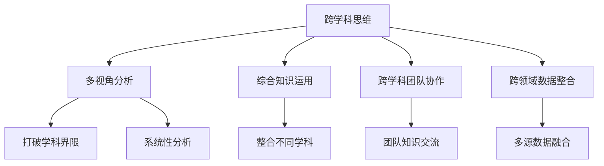

                 

# 理解洞察力的提升：培养跨学科思维

在当今这个信息爆炸的时代，我们面临的问题已经不再局限于单一领域，而是日益复杂和交叉。因此，培养跨学科思维，提升洞察力，已经成为解决复杂问题的关键。本文将从背景介绍、核心概念、算法原理、实际应用场景、工具和资源等多个角度，全面解读跨学科思维的提升，并展望未来的发展趋势和面临的挑战。

## 1. 背景介绍

### 1.1 问题由来

随着科技的飞速发展，现代社会的复杂性也在不断增加。经济、社会、科技、环境等领域相互交织，共同影响着全球的命运。面对这些复杂问题，单一领域的知识已经难以提供足够的解决方案。只有通过跨学科的视角，综合运用多领域的知识和方法，才能更好地理解问题本质，制定有效的应对策略。

### 1.2 问题核心关键点

跨学科思维的核心在于综合利用多个领域的知识和方法，突破传统学科的边界，寻找问题的多重解法。具体而言，关键点包括：

1. **多视角分析**：从多个学科的角度审视问题，理解其深层次的联系和影响。
2. **综合知识运用**：将不同学科的知识和方法整合起来，形成系统的解决方案。
3. **跨学科团队协作**：在多元化的团队中，通过交流和协作，激发创新的思维和灵感。
4. **跨领域数据整合**：利用来自不同领域的数据和信息，增强分析的全面性和深度。

## 2. 核心概念与联系

### 2.1 核心概念概述

为了更好地理解跨学科思维，我们需要掌握以下几个关键概念：

- **跨学科思维**：打破学科界限，综合运用不同领域知识的方法论。
- **多视角分析**：从不同学科角度分析问题的思维方式。
- **综合知识运用**：将不同学科知识进行整合，形成系统性解决方案。
- **跨学科团队协作**：不同学科背景的团队成员协作，促进知识和思维的交流与碰撞。
- **跨领域数据整合**：从多个领域获取数据和信息，增强分析的深度和广度。

### 2.2 核心概念原理和架构的 Mermaid 流程图



这个流程图展示了跨学科思维的核心概念及其相互关系：

1. 跨学科思维以多视角分析为基础，打破学科界限，系统性地分析问题。
2. 综合知识运用将不同学科的知识进行整合，形成系统的解决方案。
3. 跨学科团队协作通过团队交流，促进知识和思维的融合。
4. 跨领域数据整合利用多个领域的数据，增强分析的深度和广度。

## 3. 核心算法原理 & 具体操作步骤

### 3.1 算法原理概述

跨学科思维的提升，涉及算法和模型的设计和优化。其核心思想是通过对多个学科的数据和知识进行整合，形成更具系统性和全局性的分析。这一过程可以概括为以下几个步骤：

1. **数据收集**：从不同领域收集数据，确保数据的多样性和全面性。
2. **数据预处理**：清洗和标准化数据，确保数据的准确性和一致性。
3. **算法选择**：选择合适的算法或模型，进行多视角分析。
4. **知识整合**：将不同学科的知识进行整合，形成系统的解决方案。
5. **模型优化**：通过迭代和优化，提升模型的精度和泛化能力。

### 3.2 算法步骤详解

具体来说，跨学科思维的提升步骤如下：

1. **数据收集**：利用爬虫、API接口等方式，从多个领域获取数据。例如，从经济、社会、科技、环境等多个领域收集相关数据。

2. **数据预处理**：对收集到的数据进行清洗、标准化处理。例如，去除重复数据、处理缺失值、转换数据格式等。

3. **算法选择**：选择合适的算法或模型进行多视角分析。例如，使用机器学习算法进行数据分析，使用统计方法进行模型验证。

4. **知识整合**：将不同学科的知识进行整合，形成系统的解决方案。例如，将经济学、社会学、科技等领域的知识整合，形成综合分析框架。

5. **模型优化**：通过迭代和优化，提升模型的精度和泛化能力。例如，使用交叉验证、参数调优等方法，提高模型的性能。

### 3.3 算法优缺点

跨学科思维的提升方法具有以下优点：

- **多视角分析**：从多个学科角度审视问题，提供更全面的视角。
- **系统性解决方案**：将不同学科的知识整合起来，形成系统的解决方案。
- **跨学科团队协作**：促进不同学科之间的知识交流和协作，激发创新的思维和灵感。

同时，该方法也存在一定的局限性：

- **数据获取难度**：不同领域的数据获取难度较大，可能需要耗费大量的时间和资源。
- **知识整合难度**：不同学科的知识和方法存在差异，整合难度较大，需要较强的跨学科理解和沟通能力。
- **算法选择复杂**：需要根据具体问题和数据特点选择合适的算法，增加了复杂性。

### 3.4 算法应用领域

跨学科思维在多个领域都有广泛的应用，例如：

- **环境保护**：综合运用经济学、环境科学、社会学等领域的知识，制定环境保护政策。
- **医疗健康**：整合生物学、医学、心理学等领域的知识，提高医疗诊断和治疗的精准性。
- **城市规划**：结合经济学、社会学、工程学等领域的知识，优化城市规划和建设。
- **智能制造**：整合计算机科学、机械工程、材料科学等领域的知识，提升制造业的智能化水平。
- **金融科技**：融合经济学、金融学、计算机科学等领域的知识，推动金融科技的发展。

## 4. 数学模型和公式 & 详细讲解 & 举例说明

### 4.1 数学模型构建

为了更好地解释跨学科思维，我们可以使用以下数学模型：

假设有一个复杂问题 $P$，涉及多个领域 $D_1, D_2, \ldots, D_n$。我们希望通过跨学科思维，综合运用这些领域的方法，找到最优解决方案 $S$。

我们可以将问题 $P$ 表示为：

$$
P = D_1 \oplus D_2 \oplus \ldots \oplus D_n
$$

其中 $\oplus$ 表示整合不同领域知识的运算符。

### 4.2 公式推导过程

接下来，我们通过推导过程，展示如何通过跨学科思维，找到最优解决方案 $S$。

1. **数据收集**：
   - 从 $D_1, D_2, \ldots, D_n$ 收集数据 $X_1, X_2, \ldots, X_n$。

2. **数据预处理**：
   - 对 $X_1, X_2, \ldots, X_n$ 进行清洗、标准化处理。

3. **算法选择**：
   - 选择合适的算法或模型，对 $X_1, X_2, \ldots, X_n$ 进行多视角分析。

4. **知识整合**：
   - 将不同学科的知识进行整合，形成系统的解决方案 $S$。

5. **模型优化**：
   - 通过迭代和优化，提升模型的精度和泛化能力。

### 4.3 案例分析与讲解

为了更好地理解跨学科思维，我们可以以环境保护为例，进行详细讲解。

假设我们要解决全球变暖问题，需要综合运用经济学、环境科学、社会学等领域的知识。具体步骤如下：

1. **数据收集**：
   - 从经济学领域收集碳排放、GDP、人口等数据。
   - 从环境科学领域收集温室气体浓度、森林覆盖率等数据。
   - 从社会学领域收集公众意识、政策法规等数据。

2. **数据预处理**：
   - 对收集到的数据进行清洗、标准化处理。

3. **算法选择**：
   - 使用机器学习算法进行数据分析。
   - 使用统计方法进行模型验证。

4. **知识整合**：
   - 将经济学、环境科学、社会学等领域的知识进行整合，形成系统的解决方案。
   - 例如，将碳排放与GDP之间的关系进行建模，分析经济发展对环境的影响。

5. **模型优化**：
   - 通过迭代和优化，提升模型的精度和泛化能力。
   - 例如，使用交叉验证、参数调优等方法，提高模型的性能。

## 5. 项目实践：代码实例和详细解释说明

### 5.1 开发环境搭建

在进行跨学科思维提升的项目实践前，我们需要准备好开发环境。以下是使用Python进行Scikit-learn开发的示例环境配置流程：

1. 安装Anaconda：从官网下载并安装Anaconda，用于创建独立的Python环境。

2. 创建并激活虚拟环境：
```bash
conda create -n scikit-learn-env python=3.8 
conda activate scikit-learn-env
```

3. 安装Scikit-learn、Pandas、NumPy等工具包：
```bash
pip install scikit-learn pandas numpy
```

4. 安装相关的数据集和库：
```bash
pip install datasets scikit-multilearn
```

### 5.2 源代码详细实现

这里我们以环境保护问题为例，展示如何使用Scikit-learn进行跨学科思维提升的代码实现。

首先，导入必要的库和数据集：

```python
import pandas as pd
from sklearn.model_selection import train_test_split
from sklearn.ensemble import RandomForestRegressor
from sklearn.metrics import mean_squared_error

# 导入数据集
data = pd.read_csv('environmental_data.csv')
```

然后，进行数据预处理：

```python
# 数据清洗
data.dropna(inplace=True)

# 数据标准化
from sklearn.preprocessing import StandardScaler
scaler = StandardScaler()
scaled_data = scaler.fit_transform(data)
```

接着，设计模型并进行训练：

```python
# 模型选择
model = RandomForestRegressor(n_estimators=100, random_state=42)

# 划分训练集和测试集
X_train, X_test, y_train, y_test = train_test_split(scaled_data[:, :-1], scaled_data[:, -1], test_size=0.2, random_state=42)

# 训练模型
model.fit(X_train, y_train)
```

最后，评估模型的性能：

```python
# 模型评估
y_pred = model.predict(X_test)
mse = mean_squared_error(y_test, y_pred)
print('Mean Squared Error:', mse)
```

以上就是使用Scikit-learn进行跨学科思维提升的完整代码实现。可以看到，通过Scikit-learn库，我们可以利用机器学习算法，对多领域数据进行整合和分析，从而得到综合的解决方案。

### 5.3 代码解读与分析

让我们再详细解读一下关键代码的实现细节：

- **数据清洗**：通过 `data.dropna(inplace=True)` 方法，移除缺失值。
- **数据标准化**：使用 `StandardScaler` 对数据进行标准化处理，确保数据的准确性和一致性。
- **模型选择**：选择随机森林模型，具有较好的泛化能力和抗干扰能力。
- **数据划分**：通过 `train_test_split` 方法，将数据划分为训练集和测试集。
- **模型训练**：使用 `model.fit` 方法，训练随机森林模型。
- **模型评估**：使用 `mean_squared_error` 方法，计算模型在测试集上的均方误差。

通过这些步骤，我们可以系统地进行跨学科思维提升，从而得到更全面、系统的解决方案。

## 6. 实际应用场景

### 6.1 智能制造

跨学科思维在智能制造领域有广泛的应用，例如：

- **设计优化**：综合运用机械工程、材料科学、计算机科学等领域的知识，优化产品设计。
- **生产调度**：结合生产管理、物流优化、自动化控制等领域的知识，提升生产效率。
- **质量控制**：整合质量检测、数据分析、机器学习等领域的知识，提升产品质量和检测精度。

### 6.2 医疗健康

跨学科思维在医疗健康领域也有着重要的应用，例如：

- **疾病诊断**：综合运用生物学、医学、心理学等领域的知识，提高诊断的准确性和个性化。
- **治疗方案**：结合临床医学、药理学、生物学等领域的知识，制定更加有效的治疗方案。
- **健康管理**：整合生理监测、数据分析、智能算法等领域的知识，提升健康管理的科学性和精准性。

### 6.3 环境保护

跨学科思维在环境保护领域也有着重要的应用，例如：

- **污染治理**：综合运用环境科学、化学工程、经济学等领域的知识，制定污染治理策略。
- **资源利用**：结合资源管理、环境科学、经济学等领域的知识，优化资源利用效率。
- **生态保护**：整合生态学、环境科学、社会学等领域的知识，制定生态保护政策。

## 7. 工具和资源推荐

### 7.1 学习资源推荐

为了帮助开发者系统掌握跨学科思维的提升，以下是一些优质的学习资源：

1. 《数据科学导论》：详细介绍数据科学基础知识和跨学科思维方法。
2. 《Python机器学习》：讲解机器学习算法在跨学科思维中的应用。
3. 《跨学科思维导论》：系统讲解跨学科思维的原理和实践方法。
4. 《跨学科项目实战》：通过实际项目案例，展示跨学科思维的应用。
5. 在线课程：如Coursera、edX等平台的跨学科课程，涵盖多个领域的知识和方法。

通过对这些资源的学习实践，相信你一定能够快速掌握跨学科思维的精髓，并用于解决实际的跨领域问题。

### 7.2 开发工具推荐

高效的开发离不开优秀的工具支持。以下是几款用于跨学科思维提升开发的常用工具：

1. Jupyter Notebook：基于Web的交互式开发环境，支持代码、数据、文档的同步展示，便于团队协作。
2. PyCharm：强大的Python IDE，支持数据科学、机器学习等工具的集成，提供丰富的开发功能。
3. Visual Studio Code：轻量级的代码编辑器，支持Python、R等语言，具有强大的插件生态系统。
4. Anaconda：Python环境的集成工具，支持虚拟环境管理和依赖包管理，便于科学计算和数据处理。
5. Scikit-learn：开源机器学习库，提供丰富的算法和工具，支持多领域数据的整合和分析。

合理利用这些工具，可以显著提升跨学科思维提升的开发效率，加快创新迭代的步伐。

### 7.3 相关论文推荐

跨学科思维的研究源于学界的持续研究。以下是几篇奠基性的相关论文，推荐阅读：

1. "Interdisciplinary Thinking in Multidisciplinary Research"：介绍跨学科思维的框架和方法。
2. "Multidisciplinary Modeling in Science and Engineering"：讲解跨学科模型和案例。
3. "Collaborative Cross-Disciplinary Research"：探讨跨学科研究的合作机制和平台。
4. "The Rise of Interdisciplinary Research in Science"：分析跨学科研究的发展趋势和挑战。
5. "Cross-Disciplinary Learning in Higher Education"：讨论跨学科学习在教育中的应用和效果。

这些论文代表了大跨学科思维的发展脉络。通过学习这些前沿成果，可以帮助研究者把握学科前进方向，激发更多的创新灵感。

## 8. 总结：未来发展趋势与挑战

### 8.1 研究成果总结

本文系统地介绍了跨学科思维提升的基本原理、操作步骤和实际应用，揭示了跨学科思维在多个领域的重要价值。具体而言，关键点包括：

1. **多视角分析**：从多个学科角度审视问题，提供更全面的视角。
2. **系统性解决方案**：将不同学科的知识整合起来，形成系统的解决方案。
3. **跨学科团队协作**：促进不同学科之间的知识交流和协作，激发创新的思维和灵感。
4. **跨领域数据整合**：利用来自不同领域的数据，增强分析的深度和广度。

### 8.2 未来发展趋势

展望未来，跨学科思维提升将呈现以下几个发展趋势：

1. **多领域数据融合**：随着数据采集技术的进步，跨领域数据融合将更加广泛，提升分析的深度和广度。
2. **算法和模型集成**：跨学科思维的提升将更加依赖于算法的集成和模型的融合，提升综合分析的能力。
3. **跨学科知识图谱**：利用知识图谱技术，构建跨学科知识网络，促进不同学科知识的整合。
4. **跨学科协作平台**：建设跨学科协作平台，促进不同学科专家之间的交流和协作。
5. **跨学科课程体系**：在教育体系中引入跨学科课程，培养学生的跨学科思维能力。

### 8.3 面临的挑战

尽管跨学科思维提升已经取得了一定的进展，但在迈向更加智能化、普适化应用的过程中，仍面临诸多挑战：

1. **数据获取难度**：不同领域的数据获取难度较大，可能需要耗费大量的时间和资源。
2. **知识整合难度**：不同学科的知识和方法存在差异，整合难度较大，需要较强的跨学科理解和沟通能力。
3. **算法选择复杂**：需要根据具体问题和数据特点选择合适的算法，增加了复杂性。
4. **协作难度**：跨学科协作需要跨越学科壁垒，需要高效的沟通和协调机制。

### 8.4 研究展望

面对跨学科思维提升所面临的种种挑战，未来的研究需要在以下几个方面寻求新的突破：

1. **跨领域数据挖掘**：探索高效的数据获取和整合方法，降低数据获取的难度。
2. **知识图谱构建**：利用知识图谱技术，构建跨学科知识网络，促进知识的整合和共享。
3. **跨学科协作机制**：建立高效的跨学科协作平台，促进不同学科专家之间的交流和协作。
4. **跨学科课程设计**：在教育体系中引入跨学科课程，培养学生的跨学科思维能力。
5. **跨学科伦理和规范**：制定跨学科研究的伦理和规范，确保研究的科学性和公正性。

这些研究方向的探索，必将引领跨学科思维提升技术迈向更高的台阶，为构建安全、可靠、可解释、可控的智能系统铺平道路。面向未来，跨学科思维提升技术还需要与其他人工智能技术进行更深入的融合，如知识表示、因果推理、强化学习等，多路径协同发力，共同推动自然语言理解和智能交互系统的进步。只有勇于创新、敢于突破，才能不断拓展跨学科思维的边界，让智能技术更好地造福人类社会。

## 9. 附录：常见问题与解答

**Q1：如何培养跨学科思维？**

A: 培养跨学科思维需要系统学习和实践。建议从以下几个方面入手：

1. **跨学科课程**：参加跨学科课程，学习不同学科的知识和方法。
2. **项目实践**：参与跨学科项目，实际操作和解决复杂问题。
3. **团队协作**：加入跨学科团队，与不同学科背景的专家进行交流和协作。
4. **跨领域阅读**：广泛阅读不同学科的文献和书籍，拓展知识面。

**Q2：跨学科思维在实际应用中有哪些案例？**

A: 跨学科思维在实际应用中有许多成功案例，例如：

1. **智能制造**：将机械工程、材料科学、计算机科学等领域的知识整合，优化产品设计和生产流程。
2. **医疗健康**：整合生物学、医学、心理学等领域的知识，提高疾病诊断和治疗的精准性。
3. **环境保护**：综合运用经济学、环境科学、社会学等领域的知识，制定环境保护策略。

**Q3：跨学科思维在数据获取和整合中需要注意哪些问题？**

A: 跨学科思维在数据获取和整合中需要注意以下问题：

1. **数据来源多样性**：从多个领域获取数据，确保数据的全面性和多样性。
2. **数据格式统一**：将不同领域的数据进行格式统一，便于整合和分析。
3. **数据质量保证**：确保数据的质量和准确性，避免噪音干扰。
4. **数据隐私保护**：在数据获取和整合过程中，注意隐私保护，遵守相关法规。

**Q4：跨学科团队协作中需要注意哪些问题？**

A: 跨学科团队协作需要注意以下问题：

1. **沟通机制**：建立高效的沟通机制，促进不同学科专家之间的交流。
2. **角色分工**：明确团队成员的角色和职责，避免交叉和遗漏。
3. **协作平台**：利用协作平台，实现数据的共享和协同编辑。
4. **文化融合**：尊重不同学科的文化和思维方式，促进团队融合。

---

作者：禅与计算机程序设计艺术 / Zen and the Art of Computer Programming

