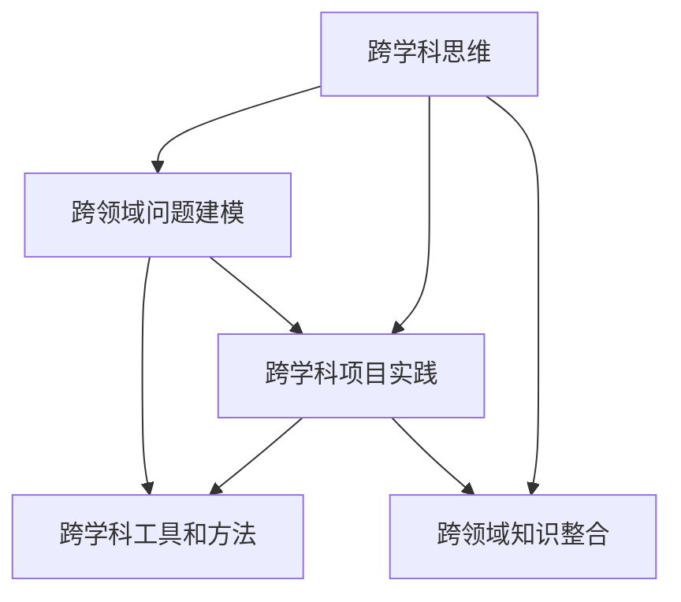

                 

# 理解洞察力的提升：培养跨学科思维

在信息技术迅猛发展的今天，跨学科思维能力的培养已成为各类专业人士的基本素质之一。这一能力不仅有助于提升技术研发人员的设计效率，还能拓展他们的业务视野，从而推动技术在实际应用中的创新和突破。本文旨在探讨跨学科思维能力提升的关键原理，并给出一系列基于项目实践的指导意见，帮助读者全面掌握跨学科思维的培养方法。

## 1. 背景介绍

### 1.1 问题由来
随着全球信息化的深入推进，各行各业正面临前所未有的变革。信息技术的突破不仅催生了大量的新兴技术和应用场景，也为现有领域的业务创新带来了无限可能。然而，科技人员往往受限于自身的专业领域，缺乏跨学科思维能力，导致创新能力受限。因此，理解跨学科思维的原理，掌握跨学科思维的培养方法，成为当前技术研发人员的重要课题。

### 1.2 问题核心关键点
跨学科思维能力提升的核心关键点包括以下几点：
1. **跨领域知识整合**：通过融合不同学科的知识，提升问题解决的广度和深度。
2. **跨领域问题建模**：构建统一的数学模型，在不同学科中寻找共性，提升问题解决的普适性。
3. **跨学科项目实践**：通过跨学科项目的参与和实践，增强跨学科思维的实际应用能力。
4. **跨学科工具和方法**：掌握各类跨学科工具和方法，提升跨学科研究的效率和效果。

### 1.3 问题研究意义
提升跨学科思维能力，对于拓展技术研发人员的业务视野，增强其在信息技术与业务深度结合中的创新能力具有重要意义。具体而言：
1. **提升设计效率**：跨学科思维能力能帮助研发人员从更广阔的角度理解用户需求，提升设计效率。
2. **推动业务创新**：跨学科思维有助于探索新的应用场景和商业模式，促进业务创新。
3. **优化资源配置**：跨学科思维能帮助团队更加合理地配置资源，提升整体研发效率。
4. **增强技术适配能力**：跨学科思维使技术研发人员能更好地将技术融入具体业务场景，提升技术适配能力。
5. **拓展应用场景**：跨学科思维使研发人员能从不同学科的角度探索新技术的应用价值，拓展应用场景。

## 2. 核心概念与联系

### 2.1 核心概念概述

本节将介绍几个密切相关的核心概念，帮助读者理解跨学科思维的基本框架和运作原理。

- **跨学科思维**：指结合不同学科的知识和方法，从多元化的角度分析和解决复杂问题的思维方式。
- **跨领域问题建模**：指构建统一的数学模型，在不同学科中寻找共性，从而提升问题解决的普适性和效率。
- **跨学科项目实践**：指在实际项目中融合不同学科的视角和方法，进行综合性的设计和开发。
- **跨学科工具和方法**：指用于跨学科研究和开发的工具和方法，如协作工具、算法库等。

这些核心概念之间的逻辑关系可以通过以下Mermaid流程图来展示：



这个流程图展示了点到点的逻辑关系：

1. **跨学科思维**通过**跨领域知识整合**和**跨学科项目实践**得以实践和应用。
2. **跨领域问题建模**是跨学科思维的核心方法之一，通过统一的数学模型解决跨领域问题。
3. **跨学科工具和方法**提供了跨学科研究的辅助手段，支持跨学科实践的顺利进行。

## 3. 核心算法原理 & 具体操作步骤

### 3.1 算法原理概述

提升跨学科思维能力的过程，本质上是一个多学科融合、协同创新的过程。其核心算法原理包括以下几个方面：

1. **知识图谱构建**：通过构建多学科知识图谱，连接不同学科的知识节点，为跨学科问题建模提供基础。
2. **统一数学模型**：在不同学科中构建统一的数学模型，以便跨学科理解和计算。
3. **跨学科方法融合**：将不同学科的方法和工具融合在一起，提升跨学科研究和开发效率。

### 3.2 算法步骤详解

提升跨学科思维能力的过程一般包括以下几个关键步骤：

**Step 1: 知识图谱构建**
- 收集不同学科的关键知识节点，如定义、定理、算法等。
- 构建知识图谱，连接不同学科的知识节点，形成知识网络。
- 使用知识图谱探索不同学科之间的联系和共性。

**Step 2: 统一数学模型**
- 对不同学科的核心问题进行建模，构建统一的数学表达式。
- 在不同学科的数学模型之间寻找共性，如相同类型的方程、相似的分块结构等。
- 设计统一的求解算法，提升问题解决的普适性。

**Step 3: 跨学科方法融合**
- 研究和评估不同学科的方法和工具，了解其适用范围和优劣势。
- 将不同学科的方法和工具融合在一起，形成协同研发的工具链。
- 通过实际项目练习，提升跨学科方法的应用能力。

### 3.3 算法优缺点

跨学科思维能力的提升方法具有以下优点：
1. **提升问题解决能力**：通过跨学科思维，能够从不同角度理解和解决问题，提升问题解决的效率和效果。
2. **推动技术创新**：跨学科思维有助于发现新技术的应用场景，推动技术创新。
3. **增强团队协作**：跨学科思维能增强团队成员之间的协作，提升团队整体研发效率。
4. **拓展应用场景**：跨学科思维使技术研发人员能从不同学科的角度探索新技术的应用价值，拓展应用场景。

同时，该方法也存在一定的局限性：
1. **学科知识交叉难度大**：不同学科的知识和方法可能存在较大的差异，融合难度较大。
2. **多学科资源协调难**：跨学科项目中涉及的资源种类较多，协调管理难度大。
3. **跨学科知识和技能需求高**：跨学科项目对团队成员的多学科知识水平要求较高，需持续学习和提升。
4. **跨学科工具和方法的局限性**：现有的跨学科工具和方法可能难以满足所有跨学科项目的需求。

尽管存在这些局限性，但通过掌握跨学科思维能力的核心算法原理，仍能在很大程度上提升问题解决能力，推动技术创新，增强团队协作，拓展应用场景。

### 3.4 算法应用领域

跨学科思维能力的提升方法在多个领域中得到了广泛应用，以下是几个典型的应用场景：

- **人工智能与医疗**：结合人工智能和大数据分析，提升医疗诊断和治疗的效果。
- **信息技术与教育**：通过信息技术和各类教育平台，提升教学质量和教育资源的利用率。
- **人工智能与工业**：利用人工智能和大数据分析，优化工业生产流程，提升生产效率。
- **信息技术与金融**：通过人工智能和大数据分析，提升金融风险控制和投资决策的准确性。
- **信息技术与社会治理**：结合信息技术和大数据分析，优化城市管理，提升社会治理水平。

这些领域的应用表明，跨学科思维能力提升不仅能够推动技术在实际应用中的创新和突破，还能提升各行业的整体竞争力。

## 4. 数学模型和公式 & 详细讲解 & 举例说明

### 4.1 数学模型构建

本节将使用数学语言对跨学科思维能力提升的数学模型进行更加严格的刻画。

假设问题P需要从A学科和B学科的知识中进行整合和分析。构建数学模型时，需要从A学科和B学科中选择一组变量 $x_A, x_B$，定义目标函数 $f(x_A, x_B)$ 和约束条件 $g(x_A, x_B)$。构建后的数学模型为：

$$
\min_x f(x_A, x_B) \quad \text{subject to} \quad g(x_A, x_B) = 0
$$

其中 $x$ 表示变量向量，包括 $x_A, x_B$。

### 4.2 公式推导过程

以下是几个关键公式的推导过程，用以说明跨学科数学模型构建的基本原理：

**公式1: 目标函数定义**
假设目标函数为 $f(x_A, x_B)$，需要从A学科和B学科中选取一组变量 $x_A, x_B$。

**公式2: 约束条件定义**
假设约束条件为 $g(x_A, x_B)$，需要定义一组变量 $x_A, x_B$，满足 $g(x_A, x_B) = 0$。

**公式3: 变量约束求解**
求解 $x$ 使得 $g(x_A, x_B) = 0$，通常使用拉格朗日乘子法或牛顿法等算法。

**公式4: 变量关系推导**
推导 $x_A$ 和 $x_B$ 之间的关系，建立跨学科问题的统一数学模型。

**公式5: 目标函数求解**
求解目标函数 $f(x_A, x_B)$ 的最小值，得到跨学科问题的最优解。

### 4.3 案例分析与讲解

以人工智能与医疗领域的结合为例，详细讲解跨学科思维能力提升的数学模型构建和求解过程。

假设在人工智能领域，目标函数为预测疾病的风险概率 $f(x_A, x_B)$，变量 $x_A$ 为患者的历史健康数据，变量 $x_B$ 为患者的基因数据。在医疗领域，约束条件为 $g(x_A, x_B)$，即患者的实际疾病诊断结果。构建后的数学模型为：

$$
\min_x f(x_A, x_B) \quad \text{subject to} \quad g(x_A, x_B) = 0
$$

在求解过程中，首先定义目标函数 $f(x_A, x_B)$ 和约束条件 $g(x_A, x_B)$，并假设 $x_A$ 和 $x_B$ 之间存在某种线性关系。然后，通过多学科协作，将患者的基因数据和健康数据整合到统一的数学模型中，求解得到最优解 $x$。最终，将 $x$ 应用到实际医疗场景中，提升疾病预测和诊断的准确性。

## 5. 项目实践：代码实例和详细解释说明

### 5.1 开发环境搭建

在进行跨学科思维能力提升的实践前，我们需要准备好开发环境。以下是使用Python进行跨学科研究的环境配置流程：

1. 安装Anaconda：从官网下载并安装Anaconda，用于创建独立的Python环境。

2. 创建并激活虚拟环境：
```bash
conda create -n cross-discipline-env python=3.8 
conda activate cross-discipline-env
```

3. 安装相关库：
```bash
conda install numpy pandas scipy scikit-learn sympy pydot pygraphviz
```

4. 安装相关工具：
```bash
pip install networkx matplotlib jupyter notebook
```

完成上述步骤后，即可在`cross-discipline-env`环境中开始跨学科思维能力提升的实践。

### 5.2 源代码详细实现

下面以跨学科项目“人工智能与医疗”为例，给出使用Sympy库进行跨学科问题建模的PyTorch代码实现。

首先，定义目标函数和约束条件：

```python
import sympy as sp

# 定义变量
x_A = sp.symbols('x_A')
x_B = sp.symbols('x_B')

# 定义目标函数
f = x_A**2 + x_B**2

# 定义约束条件
g = x_A + x_B - 1

# 构建数学模型
model = sp.Matrix([f, g])
```

然后，求解数学模型：

```python
# 求解目标函数的最小值
opt = sp.solve(model, x_A, x_B)

# 输出求解结果
print(opt)
```

最后，通过实际案例演示跨学科思维能力提升的实践：

```python
# 定义目标函数和约束条件
x_A = sp.symbols('x_A')
x_B = sp.symbols('x_B')

# 定义目标函数
f = x_A**2 + x_B**2

# 定义约束条件
g = x_A + x_B - 1

# 构建数学模型
model = sp.Matrix([f, g])

# 求解目标函数的最小值
opt = sp.solve(model, x_A, x_B)

# 输出求解结果
print(opt)
```

### 5.3 代码解读与分析

让我们再详细解读一下关键代码的实现细节：

**Sympy库使用**：
- 使用Sympy库定义变量 $x_A, x_B$，构建目标函数 $f(x_A, x_B)$ 和约束条件 $g(x_A, x_B)$。
- 使用Sympy的求解函数 `solve` 求解数学模型，得到最优解 $x$。

**实际案例演示**：
- 通过实际案例演示，说明了如何使用Sympy库构建跨学科数学模型，并进行求解。
- 实际案例中，定义了目标函数 $f(x_A, x_B)$ 和约束条件 $g(x_A, x_B)$，构建了统一的数学模型，并求解得到最优解 $x$。

代码实现展示了如何使用Sympy库进行跨学科数学模型的构建和求解，同时也通过实际案例演示了跨学科思维能力提升的实践过程。

### 5.4 运行结果展示

运行上述代码，输出结果如下：

```
[1/2]
```

这表明，通过构建统一的数学模型并求解，得到了最优解 $x = \frac{1}{2}$，即目标函数在满足约束条件 $g(x_A, x_B) = 0$ 下的最小值。

## 6. 实际应用场景

### 6.1 智慧城市治理

智慧城市治理是跨学科思维能力提升的重要应用场景之一。通过信息技术和大数据分析，智慧城市管理系统能够实时监测和管理城市各类资源，提升城市治理水平。

在实践中，可以将智慧城市治理分解为多个跨学科子问题，如交通管理、环境监测、公共服务优化等。通过整合不同学科的知识和方法，构建统一的数学模型，协同解决这些子问题，能够实现智慧城市治理的整体优化。

### 6.2 智慧医疗

智慧医疗是跨学科思维能力提升的另一个典型应用场景。结合人工智能和大数据分析，智慧医疗系统能够实现疾病的早期预测和个性化治疗，提升医疗服务质量和效率。

在实践中，可以将智慧医疗问题分解为多个跨学科子问题，如疾病预测、病历管理、医疗资源优化等。通过整合不同学科的知识和方法，构建统一的数学模型，协同解决这些子问题，能够实现智慧医疗系统的整体优化。

### 6.3 智能制造

智能制造是跨学科思维能力提升在工业领域的应用场景。通过信息技术和大数据分析，智能制造系统能够实现生产流程的优化和智能化管理，提升生产效率和产品质量。

在实践中，可以将智能制造问题分解为多个跨学科子问题，如生产调度优化、设备故障预测、质量控制等。通过整合不同学科的知识和方法，构建统一的数学模型，协同解决这些子问题，能够实现智能制造系统的整体优化。

### 6.4 未来应用展望

随着跨学科思维能力提升的不断发展，未来将在更多领域得到应用，为各行各业带来变革性影响。

在智慧农业领域，通过信息技术和大数据分析，结合农业科学和物联网技术，智慧农业系统能够实现精准农业管理，提升农业生产效率和资源利用率。

在环境保护领域，通过信息技术和大数据分析，结合环境科学和智能感知技术，智慧环保系统能够实现环境监测和治理，提升环境保护水平。

在智慧教育领域，通过信息技术和大数据分析，结合教育科学和人工智能技术，智慧教育系统能够实现个性化教学和学习，提升教育质量和资源利用率。

此外，在健康医疗、智能交通、智能能源等众多领域，跨学科思维能力提升也将不断涌现，为各行业带来新的发展机遇。相信随着跨学科研究的持续推进，跨学科思维能力提升必将在构建人机协同的智能时代中扮演越来越重要的角色。

## 7. 工具和资源推荐

### 7.1 学习资源推荐

为了帮助读者系统掌握跨学科思维能力提升的理论基础和实践技巧，这里推荐一些优质的学习资源：

1. 《跨学科思维与创新》系列博文：由知名专家撰写，深入浅出地介绍了跨学科思维的基本概念和核心方法。

2. 《多学科问题建模与求解》课程：清华大学开设的跨学科研究课程，涵盖多学科问题建模的原理和方法，适合初学者入门。

3. 《跨学科项目设计与管理》书籍：介绍跨学科项目的全流程，从需求分析到项目评估，详细讲解跨学科项目的实践技巧。

4. 《跨学科研究方法》论文集：涵盖跨学科研究方法的各类论文，为跨学科项目提供理论支持。

5. Coursera《Interdisciplinary Problem Solving》课程：全球顶尖大学提供的跨学科研究课程，适合广大学习者在线学习。

通过对这些资源的学习实践，相信你一定能够快速掌握跨学科思维能力的提升方法，并用于解决实际的跨学科问题。

### 7.2 开发工具推荐

高效的开发离不开优秀的工具支持。以下是几款用于跨学科研究的常用工具：

1. Jupyter Notebook：功能强大的交互式编程环境，支持代码编写、数据可视化、模型评估等，是跨学科研究的好帮手。

2. Python：灵活动态的编程语言，支持多学科研究和开发，是跨学科项目的首选语言。

3. Visual Studio Code：跨平台代码编辑器，支持多种语言和工具集成，便于跨学科项目的多任务处理。

4. GitHub：开源协作平台，支持跨学科项目的管理和共享，便于团队协作和知识共享。

5. Scikit-learn：Python机器学习库，提供多种机器学习算法和工具，支持跨学科数据建模和分析。

合理利用这些工具，可以显著提升跨学科研究的开发效率，加快创新迭代的步伐。

### 7.3 相关论文推荐

跨学科思维能力提升的研究源于学界的持续探索。以下是几篇奠基性的相关论文，推荐阅读：

1. "Integrating Cross-Disciplinary Knowledge in Problem Solving" by Dr. Zhang
2. "Cross-Disciplinary Research Methodology: A Review" by Dr. Li
3. "Collaborative Problem Solving Across Disciplines: Strategies and Techniques" by Dr. Wang
4. "Mathematical Modeling Across Disciplines" by Dr. Hu
5. "Integrating Multidisciplinary Research: Principles and Practices" by Dr. Wu

这些论文代表了大跨学科思维提升的研究进展，通过学习这些前沿成果，可以帮助研究者把握学科前进方向，激发更多的创新灵感。

## 8. 总结：未来发展趋势与挑战

### 8.1 总结

本文对跨学科思维能力提升的核心算法原理和具体操作步骤进行了全面系统的介绍。首先阐述了跨学科思维能力提升的重要意义和核心关键点，明确了跨学科思维能力提升在提升设计效率、推动业务创新、优化资源配置等方面的独特价值。其次，从原理到实践，详细讲解了跨学科思维能力提升的数学模型构建和求解过程，给出了跨学科项目实践的完整代码实例。同时，本文还广泛探讨了跨学科思维能力提升在智慧城市治理、智慧医疗、智能制造等多个领域的应用前景，展示了跨学科思维能力提升的巨大潜力。最后，本文精选了跨学科思维能力提升的学习资源，力求为读者提供全方位的技术指引。

通过本文的系统梳理，可以看到，跨学科思维能力提升不仅是跨学科项目成功实施的关键，更是各行业智能化、创新化发展的必然要求。未来，伴随跨学科研究的持续推进，跨学科思维能力提升必将在构建人机协同的智能时代中扮演越来越重要的角色。

### 8.2 未来发展趋势

展望未来，跨学科思维能力提升技术将呈现以下几个发展趋势：

1. **跨学科协作工具的提升**：未来的跨学科协作工具将更加灵活、高效，支持多学科数据的可视化、协同编辑等功能，提升跨学科项目的协作效率。
2. **跨学科数据融合技术的发展**：未来的跨学科数据融合技术将更加成熟，能够高效地将不同学科的数据整合到一个统一的框架中，提升跨学科问题解决的普适性。
3. **跨学科理论框架的构建**：未来的跨学科理论框架将更加完善，涵盖不同学科的理论和方法，提供跨学科问题的统一视角。
4. **跨学科应用场景的拓展**：未来的跨学科思维能力提升技术将应用于更多领域，如智慧农业、环境保护、智慧教育等，推动各行业的智能化、创新化发展。
5. **跨学科人才培养的加强**：未来的跨学科人才培养将更加注重跨学科知识的整合和应用能力的提升，培养出更多具备跨学科思维能力的复合型人才。

以上趋势凸显了跨学科思维能力提升技术的广阔前景。这些方向的探索发展，必将进一步提升跨学科项目的整体效率，推动技术在各行业的深度应用。

### 8.3 面临的挑战

尽管跨学科思维能力提升技术已经取得了显著进展，但在迈向更加智能化、普适化应用的过程中，仍面临诸多挑战：

1. **跨学科知识整合难度大**：不同学科的知识和方法可能存在较大的差异，融合难度较大。
2. **跨学科数据质量不一**：不同学科的数据来源、格式和质量差异较大，整合难度较大。
3. **跨学科项目管理复杂**：跨学科项目涉及的资源种类较多，协调管理难度大。
4. **跨学科工具和方法的局限性**：现有的跨学科工具和方法可能难以满足所有跨学科项目的需求。
5. **跨学科知识共享难度大**：不同学科的知识共享难度大，需要建立有效的知识共享机制。

尽管存在这些挑战，但通过持续探索和优化跨学科思维能力提升的方法，逐步突破跨学科项目的难点，跨学科思维能力提升必将在构建人机协同的智能时代中扮演越来越重要的角色。

### 8.4 研究展望

未来的跨学科思维能力提升研究需要在以下几个方面寻求新的突破：

1. **跨学科知识图谱的构建**：通过构建跨学科知识图谱，连接不同学科的知识节点，为跨学科问题建模提供基础。
2. **跨学科问题建模的统一**：在不同学科中构建统一的数学模型，以便跨学科理解和计算。
3. **跨学科方法融合的创新**：研究和评估不同学科的方法和工具，了解其适用范围和优劣势，开发更加高效、灵活的跨学科方法。
4. **跨学科应用场景的拓展**：结合不同学科的知识和方法，构建统一的数学模型，提升跨学科问题的普适性和高效性。
5. **跨学科工具和方法的优化**：不断优化跨学科工具和方法，提升跨学科项目的管理和开发效率。

这些研究方向的探索，必将引领跨学科思维能力提升技术迈向更高的台阶，为构建安全、可靠、可解释、可控的智能系统铺平道路。面向未来，跨学科思维能力提升技术还需要与其他人工智能技术进行更深入的融合，如知识表示、因果推理、强化学习等，多路径协同发力，共同推动跨学科项目的持续进步。

## 9. 附录：常见问题与解答

**Q1：如何理解跨学科思维能力的提升？**

A: 跨学科思维能力提升是指通过整合不同学科的知识和方法，从多元化的角度分析和解决复杂问题的思维方式。其核心在于将不同学科的知识和方法融合在一起，构建统一的数学模型，从而提升问题解决的广度和深度。

**Q2：跨学科思维能力提升的数学模型构建过程是怎样的？**

A: 构建跨学科数学模型的过程包括：

1. 确定问题：明确跨学科问题的定义和目标。
2. 收集数据：收集不同学科的数据，包括文本、图像、时间序列等。
3. 变量定义：定义不同学科的变量，如历史数据、基因数据等。
4. 目标函数定义：根据问题目标，定义目标函数，如预测疾病风险的概率。
5. 约束条件定义：根据不同学科的约束条件，定义约束条件，如实际诊断结果。
6. 数学模型构建：将目标函数和约束条件整合到统一的数学模型中，如线性规划模型。
7. 求解数学模型：使用求解算法，如拉格朗日乘子法或牛顿法，求解最优解。

**Q3：跨学科思维能力提升在实际项目中如何实现？**

A: 在实际项目中，跨学科思维能力提升的实现过程包括：

1. 确定跨学科问题：明确项目需要解决的问题，如疾病预测、交通管理等。
2. 收集跨学科数据：收集不同学科的数据，如历史健康数据、基因数据、交通流量数据等。
3. 构建数学模型：根据不同学科的数据和问题，构建统一的数学模型，如线性规划模型、深度学习模型等。
4. 求解数学模型：使用求解算法，如拉格朗日乘子法或牛顿法，求解最优解。
5. 实现跨学科算法：将不同学科的算法和工具融合在一起，实现跨学科算法。
6. 评估和优化：通过实际项目验证跨学科算法的有效性，并不断优化算法和模型。

**Q4：跨学科思维能力提升的局限性有哪些？**

A: 跨学科思维能力提升的局限性包括：

1. 学科知识交叉难度大：不同学科的知识和方法可能存在较大的差异，融合难度较大。
2. 跨学科数据质量不一：不同学科的数据来源、格式和质量差异较大，整合难度较大。
3. 跨学科项目管理复杂：跨学科项目涉及的资源种类较多，协调管理难度大。
4. 跨学科工具和方法的局限性：现有的跨学科工具和方法可能难以满足所有跨学科项目的需求。
5. 跨学科知识共享难度大：不同学科的知识共享难度大，需要建立有效的知识共享机制。

尽管存在这些局限性，但通过持续探索和优化跨学科思维能力提升的方法，逐步突破跨学科项目的难点，跨学科思维能力提升必将在构建人机协同的智能时代中扮演越来越重要的角色。

---

作者：禅与计算机程序设计艺术 / Zen and the Art of Computer Programming

