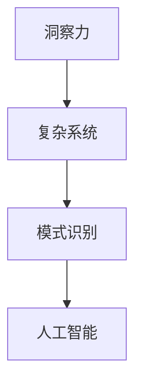

                 

# 理解洞察力的极限：在混乱中寻找规律

> 关键词：洞察力极限, 数据洞察, 人工智能, 机器学习, 复杂系统, 模式识别

## 1. 背景介绍

### 1.1 问题由来

在数据爆炸的时代，如何从海量数据中提取有价值的信息，成为各行各业亟待解决的难题。传统的数据挖掘方法基于统计分析、关联规则、分类算法等，已经难以应对复杂多变的现实问题。人工智能技术，尤其是机器学习和深度学习，通过构建复杂模型，挖掘数据中的潜在规律，为这个问题提供了一种新的解决思路。

然而，即便在数据量巨大的情况下，模型也往往难以捕捉到数据中所有的复杂模式和关系。数据中的噪声、异常、缺失等因素，以及模型自身的复杂性和非线性性质，限制了其对真实规律的全面理解。如何在混乱中寻找规律，成为人工智能研究的前沿问题。

### 1.2 问题核心关键点

洞察力是数据挖掘和人工智能的核心目标，但这一过程受到数据复杂性、模型能力、计算资源等多重因素的制约。具体来说，面对以下几类核心问题，如何提升数据洞察力成为研究的重点：

- **数据质量与噪音**：如何处理缺失、异常、重复等数据问题，提升数据质量？
- **模型能力与复杂性**：如何构建高效、鲁棒的模型，捕捉数据中的复杂模式？
- **计算资源与效率**：如何在有限的资源条件下，高效地进行模式识别和规律挖掘？

这些核心问题不仅影响数据挖掘的实际应用效果，也是人工智能技术进一步发展的瓶颈。因此，理解和应对这些挑战，是提升数据洞察力的关键。

## 2. 核心概念与联系

### 2.1 核心概念概述

为更好地理解如何在混乱中寻找规律，本文将介绍几个关键概念：

- **洞察力**：从海量数据中提取有价值信息的思维和能力。
- **复杂系统**：由大量元素通过非线性关系组成的动态系统，其行为难以预测。
- **模式识别**：通过计算模型识别数据中的规律和结构，是洞察力的重要手段。
- **人工智能**：模拟人类智能过程的技术，通过构建模型和算法，提升洞察力。

这些概念之间的逻辑关系可以通过以下Mermaid流程图来展示：



这个流程图展示了一个数据洞察的完整链条：从复杂系统的行为分析，到模式识别和人工智能模型的构建，最终形成对数据中的规律的全面理解。

## 3. 核心算法原理 & 具体操作步骤
### 3.1 算法原理概述

提升数据洞察力的核心在于构建高效、鲁棒的模型，并使用其进行模式识别。本文将重点介绍三种关键算法：

- **生成模型**：如隐马尔可夫模型(HMM)、条件随机场(CRF)等，通过建模数据生成过程，捕捉数据中的隐含关系。
- **判别模型**：如支持向量机(SVM)、随机森林(Random Forest)等，直接建模数据与标签之间的关系，提升分类和预测能力。
- **深度学习模型**：如神经网络、卷积神经网络(CNN)、循环神经网络(RNN)等，通过多层次特征提取和复杂非线性关系建模，提升对数据复杂性的捕捉能力。

这些算法在数据洞察的不同阶段，都发挥着重要作用。生成模型用于建模复杂系统的动态行为，判别模型用于提升数据分类和预测的准确性，深度学习模型则用于挖掘数据中的深层次模式和关系。

### 3.2 算法步骤详解

以下分别介绍这三种算法的详细步骤和关键步骤：

#### 3.2.1 生成模型（如HMM）

1. **模型构建**：
   - 确定数据生成过程的参数，如状态数、转移概率、发射概率等。
   - 使用训练数据拟合模型参数，使得模型能够尽可能地拟合数据生成过程。

2. **参数估计**：
   - 利用最大似然或贝叶斯方法，估计模型参数，使其最大化数据似然。
   - 使用隐马尔可夫算法或条件随机场算法，推断模型参数的最优值。

3. **模型验证**：
   - 使用交叉验证、留出法等方法，评估模型在未见过的数据上的性能。
   - 分析模型参数的稳定性和鲁棒性，调整模型结构以提高性能。

#### 3.2.2 判别模型（如SVM）

1. **特征提取**：
   - 对原始数据进行特征提取，将高维数据映射到低维空间。
   - 选择合适的特征提取方法，如PCA、LDA、SVM等，将数据降维并捕捉关键特征。

2. **模型训练**：
   - 使用训练数据拟合判别模型，如支持向量机、随机森林等。
   - 调整模型参数，如核函数、正则化系数等，以提高模型的泛化能力和鲁棒性。

3. **模型评估**：
   - 使用测试数据评估模型性能，如准确率、召回率、F1分数等。
   - 分析模型的错误类型和误分类样本，调整模型参数以提高性能。

#### 3.2.3 深度学习模型（如神经网络）

1. **模型构建**：
   - 选择合适的神经网络结构，如全连接网络、卷积神经网络(CNN)、循环神经网络(RNN)等。
   - 设计模型超参数，如隐藏层数、神经元数、激活函数等，构建模型结构。

2. **模型训练**：
   - 使用训练数据拟合深度学习模型，通过反向传播算法优化模型参数。
   - 选择合适的优化算法，如梯度下降、Adam等，调整学习率、批量大小等参数。

3. **模型评估**：
   - 使用测试数据评估模型性能，如准确率、召回率、F1分数等。
   - 分析模型的错误类型和过拟合现象，调整模型结构、正则化方法等以提高性能。

### 3.3 算法优缺点

这三种算法各有优缺点，需要根据具体应用场景选择最合适的算法：

**生成模型**：
- **优点**：能够捕捉数据中的隐含关系，适用于处理动态数据。
- **缺点**：计算复杂度高，对数据质量和模型参数敏感。

**判别模型**：
- **优点**：直接建模数据与标签之间的关系，泛化能力强。
- **缺点**：特征提取效果依赖于输入数据的表示方法，处理噪声和异常数据能力有限。

**深度学习模型**：
- **优点**：模型结构复杂，能够捕捉数据中的深层次模式和关系。
- **缺点**：计算复杂度高，对数据量和计算资源要求高，模型训练和调参难度大。

### 3.4 算法应用领域

这三种算法在数据洞察的应用中，覆盖了几乎所有常见场景：

- **自然语言处理(NLP)**：使用生成模型和判别模型，如HMM、CRF、SVM、RNN等，进行文本分类、命名实体识别、情感分析等任务。
- **计算机视觉(CV)**：使用深度学习模型，如CNN、RNN等，进行图像分类、目标检测、图像分割等任务。
- **医疗健康**：使用生成模型和判别模型，如HMM、SVM、随机森林等，进行疾病预测、基因分析、药物研发等任务。
- **金融风控**：使用判别模型和深度学习模型，如SVM、随机森林、神经网络等，进行信用评分、风险预测、欺诈检测等任务。
- **电子商务**：使用生成模型和判别模型，如HMM、SVM、随机森林等，进行推荐系统、商品分类、用户行为分析等任务。

这些领域展示了生成模型、判别模型和深度学习模型在数据洞察中的广泛应用，推动了各行业的智能化转型。

## 4. 数学模型和公式 & 详细讲解 & 举例说明

### 4.1 数学模型构建

假设我们有一组观测数据 $\mathcal{D} = \{(x_i, y_i)\}_{i=1}^N$，其中 $x_i \in \mathcal{X}$ 为输入数据，$y_i \in \mathcal{Y}$ 为标签。我们的目标是通过训练一个模型 $f$，使得 $f(x_i)$ 能够准确预测 $y_i$。

### 4.2 公式推导过程

对于生成模型，如隐马尔可夫模型(HMM)，其状态转移和发射概率可以建模为：

$$
p(x_i|x_{i-1}, \theta) = \mathcal{N}(x_i; \mu_{x_{i-1}}, \Sigma_{x_{i-1}}) \\
p(y_i|x_i, \theta) = \mathcal{B}(y_i; \mu_y, \Sigma_y)
$$

其中 $\theta$ 为模型参数，$\mathcal{N}$ 和 $\mathcal{B}$ 分别为正态分布和伯努利分布。利用最大似然方法，可以得到模型参数的估计公式：

$$
\hat{\theta} = \mathop{\arg\min}_{\theta} -\sum_{i=1}^N \log p(x_i, y_i; \theta)
$$

对于判别模型，如支持向量机(SVM)，其模型可以表示为：

$$
f(x) = \sum_{i=1}^N \alpha_i \varphi(x_i)^\top \varphi(x) + b
$$

其中 $\varphi$ 为特征映射函数，$\alpha_i$ 为拉格朗日乘子，$b$ 为偏置项。通过求解Lagrange乘子，可以得到模型参数的估计公式：

$$
\hat{\alpha} = \mathop{\arg\min}_{\alpha} \frac{1}{2}\sum_{i=1}^N \alpha_i \alpha_j y_i y_j \varphi(x_i)^\top \varphi(x_j) - \sum_{i=1}^N \alpha_i y_i
$$

对于深度学习模型，如神经网络，其前向传播和后向传播过程可以表示为：

$$
\begin{aligned}
z_i &= \sum_{j=1}^m w_{ij} x_j + b_i \\
a_i &= \sigma(z_i) \\
L(y, \hat{y}) &= -\frac{1}{N}\sum_{i=1}^N y_i \log \hat{y}_i + (1-y_i) \log (1-\hat{y}_i)
\end{aligned}
$$

其中 $w$ 为权重矩阵，$b$ 为偏置向量，$\sigma$ 为激活函数，$L$ 为损失函数。利用梯度下降等优化算法，可以得到模型参数的估计公式：

$$
\theta \leftarrow \theta - \eta \nabla_{\theta} L(\theta)
$$

### 4.3 案例分析与讲解

以文本分类为例，使用朴素贝叶斯模型(Naive Bayes)进行分类。

假设我们有一组文本数据 $\mathcal{D} = \{(x_i, y_i)\}_{i=1}^N$，其中 $x_i$ 为文本，$y_i$ 为分类标签。

首先，对文本进行词袋模型(Bag of Words)表示，得到输入特征 $x_i = \{x_{i1}, x_{i2}, ..., x_{im}\}$，其中 $x_{ij}$ 表示文本中第 $j$ 个词的出现次数。

然后，利用朴素贝叶斯模型进行分类：

$$
p(y_i|x_i, \theta) = \prod_{j=1}^m p(x_{ij}|y_i, \theta)
$$

其中 $\theta$ 为模型参数，包括每个词在不同分类下的条件概率 $p(x_{ij}|y_i, \theta)$。

利用最大似然方法，可以得到模型参数的估计公式：

$$
\hat{\theta} = \mathop{\arg\min}_{\theta} -\sum_{i=1}^N \log p(x_i, y_i; \theta)
$$

通过求解上述优化问题，可以得到训练后的模型参数，并用于对新文本进行分类预测。

## 5. 项目实践：代码实例和详细解释说明
### 5.1 开发环境搭建

在进行项目实践前，我们需要准备好开发环境。以下是使用Python进行Scikit-Learn开发的环境配置流程：

1. 安装Anaconda：从官网下载并安装Anaconda，用于创建独立的Python环境。

2. 创建并激活虚拟环境：
```bash
conda create -n sklearn-env python=3.8 
conda activate sklearn-env
```

3. 安装Scikit-Learn和其他必要的库：
```bash
conda install scikit-learn pandas numpy matplotlib jupyter notebook ipython
```

4. 安装TensorFlow：
```bash
pip install tensorflow
```

5. 安装PyTorch：
```bash
pip install torch torchvision torchaudio
```

6. 安装Keras：
```bash
pip install keras
```

完成上述步骤后，即可在`sklearn-env`环境中开始项目实践。

### 5.2 源代码详细实现

以下是一个简单的朴素贝叶斯分类器的代码实现：

```python
from sklearn.naive_bayes import MultinomialNB
from sklearn.datasets import load_iris
from sklearn.model_selection import train_test_split

# 加载鸢尾花数据集
iris = load_iris()
X, y = iris.data, iris.target

# 将数据集划分为训练集和测试集
X_train, X_test, y_train, y_test = train_test_split(X, y, test_size=0.2, random_state=42)

# 创建朴素贝叶斯分类器
clf = MultinomialNB()

# 训练模型
clf.fit(X_train, y_train)

# 评估模型
accuracy = clf.score(X_test, y_test)
print(f"测试集准确率：{accuracy:.2f}")
```

### 5.3 代码解读与分析

让我们再详细解读一下关键代码的实现细节：

**加载数据集**：
- 使用Scikit-Learn内置的`load_iris`函数加载鸢尾花数据集，包含100个样本，每个样本有4个特征，分别表示花萼长度、花萼宽度、花瓣长度、花瓣宽度，以及对应的分类标签。

**数据划分**：
- 使用`train_test_split`函数将数据集划分为训练集和测试集，其中80%的数据用于训练，20%的数据用于测试。

**创建模型**：
- 创建朴素贝叶斯分类器，使用`MultinomialNB`类。

**训练模型**：
- 使用训练数据`X_train`和`y_train`拟合模型。

**评估模型**：
- 使用测试数据`X_test`和`y_test`评估模型性能，计算准确率并输出。

可以看到，使用Scikit-Learn进行数据挖掘任务非常方便快捷。通过简单的几行代码，便可以进行数据加载、划分、模型构建、训练和评估等步骤。

## 6. 实际应用场景

### 6.1 金融风控

在金融风控领域，如何识别和预防金融欺诈是一个重要问题。通过数据分析和机器学习技术，可以从大量的交易数据中提取规律，识别出异常交易行为，从而降低金融风险。

具体而言，可以收集用户的交易记录、行为数据、社交网络等信息，构建多模态数据集。然后使用生成模型和深度学习模型，如HMM、SVM、RNN等，对数据进行特征提取和分类预测，识别出潜在欺诈行为，并及时预警。

### 6.2 医疗健康

在医疗健康领域，如何从海量的医疗数据中提取有价值的信息，辅助医生进行诊断和治疗，是一个重要的研究方向。通过机器学习技术，可以从电子病历、影像数据、基因数据等中挖掘出有用的知识，提升医疗决策的科学性和精准性。

具体而言，可以收集患者的医疗记录、影像资料、基因信息等，使用生成模型和判别模型，如HMM、SVM、随机森林等，进行疾病预测、基因分析、药物研发等任务，提升诊断和治疗的准确性。

### 6.3 智慧城市

在智慧城市建设中，如何利用数据分析技术提升城市管理的智能化水平，是一个重要的研究方向。通过机器学习技术，可以从城市事件数据、交通数据、环境数据等中挖掘出有用的信息，提升城市管理的自动化和智能化水平。

具体而言，可以收集城市事件数据、交通数据、环境数据等，使用生成模型和判别模型，如HMM、SVM、随机森林等，进行城市事件监测、交通流量预测、环境污染分析等任务，提升城市管理的精准性和效率。

### 6.4 未来应用展望

随着数据挖掘技术的不断发展，未来数据洞察的应用领域将更加广泛。大数据、云计算、物联网等技术的融合，将为数据挖掘提供更加丰富、多元的数据来源。机器学习算法的进步，也将提升数据洞察的能力和精度。

未来，数据洞察技术将在更多领域得到应用，为各行各业带来变革性影响。在智慧医疗、智慧交通、智慧教育、智慧金融等众多领域，数据洞察技术将提升系统的智能化水平，推动社会的数字化转型。

## 7. 工具和资源推荐
### 7.1 学习资源推荐

为了帮助开发者系统掌握数据洞察的理论基础和实践技巧，这里推荐一些优质的学习资源：

1. 《机器学习实战》系列书籍：由权威机器学习专家撰写，全面介绍了机器学习的基本概念和算法，适合初学者入门。

2. 《深度学习》课程（斯坦福大学）：斯坦福大学开设的深度学习课程，涵盖深度学习的基本原理和应用，适合进阶学习。

3. 《统计学习方法》（李航）：经典的统计学习教材，介绍了常见的机器学习算法和应用。

4. Kaggle平台：数据挖掘竞赛平台，提供大量实际应用场景和数据集，可以锻炼实践能力。

5. GitHub开源项目：GitHub上众多开源数据挖掘项目，涵盖多种算法和应用场景，适合学习和参考。

通过对这些资源的学习实践，相信你一定能够快速掌握数据洞察的精髓，并用于解决实际的业务问题。

### 7.2 开发工具推荐

高效的开发离不开优秀的工具支持。以下是几款用于数据挖掘开发的常用工具：

1. Python：编程语言中的佼佼者，拥有丰富的数据挖掘库和算法包。

2. Scikit-Learn：Python的机器学习库，提供了简单易用的接口，支持多种机器学习算法。

3. TensorFlow：谷歌开源的机器学习框架，支持深度学习和分布式计算。

4. PyTorch：Facebook开源的深度学习框架，灵活性高，适用于科研和生产环境。

5. Keras：深度学习库，封装了TensorFlow和Theano，易于使用。

6. Weights & Biases：模型训练的实验跟踪工具，可以记录和可视化模型训练过程中的各项指标，方便对比和调优。

7. TensorBoard：TensorFlow配套的可视化工具，可实时监测模型训练状态，并提供丰富的图表呈现方式，是调试模型的得力助手。

合理利用这些工具，可以显著提升数据挖掘任务的开发效率，加快创新迭代的步伐。

### 7.3 相关论文推荐

数据挖掘和机器学习领域的研究始于学界的持续研究。以下是几篇奠基性的相关论文，推荐阅读：

1. Perceptron（1957）：Rosenblatt提出的第一个机器学习算法，开启了机器学习的研究之路。

2. AdaBoost（1995）：Freund和Schapire提出的集成学习算法，在实际应用中取得了很好的效果。

3. C4.5（1993）：Quinlan提出的决策树算法，是数据挖掘中的经典算法之一。

4. K-Means（1967）：MacQueen提出的聚类算法，是数据挖掘中的基本算法之一。

5. SVM（1995）：Vapnik提出的支持向量机，在分类和回归任务中表现优异。

这些论文代表了大数据挖掘和机器学习的研究脉络。通过学习这些前沿成果，可以帮助研究者把握学科前进方向，激发更多的创新灵感。

## 8. 总结：未来发展趋势与挑战

### 8.1 总结

本文对数据洞察的技术原理和应用方法进行了全面系统的介绍。首先阐述了数据洞察的重要性，明确了其在大数据时代的核心价值。其次，从原理到实践，详细讲解了生成模型、判别模型和深度学习模型的构建和应用，给出了实际应用中的关键步骤和示例代码。同时，本文还广泛探讨了数据洞察在金融风控、医疗健康、智慧城市等多个领域的应用前景，展示了其广泛的应用潜力。此外，本文精选了数据挖掘技术的各类学习资源，力求为读者提供全方位的技术指引。

通过本文的系统梳理，可以看到，数据洞察技术正在成为数据挖掘和人工智能研究的重要范式，极大地拓展了数据挖掘的应用边界，催生了更多的落地场景。受益于大数据和计算技术的发展，数据洞察能力将进一步提升，推动各行业的智能化转型，为经济社会发展注入新的动力。

### 8.2 未来发展趋势

展望未来，数据洞察技术将呈现以下几个发展趋势：

1. 数据来源多样化。大数据、云计算、物联网等技术的发展，将为数据洞察提供更加丰富、多元的数据来源。

2. 模型复杂性提升。未来的模型将更加复杂，融合多层次特征提取和复杂非线性关系建模，提升对数据复杂性的捕捉能力。

3. 自动化水平提高。通过自动化特征选择、模型优化、参数调优等手段，提升数据挖掘的效率和效果。

4. 跨领域融合。数据洞察技术将与自然语言处理、计算机视觉等技术进行更深入的融合，推动各领域的智能化发展。

5. 实时性增强。通过流式处理、实时计算等手段，提升数据洞察的实时性和响应速度。

6. 可解释性加强。未来的模型将具备更强的可解释性，使数据挖掘过程和结果更加透明和可信任。

以上趋势凸显了数据洞察技术的广阔前景。这些方向的探索发展，必将进一步提升数据挖掘的效果和应用范围，为经济社会发展注入新的动力。

### 8.3 面临的挑战

尽管数据洞察技术已经取得了瞩目成就，但在迈向更加智能化、普适化应用的过程中，它仍面临着诸多挑战：

1. 数据质量问题。数据中的噪声、异常、缺失等因素，以及数据采集过程中的偏见，可能影响数据洞察的效果。

2. 模型鲁棒性问题。模型面对域外数据时，泛化性能往往大打折扣，如何提升模型的鲁棒性，避免过拟合，是未来研究的重点。

3. 计算资源问题。大规模数据挖掘和复杂模型训练，对计算资源的要求极高，如何高效利用计算资源，是未来研究的方向。

4. 可解释性问题。数据挖掘模型的决策过程复杂，难以解释其内部工作机制和决策逻辑，如何增强模型的可解释性，是未来的重要研究方向。

5. 伦理道德问题。数据挖掘过程中可能涉及用户隐私和数据安全，如何保护用户隐私和数据安全，是未来研究的重要课题。

6. 工业应用问题。如何将数据洞察技术从研究转化为实际应用，需要解决模型部署、数据处理、工业标准等多个问题，是未来研究的挑战。

这些挑战展示了数据洞察技术在实际应用中需要解决的关键问题，需要在数据采集、模型构建、资源利用、工业应用等多个方面进行深入研究和探索。

### 8.4 研究展望

面对数据洞察技术面临的种种挑战，未来的研究需要在以下几个方面寻求新的突破：

1. 探索更多数据来源。大数据、云计算、物联网等技术的发展，将为数据洞察提供更多的数据来源，拓展数据的广度和深度。

2. 开发更高效的算法。通过算法优化、模型压缩、并行计算等手段，提高数据挖掘的效率和效果。

3. 引入更多先验知识。将符号化的先验知识，如知识图谱、逻辑规则等，与神经网络模型进行巧妙融合，提升数据挖掘的效果。

4. 结合因果分析和博弈论工具。将因果分析方法引入数据挖掘模型，识别出模型决策的关键特征，增强输出解释的因果性和逻辑性。

5. 纳入伦理道德约束。在模型训练目标中引入伦理导向的评估指标，过滤和惩罚有偏见、有害的输出倾向，确保数据挖掘的合法性和伦理性。

这些研究方向的探索，必将引领数据洞察技术迈向更高的台阶，为构建安全、可靠、可解释、可控的智能系统铺平道路。面向未来，数据洞察技术还需要与其他人工智能技术进行更深入的融合，如知识表示、因果推理、强化学习等，多路径协同发力，共同推动数据挖掘和智能系统的进步。只有勇于创新、敢于突破，才能不断拓展数据洞察技术的边界，让智能技术更好地造福人类社会。

## 9. 附录：常见问题与解答

**Q1：数据挖掘中如何处理缺失数据？**

A: 处理缺失数据的方法有多种，常用的包括插值法、均值填补法、回归法等。在实际应用中，需要根据数据的具体情况选择合适的方法。对于异常数据和噪声数据，可以考虑使用异常检测和数据清洗技术进行处理。

**Q2：模型选择有哪些关键因素？**

A: 模型选择应考虑多个关键因素，包括：
1. 数据类型：不同类型的数据适合不同的模型，如文本数据适合使用朴素贝叶斯、SVM等，图像数据适合使用卷积神经网络。
2. 数据量：数据量较小的任务适合使用轻量级模型，如朴素贝叶斯、决策树等；数据量较大的任务适合使用深度学习模型，如卷积神经网络、循环神经网络。
3. 计算资源：计算资源丰富的任务适合使用复杂模型，如深度学习模型；计算资源受限的任务适合使用轻量级模型，如朴素贝叶斯、随机森林等。
4. 模型性能：选择模型时应综合考虑模型的准确率、召回率、F1分数等性能指标。

**Q3：如何提升模型的泛化能力？**

A: 提升模型泛化能力的方法有多种，常用的包括：
1. 增加数据量：更多的数据能够帮助模型更好地学习数据的分布，提升泛化能力。
2. 正则化：通过L2正则、Dropout等技术，防止模型过拟合。
3. 集成学习：通过模型集成，如Bagging、Boosting等，提升模型的泛化能力和鲁棒性。
4. 交叉验证：使用交叉验证技术，评估模型的泛化能力，避免过拟合。

**Q4：如何处理高维数据？**

A: 处理高维数据的方法有多种，常用的包括：
1. 降维技术：如PCA、LDA等，将高维数据映射到低维空间，减少计算复杂度。
2. 特征选择：通过特征选择技术，选择对模型性能有显著影响的特征，减少特征数量。
3. 数据融合：将多个数据源融合，提取关键特征，提升模型的鲁棒性和泛化能力。

**Q5：如何应对模型过拟合？**

A: 应对模型过拟合的方法有多种，常用的包括：
1. 数据增强：通过数据增强技术，如回译、近义替换等，扩充训练集。
2. 正则化：通过L2正则、Dropout等技术，防止模型过拟合。
3. 早停技术：在验证集上评估模型性能，一旦性能不再提升，停止训练，避免过拟合。
4. 模型集成：通过模型集成，如Bagging、Boosting等，提升模型的泛化能力和鲁棒性。

这些方法在实际应用中需要根据具体任务和数据特点进行灵活组合，以达到最佳效果。

**Q6：如何在有限资源下进行高效的数据挖掘？**

A: 在有限资源下进行高效的数据挖掘，需要考虑以下策略：
1. 特征选择：通过特征选择技术，选择对模型性能有显著影响的特征，减少特征数量。
2. 模型压缩：通过模型压缩技术，如知识蒸馏、稀疏化等，减少模型的参数量和计算复杂度。
3. 并行计算：通过并行计算技术，如GPU、TPU等，加速模型训练和推理过程。
4. 分布式计算：通过分布式计算技术，如Spark、Hadoop等，将计算任务分散到多台机器上进行，提升计算效率。

合理利用这些策略，可以在有限的资源条件下，高效地进行数据挖掘和模型训练，提升数据分析和决策的效率和效果。

**Q7：如何提高数据挖掘的可解释性？**

A: 提高数据挖掘的可解释性，需要考虑以下方法：
1. 模型简化：通过简化模型结构，如剪枝、降维等，提高模型的可解释性。
2. 可视化技术：通过可视化技术，如特征重要性可视化、决策树可视化等，提升模型的可解释性。
3. 规则提取：通过规则提取技术，将模型的决策过程转化为易于理解的规则，提高模型的可解释性。
4. 模型解释器：使用模型解释器，如LIME、SHAP等，生成模型的解释信息，提高模型的可解释性。

这些方法在实际应用中需要根据具体任务和数据特点进行灵活组合，以达到最佳效果。

---

作者：禅与计算机程序设计艺术 / Zen and the Art of Computer Programming

