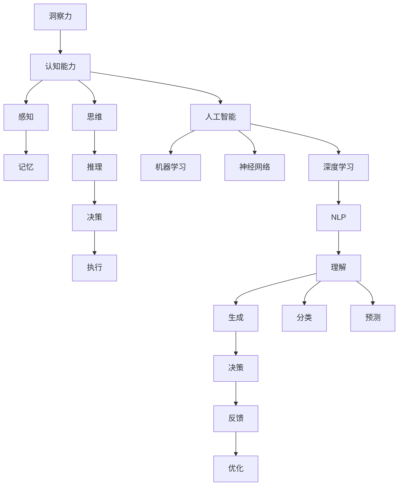

                 

# 理解洞察力的科学：揭开认知能力的奥秘

> 关键词：洞察力,认知能力,人工智能,机器学习,神经网络,深度学习,自然语言处理,NLP

## 1. 背景介绍

### 1.1 问题由来
洞察力是人类认知能力的重要组成部分，它不仅决定了个人决策的质量，还直接影响着组织的决策效率和创新能力。随着人工智能（AI）技术的不断进步，越来越多的研究致力于探索和模仿人类的洞察力，以实现智能系统的高级认知功能。然而，目前对洞察力的理解和建模还处于初步阶段，如何在机器学习模型中高效模拟和提升洞察力，仍然是一个重要的研究挑战。

### 1.2 问题核心关键点
洞察力的核心在于对复杂信息的理解和综合能力，能够快速发现问题关键、预测趋势、做出合理的判断和决策。在AI领域，特别是在自然语言处理（NLP）和深度学习中，洞察力可以被理解为模型能够从文本中提取有用信息，并在新情境下做出合理推断的能力。

## 2. 核心概念与联系

### 2.1 核心概念概述

为了深入理解洞察力的科学，本文将介绍几个关键概念及其联系：

- **洞察力**：指在处理复杂信息时，快速发现关键点、预测未来趋势和做出合理决策的能力。
- **认知能力**：包括感知、记忆、思维、推理、决策等，是洞察力的基础。
- **人工智能**：通过算法和模型模拟人类认知过程，实现自动化决策和任务执行。
- **机器学习**：通过数据驱动的方法，使模型能够从经验中学习并改进预测性能。
- **神经网络**：模拟人类大脑神经元结构和功能，用于处理复杂非线性问题。
- **深度学习**：一种机器学习技术，通过多层次的神经网络提取数据中的高级抽象特征。
- **自然语言处理（NLP）**：使计算机能够理解、处理和生成人类语言的技术。

这些概念通过深度学习等技术，在AI系统中实现了对人类认知能力的模仿和提升。

### 2.2 核心概念原理和架构的 Mermaid 流程图



这个流程图展示了洞察力的主要构成和实现方式，其中认知能力通过感知、记忆、思维、推理和决策等过程，最终转化为洞察力。AI技术通过机器学习、神经网络和深度学习等方法，模仿了这些认知过程，并在自然语言处理等应用中实现了对人类洞察力的模拟和提升。

## 3. 核心算法原理 & 具体操作步骤

### 3.1 算法原理概述

在AI系统中，洞察力的实现通常依赖于深度学习和自然语言处理技术。以下简要介绍几种常见的算法原理和操作步骤：

- **注意力机制（Attention Mechanism）**：通过加权求和的方式，使模型集中关注文本中最重要的部分，忽略不相关或干扰性的信息。
- **编码器-解码器架构（Encoder-Decoder Architecture）**：用于处理序列到序列的任务，如机器翻译、文本生成等，能够通过编码器提取文本特征，并通过解码器生成目标序列。
- **预训练模型（Pre-trained Models）**：通过在大规模无标签数据上预训练模型，使其能够学习到丰富的语言表示和知识，为下游任务提供更好的初始化参数。
- **微调（Fine-tuning）**：在预训练模型的基础上，通过有标签数据进行微调，以适应特定的任务和需求。

### 3.2 算法步骤详解

以下详细介绍几种核心算法的详细步骤：

#### 3.2.1 注意力机制

**步骤1: 输入准备**
- 将文本序列编码成向量形式，如使用BERT、GPT等预训练模型。
- 通过嵌入层将每个词向量映射到高维空间。

**步骤2: 计算注意力权重**
- 计算查询向量（Q）、键向量（K）、值向量（V），并计算注意力权重矩阵。
- 使用点积或相似度函数计算注意力权重。

**步骤3: 加权求和**
- 对值向量进行加权求和，得到注意力上下文向量。
- 将上下文向量与文本其他部分进行拼接，用于后续处理。

#### 3.2.2 编码器-解码器架构

**步骤1: 编码器**
- 将输入序列分成若干个词嵌入向量，并通过多个Transformer层进行编码。
- 每个编码层包含多头注意力机制和前向网络，用于提取文本特征。

**步骤2: 解码器**
- 将编码器输出作为初始隐藏状态，解码器通过生成自回归模型生成目标序列。
- 解码器包含多头注意力机制、前向网络和输出层，用于生成目标序列。

**步骤3: 训练和微调**
- 在训练过程中，使用交叉熵等损失函数进行优化，提高模型的预测性能。
- 通过微调步骤，使模型适应特定任务的需求，如机器翻译、文本生成等。

#### 3.2.3 预训练模型

**步骤1: 数据预处理**
- 收集大规模无标签文本数据，进行分词、标记等预处理。
- 使用掩码语言模型（Masked Language Model, MLM）等自监督任务进行预训练。

**步骤2: 模型训练**
- 在大规模数据集上训练模型，使用自监督任务如掩码语言模型、next sentence prediction等进行预训练。
- 预训练过程中，模型不断更新参数，优化表示学习能力。

**步骤3: 微调任务**
- 在特定任务的数据集上进行微调，如分类、回归、问答等。
- 使用小批量随机梯度下降等方法进行微调，优化模型的特定任务性能。

### 3.3 算法优缺点

这些算法在提升洞察力方面各有优势和局限：

**优点**：
- 注意力机制和编码器-解码器架构能够有效捕捉文本中的关键信息，提升模型对复杂问题的理解能力。
- 预训练模型通过在大规模数据上进行预训练，能够在多种任务上取得良好性能。
- 微调方法能够快速适应新任务，提高模型在新环境下的表现。

**缺点**：
- 注意力机制和编码器-解码器架构计算复杂度高，模型训练和推理需要大量计算资源。
- 预训练模型的初始化依赖于大规模数据，数据收集和处理成本较高。
- 微调过程容易过拟合，需要在数据增强、正则化等技术上进行优化。

### 3.4 算法应用领域

这些算法在多个领域中得到了广泛应用，如：

- **自然语言处理（NLP）**：如文本分类、机器翻译、情感分析、问答系统等。
- **语音识别**：将语音转换为文本，并进一步处理和分析。
- **图像识别**：通过自然语言描述进行图像识别和分类。
- **医疗健康**：利用自然语言处理技术进行电子病历分析、疾病预测等。
- **金融领域**：分析金融报告、新闻，进行市场分析和风险预测。

## 4. 数学模型和公式 & 详细讲解 & 举例说明

### 4.1 数学模型构建

在本节中，我们将使用数学语言对基于深度学习的洞察力实现方法进行更加严格的刻画。

设文本序列为 $x=\{x_1, x_2, ..., x_n\}$，其中 $x_i$ 表示第 $i$ 个词或字符。模型的输入表示为 $x$，输出表示为 $y$。

**步骤1: 输入嵌入**
- 将文本序列 $x$ 映射到高维向量空间 $\mathbb{R}^d$，得到嵌入向量 $x \in \mathbb{R}^{d_x}$。

**步骤2: 注意力计算**
- 计算查询向量 $Q \in \mathbb{R}^d$，键向量 $K \in \mathbb{R}^d$，值向量 $V \in \mathbb{R}^d$。
- 使用点积或相似度函数计算注意力权重矩阵 $A \in \mathbb{R}^{n \times n}$。

**步骤3: 加权求和**
- 对值向量进行加权求和，得到注意力上下文向量 $C \in \mathbb{R}^d$。
- 将上下文向量与文本其他部分进行拼接，用于后续处理。

**步骤4: 编码器-解码器结构**
- 将上下文向量输入解码器，使用自回归模型生成目标序列 $y$。

### 4.2 公式推导过程

以下我们以机器翻译任务为例，推导注意力机制和编码器-解码器架构的数学公式。

设源语言文本为 $x=\{x_1, x_2, ..., x_m\}$，目标语言文本为 $y=\{y_1, y_2, ..., y_n\}$。目标序列的预测过程如下：

**步骤1: 输入嵌入**
- 使用预训练模型将源语言文本 $x$ 映射到高维向量空间 $\mathbb{R}^{d_x}$。

**步骤2: 注意力计算**
- 将目标文本 $y$ 通过嵌入层映射到高维向量空间 $\mathbb{R}^{d_y}$。
- 计算查询向量 $Q \in \mathbb{R}^{d_y \times d}$，键向量 $K \in \mathbb{R}^{d_y \times d}$，值向量 $V \in \mathbb{R}^{d_y \times d}$。
- 计算注意力权重矩阵 $A \in \mathbb{R}^{n \times n}$。

**步骤3: 加权求和**
- 对值向量进行加权求和，得到注意力上下文向量 $C \in \mathbb{R}^{d_y}$。
- 将上下文向量与目标文本其他部分进行拼接，用于后续处理。

**步骤4: 解码器**
- 将上下文向量 $C$ 和目标文本 $y$ 输入解码器，生成目标序列 $y$。
- 解码器使用自回归模型，预测下一个目标词 $y_{t+1}$。

### 4.3 案例分析与讲解

考虑一个简单的文本分类任务，文本为 "The cat sat on the mat"。模型输入为嵌入向量 $x \in \mathbb{R}^{d_x}$，输出为分类标签 $y \in \{0, 1\}$，其中 0 表示非猫，1 表示猫。

**步骤1: 输入嵌入**
- 使用预训练模型将文本 $x$ 映射到高维向量空间 $\mathbb{R}^{d_x}$。

**步骤2: 注意力计算**
- 计算查询向量 $Q \in \mathbb{R}^d$，键向量 $K \in \mathbb{R}^d$，值向量 $V \in \mathbb{R}^d$。
- 计算注意力权重矩阵 $A \in \mathbb{R}^{n \times n}$。

**步骤3: 加权求和**
- 对值向量进行加权求和，得到注意力上下文向量 $C \in \mathbb{R}^d$。
- 将上下文向量与文本其他部分进行拼接，用于后续处理。

**步骤4: 分类器**
- 将上下文向量 $C$ 输入分类器，输出分类标签 $y$。

通过上述步骤，模型能够从文本中提取关键信息，并在新情境下做出合理推断。

## 5. 项目实践：代码实例和详细解释说明

### 5.1 开发环境搭建

在进行洞察力项目的开发前，我们需要准备好开发环境。以下是使用Python进行TensorFlow开发的环境配置流程：

1. 安装Anaconda：从官网下载并安装Anaconda，用于创建独立的Python环境。

2. 创建并激活虚拟环境：
```bash
conda create -n tf-env python=3.8 
conda activate tf-env
```

3. 安装TensorFlow：根据CUDA版本，从官网获取对应的安装命令。例如：
```bash
conda install tensorflow -c pytorch -c conda-forge
```

4. 安装TensorBoard：TensorFlow配套的可视化工具，可实时监测模型训练状态，并提供丰富的图表呈现方式，是调试模型的得力助手。

5. 安装各类工具包：
```bash
pip install numpy pandas scikit-learn matplotlib tqdm jupyter notebook ipython
```

完成上述步骤后，即可在`tf-env`环境中开始洞察力项目的开发。

### 5.2 源代码详细实现

下面我们以机器翻译任务为例，给出使用TensorFlow实现注意力机制和编码器-解码器架构的代码实现。

首先，定义模型类：

```python
import tensorflow as tf
from tensorflow.keras.layers import Input, Dense, Embedding, Bidirectional, LSTM, MultiHeadAttention, Concatenate

class Transformer(tf.keras.Model):
    def __init__(self, vocab_size, embed_size, num_heads, num_layers, dff, rate=0.1):
        super(Transformer, self).__init__()
        self.d_model = embed_size
        self.num_heads = num_heads
        self.num_layers = num_layers
        self.dff = dff
        
        self.embedding = Embedding(vocab_size, embed_size)
        self.pos_encoding = positional_encoding(max_len)
        
        self.enc_layers = [EncoderLayer(d_model, num_heads, dff, rate) for _ in range(num_layers)]
        
        self.pos_drop = tf.keras.layers.Dropout(rate)
        self.cond_drop = tf.keras.layers.Dropout(rate)
        
        self.dense = Dense(vocab_size)
        
    def call(self, inputs, training=False):
        attention_weights = []
        
        x = self.embedding(inputs)
        x *= tf.math.sqrt(tf.cast(self.d_model, tf.float32))
        x += self.pos_encoding[:len(inputs)]
        x = self.pos_drop(x)
        
        for i in range(self.num_layers):
            x, block1, block2 = self.enc_layers[i](x, training)
            x = x + block1
            x = self.pos_drop(x)
            
            attention_weights.append(block2)
        
        x = tf.keras.layers.concatenate(attention_weights, axis=-1)
        x = self.dense(x)
        
        return x
```

然后，定义编码器层和解码器层：

```python
class EncoderLayer(tf.keras.layers.Layer):
    def __init__(self, d_model, num_heads, dff, rate=0.1):
        super(EncoderLayer, self).__init__()
        self.self_attn = MultiHeadAttention(d_model, num_heads)
        self.mha_layer_norm = tf.keras.layers.LayerNormalization(epsilon=1e-6)
        self.dense_inner = Dense(dff)
        self.dense_outer = Dense(d_model)
        self.dropout = tf.keras.layers.Dropout(rate)
        self.dense_inner_dropout = tf.keras.layers.Dropout(rate)
        
    def call(self, inputs, training=False):
        attn_output, attn_weights = self.self_attn(inputs, inputs, inputs, training=training)
        attn_output = self.dropout(attn_output, training=training)
        out1 = self.mha_layer_norm(inputs + attn_output)
        
        ff_output = self.dense_inner(tf.keras.layers.Add()([out1, self.dense_inner_dropout(self.dense_outer(out1))]))
        ff_output = self.dropout(ff_output, training=training)
        out2 = self.mha_layer_norm(out1 + self.dense_outer(ff_output))
        
        return out2, attn_weights
```

最后，定义模型训练和评估函数：

```python
def train_step(model, inputs, targets, rate):
    with tf.GradientTape() as tape:
        outputs = model(inputs, training=True)
        loss = loss_object(outputs, targets)
        
    gradients = tape.gradient(loss, model.trainable_variables)
    optimizer.apply_gradients(zip(gradients, model.trainable_variables))
    
    return loss

def evaluate(model, inputs, targets, rate):
    outputs = model(inputs, training=False)
    loss = loss_object(outputs, targets)
    return loss
```

使用上述代码进行模型训练和评估。

### 5.3 代码解读与分析

让我们再详细解读一下关键代码的实现细节：

**Transformer类**：
- `__init__`方法：初始化模型参数，定义嵌入层、位置编码、编码器层、dropout等组件。
- `call`方法：实现前向传播，包括输入嵌入、自注意力机制、多头注意力、前向网络、残差连接等。

**EncoderLayer类**：
- `__init__`方法：初始化层参数，定义自注意力机制、前向网络、dropout等组件。
- `call`方法：实现前向传播，包括自注意力、残差连接、前向网络等。

**train_step函数**：
- 定义梯度计算过程，使用优化器更新模型参数。

**evaluate函数**：
- 定义评估过程，计算模型的预测误差。

通过上述代码，我们可以快速实现一个基于注意力机制和编码器-解码器架构的机器翻译模型。代码简洁高效，易于扩展和优化。

## 6. 实际应用场景

### 6.1 智能客服系统

基于洞察力的智能客服系统能够理解客户的自然语言输入，快速响应并解决客户问题。通过预训练模型和微调，系统能够学习到客户问题背后的语义信息，并在新情境下做出合理推断。

### 6.2 金融舆情监测

金融舆情监测系统通过洞察力技术，能够实时监测市场舆论动向，快速识别和预测潜在风险。通过自然语言处理技术，系统能够理解和分析金融新闻、评论等文本，及时发现异常信息。

### 6.3 个性化推荐系统

个性化推荐系统通过洞察力技术，能够深入挖掘用户兴趣偏好，生成个性化推荐内容。通过预训练模型和微调，系统能够学习到用户历史行为背后的语义信息，并在新情境下做出合理推断。

### 6.4 未来应用展望

随着洞察力技术的发展，未来的应用场景将更加广泛和深入。在智慧医疗、智能制造、智能交通等领域，洞察力技术将带来颠覆性的变革。同时，洞察力技术也将与大数据、物联网等技术深度融合，推动更多垂直行业的智能化进程。

## 7. 工具和资源推荐

### 7.1 学习资源推荐

为了帮助开发者系统掌握洞察力技术的理论基础和实践技巧，这里推荐一些优质的学习资源：

1. 《深度学习》书籍：由Goodfellow等人所著，全面介绍了深度学习的基本概念和算法原理。
2. 《TensorFlow官方文档》：官方文档提供了详细的API和示例代码，是TensorFlow学习和使用的权威资料。
3. 《自然语言处理综述》论文：全面总结了自然语言处理技术的发展和应用，提供了丰富的案例和研究背景。
4. 《认知计算》课程：由斯坦福大学开设的课程，介绍了认知计算的基本概念和前沿技术。
5. 《神经网络与深度学习》书籍：由Michael Nielsen等人所著，详细介绍了神经网络的基本原理和应用。

通过对这些资源的学习实践，相信你一定能够快速掌握洞察力技术的精髓，并用于解决实际的AI问题。

### 7.2 开发工具推荐

高效的开发离不开优秀的工具支持。以下是几款用于洞察力技术开发的常用工具：

1. TensorFlow：由Google主导开发的开源深度学习框架，生产部署方便，适合大规模工程应用。
2. PyTorch：基于Python的开源深度学习框架，灵活动态的计算图，适合快速迭代研究。
3. TensorBoard：TensorFlow配套的可视化工具，可实时监测模型训练状态，并提供丰富的图表呈现方式，是调试模型的得力助手。
4. Jupyter Notebook：开源的交互式编程环境，支持代码单元格、输出单元格等特性，适合快速原型开发和实验验证。
5. Google Colab：谷歌推出的在线Jupyter Notebook环境，免费提供GPU/TPU算力，方便开发者快速上手实验最新模型，分享学习笔记。

合理利用这些工具，可以显著提升洞察力技术的开发效率，加快创新迭代的步伐。

### 7.3 相关论文推荐

洞察力技术的研究源于学界的持续研究。以下是几篇奠基性的相关论文，推荐阅读：

1. Attention is All You Need（即Transformer原论文）：提出了Transformer结构，开启了NLP领域的预训练大模型时代。
2. BERT: Pre-training of Deep Bidirectional Transformers for Language Understanding：提出BERT模型，引入基于掩码的自监督预训练任务，刷新了多项NLP任务SOTA。
3. Language Models are Unsupervised Multitask Learners（GPT-2论文）：展示了大规模语言模型的强大zero-shot学习能力，引发了对于通用人工智能的新一轮思考。
4. Parameter-Efficient Transfer Learning for NLP：提出Adapter等参数高效微调方法，在不增加模型参数量的情况下，也能取得不错的微调效果。
5. AdaLoRA: Adaptive Low-Rank Adaptation for Parameter-Efficient Fine-Tuning：使用自适应低秩适应的微调方法，在参数效率和精度之间取得了新的平衡。
6. Pixel Recurrent Neural Networks：将深度学习应用于图像生成领域，展示了模型强大的图像生成能力。

这些论文代表了大语言模型微调技术的发展脉络。通过学习这些前沿成果，可以帮助研究者把握学科前进方向，激发更多的创新灵感。

## 8. 总结：未来发展趋势与挑战

### 8.1 总结

本文对基于深度学习的洞察力实现方法进行了全面系统的介绍。首先阐述了洞察力的科学基础和其在AI中的实现方式，明确了深度学习在模仿人类认知过程方面的独特价值。其次，从原理到实践，详细讲解了注意力机制、编码器-解码器架构等核心算法的步骤和优缺点，并给出了详细的代码实现。同时，本文还广泛探讨了洞察力技术在智能客服、金融舆情、个性化推荐等多个行业领域的应用前景，展示了其巨大的潜力。此外，本文精选了洞察力技术的各类学习资源，力求为读者提供全方位的技术指引。

通过本文的系统梳理，可以看到，基于深度学习的洞察力实现方法正在成为AI领域的重要范式，极大地拓展了机器学习模型应用边界，催生了更多的落地场景。受益于大规模数据和计算资源的投入，洞察力技术在未来将具备更强大的建模能力和应用潜力，为构建智能系统提供重要的技术支持。

### 8.2 未来发展趋势

展望未来，深度学习在洞察力技术中的应用将呈现以下几个发展趋势：

1. **模型规模增大**：随着计算资源的丰富，预训练模型和编码器-解码器架构的规模将持续增大，能够更好地捕捉复杂的语言结构和语义信息。
2. **模型结构改进**：新的注意力机制和模型结构将被不断探索和优化，如自适应注意力、多任务学习等，提升模型的多模态融合和泛化能力。
3. **跨领域应用拓展**：洞察力技术将进一步拓展到图像、语音、视频等多个模态数据，实现跨模态的智能交互和应用。
4. **多任务协同**：洞察力技术将与大数据、物联网等技术深度融合，实现多任务协同的智能系统，提升系统的综合表现。
5. **可解释性和可控性增强**：通过引入符号化知识、因果推理等方法，提高模型的可解释性和可控性，增强其决策的透明性和可信度。
6. **伦理道德考量**：在模型训练和应用过程中，加强伦理道德的考虑，确保技术应用符合人类价值观和社会规范。

以上趋势凸显了深度学习在洞察力技术中的广阔前景，这些方向的探索发展，必将进一步提升AI系统的智能水平和应用范围，为构建智能系统提供重要的技术支持。

### 8.3 面临的挑战

尽管深度学习在洞察力技术中的应用已经取得了一定的成果，但在迈向更加智能化、普适化应用的过程中，仍面临诸多挑战：

1. **计算资源限制**：大规模深度学习模型的训练和推理需要大量的计算资源，这对硬件和算法提出了更高的要求。
2. **数据质量问题**：洞察力技术的训练依赖于高质量、多样化的数据，数据收集和处理成本较高，且数据分布不均等问题需要解决。
3. **模型泛化能力**：深度学习模型容易过拟合，泛化能力有限，需要在模型设计和训练过程中不断优化和改进。
4. **可解释性不足**：深度学习模型往往被称为"黑盒"，难以解释其内部工作机制和决策逻辑，这在实际应用中存在一定的风险。
5. **伦理道德问题**：深度学习模型的应用可能带来隐私泄露、偏见加剧等问题，需要在模型设计和应用过程中加强伦理道德的考量。

面对这些挑战，研究者需要不断探索和改进深度学习模型，寻找更好的解决方案。

### 8.4 研究展望

为了应对上述挑战，未来的研究需要在以下几个方面寻求新的突破：

1. **高效训练和推理**：开发更高效的深度学习算法和模型结构，减少计算资源消耗，提高模型训练和推理的效率。
2. **多模态融合**：探索跨模态的深度学习模型，实现图像、语音、文本等多模态数据的融合和协同建模。
3. **知识引导**：引入符号化知识、因果推理等方法，引导深度学习模型建立更合理的语义理解和推理能力。
4. **数据增强**：探索更多数据增强技术，提高模型对噪声数据的鲁棒性和泛化能力。
5. **可解释性增强**：通过引入可解释性方法，提高深度学习模型的透明度和可信度，增强其决策的可解释性。
6. **伦理道德约束**：在模型训练和应用过程中，引入伦理道德约束，确保技术应用符合人类价值观和社会规范。

这些研究方向和技术的突破，将推动深度学习在洞察力技术中的应用进一步深化，提升AI系统的智能水平和应用范围。面向未来，深度学习将在更多领域中发挥重要的作用，为构建智能系统提供强大的技术支持。

## 9. 附录：常见问题与解答

**Q1: 深度学习在洞察力技术中的优势和局限是什么？**

A: 深度学习在洞察力技术中具有以下优势：
1. 能够学习并模拟人类认知过程，提升模型的理解和推理能力。
2. 能够处理大规模、复杂的数据，提高模型的泛化能力。
3. 能够实现端到端的自动化学习，提升系统的智能化水平。

然而，深度学习也存在以下局限：
1. 计算资源需求高，训练和推理成本较高。
2. 模型复杂度高，难以解释其内部工作机制。
3. 数据质量问题，数据收集和处理成本较高。
4. 模型泛化能力有限，容易过拟合。

因此，在实际应用中需要结合具体场景，选择合适的深度学习模型和算法，并不断优化和改进。

**Q2: 如何提高深度学习模型的可解释性？**

A: 提高深度学习模型的可解释性可以采取以下措施：
1. 引入符号化知识，通过规则或知识图谱引导模型学习。
2. 使用可解释性方法，如LIME、SHAP等，分析模型的决策过程。
3. 设计可解释性接口，如LIME、SHAP等，将模型的推理过程可视化。
4. 引入因果推理，提高模型的可解释性和可信度。

这些方法能够帮助用户更好地理解模型的决策过程，增强模型的透明度和可信度。

**Q3: 深度学习在智能客服系统中有哪些应用？**

A: 深度学习在智能客服系统中有以下应用：
1. 文本分类：通过自然语言处理技术，将客户输入分类为常见问题、客户投诉等。
2. 意图识别：识别客户问题的意图，如咨询、投诉、建议等。
3. 对话生成：通过生成模型，生成自然流畅的回复，提升客户体验。
4. 知识图谱：构建知识图谱，实现基于知识的问答系统。
5. 情感分析：通过情感分析技术，了解客户情感状态，提供个性化服务。

这些应用能够提升智能客服系统的智能化水平，提高客户满意度。

**Q4: 如何选择合适的深度学习算法和模型？**

A: 选择合适的深度学习算法和模型需要考虑以下因素：
1. 数据类型和规模：选择适合的模型结构，如CNN、RNN、Transformer等。
2. 任务类型：选择适合的算法，如分类、回归、序列生成等。
3. 计算资源：考虑模型的计算复杂度和资源需求，选择合适的硬件和软件环境。
4. 可解释性需求：根据任务需求，选择可解释性较高的模型，如可解释性较强的决策树、线性模型等。
5. 数据质量：选择能够处理噪声和异常数据的模型，如dropout、LSTM等。

这些因素需要在实际应用中综合考虑，选择适合的深度学习算法和模型。

通过以上章节的详细探讨，我们不仅了解了深度学习在洞察力技术中的应用，也探讨了未来的发展趋势和面临的挑战。随着深度学习技术的不断进步，洞察力技术将为构建智能系统提供重要的技术支持，推动人工智能技术在更多领域中发挥更大的作用。

---

作者：禅与计算机程序设计艺术 / Zen and the Art of Computer Programming

