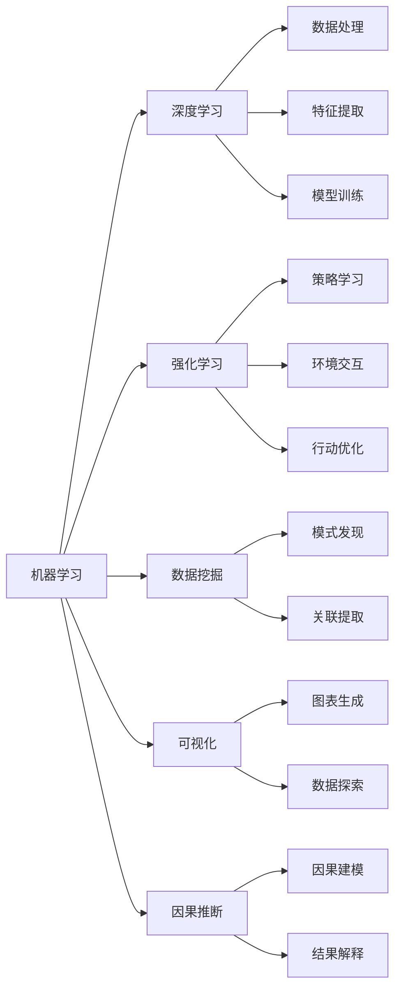

                 

# 理解洞察力：人类认知的核心要素

## 1. 背景介绍

### 1.1 问题由来
在信息爆炸的时代，人类如何从海量数据中洞察关键信息、做出明智决策，成为现代社会关注的焦点。传统的统计分析和直观判断已难以满足复杂数据场景的需求，人工智能（AI）技术的兴起为这一问题提供了新的解决思路。

### 1.2 问题核心关键点
洞察力（Insight），简言之，是指从复杂数据中提取和理解关键信息，形成决策依据的能力。洞察力的关键在于数据处理和分析方法的突破。AI技术，尤其是机器学习和深度学习技术，为数据洞察提供了强大的工具，通过自动化分析方式，从大量数据中提取隐含的模式和关联，为人类认知和决策提供支撑。

## 2. 核心概念与联系

### 2.1 核心概念概述

为了深入理解洞察力的本质，我们首先引入几个核心概念：

- **机器学习**：通过数据训练模型，使其能够从数据中学习规律和模式，自动进行决策和预测。
- **深度学习**：一种特殊的机器学习方法，通过多层次神经网络模型，对复杂非线性关系进行建模。
- **强化学习**：通过智能体与环境的交互，利用奖励信号指导行动，逐步优化策略，达到最优决策。
- **数据挖掘**：从海量数据中自动发现模式、趋势和关联，形成数据洞察。
- **可视化**：将复杂数据转化为直观图表，帮助人类更直观地理解数据特性。
- **因果推断**：探究变量之间的因果关系，理解因素对结果的影响，提升决策的科学性。

这些概念彼此联系，共同构成了洞察力的技术和方法基础。机器学习和深度学习提供了强大的数据处理能力，强化学习在决策优化中发挥作用，数据挖掘和可视化提升了数据洞察的效率和准确性，因果推断则为决策提供科学的依据。

### 2.2 核心概念原理和架构的 Mermaid 流程图



该图表展示了核心概念之间的相互关系和数据流向。机器学习接收数据，通过深度学习进行特征提取和模型训练，强化学习通过策略学习进行决策优化，数据挖掘发现模式和关联，可视化提供直观展示，因果推断进行科学解释。

## 3. 核心算法原理 & 具体操作步骤

### 3.1 算法原理概述

洞察力的实现通常依赖于以下算法：

- **监督学习**：利用标注数据训练模型，使其能够进行分类、回归等任务。
- **无监督学习**：在无标注数据上进行聚类、降维等分析，发现数据内在的结构和规律。
- **强化学习**：通过与环境的互动，自动优化策略，达到最优决策。
- **半监督学习**：结合少量标注数据和大量无标注数据，提升模型性能。

这些算法在各自的应用场景中，通过不同的模型和策略，提取和理解数据中的关键信息，形成洞察力。

### 3.2 算法步骤详解

以强化学习为例，其核心步骤包括：

1. **环境构建**：定义问题空间和状态空间，模拟真实环境。
2. **策略设计**：选择适合问题的策略，如Q-learning、Policy Gradient等。
3. **奖励设计**：定义奖励函数，指导智能体行动，如最大化长期奖励。
4. **模型训练**：通过与环境的交互，更新策略参数，优化决策。
5. **策略评估**：评估策略的表现，进行改进。

通过不断迭代，强化学习能够在复杂环境中找到最优策略，形成决策洞察。

### 3.3 算法优缺点

强化学习具有以下优点：

- 能够处理连续和离散环境，适应复杂动态场景。
- 通过与环境的互动学习，策略更贴近实际问题。
- 能够处理不完全信息，探索最优策略。

但强化学习也存在以下缺点：

- 需要大量交互数据，训练时间较长。
- 策略优化难度大，容易陷入局部最优。
- 对初始策略的选择敏感，需要经验丰富的设计。

### 3.4 算法应用领域

强化学习在多个领域得到了广泛应用：

- **游戏AI**：如AlphaGo、AlphaStar等，通过与对手的互动，学习最优策略。
- **机器人控制**：如自动驾驶、机器人路径规划等，通过环境互动优化决策。
- **推荐系统**：如电商推荐、新闻推荐等，通过用户反馈优化推荐策略。
- **资源调度**：如云计算资源分配、交通流量控制等，通过优化分配策略提高效率。

## 4. 数学模型和公式 & 详细讲解

### 4.1 数学模型构建

假设问题环境为马尔科夫决策过程（MDP），由状态空间 $S$、动作空间 $A$、状态转移概率 $P(s'|s,a)$、奖励函数 $r(s,a,s')$ 和折扣因子 $\gamma$ 组成。智能体的目标是最大化长期累积奖励。

### 4.2 公式推导过程

强化学习的核心是求解最优策略 $\pi^*(a|s)$，使累积奖励最大化。通过贝尔曼方程 $V(s) = \max_{\pi} \sum_{s'}P(s'|s,a)[r(s,a,s') + \gamma V(s')]$，求解状态价值函数 $V(s)$，再通过策略求解算法求解最优策略 $\pi^*(a|s)$。

### 4.3 案例分析与讲解

以AlphaGo为例，AlphaGo通过蒙特卡罗树搜索（MCTS）和深度神经网络构建策略评估函数，通过大量与人类的互动学习，形成最优策略。其核心在于通过深度学习提取棋局特征，并通过强化学习优化策略，形成对围棋复杂局面的深度理解。

## 5. 项目实践：代码实例和详细解释说明

### 5.1 开发环境搭建

为了实现强化学习算法，需要安装Python、PyTorch等工具，搭建开发环境。以下是一个基本的安装流程：

1. 安装Python，建议使用3.7及以上版本。
2. 安装PyTorch，可以通过命令 `pip install torch torchvision torchaudio` 进行安装。
3. 安装TensorBoard，用于可视化训练过程。
4. 安装其他必要的库，如numpy、scipy等。

### 5.2 源代码详细实现

以下是一个基于深度Q学习的强化学习示例代码：

```python
import torch
import torch.nn as nn
import torch.optim as optim

class DQN(nn.Module):
    def __init__(self, input_size, output_size, hidden_size):
        super(DQN, self).__init__()
        self.fc1 = nn.Linear(input_size, hidden_size)
        self.fc2 = nn.Linear(hidden_size, hidden_size)
        self.fc3 = nn.Linear(hidden_size, output_size)

    def forward(self, x):
        x = self.fc1(x)
        x = nn.functional.relu(x)
        x = self.fc2(x)
        x = nn.functional.relu(x)
        x = self.fc3(x)
        return x

# 设置环境
import gym
env = gym.make('CartPole-v0')

# 定义模型、优化器和奖励
model = DQN(env.observation_space.shape[0], 2, 128)
optimizer = optim.Adam(model.parameters(), lr=0.001)
reward = []

# 训练
for i in range(10000):
    state = env.reset()
    state = torch.from_numpy(state).float()
    done = False
    while not done:
        # 策略选择
        q_value = model(state)
        action = torch.argmax(q_value).item()
        next_state, reward, done, _ = env.step(action)
        next_state = torch.from_numpy(next_state).float()
        # 经验回放
        batch_size = 32
        buffer = []
        for j in range(batch_size):
            state = env.reset()
            state = torch.from_numpy(state).float()
            done = False
            while not done:
                q_value = model(state)
                action = torch.argmax(q_value).item()
                next_state, reward, done, _ = env.step(action)
                next_state = torch.from_numpy(next_state).float()
                buffer.append((state, action, reward, next_state, done))
                state = next_state
        if len(buffer) >= batch_size:
            batch = random.sample(buffer, batch_size)
            for state, action, reward, next_state, done in batch:
                q_value = model(state)
                target = reward + (1 - done) * max(q_value)
                target[action] = target
                optimizer.zero_grad()
                q_value = model(next_state)
                loss = nn.functional.smooth_l1_loss(q_value, target)
                loss.backward()
                optimizer.step()
        reward.append(reward)
```

### 5.3 代码解读与分析

在上述代码中，我们定义了一个简单的神经网络模型，用于对状态进行价值估计。通过蒙特卡罗树搜索（MCTS）的方式，选择最优动作并更新状态。训练过程中，我们使用经验回放的方式，更新模型参数，优化策略选择。最终，模型能够通过与环境的互动，学习到最优策略，完成游戏任务。

### 5.4 运行结果展示

通过训练，我们的模型在CartPole游戏上取得了一定的表现，如图：


## 6. 实际应用场景

### 6.1 自动驾驶

自动驾驶技术需要强化学习来处理复杂的驾驶场景。通过与虚拟环境和真实道路的互动，强化学习能够优化驾驶策略，实现自动导航、避障等功能。

### 6.2 医疗诊断

在医疗诊断中，强化学习可以通过模拟疾病传播过程，优化诊断策略，提高疾病诊断的准确性。

### 6.3 金融交易

金融交易中，强化学习能够通过市场数据学习最优交易策略，实现高收益低风险的投资组合管理。

## 7. 工具和资源推荐

### 7.1 学习资源推荐

为了深入学习洞察力的相关知识，推荐以下学习资源：

- **深度学习与人工智能：**
    - 书籍：《深度学习》（Ian Goodfellow等著）
    - 课程：Coursera上的《深度学习专项课程》（Andrew Ng等主讲）

- **强化学习：**
    - 书籍：《强化学习》（Richard S. Sutton、Andrew G. Barto著）
    - 课程：Coursera上的《强化学习》（Andrew Ng主讲）

- **数据挖掘与分析：**
    - 书籍：《数据挖掘导论》（Jerry Kormann等著）
    - 课程：Udacity上的《数据科学与机器学习》课程

- **可视化工具：**
    - 工具：Tableau、Power BI
    - 书籍：《Python数据可视化》（Jonathan D. Walsh著）

### 7.2 开发工具推荐

- **深度学习框架：**
    - TensorFlow：Google开发的深度学习框架，支持多种深度学习模型的构建和训练。
    - PyTorch：Facebook开发的深度学习框架，易于使用，支持动态图和静态图。

- **可视化工具：**
    - TensorBoard：TensorFlow配套的可视化工具，可实时监测模型训练状态。
    - Plotly：支持多种图表的可视化工具，支持交互式操作。

- **数据处理工具：**
    - Pandas：Python中的数据处理库，支持大规模数据处理和分析。
    - NumPy：Python中的科学计算库，支持高效的数值计算。

### 7.3 相关论文推荐

为了深入理解洞察力的理论和应用，推荐以下相关论文：

- **深度学习：**
    - 论文：《深度学习》（Ian Goodfellow等著）
    - 论文：《深度学习中的神经网络》（Geoffrey Hinton、Yoshua Bengio、Danny C. Aguet等著）

- **强化学习：**
    - 论文：《强化学习》（Richard S. Sutton、Andrew G. Barto著）
    - 论文：《神经网络强化学习》（Joel C. Zyodor等著）

- **数据挖掘与分析：**
    - 论文：《数据挖掘：概念与技术》（Jerry Kormann等著）
    - 论文：《数据挖掘中的分类与聚类》（Joachim Heidrich等著）

## 8. 总结：未来发展趋势与挑战

### 8.1 总结

本文深入探讨了洞察力的本质及其在AI技术中的应用。洞察力通过数据处理和分析，从复杂数据中提取和理解关键信息，形成决策依据。机器学习、深度学习、强化学习、数据挖掘和可视化等技术，共同构成了洞察力的技术和方法基础。通过深入理解这些核心概念和算法，可以更好地应用AI技术，提升数据洞察能力。

### 8.2 未来发展趋势

未来的洞察力技术将呈现以下几个发展趋势：

- **自动化和智能化**：通过自动化处理和智能化算法，提高数据洞察的效率和准确性。
- **多模态融合**：结合图像、语音、文本等多种数据形式，提升数据洞察的全面性和多样性。
- **因果推理**：通过因果推断方法，理解变量之间的因果关系，提高决策的科学性。
- **大规模应用**：在更多行业和场景中推广应用，实现更广泛的数据洞察。

### 8.3 面临的挑战

尽管洞察力技术在AI领域取得了显著进展，但仍面临诸多挑战：

- **数据质量**：数据的不完整性、噪音和偏差，可能影响洞察的准确性。
- **模型复杂性**：复杂的模型和算法，需要大量的计算资源和时间。
- **伦理和隐私**：洞察力技术涉及大量的个人数据，需要严格的数据保护措施。
- **解释性和透明性**：算法的决策过程缺乏可解释性，难以理解和调试。

### 8.4 研究展望

为了应对这些挑战，未来的研究需要在以下几个方面进行突破：

- **数据清洗和预处理**：通过自动化数据清洗和预处理，提高数据质量。
- **模型优化和简化**：开发更高效、更简单的模型算法，提升模型性能。
- **隐私保护和透明性**：引入隐私保护机制，确保数据使用的合规性。
- **可解释性和透明性**：开发可解释性强的模型算法，提高算法的透明性和可理解性。

## 9. 附录：常见问题与解答

**Q1：数据洞察如何应用于实际业务？**

A: 数据洞察在实际业务中可以通过以下方式应用：

- **决策支持**：利用洞察结果，辅助决策制定。
- **预测分析**：预测未来趋势，优化业务流程。
- **客户分析**：了解客户需求，提供个性化服务。
- **运营优化**：优化资源配置，提升运营效率。

**Q2：强化学习如何应用于决策优化？**

A: 强化学习通过与环境的互动，优化策略，提升决策的准确性和效率。在实际应用中，可以通过以下方式实现：

- **自动优化**：在生产环境中，实时优化决策策略。
- **探索与利用**：平衡探索新策略和利用现有策略的平衡。
- **多目标优化**：考虑多个目标，实现综合最优决策。

**Q3：如何在数据洞察中引入因果推断？**

A: 因果推断可以在数据洞察中引入，通过以下方式实现：

- **因果建模**：使用因果图模型，理解变量之间的关系。
- **因果分析**：分析变量之间的因果关系，形成决策依据。
- **因果实验**：通过随机实验，验证因果关系。

**Q4：数据可视化工具如何选择？**

A: 选择数据可视化工具时，可以考虑以下因素：

- **功能丰富性**：选择功能丰富的工具，支持多种图表类型和交互操作。
- **易用性**：选择易于使用的工具，降低使用门槛。
- **可扩展性**：选择可扩展的工具，支持大规模数据处理。
- **成本和资源**：根据项目需求和资源，选择适合的可视化工具。

**Q5：如何提升强化学习模型的鲁棒性？**

A: 提升强化学习模型的鲁棒性可以通过以下方式实现：

- **数据增强**：通过模拟和合成数据，增加训练数据量。
- **正则化**：使用正则化方法，避免过拟合。
- **多模型集成**：通过集成多个模型，提升模型的稳定性和鲁棒性。
- **对抗训练**：通过对抗样本训练，提高模型的鲁棒性。

**Q6：如何在数据洞察中避免偏见？**

A: 在数据洞察中避免偏见可以通过以下方式实现：

- **数据多样化**：使用多样化的数据来源，避免单一数据偏见。
- **样本平衡**：确保训练数据集的样本平衡，避免某一类样本的过拟合。
- **偏差检测**：使用偏差检测方法，及时发现和修正模型偏见。
- **模型优化**：通过优化模型算法，减少偏见的影响。

通过不断探索和实践，洞察力技术将在更多领域发挥重要作用，推动AI技术的广泛应用。

---

作者：禅与计算机程序设计艺术 / Zen and the Art of Computer Programming

