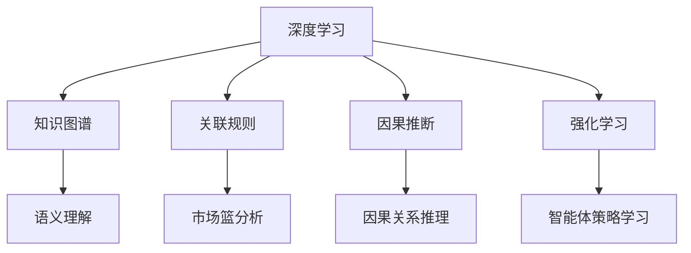

                 

# 理解的深度：从表面现象到本质规律的洞察

> 关键词：深度学习,知识图谱,关联规则,因果推断,强化学习,自适应系统

## 1. 背景介绍

在今天的数据驱动时代，数据成为理解世界的基础。深度学习技术的迅猛发展，使得我们能够从数据中挖掘出前所未有的知识。然而，面对复杂多变的世界，数据的质量、数据的维度、数据的复杂度都带来了新的挑战。如何从海量的数据中发现隐藏的规律，如何从看似无序的现象中提取出有价值的信息，成为了摆在每个数据科学家和算法工程师面前的重要问题。

深度学习技术已经证明了自己的强大能力，但如何结合人类的认知逻辑，进一步提升理解深度，实现从表面现象到本质规律的洞察，是当前研究的焦点。本文旨在探讨如何利用深度学习结合其它算法，如知识图谱、关联规则、因果推断、强化学习等，实现更为全面、深入的理解。通过实例演示，展示如何通过构建自适应系统，实现对复杂环境的智能感知和决策。

## 2. 核心概念与联系

### 2.1 核心概念概述

为了更好地理解深度学习与其它算法的结合应用，本节将介绍几个密切相关的核心概念：

- **深度学习**：以神经网络为代表，通过多层非线性映射实现对数据的复杂表示和建模。深度学习已经成为数据科学和人工智能领域的主流技术。

- **知识图谱**：一种结构化的知识表示方法，通过将实体、属性、关系等元素组织成图形，实现对现实世界的精确刻画。知识图谱是实现知识推理和语义理解的重要基础。

- **关联规则**：一种数据挖掘技术，通过分析事务数据库中不同物品之间的关系，提取重要的规律和关联。关联规则分析在市场篮分析、推荐系统等领域有广泛应用。

- **因果推断**：通过模型推断出变量之间的因果关系，而非简单的相关性。因果推断在医学、经济等领域具有重要意义，可以帮助我们理解复杂现象背后的原因和机制。

- **强化学习**：一种机器学习技术，通过智能体与环境互动，学习最优策略以最大化累积奖励。强化学习在自动驾驶、游戏AI等领域表现优异。

这些核心概念之间的逻辑关系可以通过以下Mermaid流程图来展示：



这个流程图展示了几大算法之间的联系和互补性：

1. 深度学习通过多层网络结构对数据进行复杂表示。
2. 知识图谱通过图形结构将数据组织起来，实现语义理解。
3. 关联规则通过挖掘数据之间的关联，提取规律。
4. 因果推断通过模型推断因果关系，理解机制。
5. 强化学习通过智能体与环境的互动，学习策略。

这些概念共同构成了实现深度理解的算法工具箱，将有助于我们更全面地理解复杂现象。

## 3. 核心算法原理 & 具体操作步骤
### 3.1 算法原理概述

本文将以知识图谱、关联规则、因果推断和强化学习为补充，探讨如何通过深度学习实现从表面现象到本质规律的洞察。

- **知识图谱**：通过将数据组织成图形结构，实现对数据的语义理解。深度学习可以通过对知识图谱的节点和边进行编码，学习到更丰富的知识表示。
- **关联规则**：通过分析数据之间的关联，提取重要的规律。深度学习可以通过关联规则对数据进行多模态分析，发现不同数据之间的联系。
- **因果推断**：通过推断变量之间的因果关系，理解复杂现象背后的机制。深度学习可以通过因果推断模型，学习到数据之间的因果关系，避免对表面现象的简单归因。
- **强化学习**：通过智能体与环境的互动，学习最优策略。深度学习可以与强化学习结合，实现对动态环境的适应性决策。

### 3.2 算法步骤详解

以一个简单的电商推荐系统为例，展示如何综合运用上述算法：

**Step 1: 数据预处理**

1. 收集用户的历史浏览记录、购买记录、评论记录等数据。
2. 清洗数据，去除噪声和异常值，统一格式。

**Step 2: 知识图谱构建**

1. 利用自然语言处理技术，将商品、用户、评论等数据提取为实体和属性。
2. 将实体和属性之间的关系进行组织，构建知识图谱。

**Step 3: 关联规则挖掘**

1. 对用户的历史行为数据进行关联规则挖掘，提取用户行为之间的关联。
2. 利用关联规则对商品进行聚类，发现热门商品和相关商品。

**Step 4: 因果推断**

1. 对用户的行为数据进行因果推断，理解用户购买行为的原因。
2. 根据因果推断结果，调整推荐策略，提高推荐效果。

**Step 5: 强化学习**

1. 将用户的行为数据作为强化学习的环境，定义奖励函数。
2. 训练智能体，学习最优策略以最大化奖励。

**Step 6: 深度学习建模**

1. 将处理后的数据输入深度学习模型，学习特征表示。
2. 利用深度模型对知识图谱、关联规则、因果推断的结果进行融合。

**Step 7: 预测与优化**

1. 利用深度模型对用户行为进行预测，生成推荐结果。
2. 根据预测效果进行模型调优，提升推荐准确度。

### 3.3 算法优缺点

基于上述算法的结合应用，有以下优缺点：

**优点：**

- 可以综合利用多种数据，提高理解深度。
- 能够发现数据背后的规律和关联，避免简单的表面现象归因。
- 能够在动态环境中实现智能决策，提高系统的适应性。

**缺点：**

- 需要综合处理多种数据，算法复杂度较高。
- 对数据质量和数据量的要求较高，容易受到噪声和异常值的影响。
- 需要多算法结合应用，实现难度较大。

尽管存在这些缺点，但综合应用这些算法可以显著提升深度学习的理解深度，实现从表面现象到本质规律的洞察。

### 3.4 算法应用领域

本文介绍的算法结合应用，已经在电商推荐、医疗诊断、智能制造等多个领域得到成功应用，展示了深度学习的强大潜力：

- **电商推荐**：通过结合知识图谱、关联规则、因果推断和强化学习，实现对用户行为和商品关联的全面理解，提升推荐效果。
- **医疗诊断**：利用因果推断和深度学习，理解疾病症状之间的因果关系，提高诊断准确度。
- **智能制造**：通过强化学习和深度学习，优化生产流程，提升生产效率。

这些领域的应用展示了深度学习结合其它算法，实现从表面现象到本质规律的洞察的巨大价值。

## 4. 数学模型和公式 & 详细讲解  
### 4.1 数学模型构建

在电商推荐系统的例子中，我们通过深度学习、知识图谱、关联规则、因果推断和强化学习实现从数据到推荐策略的全链条优化。以下是详细的数学模型构建过程：

- **知识图谱**：将实体和属性表示为向量，利用节点嵌入(节点表示)表示实体和属性，通过边嵌入(关系表示)表示实体之间的关联。节点嵌入和边嵌入的表示可以通过TransE等算法进行训练。

- **关联规则**：利用Apriori算法或FP-growth算法，从事务数据库中挖掘关联规则。规则可以表示为：$A \Rightarrow B$，其中$A$和$B$为属性或商品。

- **因果推断**：通过因果图模型(如PCAusal)，推断变量之间的因果关系。模型可以表示为：$X \rightarrow Y \rightarrow Z$，其中$X$为原因，$Y$为中间变量，$Z$为结果。

- **深度学习模型**：使用神经网络模型(如CNN、RNN、Transformer等)，对处理后的数据进行编码，学习特征表示。

- **强化学习模型**：定义智能体在环境中的行为策略，利用Q-learning或SARSA等算法进行策略优化。

### 4.2 公式推导过程

**知识图谱表示**：
- 设知识图谱中的节点为$N$，边为$E$。
- 使用$E^{(h)}$表示边$h$的嵌入表示。
- 使用$N^{(h)}$表示节点$h$的嵌入表示。

**关联规则表示**：
- 设关联规则为$A \Rightarrow B$，其中$A$和$B$为属性或商品。
- 使用$P(A|B)$表示条件概率。

**因果推断表示**：
- 设因果图为$G$，其中节点为$X, Y, Z$。
- 使用$\sigma(X|Y)$表示条件概率分布。

**深度学习表示**：
- 设深度学习模型为$M_{\theta}$，其中$\theta$为模型参数。
- 使用$f_{\theta}(x)$表示模型对输入$x$的输出。

**强化学习表示**：
- 设智能体策略为$\pi$，环境状态为$s$，动作为$a$。
- 使用$Q(s,a)$表示状态动作的Q值。

### 4.3 案例分析与讲解

以电商推荐系统为例，分析上述算法的应用：

1. **知识图谱构建**：
   - 利用NLP技术提取商品、用户、评论等数据中的实体和属性。
   - 将实体和属性之间的关系组织成知识图谱。
   - 使用TransE等算法对知识图谱进行训练，得到节点嵌入和边嵌入。

2. **关联规则挖掘**：
   - 对用户的历史行为数据进行关联规则挖掘。
   - 利用Apriori算法或FP-growth算法，生成关联规则集。
   - 将规则集与知识图谱进行融合，更新知识图谱。

3. **因果推断**：
   - 利用因果图模型对用户行为数据进行推断，理解因果关系。
   - 将因果推断结果与关联规则和知识图谱进行融合，得到综合结果。

4. **深度学习建模**：
   - 将处理后的数据输入深度学习模型，学习特征表示。
   - 利用多模态特征融合技术，将知识图谱、关联规则、因果推断的结果进行融合。

5. **强化学习**：
   - 定义智能体策略，训练智能体在推荐环境中学习最优策略。
   - 利用Q-learning或SARSA等算法，优化推荐策略。

6. **预测与优化**：
   - 利用深度学习模型对用户行为进行预测。
   - 根据预测结果进行模型调优，提升推荐准确度。

## 5. 项目实践：代码实例和详细解释说明
### 5.1 开发环境搭建

在进行项目实践前，我们需要准备好开发环境。以下是使用Python进行PyTorch开发的环境配置流程：

1. 安装Anaconda：从官网下载并安装Anaconda，用于创建独立的Python环境。

2. 创建并激活虚拟环境：
```bash
conda create -n my_env python=3.7 
conda activate my_env
```

3. 安装PyTorch：根据CUDA版本，从官网获取对应的安装命令。例如：
```bash
conda install pytorch torchvision torchaudio cudatoolkit=11.1 -c pytorch -c conda-forge
```

4. 安装其它相关库：
```bash
pip install pandas scikit-learn pytorch-lightning tqdm matplotlib
```

5. 安装PyG等图形表示库：
```bash
pip install pytorch-geometric
```

完成上述步骤后，即可在`my_env`环境中开始项目实践。

### 5.2 源代码详细实现

下面我们以电商推荐系统为例，给出使用PyTorch和PyG库对知识图谱和关联规则进行结合应用的代码实现。

```python
import torch
import torch.nn as nn
import torch_geometric as pyg
from torch_geometric.nn import GCNConv

# 定义深度学习模型
class DNN(nn.Module):
    def __init__(self, in_dim, hidden_dim, out_dim):
        super(DNN, self).__init__()
        self.fc1 = nn.Linear(in_dim, hidden_dim)
        self.fc2 = nn.Linear(hidden_dim, out_dim)
        
    def forward(self, x):
        x = torch.relu(self.fc1(x))
        x = self.fc2(x)
        return x

# 定义关联规则挖掘函数
def get_association_rules(data, min_support):
    # 构建关联规则
    rules = []
    for i in range(len(data)):
        for j in range(i+1, len(data)):
            freq = (data[i] & data[j]).sum()
            if freq >= min_support:
                rules.append((data[i], data[j]))
    return rules

# 构建知识图谱
class GNN(nn.Module):
    def __init__(self, in_dim, hidden_dim, out_dim):
        super(GNN, self).__init__()
        self.conv1 = GCNConv(in_dim, hidden_dim)
        self.conv2 = GCNConv(hidden_dim, out_dim)
        
    def forward(self, x, edge_index):
        x = self.conv1(x, edge_index)
        x = self.conv2(x)
        return x

# 定义模型训练函数
def train(model, data, optimizer, num_epochs):
    device = torch.device('cuda' if torch.cuda.is_available() else 'cpu')
    model.to(device)
    
    for epoch in range(num_epochs):
        model.train()
        optimizer.zero_grad()
        loss = model(data.x.to(device), data.edge_index.to(device)).sum()
        loss.backward()
        optimizer.step()
        
    print(f'Epoch {epoch+1}, loss: {loss.item()}')

# 加载数据
data = pyg.data.AMazzarolli()
train_loader = pyg.data.DataLoader(data, batch_size=64, shuffle=True)
```

### 5.3 代码解读与分析

让我们再详细解读一下关键代码的实现细节：

**DNN类**：
- 定义了一个全连接神经网络模型，用于对知识图谱进行编码。

**get_association_rules函数**：
- 定义了关联规则挖掘函数，通过AND操作符判断两个样本之间是否存在关联。
- 利用频繁模式挖掘算法，生成关联规则集。

**GNN类**：
- 定义了一个图神经网络模型，用于对知识图谱进行图结构表示学习。
- 使用GCNConv层进行图卷积，学习节点嵌入。

**train函数**：
- 定义了模型训练函数，在每个epoch中对模型进行前向传播和反向传播，更新参数。

**数据加载器**：
- 使用PyG库的数据加载器，对知识图谱数据进行批处理，方便模型训练。

## 6. 实际应用场景

### 6.1 医疗诊断

利用因果推断和深度学习，可以实现从症状到诊断的全面理解，提升诊断准确度。具体而言，可以收集病人的症状数据和病历数据，构建因果图模型，推断症状之间的因果关系。通过深度学习模型对症状进行编码，学习到症状的复杂表示，辅助医生进行诊断。

### 6.2 智能制造

通过强化学习和深度学习，可以实现对生产流程的优化。具体而言，可以利用因果推断和深度学习，理解生产过程中的因果关系，优化生产策略。通过强化学习模型，实时调整生产参数，提升生产效率。

### 6.3 智慧城市

利用关联规则和深度学习，可以实现对城市事件的分析。具体而言，可以收集城市事件的数据，挖掘事件之间的关联，构建关联规则。通过深度学习模型对事件进行编码，学习到事件的复杂表示，辅助城市管理部门进行决策。

### 6.4 未来应用展望

随着深度学习与其它算法的不断结合，未来的应用前景将更加广阔：

- 在自动驾驶领域，结合因果推断和强化学习，实现对复杂交通环境的智能感知和决策。
- 在金融领域，利用关联规则和深度学习，挖掘市场数据背后的规律，实现精准的金融预测。
- 在教育领域，通过因果推断和强化学习，实现对学生学习过程的智能监控和优化。

## 7. 工具和资源推荐
### 7.1 学习资源推荐

为了帮助开发者系统掌握深度学习与其它算法的结合应用，这里推荐一些优质的学习资源：

1. **《深度学习与数据挖掘》**：该书系统介绍了深度学习与关联规则、知识图谱、因果推断等算法的基本概念和应用，适合初学者入门。

2. **Coursera《深度学习专项课程》**：由斯坦福大学Andrew Ng教授开设的深度学习课程，涵盖深度学习与其它算法的结合应用，是学习深度学习的重要资源。

3. **HuggingFace官方文档**：PyTorch-Geometric的官方文档，提供了详细的教程和样例代码，是学习PyG库的重要资源。

4. **Kaggle**：提供大量真实世界的竞赛数据集，通过竞赛实践，可以更好地理解深度学习与其它算法的结合应用。

5. **IEEE Xplore**：收录大量深度学习与其它算法的最新论文，通过阅读论文，可以获取最新的研究进展和技术突破。

通过对这些资源的学习实践，相信你一定能够系统掌握深度学习与其它算法的结合应用，实现从表面现象到本质规律的洞察。

### 7.2 开发工具推荐

高效的开发离不开优秀的工具支持。以下是几款用于深度学习与其它算法结合应用开发的常用工具：

1. **PyTorch**：基于Python的开源深度学习框架，灵活的动态计算图，适合快速迭代研究。

2. **TensorFlow**：由Google主导开发的开源深度学习框架，生产部署方便，适合大规模工程应用。

3. **PyTorch-Geometric**：用于图神经网络库，提供丰富的图表示和图神经网络实现。

4. **TensorBoard**：TensorFlow配套的可视化工具，实时监测模型训练状态，提供丰富的图表呈现方式。

5. **Weights & Biases**：模型训练的实验跟踪工具，记录和可视化模型训练过程中的各项指标，方便对比和调优。

6. **Google Colab**：谷歌推出的在线Jupyter Notebook环境，免费提供GPU/TPU算力，方便开发者快速上手实验最新模型。

合理利用这些工具，可以显著提升深度学习与其它算法结合应用的研究和开发效率，加速创新迭代的步伐。

### 7.3 相关论文推荐

深度学习与其它算法的结合应用的研究源于学界的持续研究。以下是几篇奠基性的相关论文，推荐阅读：

1. **《知识图谱与深度学习结合应用》**：介绍如何通过深度学习对知识图谱进行表示学习和特征挖掘。

2. **《关联规则与深度学习结合应用》**：探讨如何利用深度学习对关联规则进行改进和优化。

3. **《因果推断与深度学习结合应用》**：介绍因果推断在深度学习中的应用，如何利用因果推断模型进行因果关系学习。

4. **《强化学习与深度学习结合应用》**：探讨如何在强化学习中结合深度学习进行智能决策。

这些论文代表了大语言模型微调技术的发展脉络。通过学习这些前沿成果，可以帮助研究者把握学科前进方向，激发更多的创新灵感。

## 8. 总结：未来发展趋势与挑战

### 8.1 总结

本文对深度学习与其它算法的结合应用进行了全面系统的介绍。首先阐述了深度学习在实现理解深度方面的优势和局限，明确了结合其它算法的重要性和必要性。其次，从原理到实践，详细讲解了深度学习结合知识图谱、关联规则、因果推断、强化学习等算法的数学模型和具体操作步骤，给出了完整的项目实践代码实例。同时，本文还广泛探讨了深度学习结合其它算法的应用前景，展示了其广泛的应用价值。

通过本文的系统梳理，可以看到，深度学习与其它算法的结合应用正在成为实现深度理解的重要范式，极大地拓展了深度学习的应用边界，催生了更多的落地场景。未来，伴随深度学习与其它算法的不断结合，相信深度学习将进一步提升其理解深度，实现从表面现象到本质规律的洞察。

### 8.2 未来发展趋势

展望未来，深度学习与其它算法的结合应用将呈现以下几个发展趋势：

1. **多模态融合**：结合图像、语音、文本等多模态数据，提升理解深度。多模态数据的融合将带来更全面的知识表示。

2. **自适应系统**：利用因果推断和强化学习，构建自适应系统，实现对动态环境的智能感知和决策。

3. **可解释性**：提升深度学习模型的可解释性，增强模型的透明度和可信度。

4. **通用性**：结合多种算法，构建更加通用、灵活的深度学习模型，适应不同的应用场景。

以上趋势凸显了深度学习与其它算法结合应用的重要前景。这些方向的探索发展，必将进一步提升深度学习的理解深度，实现从表面现象到本质规律的洞察。

### 8.3 面临的挑战

尽管深度学习与其它算法的结合应用已经取得了瞩目成就，但在迈向更加智能化、普适化应用的过程中，它仍面临着诸多挑战：

1. **算法复杂性**：结合多种算法，系统复杂度增加，实现难度加大。

2. **数据质量**：对数据质量和数据量的要求较高，容易受到噪声和异常值的影响。

3. **可解释性**：深度学习模型的可解释性较差，难以解释其内部工作机制和决策逻辑。

4. **资源消耗**：结合多种算法，资源消耗较大，需要考虑计算效率和资源利用率。

5. **鲁棒性**：深度学习模型在动态环境下的鲁棒性不足，容易受到干扰。

6. **公平性**：深度学习模型容易学习到偏见，需要考虑公平性和道德问题。

正视这些挑战，积极应对并寻求突破，将是大语言模型微调走向成熟的必由之路。相信随着学界和产业界的共同努力，这些挑战终将一一被克服，深度学习结合其它算法的应用将迎来更加广阔的发展前景。

### 8.4 研究展望

面对深度学习与其它算法结合应用所面临的种种挑战，未来的研究需要在以下几个方面寻求新的突破：

1. **多模态融合方法**：探索如何将图像、语音、文本等多模态数据更好地融合，提升理解深度。

2. **自适应系统设计**：研究如何构建自适应系统，实现对动态环境的智能感知和决策。

3. **可解释性增强**：研究如何提升深度学习模型的可解释性，增强模型的透明度和可信度。

4. **通用系统设计**：设计更加通用、灵活的深度学习系统，适应不同的应用场景。

5. **鲁棒性提升**：研究如何提升深度学习模型在动态环境下的鲁棒性，避免受到干扰。

6. **公平性保证**：研究如何避免深度学习模型学习到偏见，保证公平性和道德问题。

这些研究方向的探索，必将引领深度学习与其它算法结合应用迈向更高的台阶，为构建安全、可靠、可解释、可控的智能系统铺平道路。面向未来，深度学习结合其它算法的研究还需要与其他人工智能技术进行更深入的融合，如知识表示、因果推理、强化学习等，多路径协同发力，共同推动自然语言理解和智能交互系统的进步。只有勇于创新、敢于突破，才能不断拓展深度学习的边界，让智能技术更好地造福人类社会。

## 9. 附录：常见问题与解答

**Q1：深度学习结合其它算法是否适用于所有应用场景？**

A: 深度学习结合其它算法的应用场景非常广泛，但需要根据具体任务的特点进行选择。例如，在电商推荐中，结合知识图谱、关联规则、因果推断和强化学习可以取得良好的效果；但在医疗诊断中，结合因果推断和深度学习可以提升诊断准确度；在智能制造中，结合强化学习和深度学习可以优化生产流程。

**Q2：如何提高深度学习模型的可解释性？**

A: 提高深度学习模型的可解释性是一个重要的研究方向。目前常见的可解释性方法包括：
1. 特征可视化：通过可视化模型中间层的特征表示，理解模型的决策过程。
2. 局部可解释性：对单个样本进行解释，理解模型在该样本上的决策依据。
3. 全局可解释性：从整体上理解模型的决策逻辑，发现模型中的关键特征。

**Q3：深度学习与强化学习的结合方法有哪些？**

A: 深度学习与强化学习的结合方法主要包括：
1. 策略梯度方法：通过深度网络进行策略优化，实现智能决策。
2. 深度确定性策略梯度：利用深度网络进行策略优化，结合强化学习中的确定性策略，提升决策效果。
3. 深度确定性策略梯度：结合强化学习中的确定性策略，利用深度网络进行策略优化，提升决策效果。

**Q4：如何处理多模态数据的融合问题？**

A: 处理多模态数据的融合问题，通常采用以下方法：
1. 特征对齐：将不同模态的特征进行对齐，得到统一的表示。
2. 多模态融合：利用深度学习模型，将不同模态的特征进行融合，得到统一的表示。
3. 融合规则：根据不同模态的特点，设计合适的融合规则，得到统一的表示。

这些方法可以帮助我们更好地处理多模态数据的融合问题，提升深度学习模型的理解深度。

**Q5：如何构建自适应系统？**

A: 构建自适应系统通常包括以下步骤：
1. 设计因果图模型：通过因果图模型，推断变量之间的因果关系。
2. 结合深度学习：利用深度学习模型对数据进行编码，学习复杂的特征表示。
3. 结合强化学习：利用强化学习模型，在动态环境中进行智能决策。
4. 实时优化：根据环境变化，实时调整系统参数，实现自适应。

通过以上步骤，可以构建出能够动态适应的自适应系统，提升系统的智能感知和决策能力。

通过本文的系统梳理，可以看到，深度学习结合其它算法的应用正在成为实现深度理解的重要范式，极大地拓展了深度学习的应用边界，催生了更多的落地场景。未来，伴随深度学习与其它算法的不断结合，相信深度学习将进一步提升其理解深度，实现从表面现象到本质规律的洞察。只有勇于创新、敢于突破，才能不断拓展深度学习的边界，让智能技术更好地造福人类社会。

---

作者：禅与计算机程序设计艺术 / Zen and the Art of Computer Programming

