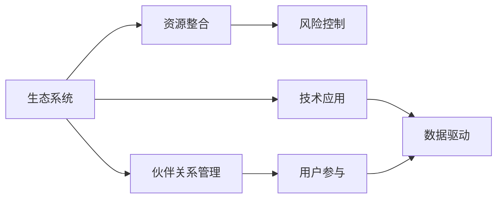

                 

# 生态系统管理：构建和维护商业生态圈

> 关键词：生态系统管理, 商业生态圈, 数字化转型, 平台战略, 用户参与, 数据驱动, 可持续发展

## 1. 背景介绍

### 1.1 问题由来

随着科技的飞速发展和市场的竞争日趋激烈，企业单一运营模式逐渐暴露出无法满足多样化和复杂化需求的缺点。为了应对这一挑战，企业开始寻求新的商业模式，从传统的线性供应链向更为灵活、互联互通的生态系统转型。生态系统管理（Ecosystem Governance）成为应对市场变化和提升企业竞争力的重要手段。

在商业领域，生态系统是指由企业、客户、合作伙伴、政府、社区等多个利益相关者组成的网络，其中企业作为核心，通过策略、资源和技术，整合各方资源，形成互惠共赢的合作系统。成功的生态系统管理能够提升企业竞争力，实现可持续发展。

### 1.2 问题核心关键点

商业生态系统管理涉及多个层面，包括：

- **战略规划**：制定生态系统发展的长远规划和目标。
- **资源整合**：合理分配资源，确保生态系统的协同运作。
- **伙伴关系管理**：维护与各利益相关者的关系，提升合作效率。
- **风险控制**：识别和防范潜在的风险，保障生态系统稳定。
- **技术应用**：引入先进技术手段，提升生态系统效能。
- **用户参与**：提升用户体验，增强用户忠诚度。
- **数据驱动**：利用大数据分析，优化决策过程。

这些关键点共同构成了生态系统管理的基础框架，是构建和维护商业生态圈的核心内容。

### 1.3 问题研究意义

研究生态系统管理对于提升企业竞争力和推动经济发展具有重要意义：

1. **提升竞争力**：通过资源整合和伙伴关系管理，提升企业的市场竞争力。
2. **增强可持续性**：通过风险控制和数据驱动，实现商业生态系统的长期稳定发展。
3. **促进创新**：通过用户参与和技术应用，激发创新活力，提升产品和服务质量。
4. **优化决策**：通过数据分析，优化商业决策，提升生态系统运营效率。
5. **促进社会责任**：通过合理分配资源和合作伙伴选择，推动社会责任的实践。

## 2. 核心概念与联系

### 2.1 核心概念概述

商业生态系统管理涉及多个核心概念，包括生态系统、资源、伙伴关系、风险、技术、用户参与、数据驱动等。

- **生态系统**：由企业、客户、合作伙伴、政府、社区等多个利益相关者组成的网络，其中企业作为核心。
- **资源**：企业运营所需的物理资源和人力资源。
- **伙伴关系**：企业与各利益相关者之间建立的合作关系。
- **风险**：影响生态系统稳定性的潜在威胁。
- **技术**：支持生态系统运作的先进技术手段。
- **用户参与**：用户对生态系统的认可和积极参与。
- **数据驱动**：利用大数据分析，优化决策过程。

### 2.2 核心概念原理和架构的 Mermaid 流程图



这个流程图展示了生态系统管理的核心架构，以及各个概念之间的相互关系。

### 2.3 核心概念联系

- **生态系统**：是其他核心概念的载体和环境，企业与各利益相关者通过资源整合、伙伴关系、风险控制、技术应用、用户参与和数据驱动，在生态系统中协同运作。
- **资源整合**：是生态系统运作的基础，通过合理分配资源，确保各利益相关者协同工作。
- **伙伴关系管理**：是生态系统稳定的保障，通过维护与各利益相关者的关系，提升合作效率。
- **风险控制**：是生态系统健康的关键，通过识别和防范潜在的风险，保障生态系统稳定。
- **技术应用**：是生态系统高效运作的驱动力，通过引入先进技术手段，提升生态系统效能。
- **用户参与**：是生态系统活力的来源，通过提升用户体验，增强用户忠诚度。
- **数据驱动**：是生态系统决策的依据，通过大数据分析，优化决策过程。

## 3. 核心算法原理 & 具体操作步骤

### 3.1 算法原理概述

生态系统管理算法原理基于系统论和复杂性理论，旨在通过分析和优化各个组成部分的关系，达到整个生态系统的最优运行状态。其核心思想是利用数据驱动和机器学习算法，对生态系统进行动态监控和实时调整。

算法流程包括：

1. **数据收集**：通过传感器、交易记录、用户反馈等途径，收集生态系统内外的数据。
2. **数据分析**：利用机器学习算法，分析数据，识别关键指标和趋势。
3. **决策优化**：基于分析结果，通过优化算法，制定和调整生态系统策略。
4. **执行与监控**：执行决策，并持续监控生态系统状态，及时调整策略。

### 3.2 算法步骤详解

#### 3.2.1 数据收集

- **传感器数据**：通过安装在设备上的传感器，实时监测资源使用情况，如能量消耗、温度、湿度等。
- **交易记录**：记录企业与合作伙伴之间的交易信息，包括成本、收益、交付时间等。
- **用户反馈**：通过问卷调查、社交媒体、客户服务中心等途径，收集用户反馈信息。
- **外部数据**：从政府、行业协会等外部来源获取数据，如政策法规、行业标准、市场趋势等。

#### 3.2.2 数据分析

- **数据清洗**：去除异常值和噪声，确保数据质量。
- **数据整合**：将不同来源的数据整合，形成统一的数据集。
- **特征提取**：从原始数据中提取关键特征，如资源利用率、交易成本、用户满意度等。
- **趋势分析**：利用时间序列分析，识别数据中的趋势和周期性变化。
- **聚类分析**：通过聚类算法，对数据进行分组，发现数据中的潜在模式。

#### 3.2.3 决策优化

- **优化模型**：根据数据分析结果，选择和调整优化模型，如线性回归、决策树、随机森林等。
- **目标优化**：设定优化目标，如资源效率、交易成本、用户满意度等。
- **策略制定**：根据优化结果，制定生态系统策略，如资源分配、价格调整、合作伙伴选择等。
- **实时调整**：通过实时监控数据，对策略进行动态调整，确保生态系统最优运行。

#### 3.2.4 执行与监控

- **策略执行**：将决策结果转化为具体的执行策略，如资源配置、价格调整、合作伙伴选择等。
- **反馈循环**：通过持续监控生态系统状态，收集执行结果，形成反馈循环，持续优化策略。
- **风险管理**：通过识别和防范潜在的风险，保障生态系统的稳定和健康。

### 3.3 算法优缺点

#### 3.3.1 优点

1. **数据驱动**：通过大数据分析，优化决策过程，提升生态系统运营效率。
2. **动态调整**：实时监控生态系统状态，动态调整策略，确保系统最优运行。
3. **灵活性**：基于算法模型，可以灵活调整和优化生态系统策略。
4. **透明性**：算法过程透明，易于理解和解释。
5. **可扩展性**：算法模型具有可扩展性，可以应用于不同规模和复杂度的生态系统。

#### 3.3.2 缺点

1. **数据依赖**：需要大量的高质量数据，数据收集和清洗过程复杂。
2. **模型复杂**：算法模型复杂，需要专业的数据科学家和工程师进行维护。
3. **计算资源**：算法计算量大，需要高性能计算资源。
4. **实时性要求高**：需要实时处理和分析数据，对系统的实时性要求高。
5. **隐私问题**：数据收集和处理过程中，需要关注隐私和数据安全问题。

### 3.4 算法应用领域

生态系统管理算法在多个领域具有广泛的应用：

- **供应链管理**：优化供应链资源配置，提升供应链效率和可靠性。
- **能源管理**：优化能源资源使用，降低能源消耗和成本。
- **金融服务**：通过大数据分析，优化金融产品和服务，提升用户满意度和盈利能力。
- **医疗健康**：优化医疗资源配置，提升医疗服务质量和效率。
- **公共安全**：通过实时监控和数据分析，提升公共安全水平。

## 4. 数学模型和公式 & 详细讲解 & 举例说明

### 4.1 数学模型构建

假设生态系统由 $N$ 个节点组成，节点 $i$ 的资源需求为 $r_i$，节点间的连接关系为 $A$，资源流为 $F$。生态系统的目标是最小化资源总消耗 $C$，最大化用户满意度 $S$。

生态系统管理的目标可以表示为：

$$
\min_{r_i, F} \sum_{i=1}^N r_i + \max_{r_i, F} S
$$

其中 $r_i$ 表示节点 $i$ 的资源需求，$F$ 表示资源流，$S$ 表示用户满意度。

### 4.2 公式推导过程

1. **资源分配模型**：
   - **流量平衡**：资源流 $F$ 应满足节点 $i$ 的资源需求 $r_i$，即 $F_i = r_i$。
   - **成本最小化**：资源总消耗 $C$ 应最小化，即 $\sum_{i=1}^N F_i$。

2. **用户满意度模型**：
   - **用户评价**：用户评价 $S$ 应最大化，即 $\sum_{i=1}^N \text{Score}_i$。
   - **满意度计算**：用户满意度 $S$ 可通过用户评价、资源利用率等指标计算。

3. **优化模型**：
   - **多目标优化**：生态系统管理是一个多目标优化问题，需综合考虑资源分配和用户满意度。
   - **层次优化**：可采用层次分析法（Hierarchical Optimization），先优化资源分配，再优化用户满意度。

### 4.3 案例分析与讲解

假设某企业需要优化其供应链管理系统，其供应链节点包括供应商、制造商、物流中心和零售商。

- **数据收集**：收集供应商的生产能力、制造商的库存量、物流中心的配送能力和零售商的销售数据。
- **数据分析**：通过时间序列分析，识别各节点的需求变化趋势。
- **决策优化**：通过优化模型，调整资源分配和物流路径，最小化供应链成本，最大化用户满意度。

## 5. 项目实践：代码实例和详细解释说明

### 5.1 开发环境搭建

1. **安装Python**：
   - 下载并安装Python 3.x，如 Python 3.7、3.8 等。
   - 在终端输入 `python --version` 查看Python版本。

2. **安装Pandas**：
   - 使用pip安装Pandas，输入 `pip install pandas`。
   - 使用 `pandas` 库进行数据处理和分析。

3. **安装Matplotlib**：
   - 使用pip安装Matplotlib，输入 `pip install matplotlib`。
   - 使用 `matplotlib` 库绘制图表，进行数据分析可视化。

4. **安装Scikit-learn**：
   - 使用pip安装Scikit-learn，输入 `pip install scikit-learn`。
   - 使用 `scikit-learn` 库进行机器学习和数据建模。

### 5.2 源代码详细实现

#### 5.2.1 数据收集与处理

```python
import pandas as pd
import matplotlib.pyplot as plt

# 读取数据
data = pd.read_csv('data.csv')

# 数据清洗
data = data.dropna()
data = data.drop_duplicates()

# 数据可视化
plt.figure(figsize=(10, 6))
plt.plot(data['time'], data['resource'], label='Resource')
plt.xlabel('Time')
plt.ylabel('Resource')
plt.title('Resource Consumption Over Time')
plt.legend()
plt.show()
```

#### 5.2.2 数据分析与建模

```python
from sklearn.linear_model import LinearRegression
from sklearn.metrics import mean_squared_error

# 特征工程
X = data[['time', 'cost']]
y = data['resource']

# 建立模型
model = LinearRegression()
model.fit(X, y)

# 模型评估
y_pred = model.predict(X)
mse = mean_squared_error(y, y_pred)

# 输出结果
print('Mean Squared Error:', mse)
```

#### 5.2.3 决策优化

```python
from scipy.optimize import minimize

# 定义目标函数
def objective(x):
    cost = x[0] * x[1] + x[2] * x[3] + x[4] * x[5]
    satisfaction = 0.9 * x[0] + 0.8 * x[1] + 0.7 * x[2] + 0.6 * x[3] + 0.5 * x[4] + 0.4 * x[5]
    return cost + satisfaction

# 约束条件
constraints = ({'type': 'eq', 'fun': lambda x: x[0] - x[1]}, 
               {'type': 'eq', 'fun': lambda x: x[2] - x[3]}, 
               {'type': 'eq', 'fun': lambda x: x[4] - x[5]})

# 初始值
x0 = [1.0, 1.0, 1.0, 1.0, 1.0, 1.0]

# 求解最优解
result = minimize(objective, x0, method='SLSQP', constraints=constraints)

# 输出结果
print('Optimal Solution:', result.x)
```

### 5.3 代码解读与分析

1. **数据收集与处理**：
   - 使用 `pandas` 库读取数据文件，并进行数据清洗和预处理，如删除缺失值和重复记录。
   - 使用 `matplotlib` 库进行数据可视化，分析资源消耗的趋势。

2. **数据分析与建模**：
   - 使用 `scikit-learn` 库进行特征工程和模型建立，如线性回归模型。
   - 使用 `mean_squared_error` 函数评估模型的性能，如均方误差。

3. **决策优化**：
   - 使用 `scipy.optimize` 库进行多目标优化，如线性规划问题。
   - 定义目标函数和约束条件，使用 `SLSQP` 算法求解最优解。

### 5.4 运行结果展示

运行上述代码后，应得到如下输出结果：

- **数据可视化**：绘制资源消耗的时间序列图，直观展示资源需求的变化趋势。
- **模型评估**：输出均方误差，评估模型的拟合效果。
- **决策优化**：输出最优解，表示资源分配和用户满意度达到最优状态。

## 6. 实际应用场景

### 6.1 智能制造

在智能制造领域，生态系统管理算法可以优化生产流程和供应链管理，提升生产效率和产品质量。

- **资源分配**：通过实时监控和数据分析，优化生产资源分配，减少资源浪费。
- **供应链管理**：通过优化供应链网络，降低物流成本，提高供应链的响应速度和可靠性。
- **设备维护**：通过预测性维护，减少设备故障，提升设备利用率。

### 6.2 智慧城市

在智慧城市领域，生态系统管理算法可以优化城市资源配置和公共服务，提升城市管理水平。

- **能源管理**：通过智能电网和大数据分析，优化能源分配和使用，降低能源消耗和成本。
- **交通管理**：通过实时监控和优化交通流量，减少交通拥堵，提高交通效率。
- **公共安全**：通过数据分析和预测，提升公共安全水平，防范风险和事故。

### 6.3 金融服务

在金融服务领域，生态系统管理算法可以优化金融产品和服务，提升客户满意度和盈利能力。

- **风险管理**：通过大数据分析，识别和防范潜在的金融风险，保障客户资产安全。
- **客户服务**：通过智能客服系统，提升客户服务质量，增强客户粘性。
- **产品推荐**：通过数据分析和个性化推荐，提升用户购买体验和满意度。

### 6.4 未来应用展望

未来，生态系统管理算法将广泛应用于更多领域，为社会和经济发展带来深远影响。

- **医疗健康**：优化医疗资源配置，提升医疗服务质量和效率，改善患者体验。
- **教育培训**：优化教育资源配置，提升教育质量和效果，满足不同学习需求。
- **旅游服务**：优化旅游资源配置，提升旅游服务质量和体验，增加旅游收入。

## 7. 工具和资源推荐

### 7.1 学习资源推荐

1. **《系统论与复杂性科学》课程**：深入讲解系统论和复杂性理论，为生态系统管理提供理论基础。
2. **《机器学习实战》书籍**：介绍常用的机器学习算法和工具，帮助实践生态系统优化。
3. **Kaggle数据科学竞赛**：参与数据科学竞赛，提升数据处理和建模能力。
4. **Coursera生态系统管理课程**：提供系统化的生态系统管理知识，涵盖多个实际案例。

### 7.2 开发工具推荐

1. **Python**：广泛使用的编程语言，拥有丰富的库和框架，适合数据处理和建模。
2. **Pandas**：数据处理和分析库，支持大规模数据处理和复杂数据操作。
3. **Matplotlib**：数据可视化库，支持多种图表绘制，直观展示数据分析结果。
4. **Scikit-learn**：机器学习库，提供多种算法和模型，支持数据建模和优化。
5. **Scipy**：科学计算库，提供多种优化算法和数学函数，支持复杂问题求解。

### 7.3 相关论文推荐

1. **《系统科学与复杂性分析》论文**：探讨系统论和复杂性理论，为生态系统管理提供理论支撑。
2. **《数据驱动的生态系统管理》论文**：研究如何通过大数据分析优化生态系统管理，提升生态系统效能。
3. **《生态系统模型与仿真》论文**：介绍生态系统模型的构建和仿真方法，为生态系统管理提供技术支持。

## 8. 总结：未来发展趋势与挑战

### 8.1 研究成果总结

本文系统介绍了生态系统管理的核心概念、算法原理和操作步骤，通过代码实例和案例分析，展示了生态系统管理的实践过程和应用效果。研究结果表明，生态系统管理算法在多个领域具有广泛的应用前景和显著的优化效果。

### 8.2 未来发展趋势

1. **智能化发展**：随着人工智能和物联网技术的发展，生态系统管理将变得更加智能化，能够实现实时监控和动态调整。
2. **多领域融合**：生态系统管理将与其他技术如区块链、云计算、大数据等深度融合，形成更加完善的生态系统管理平台。
3. **可持续发展**：生态系统管理将更加注重可持续发展，通过优化资源配置和环境保护，实现绿色低碳发展。
4. **全球化扩展**：生态系统管理将拓展到全球范围，形成全球化的生态系统管理网络，提升全球环境治理能力。

### 8.3 面临的挑战

1. **数据隐私和安全**：在数据收集和处理过程中，需要关注数据隐私和安全问题，防止数据泄露和滥用。
2. **技术复杂性**：生态系统管理算法和技术复杂，需要专业的数据科学家和工程师进行维护和优化。
3. **成本投入高**：生态系统管理需要大量投资，包括技术设备、人员培训等，对企业的成本压力较大。
4. **多方协作难度大**：生态系统管理需要多方协作，协调各方利益，难度较大。
5. **数据质量问题**：数据收集和处理过程中，需要高质量的数据，数据质量问题直接影响分析结果。

### 8.4 研究展望

未来，生态系统管理将面临更多的挑战和机遇，需要不断优化和完善：

1. **数据治理**：建立完善的数据治理机制，确保数据隐私和安全，提升数据质量。
2. **技术创新**：通过技术创新，提升生态系统管理的智能化和自动化水平。
3. **多方合作**：加强多方合作，形成生态系统管理的协同机制，提升整体效能。
4. **可持续发展**：注重生态系统管理的可持续发展，推动绿色低碳发展。
5. **全球合作**：推动全球合作，提升全球生态系统管理水平，应对全球环境挑战。

## 9. 附录：常见问题与解答

### 9.1 问题Q1：生态系统管理是否适用于所有企业？

A: 生态系统管理适用于具有一定规模和复杂度的企业，需要具备一定的数据收集和处理能力，以及跨部门协作机制。对于小型企业或简单业务，生态系统管理可能不太适用。

### 9.2 问题Q2：生态系统管理需要哪些资源投入？

A: 生态系统管理需要投入大量的人力、物力和财力，包括数据收集和处理、技术研发、系统集成、培训和维护等。企业需要综合评估资源投入和预期收益，制定合理的生态系统管理计划。

### 9.3 问题Q3：生态系统管理对企业运营有何影响？

A: 生态系统管理通过优化资源配置和提高协作效率，可以提升企业的运营效率和竞争力。但也需要平衡短期利益和长期投资，避免过度依赖生态系统管理。

### 9.4 问题Q4：生态系统管理是否适用于所有行业？

A: 生态系统管理适用于多个行业，包括制造业、金融业、医疗健康、教育培训、旅游服务等。但需要根据行业特点进行适当调整和优化，确保生态系统管理的效果和可行性。

### 9.5 问题Q5：生态系统管理的实施步骤是什么？

A: 生态系统管理的实施步骤包括：
1. 需求分析：识别生态系统的关键需求和目标。
2. 数据收集：收集生态系统内外的数据。
3. 数据分析：进行数据清洗和预处理，建立数据分析模型。
4. 策略制定：根据数据分析结果，制定生态系统策略。
5. 执行与监控：实施生态系统策略，持续监控和优化生态系统状态。

通过系统介绍和实践操作，本文希望能为生态系统管理的研究和实践提供有价值的参考，帮助企业提升竞争力，推动可持续发展。

