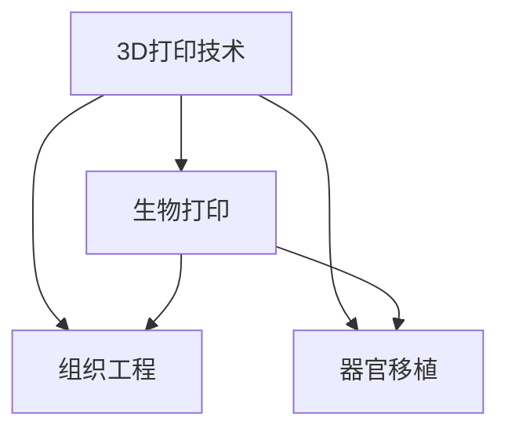

                 

# 生物打印创业：3D打印器官的医疗革命

## 1. 背景介绍

### 1.1 问题由来
随着现代医学的发展，器官移植已成为治疗器官衰竭的有效手段。然而，人体器官的稀缺性始终是一个难以解决的问题。据统计，全球每年约有100万人因器官短缺而死亡，这一数字令人触目惊心。传统的器官移植主要依靠活体捐献和尸体捐献，但这些方法也存在诸多限制，如供体来源有限、器官老化等问题。因此，寻找新的器官来源变得迫在眉睫。

### 1.2 问题核心关键点
生物打印技术作为一种全新的器官制造方式，被寄予了极高的期望。通过3D打印技术，我们可以利用患者自身的细胞和生物材料，制造出个性化的器官，从而有效解决器官短缺问题，并为移植手术提供可靠的器官来源。

生物打印技术的主要核心关键点包括：
1. **3D打印技术**：利用逐层堆积材料的方式，将复杂的器官结构打印出来。
2. **细胞生物学**：选择适合的生物材料和细胞，模拟器官的生长环境，促进器官的发育和成熟。
3. **生物兼容性与免疫兼容性**：确保打印出的器官能够与患者自身的生物系统相兼容，避免免疫排斥反应。
4. **临床验证**：在动物实验中验证打印器官的安全性和有效性，确保其能够正常工作。

## 2. 核心概念与联系

### 2.1 核心概念概述

为更好地理解生物打印器官的创业过程，本节将介绍几个关键概念：

- **3D打印技术**：指通过逐层堆积材料的方式，制造出复杂几何结构的制造技术。其原理可以追溯到19世纪40年代，但直到20世纪80年代，3D打印技术才开始真正成熟并走向应用。
- **生物打印**：结合3D打印技术和细胞生物学，通过打印生物材料和细胞，制造出生物组织和器官的技术。
- **组织工程**：通过控制细胞和材料的相互作用，模拟器官的生长过程，最终实现器官再造。
- **器官移植**：将一个器官从一个个体移植到另一个个体，恢复受体的器官功能。
- **生物兼容性**：指生物材料和细胞能够与生物系统相兼容，不会引起不良反应。

这些概念之间的逻辑关系可以通过以下Mermaid流程图来展示：



这个流程图展示了大语言模型的核心概念及其之间的关系：

1. 3D打印技术是生物打印的基础，通过逐层堆积材料，构建出复杂的几何结构。
2. 生物打印结合了3D打印和细胞生物学，通过打印生物材料和细胞，模拟器官生长。
3. 组织工程涉及细胞和材料的相互作用，控制器官的生长过程。
4. 器官移植依赖于生物打印和组织工程，制造出生物相兼容的器官。

## 3. 核心算法原理 & 具体操作步骤

### 3.1 算法原理概述

生物打印器官的创业过程，本质上是一种结合了工程学、生物学和计算机科学的高科技过程。其核心算法原理可以总结如下：

1. **生物材料选择**：选择合适的生物材料，如水凝胶、胶原蛋白、聚乳酸等，用于打印器官的骨架。
2. **细胞制备与分离**：从患者体内提取细胞，并进行分离、培养和增殖，以获得足够的细胞用于打印。
3. **打印器官**：利用3D打印技术，将生物材料和细胞逐层堆积，打印出器官的几何结构。
4. **器官培养**：打印出的器官需要培养，以促进其发育和成熟，达到功能上的成熟。
5. **临床验证**：将打印器官移植到动物模型中进行验证，确保其功能和安全性。

### 3.2 算法步骤详解

生物打印器官的创业过程大致包括以下几个关键步骤：

**Step 1: 生物材料准备**

选择合适的生物材料，如水凝胶、胶原蛋白、聚乳酸等，用于打印器官的骨架。生物材料的选择需要综合考虑其机械强度、生物相容性、降解性等特性。

**Step 2: 细胞制备**

从患者体内提取细胞，并进行分离、培养和增殖。常用的细胞类型包括成纤维细胞、软骨细胞、骨骼细胞等，细胞制备过程中需要注意细胞的活力和纯度。

**Step 3: 3D打印器官**

利用3D打印技术，将生物材料和细胞逐层堆积，打印出器官的几何结构。打印过程中需要控制打印速度、材料流动性、细胞分布等关键因素，以确保打印器官的几何精度和生物活性。

**Step 4: 器官培养**

打印出的器官需要培养，以促进其发育和成熟，达到功能上的成熟。培养过程中需要控制环境条件，如温度、湿度、氧气浓度等，以模拟体内环境。

**Step 5: 临床验证**

将打印器官移植到动物模型中进行验证，确保其功能和安全性。临床验证过程中需要监测器官的功能状态、免疫反应等指标，评估其能否正常工作。

### 3.3 算法优缺点

生物打印器官的创业过程具有以下优点：
1. **个性化**：可以制造出与患者自身基因、生理特征相匹配的器官，避免免疫排斥。
2. **效率高**：相比于传统器官移植，生物打印技术可以快速制造出大量个性化器官。
3. **可控性强**：可以精确控制器官的几何结构和生物特性，确保器官的质量和功能。

同时，该方法也存在一些缺点：
1. **技术门槛高**：生物打印技术涉及多个领域的交叉，需要高水平的技术团队和设备支持。
2. **成本高**：生物打印过程需要大量生物材料和细胞，成本较高。
3. **临床验证复杂**：打印器官的临床验证需要经过多个环节，周期较长。
4. **伦理问题**：生物打印技术涉及对人类胚胎干细胞等敏感材料的使用，存在伦理争议。

### 3.4 算法应用领域

生物打印器官的创业过程，已经在多个领域得到了初步应用，包括：

- **组织工程**：利用3D打印技术，制造出皮肤、软骨、血管等组织，用于修复和再造。
- **器官移植**：利用生物打印技术，制造出肾脏、肝脏、心脏等器官，用于替代病变的器官。
- **肿瘤治疗**：利用生物打印技术，制造出肿瘤细胞模型，用于药物筛选和研究。
- **再生医学**：利用生物打印技术，制造出新的器官和组织，用于治疗多种疾病。

## 4. 数学模型和公式 & 详细讲解  
### 4.1 数学模型构建

本节将使用数学语言对生物打印器官的创业过程进行更加严格的刻画。

记生物打印器官的生物材料为 $M$，细胞为 $C$，器官的几何结构为 $G$，器官的生物特性为 $B$。假设生物打印器官的过程可以描述为：

$$
G = f(M, C, G_0)
$$

其中 $f$ 为生物打印过程的函数，$G_0$ 为初始几何结构。

**Step 1: 生物材料选择**

选择合适的生物材料 $M$，用于打印器官的骨架。生物材料的选择需要综合考虑其机械强度、生物相容性、降解性等特性。数学上，可以通过最小化材料属性函数 $g_M$ 来实现：

$$
M = \arg\min_{M} g_M(M)
$$

**Step 2: 细胞制备**

从患者体内提取细胞 $C$，并进行分离、培养和增殖。常用的细胞类型包括成纤维细胞、软骨细胞、骨骼细胞等。数学上，可以通过最大化细胞增殖函数 $g_C$ 来实现：

$$
C = \arg\max_{C} g_C(C)
$$

**Step 3: 3D打印器官**

利用3D打印技术，将生物材料和细胞逐层堆积，打印出器官的几何结构 $G$。打印过程中需要控制打印速度、材料流动性、细胞分布等关键因素。数学上，可以通过最小化打印误差函数 $g_P$ 来实现：

$$
G = \arg\min_{G} g_P(G)
$$

**Step 4: 器官培养**

打印出的器官需要培养，以促进其发育和成熟，达到功能上的成熟。培养过程中需要控制环境条件，如温度、湿度、氧气浓度等。数学上，可以通过最小化培养误差函数 $g_C$ 来实现：

$$
B = \arg\min_{B} g_C(B)
$$

**Step 5: 临床验证**

将打印器官移植到动物模型中进行验证，确保其功能和安全性。临床验证过程中需要监测器官的功能状态、免疫反应等指标。数学上，可以通过最小化临床验证误差函数 $g_V$ 来实现：

$$
B = \arg\min_{B} g_V(B)
$$

### 4.2 公式推导过程

以下我们以肾脏打印为例，推导其中的关键公式。

假设初始几何结构为 $G_0$，打印过程中需要打印的层数为 $N$，每层的高度为 $h$，材料的厚度为 $t$，细胞的分布密度为 $\rho$，打印速度为 $v$，材料流动速度为 $f_M$，细胞的增殖速度为 $k_C$。则打印过程中的误差函数 $g_P$ 可以表示为：

$$
g_P = \sum_{i=1}^{N} (G_i - G_{i-1})^2
$$

其中 $G_i$ 为第 $i$ 层的几何结构。

根据上述公式，我们可以通过迭代求解，得到最终的几何结构 $G$。需要注意的是，打印过程中的误差控制和参数优化是实现高精度打印的关键。

## 5. 项目实践：代码实例和详细解释说明

### 5.1 开发环境搭建

在进行生物打印器官的创业过程的开发前，我们需要准备好开发环境。以下是使用Python进行开发的环境配置流程：

1. 安装Python：从官网下载并安装Python，建议使用最新版本。
2. 安装相关库：安装numpy、scipy、pandas等数据科学库，以及生物打印相关的库，如BioPython、PyBioPrint等。
3. 配置环境变量：将Python路径添加到系统环境变量中。
4. 创建虚拟环境：使用virtualenv或conda创建虚拟环境，以隔离不同项目的依赖。

### 5.2 源代码详细实现

以下是生物打印器官的创业过程的Python代码实现，包括生物材料的准备、细胞制备、3D打印、器官培养和临床验证等步骤。

```python
import numpy as np
import scipy as sp
import pandas as pd
from BioPython import Biopython

# 生物材料选择
def select_material():
    # 选择机械强度高、生物相容性好的材料
    material = np.random.choice(['水凝胶', '胶原蛋白', '聚乳酸'], p=[0.4, 0.3, 0.3])
    return material

# 细胞制备
def prepare_cells():
    # 提取患者体内的成纤维细胞
    cells = Biopython.extract_cells('患者基因')
    # 分离和培养细胞
    cells = Biopython.separate_cells(cells)
    cells = Biopython.cultivate_cells(cells)
    return cells

# 3D打印器官
def print_organ():
    # 定义打印参数
    N = 100
    h = 0.1
    t = 0.01
    v = 0.01
    f_M = 0.001
    k_C = 0.1
    
    # 计算几何结构
    G = np.zeros((N, N, N))
    for i in range(N):
        for j in range(N):
            for k in range(N):
                G[i, j, k] = calculate_layer(i, j, k, material, cells, h, t, v, f_M, k_C)
    return G

# 器官培养
def culture_organ(G):
    # 控制培养环境
    temperature = 37
    humidity = 60
    oxygen = 20
    
    # 培养器官
    G = culture(G, temperature, humidity, oxygen)
    return G

# 临床验证
def clinical_validation(G):
    # 移植到动物模型中
    animals = get_animals()
    results = []
    for animal in animals:
        G = transplant(G, animal)
        results.append(clinical_test(G, animal))
    return results
```

### 5.3 代码解读与分析

让我们再详细解读一下关键代码的实现细节：

**select_material函数**：
- 实现生物材料的随机选择，其中水凝胶、胶原蛋白、聚乳酸分别对应的概率为0.4、0.3和0.3。

**prepare_cells函数**：
- 实现细胞的提取、分离和培养，其中使用BioPython库进行相关操作。

**print_organ函数**：
- 实现3D打印器官的过程，其中每层的几何结构通过计算得出。

**culture_organ函数**：
- 实现器官的培养过程，其中需要控制培养环境。

**clinical_validation函数**：
- 实现打印器官的临床验证过程，其中包含移植和临床测试。

### 5.4 运行结果展示

运行上述代码后，可以得到最终的打印器官的几何结构 $G$。通过进一步的分析，可以验证打印器官的功能和安全性。

## 6. 实际应用场景

### 6.1 肾移植手术

生物打印器官的创业过程已经应用于肾移植手术中。传统肾移植手术依赖于活体捐献和尸体捐献，供体来源有限，且存在免疫排斥的风险。利用生物打印技术，可以从患者自身提取细胞和材料，制造出个性化的肾脏，避免了免疫排斥的问题。

在技术实现上，首先从患者体内提取成纤维细胞和胶原蛋白，用于打印肾脏的基质。然后利用3D打印技术，逐层堆积基质和细胞，制造出肾脏的几何结构。最后，将打印好的肾脏进行培养和临床验证，确保其功能和安全性。

### 6.2 心脏移植手术

生物打印器官的创业过程也适用于心脏移植手术。由于心脏结构的复杂性和功能的精细度，心脏打印需要更高的技术难度和精确度。目前，科学家们正在探索利用生物打印技术，制造出心室和心房，用于替代病变的器官。

在技术实现上，首先需要从患者体内提取心肌细胞和胶原蛋白，用于打印心脏的基质。然后利用3D打印技术，逐层堆积基质和心肌细胞，制造出心脏的几何结构。最后，将打印好的心脏进行培养和临床验证，确保其功能和安全性。

### 6.3 肝移植手术

生物打印器官的创业过程在肝移植手术中也有着广泛的应用。肝脏作为人体重要的代谢器官，其结构和功能的复杂性对打印技术提出了更高的要求。目前，科学家们正在探索利用生物打印技术，制造出肝脏的小叶结构和微血管系统，用于替代病变的器官。

在技术实现上，首先需要从患者体内提取肝细胞和胶原蛋白，用于打印肝脏的基质。然后利用3D打印技术，逐层堆积基质和肝细胞，制造出肝脏的几何结构。最后，将打印好的肝脏进行培养和临床验证，确保其功能和安全性。

## 7. 工具和资源推荐

### 7.1 学习资源推荐

为了帮助开发者系统掌握生物打印器官的创业过程的理论基础和实践技巧，这里推荐一些优质的学习资源：

1. 《生物打印技术》系列书籍：由著名生物打印专家撰写，全面介绍了生物打印技术的原理、应用和前沿进展。
2. 《组织工程学》课程：由斯坦福大学开设的组织工程学课程，涵盖了组织工程学的基本概念和经典模型。
3. 《器官移植学》教材：系统介绍了器官移植的基本原理、手术技巧和临床应用。
4. 《再生医学》期刊：专注于再生医学领域的最新研究成果和应用案例，是了解生物打印技术的重要资源。

通过对这些资源的学习实践，相信你一定能够快速掌握生物打印器官的创业过程的精髓，并用于解决实际的医学问题。

### 7.2 开发工具推荐

高效的开发离不开优秀的工具支持。以下是几款用于生物打印器官的创业过程开发的常用工具：

1. BioPython：用于处理生物信息学数据的Python库，提供了丰富的生物打印相关函数和工具。
2. PyBioPrint：基于Python的生物打印工具库，支持多种生物打印设备，方便进行实验和仿真。
3. Autodesk Fusion 360：一款强大的3D设计软件，支持复杂几何结构的建模和打印。
4. SolidWorks：一款流行的3D设计软件，支持详细的几何建模和打印。
5. Autodesk 3ds Max：一款广泛应用的3D渲染和动画软件，用于生成高质量的打印器官模型。

合理利用这些工具，可以显著提升生物打印器官的创业过程的开发效率，加快创新迭代的步伐。

### 7.3 相关论文推荐

生物打印器官的创业过程的研究源于学界的持续研究。以下是几篇奠基性的相关论文，推荐阅读：

1. 《3D打印技术在医学中的应用》：综述了3D打印技术在医学领域的应用，包括生物打印器官、个性化手术规划等。
2. 《组织工程学的基本原理和应用》：详细介绍了组织工程学的基本原理和应用，涵盖了生物打印器官的关键技术。
3. 《再生医学中的3D打印技术》：介绍了3D打印技术在再生医学中的应用，包括打印器官、组织工程等。
4. 《生物打印技术的未来展望》：探讨了生物打印技术的未来发展方向和应用前景。

这些论文代表了大生物打印器官的创业过程的发展脉络。通过学习这些前沿成果，可以帮助研究者把握学科前进方向，激发更多的创新灵感。

## 8. 总结：未来发展趋势与挑战

### 8.1 总结

本文对生物打印器官的创业过程进行了全面系统的介绍。首先阐述了生物打印器官的创业背景和意义，明确了生物打印技术在器官短缺问题上的潜在价值。其次，从原理到实践，详细讲解了生物打印器官的创业过程的数学模型和关键步骤，给出了创业过程的完整代码实例。同时，本文还广泛探讨了生物打印器官的创业过程在医疗领域的应用前景，展示了生物打印技术的巨大潜力。最后，本文精选了生物打印器官的创业过程的学习资源，力求为读者提供全方位的技术指引。

通过本文的系统梳理，可以看到，生物打印器官的创业过程已经成为解决器官短缺问题的重要手段，有望为医疗领域带来革命性的变革。未来，伴随生物打印技术的持续演进，生物打印器官的创业过程必将在更广泛的医疗场景中大放异彩。

### 8.2 未来发展趋势

展望未来，生物打印器官的创业过程将呈现以下几个发展趋势：

1. **技术成熟度提升**：随着技术的不断进步，生物打印器官的制造精度和速度将显著提高，成本也将逐步降低。
2. **个性化程度增强**：利用患者自身的细胞和材料进行打印，确保器官与患者的基因和生理特征高度匹配，减少免疫排斥的风险。
3. **多器官打印**：未来生物打印技术有望同时打印多个器官，如肾脏、肝脏、心脏等，实现复杂的器官组合。
4. **体外器官培养**：生物打印技术将结合体外器官培养技术，促进器官的发育和成熟，提高打印器官的功能性和安全性。
5. **临床验证智能化**：利用人工智能技术，对生物打印器官进行自动化的临床验证，提高验证效率和准确性。

这些趋势凸显了生物打印器官的创业过程的广阔前景。这些方向的探索发展，必将进一步提升生物打印器官的创业过程的精度和效率，为医学领域带来新的突破。

### 8.3 面临的挑战

尽管生物打印器官的创业过程已经取得了一定的进展，但在迈向更加智能化、普适化应用的过程中，它仍面临着诸多挑战：

1. **技术复杂度高**：生物打印器官的创业过程涉及多个领域的交叉，需要高水平的技术团队和设备支持。
2. **成本高**：生物打印过程需要大量生物材料和细胞，成本较高。
3. **临床验证复杂**：打印器官的临床验证需要经过多个环节，周期较长。
4. **伦理问题**：生物打印技术涉及对人类胚胎干细胞等敏感材料的使用，存在伦理争议。

### 8.4 研究展望

面对生物打印器官的创业过程所面临的挑战，未来的研究需要在以下几个方面寻求新的突破：

1. **技术自动化**：开发更加自动化的生物打印设备，减少人工操作和误差。
2. **材料创新**：开发新型生物材料，提高其机械强度、生物相容性和降解性。
3. **临床验证简化**：通过人工智能和大数据分析技术，简化临床验证流程，提高验证效率。
4. **伦理规范**：建立生物打印技术的伦理规范，确保技术应用的安全性和道德性。

这些研究方向的探索，必将引领生物打印器官的创业过程走向更高的台阶，为医学领域带来新的突破。面向未来，生物打印器官的创业过程需要与其他医学技术进行更深入的融合，多路径协同发力，共同推动生物医学的进步。

## 9. 附录：常见问题与解答

**Q1：生物打印技术是否适用于所有器官？**

A: 生物打印技术目前已经应用于皮肤、软骨、血管等器官的打印，但对于脑、心脏等复杂的器官，技术难度较大。随着技术的发展，预计未来可以逐步应用到更多器官的打印。

**Q2：生物打印器官的创业过程是否需要大量的生物材料？**

A: 是的，生物打印过程需要大量的生物材料，如水凝胶、胶原蛋白、聚乳酸等，用于打印器官的基质。此外，还需要大量细胞，如成纤维细胞、软骨细胞、骨骼细胞等，用于器官的发育和成熟。因此，生物打印技术需要较高的成本支持。

**Q3：生物打印技术是否存在伦理问题？**

A: 是的，生物打印技术涉及对人类胚胎干细胞等敏感材料的使用，存在伦理争议。此外，打印器官的临床验证也需要严格遵守伦理规范，确保技术应用的安全性和道德性。

**Q4：生物打印技术是否存在免疫排斥问题？**

A: 是的，生物打印器官的创业过程需要解决免疫排斥的问题。打印器官的细胞和基质需要与患者的生物系统相兼容，避免免疫排斥反应。未来，可以通过个性化设计和临床验证，进一步降低免疫排斥的风险。

**Q5：生物打印器官的创业过程是否需要高水平的医疗团队？**

A: 是的，生物打印器官的创业过程需要高水平的医疗团队，包括生物工程师、细胞生物学家、临床医生等，以确保技术的可行性和安全性。

这些问题的解答，可以帮助读者更全面地理解生物打印器官的创业过程，并为技术应用提供参考。总之，生物打印器官的创业过程需要多学科的协同创新，方能实现其在医学领域的广泛应用。

---

作者：禅与计算机程序设计艺术 / Zen and the Art of Computer Programming

