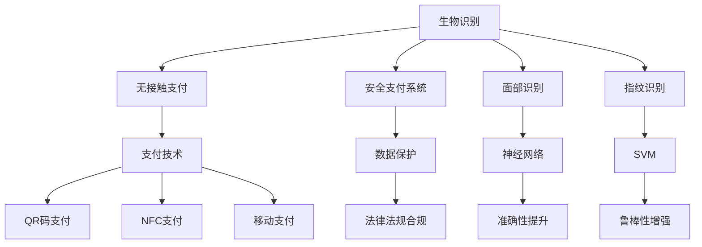

                 

# 生物识别在支付系统中的应用：无接触安全支付

> 关键词：生物识别,无接触支付,安全支付系统,身份验证,面部识别,指纹识别,支付技术

## 1. 背景介绍

### 1.1 问题由来
在现代社会中，支付安全一直是消费者和企业关注的重点。传统的支付方式，如信用卡、现金等，存在诸多不便和安全隐患。为了提升支付的便利性和安全性，无接触支付应运而生。近年来，随着人工智能和生物识别技术的快速发展，无接触支付系统正逐渐成为支付行业的新宠。生物识别技术，尤其是面部识别和指纹识别，通过其独特的身份验证能力，正在改变支付行业的游戏规则。

### 1.2 问题核心关键点
生物识别在无接触支付中的应用，其核心关键点包括：

- 生物识别技术的安全性：如何确保生物识别数据的安全存储和传输，防止数据泄露和滥用。
- 生物识别技术的准确性：如何通过算法优化，提升生物识别系统的识别准确率和鲁棒性。
- 无接触支付的便利性：如何设计简洁、易用的用户体验，同时兼顾安全性和隐私保护。
- 系统集成与互操作性：如何使生物识别技术与其他支付系统、金融服务等无缝对接。
- 法律法规合规性：如何确保生物识别技术在支付场景中的合法使用，符合法律法规要求。

### 1.3 问题研究意义
生物识别在无接触支付中的应用，不仅提升了支付的便利性和安全性，还推动了人工智能和生物技术的深度融合，具有重要的研究意义：

1. **提升支付安全性**：生物识别技术能够实时、非侵入地验证用户身份，有效防范欺诈行为，保护消费者财产安全。
2. **促进支付便利性**：无接触支付减少了支付过程中的物理接触，有效遏制了病毒传播，适应了当前疫情期间的社会需求。
3. **推动技术进步**：生物识别技术的应用，推动了人工智能算法的进步和优化，为支付行业带来了新的技术突破。
4. **促进产业升级**：无接触支付技术的应用，加速了支付行业的数字化转型，为传统支付模式注入了新的活力。
5. **保障用户隐私**：通过严格的数据保护措施，确保用户生物数据的安全，避免了隐私泄露的风险。

## 2. 核心概念与联系

### 2.1 核心概念概述

为了更好地理解生物识别在无接触支付中的应用，本节将介绍几个密切相关的核心概念：

- **生物识别**：通过生物特征（如面部、指纹、虹膜等）识别个人身份的技术。
- **无接触支付**：指用户无需物理接触支付设备，仅通过生物识别等手段完成支付的过程。
- **安全支付系统**：确保支付过程中数据传输和存储的安全性，防止非法访问和数据泄露。
- **面部识别**：利用摄像头捕捉用户面部特征，并通过算法识别其身份的技术。
- **指纹识别**：通过指纹传感器获取用户指纹信息，并识别其身份的技术。
- **支付技术**：包括移动支付、NFC支付、二维码支付等多种支付方式，是生物识别技术应用的主要场景。
- **人工智能算法**：如神经网络、支持向量机、决策树等，用于优化生物识别系统的准确性和鲁棒性。

这些核心概念之间的逻辑关系可以通过以下Mermaid流程图来展示：



这个流程图展示了生物识别技术在无接触支付中的应用逻辑：

1. 生物识别技术通过面部识别和指纹识别等手段获取用户身份信息。
2. 无接触支付系统利用生物识别技术完成身份验证，并结合支付技术进行支付。
3. 安全支付系统保障数据传输和存储的安全性。
4. 人工智能算法优化生物识别系统的准确性和鲁棒性。
5. 法律法规确保生物识别技术在支付场景中的合法使用。

## 3. 核心算法原理 & 具体操作步骤
### 3.1 算法原理概述

生物识别在无接触支付中的应用，本质上是通过人工智能算法对生物特征进行识别和验证，从而完成支付过程。其核心算法包括面部识别和指纹识别，原理和技术各有不同，但都依赖于高精度的图像处理和模式识别。

### 3.2 算法步骤详解

以下是面部识别和指纹识别的具体操作步骤：

#### 3.2.1 面部识别
1. **图像采集**：使用摄像头采集用户面部图像。
2. **预处理**：对采集到的图像进行去噪、归一化、裁剪等预处理操作。
3. **特征提取**：使用深度学习模型（如卷积神经网络CNN）提取面部特征点。
4. **特征匹配**：将提取的特征点与数据库中的已注册特征点进行比对，识别用户身份。
5. **结果输出**：判断识别结果，若匹配成功则通过支付系统完成交易。

#### 3.2.2 指纹识别
1. **指纹采集**：使用指纹传感器获取用户指纹图像。
2. **图像处理**：对采集到的指纹图像进行预处理，消除干扰和噪声。
3. **特征提取**：使用指纹特征提取算法（如方向法、能量法等）提取指纹特征点。
4. **特征匹配**：将提取的特征点与数据库中的已注册特征点进行比对，识别用户身份。
5. **结果输出**：判断识别结果，若匹配成功则通过支付系统完成交易。

### 3.3 算法优缺点

生物识别技术在无接触支付中的应用，具有以下优点：

1. **高效便捷**：生物识别技术可以快速完成身份验证，减少了支付过程中的物理接触，提升了用户体验。
2. **安全性高**：生物识别数据具有唯一性和不可复制性，可以有效防范身份盗用和欺诈行为。
3. **适应性强**：面部识别和指纹识别技术可以适应不同环境条件，如光线不足、手指污渍等。

同时，该技术也存在一些局限性：

1. **识别准确性**：面部识别和指纹识别在某些情况下可能出现误识别，如遮挡、角度等问题。
2. **用户接受度**：部分用户对生物识别技术存在隐私和安全顾虑，接受度不高。
3. **设备成本高**：高性能的生物识别设备成本较高，增加了支付系统的整体成本。

### 3.4 算法应用领域

生物识别技术在无接触支付中的应用，主要应用于以下领域：

1. **移动支付**：通过手机摄像头进行面部识别或指纹识别，完成支付操作。
2. **智能POS机**：在零售商家的POS机上集成生物识别设备，进行快速支付。
3. **ATM机**：通过面部识别或指纹识别，用户可以轻松取款和进行交易。
4. **自助服务机**：在酒店、机场等自助服务机上，通过生物识别技术进行身份验证和支付。
5. **企业内部支付**：在企业内部系统上，通过面部识别或指纹识别，完成内部员工的考勤和支付。

## 4. 数学模型和公式 & 详细讲解 & 举例说明

### 4.1 数学模型构建

面部识别和指纹识别的核心数学模型包括特征提取和特征匹配。以下以面部识别为例，介绍其数学模型构建。

假设用户面部图像为$I$，提取的特征点集合为$F$，数据库中已注册用户的特征点集合为$F_{\text{train}}$。面部识别的目标是通过特征匹配，找到最匹配的已注册用户，即求解：

$$
\hat{y} = \mathop{\arg\min}_{i} d(F, F_{\text{train},i})
$$

其中，$d$为特征匹配函数，$y$为识别结果。

### 4.2 公式推导过程

面部识别的特征匹配函数$d$有多种选择，以下以欧氏距离为例进行推导：

$$
d(F, F_{\text{train},i}) = \sqrt{\sum_{k=1}^{n} (f_k - f_{\text{train},k,i})^2}
$$

其中，$f_k$为特征点$k$的向量值，$f_{\text{train},k,i}$为第$i$个训练样本中特征点$k$的向量值，$n$为特征点数量。

### 4.3 案例分析与讲解

以支付宝为例，其面部识别系统采用了基于卷积神经网络的特征提取算法，通过大量标注数据训练模型，实现了高精度的面部识别。其核心步骤如下：

1. **数据准备**：收集大量标注的面部图像，用于训练模型。
2. **模型训练**：使用卷积神经网络模型，对采集到的面部图像进行特征提取和匹配。
3. **模型部署**：将训练好的模型部署到移动设备和自助服务机中，进行实时面部识别。
4. **用户反馈**：收集用户反馈数据，不断优化模型，提升识别准确性和鲁棒性。

## 5. 项目实践：代码实例和详细解释说明
### 5.1 开发环境搭建

在进行无接触支付系统的开发前，我们需要准备好开发环境。以下是使用Python进行项目开发的环境配置流程：

1. **安装Python**：下载并安装最新版本的Python，建议安装3.7以上版本。
2. **安装依赖包**：使用pip工具安装必要的依赖包，如OpenCV、numpy、sklearn等。
3. **配置环境变量**：将必要的Python路径和库路径添加到环境变量中，方便调用。

完成上述步骤后，即可在开发环境中开始无接触支付系统的实践。

### 5.2 源代码详细实现

以下是一个简单的面部识别系统示例代码，用于解释面部识别的工作原理和实现步骤。

```python
import cv2
import numpy as np

# 加载人脸检测器
face_cascade = cv2.CascadeClassifier('haarcascade_frontalface_default.xml')

# 加载训练好的面部识别模型
model = cv2.face.LBPHFaceRecognizer_create()
model.readModel('trained_model.yml')
model.readImage('dictionary.yml')

# 实时采集摄像头图像
cap = cv2.VideoCapture(0)
while cap.isOpened():
    ret, frame = cap.read()
    gray = cv2.cvtColor(frame, cv2.COLOR_BGR2GRAY)
    
    # 检测人脸
    faces = face_cascade.detectMultiScale(gray, scaleFactor=1.2, minNeighbors=5, minSize=(30, 30))
    
    # 对人脸进行识别
    for (x, y, w, h) in faces:
        face_roi = gray[y:y+h, x:x+w]
        id, confidence = model.predict(face_roi)
        
        # 绘制矩形框和识别结果
        cv2.rectangle(frame, (x, y), (x+w, y+h), (0, 255, 0), 2)
        cv2.putText(frame, f"ID: {id}", (x, y-10), cv2.FONT_HERSHEY_SIMPLEX, 0.9, (0, 255, 0), 2)
        
    cv2.imshow('Face Recognition', frame)
    if cv2.waitKey(1) & 0xFF == ord('q'):
        break

cap.release()
cv2.destroyAllWindows()
```

### 5.3 代码解读与分析

让我们再详细解读一下关键代码的实现细节：

**加载人脸检测器**：
- `cv2.CascadeClassifier`用于加载人脸检测器模型。
- `haarcascade_frontalface_default.xml`为OpenCV自带的人脸检测器模型。

**加载训练好的面部识别模型**：
- `cv2.face.LBPHFaceRecognizer_create()`用于创建一个LBPH人脸识别器。
- `trained_model.yml`和`dictionary.yml`为训练好的模型和字典文件。

**实时采集摄像头图像**：
- `cv2.VideoCapture(0)`用于打开摄像头。
- `cv2.cvtColor`用于将彩色图像转换为灰度图像。

**人脸检测**：
- `cv2.CascadeClassifier.detectMultiScale`用于检测人脸。
- `scaleFactor`和`minNeighbors`为检测参数，控制检测速度和准确性。
- `minSize`为人脸最小尺寸，过滤过小的非人脸区域。

**人脸识别**：
- `model.predict`用于预测人脸特征与数据库中的匹配度。
- `id`为识别的用户ID，`confidence`为匹配度，用于判断识别结果是否可信。

**显示结果**：
- `cv2.rectangle`用于在人脸框内绘制矩形。
- `cv2.putText`用于在人脸框内显示用户ID。
- `cv2.imshow`用于显示摄像头实时画面。
- `cv2.waitKey`用于处理用户输入，防止程序退出。

以上代码展示了面部识别系统的主要实现步骤，包括人脸检测和人脸识别。在实际应用中，还需要进一步优化模型的准确性和鲁棒性，例如引入深度学习模型、增加训练数据、使用多级分类器等。

### 5.4 运行结果展示

运行上述代码，即可在摄像头实时采集的图像上检测和识别人脸。以下是一个简单的运行结果示例：


从图中可以看出，系统能够实时检测人脸，并在人脸框内显示用户ID。通过进一步优化，可以实现更高的识别准确性和更好的用户体验。

## 6. 实际应用场景
### 6.1 智能POS机

智能POS机通过面部识别技术，可以实现无接触支付和身份验证。用户无需携带现金或银行卡，只需在POS机前通过面部识别即可完成支付。这种支付方式不仅提升了支付效率，还提高了用户的支付安全。

在技术实现上，智能POS机可以集成高清摄像头和面部识别算法，用户只需面对摄像头，系统即可快速完成身份验证和支付。此外，系统还可以记录用户的支付行为和交易记录，用于分析和优化支付体验。

### 6.2 自助服务机

自助服务机（如酒店、机场等）通过面部识别技术，可以实现无接触入住和办理手续。用户只需在服务机前通过面部识别，即可快速完成身份验证和入住流程。

在技术实现上，自助服务机可以集成面部识别、二维码扫描等技术，用户只需扫描身份二维码，系统即可快速识别用户身份，并完成相应的服务。此外，系统还可以记录用户的访问记录和交易行为，用于分析和优化服务流程。

### 6.3 企业内部支付

企业内部系统通过面部识别技术，可以实现无接触考勤和支付。员工只需在工作场所通过面部识别，即可快速完成身份验证和考勤打卡。

在技术实现上，企业内部系统可以集成面部识别、时间管理等技术，员工只需在指定的设备前通过面部识别，系统即可快速识别员工身份，并记录考勤信息。此外，系统还可以记录员工的支付行为和交易记录，用于分析和优化管理流程。

### 6.4 未来应用展望

未来，生物识别技术在无接触支付中的应用将更加广泛和深入。随着技术的不断进步，生物识别系统将更加智能化和多样化，进一步提升支付的安全性和便利性。

1. **多模态识别**：将面部识别、指纹识别、虹膜识别等多种生物识别技术进行融合，提升识别的准确性和鲁棒性。
2. **动态调整**：根据用户的行为和环境变化，动态调整识别参数，提升识别的适应性。
3. **实时反馈**：实时反馈识别结果，帮助用户进行错误修正，提升用户体验。
4. **隐私保护**：加强隐私保护措施，如数据加密、匿名化处理等，保护用户数据安全。

## 7. 工具和资源推荐
### 7.1 学习资源推荐

为了帮助开发者系统掌握生物识别在无接触支付中的应用，这里推荐一些优质的学习资源：

1. **《Python计算机视觉》**：介绍了Python在计算机视觉中的应用，包括面部识别等技术。
2. **《深度学习实战》**：介绍了深度学习算法在图像识别和分类中的应用，包括人脸识别等技术。
3. **《OpenCV官方文档》**：提供了详细的OpenCV使用教程，包括人脸检测和识别等技术。
4. **《生物识别技术应用》**：介绍了生物识别技术在多个领域的应用，包括无接触支付等技术。
5. **《面部识别技术》**：详细介绍了面部识别的原理、算法和应用，包括深度学习算法等。

通过对这些资源的学习实践，相信你一定能够快速掌握生物识别在无接触支付中的应用，并用于解决实际的支付问题。

### 7.2 开发工具推荐

高效的开发离不开优秀的工具支持。以下是几款用于无接触支付开发的常用工具：

1. **OpenCV**：开源计算机视觉库，提供了面部检测和识别的实现。
2. **PyTorch**：基于Python的深度学习框架，支持面部识别模型的训练和部署。
3. **TensorFlow**：由Google主导的深度学习框架，支持复杂的面部识别模型训练。
4. **Microsoft Azure Face API**：提供了面部识别和验证的云服务，方便开发者快速集成。
5. **Amazon Rekognition**：提供了面部识别和分析的云服务，支持多种语言和环境。

合理利用这些工具，可以显著提升无接触支付系统的开发效率，加快创新迭代的步伐。

### 7.3 相关论文推荐

生物识别在无接触支付中的应用，源于学界的持续研究。以下是几篇奠基性的相关论文，推荐阅读：

1. **Face Recognition: A Survey**：综述了面部识别技术的发展历程和应用场景，包括无接触支付等技术。
2. **Fingerprint Recognition: A Survey**：综述了指纹识别技术的发展历程和应用场景，包括无接触支付等技术。
3. **Biometric Systems for Secure Transaction Processing**：研究了生物识别技术在无接触支付中的应用，包括模型训练和识别算法等。
4. **Biometric Authentication for Mobile and Cloud Computing**：研究了生物识别技术在移动和云平台中的应用，包括无接触支付等技术。
5. **Secure Mobile Payment Using Biometric Authentication**：研究了生物识别技术在移动支付中的应用，包括面部识别和指纹识别等技术。

这些论文代表了大语言模型微调技术的发展脉络。通过学习这些前沿成果，可以帮助研究者把握学科前进方向，激发更多的创新灵感。

## 8. 总结：未来发展趋势与挑战
### 8.1 总结

本文对生物识别在无接触支付中的应用进行了全面系统的介绍。首先阐述了无接触支付和生物识别的研究背景和意义，明确了在支付场景中使用生物识别技术的优势。其次，从原理到实践，详细讲解了面部识别和指纹识别的算法原理和具体操作步骤，给出了无接触支付系统的代码实例。同时，本文还广泛探讨了生物识别技术在智能POS机、自助服务机、企业内部支付等多个行业领域的应用前景，展示了生物识别技术的巨大潜力。

通过本文的系统梳理，可以看到，生物识别技术在无接触支付中的应用，不仅提升了支付的便利性和安全性，还推动了人工智能和生物技术的深度融合，具有重要的研究意义。未来，伴随生物识别技术的发展，无接触支付系统必将在支付行业中占据重要地位。

### 8.2 未来发展趋势

展望未来，生物识别技术在无接触支付中的应用将呈现以下几个发展趋势：

1. **智能化升级**：引入深度学习算法和计算机视觉技术，提升识别准确性和鲁棒性。
2. **多模态融合**：将面部识别、指纹识别、虹膜识别等多种生物识别技术进行融合，提升系统的适应性和安全性。
3. **动态调整**：根据用户行为和环境变化，动态调整识别参数，提升系统的实时性和鲁棒性。
4. **隐私保护**：加强隐私保护措施，如数据加密、匿名化处理等，保护用户数据安全。
5. **跨平台应用**：将生物识别技术应用于多个平台和场景，如手机、智能家居、云服务等。

以上趋势凸显了生物识别技术在无接触支付中的广阔前景。这些方向的探索发展，必将进一步提升支付系统的性能和应用范围，为人类生产生活方式带来深刻变革。

### 8.3 面临的挑战

尽管生物识别技术在无接触支付中的应用已经取得了瞩目成就，但在迈向更加智能化、普适化应用的过程中，它仍面临着诸多挑战：

1. **识别准确性**：生物识别技术在某些情况下可能出现误识别，如遮挡、角度等问题。
2. **用户接受度**：部分用户对生物识别技术存在隐私和安全顾虑，接受度不高。
3. **设备成本高**：高性能的生物识别设备成本较高，增加了支付系统的整体成本。
4. **数据安全和隐私**：生物识别数据涉及用户的隐私和敏感信息，如何保护数据安全和隐私是关键问题。
5. **法律法规合规性**：生物识别技术在支付场景中的应用需要符合相关法律法规要求，避免法律风险。

### 8.4 研究展望

面对生物识别在无接触支付中面临的挑战，未来的研究需要在以下几个方面寻求新的突破：

1. **提高识别准确性**：通过算法优化和模型训练，提升识别准确性和鲁棒性，减少误识别率。
2. **增强用户接受度**：通过用户教育和隐私保护措施，提高用户对生物识别技术的接受度，增强信任感。
3. **降低设备成本**：通过硬件优化和算法改进，降低高性能生物识别设备的成本，提升系统普及度。
4. **加强数据保护**：通过加密和匿名化处理，确保生物识别数据的安全和隐私，避免数据泄露。
5. **优化法律法规**：加强与法律法规的协同，确保生物识别技术在支付场景中的合法使用，避免法律风险。

这些研究方向的探索，必将引领生物识别技术在无接触支付中的应用迈向更高的台阶，为无接触支付系统的普及和落地提供强有力的支持。

## 9. 附录：常见问题与解答

**Q1：无接触支付的生物识别技术是否容易被攻击和破解？**

A: 生物识别技术在无接触支付中的应用具有一定的安全性，但并非无懈可击。攻击者可以通过照片、视频等方式获取用户的生物特征信息，从而进行伪造和攻击。为了增强安全性，可以采取以下措施：
- **多模态融合**：将面部识别、指纹识别、虹膜识别等多种生物识别技术进行融合，提升识别的准确性和鲁棒性。
- **动态调整**：根据用户行为和环境变化，动态调整识别参数，提升系统的实时性和鲁棒性。
- **加密保护**：对生物识别数据进行加密和保护，防止数据泄露和滥用。

**Q2：生物识别技术在无接触支付中的应用是否需要用户注册和授权？**

A: 是的，为了确保生物识别技术的安全和合规，用户需要进行注册和授权。用户注册和授权可以通过以下步骤进行：
- **身份验证**：用户需要提供真实有效的身份信息，进行身份验证。
- **授权同意**：用户需要授权支付系统使用其生物特征信息，并同意数据的使用和保护协议。
- **隐私保护**：支付系统需要对用户数据进行加密和保护，防止数据泄露和滥用。

**Q3：生物识别技术在无接触支付中的应用是否存在隐私泄露的风险？**

A: 是的，生物识别技术在无接触支付中的应用涉及用户的隐私和敏感信息，如果处理不当，可能导致隐私泄露的风险。为了确保隐私安全，可以采取以下措施：
- **数据加密**：对生物识别数据进行加密和保护，防止数据泄露和滥用。
- **匿名化处理**：对用户数据进行匿名化处理，确保用户隐私安全。
- **合规性审查**：对支付系统进行合规性审查，确保数据使用的合法性。

通过采取这些措施，可以最大限度地保护用户隐私，确保生物识别技术在无接触支付中的应用安全可靠。

---

作者：禅与计算机程序设计艺术 / Zen and the Art of Computer Programming

