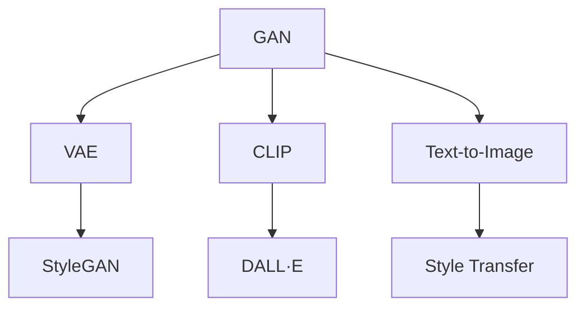

                 

# 用户对AIGC的使用现状

## 1. 背景介绍

随着人工智能技术的飞速发展，AI生成的内容（AIGC，AI Generated Content）在各个领域逐渐崭露头角。从文本生成到图像生成，从视频生成到音频生成，AIGC的应用遍及娱乐、新闻、教育、广告等多个行业。本文将探讨用户对AIGC的使用现状，包括AIGC的主要应用场景、用户需求、面临的挑战以及未来发展趋势。

## 2. 核心概念与联系

### 2.1 核心概念概述

为了更好地理解AIGC的使用现状，我们首先定义一些核心概念：

- **AIGC (AI Generated Content)**：指通过人工智能技术自动生成的文本、图像、视频、音频等内容，用于各种应用场景，如新闻报道、创意写作、艺术创作等。
- **GAN (Generative Adversarial Networks)**：一种生成模型，由生成器和判别器两个神经网络组成，通过对抗训练生成高质量的伪造图像或视频。
- **VAE (Variational Autoencoder)**：一种生成模型，通过学习数据的隐空间分布生成新的样本，常用于图像生成和去噪。
- **CLIP (Contrastive Language-Image Pre-training)**：一种通过对比学习训练的跨模态模型，能够同时生成高质量的图像和文本。
- **DALL·E (DALL-E)**：由OpenAI开发的图像生成模型，能够根据自然语言描述生成逼真图像。
- **StyleGAN (Style Generative Adversarial Network)**：一种生成模型，通过学习风格的约束生成风格化的图像。

这些核心概念之间通过以下Mermaid流程图进行了联系展示：



这个流程图展示了从基本的GAN模型到更高级的CLIP、DALL·E和StyleGAN等模型，以及它们在图像生成、文本生成和风格迁移等应用中的联系和演进。

## 3. 核心算法原理 & 具体操作步骤

### 3.1 算法原理概述

AIGC的生成过程通常分为两个步骤：预训练和微调。预训练阶段，模型在大规模数据上学习生成能力，微调阶段根据具体任务调整模型参数，使其生成满足要求的内容。

### 3.2 算法步骤详解

#### 3.2.1 预训练阶段

1. **数据收集**：收集大量标注或未标注数据，用于训练生成模型。
2. **模型选择**：选择合适的生成模型（如GAN、VAE、CLIP等）。
3. **训练**：在大量数据上进行无监督训练，学习生成分布。
4. **评估**：评估模型生成内容的真实性和多样性。

#### 3.2.2 微调阶段

1. **任务适配**：根据具体应用场景，设计任务适配层，如文本生成模型增加长度约束，图像生成模型增加样式约束。
2. **优化器选择**：选择合适的优化器（如Adam、SGD等）和超参数（如学习率、批大小等）。
3. **训练**：在有监督数据上进行微调，优化模型参数。
4. **评估**：在验证集和测试集上评估模型性能，调整超参数和模型结构。

### 3.3 算法优缺点

AIGC的优势在于其高效、快速、可定制性强，可以生成高质量的内容，满足各种应用需求。然而，也存在以下缺点：

- **缺乏创造性**：尽管AIGC生成的内容质量高，但往往缺乏独特的创造性，可能存在一定的模式化和重复性。
- **依赖训练数据**：模型的生成能力高度依赖于训练数据的数量和质量，训练数据不足可能导致模型效果不佳。
- **偏见和伦理问题**：AIGC可能继承训练数据的偏见，生成带有性别、种族等歧视性的内容，需要严格控制和审核。
- **版权和法律问题**：AIGC生成的内容可能涉及版权和法律问题，需要明确其权利归属和使用方法。

### 3.4 算法应用领域

AIGC的应用领域非常广泛，包括但不限于：

- **内容创作**：自动生成新闻、文章、博客、广告文案等。
- **艺术创作**：生成绘画、音乐、动画等艺术作品。
- **娱乐**：生成虚拟角色、游戏场景、电影片段等。
- **教育**：生成教育资料、练习题、模拟实验等。
- **健康**：生成医学图像、虚拟助手等。

## 4. 数学模型和公式 & 详细讲解 & 举例说明

### 4.1 数学模型构建

AIGC的生成模型通常基于深度学习架构，如GAN、VAE等。这里以GAN为例，介绍其数学模型构建过程：

设生成器和判别器分别为 $G$ 和 $D$，输入噪声向量 $z$，生成器生成图像 $x$ 的公式为：

$$
x = G(z)
$$

判别器 $D$ 判断图像 $x$ 是否为真实图像的概率为：

$$
p(x|real) = D(x)
$$

判别器 $D$ 判断图像 $x$ 为生成图像的概率为：

$$
p(x|fake) = 1 - D(G(z))
$$

模型训练的目标是最小化以下交叉熵损失函数：

$$
\mathcal{L} = \mathbb{E}_{x \sim p_{data}} [log(D(x))] + \mathbb{E}_{z \sim p(z)} [log(1 - D(G(z)))]
$$

### 4.2 公式推导过程

GAN模型的训练过程包含两个损失函数，即生成器的损失函数和判别器的损失函数：

生成器的损失函数为：

$$
\mathcal{L}_G = -\mathbb{E}_{z \sim p(z)} [log(D(G(z)))]
$$

判别器的损失函数为：

$$
\mathcal{L}_D = \mathbb{E}_{x \sim p_{data}} [log(D(x))] + \mathbb{E}_{z \sim p(z)} [log(1 - D(G(z)))]
$$

通过对抗训练，生成器和判别器互相博弈，最终生成器能够生成逼真的图像，判别器无法区分真伪。

### 4.3 案例分析与讲解

以DALL·E为例，其生成过程包括：

1. **输入文本**：用户提供自然语言描述，如“一只可爱的小猫在花园里玩耍”。
2. **编码器**：将文本编码成隐空间向量。
3. **解码器**：将隐空间向量解码成图像。
4. **训练过程**：在大量图像和文本对上进行对比学习，学习生成高质量的图像。
5. **生成图像**：使用训练好的模型生成逼真的图像。

DALL·E的成功在于其强大的文本编码和图像生成能力，通过对比学习训练，能够生成高质量、逼真的图像。

## 5. 项目实践：代码实例和详细解释说明

### 5.1 开发环境搭建

开发AIGC应用通常需要以下开发环境：

- **Python**：用于编写代码和运行模型。
- **PyTorch**：深度学习框架，支持GPU加速。
- **TensorFlow**：另一个深度学习框架，支持分布式训练和推理。
- **OpenAI API**：使用OpenAI的DALL·E模型生成图像。
- **Jupyter Notebook**：交互式编程环境，便于调试和展示。

### 5.2 源代码详细实现

以下是一个简单的文本生成代码示例，使用GAN模型生成文本：

```python
import torch
import torch.nn as nn
import torch.optim as optim
from torch.utils.data import DataLoader
from torchvision.datasets import ImageFolder
from torchvision.transforms import ToTensor

# 定义生成器
class Generator(nn.Module):
    def __init__(self):
        super(Generator, self).__init__()
        self.fc1 = nn.Linear(100, 128)
        self.fc2 = nn.Linear(128, 784)
        self.fc3 = nn.Linear(784, 784)

    def forward(self, x):
        x = self.fc1(x)
        x = self.fc2(x)
        x = self.fc3(x)
        x = x.view(-1, 28, 28)
        return x

# 定义判别器
class Discriminator(nn.Module):
    def __init__(self):
        super(Discriminator, self).__init__()
        self.fc1 = nn.Linear(784, 128)
        self.fc2 = nn.Linear(128, 1)

    def forward(self, x):
        x = self.fc1(x)
        x = self.fc2(x)
        return x

# 定义损失函数
criterion = nn.BCELoss()

# 加载数据集
train_data = ImageFolder(root='data/train', transform=ToTensor())
train_loader = DataLoader(train_data, batch_size=64, shuffle=True)

# 定义模型和优化器
G = Generator()
D = Discriminator()
G_optimizer = optim.Adam(G.parameters(), lr=0.0002)
D_optimizer = optim.Adam(D.parameters(), lr=0.0002)

# 训练过程
for epoch in range(1000):
    for i, (real_images, _) in enumerate(train_loader):
        real_images = real_images.to(device)
        
        # 生成器训练
        G_optimizer.zero_grad()
        fake_images = G(z)
        D_real_loss = criterion(D(real_images), torch.ones_like(D(real_images)))
        D_fake_loss = criterion(D(fake_images), torch.zeros_like(D(fake_images)))
        D_loss = D_real_loss + D_fake_loss
        G_loss = D_fake_loss
        D_loss.backward()
        G_loss.backward()
        G_optimizer.step()
        D_optimizer.step()
        
        # 判别器训练
        D_optimizer.zero_grad()
        real_images = real_images.to(device)
        fake_images = G(z)
        D_real_loss = criterion(D(real_images), torch.ones_like(D(real_images)))
        D_fake_loss = criterion(D(fake_images), torch.zeros_like(D(fake_images)))
        D_loss = D_real_loss + D_fake_loss
        D_loss.backward()
        D_optimizer.step()
```

### 5.3 代码解读与分析

在上述代码中，我们使用PyTorch实现了GAN模型，并使用Adam优化器进行训练。训练过程包括生成器和判别器的交替训练，分别计算损失函数，并反向传播更新模型参数。最终生成高质量的图像。

### 5.4 运行结果展示

训练完成后，使用生成器生成新的图像，并展示其效果。

```python
import matplotlib.pyplot as plt

fig, axes = plt.subplots(4, 4, figsize=(10, 10))
for i, ax in enumerate(axes.flatten()):
    ax.imshow(G(z)[i].numpy().squeeze())
    ax.axis('off')
plt.show()
```

## 6. 实际应用场景

### 6.1 内容创作

AIGC在内容创作领域有广泛应用，如：

- **新闻自动生成**：根据新闻事件自动生成报道。
- **广告文案创作**：生成有创意的广告语，提高广告效果。
- **博客文章**：自动生成文章内容，加速内容创作。

### 6.2 艺术创作

AIGC在艺术创作领域也有重要应用，如：

- **虚拟艺术作品**：生成绘画、雕塑、音乐等艺术作品。
- **动画制作**：生成角色、场景等动画元素。

### 6.3 娱乐

AIGC在娱乐领域有广泛应用，如：

- **虚拟角色**：生成虚拟角色，用于游戏、电影等。
- **虚拟场景**：生成虚拟场景，用于虚拟旅游、虚拟培训等。

### 6.4 教育

AIGC在教育领域也有重要应用，如：

- **模拟实验**：生成虚拟实验场景，进行科学实验。
- **语言学习**：生成语言学习材料，如单词、句子等。

## 7. 工具和资源推荐

### 7.1 学习资源推荐

为了掌握AIGC的原理和技术，建议学习以下资源：

- **深度学习课程**：如《深度学习》（Ian Goodfellow著）、《神经网络与深度学习》（Michael Nielsen著）。
- **生成对抗网络**：如《Generative Adversarial Networks》（Ian Goodfellow著）。
- **TensorFlow官方文档**：TensorFlow官网提供了详尽的API文档和教程，帮助开发者快速上手。
- **PyTorch官方文档**：PyTorch官网提供了详尽的API文档和教程，帮助开发者快速上手。
- **OpenAI API**：OpenAI提供了丰富的API接口，可以方便地使用DALL·E、CLIP等模型。

### 7.2 开发工具推荐

以下是一些常用的AIGC开发工具：

- **Jupyter Notebook**：交互式编程环境，便于调试和展示。
- **TensorFlow**：深度学习框架，支持分布式训练和推理。
- **PyTorch**：深度学习框架，支持GPU加速。
- **Keras**：高层次API，支持多种深度学习框架。
- **Hugging Face Transformers**：自然语言处理库，包含多种预训练模型和工具。

### 7.3 相关论文推荐

为了深入了解AIGC的研究进展，建议阅读以下论文：

- **Generative Adversarial Nets**（Ian Goodfellow等人）。
- **Image-to-Image Translation with Conditional Adversarial Networks**（Isola等人）。
- **A Style-Based Generator Architecture for Generative Adversarial Networks**（Karras等人）。
- **Language-Image Pre-training with Contrastive Predictions**（Li等人）。

## 8. 总结：未来发展趋势与挑战

### 8.1 未来发展趋势

未来，AIGC将面临以下几个趋势：

- **更高效、更强大的生成模型**：随着计算资源的增加，生成模型将变得更加高效和强大，能够生成更加多样、高质量的内容。
- **跨模态生成**：AIGC将更加注重跨模态生成，能够生成文本、图像、音频等多种形式的内容。
- **实时生成**：AIGC将更加注重实时生成，能够根据用户输入实时生成内容，提高用户体验。
- **情感生成**：AIGC将更加注重情感生成，能够根据用户情感生成相应内容，提高互动效果。

### 8.2 面临的挑战

尽管AIGC有广泛的应用前景，但也面临以下几个挑战：

- **伦理问题**：AIGC可能生成有害、不真实的内容，需要严格控制和审核。
- **版权问题**：AIGC生成的内容可能涉及版权和法律问题，需要明确其权利归属和使用方式。
- **数据隐私**：AIGC需要大量数据进行训练，如何保护用户隐私是一个重要问题。
- **计算资源**：AIGC需要大量计算资源进行训练和推理，如何优化计算效率是一个重要问题。

### 8.3 研究展望

为了应对上述挑战，未来的研究可以从以下几个方向进行：

- **生成模型的改进**：研究更高效、更强大的生成模型，提高生成质量和多样性。
- **跨模态生成**：研究跨模态生成技术，实现文本、图像、音频等多种形式内容的生成。
- **实时生成**：研究实时生成技术，实现用户输入实时生成内容。
- **情感生成**：研究情感生成技术，根据用户情感生成相应内容。
- **伦理和隐私保护**：研究伦理和隐私保护技术，确保生成内容的健康、合法和隐私安全。

## 9. 附录：常见问题与解答

### Q1：AIGC能否生成高质量的内容？

A：AIGC可以生成高质量的内容，但需要足够的训练数据和合适的模型架构。生成的内容是否高质量取决于训练数据的质量和模型的训练效果。

### Q2：AIGC生成的内容是否真实？

A：AIGC生成的内容通常是逼真的，但并不总是真实的。生成的内容需要结合实际应用场景进行审核和验证。

### Q3：AIGC生成的内容是否需要标注数据？

A：AIGC的生成能力主要依赖于预训练数据，而非标注数据。标注数据主要用于微调和优化生成模型，提高生成内容的准确性和多样性。

### Q4：AIGC生成的内容是否具有创造性？

A：AIGC生成的内容通常是基于已有数据的生成，具有一定的模式化和重复性。但随着生成模型能力的提升，生成的内容将更加具有创造性。

### Q5：AIGC的应用前景如何？

A：AIGC在内容创作、艺术创作、娱乐、教育等多个领域有广泛应用前景，能够提高效率、降低成本、增强互动性。

---

作者：禅与计算机程序设计艺术 / Zen and the Art of Computer Programming

