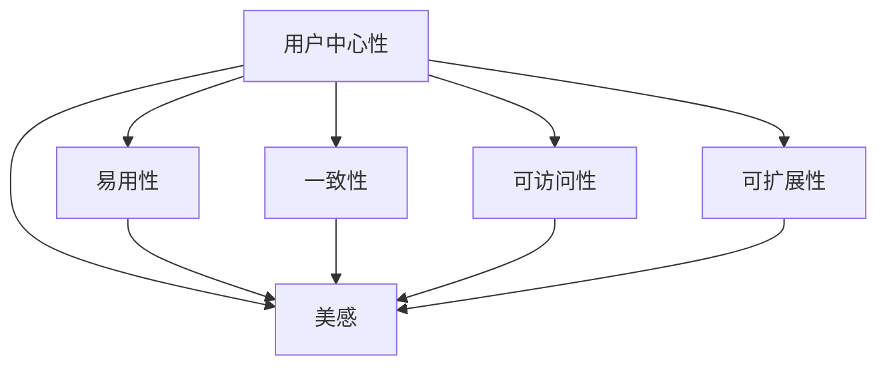

                 

# 用户界面设计：打造友好易用的人机交互

## 1. 背景介绍

### 1.1 问题由来

在数字化和信息化飞速发展的今天，人机交互（Human-Computer Interaction, HCI）已经成为我们日常生活中不可或缺的一部分。无论是通过手机发送短信，还是通过电脑进行远程办公，用户界面（User Interface, UI）设计都扮演着至关重要的角色。一个好的UI设计不仅能提升用户体验，还能大幅提高工作效率和满意度。

然而，随着技术的不断进步，UI设计的复杂性也在增加。如何设计出既美观又易用的界面，成为一个越来越受关注的问题。特别是在智能设备、虚拟现实（VR）和增强现实（AR）等新兴领域，友好的UI设计显得尤为重要。

### 1.2 问题核心关键点

用户界面设计（UI Design）的核心关键点包括：

1. **用户中心性**：设计应以用户需求为核心，关注用户的心理和行为，确保设计能够提升用户体验。
2. **易用性**：界面应简洁直观，用户能够快速上手，减少学习成本。
3. **一致性**：不同界面元素和操作应保持一致，减少用户的认知负担。
4. **可访问性**：确保设计对所有用户友好，包括有视觉、听觉或其他障碍的残障用户。
5. **可扩展性**：设计应具有一定的灵活性，方便未来的扩展和更新。
6. **美感**：界面设计应具备视觉上的吸引力，提高用户对产品的第一印象。

这些关键点共同构成了UI设计的基础框架，使得设计能够既美观又实用。

### 1.3 问题研究意义

UI设计在提高用户满意度和效率方面具有重要意义：

1. **提升用户体验**：友好的UI设计可以大幅提升用户的满意度，减少用户的操作复杂度，提高用户粘性。
2. **增强产品竞争力**：在激烈的市场竞争中，优质的UI设计是产品的亮点之一，可以吸引更多的用户关注。
3. **提高效率**：直观易用的设计能够减少用户的学习成本，提升工作效率。
4. **降低开发成本**：优秀的UI设计可以减少用户在操作过程中出现的错误，降低后期维护和修复的成本。

总之，UI设计不仅是提升产品竞争力的重要手段，也是提升用户体验和效率的关键因素。

## 2. 核心概念与联系

### 2.1 核心概念概述

为更好地理解用户界面设计，我们首先需要明确几个核心概念：

- **用户中心性（User-Centered Design, UCD）**：强调在设计过程中始终以用户需求和体验为出发点，确保设计能够满足用户期望。
- **易用性（Usability）**：指界面的友好程度，即用户能够轻松地与界面进行交互，完成任务。
- **一致性（Consistency）**：确保界面元素和操作在不同场景中的表现一致，减少用户的认知负担。
- **可访问性（Accessibility）**：确保界面设计对所有用户友好，包括有视觉、听觉或其他障碍的残障用户。
- **可扩展性（Extensibility）**：设计应具有一定的灵活性，方便未来的扩展和更新。
- **美感（Aesthetics）**：界面设计应具备视觉上的吸引力，提高用户对产品的第一印象。

这些概念之间存在密切联系，共同构成了UI设计的完整框架。以下我们将通过Mermaid流程图展示这些概念之间的逻辑关系：



## 3. 核心算法原理 & 具体操作步骤

### 3.1 算法原理概述

用户界面设计（UI Design）虽然不是传统意义上的算法，但它同样遵循一定的设计原则和流程。本节将介绍UI设计的核心原理和步骤。

### 3.2 算法步骤详解

UI设计的步骤通常包括以下几个关键环节：

**Step 1: 用户研究**

- **目标用户群体**：定义目标用户群体，收集用户需求和痛点。
- **用户场景**：构建用户使用产品的典型场景，明确用户的任务和目标。
- **用户心理模型**：建立用户心理模型，理解用户的心理和行为模式。

**Step 2: 信息架构设计**

- **信息分层**：将产品功能划分为不同层次，明确信息层级关系。
- **导航设计**：设计合理的导航结构，确保用户能够快速找到所需信息。
- **交互设计**：定义界面元素和操作方式，确保用户能够轻松完成交互任务。

**Step 3: 视觉设计**

- **色彩搭配**：选择适合主题的色彩方案，确保视觉吸引力。
- **字体选择**：选择合适的字体，保证阅读舒适和信息传达清晰。
- **布局设计**：优化布局，确保界面美观和易用。

**Step 4: 原型设计与测试**

- **原型制作**：制作初步的原型，进行用户测试和反馈收集。
- **迭代优化**：根据用户反馈，不断优化和改进设计。
- **用户验证**：进行最终的用户验证，确保设计满足用户需求。

### 3.3 算法优缺点

UI设计的优点包括：

1. **提高用户满意度**：友好的设计能够提升用户的使用体验，增加用户的忠诚度。
2. **提升产品竞争力**：优质的UI设计能够吸引更多的用户关注，提升产品的市场竞争力。
3. **提高效率**：直观易用的设计能够减少用户的学习成本，提升工作效率。
4. **降低开发成本**：优秀的UI设计可以减少用户在操作过程中出现的错误，降低后期维护和修复的成本。

同时，UI设计也存在一些缺点：

1. **成本较高**：高质量的UI设计需要大量的时间和资源投入，尤其是在产品初期。
2. **复杂度高**：随着产品的不断迭代，UI设计也需要不断优化和调整，增加了设计的复杂性。
3. **依赖性强**：UI设计需要与产品功能和业务逻辑紧密结合，设计过程需要与多部门协作。

### 3.4 算法应用领域

UI设计在多个领域都有广泛应用，例如：

- **消费电子**：如手机、平板、智能家居等产品的界面设计。
- **企业软件**：如ERP、CRM、OA等系统的界面设计。
- **移动应用**：如社交媒体、电商、金融科技等应用的界面设计。
- **医疗健康**：如电子病历、远程医疗、健康管理等系统的界面设计。
- **娱乐行业**：如游戏、音乐、视频等产品的界面设计。

以上仅是UI设计应用的一部分，实际上UI设计的覆盖范围非常广泛，几乎涉及所有涉及人机交互的场景。

## 4. 数学模型和公式 & 详细讲解 & 举例说明

### 4.1 数学模型构建

UI设计的数学模型可以简单地定义为：

$$ UI = f(U, I, C, A, E) $$

其中，$U$ 表示用户需求和心理模型，$I$ 表示信息架构，$C$ 表示视觉设计，$A$ 表示可访问性，$E$ 表示可扩展性。

### 4.2 公式推导过程

为了更好地解释上述模型，我们引入一些相关的数学公式：

- **用户满意度（Satisfaction）**：
$$ S = f(U, I, C, A, E) $$

- **用户学习成本（Learning Cost）**：
$$ L = g(I, C) $$

- **操作效率（Efficiency）**：
$$ E = h(I, C, A) $$

- **用户粘性（Adherence）**：
$$ A = k(S, L, E) $$

- **开发成本（Development Cost）**：
$$ D = f(U, I, C, A, E) $$

这些公式展示了用户界面设计的多个关键指标，以及它们之间的关系。

### 4.3 案例分析与讲解

下面以一个简单的电商购物界面为例，展示UI设计的实际应用。

**Step 1: 用户研究**

- **目标用户**：主要针对18-35岁的年轻消费者。
- **用户场景**：浏览商品、选择商品、加入购物车、结账支付。
- **心理模型**：用户希望快速找到感兴趣的商品，并简化支付流程。

**Step 2: 信息架构设计**

- **信息分层**：商品分类、商品详情、购物车、支付页面。
- **导航设计**：顶部导航栏、商品分类列表、面包屑导航。
- **交互设计**：点击商品进入详情页、加入购物车、一键结账支付。

**Step 3: 视觉设计**

- **色彩搭配**：主题色为蓝色，突出产品的高品质和信赖感。
- **字体选择**：正文使用无衬线字体，标题使用粗体字体，确保阅读舒适和信息传达清晰。
- **布局设计**：商品分类和详情页使用左对齐布局，支付页面使用简洁的表单布局。

**Step 4: 原型设计与测试**

- **原型制作**：使用Sketch或Figma等工具制作初步原型。
- **用户测试**：邀请目标用户进行测试，收集反馈。
- **迭代优化**：根据用户反馈，不断优化和改进设计。

最终，通过以上步骤，设计出一个既美观又易用的电商购物界面，满足了用户的需求，提升了用户体验。

## 5. 项目实践：代码实例和详细解释说明

### 5.1 开发环境搭建

在进行UI设计项目实践时，需要一个良好的开发环境。以下是搭建开发环境的步骤：

1. **安装设计工具**：
   - **Sketch**：行业标准的UI设计工具，支持Mac平台。
   - **Figma**：云端设计工具，支持多平台协作。
   - **Adobe XD**：功能丰富的设计工具，支持Mac和Windows平台。

2. **安装原型工具**：
   - **InVision**：原型制作和协作工具，支持Mac和Windows平台。
   - **Axure**：功能强大的原型设计工具，支持Mac和Windows平台。
   - **Adobe XD Prototypes**：原型的预览和交互功能。

3. **安装代码开发工具**：
   - **Visual Studio Code**：功能强大的代码编辑器，支持前端开发。
   - **Sublime Text**：轻量级代码编辑器，适合快速原型开发。
   - **Atom**：社区驱动的代码编辑器，支持插件扩展。

### 5.2 源代码详细实现

下面以一个简单的React应用为例，展示UI设计的代码实现。

首先，安装必要的依赖：

```bash
npm install react react-dom
```

然后，创建一个简单的React组件：

```javascript
import React from 'react';

class App extends React.Component {
  constructor(props) {
    super(props);
    this.state = {
      name: '',
      age: '',
    };
  }
  
  handleChange = (e) => {
    this.setState({
      [e.target.name]: e.target.value,
    });
  }
  
  handleSubmit = (e) => {
    e.preventDefault();
    console.log(this.state);
  }
  
  render() {
    return (
      <div>
        <form onSubmit={this.handleSubmit}>
          <label>
            Name:
            <input type="text" name="name" value={this.state.name} onChange={this.handleChange} />
          </label>
          <br />
          <label>
            Age:
            <input type="number" name="age" value={this.state.age} onChange={this.handleChange} />
          </label>
          <br />
          <button type="submit">Submit</button>
        </form>
      </div>
    );
  }
}

export default App;
```

这段代码实现了一个简单的表单组件，包含两个输入框和一个提交按钮。

### 5.3 代码解读与分析

通过这段代码，我们可以看到UI设计的实现主要包括以下几个步骤：

1. **组件定义**：
   - 定义了一个名为`App`的React组件，包含了状态（state）和事件处理函数。
   - 状态用于保存用户输入的姓名和年龄。

2. **事件处理**：
   - 定义了`handleChange`函数，用于处理输入框的输入事件，更新组件的状态。
   - 定义了`handleSubmit`函数，用于处理提交事件，输出当前状态。

3. **组件渲染**：
   - 在`render`方法中，通过`form`标签和`label`标签，将用户输入的姓名和年龄显示在界面上。
   - 通过`input`标签，将输入框绑定到状态上，实现实时更新。
   - 通过`button`标签，实现提交按钮的功能。

### 5.4 运行结果展示

运行上述代码，可以得到一个简单的表单界面：

```
Name: 
Age: 
Submit
```

用户可以输入姓名和年龄，并点击提交按钮，输出当前的状态。

## 6. 实际应用场景

### 6.1 智能家居控制

智能家居控制界面设计能够提供用户友好的控制体验，使用户能够轻松地控制家中的设备。例如，通过语音助手、手机App等界面，用户可以轻松控制灯光、温度、安防等设备，提升家庭生活的智能化水平。

### 6.2 医疗健康管理

医疗健康管理界面设计能够帮助用户更好地管理健康数据，例如查看健康报告、跟踪运动数据、记录饮食等。通过友好的界面设计，用户可以轻松地完成健康数据的录入和查看，提升健康管理的便捷性和效果。

### 6.3 企业项目管理

企业项目管理界面设计能够帮助团队更好地协作和管理项目。例如，通过项目看板、任务列表、日历等界面，用户可以轻松地了解项目进展、分配任务、安排会议等，提升项目管理的效率和透明度。

### 6.4 未来应用展望

未来，随着技术的不断进步，UI设计将会有更广阔的应用场景：

1. **虚拟现实（VR）和增强现实（AR）**：VR和AR界面设计将带来全新的交互体验，例如虚拟购物、虚拟旅游等。
2. **智能穿戴设备**：智能穿戴设备的界面设计将更加注重简洁和易用，例如智能手表、智能眼镜等。
3. **自动驾驶**：自动驾驶界面设计将提供友好的驾驶体验，例如语音控制、手势识别等。
4. **智能家居**：智能家居界面设计将提升家居生活的智能化和便捷性，例如语音助手、智能音箱等。

总之，UI设计将在未来的各个领域中发挥越来越重要的作用，为人类带来更加智能和便捷的生活体验。

## 7. 工具和资源推荐

### 7.1 学习资源推荐

为了帮助开发者系统掌握UI设计理论基础和实践技巧，这里推荐一些优质的学习资源：

1. **《Don't Make Me Think》**：Steve Krug的经典书籍，介绍了UI设计的核心原则和实践技巧。
2. **Nielsen Norman Group**：全球知名的UX研究机构，提供大量的UI设计研究报告和案例分析。
3. **Smashing Magazine**：专注于UI设计的技术博客，提供丰富的设计指南和工具推荐。
4. **Awwwards**：年度设计奖评选网站，展示全球最佳UI设计案例，提供灵感来源。
5. **Udemy**：在线学习平台，提供大量的UI设计课程，涵盖从基础到高级的内容。

### 7.2 开发工具推荐

UI设计开发常用的工具包括：

1. **Sketch**：行业标准的UI设计工具，支持Mac平台，提供丰富的组件库和插件。
2. **Figma**：云端设计工具，支持多平台协作，适合团队协作设计。
3. **Adobe XD**：功能丰富的设计工具，支持Mac和Windows平台，提供原型制作和交互设计。
4. **InVision**：原型制作和协作工具，支持Mac和Windows平台，提供设计反馈和协作功能。
5. **Axure**：功能强大的原型设计工具，支持Mac和Windows平台，提供丰富的交互和动画效果。

### 7.3 相关论文推荐

UI设计领域的研究成果丰富，以下是几篇重要的相关论文：

1. **"Human-Computer Interaction: The Coming Generation" by Alan Kay**：探讨了未来人机交互的方向和趋势。
2. **"Interaction Design Foundation" by Johnny Mulenga**：介绍了UI设计的核心概念和实践方法。
3. **"Interaction Paradigms for Distributed Multi-point Computers" by Mark Weiser**：提出了多点触控技术，为未来的UI设计提供了新的思路。
4. **"Human-Computer Interaction: Theory, Process, Practice, and Education" by Bill Rogers**：系统介绍了UI设计的理论和实践。
5. **"The Human Computer Interaction Handbook" by Keith strongest**：涵盖了UI设计的各个方面，包括理论、实践和工具。

这些资源将帮助你深入了解UI设计的基本原理和前沿技术，提升UI设计的专业水平。

## 8. 总结：未来发展趋势与挑战

### 8.1 研究成果总结

UI设计在提升用户体验、提高产品竞争力、提升工作效率方面具有重要意义。经过多年的发展，UI设计已经成为一门成熟的学科，涵盖了用户研究、信息架构、视觉设计、交互设计等多个方面。

### 8.2 未来发展趋势

UI设计的未来发展趋势包括：

1. **用户中心化**：更加注重用户体验，通过用户研究、心理模型等方法，设计出符合用户需求的UI界面。
2. **移动优先**：随着移动设备的普及，移动界面设计将成为未来的主流方向。
3. **可访问性**：更加注重界面设计的可访问性，确保所有用户都能方便地使用。
4. **多模态交互**：结合语音、手势、触觉等多种交互方式，提升用户体验。
5. **智能交互**：结合人工智能技术，实现智能化的用户交互，例如语音识别、自然语言处理等。

### 8.3 面临的挑战

尽管UI设计已经取得了许多进展，但仍面临一些挑战：

1. **复杂度增加**：随着产品的不断迭代，UI设计的复杂性也在增加，需要不断优化和改进。
2. **跨平台一致性**：不同的平台和设备对UI设计的要求不同，如何设计出跨平台一致的UI界面，仍然是一个难题。
3. **设计工具的局限性**：现有的设计工具虽然功能强大，但有时也存在一些限制，需要不断探索和创新。
4. **设计师的创造力**：UI设计的创新需要设计师具备丰富的想象力和创造力，如何培养设计师的创造力，也是一个重要课题。

### 8.4 研究展望

UI设计的未来研究展望包括：

1. **增强现实（AR）和虚拟现实（VR）**：探索AR和VR界面的交互方式，提升用户体验。
2. **人工智能与UI设计**：研究AI技术在UI设计中的应用，例如自然语言处理、智能推荐等。
3. **个性化设计**：研究个性化设计的算法和模型，实现更加个性化的UI界面。
4. **可访问性和包容性**：研究可访问性和包容性设计的方法，确保所有用户都能方便地使用。
5. **跨平台一致性**：研究跨平台一致性设计的策略和工具，提升产品的可移植性。

总之，UI设计是一个不断发展和创新的领域，未来的研究将带来更多突破和创新。只有不断探索和实践，才能设计出更加友好易用的人机交互界面。

## 9. 附录：常见问题与解答

**Q1: 什么是用户中心性设计（UCD）？**

A: 用户中心性设计（UCD）是一种以用户需求和体验为核心的设计方法。UCD强调在设计过程中始终以用户需求和体验为出发点，确保设计能够满足用户期望。

**Q2: 如何在设计过程中实现一致性？**

A: 一致性是UI设计的重要原则，可以通过以下方法实现：
1. 统一界面元素风格，例如字体、颜色、图标等。
2. 保持交互方式一致，例如按钮的点击、拖动等操作。
3. 统一布局结构，例如顶部导航栏、底部菜单栏等。

**Q3: 如何评估UI设计的优劣？**

A: 评估UI设计的优劣需要从多个角度进行，例如用户体验、易用性、可访问性、可扩展性等。常用的评估方法包括用户测试、可用性测试、满意度调查等。

**Q4: 如何设计可访问性友好的界面？**

A: 设计可访问性友好的界面需要考虑残障用户的需要，可以通过以下方法实现：
1. 使用高对比度的颜色，确保文字和背景区分明显。
2. 提供字幕和注释，确保视听障碍用户能够理解内容。
3. 使用简洁的布局，确保用户能够快速找到所需信息。

**Q5: 如何选择适合的设计工具？**

A: 选择适合的设计工具需要考虑以下因素：
1. 功能需求：不同的设计任务需要不同的工具，例如Sketch适合UI设计，Figma适合协作设计。
2. 团队协作：需要考虑团队成员的技能和工具习惯，选择适合团队使用的工具。
3. 平台兼容性：需要考虑设计工具在不同平台上的兼容性，例如Mac、Windows、iOS等。

通过以上问题的解答，可以更好地理解UI设计的核心概念和实践方法，提升设计水平和效率。

