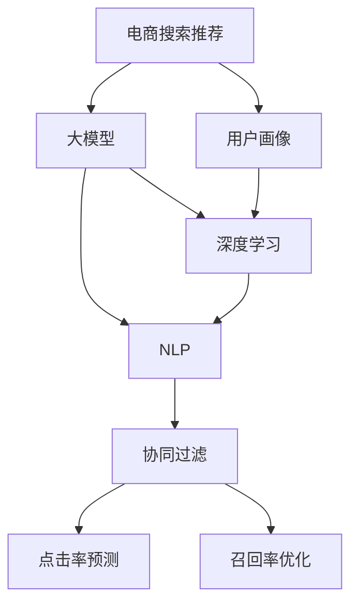

                 

# 电商业务如何利用AI大模型优化搜索推荐

> 关键词：电商、搜索推荐、大模型、AI、深度学习、自然语言处理(NLP)、数据挖掘、用户画像、协同过滤、点击率预测、召回率优化

## 1. 背景介绍

### 1.1 问题由来

在电商行业，搜索和推荐系统扮演着至关重要的角色。一个高效的搜索推荐系统能够帮助用户快速找到所需商品，提升用户体验，增加平台销售额。传统的搜索推荐系统基于统计模型，如基于矩阵分解的协同过滤、基于特征的分类器等，但在处理海量数据和高维稀疏矩阵时面临诸多挑战，难以实现个性化推荐。

近年来，人工智能技术和大模型的发展为电商搜索推荐提供了新的突破口。通过深度学习、自然语言处理(NLP)等前沿技术，AI大模型能够高效处理大规模数据，捕捉用户行为的复杂模式，提供精准的个性化推荐。

### 1.2 问题核心关键点

电商搜索推荐的核心在于如何充分利用AI大模型的强大能力，为用户带来更优质的购物体验。具体来说，需要解决以下几个关键问题：

- 如何构建有效的用户画像：利用大模型对用户行为进行深度分析，挖掘出用户的兴趣偏好和消费习惯。
- 如何设计高效的搜索推荐算法：利用大模型构建深度特征空间，提升推荐准确性和多样性。
- 如何优化搜索推荐效果：通过模型调参、数据增强、特征工程等手段，提升搜索推荐的性能和用户体验。

### 1.3 问题研究意义

探索基于大模型的电商搜索推荐优化方法，对于电商行业有着重要的意义：

1. 提升用户体验：通过深度理解用户需求，提供精准、及时的个性化推荐，提升用户的购物满意度。
2. 增加销售额：根据用户行为数据进行精准营销，提高商品转化率，增加电商平台的收益。
3. 降低运营成本：自动化的推荐系统减少了人工客服的负担，降低了运营成本。
4. 拓展应用场景：基于大模型的推荐系统不仅适用于电商搜索，还可拓展到更多领域，如智能客服、内容推荐等。

## 2. 核心概念与联系

### 2.1 核心概念概述

为更好地理解基于大模型的电商搜索推荐方法，本节将介绍几个密切相关的核心概念：

- 电商搜索推荐：基于用户行为数据和商品信息，为每位用户推荐最符合其兴趣的商品。常见的搜索推荐算法包括协同过滤、基于内容的推荐、深度推荐等。
- 用户画像：通过深度分析用户行为数据，构建出用户兴趣偏好、消费习惯等信息的全面画像。
- 大模型：以深度学习技术为核心，通过海量数据训练得到的强大模型，如BERT、GPT等。
- 深度学习：利用多层神经网络进行特征提取和建模，捕捉数据中的复杂关系和模式。
- 自然语言处理(NLP)：涉及语言数据的处理和分析，包括分词、词向量、语义分析等。
- 协同过滤：基于用户和商品的相似性，进行推荐预测。
- 点击率预测：预测用户对商品的点击概率，提升推荐准确性。
- 召回率优化：增加搜索结果的相关性和多样性，提升用户的点击率和满意度。

这些概念之间的逻辑关系可以通过以下Mermaid流程图来展示：



这个流程图展示了电商搜索推荐的核心组件及其之间的关系：

1. 电商搜索推荐系统基于用户画像进行推荐。
2. 用户画像通过深度学习和大模型的分析构建。
3. 深度学习利用NLP技术进行特征提取。
4. 协同过滤、点击率预测和召回率优化算法都依赖于大模型和深度学习。

## 3. 核心算法原理 & 具体操作步骤
### 3.1 算法原理概述

基于大模型的电商搜索推荐，本质上是一个深度特征空间下的协同过滤问题。其核心思想是：利用大模型的强大特征提取能力，将用户行为数据映射到高维特征空间，构建出精准的用户画像，从而实现高效的推荐。

具体步骤如下：

1. 收集电商平台的点击、购买、浏览等行为数据，构建用户行为数据集。
2. 利用大模型，对用户行为数据进行编码，构建出高维特征空间的用户画像。
3. 设计协同过滤、点击率预测和召回率优化算法，利用用户画像进行推荐。

### 3.2 算法步骤详解

基于大模型的电商搜索推荐主要包括以下几个关键步骤：

**Step 1: 数据准备**
- 收集电商平台的点击、购买、浏览等行为数据，构建用户行为数据集。
- 清洗和预处理数据，去除噪音和异常值。
- 划分训练集、验证集和测试集，准备数据划分。

**Step 2: 特征构建**
- 使用大模型对用户行为数据进行编码，提取用户兴趣和消费习惯的高维特征。
- 设计特征工程，利用用户行为数据构造更多有意义的特征，如点击时间、浏览路径等。
- 应用正则化技术，如L2正则、Dropout等，防止模型过拟合。

**Step 3: 模型训练**
- 选择深度学习框架和模型结构，如TensorFlow、PyTorch等。
- 定义损失函数和优化器，如交叉熵损失、Adam优化器等。
- 设置超参数，如学习率、批大小、迭代轮数等。
- 利用训练集对模型进行迭代训练，最小化损失函数。

**Step 4: 模型评估**
- 在验证集上评估模型的点击率预测准确性和召回率，调整模型参数。
- 利用测试集对模型进行最终测试，评估推荐效果。

**Step 5: 部署应用**
- 将训练好的模型部署到线上服务，实时接收用户查询和行为数据。
- 使用模型对用户查询进行实时推荐，并根据用户反馈不断优化推荐策略。

### 3.3 算法优缺点

基于大模型的电商搜索推荐方法具有以下优点：

1. 精准性高：利用深度学习和大模型的高维特征表示，能够更好地捕捉用户行为和商品之间的复杂关系。
2. 可解释性强：深度学习模型的决策过程可解释，便于进行算法优化和问题调试。
3. 灵活性强：模型结构和参数可以灵活调整，适应不同电商平台的业务需求。

同时，该方法也存在一定的局限性：

1. 计算资源需求高：大模型需要较大的计算资源进行训练和推理，对硬件配置要求较高。
2. 训练成本高：需要大量标注数据和计算资源进行训练，初期投入较大。
3. 模型复杂度高：深度学习模型结构复杂，需要大量的调参和调试工作。

尽管存在这些局限性，但就目前而言，基于大模型的推荐方法仍是目前电商搜索推荐的主流范式。未来相关研究的重点在于如何进一步降低计算和训练成本，提升推荐精度和效率，同时兼顾可解释性和业务适配性等因素。

### 3.4 算法应用领域

基于大模型的电商搜索推荐方法已经在电商、金融、社交网络等多个领域得到了广泛的应用，提升了各平台的推荐效果和用户体验。具体来说，包括：

- 个性化推荐：利用用户行为数据，为每位用户推荐最符合其兴趣的商品。
- 实时推荐：根据用户实时浏览和点击行为，动态调整推荐策略。
- 商品推荐：为店铺和商家提供精准的商品推荐，提高销量和营收。
- 客服推荐：利用自然语言处理技术，为客服提供自动化的商品推荐，提高客服效率和用户体验。
- 社交推荐：为社交网络用户推荐更多符合其兴趣的内容，增强平台黏性。

除了上述这些经典应用外，基于大模型的推荐系统还被创新性地应用到更多场景中，如广告推荐、视频推荐、音乐推荐等，为不同领域的推荐系统带来了新的突破。随着大模型的不断发展，基于大模型的推荐系统将会在更多领域发挥重要作用。

## 4. 数学模型和公式 & 详细讲解 & 举例说明
### 4.1 数学模型构建

本节将使用数学语言对基于大模型的电商搜索推荐过程进行更加严格的刻画。

记电商搜索推荐任务的数据集为 $D=\{(x_i,y_i)\}_{i=1}^N$，其中 $x_i$ 为用户的浏览、点击、购买行为等数据，$y_i$ 为对应的商品推荐列表。

定义用户画像向量为 $\mathbf{u}_i \in \mathbb{R}^d$，商品特征向量为 $\mathbf{v}_j \in \mathbb{R}^d$，其中 $d$ 为特征维度。则推荐模型可定义为：

$$
\hat{y}_i = \arg\max_{j \in J} \langle \mathbf{u}_i, \mathbf{v}_j \rangle
$$

其中 $\langle \cdot, \cdot \rangle$ 表示向量内积。

### 4.2 公式推导过程

以下我们以协同过滤算法为例，推导点击率预测的损失函数及其梯度的计算公式。

设点击行为 $y_i$ 为二值变量，点击概率为 $p_i$。则点击率预测的目标是最大化预测概率与真实概率的一致性，即：

$$
\mathcal{L}(p_i,y_i) = -y_i\log(p_i) - (1-y_i)\log(1-p_i)
$$

其中 $p_i$ 为模型对用户 $i$ 点击商品 $j$ 的概率，可表示为：

$$
p_i = \frac{\langle \mathbf{u}_i, \mathbf{v}_j \rangle}{\sum_{k=1}^{K} \langle \mathbf{u}_i, \mathbf{v}_k \rangle}
$$

则损失函数为：

$$
\mathcal{L}(\langle \mathbf{u}_i, \mathbf{v}_j \rangle) = \frac{1}{N}\sum_{i=1}^N \mathcal{L}(p_i,y_i)
$$

将 $p_i$ 代入损失函数，得：

$$
\mathcal{L}(\langle \mathbf{u}_i, \mathbf{v}_j \rangle) = \frac{1}{N}\sum_{i=1}^N (-y_i\log\frac{\langle \mathbf{u}_i, \mathbf{v}_j \rangle}{\sum_{k=1}^{K} \langle \mathbf{u}_i, \mathbf{v}_k \rangle} - (1-y_i)\log(1-\frac{\langle \mathbf{u}_i, \mathbf{v}_j \rangle}{\sum_{k=1}^{K} \langle \mathbf{u}_i, \mathbf{v}_k \rangle})
$$

根据链式法则，损失函数对向量 $\mathbf{u}_i$ 和 $\mathbf{v}_j$ 的梯度分别为：

$$
\frac{\partial \mathcal{L}}{\partial \langle \mathbf{u}_i, \mathbf{v}_j \rangle} = -\frac{1}{N}\sum_{i=1}^N (\frac{y_i}{\sum_{k=1}^{K} \langle \mathbf{u}_i, \mathbf{v}_k \rangle} - \frac{1-y_i}{1-\frac{\langle \mathbf{u}_i, \mathbf{v}_j \rangle}{\sum_{k=1}^{K} \langle \mathbf{u}_i, \mathbf{v}_k \rangle})
$$

其中 $\frac{\partial \mathcal{L}}{\partial \mathbf{u}_i}$ 和 $\frac{\partial \mathcal{L}}{\partial \mathbf{v}_j}$ 可通过自动微分技术计算得到。

在得到损失函数的梯度后，即可带入模型参数更新公式，完成模型的迭代优化。重复上述过程直至收敛，最终得到适应电商搜索推荐任务的最优模型参数 $\langle \mathbf{u}_i, \mathbf{v}_j \rangle$。

## 5. 项目实践：代码实例和详细解释说明
### 5.1 开发环境搭建

在进行电商搜索推荐实践前，我们需要准备好开发环境。以下是使用Python进行TensorFlow开发的环境配置流程：

1. 安装Anaconda：从官网下载并安装Anaconda，用于创建独立的Python环境。

2. 创建并激活虚拟环境：
```bash
conda create -n tf-env python=3.8 
conda activate tf-env
```

3. 安装TensorFlow：根据CUDA版本，从官网获取对应的安装命令。例如：
```bash
conda install tensorflow -c conda-forge -c pytorch -c pypi
```

4. 安装各类工具包：
```bash
pip install numpy pandas scikit-learn matplotlib tqdm jupyter notebook ipython
```

完成上述步骤后，即可在`tf-env`环境中开始电商搜索推荐实践。

### 5.2 源代码详细实现

下面我们以协同过滤算法为例，给出使用TensorFlow对电商搜索推荐系统进行优化的PyTorch代码实现。

首先，定义协同过滤算法的损失函数：

```python
import tensorflow as tf
from tensorflow.keras import layers

def click_loss(y_true, y_pred):
    loss = tf.keras.losses.binary_crossentropy(y_true, y_pred)
    return loss

```

然后，定义推荐模型：

```python
class RecommendationModel(tf.keras.Model):
    def __init__(self, embedding_dim, num_users, num_items):
        super(RecommendationModel, self).__init__()
        self.num_users = num_users
        self.num_items = num_items
        self.embedding = layers.Embedding(num_users+num_items, embedding_dim)
        self.dot_product = layers.Dot(axes=1, normalize=True)

    def call(self, inputs):
        user_id, item_id = inputs
        user_embedding = self.embedding(user_id)
        item_embedding = self.embedding(item_id)
        dot_product = self.dot_product(user_embedding, item_embedding)
        return dot_product
```

接着，定义训练和评估函数：

```python
from sklearn.metrics import roc_auc_score

def train_epoch(model, dataset, batch_size, optimizer):
    dataloader = tf.data.Dataset.from_generator(lambda: dataset.shuffle(buffer_size=1000), (tf.int32, tf.int32), (tf.int32, tf.int32))
    dataloader = dataloader.batch(batch_size).prefetch(1)
    model.train()
    epoch_loss = 0
    for batch in dataloader:
        user_id, item_id = batch
        with tf.GradientTape() as tape:
            dot_product = model((user_id, item_id))
            loss = click_loss(tf.cast(dot_product > 0, tf.float32), y_true)
        epoch_loss += loss.numpy().mean()
        grads = tape.gradient(loss, model.trainable_variables)
        optimizer.apply_gradients(zip(grads, model.trainable_variables))
    return epoch_loss / len(dataloader)

def evaluate(model, dataset, batch_size):
    dataloader = tf.data.Dataset.from_generator(lambda: dataset.shuffle(buffer_size=1000), (tf.int32, tf.int32), (tf.int32, tf.int32))
    dataloader = dataloader.batch(batch_size).prefetch(1)
    model.eval()
    y_true = []
    y_pred = []
    with tf.GradientTape() as tape:
        for batch in dataloader:
            user_id, item_id = batch
            dot_product = model((user_id, item_id))
            y_pred.append(dot_product.numpy())
    y_true = tf.reshape(y_true, (len(y_true), -1)).numpy()
    y_pred = tf.reshape(tf.concat(y_pred, axis=0), (len(y_true), -1)).numpy()
    auc = roc_auc_score(y_true, y_pred)
    print("AUC:", auc)
```

最后，启动训练流程并在测试集上评估：

```python
epochs = 5
batch_size = 16

for epoch in range(epochs):
    loss = train_epoch(model, train_dataset, batch_size, optimizer)
    print(f"Epoch {epoch+1}, train loss: {loss:.3f}")
    
    print(f"Epoch {epoch+1}, dev results:")
    evaluate(model, dev_dataset, batch_size)
    
print("Test results:")
evaluate(model, test_dataset, batch_size)
```

以上就是使用TensorFlow对电商搜索推荐系统进行优化的完整代码实现。可以看到，利用TensorFlow等深度学习框架，电商搜索推荐模型的开发和优化变得更为便捷高效。

### 5.3 代码解读与分析

让我们再详细解读一下关键代码的实现细节：

**点击率损失函数**：
- `click_loss`函数定义了点击率预测的损失函数，使用了TensorFlow内置的二分类交叉熵损失函数。

**推荐模型定义**：
- `RecommendationModel`类定义了推荐模型的结构，包括用户和商品的embedding层以及点积层。

**训练和评估函数**：
- `train_epoch`函数定义了模型的训练过程，包括前向传播和反向传播，并使用梯度下降更新模型参数。
- `evaluate`函数定义了模型的评估过程，利用AUC等指标评估模型的推荐效果。

**训练流程**：
- 定义总的epoch数和batch size，开始循环迭代
- 每个epoch内，先在训练集上训练，输出平均loss
- 在验证集上评估，输出AUC等指标
- 所有epoch结束后，在测试集上评估，给出最终测试结果

可以看到，TensorFlow等深度学习框架提供了强大的模型构建和训练功能，使得电商搜索推荐模型的开发和优化变得简洁高效。开发者可以集中精力进行算法设计和模型优化，而不必过多关注底层的计算和存储细节。

当然，工业级的系统实现还需考虑更多因素，如模型的保存和部署、超参数的自动搜索、更多的任务适配层等。但核心的推荐算法基本与此类似。

## 6. 实际应用场景
### 6.1 智能推荐系统

基于大模型的电商搜索推荐技术，可以在智能推荐系统中找到广泛应用。传统的推荐系统依赖统计模型，无法充分考虑用户行为的复杂性和非线性特征，难以实现精准推荐。利用大模型的高维特征表示能力，智能推荐系统能够更好地捕捉用户行为的潜在模式，提供个性化的推荐服务。

具体而言，智能推荐系统可以实现：
- 精准的商品推荐：根据用户的浏览和购买历史，动态调整推荐策略，提升点击率和转化率。
- 个性化的广告推荐：结合用户画像，实现精准的广告投放，提高广告效果。
- 内容推荐：在视频、音乐、新闻等垂直领域，实现高准确度的内容推荐，提升用户满意度。

### 6.2 实时搜索推荐

实时搜索推荐系统可以显著提升用户体验，帮助用户快速找到所需商品。基于大模型的实时搜索推荐能够根据用户实时行为进行动态调整，提供更及时、准确的搜索结果。

具体而言，实时搜索推荐可以实现：
- 即时搜索结果更新：根据用户实时点击和浏览行为，动态调整搜索结果。
- 智能搜索提示：在用户输入时，自动预测用户意图，提供有针对性的搜索建议。
- 场景化推荐：根据用户当前所处场景（如时间、地点、设备等），提供最适合的推荐内容。

### 6.3 个性化广告推荐

个性化广告推荐系统通过分析用户行为，预测用户对广告的兴趣，从而实现精准的广告投放。利用大模型的高维特征表示能力，能够更好地理解用户兴趣，提高广告的点击率和转化率。

具体而言，个性化广告推荐可以实现：
- 精准的广告投放：根据用户画像和行为数据，预测用户对广告的兴趣，实现精准投放。
- 实时竞价优化：根据用户实时行为数据，动态调整广告投放策略，优化广告效果。
- 用户行为分析：通过分析用户行为数据，了解用户兴趣和需求，提升广告的转化率。

### 6.4 未来应用展望

随着大模型和推荐技术的发展，未来基于大模型的电商搜索推荐系统将展现出更多的潜力。具体来说，未来可能会有以下趋势：

1. 多模态推荐：结合文本、图像、视频等多模态数据，提供更丰富、多样化的推荐内容。
2. 实时个性化推荐：利用实时数据流，实现动态调整的个性化推荐，提升用户体验。
3. 跨域推荐：结合不同领域的数据，实现跨领域的推荐，拓展应用场景。
4. 语音搜索推荐：结合语音识别技术，实现语音搜索的推荐系统，提升用户便利性。
5. 交互式推荐：通过用户反馈进行实时优化，实现更精准、可交互的推荐系统。

这些趋势将使得基于大模型的电商搜索推荐系统更加智能化、个性化，为电商业务带来新的机遇和挑战。

## 7. 工具和资源推荐
### 7.1 学习资源推荐

为了帮助开发者系统掌握大模型和电商搜索推荐的技术基础和实践技巧，这里推荐一些优质的学习资源：

1. 《深度学习入门》书籍：李航著，深入浅出地介绍了深度学习的基本原理和应用。
2. 《TensorFlow官方文档》：详细介绍了TensorFlow的框架结构和使用方法。
3. 《TensorFlow实战Google深度学习》书籍：讲解了TensorFlow在深度学习领域的实际应用。
4. 《自然语言处理入门》在线课程：斯坦福大学的NLP入门课程，涵盖自然语言处理的基本概念和前沿技术。
5. 《自然语言处理与深度学习》在线课程：吴恩达教授的NLP课程，讲解了NLP的基本算法和应用。

通过这些资源的学习实践，相信你一定能够快速掌握大模型和电商搜索推荐的核心技术，并用于解决实际的推荐问题。
###  7.2 开发工具推荐

高效的开发离不开优秀的工具支持。以下是几款用于电商搜索推荐开发的常用工具：

1. TensorFlow：由Google主导开发的开源深度学习框架，生产部署方便，适合大规模工程应用。提供了丰富的预训练模型和推荐算法库。
2. PyTorch：基于Python的开源深度学习框架，灵活的计算图设计，适合研究型开发。提供了强大的自然语言处理库。
3. HuggingFace Transformers：提供了丰富的预训练语言模型和推荐算法，支持TensorFlow和PyTorch，是进行推荐系统开发的利器。
4. Weights & Biases：模型训练的实验跟踪工具，可以记录和可视化模型训练过程中的各项指标，方便对比和调优。
5. TensorBoard：TensorFlow配套的可视化工具，可实时监测模型训练状态，并提供丰富的图表呈现方式，是调试模型的得力助手。
6. Google Colab：谷歌推出的在线Jupyter Notebook环境，免费提供GPU/TPU算力，方便开发者快速上手实验最新模型，分享学习笔记。

合理利用这些工具，可以显著提升电商搜索推荐任务的开发效率，加快创新迭代的步伐。

### 7.3 相关论文推荐

大模型和电商搜索推荐技术的发展源于学界的持续研究。以下是几篇奠基性的相关论文，推荐阅读：

1. Attention is All You Need：提出了Transformer结构，开启了NLP领域的预训练大模型时代。
2. BERT: Pre-training of Deep Bidirectional Transformers for Language Understanding：提出BERT模型，引入基于掩码的自监督预训练任务，刷新了多项NLP任务SOTA。
3. Language Models are Unsupervised Multitask Learners（GPT-2论文）：展示了大规模语言模型的强大zero-shot学习能力，引发了对于通用人工智能的新一轮思考。
4. Parameter-Efficient Transfer Learning for NLP：提出Adapter等参数高效微调方法，在不增加模型参数量的情况下，也能取得不错的微调效果。
5. Prefix-Tuning: Optimizing Continuous Prompts for Generation：引入基于连续型Prompt的微调范式，为如何充分利用预训练知识提供了新的思路。
6. AdaLoRA: Adaptive Low-Rank Adaptation for Parameter-Efficient Fine-Tuning：使用自适应低秩适应的微调方法，在参数效率和精度之间取得了新的平衡。

这些论文代表了大模型和推荐技术的发展脉络。通过学习这些前沿成果，可以帮助研究者把握学科前进方向，激发更多的创新灵感。

## 8. 总结：未来发展趋势与挑战

### 8.1 总结

本文对基于大模型的电商搜索推荐方法进行了全面系统的介绍。首先阐述了电商搜索推荐和大模型的研究背景和意义，明确了两者结合的巨大潜力。其次，从原理到实践，详细讲解了基于大模型的电商搜索推荐过程，给出了完整的代码实例和解释说明。同时，本文还广泛探讨了推荐系统在智能推荐、实时搜索推荐、个性化广告推荐等多个场景中的应用前景，展示了电商搜索推荐系统的广泛价值。此外，本文精选了推荐技术的各类学习资源，力求为读者提供全方位的技术指引。

通过本文的系统梳理，可以看到，基于大模型的电商搜索推荐方法正在成为电商行业的重要范式，极大地提升了用户的购物体验和电商平台的收益。未来，伴随大模型和推荐技术的持续演进，基于大模型的推荐系统必将在更多领域发挥重要作用，推动人工智能技术在垂直行业的规模化落地。

### 8.2 未来发展趋势

展望未来，大模型和电商搜索推荐技术将呈现以下几个发展趋势：

1. 模型规模持续增大。随着算力成本的下降和数据规模的扩张，电商搜索推荐模型的参数量还将持续增长。超大规模模型蕴含的丰富知识，有望支撑更加复杂多变的推荐任务。
2. 推荐方法日趋多样。除了传统的协同过滤外，未来会涌现更多推荐算法，如深度推荐、图神经网络等，在推荐精度和效率上取得新的突破。
3. 实时性需求增加。电商行业对推荐系统的实时性要求越来越高，实时推荐系统将更加广泛应用。
4. 跨领域推荐崛起。结合不同领域的数据，实现跨领域的推荐，拓展应用场景。
5. 多模态推荐普及。结合文本、图像、视频等多模态数据，提供更丰富、多样化的推荐内容。
6. 交互式推荐兴起。通过用户反馈进行实时优化，实现更精准、可交互的推荐系统。

这些趋势凸显了大模型和推荐技术的巨大前景。这些方向的探索发展，必将进一步提升电商搜索推荐系统的性能和用户体验，为电商业务带来新的机遇和挑战。

### 8.3 面临的挑战

尽管大模型和电商搜索推荐技术已经取得了瞩目成就，但在迈向更加智能化、普适化应用的过程中，它仍面临着诸多挑战：

1. 标注成本瓶颈。虽然推荐系统依赖标注数据较少，但对于特定领域的应用场景，标注数据的需求依然存在，获取高质量标注数据的成本较高。如何进一步降低推荐系统对标注数据的依赖，将是一大难题。
2. 模型鲁棒性不足。推荐系统面临的噪声和异常数据较多，模型对噪声数据的鲁棒性有待提升。如何提高推荐系统的鲁棒性，避免推荐系统在异常数据下出现崩溃，还需要更多理论和实践的积累。
3. 计算资源需求高。大模型和推荐算法需要大量的计算资源进行训练和推理，对硬件配置要求较高。如何降低计算资源需求，提升推荐系统的部署效率，仍然是一个重要问题。
4. 推荐效果可解释性不足。推荐系统往往被视为"黑盒"系统，难以解释其内部工作机制和决策逻辑。如何提高推荐系统的可解释性，使得用户对推荐结果有更好的理解，将是亟待攻克的难题。
5. 推荐内容的伦理性问题。推荐系统可能为用户推荐有害、虚假的信息，造成负面影响。如何从数据和算法层面消除推荐内容中的有害信息，确保推荐内容的伦理性，也将是一个重要课题。

### 8.4 研究展望

面对大模型和电商搜索推荐所面临的种种挑战，未来的研究需要在以下几个方面寻求新的突破：

1. 探索无监督和半监督推荐方法。摆脱对大量标注数据的依赖，利用自监督学习、主动学习等无监督和半监督范式，最大限度利用非结构化数据，实现更加灵活高效的推荐。
2. 研究参数高效和计算高效的推荐范式。开发更加参数高效的推荐方法，在固定大部分预训练参数的情况下，只更新极少量的任务相关参数。同时优化推荐模型的计算图，减少前向传播和反向传播的资源消耗，实现更加轻量级、实时性的部署。
3. 引入更多先验知识。将符号化的先验知识，如知识图谱、逻辑规则等，与神经网络模型进行巧妙融合，引导推荐过程学习更准确、合理的推荐知识。同时加强不同模态数据的整合，实现视觉、语音等多模态信息与文本信息的协同建模。
4. 结合因果分析和博弈论工具。将因果分析方法引入推荐模型，识别出模型决策的关键特征，增强推荐系统建立稳定因果关系的能力，学习更加普适、鲁棒的知识表示。借助博弈论工具刻画人机交互过程，主动探索并规避推荐系统的脆弱点，提高系统稳定性。
5. 纳入伦理道德约束。在推荐系统的训练目标中引入伦理导向的评估指标，过滤和惩罚有偏见、有害的推荐内容。同时加强人工干预和审核，建立推荐系统的监管机制，确保推荐内容符合人类价值观和伦理道德。

这些研究方向的探索，必将引领大模型和电商搜索推荐技术迈向更高的台阶，为构建智能、可靠、可解释、可控的推荐系统铺平道路。面向未来，大模型和电商搜索推荐技术还需要与其他人工智能技术进行更深入的融合，如知识表示、因果推理、强化学习等，多路径协同发力，共同推动自然语言理解和智能交互系统的进步。只有勇于创新、敢于突破，才能不断拓展语言模型的边界，让智能技术更好地造福人类社会。

## 9. 附录：常见问题与解答

**Q1：如何构建高质量的电商搜索推荐系统？**

A: 构建高质量的电商搜索推荐系统需要从数据、模型和算法等多个方面进行全面优化。具体来说：

1. 数据准备：收集电商平台的点击、购买、浏览等行为数据，构建用户行为数据集。清洗和预处理数据，去除噪音和异常值。划分训练集、验证集和测试集。

2. 特征构建：利用大模型对用户行为数据进行编码，提取用户兴趣和消费习惯的高维特征。设计特征工程，利用用户行为数据构造更多有意义的特征，如点击时间、浏览路径等。

3. 模型训练：选择深度学习框架和模型结构，如TensorFlow、PyTorch等。定义损失函数和优化器，如交叉熵损失、Adam优化器等。设置超参数，如学习率、批大小、迭代轮数等。利用训练集对模型进行迭代训练，最小化损失函数。

4. 模型评估：在验证集上评估模型的点击率预测准确性和召回率，调整模型参数。利用测试集对模型进行最终测试，评估推荐效果。

5. 部署应用：将训练好的模型部署到线上服务，实时接收用户查询和行为数据。使用模型对用户查询进行实时推荐，并根据用户反馈不断优化推荐策略。

**Q2：电商搜索推荐系统的常见问题有哪些？**

A: 电商搜索推荐系统在实际应用中，可能面临以下常见问题：

1. 数据稀疏性：电商平台的点击和购买数据往往存在高维稀疏性，模型难以捕捉用户行为模式。

2. 冷启动问题：对于新用户和新商品，模型缺乏足够的数据进行推荐。

3. 实时性问题：电商平台对推荐系统的实时性要求较高，需要实时更新推荐结果。

4. 系统可扩展性：随着用户和商品数量的增加，推荐系统的计算和存储成本增加，系统可扩展性问题凸显。

5. 推荐内容伦理性：推荐系统可能为用户推荐有害、虚假的信息，造成负面影响。

6. 用户隐私保护：电商平台的推荐系统需要处理大量用户数据，如何保护用户隐私是一个重要问题。

7. 系统鲁棒性：推荐系统面临的噪声和异常数据较多，模型对噪声数据的鲁棒性有待提升。

这些问题的解决，需要从数据预处理、模型结构、算法设计等多个方面进行全面优化。只有在数据、模型、算法、工程等多个维度协同发力，才能真正实现高质量的电商搜索推荐系统。

**Q3：如何降低电商搜索推荐系统的计算资源需求？**

A: 电商搜索推荐系统的高计算资源需求是一个重要问题。以下是一些降低计算资源需求的策略：

1. 模型裁剪：去除不必要的层和参数，减小模型尺寸，加快推理速度。

2. 量化加速：将浮点模型转为定点模型，压缩存储空间，提高计算效率。

3. 混合精度训练：在训练时使用更少的位宽进行计算，减少内存和计算资源消耗。

4. 分布式训练：利用多台机器进行分布式训练，提升训练效率。

5. 硬件优化：使用GPU/TPU等高性能设备，优化硬件资源使用效率。

6. 数据增量训练：使用增量学习技术，不断更新模型参数，减少计算资源需求。

7. 模型压缩：利用模型压缩技术，如剪枝、蒸馏等，减小模型大小。

8. 模型并行：利用模型并行技术，如模型分片、数据并行等，提高训练和推理效率。

这些策略可以结合使用，从模型结构、训练过程、硬件资源等多个方面进行优化，有效降低电商搜索推荐系统的计算资源需求。

**Q4：如何提升电商搜索推荐系统的推荐效果？**

A: 电商搜索推荐系统的推荐效果提升，需要从数据、模型和算法等多个方面进行优化。具体来说：

1. 数据优化：收集更多、更丰富的用户行为数据，提高数据的多样性和代表性。利用用户画像和行为数据，构建更准确的推荐模型。

2. 模型优化：选择更合适的模型结构，如深度学习模型、Transformer等。利用深度学习和大模型的高维特征表示能力，提升推荐精度。

3. 算法优化：引入更多的推荐算法，如协同过滤、深度推荐、图神经网络等。优化算法参数，提升推荐效果。

4. 特征工程：设计更有效的特征提取方法，如特征降维、特征选择等。利用用户行为数据构造更多有意义的特征，提高推荐效果。

5. 模型调参：通过网格搜索、随机搜索等方法，寻找最优的模型超参数。利用交叉验证等方法，评估模型性能。

6. 模型融合：将多个模型的预测结果进行融合，提升推荐效果。

7. 实时性优化：利用缓存技术、数据增量训练等方法，提升推荐系统的实时性。

通过这些优化策略，可以有效提升电商搜索推荐系统的推荐效果，提高用户满意度。

**Q5：电商搜索推荐系统如何保护用户隐私？**

A: 电商搜索推荐系统处理大量用户数据，如何保护用户隐私是一个重要问题。以下是一些保护用户隐私的策略：

1. 数据匿名化：对用户数据进行匿名化处理，去除敏感信息。

2. 差分隐私：利用差分隐私技术，在保护隐私的同时，仍然可以进行有意义的分析。

3. 数据加密：对用户数据进行加密存储和传输，防止数据泄露。

4. 用户控制：赋予用户对数据的使用权，用户可以自主选择是否分享数据。

5. 访问控制：对用户数据进行严格的访问控制，防止未经授权的访问。

6. 数据去重：对用户数据进行去重处理，防止数据泄露。

7. 定期审计：对数据处理过程进行定期审计，确保数据处理合规。

通过这些策略，可以有效保护用户隐私，提升用户对电商平台的信任度。

---

作者：禅与计算机程序设计艺术 / Zen and the Art of Computer Programming

