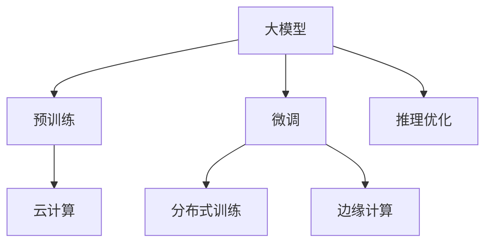

                 

# 电商平台中的AI大模型与云计算结合

> 关键词：电商平台, 人工智能(AI), 大模型, 云计算, 数据预处理, 模型训练, 推理优化, 边缘计算, 分布式训练

## 1. 背景介绍

随着电商行业的快速发展，电商平台在商业模式、产品推荐、广告投放、客户服务等方面的需求日益增长。如何利用人工智能技术提升平台运营效率和用户体验，成为各电商企业关注的焦点。其中，大模型和云计算技术的结合，为电商平台带来了革命性的变革。

大模型（如BERT、GPT、Transformer等）通过大规模无标签数据的自监督预训练，学习到丰富的语言知识和常识，具备强大的文本理解和生成能力。电商平台利用大模型进行推荐系统、客服聊天、广告投放等业务，能够大幅提升业务效果和用户满意度。然而，电商平台的业务特点决定了其对计算资源的需求极高，大模型的部署、训练和推理需要强大的计算支持。云计算技术以其弹性、高效、按需计费的特点，成为了大模型在电商平台中应用的重要基础设施。

## 2. 核心概念与联系

### 2.1 核心概念概述

为了更好地理解AI大模型在电商平台中的应用，本节将介绍几个关键的概念：

- **大模型 (Large Model)**：以BERT、GPT、Transformer为代表的大规模预训练语言模型。通过大规模无标签数据的自监督预训练，学习到通用的语言表示，具备强大的语言理解和生成能力。

- **预训练 (Pre-training)**：指在大规模无标签数据上，通过自监督学习任务训练通用语言模型的过程。预训练使得模型学习到语言的通用表示。

- **微调 (Fine-tuning)**：指在预训练模型的基础上，使用特定业务的数据集，通过有监督学习优化模型在特定业务上的性能。

- **云计算 (Cloud Computing)**：指通过互联网提供按需、弹性的计算和存储服务，以支持大规模数据处理和分布式应用。

- **边缘计算 (Edge Computing)**：指在数据产生源头或靠近产生源的地方进行实时数据处理和分析，以减轻云计算中心负担。

- **分布式训练 (Distributed Training)**：指在多个计算节点上同时进行模型训练，通过分布式算法加速训练速度。

这些概念之间存在紧密的联系，共同构成了大模型在电商平台中应用的理论基础和技术架构。通过理解这些核心概念，我们可以更好地把握大模型与云计算技术的结合方式，以及其在电商平台中的应用场景。

### 2.2 核心概念原理和架构的 Mermaid 流程图



该流程图展示了大模型在电商平台中的基本工作流程和技术架构：

1. **预训练 (B)**：大模型在大规模无标签数据上通过自监督学习任务进行预训练，学习到通用的语言表示。
2. **微调 (C)**：在特定业务数据集上，通过有监督学习优化模型在特定业务上的性能。
3. **云计算 (D)**：利用云计算的弹性计算资源，进行模型训练和推理。
4. **分布式训练 (E)**：通过分布式算法在多个计算节点上同时训练模型，加速训练速度。
5. **边缘计算 (F)**：在数据产生源头或靠近产生源的地方进行实时数据处理和分析，以减轻云计算中心负担。
6. **推理优化 (G)**：对模型推理过程进行优化，提高推理速度和资源利用率。

## 3. 核心算法原理 & 具体操作步骤

### 3.1 算法原理概述

大模型在电商平台中的应用，主要涉及两个关键步骤：预训练和微调。以下是这两步骤的算法原理概述：

- **预训练**：在大规模无标签数据上，通过自监督学习任务（如掩码语言模型、下一句预测、文本分类等）训练通用语言模型，学习到语言的通用表示。

- **微调**：在特定业务数据集上，通过有监督学习优化模型在特定业务上的性能。微调通常包括数据预处理、模型训练、推理优化等环节。

### 3.2 算法步骤详解

#### 3.2.1 数据预处理

电商平台的业务数据通常包含用户行为、产品信息、广告点击率等，需要进行预处理才能用于训练和推理。数据预处理的步骤包括：

1. **数据清洗**：去除缺失、异常数据，处理数据格式不一致等问题。
2. **数据标注**：对部分数据进行手动标注，用于模型微调。
3. **数据划分**：将数据集划分为训练集、验证集和测试集，以进行模型评估和调参。

#### 3.2.2 模型训练

在数据预处理的基础上，可以进行模型的训练。模型训练的步骤包括：

1. **模型选择**：选择合适的预训练模型（如BERT、GPT等）作为初始化参数。
2. **模型微调**：使用特定业务的数据集，通过有监督学习优化模型在特定业务上的性能。
3. **超参数调优**：选择适当的学习率、批大小、迭代轮数等超参数，进行模型调优。

#### 3.2.3 推理优化

模型训练完成后，需要对其进行推理优化，以适应电商平台的实时计算需求。推理优化的步骤包括：

1. **模型裁剪**：去除不必要的层和参数，减小模型尺寸，加快推理速度。
2. **量化加速**：将浮点模型转为定点模型，压缩存储空间，提高计算效率。
3. **分布式推理**：利用分布式计算框架（如TensorFlow Serving、Kubeflow等）进行推理，提高计算效率。

### 3.3 算法优缺点

#### 3.3.1 优点

- **高效性**：利用云计算的弹性计算资源，可以灵活调整计算资源，满足大规模数据处理和分布式应用的需求。
- **可扩展性**：分布式训练和推理可以大幅提升计算效率，支持大规模数据集和复杂模型的训练和推理。
- **成本效益**：按需计费的模式，可以根据实际需求灵活调整计算资源，避免资源浪费。
- **灵活性**：边缘计算可以减轻云计算中心负担，提高实时数据处理和分析能力。

#### 3.3.2 缺点

- **数据隐私和安全**：将大量业务数据上传到云端，可能存在数据隐私和安全问题。
- **计算延迟**：云计算中心与业务系统之间的通信延迟，可能影响实时数据处理和分析。
- **系统复杂性**：分布式系统和边缘计算的部署和管理，增加了系统复杂性和维护难度。

### 3.4 算法应用领域

大模型在电商平台中的应用，主要集中在以下几个领域：

1. **推荐系统**：利用大模型进行用户行为预测，推荐合适的商品或服务。
2. **客服聊天**：利用大模型进行自然语言处理，实现智能客服聊天。
3. **广告投放**：利用大模型进行文本生成，优化广告投放效果。
4. **风险管理**：利用大模型进行欺诈检测、信用评估等风险管理。
5. **库存管理**：利用大模型进行销售预测、库存管理优化。

## 4. 数学模型和公式 & 详细讲解 & 举例说明

### 4.1 数学模型构建

电商平台的推荐系统、客服聊天等业务，涉及大量的文本数据处理。以推荐系统为例，模型通常采用文本分类任务进行训练。设推荐系统训练集为 $D=\{(x_i,y_i)\}_{i=1}^N$，其中 $x_i$ 为输入文本，$y_i$ 为标签（推荐结果）。推荐模型的目标是最大化预测准确率：

$$
\max_{\theta} \frac{1}{N}\sum_{i=1}^N \mathcal{L}(M_{\theta}(x_i),y_i)
$$

其中 $\mathcal{L}$ 为交叉熵损失函数。

### 4.2 公式推导过程

假设推荐系统模型为 $M_{\theta}$，输入文本 $x_i$ 经过预处理后，转化为词向量 $x_i \in \mathbb{R}^d$，输出为 $M_{\theta}(x_i) \in [0,1]$，表示文本被推荐的概率。则交叉熵损失函数 $\mathcal{L}$ 可表示为：

$$
\mathcal{L}(M_{\theta}(x_i),y_i) = -[y_i\log M_{\theta}(x_i) + (1-y_i)\log(1-M_{\theta}(x_i))]
$$

将推荐模型 $M_{\theta}$ 作为大模型的一部分进行微调，模型的损失函数可表示为：

$$
\mathcal{L}(\theta) = \frac{1}{N}\sum_{i=1}^N \mathcal{L}(M_{\theta}(x_i),y_i)
$$

模型参数 $\theta$ 的更新公式为：

$$
\theta \leftarrow \theta - \eta \nabla_{\theta}\mathcal{L}(\theta)
$$

其中 $\eta$ 为学习率。

### 4.3 案例分析与讲解

以推荐系统为例，我们可以使用BERT模型进行文本分类。具体步骤如下：

1. **数据预处理**：将推荐系统训练集中的文本进行分词、向量化等预处理。
2. **模型选择**：选择BERT模型作为初始化参数。
3. **模型微调**：使用推荐系统训练集进行微调，更新BERT模型的参数，使其更适合电商平台的推荐任务。
4. **推理优化**：使用模型裁剪、量化加速等技术，优化推理速度。

## 5. 项目实践：代码实例和详细解释说明

### 5.1 开发环境搭建

在进行项目实践前，我们需要准备好开发环境。以下是使用Python进行PyTorch开发的环境配置流程：

1. 安装Anaconda：从官网下载并安装Anaconda，用于创建独立的Python环境。

2. 创建并激活虚拟环境：
```bash
conda create -n pytorch-env python=3.8 
conda activate pytorch-env
```

3. 安装PyTorch：根据CUDA版本，从官网获取对应的安装命令。例如：
```bash
conda install pytorch torchvision torchaudio cudatoolkit=11.1 -c pytorch -c conda-forge
```

4. 安装Transformers库：
```bash
pip install transformers
```

5. 安装各类工具包：
```bash
pip install numpy pandas scikit-learn matplotlib tqdm jupyter notebook ipython
```

完成上述步骤后，即可在`pytorch-env`环境中开始项目实践。

### 5.2 源代码详细实现

这里我们以推荐系统为例，给出使用Transformers库对BERT模型进行微调的PyTorch代码实现。

首先，定义推荐系统任务的数据处理函数：

```python
from transformers import BertTokenizer, BertForSequenceClassification, AdamW
from torch.utils.data import Dataset, DataLoader
import torch

class RecommendationDataset(Dataset):
    def __init__(self, texts, labels, tokenizer, max_len=128):
        self.texts = texts
        self.labels = labels
        self.tokenizer = tokenizer
        self.max_len = max_len
        
    def __len__(self):
        return len(self.texts)
    
    def __getitem__(self, item):
        text = self.texts[item]
        label = self.labels[item]
        
        encoding = self.tokenizer(text, return_tensors='pt', max_length=self.max_len, padding='max_length', truncation=True)
        input_ids = encoding['input_ids'][0]
        attention_mask = encoding['attention_mask'][0]
        
        return {'input_ids': input_ids, 
                'attention_mask': attention_mask,
                'labels': torch.tensor(label, dtype=torch.long)}
```

然后，定义模型和优化器：

```python
tokenizer = BertTokenizer.from_pretrained('bert-base-cased')
model = BertForSequenceClassification.from_pretrained('bert-base-cased', num_labels=2)
optimizer = AdamW(model.parameters(), lr=2e-5)
```

接着，定义训练和评估函数：

```python
device = torch.device('cuda') if torch.cuda.is_available() else torch.device('cpu')
model.to(device)

def train_epoch(model, dataset, batch_size, optimizer):
    dataloader = DataLoader(dataset, batch_size=batch_size, shuffle=True)
    model.train()
    epoch_loss = 0
    for batch in dataloader:
        input_ids = batch['input_ids'].to(device)
        attention_mask = batch['attention_mask'].to(device)
        labels = batch['labels'].to(device)
        model.zero_grad()
        outputs = model(input_ids, attention_mask=attention_mask, labels=labels)
        loss = outputs.loss
        epoch_loss += loss.item()
        loss.backward()
        optimizer.step()
    return epoch_loss / len(dataloader)

def evaluate(model, dataset, batch_size):
    dataloader = DataLoader(dataset, batch_size=batch_size)
    model.eval()
    preds, labels = [], []
    with torch.no_grad():
        for batch in dataloader:
            input_ids = batch['input_ids'].to(device)
            attention_mask = batch['attention_mask'].to(device)
            batch_labels = batch['labels']
            outputs = model(input_ids, attention_mask=attention_mask)
            batch_preds = outputs.logits.argmax(dim=2).to('cpu').tolist()
            batch_labels = batch_labels.to('cpu').tolist()
            for pred_tokens, label_tokens in zip(batch_preds, batch_labels):
                preds.append(pred_tokens)
                labels.append(label_tokens)
                
    print(classification_report(labels, preds))
```

最后，启动训练流程并在测试集上评估：

```python
epochs = 5
batch_size = 16

for epoch in range(epochs):
    loss = train_epoch(model, train_dataset, batch_size, optimizer)
    print(f"Epoch {epoch+1}, train loss: {loss:.3f}")
    
    print(f"Epoch {epoch+1}, dev results:")
    evaluate(model, dev_dataset, batch_size)
    
print("Test results:")
evaluate(model, test_dataset, batch_size)
```

以上就是使用PyTorch对BERT进行推荐系统任务微调的完整代码实现。可以看到，得益于Transformers库的强大封装，我们可以用相对简洁的代码完成BERT模型的加载和微调。

### 5.3 代码解读与分析

让我们再详细解读一下关键代码的实现细节：

**RecommendationDataset类**：
- `__init__`方法：初始化文本、标签、分词器等关键组件。
- `__len__`方法：返回数据集的样本数量。
- `__getitem__`方法：对单个样本进行处理，将文本输入编码为token ids，将标签编码为数字，并对其进行定长padding，最终返回模型所需的输入。

**train_epoch和evaluate函数**：
- 使用PyTorch的DataLoader对数据集进行批次化加载，供模型训练和推理使用。
- 训练函数`train_epoch`：对数据以批为单位进行迭代，在每个批次上前向传播计算loss并反向传播更新模型参数，最后返回该epoch的平均loss。
- 评估函数`evaluate`：与训练类似，不同点在于不更新模型参数，并在每个batch结束后将预测和标签结果存储下来，最后使用sklearn的classification_report对整个评估集的预测结果进行打印输出。

**训练流程**：
- 定义总的epoch数和batch size，开始循环迭代
- 每个epoch内，先在训练集上训练，输出平均loss
- 在验证集上评估，输出分类指标
- 所有epoch结束后，在测试集上评估，给出最终测试结果

可以看到，PyTorch配合Transformers库使得BERT微调的代码实现变得简洁高效。开发者可以将更多精力放在数据处理、模型改进等高层逻辑上，而不必过多关注底层的实现细节。

当然，工业级的系统实现还需考虑更多因素，如模型的保存和部署、超参数的自动搜索、更灵活的任务适配层等。但核心的微调范式基本与此类似。

## 6. 实际应用场景

### 6.1 智能推荐系统

智能推荐系统是电商平台的核心功能之一，通过向用户推荐感兴趣的商品或服务，提升用户体验和销售额。利用大模型进行推荐系统，能够大幅提升推荐效果和精准度。

具体而言，可以收集用户浏览、点击、评论等行为数据，提取和商品相关的文本信息。将文本信息作为模型输入，用户的后续行为（如是否点击、购买等）作为监督信号，在此基础上微调预训练语言模型。微调后的模型能够从文本内容中准确把握用户的兴趣点，生成更加个性化的推荐结果。

### 6.2 智能客服聊天

智能客服聊天是电商平台的重要应用场景，通过自然语言处理技术，实现用户与系统的自然对话。利用大模型进行智能客服聊天，能够显著提升客服效率和用户满意度。

具体而言，可以收集电商平台的客服聊天记录，将问题和最佳答复构建成监督数据，在此基础上对预训练语言模型进行微调。微调后的模型能够自动理解用户意图，匹配最合适的答案模板进行回复。对于用户提出的新问题，还可以接入检索系统实时搜索相关内容，动态组织生成回答。

### 6.3 广告投放优化

广告投放是电商平台的重要收入来源，通过精准投放广告，提升点击率和转化率。利用大模型进行广告投放优化，能够实现广告内容的生成和投放效果评估。

具体而言，可以收集广告的点击率、转化率等数据，提取广告文本信息。将广告文本信息作为模型输入，广告的点击率和转化率作为监督信号，在此基础上微调预训练语言模型。微调后的模型能够生成更符合用户兴趣的广告内容，并预测广告投放效果，优化广告投放策略。

### 6.4 未来应用展望

随着大模型和云计算技术的不断发展，基于大模型的应用场景将不断拓展。未来，基于大模型的电商应用将涵盖更多领域，带来更多创新和突破。

在智慧零售领域，基于大模型的推荐系统和智能客服聊天，将进一步提升用户体验和运营效率。利用大模型的预测能力，实现库存管理、供应链优化等业务。

在智慧物流领域，基于大模型的路径规划、配送调度等应用，将提升物流配送的效率和精准度。利用大模型的实时计算能力，实现智能仓储、智能拣选等业务。

在智慧金融领域，基于大模型的风险管理、信用评估等应用，将提升金融服务的精准度和效率。利用大模型的数据分析能力，实现智能投顾、智能理财等业务。

## 7. 工具和资源推荐

### 7.1 学习资源推荐

为了帮助开发者系统掌握大模型在电商平台中的应用，这里推荐一些优质的学习资源：

1. **《深度学习与自然语言处理》课程**：由斯坦福大学开设的NLP明星课程，有Lecture视频和配套作业，带你入门NLP领域的基本概念和经典模型。
2. **《TensorFlow实战》书籍**：TensorFlow官方文档和实战教程，涵盖TensorFlow在推荐系统、客服聊天等电商应用中的实际案例。
3. **《Transformers实战》书籍**：Transformer库的作者所著，全面介绍了如何使用Transformer库进行NLP任务开发，包括推荐系统、客服聊天等电商应用。
4. **《TensorFlow Serving实战》书籍**：TensorFlow Serving官方文档和实战教程，涵盖TensorFlow Serving在推理加速、边缘计算等电商应用中的实际案例。
5. **《自然语言处理中文库》书籍**：中文自然语言处理库的全面介绍，涵盖中文分词、词向量、情感分析等电商应用中的实际案例。

通过对这些资源的学习实践，相信你一定能够快速掌握大模型在电商平台中的应用，并用于解决实际的NLP问题。

### 7.2 开发工具推荐

高效的开发离不开优秀的工具支持。以下是几款用于大模型在电商平台中应用开发的常用工具：

1. **PyTorch**：基于Python的开源深度学习框架，灵活动态的计算图，适合快速迭代研究。
2. **TensorFlow**：由Google主导开发的开源深度学习框架，生产部署方便，适合大规模工程应用。
3. **Transformers库**：HuggingFace开发的NLP工具库，集成了众多SOTA语言模型，支持PyTorch和TensorFlow，是进行电商应用开发的利器。
4. **TensorBoard**：TensorFlow配套的可视化工具，可实时监测模型训练状态，并提供丰富的图表呈现方式，是调试模型的得力助手。
5. **Weights & Biases**：模型训练的实验跟踪工具，可以记录和可视化模型训练过程中的各项指标，方便对比和调优。
6. **Jupyter Notebook**：交互式编程环境，支持代码编写、数据可视化和模型调试，是电商应用开发的常用工具。

合理利用这些工具，可以显著提升大模型在电商平台中的应用效率，加快创新迭代的步伐。

### 7.3 相关论文推荐

大模型在电商平台中的应用源于学界的持续研究。以下是几篇奠基性的相关论文，推荐阅读：

1. **《Transformer》论文**：提出了Transformer结构，开启了NLP领域的预训练大模型时代。
2. **《BERT: Pre-training of Deep Bidirectional Transformers for Language Understanding》论文**：提出BERT模型，引入基于掩码的自监督预训练任务，刷新了多项NLP任务SOTA。
3. **《GPT-3: Language Models are Unsupervised Multitask Learners》论文**：展示了大规模语言模型的强大zero-shot学习能力，引发了对于通用人工智能的新一轮思考。
4. **《Fine-Tuning Large Language Models for Zero-Shot Dialogue》论文**：提出基于大模型的智能客服聊天技术，提升客服效率和用户满意度。
5. **《Transformers for Recommender Systems》论文**：探讨Transformer在大模型推荐系统中的应用，提升推荐效果和精准度。

这些论文代表了大模型在电商平台中的应用发展脉络。通过学习这些前沿成果，可以帮助研究者把握学科前进方向，激发更多的创新灵感。

## 8. 总结：未来发展趋势与挑战

### 8.1 总结

本文对大模型在电商平台中的应用进行了全面系统的介绍。首先阐述了大模型在电商平台中的重要性和应用场景，明确了大模型在推荐系统、客服聊天、广告投放等业务中的关键作用。其次，从原理到实践，详细讲解了大模型在电商平台中的训练、推理和优化过程，给出了微调任务开发的完整代码实例。同时，本文还广泛探讨了大模型在电商平台中的应用前景，展示了其在电商领域中带来的变革性影响。

通过本文的系统梳理，可以看到，大模型在电商平台中的应用带来了显著的业务效果提升，具有广阔的发展前景。未来，伴随大模型和云计算技术的不断演进，大模型在电商平台中的应用将进一步深化，催生更多创新应用，为电商平台带来更大的价值。

### 8.2 未来发展趋势

展望未来，大模型在电商平台中的应用将呈现以下几个发展趋势：

1. **模型规模持续增大**：随着算力成本的下降和数据规模的扩张，预训练语言模型的参数量还将持续增长。超大规模语言模型蕴含的丰富语言知识，有望支撑更加复杂多变的电商业务微调。
2. **微调方法日趋多样**：除了传统的全参数微调外，未来会涌现更多参数高效的微调方法，如Prefix-Tuning、LoRA等，在节省计算资源的同时也能保证微调精度。
3. **持续学习成为常态**：随着数据分布的不断变化，微调模型也需要持续学习新知识以保持性能。如何在不遗忘原有知识的同时，高效吸收新样本信息，将成为重要的研究课题。
4. **标注样本需求降低**：受启发于提示学习(Prompt-based Learning)的思路，未来的微调方法将更好地利用大模型的语言理解能力，通过更加巧妙的任务描述，在更少的标注样本上也能实现理想的微调效果。
5. **多模态微调崛起**：当前的微调主要聚焦于纯文本数据，未来会进一步拓展到图像、视频、语音等多模态数据微调。多模态信息的融合，将显著提升大模型的电商业务表现。
6. **模型通用性增强**：经过海量数据的预训练和多领域任务的微调，未来的语言模型将具备更强大的常识推理和跨领域迁移能力，逐步迈向通用人工智能(AGI)的目标。

以上趋势凸显了大模型在电商平台中的应用前景。这些方向的探索发展，必将进一步提升电商平台的性能和用户体验，为电商平台带来更大的价值。

### 8.3 面临的挑战

尽管大模型在电商平台中的应用取得了瞩目成就，但在迈向更加智能化、普适化应用的过程中，它仍面临着诸多挑战：

1. **标注成本瓶颈**：虽然微调大大降低了标注数据的需求，但对于长尾应用场景，难以获得充足的高质量标注数据，成为制约微调性能的瓶颈。如何进一步降低微调对标注样本的依赖，将是一大难题。
2. **模型鲁棒性不足**：当前微调模型面对域外数据时，泛化性能往往大打折扣。对于测试样本的微小扰动，微调模型的预测也容易发生波动。如何提高微调模型的鲁棒性，避免灾难性遗忘，还需要更多理论和实践的积累。
3. **推理效率有待提高**：大规模语言模型虽然精度高，但在实际部署时往往面临推理速度慢、内存占用大等效率问题。如何在保证性能的同时，简化模型结构，提升推理速度，优化资源利用率，将是重要的优化方向。
4. **可解释性亟需加强**：当前微调模型更像是"黑盒"系统，难以解释其内部工作机制和决策逻辑。对于医疗、金融等高风险应用，算法的可解释性和可审计性尤为重要。如何赋予微调模型更强的可解释性，将是亟待攻克的难题。
5. **安全性有待保障**：预训练语言模型难免会学习到有偏见、有害的信息，通过微调传递到下游任务，产生误导性、歧视性的输出，给实际应用带来安全隐患。如何从数据和算法层面消除模型偏见，避免恶意用途，确保输出的安全性，也将是重要的研究课题。
6. **知识整合能力不足**：现有的微调模型往往局限于任务内数据，难以灵活吸收和运用更广泛的先验知识。如何让微调过程更好地与外部知识库、规则库等专家知识结合，形成更加全面、准确的信息整合能力，还有很大的想象空间。

正视微调面临的这些挑战，积极应对并寻求突破，将是大模型在电商平台上走向成熟的必由之路。相信随着学界和产业界的共同努力，这些挑战终将一一被克服，大模型在电商平台中的应用必将带来更大的价值。

### 8.4 研究展望

面对大模型在电商平台中面临的种种挑战，未来的研究需要在以下几个方面寻求新的突破：

1. **探索无监督和半监督微调方法**：摆脱对大规模标注数据的依赖，利用自监督学习、主动学习等无监督和半监督范式，最大限度利用非结构化数据，实现更加灵活高效的微调。
2. **研究参数高效和计算高效的微调范式**：开发更加参数高效的微调方法，在固定大部分预训练参数的同时，只更新极少量的任务相关参数。同时优化微调模型的计算图，减少前向传播和反向传播的资源消耗，实现更加轻量级、实时性的部署。
3. **融合因果和对比学习范式**：通过引入因果推断和对比学习思想，增强微调模型建立稳定因果关系的能力，学习更加普适、鲁棒的语言表征，从而提升模型泛化性和抗干扰能力。
4. **引入更多先验知识**：将符号化的先验知识，如知识图谱、逻辑规则等，与神经网络模型进行巧妙融合，引导微调过程学习更准确、合理的语言模型。同时加强不同模态数据的整合，实现视觉、语音等多模态信息与文本信息的协同建模。
5. **结合因果分析和博弈论工具**：将因果分析方法引入微调模型，识别出模型决策的关键特征，增强输出解释的因果性和逻辑性。借助博弈论工具刻画人机交互过程，主动探索并规避模型的脆弱点，提高系统稳定性。
6. **纳入伦理道德约束**：在模型训练目标中引入伦理导向的评估指标，过滤和惩罚有偏见、有害的输出倾向。同时加强人工干预和审核，建立模型行为的监管机制，确保输出符合人类价值观和伦理道德。

这些研究方向的探索，必将引领大模型在电商平台中的微调技术迈向更高的台阶，为构建安全、可靠、可解释、可控的智能系统铺平道路。面向未来，大模型在电商平台中的应用还需要与其他人工智能技术进行更深入的融合，如知识表示、因果推理、强化学习等，多路径协同发力，共同推动智能电商平台的进步。只有勇于创新、敢于突破，才能不断拓展大模型在电商平台中的应用边界，为电商平台带来更大的价值。

## 9. 附录：常见问题与解答

**Q1：大模型在电商推荐系统中如何使用？**

A: 大模型在电商推荐系统中的应用，主要涉及两个关键步骤：预训练和微调。具体步骤如下：

1. **数据预处理**：将电商推荐系统训练集中的商品描述、用户行为等文本信息进行分词、向量化等预处理。
2. **模型选择**：选择合适的预训练模型（如BERT、GPT等）作为初始化参数。
3. **模型微调**：使用电商推荐系统训练集进行微调，更新大模型的参数，使其更适合电商平台的推荐任务。
4. **推理优化**：使用模型裁剪、量化加速等技术，优化推理速度。

**Q2：如何在大模型推荐系统中进行超参数调优？**

A: 在大模型推荐系统中进行超参数调优，可以通过以下步骤：

1. **选择超参数**：选择学习率、批大小、迭代轮数等超参数进行调优。
2. **网格搜索或随机搜索**：使用网格搜索或随机搜索方法，探索超参数空间。
3. **交叉验证**：将数据集划分为训练集和验证集，使用交叉验证方法评估模型性能。
4. **选择最佳超参数**：根据验证集上的表现，选择最佳超参数组合。

**Q3：大模型在电商平台中的推理效率如何优化？**

A: 大模型在电商平台中的推理效率优化，可以通过以下方法：

1. **模型裁剪**：去除不必要的层和参数，减小模型尺寸，加快推理速度。
2. **量化加速**：将浮点模型转为定点模型，压缩存储空间，提高计算效率。
3. **分布式推理**：利用分布式计算框架（如TensorFlow Serving、Kubeflow等）进行推理，提高计算效率。

**Q4：大模型在电商平台中的应用如何保护用户隐私？**

A: 大模型在电商平台中的应用，保护用户隐私可以通过以下方法：

1. **数据匿名化**：对用户行为数据进行匿名化处理，保护用户隐私。
2. **差分隐私**：使用差分隐私技术，在数据发布时添加噪声，保护用户隐私。
3. **访问控制**：在模型部署和调用时，设置严格的访问控制，防止未授权访问。
4. **数据加密**：对用户数据进行加密处理，防止数据泄露。

**Q5：大模型在电商平台中的应用如何确保安全性？**

A: 大模型在电商平台中的应用，确保安全性可以通过以下方法：

1. **模型审查**：对大模型的输出进行审查，确保不产生有害信息。
2. **安全审计**：定期进行安全审计，检测模型输出中的偏见、有害信息等。
3. **数据清洗**：对输入数据进行清洗，去除可能影响模型输出的有害信息。
4. **监控告警**：实时监测模型输出，设置异常告警阈值，确保模型安全稳定运行。

**Q6：大模型在电商平台中的应用如何实现多模态融合？**

A: 大模型在电商平台中的应用，实现多模态融合可以通过以下方法：

1. **数据融合**：将电商平台的文本、图像、音频等多模态数据进行融合，生成统一的全量特征表示。
2. **模型融合**：使用多模态融合模型，将不同模态的数据表示进行联合训练，提高模型的综合性能。
3. **任务适配**：针对不同模态的任务，设计适配的任务适配层，优化模型输出。

通过上述方法，可以有效地实现大模型在电商平台中的多模态融合，提升模型的综合性能和业务效果。

---

作者：禅与计算机程序设计艺术 / Zen and the Art of Computer Programming

