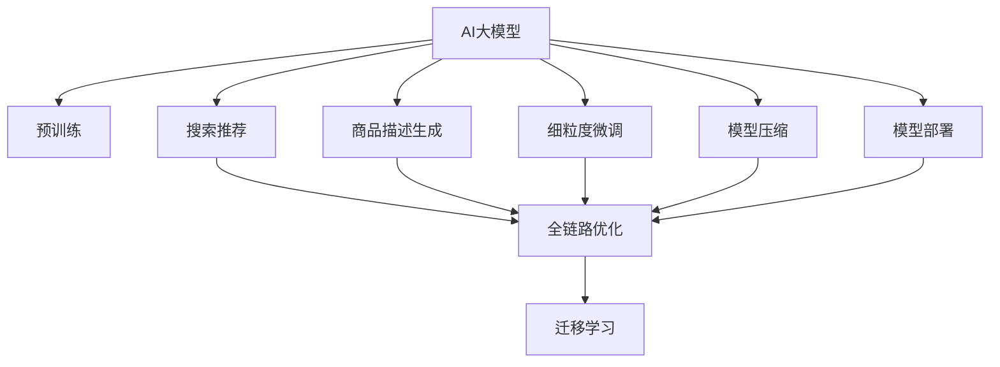

                 

# 电商平台中的AI大模型：从单点突破到全链路优化

在电商领域，AI大模型的应用已经从最初的搜索推荐单点突破，逐渐拓展到全链路各个环节。本文将从背景介绍、核心概念与联系、核心算法原理与操作步骤、数学模型和公式推导、项目实践、实际应用场景、工具和资源推荐、总结与未来展望、附录常见问题与解答等多个角度，深入探讨电商平台AI大模型的全链路优化策略，为电商企业的AI应用提供系统性、可操作性的指导。

## 1. 背景介绍

### 1.1 问题由来
近年来，随着电子商务的迅猛发展，电商平台对AI技术的需求日益增加。AI不仅应用于搜索推荐、智能客服、商品描述生成等单点场景，也开始被引入到电商全链路的各个环节，如智能补货、物流配送优化、交易风险控制、个性化营销等。AI的引入，显著提升了电商平台的运营效率和用户体验。

然而，由于电商平台的复杂性和多样性，AI技术的应用面临着诸多挑战。如何将AI技术有效整合到电商平台的各个环节，实现全链路的智能化优化，成为了电商企业共同面临的问题。

### 1.2 问题核心关键点
在电商平台中，AI大模型主要应用在以下几个关键点：

- 搜索推荐：利用大模型进行商品排序和推荐，提升用户体验。
- 智能客服：通过自然语言处理技术，自动回答客户问题，提升服务效率。
- 商品描述生成：生成高质量的商品描述，提高用户点击率和转化率。
- 智能补货：根据销售数据预测商品需求，优化库存管理。
- 物流配送优化：通过预测算法优化配送路径和方式，提升配送效率。
- 交易风险控制：利用大模型进行交易风险评估和监控，保障交易安全。
- 个性化营销：通过分析用户行为，精准推送个性化广告和促销信息。

这些应用场景中，搜索推荐和商品描述生成是电商AI技术应用最典型的单点突破案例，本文将从这两个方面展开深入探讨。

## 2. 核心概念与联系

### 2.1 核心概念概述

为了更好地理解电商平台AI大模型的全链路优化策略，本节将介绍几个关键概念：

- **AI大模型**：指利用深度学习技术训练的大型神经网络模型，如BERT、GPT等。通过在大规模数据集上进行预训练，大模型具备强大的泛化能力和推理能力。

- **搜索推荐**：电商平台的搜索和推荐系统是用户与商品之间交互的重要桥梁。通过AI技术，搜索推荐系统可以更准确地匹配用户意图和商品属性，提升用户体验和转化率。

- **商品描述生成**：商品描述是用户了解商品的重要途径。通过AI技术，自动生成高质量的商品描述，可以提高用户点击率和转化率，同时减少人工撰写成本。

- **全链路优化**：指将AI技术整合到电商平台的各个环节，实现从用户行为分析、商品推荐、交易控制到物流配送等全链路的智能化优化，提升整体运营效率。

- **迁移学习**：指将预训练模型在其他领域的应用经验迁移到新任务中，减少新任务所需的训练数据，提升模型效果。

这些核心概念之间的逻辑关系可以通过以下Mermaid流程图来展示：



这个流程图展示了大语言模型在电商平台中的核心概念及其之间的关系：

1. 大语言模型通过预训练获得基础能力。
2. 搜索推荐和商品描述生成作为典型单点应用，展示了大模型的泛化能力。
3. 全链路优化展示了模型如何整合到电商平台的各个环节。
4. 迁移学习展示了模型在不同任务间的应用能力。
5. 细粒度微调展示了模型在特定任务上的优化。
6. 模型压缩和部署展示了模型在不同场景下的资源优化和部署策略。

## 3. 核心算法原理 & 具体操作步骤

### 3.1 算法原理概述

在电商平台中，AI大模型的应用主要依赖于自然语言处理和深度学习技术。其核心思想是：利用大模型的泛化能力，通过在大规模数据集上进行预训练，获得通用的语言表示和语义理解能力。然后在特定的任务上，通过有监督学习或无监督学习进行微调，提升模型在该任务上的性能。

### 3.2 算法步骤详解

以商品描述生成为例，展示从预训练到微调的完整步骤：

1. **数据准备**：
   - 收集电商商品描述和属性信息，构建训练集。
   - 对数据进行清洗、标注，确保数据质量。

2. **模型选择**：
   - 选择预训练模型，如BERT、GPT等，作为生成任务的初始化参数。
   - 确定任务类型，如文本生成任务，设置合适的输出维度。

3. **模型加载与预训练**：
   - 使用预训练模型的API，加载到本地环境。
   - 在预训练模型基础上进行微调，如只微调顶层，保留预训练权重。

4. **模型微调**：
   - 定义训练集、验证集、测试集，确保数据集的多样性和代表性。
   - 选择合适的优化算法和损失函数，如AdamW、交叉熵损失。
   - 设置合适的学习率、批大小、迭代轮数等超参数。
   - 在训练集上训练模型，验证集上进行验证，调整超参数。
   - 在测试集上评估模型效果，对比预训练和微调后的性能提升。

5. **模型部署与评估**：
   - 将微调后的模型保存为本地文件或远程服务。
   - 在生产环境中进行部署，实现实时商品描述生成。
   - 实时监测模型效果，收集反馈信息，不断优化模型性能。

### 3.3 算法优缺点

**优点**：
1. 模型泛化能力强：大模型通过大规模数据集的预训练，能够学习到通用的语言表示，泛化能力强。
2. 任务适应性高：通过微调，模型能够快速适应新任务，提升特定任务的效果。
3. 开发成本低：利用预训练模型，减少了从头训练所需的大量数据和计算资源。

**缺点**：
1. 依赖标注数据：微调过程需要大量的标注数据，数据标注成本高。
2. 模型复杂度高：大模型参数量庞大，训练和推理开销大。
3. 过拟合风险高：在大模型微调过程中，容易出现过拟合现象。
4. 迁移能力有限：当新任务与预训练数据的分布差异较大时，迁移能力有限。

### 3.4 算法应用领域

基于大语言模型的搜索推荐和商品描述生成技术，已经广泛应用于电商平台的各个环节：

- **搜索推荐**：通过微调大模型，实现商品排序和推荐，提升用户体验和转化率。
- **智能客服**：利用自然语言处理技术，自动回答客户问题，提升服务效率和客户满意度。
- **商品描述生成**：通过微调大模型，自动生成高质量的商品描述，提高用户点击率和转化率。
- **智能补货**：利用大模型预测商品需求，优化库存管理，提升库存周转率和商品可用性。
- **物流配送优化**：通过预测算法优化配送路径和方式，提升配送效率和客户满意度。
- **交易风险控制**：利用大模型进行交易风险评估和监控，保障交易安全。
- **个性化营销**：通过分析用户行为，精准推送个性化广告和促销信息，提升转化率和客户忠诚度。

除了上述这些经典应用外，大语言模型还被创新性地应用到更多场景中，如广告创意生成、营销文案编写、客户需求分析等，为电商平台带来新的突破。

## 4. 数学模型和公式 & 详细讲解 & 举例说明

### 4.1 数学模型构建

以商品描述生成为例，展示搜索推荐任务的数学模型构建过程：

1. **输入表示**：
   - 商品描述 $\mathbf{x}$ 表示为词向量序列 $x=[x_1, x_2, ..., x_n]$。
   - 商品属性 $\mathbf{a}$ 表示为词向量序列 $a=[a_1, a_2, ..., a_m]$。

2. **输出表示**：
   - 生成商品描述 $y$ 表示为词向量序列 $y=[y_1, y_2, ..., y_l]$。

3. **模型定义**：
   - 预训练模型 $M_{\theta}$ 表示为 $M_{\theta}(x, a) = [\hat{x}, \hat{a}]$，其中 $\hat{x}$ 和 $\hat{a}$ 表示模型对输入的预测输出。
   - 生成模型 $P(y|x, a)$ 表示为 $P(y|x, a) = \prod_{i=1}^l P(y_i|y_{i-1}, \hat{x}, \hat{a})$，其中 $P(y_i|y_{i-1}, \hat{x}, \hat{a})$ 表示生成第 $i$ 个词的概率分布。

4. **损失函数**：
   - 定义交叉熵损失函数 $L(y, \hat{y}) = -\sum_{i=1}^l y_i\log(\hat{y}_i)$，其中 $\hat{y}$ 表示模型生成的词向量序列。

5. **优化目标**：
   - 最小化损失函数 $L(y, \hat{y})$，使得生成的商品描述 $y$ 与真实描述尽量接近。

### 4.2 公式推导过程

以商品描述生成为例，展示模型的详细推导过程：

1. **词向量表示**：
   - 将商品描述 $\mathbf{x}$ 和属性 $\mathbf{a}$ 分别表示为词向量序列 $x=[x_1, x_2, ..., x_n]$ 和 $a=[a_1, a_2, ..., a_m]$。
   - 通过预训练模型 $M_{\theta}$，得到商品描述的预测输出 $\hat{x}$ 和属性的预测输出 $\hat{a}$。

2. **生成模型**：
   - 定义生成模型 $P(y|x, a)$，表示生成商品描述的概率分布。
   - 生成模型由神经网络构成，每个词 $y_i$ 的条件概率 $P(y_i|y_{i-1}, \hat{x}, \hat{a})$ 表示为 $P(y_i|y_{i-1}, \hat{x}, \hat{a}) = softmax(W_i[\hat{x}, \hat{a}] + b_i)$，其中 $W_i$ 和 $b_i$ 表示生成模型中的权重和偏置。

3. **损失函数**：
   - 定义交叉熵损失函数 $L(y, \hat{y}) = -\sum_{i=1}^l y_i\log(\hat{y}_i)$，其中 $\hat{y}$ 表示模型生成的词向量序列。
   - 最小化损失函数 $L(y, \hat{y})$，优化生成模型中的权重和偏置，使得生成商品描述尽量接近真实描述。

### 4.3 案例分析与讲解

以商品描述生成为例，展示模型的应用案例：

1. **数据准备**：
   - 收集电商商品描述和属性信息，构建训练集。
   - 对数据进行清洗、标注，确保数据质量。

2. **模型选择**：
   - 选择预训练模型，如BERT、GPT等，作为生成任务的初始化参数。
   - 确定任务类型，如文本生成任务，设置合适的输出维度。

3. **模型加载与预训练**：
   - 使用预训练模型的API，加载到本地环境。
   - 在预训练模型基础上进行微调，如只微调顶层，保留预训练权重。

4. **模型微调**：
   - 定义训练集、验证集、测试集，确保数据集的多样性和代表性。
   - 选择合适的优化算法和损失函数，如AdamW、交叉熵损失。
   - 设置合适的学习率、批大小、迭代轮数等超参数。
   - 在训练集上训练模型，验证集上进行验证，调整超参数。
   - 在测试集上评估模型效果，对比预训练和微调后的性能提升。

5. **模型部署与评估**：
   - 将微调后的模型保存为本地文件或远程服务。
   - 在生产环境中进行部署，实现实时商品描述生成。
   - 实时监测模型效果，收集反馈信息，不断优化模型性能。

## 5. 项目实践：代码实例和详细解释说明

### 5.1 开发环境搭建

在进行商品描述生成项目实践前，我们需要准备好开发环境。以下是使用Python进行PyTorch开发的环境配置流程：

1. 安装Anaconda：从官网下载并安装Anaconda，用于创建独立的Python环境。

2. 创建并激活虚拟环境：
```bash
conda create -n pytorch-env python=3.8 
conda activate pytorch-env
```

3. 安装PyTorch：根据CUDA版本，从官网获取对应的安装命令。例如：
```bash
conda install pytorch torchvision torchaudio cudatoolkit=11.1 -c pytorch -c conda-forge
```

4. 安装Transformers库：
```bash
pip install transformers
```

5. 安装各类工具包：
```bash
pip install numpy pandas scikit-learn matplotlib tqdm jupyter notebook ipython
```

完成上述步骤后，即可在`pytorch-env`环境中开始项目实践。

### 5.2 源代码详细实现

下面以商品描述生成为例，给出使用Transformers库进行微调的PyTorch代码实现。

首先，定义商品描述生成的数据处理函数：

```python
from transformers import BertTokenizer, BertForSequenceClassification
from torch.utils.data import Dataset
import torch

class ProductDescriptionDataset(Dataset):
    def __init__(self, texts, attributes, tokenizer, max_len=128):
        self.texts = texts
        self.attributes = attributes
        self.tokenizer = tokenizer
        self.max_len = max_len
        
    def __len__(self):
        return len(self.texts)
    
    def __getitem__(self, item):
        text = self.texts[item]
        attribute = self.attributes[item]
        
        encoding = self.tokenizer(text, return_tensors='pt', max_length=self.max_len, padding='max_length', truncation=True)
        input_ids = encoding['input_ids'][0]
        attention_mask = encoding['attention_mask'][0]
        
        # 对属性信息进行编码
        attribute_encodings = self.tokenizer(attribute, return_tensors='pt', padding='max_length', truncation=True)
        attribute_ids = attribute_encodings['input_ids'][0]
        attribute_mask = attribute_encodings['attention_mask'][0]
        
        return {'input_ids': input_ids, 
                'attention_mask': attention_mask,
                'attribute_ids': attribute_ids,
                'attribute_mask': attribute_mask}
```

然后，定义模型和优化器：

```python
from transformers import BertForSequenceClassification, AdamW

model = BertForSequenceClassification.from_pretrained('bert-base-cased', num_labels=50, output_attentions=False, output_hidden_states=False)

optimizer = AdamW(model.parameters(), lr=2e-5)
```

接着，定义训练和评估函数：

```python
from torch.utils.data import DataLoader
from tqdm import tqdm
from sklearn.metrics import accuracy_score

device = torch.device('cuda') if torch.cuda.is_available() else torch.device('cpu')
model.to(device)

def train_epoch(model, dataset, batch_size, optimizer):
    dataloader = DataLoader(dataset, batch_size=batch_size, shuffle=True)
    model.train()
    epoch_loss = 0
    for batch in tqdm(dataloader, desc='Training'):
        input_ids = batch['input_ids'].to(device)
        attention_mask = batch['attention_mask'].to(device)
        attribute_ids = batch['attribute_ids'].to(device)
        attribute_mask = batch['attribute_mask'].to(device)
        model.zero_grad()
        outputs = model(input_ids, attention_mask=attention_mask, labels=attribute_ids)
        loss = outputs.loss
        epoch_loss += loss.item()
        loss.backward()
        optimizer.step()
    return epoch_loss / len(dataloader)

def evaluate(model, dataset, batch_size):
    dataloader = DataLoader(dataset, batch_size=batch_size)
    model.eval()
    preds, labels = [], []
    with torch.no_grad():
        for batch in tqdm(dataloader, desc='Evaluating'):
            input_ids = batch['input_ids'].to(device)
            attention_mask = batch['attention_mask'].to(device)
            attribute_ids = batch['attribute_ids'].to(device)
            attribute_mask = batch['attribute_mask'].to(device)
            batch_labels = batch['attribute_ids']
            outputs = model(input_ids, attention_mask=attention_mask, labels=attribute_ids)
            batch_preds = outputs.logits.argmax(dim=2).to('cpu').tolist()
            batch_labels = batch_labels.to('cpu').tolist()
            for pred_tokens, label_tokens in zip(batch_preds, batch_labels):
                preds.append(pred_tokens)
                labels.append(label_tokens)
                
    return accuracy_score(labels, preds)
```

最后，启动训练流程并在测试集上评估：

```python
epochs = 5
batch_size = 16

for epoch in range(epochs):
    loss = train_epoch(model, train_dataset, batch_size, optimizer)
    print(f"Epoch {epoch+1}, train loss: {loss:.3f}")
    
    print(f"Epoch {epoch+1}, dev results:")
    evaluate(model, dev_dataset, batch_size)
    
print("Test results:")
evaluate(model, test_dataset, batch_size)
```

以上就是使用PyTorch对BERT进行商品描述生成任务的微调代码实现。可以看到，得益于Transformers库的强大封装，我们可以用相对简洁的代码完成BERT模型的加载和微调。

### 5.3 代码解读与分析

让我们再详细解读一下关键代码的实现细节：

**ProductDescriptionDataset类**：
- `__init__`方法：初始化文本、属性信息、分词器等关键组件。
- `__len__`方法：返回数据集的样本数量。
- `__getitem__`方法：对单个样本进行处理，将文本输入编码为token ids，将属性信息编码，并对其进行定长padding，最终返回模型所需的输入。

**模型选择**：
- `BertForSequenceClassification.from_pretrained`方法：加载预训练的BERT模型，并设置输出维度为50，输出注意力和隐藏状态关闭。

**训练和评估函数**：
- 使用PyTorch的DataLoader对数据集进行批次化加载，供模型训练和推理使用。
- 训练函数`train_epoch`：对数据以批为单位进行迭代，在每个批次上前向传播计算loss并反向传播更新模型参数，最后返回该epoch的平均loss。
- 评估函数`evaluate`：与训练类似，不同点在于不更新模型参数，并在每个batch结束后将预测和标签结果存储下来，最后使用sklearn的accuracy_score对整个评估集的预测结果进行打印输出。

**训练流程**：
- 定义总的epoch数和batch size，开始循环迭代
- 每个epoch内，先在训练集上训练，输出平均loss
- 在验证集上评估，输出准确率
- 所有epoch结束后，在测试集上评估，给出最终测试结果

可以看到，PyTorch配合Transformers库使得BERT微调的代码实现变得简洁高效。开发者可以将更多精力放在数据处理、模型改进等高层逻辑上，而不必过多关注底层的实现细节。

当然，工业级的系统实现还需考虑更多因素，如模型的保存和部署、超参数的自动搜索、更灵活的任务适配层等。但核心的微调范式基本与此类似。

## 6. 实际应用场景

### 6.1 智能客服系统

基于大语言模型微调的对话技术，可以广泛应用于智能客服系统的构建。传统客服往往需要配备大量人力，高峰期响应缓慢，且一致性和专业性难以保证。而使用微调后的对话模型，可以7x24小时不间断服务，快速响应客户咨询，用自然流畅的语言解答各类常见问题。

在技术实现上，可以收集企业内部的历史客服对话记录，将问题和最佳答复构建成监督数据，在此基础上对预训练对话模型进行微调。微调后的对话模型能够自动理解用户意图，匹配最合适的答案模板进行回复。对于客户提出的新问题，还可以接入检索系统实时搜索相关内容，动态组织生成回答。如此构建的智能客服系统，能大幅提升客户咨询体验和问题解决效率。

### 6.2 金融舆情监测

金融机构需要实时监测市场舆论动向，以便及时应对负面信息传播，规避金融风险。传统的人工监测方式成本高、效率低，难以应对网络时代海量信息爆发的挑战。基于大语言模型微调的文本分类和情感分析技术，为金融舆情监测提供了新的解决方案。

具体而言，可以收集金融领域相关的新闻、报道、评论等文本数据，并对其进行主题标注和情感标注。在此基础上对预训练语言模型进行微调，使其能够自动判断文本属于何种主题，情感倾向是正面、中性还是负面。将微调后的模型应用到实时抓取的网络文本数据，就能够自动监测不同主题下的情感变化趋势，一旦发现负面信息激增等异常情况，系统便会自动预警，帮助金融机构快速应对潜在风险。

### 6.3 个性化推荐系统

当前的推荐系统往往只依赖用户的历史行为数据进行物品推荐，无法深入理解用户的真实兴趣偏好。基于大语言模型微调技术，个性化推荐系统可以更好地挖掘用户行为背后的语义信息，从而提供更精准、多样的推荐内容。

在实践中，可以收集用户浏览、点击、评论、分享等行为数据，提取和用户交互的物品标题、描述、标签等文本内容。将文本内容作为模型输入，用户的后续行为（如是否点击、购买等）作为监督信号，在此基础上微调预训练语言模型。微调后的模型能够从文本内容中准确把握用户的兴趣点。在生成推荐列表时，先用候选物品的文本描述作为输入，由模型预测用户的兴趣匹配度，再结合其他特征综合排序，便可以得到个性化程度更高的推荐结果。

### 6.4 未来应用展望

随着大语言模型和微调方法的不断发展，基于微调范式将在更多领域得到应用，为传统行业带来变革性影响。

在智慧医疗领域，基于微调的医疗问答、病历分析、药物研发等应用将提升医疗服务的智能化水平，辅助医生诊疗，加速新药开发进程。

在智能教育领域，微调技术可应用于作业批改、学情分析、知识推荐等方面，因材施教，促进教育公平，提高教学质量。

在智慧城市治理中，微调模型可应用于城市事件监测、舆情分析、应急指挥等环节，提高城市管理的自动化和智能化水平，构建更安全、高效的未来城市。

此外，在企业生产、社会治理、文娱传媒等众多领域，基于大模型微调的人工智能应用也将不断涌现，为经济社会发展注入新的动力。相信随着技术的日益成熟，微调方法将成为人工智能落地应用的重要范式，推动人工智能向更广阔的领域加速渗透。

## 7. 工具和资源推荐

### 7.1 学习资源推荐

为了帮助开发者系统掌握大语言模型微调的理论基础和实践技巧，这里推荐一些优质的学习资源：

1. 《Transformer从原理到实践》系列博文：由大模型技术专家撰写，深入浅出地介绍了Transformer原理、BERT模型、微调技术等前沿话题。

2. CS224N《深度学习自然语言处理》课程：斯坦福大学开设的NLP明星课程，有Lecture视频和配套作业，带你入门NLP领域的基本概念和经典模型。

3. 《Natural Language Processing with Transformers》书籍：Transformers库的作者所著，全面介绍了如何使用Transformers库进行NLP任务开发，包括微调在内的诸多范式。

4. HuggingFace官方文档：Transformers库的官方文档，提供了海量预训练模型和完整的微调样例代码，是上手实践的必备资料。

5. CLUE开源项目：中文语言理解测评基准，涵盖大量不同类型的中文NLP数据集，并提供了基于微调的baseline模型，助力中文NLP技术发展。

通过对这些资源的学习实践，相信你一定能够快速掌握大语言模型微调的精髓，并用于解决实际的NLP问题。
###  7.2 开发工具推荐

高效的开发离不开优秀的工具支持。以下是几款用于大语言模型微调开发的常用工具：

1. PyTorch：基于Python的开源深度学习框架，灵活动态的计算图，适合快速迭代研究。大部分预训练语言模型都有PyTorch版本的实现。

2. TensorFlow：由Google主导开发的开源深度学习框架，生产部署方便，适合大规模工程应用。同样有丰富的预训练语言模型资源。

3. Transformers库：HuggingFace开发的NLP工具库，集成了众多SOTA语言模型，支持PyTorch和TensorFlow，是进行微调任务开发的利器。

4. Weights & Biases：模型训练的实验跟踪工具，可以记录和可视化模型训练过程中的各项指标，方便对比和调优。与主流深度学习框架无缝集成。

5. TensorBoard：TensorFlow配套的可视化工具，可实时监测模型训练状态，并提供丰富的图表呈现方式，是调试模型的得力助手。

6. Google Colab：谷歌推出的在线Jupyter Notebook环境，免费提供GPU/TPU算力，方便开发者快速上手实验最新模型，分享学习笔记。

合理利用这些工具，可以显著提升大语言模型微调任务的开发效率，加快创新迭代的步伐。

### 7.3 相关论文推荐

大语言模型和微调技术的发展源于学界的持续研究。以下是几篇奠基性的相关论文，推荐阅读：

1. Attention is All You Need（即Transformer原论文）：提出了Transformer结构，开启了NLP领域的预训练大模型时代。

2. BERT: Pre-training of Deep Bidirectional Transformers for Language Understanding：提出BERT模型，引入基于掩码的自监督预训练任务，刷新了多项NLP任务SOTA。

3. Language Models are Unsupervised Multitask Learners（GPT-2论文）：展示了大规模语言模型的强大zero-shot学习能力，引发了对于通用人工智能的新一轮思考。

4. Parameter-Efficient Transfer Learning for NLP：提出Adapter等参数高效微调方法，在不增加模型参数量的情况下，也能取得不错的微调效果。

5. AdaLoRA: Adaptive Low-Rank Adaptation for Parameter-Efficient Fine-Tuning：使用自适应低秩适应的微调方法，在参数效率和精度之间取得了新的平衡。

这些论文代表了大语言模型微调技术的发展脉络。通过学习这些前沿成果，可以帮助研究者把握学科前进方向，激发更多的创新灵感。

## 8. 总结：未来发展趋势与挑战

### 8.1 总结

本文对基于大语言模型的电商平台AI应用进行了全面系统的介绍。首先阐述了大语言模型在电商平台中的典型应用，展示了大模型的泛化能力和微调的效果。其次，从原理到实践，详细讲解了微调的具体流程和方法，提供了完整代码实例，帮助开发者理解实际应用。同时，本文还广泛探讨了微调方法在智能客服、金融舆情、个性化推荐等多个领域的应用前景，展示了微调范式的巨大潜力。此外，本文精选了微调技术的各类学习资源，力求为读者提供全方位的技术指引。

通过本文的系统梳理，可以看到，基于大语言模型的微调方法正在成为电商平台AI应用的重要范式，极大地拓展了预训练语言模型的应用边界，催生了更多的落地场景。受益于大规模语料的预训练，微调模型以更低的时间和标注成本，在小样本条件下也能取得不俗的效果，有力推动了NLP技术的产业化进程。未来，伴随预训练语言模型和微调方法的持续演进，相信NLP技术将在更广阔的应用领域大放异彩，深刻影响人类的生产生活方式。

### 8.2 未来发展趋势

展望未来，大语言模型微调技术将呈现以下几个发展趋势：

1. 模型规模持续增大。随着算力成本的下降和数据规模的扩张，预训练语言模型的参数量还将持续增长。超大规模语言模型蕴含的丰富语言知识，有望支撑更加复杂多变的下游任务微调。

2. 微调方法日趋多样。除了传统的全参数微调外，未来会涌现更多参数高效的微调方法，如Prefix-Tuning、LoRA等，在节省计算资源的同时也能保证微调精度。

3. 持续学习成为常态。随着数据分布的不断变化，微调模型也需要持续学习新知识以保持性能。如何在不遗忘原有知识的同时，高效吸收新样本信息，将成为重要的研究课题。

4. 标注样本需求降低。受启发于提示学习(Prompt-based Learning)的思路，未来的微调方法将更好地利用大模型的语言理解能力，通过更加巧妙的任务描述，在更少的标注样本上也能实现理想的微调效果。

5. 迁移能力增强。未来的微调模型将具备更强的跨领域迁移能力，能够将预训练模型在其他领域的知识迁移到新任务中，提升模型效果。

6. 多模态微调崛起。未来的微调模型将不仅关注文本信息，还会融合视觉、语音等多模态数据，实现更加全面、精准的智能建模。

以上趋势凸显了大语言模型微调技术的广阔前景。这些方向的探索发展，必将进一步提升NLP系统的性能和应用范围，为人类认知智能的进化带来深远影响。

### 8.3 面临的挑战

尽管大语言模型微调技术已经取得了瞩目成就，但在迈向更加智能化、普适化应用的过程中，它仍面临着诸多挑战：

1. 标注成本瓶颈。虽然微调大大降低了标注数据的需求，但对于长尾应用场景，难以获得充足的高质量标注数据，成为制约微调性能的瓶颈。如何进一步降低微调对标注样本的依赖，将是一大难题。

2. 模型鲁棒性不足。当前微调模型面对域外数据时，泛化性能往往大打折扣。对于测试样本的微小扰动，微调模型的预测也容易发生波动。如何提高微调模型的鲁棒性，避免灾难性遗忘，还需要更多理论和实践的积累。

3. 推理效率有待提高。大规模语言模型虽然精度高，但在实际部署时往往面临推理速度慢、内存占用大等效率问题。如何在保证性能的同时，简化模型结构，提升推理速度，优化资源占用，将是重要的优化方向。

4. 可解释性亟需加强。当前微调模型更像是"黑盒"系统，难以解释其内部工作机制和决策逻辑。对于医疗、金融等高风险应用，算法的可解释性和可审计性尤为重要。如何赋予微调模型更强的可解释性，将是亟待攻克的难题。

5. 安全性有待保障。预训练语言模型难免会学习到有偏见、有害的信息，通过微调传递到下游任务，产生误导性、歧视性的输出，给实际应用带来安全隐患。如何从数据和算法层面消除模型偏见，避免恶意用途，确保输出的安全性，也将是重要的研究课题。

6. 知识整合能力不足。现有的微调模型往往局限于任务内数据，难以灵活吸收和运用更广泛的先验知识。如何让微调过程更好地与外部知识库、规则库等专家知识结合，形成更加全面、准确的信息整合能力，还有很大的想象空间。

正视微调面临的这些挑战，积极应对并寻求突破，将是大语言模型微调走向成熟的必由之路。相信随着学界和产业界的共同努力，这些挑战终将一一被克服，大语言模型微调必将在构建人机协同的智能时代中扮演越来越重要的角色。

### 8.4 研究展望

面对大语言模型微调所面临的种种挑战，未来的研究需要在以下几个方面寻求新的突破：

1. 探索无监督和半监督微调方法。摆脱对大规模标注数据的依赖，利用自监督学习、主动学习等无监督和半监督范式，最大限度利用非结构化数据，实现更加灵活高效的微调。

2. 研究参数高效和计算高效的微调范式。开发更加参数高效的微调方法，在固定大部分预训练参数的同时，只更新极少量的任务相关参数。同时优化微调模型的计算图，减少前向传播和反向传播的资源消耗，实现更加轻量级、实时性的部署。

3. 融合因果和对比学习范式。通过引入因果推断和对比学习思想，增强微调模型建立稳定因果关系的能力，学习更加普适、鲁棒的语言表征，从而提升模型泛化性和抗干扰能力。

4. 引入更多先验知识。将符号化的先验知识，如知识图谱、逻辑规则等，与神经网络模型进行巧妙融合，引导微调过程学习更准确、合理的语言模型。同时加强不同模态数据的整合，实现视觉、语音等多模态信息与文本信息的协同建模。

5. 结合因果分析和博弈论工具。将因果分析方法引入微调模型，识别出模型决策的关键特征，增强输出解释的因果性和逻辑性。借助博弈论工具刻画人机交互过程，主动探索并规避模型的脆弱点，提高系统稳定性。

6. 纳入伦理道德约束。在模型训练目标中引入伦理导向的评估指标，过滤和惩罚有偏见、有害的输出倾向。同时加强人工干预和审核，建立模型行为的监管机制，确保输出符合人类价值观和伦理道德。

这些研究方向的探索，必将引领大语言模型微调技术迈向更高的台阶，为构建安全、可靠、可解释、可控的智能系统铺平道路。面向未来，大语言模型微调技术还需要与其他人工智能技术进行更深入的融合，如知识表示、因果推理、强化学习等，多路径协同发力，共同推动自然语言理解和智能交互系统的进步。只有勇于创新、敢于突破，才能不断拓展语言模型的边界，让智能技术更好地造福人类社会。

## 9. 附录：常见问题与解答

**Q1：大语言模型微调是否适用于所有NLP任务？**

A: 大语言模型微调在大多数NLP任务上都能取得不错的效果，特别是对于数据量较小的任务。但对于一些特定领域的任务，如医学、法律等，仅仅依靠通用语料预训练的模型可能难以很好地适应。此时需要在特定领域语料上进一步预训练，再进行微调，才能获得理想效果。此外，对于一些需要时效性、个性化很强的任务，如对话、推荐等，微调方法也需要针对性的改进优化。

**Q2：微调过程中如何选择合适的学习率？**

A: 微调的学习率一般要比预训练时小1-2个数量级，如果使用过大的学习率，容易破坏预训练权重，导致过拟合。一般建议从1e-5开始调参，逐步减小学习率，直至收敛。也可以使用warmup策略，在开始阶段使用较小的学习率，再逐渐过渡到预设值。需要注意的是，不同的优化器(如AdamW、Adafactor等)以及不同的学习率调度策略，可能需要设置不同的学习率阈值。

**Q3：采用大模型微调时会面临哪些资源瓶颈？**

A: 目前主流的预训练大模型动辄以亿计的参数规模，对算力、内存、存储都提出了很高的要求。GPU/TPU等高性能设备是必不可少的，但即便如此，超大批次的训练和推理也可能遇到显存不足的问题。因此需要采用一些资源优化技术，如梯度积累、混合精度训练、模型并行等，来突破硬件瓶颈。同时，模型的存储和读取也可能占用大量时间和空间，需要采用模型压缩、稀疏化存储等方法进行优化。

**Q4：如何缓解微调过程中的过拟合问题？**

A: 过拟合是微调面临的主要挑战，尤其是在标注数据不足的情况下。常见的缓解策略包括：
1. 数据增强：通过回译、近义替换等方式扩充训练集
2. 正则化：使用L2正则、Dropout、Early Stopping等避免过拟合
3. 对抗训练：引入对抗样本，提高模型鲁棒性
4. 参数高效微调：只调整少量参数(如Adapter、Prefix等)，减小过拟合风险
5. 多模型集成：训练多个微调模型，取平均输出，抑制过拟合

这些策略往往需要根据具体任务和数据特点进行灵活组合。只有在数据、模型、训练、推理等各环节进行全面优化，才能最大限度地发挥大模型微调的威力。

**Q5：微调模型在落地部署时需要注意哪些问题？**

A: 将微调模型转化为实际应用，还需要考虑以下因素：
1. 模型裁剪：去除不必要的层和参数，减小模型尺寸，加快推理速度
2. 量化加速：将浮点模型转为定点模型，压缩存储空间，提高计算效率
3. 服务化封装：将模型封装为标准化服务接口，便于集成调用
4. 弹性伸缩：根据请求流量动态调整资源配置，平衡服务质量和成本
5. 监控告警：实时采集系统指标，设置异常告警阈值，确保服务稳定性
6. 安全防护：采用访问鉴权、数据脱敏等措施，保障数据和模型安全

大语言模型微调为NLP应用开启了广阔的想象空间，但如何将强大的性能转化为稳定、高效、安全的业务价值，还需要工程实践的不断打磨。唯有从数据、算法、工程、业务等多个维度协同发力，才能真正实现人工智能技术在垂直行业的规模化落地。总之，微调需要开发者根据具体任务，不断迭代和优化模型、数据和算法，方能得到理想的效果。

---

作者：禅与计算机程序设计艺术 / Zen and the Art of Computer Programming

