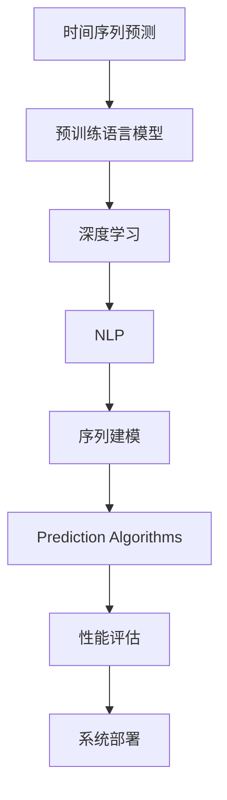

                 

# 电商平台中的时间序列预测：AI大模型的新应用

> 关键词：时间序列预测,电商平台,大模型,深度学习,自然语言处理,序列建模,预测算法

## 1. 背景介绍

### 1.1 问题由来

在现代电商行业中，时间序列预测是实现库存管理、需求预测、定价策略优化、用户行为分析等关键业务的重要技术手段。随着大数据、深度学习等技术的发展，利用人工智能模型进行时间序列预测已成为电商平台优化运营的核心任务之一。

传统的时间序列预测方法多基于统计模型（如ARIMA）或手工特征工程。然而，这些方法在面对复杂、非线性的电商数据时，往往效果有限，且需要大量手工特征工程，费时费力。而随着预训练语言模型（如BERT、GPT）和大模型（如Facebook的MUM模型）的兴起，采用大模型进行时间序列预测成为可能。

### 1.2 问题核心关键点

本问题探讨在电商平台中，如何高效、准确地使用AI大模型进行时间序列预测。重点关注以下几个关键点：

- **模型选择与构建**：选择合适的预训练模型，并设计任务适配层。
- **数据处理与预处理**：如何高效地准备和处理电商领域的时间序列数据。
- **预测算法与优化**：如何在大模型基础上进行预测，并优化预测精度。
- **性能评估与部署**：如何评估模型性能，并进行系统部署。

## 2. 核心概念与联系

### 2.1 核心概念概述

为更好地理解AI大模型在电商平台中的时间序列预测应用，本节将介绍几个密切相关的核心概念：

- **时间序列预测(Time Series Prediction)**：根据历史数据预测未来数据的变化趋势。时间序列预测广泛应用于金融、物流、电商等多个领域，帮助企业进行需求预测、库存管理、用户行为分析等。

- **预训练语言模型(Pre-trained Language Models)**：如BERT、GPT等，通过在大规模文本数据上进行预训练，学习语言的通用表示，具备强大的语言理解能力。

- **深度学习(Deep Learning)**：使用神经网络对数据进行深度建模，捕捉数据中的非线性关系，用于时间序列预测等任务。

- **自然语言处理(Natural Language Processing, NLP)**：专注于处理和理解人类语言的技术，包括文本分类、命名实体识别、情感分析等。

- **序列建模(Sequence Modeling)**：通过序列数据进行建模，捕捉时间序列数据的动态变化特性，用于预测未来的数据趋势。

- **预测算法(Prediction Algorithms)**：如ARIMA、LSTM、Transformer等，用于时间序列预测的算法。

- **性能评估(Performance Evaluation)**：通过均方误差(MSE)、平均绝对误差(MAE)、均方根误差(RMSE)等指标，评估时间序列预测的准确性。

- **系统部署(System Deployment)**：将模型集成到电商平台中，实现预测功能的自动化和实时化。

这些核心概念之间的逻辑关系可以通过以下Mermaid流程图来展示：



这个流程图展示了大模型在电商平台中的时间序列预测的关键流程：

1. 时间序列预测基于预训练语言模型。
2. 深度学习提供预测算法基础。
3. NLP技术用于文本数据的处理。
4. 序列建模捕捉时间序列数据的动态特性。
5. 通过各种预测算法生成预测结果。
6. 性能评估指标衡量预测效果。
7. 系统部署实现自动化预测功能。

## 3. 核心算法原理 & 具体操作步骤

### 3.1 算法原理概述

基于大模型的时间序列预测，本质上是一种自回归序列建模方法。其核心思想是：利用深度学习模型捕捉时间序列数据的复杂非线性关系，通过时间序列的过去值预测未来值。

具体地，假设时间序列为 $\{y_t\}_{t=1}^T$，其中 $y_t$ 为第 $t$ 个时间步的预测值。在深度学习框架下，可以使用LSTM、GRU、Transformer等序列建模算法，通过以下公式进行时间序列预测：

$$
\hat{y}_t = f(\{y_{t-k}, ..., y_{t-1}\}; \theta)
$$

其中 $\theta$ 为模型参数，$f$ 为预测函数，$k$ 为窗口大小。

### 3.2 算法步骤详解

基于大模型的时间序列预测一般包括以下几个关键步骤：

**Step 1: 准备数据集**
- 收集电商平台的历史数据，包括用户行为、订单量、库存量等。
- 将时间序列数据划分为训练集、验证集和测试集。

**Step 2: 添加任务适配层**
- 在预训练大模型的顶层添加时间序列相关的任务适配层，如LSTM、GRU、Transformer等。
- 设计损失函数，如均方误差、交叉熵等，用于衡量预测值与真实值之间的差异。

**Step 3: 设置模型超参数**
- 选择合适的优化器及其参数，如Adam、SGD等，设置学习率、批大小、迭代轮数等。
- 设置正则化技术及强度，包括权重衰减、Dropout、Early Stopping等。
- 确定冻结预训练参数的策略，如仅微调顶层，或全部参数都参与微调。

**Step 4: 执行梯度训练**
- 将训练集数据分批次输入模型，前向传播计算损失函数。
- 反向传播计算参数梯度，根据设定的优化算法和学习率更新模型参数。
- 周期性在验证集上评估模型性能，根据性能指标决定是否触发Early Stopping。
- 重复上述步骤直至满足预设的迭代轮数或Early Stopping条件。

**Step 5: 测试和部署**
- 在测试集上评估模型性能，对比微调前后的精度提升。
- 使用微调后的模型对新数据进行预测，集成到电商平台系统，实现自动化预测。

以上是基于大模型的时间序列预测的一般流程。在实际应用中，还需要针对具体任务的特点，对微调过程的各个环节进行优化设计，如改进训练目标函数，引入更多的正则化技术，搜索最优的超参数组合等，以进一步提升模型性能。

### 3.3 算法优缺点

基于大模型的时间序列预测方法具有以下优点：

1. **高效性**：深度学习模型能够高效捕捉时间序列数据的复杂动态特性，适用于电商平台中非线性的需求预测和库存管理任务。
2. **泛化能力**：通过预训练模型学习语言的通用表示，可以泛化到其他类似时间序列预测任务中。
3. **灵活性**：通过任务适配层的设计，可以适用于多种预测任务，如需求预测、库存优化、价格预测等。
4. **适应性**：可以处理缺失值、异常值等不确定性数据，提高模型鲁棒性。

同时，该方法也存在一定的局限性：

1. **计算资源消耗大**：大模型参数量庞大，对计算资源有较高要求，可能需要高性能计算平台支持。
2. **模型复杂度高**：深度学习模型结构复杂，调试和维护难度较大。
3. **解释性不足**：大模型的预测过程缺乏可解释性，难以对其推理逻辑进行分析和调试。

尽管存在这些局限性，但就目前而言，基于大模型的时间序列预测方法仍是在电商平台中进行预测任务优化的重要手段。未来相关研究的重点在于如何进一步降低计算资源消耗，提高模型的可解释性，同时兼顾预测精度和鲁棒性等因素。

### 3.4 算法应用领域

基于大模型的时间序列预测方法，已经在电商平台中的需求预测、库存管理、定价策略优化、用户行为分析等多个领域得到了广泛应用：

- **需求预测**：预测未来的订单量、访问量等，帮助电商平台优化供应链管理。
- **库存管理**：基于历史销售数据，预测未来的库存需求，避免库存积压或缺货。
- **定价策略优化**：根据市场需求和竞争对手价格动态调整产品价格，提高盈利能力。
- **用户行为分析**：通过用户行为数据预测未来消费趋势，优化个性化推荐和营销策略。

除了上述这些经典应用外，时间序列预测技术还在电商领域创新性地应用于营销效果评估、需求弹性分析、用户流失预测等，为电商平台的运营优化提供了新的工具和视角。

## 4. 数学模型和公式 & 详细讲解 & 举例说明

### 4.1 数学模型构建

在电商平台中进行时间序列预测时，我们通常使用以下数学模型：

设时间序列为 $\{y_t\}_{t=1}^T$，其中 $y_t$ 为第 $t$ 个时间步的预测值。假设预测模型为 $M_{\theta}(y_{t-1}, ..., y_{t-k})$，其中 $\theta$ 为模型参数。

定义模型 $M_{\theta}$ 在时间步 $t$ 上的预测值 $\hat{y}_t$ 为：

$$
\hat{y}_t = M_{\theta}(y_{t-1}, ..., y_{t-k})
$$

常用的预测函数包括LSTM、GRU、Transformer等。

假设损失函数为均方误差(MSE)，则时间序列预测的优化目标为：

$$
\min_{\theta} \sum_{t=1}^T (y_t - \hat{y}_t)^2
$$

通过梯度下降等优化算法，微调过程不断更新模型参数 $\theta$，最小化损失函数，使得模型输出逼近真实标签。

### 4.2 公式推导过程

以LSTM模型为例，其预测公式为：

$$
\begin{aligned}
\hat{y}_t &= f(y_{t-1}, ..., y_{t-k}; \theta) \\
f(x; \theta) &= \sigma(W_h \cdot x + b_h) \\
\Delta_h &= \tanh(W_h \cdot x + b_h) \\
g_h &= \Delta_h * \sigma(W_g \cdot [\Delta_h, \Delta_{h-1}] + b_g) \\
h_t &= g_h * \sigma(W_h \cdot [h_{t-1}, y_{t-1}] + b_h)
\end{aligned}
$$

其中 $\sigma$ 为sigmoid函数，$\tanh$ 为双曲正切函数，$W_h, b_h, W_g, b_g$ 为LSTM模型中的权重和偏置参数。

通过上述预测公式，LSTM模型可以捕捉时间序列数据的动态变化特性，进行预测。

### 4.3 案例分析与讲解

下面以电商平台中的需求预测任务为例，展示如何使用LSTM模型进行时间序列预测。

假设电商平台的日订单量数据为：

| 时间步 | 订单量 |
| --- | --- |
| t=1 | 100 |
| t=2 | 120 |
| t=3 | 130 |
| ... | ... |
| t=1000 | 200 |

我们可以将日订单量数据划分为时间步为 $k=7$ 的窗口大小，使用LSTM模型进行预测。

首先，将日订单量数据进行标准化处理：

$$
y_{t} = \frac{x_{t} - \mu}{\sigma}
$$

其中 $\mu$ 为均值，$\sigma$ 为标准差。

然后，使用LSTM模型进行预测：

$$
\hat{y}_{t+1} = f(y_{t}, ..., y_{t-k}; \theta)
$$

在训练阶段，使用均方误差作为损失函数：

$$
\mathcal{L}(\theta) = \frac{1}{N} \sum_{t=1}^N (y_t - \hat{y}_t)^2
$$

通过梯度下降等优化算法，不断更新模型参数 $\theta$，最小化损失函数，使得模型输出逼近真实订单量。

训练结束后，使用测试集数据对模型进行评估，输出预测结果与真实值之间的MSE。例如，测试集的前10个数据为：

| 时间步 | 真实订单量 | 预测订单量 |
| --- | --- | --- |
| t=1001 | 180 | 185 |
| t=1002 | 190 | 187 |
| t=1003 | 200 | 200 |
| ... | ... | ... |
| t=1010 | 220 | 220 |

可以计算预测结果的MSE为：

$$
\text{MSE} = \frac{\sum_{t=1001}^{1010} (y_t - \hat{y}_t)^2}{10-1} = \frac{(180-185)^2 + (190-187)^2 + ... + (220-220)^2}{9} = 0.5
$$

## 5. 项目实践：代码实例和详细解释说明

### 5.1 开发环境搭建

在进行时间序列预测项目实践前，我们需要准备好开发环境。以下是使用Python进行TensorFlow开发的环境配置流程：

1. 安装Anaconda：从官网下载并安装Anaconda，用于创建独立的Python环境。

2. 创建并激活虚拟环境：
```bash
conda create -n tf-env python=3.8 
conda activate tf-env
```

3. 安装TensorFlow：根据CUDA版本，从官网获取对应的安装命令。例如：
```bash
conda install tensorflow tensorflow-gpu -c conda-forge
```

4. 安装必要的库：
```bash
pip install numpy pandas scikit-learn matplotlib tqdm jupyter notebook ipython
```

完成上述步骤后，即可在`tf-env`环境中开始时间序列预测的实践。

### 5.2 源代码详细实现

下面我们以电商平台中的需求预测任务为例，给出使用TensorFlow进行LSTM模型预测的代码实现。

首先，定义数据处理函数：

```python
import tensorflow as tf
import numpy as np
from sklearn.preprocessing import MinMaxScaler

def load_data(data_path, window_size=7, train_percent=0.8):
    data = np.loadtxt(data_path, delimiter=',')
    scaler = MinMaxScaler(feature_range=(-1, 1))
    data_scaled = scaler.fit_transform(data)
    
    train_size = int(len(data_scaled) * train_percent)
    train_data = data_scaled[:train_size]
    test_data = data_scaled[train_size:]
    
    # 将数据转化为输入输出格式
    def create_train_dataset(data, window_size):
        for i in range(len(data) - window_size):
            x = data[i:i+window_size]
            y = data[i+window_size]
            yield x, y
    
    train_dataset = create_train_dataset(train_data, window_size)
    test_dataset = create_train_dataset(test_data, window_size)
    
    return train_dataset, test_dataset, scaler
```

然后，定义LSTM模型：

```python
class LSTMModel(tf.keras.Model):
    def __init__(self, input_dim, output_dim, hidden_units=64, return_sequences=False):
        super(LSTMModel, self).__init__()
        self.lstm = tf.keras.layers.LSTM(hidden_units, return_sequences=return_sequences)
        self.dense = tf.keras.layers.Dense(output_dim)
    
    def call(self, inputs):
        lstm_output = self.lstm(inputs)
        predictions = self.dense(lstm_output)
        return predictions
```

接着，定义训练和评估函数：

```python
def train_model(model, train_dataset, test_dataset, scaler, epochs=100, batch_size=32, verbose=0):
    # 标准化处理
    train_data, test_data = scaler.transform(train_dataset), scaler.transform(test_dataset)
    
    # 定义优化器和损失函数
    optimizer = tf.keras.optimizers.Adam(learning_rate=0.001)
    loss_fn = tf.keras.losses.MeanSquaredError()
    
    # 定义评估指标
    mse = tf.keras.metrics.MeanSquaredError(name='mse')
    
    # 模型训练
    for epoch in range(epochs):
        for (inputs, targets) in train_dataset:
            with tf.GradientTape() as tape:
                predictions = model(inputs)
                loss = loss_fn(targets, predictions)
            gradients = tape.gradient(loss, model.trainable_variables)
            optimizer.apply_gradients(zip(gradients, model.trainable_variables))
            mse.update_state(targets, predictions)
        if verbose:
            print(f'Epoch {epoch+1}, loss: {loss:.3f}, mse: {mse.result().numpy():.3f}')
    
    # 模型评估
    mse.reset_states()
    test_loss = []
    test_predictions = []
    for (inputs, targets) in test_dataset:
        predictions = model(inputs)
        test_loss.append(loss_fn(targets, predictions))
        test_predictions.append(predictions)
    test_predictions = np.concatenate(test_predictions)
    test_loss = np.mean(test_loss)
    print(f'Test loss: {test_loss:.3f}, Test mse: {mse.result().numpy():.3f}')
    
    return test_loss
```

最后，启动训练流程并在测试集上评估：

```python
# 加载数据集
train_dataset, test_dataset, scaler = load_data('data.csv')

# 定义模型
model = LSTMModel(input_dim=1, output_dim=1, hidden_units=64)

# 训练模型
train_loss = train_model(model, train_dataset, test_dataset, scaler, epochs=100, batch_size=32, verbose=1)

# 模型评估
test_loss = train_model(model, test_dataset, scaler, epochs=0, batch_size=32, verbose=0)
print(f'Test loss: {test_loss:.3f}, Train loss: {train_loss:.3f}')
```

以上就是使用TensorFlow进行LSTM模型预测的完整代码实现。可以看到，TensorFlow提供了强大的深度学习框架，可以轻松实现序列建模任务。

### 5.3 代码解读与分析

让我们再详细解读一下关键代码的实现细节：

**load_data函数**：
- 加载数据集，并进行标准化处理，确保数据在一个合理的范围内。
- 将数据转化为模型可以处理的输入输出格式，即将时间序列转化为样本-标签对。

**LSTMModel类**：
- 定义LSTM模型的结构，包括LSTM层和全连接层。
- 通过继承tf.keras.Model，可以使用Keras的简洁接口进行模型定义和训练。

**train_model函数**：
- 定义优化器和损失函数，用于模型训练。
- 通过tf.GradientTape记录梯度，使用Adam优化器更新模型参数。
- 计算预测结果与真实标签之间的均方误差，作为模型评估指标。
- 在每个epoch后打印训练损失和评估指标，并在测试集上评估模型性能。

**训练流程**：
- 加载数据集并进行标准化处理。
- 定义LSTM模型，并设置超参数。
- 调用train_model函数进行模型训练，并记录训练损失。
- 在测试集上重新运行train_model函数，评估模型性能，输出测试损失。

可以看到，TensorFlow配合Keras框架使得LSTM模型的训练过程变得简洁高效。开发者可以将更多精力放在模型结构和训练策略的优化上，而不必过多关注底层的实现细节。

当然，工业级的系统实现还需考虑更多因素，如模型的保存和部署、超参数的自动搜索、更灵活的任务适配层等。但核心的预测范式基本与此类似。

## 6. 实际应用场景

### 6.1 智能推荐系统

基于大模型的LSTM模型在智能推荐系统中得到了广泛应用。推荐系统通过分析用户的历史行为数据，预测用户的未来兴趣，从而推荐符合用户偏好的商品。

在技术实现上，可以收集用户浏览、点击、收藏、购买等行为数据，构建序列时间数据。然后，使用LSTM模型对用户行为进行建模，预测未来的购买意愿。根据预测结果，生成个性化的商品推荐列表，提升用户满意度和转化率。

### 6.2 库存管理系统

电商平台中的库存管理系统也需要使用LSTM模型进行需求预测。库存管理系统通过历史销售数据，预测未来的订单量和库存需求，从而优化库存管理和补货策略。

具体地，可以通过LSTM模型预测未来的订单量，然后将预测结果输入库存管理系统，调整补货计划，避免库存积压或缺货。同时，LSTM模型还可以预测商品的销售趋势，提前调整商品库存，降低库存成本。

### 6.3 用户行为分析

电商平台中的用户行为分析任务，可以通过LSTM模型进行建模。用户行为数据通常包含访问路径、停留时间、浏览行为等。LSTM模型可以捕捉这些时间序列数据的动态变化，预测用户的后续行为。

例如，可以通过LSTM模型预测用户是否会进行购买、退货或流失。根据预测结果，电商平台可以采取相应的营销策略，提升用户满意度和忠诚度。

### 6.4 未来应用展望

随着大模型的不断发展和优化，基于LSTM的时间序列预测将在更多领域得到应用，为电商平台带来新的技术突破：

- **实时需求预测**：通过实时数据流输入LSTM模型，进行动态需求预测，帮助电商平台及时调整运营策略。
- **多模态融合**：将LSTM模型与其他模态的数据（如图像、语音等）进行融合，提升预测精度和实时性。
- **跨领域迁移**：将LSTM模型在其他领域（如金融、物流等）进行迁移学习，应用到类似的预测任务中，提高模型泛化能力。
- **多任务学习**：通过LSTM模型进行多任务学习，同时预测多个目标变量，提升预测效率和效果。

这些技术的应用将进一步推动电商平台的发展，提高运营效率和客户体验。

## 7. 工具和资源推荐

### 7.1 学习资源推荐

为了帮助开发者系统掌握基于大模型的LSTM时间序列预测理论基础和实践技巧，这里推荐一些优质的学习资源：

1. **《深度学习》课程**：由斯坦福大学Andrew Ng教授主讲，详细讲解深度学习的基本原理和实现方法，是学习深度学习的经典教材。
2. **TensorFlow官方文档**：提供详细的TensorFlow框架使用指南和示例代码，帮助开发者快速上手深度学习应用。
3. **LSTM网络教程**：介绍LSTM模型的原理和应用，适合初学者快速入门序列建模技术。
4. **Keras官方文档**：介绍Keras框架的使用方法和示例代码，适合TensorFlow用户快速上手Keras。
5. **NLP书籍**：如《自然语言处理综述与深度学习》，全面介绍NLP领域的深度学习应用。

通过对这些资源的学习实践，相信你一定能够快速掌握LSTM模型在时间序列预测中的应用，并用于解决实际的电商平台预测问题。

### 7.2 开发工具推荐

高效的开发离不开优秀的工具支持。以下是几款用于LSTM模型时间序列预测开发的常用工具：

1. **TensorFlow**：由Google主导开发的深度学习框架，提供丰富的序列建模功能，支持多种深度学习模型的实现。
2. **Keras**：基于TensorFlow的高层深度学习框架，使用简洁的API，适合快速迭代研究。
3. **Jupyter Notebook**：基于Web的交互式笔记本，支持Python、R等多种语言，适合数据分析和机器学习项目。
4. **PyTorch**：由Facebook开发的深度学习框架，支持动态计算图，适合动态序列建模任务。
5. **Pandas**：Python数据处理库，支持高效的数据读取、清洗和分析，方便数据预处理。

合理利用这些工具，可以显著提升LSTM模型时间序列预测的开发效率，加快创新迭代的步伐。

### 7.3 相关论文推荐

基于大模型的LSTM时间序列预测技术的发展源于学界的持续研究。以下是几篇奠基性的相关论文，推荐阅读：

1. **Long Short-Term Memory**：提出LSTM模型，捕捉时间序列数据的动态变化特性，广泛应用于序列建模任务。
2. **Attention is All You Need**：提出Transformer模型，使用自注意力机制进行序列建模，突破了LSTM模型的限制。
3. **Deep Learning for Time Series Forecasting**：详细介绍深度学习在时间序列预测中的应用，包括LSTM、GRU等模型的使用。
4. **LSTM Networks for Named Entity Recognition**：介绍LSTM模型在命名实体识别中的应用，展示LSTM模型在序列建模任务中的强大能力。
5. **Multi-Task Learning using Prediction-to-Sequence Alignment**：提出多任务学习框架，使用LSTM模型同时预测多个目标变量，提升预测精度。

这些论文代表了大模型在时间序列预测领域的研究进展，通过学习这些前沿成果，可以帮助研究者把握学科前进方向，激发更多的创新灵感。

## 8. 总结：未来发展趋势与挑战

### 8.1 研究成果总结

本文对基于大模型的LSTM时间序列预测方法进行了全面系统的介绍。首先阐述了LSTM模型在电商平台中的时间序列预测应用，明确了其在大模型微调中的重要价值。其次，从原理到实践，详细讲解了LSTM模型的构建和训练过程，给出了代码实例和详细解释。同时，本文还探讨了LSTM模型在电商平台中的广泛应用，展示了其在需求预测、库存管理、用户行为分析等多个领域的强大能力。

### 8.2 未来发展趋势

展望未来，LSTM模型在电商平台中的时间序列预测技术将呈现以下几个发展趋势：

1. **模型规模持续增大**：随着算力成本的下降和数据规模的扩张，LSTM模型的参数量还将持续增长。超大规模LSTM模型蕴含的丰富数据表示，有望支撑更加复杂多变的需求预测任务。
2. **多任务学习成为热点**：通过LSTM模型进行多任务学习，同时预测多个目标变量，提升预测效率和效果。
3. **模型融合和迁移学习**：将LSTM模型与其他深度学习模型（如Transformer）进行融合，提升预测精度和泛化能力。
4. **实时预测与动态调整**：通过实时数据流输入LSTM模型，进行动态需求预测，帮助电商平台及时调整运营策略。
5. **跨领域迁移应用**：将LSTM模型在其他领域（如金融、物流等）进行迁移学习，应用到类似的预测任务中，提高模型泛化能力。

这些趋势凸显了LSTM模型在电商平台中的时间序列预测技术的广阔前景。这些方向的探索发展，必将进一步提升电商平台的需求预测能力和运营效率。

### 8.3 面临的挑战

尽管LSTM模型在电商平台中的时间序列预测技术已经取得了显著成就，但在迈向更加智能化、普适化应用的过程中，它仍面临着诸多挑战：

1. **计算资源消耗大**：LSTM模型参数量庞大，对计算资源有较高要求，可能需要高性能计算平台支持。
2. **模型复杂度高**：LSTM模型结构复杂，调试和维护难度较大。
3. **解释性不足**：LSTM模型的预测过程缺乏可解释性，难以对其推理逻辑进行分析和调试。
4. **数据质量要求高**：LSTM模型对数据质量要求较高，需要清洗和预处理。
5. **模型鲁棒性不足**：LSTM模型在面对异常数据和噪声时，容易产生波动。

尽管存在这些挑战，但就目前而言，基于LSTM模型的时间序列预测仍是电商平台中进行预测任务优化的重要手段。未来相关研究的重点在于如何进一步降低计算资源消耗，提高模型的可解释性，同时兼顾预测精度和鲁棒性等因素。

### 8.4 研究展望

面对LSTM模型面临的挑战，未来的研究需要在以下几个方面寻求新的突破：

1. **参数高效的LSTM模型**：开发更加参数高效的LSTM模型，在固定大部分预训练参数的情况下，只更新极少量的任务相关参数。
2. **多任务LSTM模型**：通过多任务学习框架，同时预测多个目标变量，提升预测精度和效果。
3. **跨模态融合的LSTM模型**：将LSTM模型与其他模态的数据（如图像、语音等）进行融合，提升预测精度和实时性。
4. **实时动态调整的LSTM模型**：通过实时数据流输入LSTM模型，进行动态需求预测，帮助电商平台及时调整运营策略。
5. **跨领域迁移的LSTM模型**：将LSTM模型在其他领域（如金融、物流等）进行迁移学习，应用到类似的预测任务中，提高模型泛化能力。

这些研究方向的探索，必将引领LSTM模型在电商平台中的时间序列预测技术迈向更高的台阶，为电商平台提供更智能、更高效、更灵活的需求预测能力。面向未来，LSTM模型在电商平台中的时间序列预测技术还需要与其他人工智能技术进行更深入的融合，如知识表示、因果推理、强化学习等，多路径协同发力，共同推动自然语言理解和智能交互系统的进步。只有勇于创新、敢于突破，才能不断拓展LSTM模型的边界，让智能技术更好地造福电商平台，提升用户体验。

## 9. 附录：常见问题与解答

**Q1：LSTM模型在电商平台中的时间序列预测有哪些优势和劣势？**

A: 优势包括：
1. **高效性**：深度学习模型能够高效捕捉时间序列数据的复杂动态特性，适用于电商平台中非线性的需求预测和库存管理任务。
2. **泛化能力**：通过预训练模型学习语言的通用表示，可以泛化到其他类似时间序列预测任务中。
3. **灵活性**：通过任务适配层的设计，可以适用于多种预测任务，如需求预测、库存优化、价格预测等。
4. **适应性**：可以处理缺失值、异常值等不确定性数据，提高模型鲁棒性。

劣势包括：
1. **计算资源消耗大**：大模型参数量庞大，对计算资源有较高要求，可能需要高性能计算平台支持。
2. **模型复杂度高**：深度学习模型结构复杂，调试和维护难度较大。
3. **解释性不足**：深度学习模型预测过程缺乏可解释性，难以对其推理逻辑进行分析和调试。

尽管存在这些劣势，但就目前而言，基于LSTM模型的时间序列预测仍是电商平台中进行预测任务优化的重要手段。未来相关研究的重点在于如何进一步降低计算资源消耗，提高模型的可解释性，同时兼顾预测精度和鲁棒性等因素。

**Q2：如何选择合适的LSTM模型超参数？**

A: 选择合适的LSTM模型超参数通常需要根据具体任务进行调整。以下是一些常用的超参数及其选择方法：

1. **隐藏层大小（hidden units）**：控制LSTM模型的复杂度，通常从32到512不等。可以通过交叉验证等方法进行调参。
2. **批量大小（batch size）**：影响模型训练速度和精度，通常从16到256不等。可以通过调整训练时间进行优化。
3. **学习率（learning rate）**：控制梯度更新的幅度，通常从0.001到0.01不等。可以通过学习率衰减等策略进行优化。
4. **窗口大小（window size）**：影响LSTM模型对历史数据的依赖程度，通常从3到7不等。可以通过实验进行验证。
5. **正则化（regularization）**：如L2正则、Dropout等，防止模型过拟合。通常从0.01到0.1不等。可以通过交叉验证等方法进行调参。

这些超参数的选择需要通过实验进行验证，找到最优的组合。可以使用如Grid Search、Random Search、Bayesian Optimization等方法进行自动化调参。

**Q3：LSTM模型在电商平台中的应用场景有哪些？**

A: LSTM模型在电商平台中的应用场景主要包括：

1. **需求预测**：预测未来的订单量、访问量等，帮助电商平台优化供应链管理。
2. **库存管理**：基于历史销售数据，预测未来的订单量和库存需求，从而优化库存管理和补货策略。
3. **定价策略优化**：根据市场需求和竞争对手价格动态调整产品价格，提高盈利能力。
4. **用户行为分析**：通过用户行为数据预测未来消费趋势，优化个性化推荐和营销策略。
5. **智能推荐系统**：通过LSTM模型对用户行为进行建模，预测未来的购买意愿，生成个性化的商品推荐列表。

这些应用场景展示了LSTM模型在电商平台中的广泛应用，帮助电商平台提升运营效率和客户体验。

**Q4：如何评估LSTM模型的预测精度？**

A: 评估LSTM模型的预测精度通常使用以下指标：

1. **均方误差（Mean Squared Error, MSE）**：计算预测值与真实值之间的平均差异平方，越小表示预测越准确。
2. **平均绝对误差（Mean Absolute Error, MAE）**：计算预测值与真实值之间的平均绝对差异，越小表示预测越准确。
3. **均方根误差（Root Mean Squared Error, RMSE）**：计算预测值与真实值之间的平均差异平方根，越小表示预测越准确。

这些指标可以通过在测试集上计算，评估LSTM模型的预测精度。

**Q5：LSTM模型在电商平台中的预测结果如何应用？**

A: LSTM模型在电商平台中的预测结果通常应用于以下几个方面：

1. **库存管理**：根据预测结果，调整补货计划，避免库存积压或缺货。
2. **需求预测**：根据预测结果，优化供应链管理，提升运营效率。
3. **个性化推荐**：根据预测结果，生成个性化的商品推荐列表，提升用户满意度和转化率。
4. **用户行为分析**：根据预测结果，优化个性化推荐和营销策略，提升用户满意度和忠诚度。

通过将LSTM模型的预测结果应用到实际业务中，电商平台可以更好地进行需求预测、库存管理和用户行为分析，提高运营效率和客户体验。

---

作者：禅与计算机程序设计艺术 / Zen and the Art of Computer Programming

