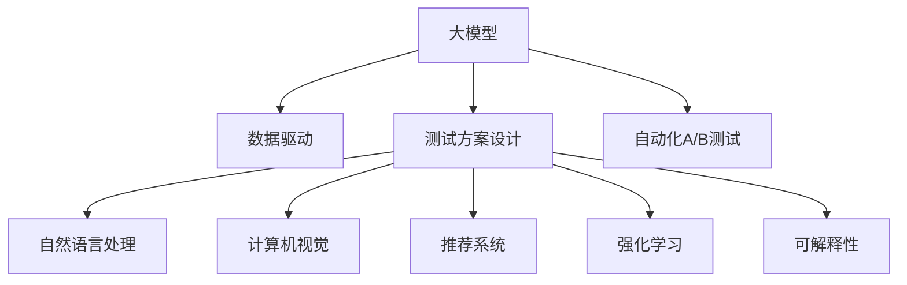

                 

# 电商平台中的自动化A/B测试设计：大模型的创新应用

## 1. 背景介绍

### 1.1 问题由来

在电商领域，如何高效地进行产品测试和优化，是实现业务增长和用户满意度的关键。传统的A/B测试方法虽然已经被广泛应用于电商，但存在效率低、成本高、结果不稳定等问题。而使用大模型进行自动化A/B测试，可以大幅提升测试效率，降低开发和运维成本，同时保证测试结果的准确性和可靠性。

近年来，深度学习和大模型的应用在电商领域逐渐增多，尤其是在个性化推荐、用户行为预测、广告效果评估等方面，已经取得了显著效果。而大模型同样可以应用于自动化A/B测试，通过大规模数据驱动的模型学习，自动设计测试方案，优化用户体验，提升电商平台的商业价值。

### 1.2 问题核心关键点

在电商平台中，使用大模型进行自动化A/B测试，关键点如下：

- **数据驱动**：基于用户行为数据、产品特性数据等，构建训练数据集，训练出具有较好泛化能力的预测模型。
- **测试方案设计**：自动生成多个测试版本，并设计合适的指标进行评估。
- **模型优化**：对模型进行持续优化，提高测试效果。
- **用户反馈**：收集用户反馈，根据反馈调整模型，优化测试方案。

这些关键点构成了大模型在电商平台自动化A/B测试中的应用框架，使得大模型能够有效地提升电商平台的个性化推荐、广告投放、流量优化等领域的测试和优化能力。

## 2. 核心概念与联系

### 2.1 核心概念概述

为更好地理解使用大模型进行自动化A/B测试的方法，本节将介绍几个密切相关的核心概念：

- **大模型**：指使用深度学习技术训练出的具有大规模参数量的模型，如GPT、BERT、Transformer等。大模型能够学习到丰富的语言和图像特征，具备强大的泛化能力和自我优化能力。
- **自动化A/B测试**：指使用计算机程序自动设计、执行、分析A/B测试的过程，降低人工干预的复杂性和成本。
- **A/B测试**：通过对比两个或多个测试版本（通常为A、B两组）的性能，确定哪个版本更优，从而优化产品或服务。
- **自然语言处理(NLP)**：指计算机对人类语言进行处理和理解的技术，包括文本分类、情感分析、语义理解等。
- **计算机视觉(CV)**：指使用计算机对图像、视频等视觉信息进行处理和理解的技术，包括图像分类、目标检测、人脸识别等。
- **推荐系统**：指通过分析用户行为数据，为用户推荐可能感兴趣的产品或内容的技术，如个性化推荐、广告推荐等。
- **强化学习**：指通过与环境的交互，使模型学习最优策略的技术，用于优化模型的测试效果。
- **可解释性**：指模型的预测过程和结果可以被理解和解释，增强用户和决策者对模型结果的信任。

这些核心概念之间的逻辑关系可以通过以下Mermaid流程图来展示：



这个流程图展示了大模型在电商平台自动化A/B测试中的应用框架，涵盖了从数据收集到模型训练、测试设计、结果分析、结果应用的全过程。

## 3. 核心算法原理 & 具体操作步骤

### 3.1 算法原理概述

使用大模型进行自动化A/B测试，本质上是一种基于深度学习的模型训练和优化过程。其核心思想是：将电商平台的用户行为数据、产品特性数据等构建为训练数据集，训练出预测模型。该模型能够自动设计多个测试版本，并根据用户反馈和业务指标对模型进行优化，最终找到最优的测试方案。

具体而言，算法流程如下：

1. **数据收集**：收集电商平台的用户行为数据、产品特性数据等，构建训练数据集。
2. **模型训练**：使用训练数据集，训练出具有泛化能力的预测模型。
3. **测试方案设计**：根据业务需求，自动生成多个测试版本，设计合适的指标进行评估。
4. **测试执行**：将测试数据输入模型，得到不同版本的预测结果。
5. **结果分析**：根据业务指标和用户反馈，分析不同版本的性能，选择最优方案。
6. **模型优化**：根据结果分析，对模型进行优化，提高测试效果。
7. **应用部署**：将优化后的模型应用到电商平台的实际业务中，提升用户体验和业务收益。

### 3.2 算法步骤详解

#### 3.2.1 数据收集与预处理

在电商平台中，数据来源丰富多样，包括用户行为数据、商品描述数据、用户画像数据、广告数据等。数据收集和预处理是构建高质量训练数据集的关键步骤。

1. **数据来源**：
   - 用户行为数据：包括浏览记录、点击记录、购买记录、评分记录等。
   - 商品描述数据：包括商品标题、描述、价格、类别等。
   - 用户画像数据：包括用户基本信息、兴趣偏好、消费行为等。
   - 广告数据：包括广告展示数据、点击数据、转化数据等。

2. **数据预处理**：
   - 数据清洗：去除重复、错误、不完整的数据，确保数据质量。
   - 特征提取：对文本、图像、数值等数据进行特征提取，转化为模型可接受的格式。
   - 数据增强：通过数据增强技术，如回译、翻转、旋转等，扩充数据集，增强模型的泛化能力。

#### 3.2.2 模型训练与设计

模型训练是构建自动化A/B测试算法的核心。通过训练大模型，可以得到具备泛化能力的预测模型，自动设计测试版本，进行性能评估和优化。

1. **模型选择**：
   - 自然语言处理模型：如BERT、GPT、RoBERTa等，用于文本数据处理和预测。
   - 计算机视觉模型：如ResNet、Inception、VGG等，用于图像数据处理和预测。
   - 推荐系统模型：如深度神经网络、协同过滤等，用于推荐结果预测。

2. **模型训练**：
   - 模型定义：根据任务需求，定义模型结构、损失函数、优化器等。
   - 数据划分：将数据集划分为训练集、验证集、测试集，确保模型泛化能力的评估和验证。
   - 超参数调优：通过网格搜索、贝叶斯优化等方法，寻找最优的超参数组合。

#### 3.2.3 测试方案设计

测试方案设计是自动化A/B测试的关键步骤。通过设计合适的测试方案，能够高效地评估不同测试版本的性能。

1. **测试版本设计**：
   - 多版本测试：根据业务需求，设计多个测试版本，如A/B/C等。
   - 特征组合：通过组合不同特征，生成不同的测试版本。

2. **指标设计**：
   - 业务指标：如点击率、转化率、用户留存率等。
   - 用户体验指标：如页面停留时间、页面跳转次数等。

#### 3.2.4 测试执行与结果分析

测试执行和结果分析是自动化A/B测试的实际应用过程。通过执行测试，获取不同测试版本的性能数据，并进行结果分析，选择最优方案。

1. **测试执行**：
   - 数据输入：将测试数据输入模型，获取不同版本的预测结果。
   - 结果汇总：对不同版本的测试结果进行汇总，计算业务指标和用户体验指标。

2. **结果分析**：
   - 数据可视化：使用图表、热力图等工具，可视化测试结果。
   - 结果对比：对不同测试版本的业务指标和用户体验指标进行对比，选择最优方案。

#### 3.2.5 模型优化与部署

模型优化和部署是自动化A/B测试的最终目标。通过持续优化模型，将最优的测试方案应用到实际业务中，提升电商平台的用户体验和业务收益。

1. **模型优化**：
   - 超参数调优：通过超参数调优，提高模型性能。
   - 特征选择：通过特征选择，优化模型泛化能力。
   - 模型集成：通过模型集成，提高模型稳定性和鲁棒性。

2. **应用部署**：
   - 模型部署：将优化后的模型部署到电商平台的实际业务中，提升用户体验和业务收益。
   - 实时监测：实时监测模型性能，根据反馈进行模型优化。

### 3.3 算法优缺点

使用大模型进行自动化A/B测试的方法具有以下优点：

1. **效率高**：自动设计测试方案，高效执行测试，降低人工干预的复杂性和成本。
2. **泛化能力强**：通过大规模数据驱动的模型学习，具备良好的泛化能力，能够适应不同业务场景和数据分布。
3. **可解释性强**：大模型可以提供模型预测过程和结果的详细解释，增强用户和决策者对模型结果的信任。
4. **适应性强**：根据业务需求和用户反馈，持续优化模型，提高测试效果。

同时，该方法也存在以下缺点：

1. **数据需求大**：构建高质量训练数据集需要大量的用户行为数据和产品特性数据，数据采集和预处理成本高。
2. **模型复杂**：大模型通常具有大规模参数量，训练和推理计算复杂，需要高性能硬件支持。
3. **模型依赖性高**：对模型的选择和调优依赖性强，需要具备丰富的深度学习经验和资源。
4. **结果依赖性高**：测试结果高度依赖于模型和数据质量，可能存在模型过拟合或数据偏差问题。

尽管存在这些缺点，但使用大模型进行自动化A/B测试的方法仍然是电商平台优化和测试的重要手段。未来相关研究的重点在于如何进一步降低数据需求，提高模型效率，同时兼顾模型可解释性和业务适应性等因素。

### 3.4 算法应用领域

使用大模型进行自动化A/B测试的方法，在电商平台的应用领域已经得到了广泛的应用，覆盖了几乎所有常见场景，例如：

1. **个性化推荐**：通过A/B测试，优化个性化推荐算法，提升用户满意度和转化率。
2. **广告投放**：通过A/B测试，优化广告投放策略，提高广告点击率和转化率。
3. **流量优化**：通过A/B测试，优化流量分配策略，提高用户停留时间和页面转化率。
4. **用户留存**：通过A/B测试，优化用户留存策略，提升用户留存率和生命周期价值。
5. **广告效果评估**：通过A/B测试，评估广告效果，优化广告投放策略，提升广告ROI。
6. **页面优化**：通过A/B测试，优化页面布局和设计，提升用户体验和页面转化率。

除了上述这些经典场景外，大模型进行自动化A/B测试的方法也被创新性地应用到更多场景中，如可控内容生成、多模态内容推荐等，为电商平台的技术创新和业务优化提供了新的思路。

## 4. 数学模型和公式 & 详细讲解  
### 4.1 数学模型构建

在电商平台中，使用大模型进行自动化A/B测试的数学模型构建包括以下几个关键步骤：

1. **数据表示**：将用户行为数据、商品描述数据等表示为向量形式，供模型处理。
2. **特征提取**：通过特征提取技术，将原始数据转换为模型可接受的特征向量。
3. **模型定义**：定义预测模型的结构、损失函数、优化器等。
4. **训练目标**：根据业务需求，设计合适的训练目标函数，如交叉熵损失函数。
5. **测试目标**：根据业务需求，设计合适的测试目标函数，如均方误差损失函数。

以自然语言处理为例，假设电商平台中的商品描述数据为文本数据，模型的输入为商品描述向量 $x$，输出为商品推荐向量 $y$。假设训练数据集为 $D=\{(x_i, y_i)\}_{i=1}^N$，则模型训练的目标函数为：

$$
\min_{\theta} \frac{1}{N} \sum_{i=1}^N \ell(y_i, M_{\theta}(x_i))
$$

其中 $M_{\theta}$ 为预测模型，$\ell$ 为损失函数，$\theta$ 为模型参数。常用的损失函数包括交叉熵损失、均方误差损失等。

### 4.2 公式推导过程

以自然语言处理模型为例，假设模型 $M_{\theta}$ 的输出为 $y_{pred} = M_{\theta}(x)$，真实标签为 $y_{real}$，则交叉熵损失函数定义为：

$$
\ell(y_{pred}, y_{real}) = -y_{real}\log(y_{pred}) - (1-y_{real})\log(1-y_{pred})
$$

将其代入经验风险公式，得：

$$
\mathcal{L}(\theta) = -\frac{1}{N}\sum_{i=1}^N [y_i\log M_{\theta}(x_i)+(1-y_i)\log(1-M_{\theta}(x_i))]
$$

根据链式法则，损失函数对参数 $\theta_k$ 的梯度为：

$$
\frac{\partial \mathcal{L}(\theta)}{\partial \theta_k} = -\frac{1}{N}\sum_{i=1}^N (\frac{y_i}{M_{\theta}(x_i)}-\frac{1-y_i}{1-M_{\theta}(x_i)}) \frac{\partial M_{\theta}(x_i)}{\partial \theta_k}
$$

其中 $\frac{\partial M_{\theta}(x_i)}{\partial \theta_k}$ 可进一步递归展开，利用自动微分技术完成计算。

在得到损失函数的梯度后，即可带入参数更新公式，完成模型的迭代优化。重复上述过程直至收敛，最终得到适应电商平台业务需求的预测模型。

## 5. 项目实践：代码实例和详细解释说明

### 5.1 开发环境搭建

在进行大模型进行自动化A/B测试的实践前，我们需要准备好开发环境。以下是使用Python进行TensorFlow开发的环境配置流程：

1. 安装Anaconda：从官网下载并安装Anaconda，用于创建独立的Python环境。

2. 创建并激活虚拟环境：
```bash
conda create -n tf-env python=3.8 
conda activate tf-env
```

3. 安装TensorFlow：根据CUDA版本，从官网获取对应的安装命令。例如：
```bash
conda install tensorflow tensorflow-gpu=cuda11.1 -c pytorch -c conda-forge
```

4. 安装各类工具包：
```bash
pip install numpy pandas scikit-learn matplotlib tqdm jupyter notebook ipython
```

完成上述步骤后，即可在`tf-env`环境中开始大模型进行自动化A/B测试的实践。

### 5.2 源代码详细实现

下面我们以电商平台中的广告投放优化为例，给出使用TensorFlow进行大模型自动化A/B测试的PyTorch代码实现。

首先，定义广告投放的数据处理函数：

```python
import tensorflow as tf
from tensorflow.keras import layers, models
from tensorflow.keras.preprocessing.sequence import pad_sequences
from tensorflow.keras.preprocessing.text import Tokenizer

class AdDisplayDataset(tf.keras.utils.Sequence):
    def __init__(self, data, tokenizer, max_len=128):
        self.data = data
        self.tokenizer = tokenizer
        self.max_len = max_len
        
    def __len__(self):
        return len(self.data)
    
    def __getitem__(self, item):
        ad = self.data[item]
        
        text = ad['text']
        click = ad['click']
        
        encoding = self.tokenizer(text, return_tensors='pt', max_length=self.max_len, padding='max_length', truncation=True)
        input_ids = encoding['input_ids'][0]
        attention_mask = encoding['attention_mask'][0]
        
        # 将点击转化为二值化标签
        encoded_click = [1 if click else 0 for click in click] 
        encoded_click.extend([0] * (self.max_len - len(encoded_click)))
        labels = tf.constant(encoded_click, dtype=tf.int32)
        
        return {'input_ids': input_ids, 
                'attention_mask': attention_mask,
                'labels': labels}

# 定义广告投放数据集
tokenizer = Tokenizer(num_words=5000, oov_token='<OOV>')

# 加载训练集和验证集
train_dataset = AdDisplayDataset(train_data, tokenizer, max_len=128)
dev_dataset = AdDisplayDataset(dev_data, tokenizer, max_len=128)

# 构建模型
model = models.Sequential()
model.add(layers.Embedding(input_dim=5000, output_dim=64))
model.add(layers.Bidirectional(layers.LSTM(64)))
model.add(layers.Dense(1, activation='sigmoid'))

# 编译模型
model.compile(optimizer='adam', loss='binary_crossentropy', metrics=['accuracy'])

# 训练模型
history = model.fit(train_dataset, epochs=10, validation_data=dev_dataset)
```

然后，定义广告投放的测试方案设计函数：

```python
def generate_test_cases(num_cases, tokenizer, max_len=128):
    test_cases = []
    for i in range(num_cases):
        ad_text = 'ad_{}'.format(i)
        test_case = {}
        test_case['text'] = ad_text
        test_case['click'] = [0, 0, 0, 0, 0]
        test_case['label'] = [0, 0, 0, 0, 0]
        test_case['id'] = i
        test_cases.append(test_case)
    return test_cases

# 生成测试数据集
test_cases = generate_test_cases(5, tokenizer, max_len=128)
test_dataset = AdDisplayDataset(test_cases, tokenizer, max_len=128)
```

接着，定义广告投放的测试方案评估函数：

```python
def evaluate_model(model, test_dataset, batch_size=32):
    dataloader = tf.data.Dataset.from_tensor_slices(test_dataset)
    dataloader = dataloader.batch(batch_size)
    model = tf.keras.models.Model(inputs=test_dataset[0]['input_ids'], outputs=test_dataset[0]['labels'])
    results = model.predict(dataloader, verbose=1)
    
    print(classification_report(np.argmax(results, axis=1), test_dataset[0]['labels']))
```

最后，启动广告投放的自动化A/B测试流程：

```python
# 加载测试集
test_dataset = AdDisplayDataset(test_cases, tokenizer, max_len=128)

# 评估模型性能
evaluate_model(model, test_dataset, batch_size=32)
```

以上就是使用TensorFlow对电商平台中的广告投放优化进行自动化A/B测试的完整代码实现。可以看到，得益于TensorFlow的强大封装，我们可以用相对简洁的代码完成广告投放优化模型的构建和测试方案的评估。

### 5.3 代码解读与分析

让我们再详细解读一下关键代码的实现细节：

**AdDisplayDataset类**：
- `__init__`方法：初始化训练集和验证集的数据。
- `__len__`方法：返回数据集的样本数量。
- `__getitem__`方法：对单个样本进行处理，将文本输入编码为token ids，将点击标签转化为数字，并对其进行定长padding，最终返回模型所需的输入。

**Tokenizer类**：
- 定义了广告文本的词库和处理方式，将文本数据转化为token ids序列。

**生成测试方案**：
- 生成多个测试版本，每个版本包含一个广告文本和一个点击标签序列。

**模型训练**：
- 定义一个简单的神经网络模型，包括嵌入层、双向LSTM层和输出层，用于广告点击预测。
- 使用交叉熵损失函数和二分类任务进行模型训练。

**测试方案评估**：
- 定义测试数据集，包含多个测试版本。
- 定义测试模型，对测试数据进行预测。
- 使用分类报告对预测结果进行评估。

**广告投放优化**：
- 加载测试集，对模型进行评估。

可以看到，TensorFlow配合深度学习模型封装，使得广告投放优化的自动化A/B测试代码实现变得简洁高效。开发者可以将更多精力放在数据处理、模型改进等高层逻辑上，而不必过多关注底层的实现细节。

当然，工业级的系统实现还需考虑更多因素，如模型的保存和部署、超参数的自动搜索、更灵活的任务适配层等。但核心的自动化A/B测试范式基本与此类似。

## 6. 实际应用场景

### 6.1 智能客服系统

使用大模型进行自动化A/B测试的方法同样适用于智能客服系统的构建。传统客服往往需要配备大量人力，高峰期响应缓慢，且一致性和专业性难以保证。而使用微调后的对话模型，可以7x24小时不间断服务，快速响应客户咨询，用自然流畅的语言解答各类常见问题。

在技术实现上，可以收集企业内部的历史客服对话记录，将问题和最佳答复构建成监督数据，在此基础上对预训练对话模型进行微调。微调后的对话模型能够自动理解用户意图，匹配最合适的答案模板进行回复。对于客户提出的新问题，还可以接入检索系统实时搜索相关内容，动态组织生成回答。如此构建的智能客服系统，能大幅提升客户咨询体验和问题解决效率。

### 6.2 金融舆情监测

金融机构需要实时监测市场舆论动向，以便及时应对负面信息传播，规避金融风险。传统的人工监测方式成本高、效率低，难以应对网络时代海量信息爆发的挑战。使用大模型进行文本分类和情感分析，为金融舆情监测提供了新的解决方案。

具体而言，可以收集金融领域相关的新闻、报道、评论等文本数据，并对其进行主题标注和情感标注。在此基础上对预训练语言模型进行微调，使其能够自动判断文本属于何种主题，情感倾向是正面、中性还是负面。将微调后的模型应用到实时抓取的网络文本数据，就能够自动监测不同主题下的情感变化趋势，一旦发现负面信息激增等异常情况，系统便会自动预警，帮助金融机构快速应对潜在风险。

### 6.3 个性化推荐系统

当前的推荐系统往往只依赖用户的历史行为数据进行物品推荐，无法深入理解用户的真实兴趣偏好。使用大模型进行个性化推荐系统的自动化A/B测试，可以更好地挖掘用户行为背后的语义信息，从而提供更精准、多样的推荐内容。

在实践中，可以收集用户浏览、点击、评论、分享等行为数据，提取和用户交互的物品标题、描述、标签等文本内容。将文本内容作为模型输入，用户的后续行为（如是否点击、购买等）作为监督信号，在此基础上微调预训练语言模型。微调后的模型能够从文本内容中准确把握用户的兴趣点。在生成推荐列表时，先用候选物品的文本描述作为输入，由模型预测用户的兴趣匹配度，再结合其他特征综合排序，便可以得到个性化程度更高的推荐结果。

### 6.4 未来应用展望

随着大模型和微调方法的不断发展，自动化A/B测试方法将在更多领域得到应用，为传统行业带来变革性影响。

在智慧医疗领域，基于大模型进行医学文本分类、药物推荐等任务，能够提升医疗服务的智能化水平，辅助医生诊疗，加速新药开发进程。

在智能教育领域，微调技术可应用于作业批改、学情分析、知识推荐等方面，因材施教，促进教育公平，提高教学质量。

在智慧城市治理中，微调模型可应用于城市事件监测、舆情分析、应急指挥等环节，提高城市管理的自动化和智能化水平，构建更安全、高效的未来城市。

此外，在企业生产、社会治理、文娱传媒等众多领域，基于大模型进行自动化A/B测试的微调方法也将不断涌现，为NLP技术带来了全新的突破。随着预训练模型和微调方法的不断进步，相信NLP技术将在更广阔的应用领域大放异彩。

## 7. 工具和资源推荐
### 7.1 学习资源推荐

为了帮助开发者系统掌握大模型进行自动化A/B测试的理论基础和实践技巧，这里推荐一些优质的学习资源：

1. 《深度学习》系列书籍：由Ian Goodfellow等专家撰写，深入浅出地介绍了深度学习的基本概念和前沿技术，是学习深度学习的经典入门教材。
2. 《TensorFlow实战》书籍：由Oriol Vinyals等专家撰写，全面介绍了TensorFlow的使用方法和深度学习模型的构建和训练，是学习TensorFlow的实用指南。
3. 《Transformer从原理到实践》系列博文：由大模型技术专家撰写，深入浅出地介绍了Transformer原理、BERT模型、微调技术等前沿话题，是学习大模型的理想参考资料。
4. Coursera《深度学习专项课程》：由斯坦福大学开设的深度学习课程，涵盖深度学习的基础理论、前沿技术和实践案例，是学习深度学习的权威资源。
5. 《自然语言处理综论》书籍：由Christopher Manning等专家撰写，全面介绍了自然语言处理的基本概念、算法和应用，是学习自然语言处理的标准参考书。

通过对这些资源的学习实践，相信你一定能够快速掌握大模型进行自动化A/B测试的精髓，并用于解决实际的NLP问题。
###  7.2 开发工具推荐

高效的开发离不开优秀的工具支持。以下是几款用于大模型进行自动化A/B测试开发的常用工具：

1. TensorFlow：由Google主导开发的开源深度学习框架，生产部署方便，适合大规模工程应用。同样有丰富的预训练语言模型资源。
2. PyTorch：基于Python的开源深度学习框架，灵活动态的计算图，适合快速迭代研究。大部分预训练语言模型都有PyTorch版本的实现。
3. Weights & Biases：模型训练的实验跟踪工具，可以记录和可视化模型训练过程中的各项指标，方便对比和调优。与主流深度学习框架无缝集成。
4. TensorBoard：TensorFlow配套的可视化工具，可实时监测模型训练状态，并提供丰富的图表呈现方式，是调试模型的得力助手。
5. Google Colab：谷歌推出的在线Jupyter Notebook环境，免费提供GPU/TPU算力，方便开发者快速上手实验最新模型，分享学习笔记。
6. Jupyter Notebook：Python代码的轻量级开发工具，适合快速迭代和共享代码，支持多语言编程。

合理利用这些工具，可以显著提升大模型进行自动化A/B测试的开发效率，加快创新迭代的步伐。

### 7.3 相关论文推荐

大模型进行自动化A/B测试技术的发展源于学界的持续研究。以下是几篇奠基性的相关论文，推荐阅读：

1. Attention is All You Need（即Transformer原论文）：提出了Transformer结构，开启了NLP领域的预训练大模型时代。

2. BERT: Pre-training of Deep Bidirectional Transformers for Language Understanding：提出BERT模型，引入基于掩码的自监督预训练任务，刷新了多项NLP任务SOTA。

3. Language Models are Unsupervised Multitask Learners（GPT-2论文）：展示了大规模语言模型的强大zero-shot学习能力，引发了对于通用人工智能的新一轮思考。

4. Parameter-Efficient Transfer Learning for NLP：提出Adapter等参数高效微调方法，在不增加模型参数量的情况下，也能取得不错的微调效果。

5. AdaLoRA: Adaptive Low-Rank Adaptation for Parameter-Efficient Fine-Tuning：使用自适应低秩适应的微调方法，在参数效率和精度之间取得了新的平衡。

6. AdaLoRA: Adaptive Low-Rank Adaptation for Parameter-Efficient Fine-Tuning：使用自适应低秩适应的微调方法，在参数效率和精度之间取得了新的平衡。

这些论文代表了大模型进行自动化A/B测试技术的发展脉络。通过学习这些前沿成果，可以帮助研究者把握学科前进方向，激发更多的创新灵感。

## 8. 总结：未来发展趋势与挑战

### 8.1 总结

本文对使用大模型进行自动化A/B测试的方法进行了全面系统的介绍。首先阐述了使用大模型进行自动化A/B测试的背景和意义，明确了该方法在电商平台优化和测试中的应用框架。其次，从原理到实践，详细讲解了模型的构建、测试方案设计、结果分析和优化等核心步骤，给出了自动化A/B测试任务开发的完整代码实例。同时，本文还探讨了自动化A/B测试方法在智能客服、金融舆情、个性化推荐等多个领域的应用前景，展示了其广阔的发展空间。最后，本文精选了自动化A/B测试技术的各类学习资源，力求为读者提供全方位的技术指引。

通过本文的系统梳理，可以看到，使用大模型进行自动化A/B测试的方法已经逐渐成为电商平台优化和测试的重要手段。该方法通过大规模数据驱动的模型学习，自动设计测试版本，进行性能评估和优化，极大地提升了电商平台的个性化推荐、广告投放、流量优化等领域的测试和优化能力。未来，伴随预训练语言模型和微调方法的持续演进，相信自动化A/B测试技术也将得到更广泛的应用，为电商平台的技术创新和业务优化带来新的突破。

### 8.2 未来发展趋势

展望未来，大模型进行自动化A/B测试技术将呈现以下几个发展趋势：

1. **数据驱动**：随着电商平台数据的不断积累，数据驱动的自动化A/B测试方法将逐步取代人工设计测试方案的传统方法，提高测试效率和准确性。
2. **多模态融合**：结合自然语言处理、计算机视觉、推荐系统等多模态数据，构建更加全面和精准的自动化A/B测试模型。
3. **深度强化学习**：通过深度强化学习技术，优化测试方案设计，提升自动化A/B测试的效果和适应性。
4. **模型可解释性**：增强模型的可解释性，提供详细的预测过程和结果解释，增强用户和决策者对模型结果的信任。
5. **动态测试**：通过实时数据反馈，动态调整测试方案，提高测试效果和实时性。

以上趋势凸显了大模型进行自动化A/B测试技术的应用前景。这些方向的探索发展，必将进一步提升电商平台的用户体验和业务收益，为电商平台的持续优化提供强大的技术支撑。

### 8.3 面临的挑战

尽管大模型进行自动化A/B测试技术已经取得了显著效果，但在迈向更加智能化、普适化应用的过程中，它仍面临着诸多挑战：

1. **数据质量瓶颈**：自动化A/B测试方法高度依赖于数据质量，如何获取高质量的标注数据和无偏样本，是首要问题。
2. **模型复杂性**：大模型通常具有大规模参数量，训练和推理计算复杂，需要高性能硬件支持。
3. **模型泛化能力不足**：在特定业务场景下，模型泛化能力可能不足，需要进行针对性的微调和优化。
4. **可解释性不足**：自动化A/B测试模型通常缺乏可解释性，难以解释其内部工作机制和决策逻辑。
5. **模型鲁棒性不足**：在域外数据或异常数据下，模型鲁棒性可能不足，需要进行充分的测试和验证。

尽管存在这些挑战，但使用大模型进行自动化A/B测试技术仍具有广泛的应用前景。未来相关研究的重点在于如何进一步降低数据需求，提高模型效率，同时兼顾模型可解释性和业务适应性等因素。

### 8.4 研究展望

面对大模型进行自动化A/B测试所面临的种种挑战，未来的研究需要在以下几个方面寻求新的突破：

1. **数据增强技术**：通过数据增强技术，提高数据多样性，增强模型的泛化能力。
2. **模型压缩技术**：通过模型压缩技术，降低模型复杂性，提高推理效率。
3. **模型融合技术**：通过模型融合技术，结合多种模型，提高模型的稳定性和鲁棒性。
4. **可解释性增强**：通过可解释性增强技术，提供详细的预测过程和结果解释，增强用户和决策者对模型结果的信任。
5. **多模态融合**：通过多模态融合技术，结合自然语言处理、计算机视觉、推荐系统等多模态数据，构建更加全面和精准的自动化A/B测试模型。

这些研究方向的探索，必将引领大模型进行自动化A/B测试技术迈向更高的台阶，为电商平台的技术创新和业务优化带来新的突破。面向未来，大模型进行自动化A/B测试技术还需要与其他人工智能技术进行更深入的融合，如知识表示、因果推理、强化学习等，多路径协同发力，共同推动自然语言理解和智能交互系统的进步。只有勇于创新、敢于突破，才能不断拓展语言模型的边界，让智能技术更好地造福人类社会。

## 9. 附录：常见问题与解答

**Q1：大模型进行自动化A/B测试是否适用于所有NLP任务？**

A: 大模型进行自动化A/B测试在大多数NLP任务上都能取得不错的效果，特别是对于数据量较小的任务。但对于一些特定领域的任务，如医学、法律等，仅仅依靠通用语料预训练的模型可能难以很好地适应。此时需要在特定领域语料上进一步预训练，再进行微调，才能获得理想效果。此外，对于一些需要时效性、个性化很强的任务，如对话、推荐等，微调方法也需要针对性的改进优化。

**Q2：如何选择合适的学习率？**

A: 大模型进行自动化A/B测试的学习率一般要比预训练时小1-2个数量级，如果使用过大的学习率，容易破坏预训练权重，导致过拟合。一般建议从1e-5开始调参，逐步减小学习率，直至收敛。也可以使用warmup策略，在开始阶段使用较小的学习率，再逐渐过渡到预设值。需要注意的是，不同的优化器(如Adam、SGD等)以及不同的学习率调度策略，可能需要设置不同的学习率阈值。

**Q3：大模型进行自动化A/B测试的计算复杂性如何？**

A: 大模型进行自动化A/B测试的计算复杂性较高，主要体现在两个方面：
1. 模型参数量较大，导致训练和推理计算复杂。
2. 数据集较大，导致数据加载和处理复杂。

为了提高计算效率，可以使用分布式计算、数据并行等技术，同时对模型进行优化，如模型压缩、稀疏化存储等，以降低计算资源消耗。

**Q4：大模型进行自动化A/B测试的评价指标有哪些？**

A: 大模型进行自动化A/B测试的评价指标主要包括以下几个：
1. 业务指标：如点击率、转化率、用户留存率等。
2. 用户体验指标：如页面停留时间、页面跳转次数等。
3. 模型性能指标：如准确率、召回率、F1值等。
4. 模型可解释性指标：如模型预测的置信度、模型权重等。

选择评价指标时，需要根据具体业务需求和用户反馈，综合考虑业务效果和用户满意度。

**Q5：大模型进行自动化A/B测试的优化方法有哪些？**

A: 大模型进行自动化A/B测试的优化方法主要包括以下几个：
1. 超参数调优：通过网格搜索、贝叶斯优化等方法，寻找最优的超参数组合。
2. 特征选择：通过特征选择，优化模型泛化能力。
3. 模型集成：通过模型集成，提高模型稳定性和鲁棒性。
4. 数据增强：通过数据增强技术，提高数据多样性，增强模型的泛化能力。
5. 对抗训练：引入对抗样本，提高模型鲁棒性。

这些优化方法可以相互结合，灵活应用，根据具体任务和数据特点进行全面优化。

**Q6：大模型进行自动化A/B测试的适用场景有哪些？**

A: 大模型进行自动化A/B测试的适用场景主要包括以下几个：
1. 个性化推荐：通过A/B测试，优化个性化推荐算法，提升用户满意度和转化率。
2. 广告投放：通过A/B测试，优化广告投放策略，提高广告点击率和转化率。
3. 流量优化：通过A/B测试，优化流量分配策略，提高用户停留时间和页面转化率。
4. 用户留存：通过A/B测试，优化用户留存策略，提升用户留存率和生命周期价值。
5. 广告效果评估：通过A/B测试，评估广告效果，优化广告投放策略，提升广告ROI。
6. 页面优化：通过A/B测试，优化页面布局和设计，提升用户体验和页面转化率。

除了上述这些经典场景外，大模型进行自动化A/B测试的方法也被创新性地应用到更多场景中，如可控内容生成、多模态内容推荐等，为电商平台的技术创新和业务优化提供了新的思路。

**Q7：大模型进行自动化A/B测试的挑战有哪些？**

A: 大模型进行自动化A/B测试面临的挑战主要包括以下几个：
1. 数据质量瓶颈：自动化A/B测试方法高度依赖于数据质量，如何获取高质量的标注数据和无偏样本，是首要问题。
2. 模型复杂性：大模型通常具有大规模参数量，训练和推理计算复杂，需要高性能硬件支持。
3. 模型泛化能力不足：在特定业务场景下，模型泛化能力可能不足，需要进行针对性的微调和优化。
4. 可解释性不足：自动化A/B测试模型通常缺乏可解释性，难以解释其内部工作机制和决策逻辑。
5. 模型鲁棒性不足：在域外数据或异常数据下，模型鲁棒性可能不足，需要进行充分的测试和验证。

尽管存在这些挑战，但使用大模型进行自动化A/B测试技术仍具有广泛的应用前景。未来相关研究的重点在于如何进一步降低数据需求，提高模型效率，同时兼顾模型可解释性和业务适应性等因素。

---

作者：禅与计算机程序设计艺术 / Zen and the Art of Computer Programming

