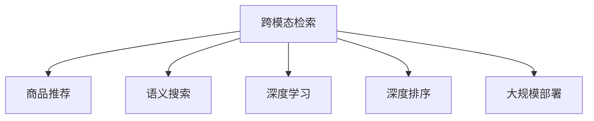

                 

# 电商平台中的跨模态商品检索系统设计

> 关键词：跨模态检索,商品推荐,语义搜索,深度学习,深度排序,大规模部署

## 1. 背景介绍

随着电子商务的快速发展，电商平台面临用户需求多样化和数据量急剧增长的双重挑战。传统的商品检索系统基于单一的文本检索模型，无法有效处理文本、图片、视频等多模态数据，导致搜索结果不够精准，用户体验差。跨模态商品检索系统通过融合文本、图片、视频等多模态信息，全面提升检索精度，提升电商平台的商品推荐效率和用户满意度。

近年来，跨模态检索系统逐渐成为人工智能应用的热点领域。学术界和工业界对跨模态检索的关注也随之升温。在学术界，跨模态检索的研究主要以检索任务为出发点，通过对多模态数据的嵌入、融合和排序，进行多模态检索系统的建模。工业界则聚焦于实际应用场景，如电商平台、社交网络、信息检索等，通过深度学习等技术，提升跨模态检索系统的实际效果。

本文聚焦于电商平台中的跨模态商品检索系统设计。我们将从系统架构、关键算法和应用场景等多个维度进行深入探讨，希望能为电商平台的设计和优化提供有益的指导。

## 2. 核心概念与联系

### 2.1 核心概念概述

为更好地理解跨模态商品检索系统的设计，本节将介绍几个密切相关的核心概念：

- **跨模态检索(Cross-modal Retrieval)**：指在两个或多个不同模态的数据之间建立映射关系，进行信息检索。例如，在文本和图像之间建立关联，检索与文本描述对应的图像，或在视频和文本之间进行检索。

- **商品推荐(Product Recommendation)**：通过分析用户历史行为数据，推荐可能感兴趣的商品。是电商平台上常见的核心功能之一，涉及搜索排序、实时推荐、广告投放等多个环节。

- **语义搜索(Semantic Search)**：通过分析文本语义信息，匹配用户的搜索意图，提供精准搜索结果。在文本检索基础上，增加语义理解能力，提升检索效果。

- **深度学习(Deep Learning)**：使用多层神经网络进行模型训练，通过反向传播算法优化模型参数，提升模型预测能力。深度学习在图像识别、自然语言处理等领域取得了巨大成功。

- **深度排序(Deep Ranking)**：使用深度神经网络对检索结果进行排序，提升排序精度。在深度排序中，可以加入用户偏好、商品属性等丰富信息，实现更精准的推荐排序。

- **大规模部署(Scale-out Deployment)**：将模型部署到多个计算节点上，实现大规模并发访问。常用于搜索引擎、电商推荐系统等高并发场景。

这些核心概念之间的逻辑关系可以通过以下Mermaid流程图来展示：



这个流程图展示了你在使用跨模态检索系统时，需要考虑的关键概念及其之间的关系：

1. 跨模态检索系统通过融合多模态数据，提升检索精度。
2. 商品推荐系统通过分析用户行为，推荐商品。
3. 语义搜索系统通过分析文本语义，匹配用户意图。
4. 深度学习系统通过神经网络提升模型预测能力。
5. 深度排序系统通过多层网络优化排序精度。
6. 大规模部署系统通过并行计算，支持高并发应用。

这些概念共同构成了电商平台跨模态商品检索系统设计的核心架构，使得系统能够全面提升用户检索体验和推荐效果。

## 3. 核心算法原理 & 具体操作步骤

### 3.1 算法原理概述

跨模态商品检索系统基于深度学习技术，通过编码器-解码器框架，将不同模态的数据嵌入到共同的高维空间中，从而实现信息检索。系统设计的核心在于融合多模态数据和语义信息，提升检索精度和推荐效果。

具体而言，系统通常包括以下几个步骤：

1. **多模态数据预处理**：将不同模态的数据进行统一预处理，包括文本分词、图像归一化等操作。

2. **多模态数据编码**：使用神经网络对不同模态的数据进行编码，将其映射到共同的高维空间中。

3. **深度排序**：将编码后的多模态数据送入深度神经网络进行排序，排序结果用于检索。

4. **用户反馈处理**：根据用户反馈信息（如点击率、停留时间等），动态调整排序策略，提升推荐效果。

### 3.2 算法步骤详解

#### 3.2.1 数据预处理

**文本处理**：
- 使用自然语言处理工具进行文本分词、词性标注、命名实体识别等操作。
- 将文本转化为词向量，使用词嵌入模型（如Word2Vec、GloVe）或预训练语言模型（如BERT、ELMo）进行编码。

**图像处理**：
- 对图像进行预处理，包括尺寸缩放、归一化、增强等。
- 使用卷积神经网络（CNN）提取图像特征，生成图像嵌入向量。

**视频处理**：
- 对视频进行帧提取，生成一帧帧图像。
- 使用卷积神经网络对帧图像进行编码，生成视频嵌入向量。

#### 3.2.2 多模态数据编码

**文本编码**：
- 使用预训练语言模型（如BERT、GPT）对文本进行编码，生成文本嵌入向量。
- 可以使用自编码器、自回归模型等方式，提取文本的语义信息。

**图像编码**：
- 使用卷积神经网络（如ResNet、Inception）对图像进行编码，生成图像嵌入向量。
- 可以引入Transformer网络，进行图像-文本跨模态融合。

**视频编码**：
- 使用卷积神经网络对视频帧图像进行编码，生成视频嵌入向量。
- 可以引入Transformer网络，进行视频-文本跨模态融合。

#### 3.2.3 深度排序

**排序模型**：
- 使用深度神经网络对编码后的多模态数据进行排序，排序结果用于检索。
- 可以使用多层感知器（MLP）、双向LSTM、注意力机制等方式，提升排序精度。

**用户反馈处理**：
- 根据用户反馈信息（如点击率、停留时间等），动态调整排序策略。
- 可以使用强化学习等方法，进行在线学习，优化排序模型。

### 3.3 算法优缺点

**优点**：
- 融合多模态数据，提升检索精度。
- 引入语义信息，匹配用户意图。
- 使用深度学习技术，提升模型预测能力。
- 可扩展性强，适合大规模部署。

**缺点**：
- 多模态数据融合复杂，模型训练难度大。
- 数据预处理复杂，不同模态数据需统一处理。
- 计算资源消耗大，硬件成本高。
- 模型复杂，解释性不足。

### 3.4 算法应用领域

跨模态商品检索系统在多个领域都有广泛应用，例如：

- **电商平台**：通过融合商品图片、描述、用户行为等多模态数据，提升检索精度和推荐效果。
- **社交网络**：通过分析用户上传的图片、视频和文字内容，推荐相关内容，提高用户粘性。
- **信息检索**：通过结合文档、网页、图片等多模态数据，提升搜索结果的准确性。
- **智慧城市**：通过融合城市监控视频、交通数据和用户评论等，进行智能调度，优化城市管理。

以上应用场景展示了跨模态检索技术的强大应用潜力，通过深度学习和多模态数据融合，可显著提升检索和推荐效果。

## 4. 数学模型和公式 & 详细讲解

### 4.1 数学模型构建

设文本序列为 $X=\{x_1,x_2,\dots,x_N\}$，图像序列为 $Y=\{y_1,y_2,\dots,y_M\}$，视频序列为 $Z=\{z_1,z_2,\dots,z_K\}$。我们定义一个多模态编码器，将不同模态的数据映射到共同的高维空间 $V$ 中，即：

$$
f_{\theta}(X,Y,Z) = (f_x(X),f_y(Y),f_z(Z)) \in V^3
$$

其中 $f_x,f_y,f_z$ 为不同模态的编码器，$\theta$ 为编码器参数。

定义排序函数 $g$，对编码后的多模态数据进行排序，排序结果为 $R=\{r_1,r_2,\dots,r_L\}$。排序函数的损失函数为：

$$
\mathcal{L}(R,X,Y,Z) = \sum_{i=1}^L \ell(r_i,X,Y,Z)
$$

其中 $\ell$ 为排序损失函数，例如Spearman's footrule、Kendall's Tau等。

### 4.2 公式推导过程

假设我们有 $N$ 个文本样本和 $M$ 个图像样本，定义两个编码器 $f_x,f_y$。首先将文本样本进行编码，生成文本嵌入向量 $E_x \in \mathbb{R}^d$。然后对图像样本进行编码，生成图像嵌入向量 $E_y \in \mathbb{R}^d$。最终，将编码后的文本和图像向量拼接，送入深度神经网络进行排序，排序结果为 $R \in [1,2,\dots,L]$。

排序损失函数 $\ell$ 可定义为：

$$
\ell(R,X,Y,Z) = \sum_{i=1}^N \sum_{j=1}^M \sum_{k=1}^K \mathbb{1}(r_i = i) \cdot d(R_i,(R_j, R_k))
$$

其中 $\mathbb{1}(\cdot)$ 为示性函数，$d$ 为距离度量，例如欧式距离、余弦相似度等。

### 4.3 案例分析与讲解

**案例分析**：
假设我们有一组电商平台商品数据，包括文本描述、图片和用户评论。我们希望使用跨模态检索系统，根据用户输入的搜索词，检索并推荐最相关的商品。

**讲解**：
1. **数据预处理**：
   - 对文本进行分词，生成文本序列 $X=\{x_1,x_2,\dots,x_N\}$。
   - 对图片进行预处理，生成图像序列 $Y=\{y_1,y_2,\dots,y_M\}$。
   - 对用户评论进行分词，生成评论文本序列 $Z=\{z_1,z_2,\dots,z_K\}$。

2. **多模态编码**：
   - 使用BERT模型对文本进行编码，生成文本嵌入向量 $E_x \in \mathbb{R}^d$。
   - 使用ResNet对图像进行编码，生成图像嵌入向量 $E_y \in \mathbb{R}^d$。
   - 使用Transformer对评论文本进行编码，生成评论嵌入向量 $E_z \in \mathbb{R}^d$。

3. **深度排序**：
   - 将编码后的文本、图像和评论向量拼接，生成多模态向量 $V = [E_x, E_y, E_z] \in \mathbb{R}^{3d}$。
   - 将多模态向量送入深度神经网络进行排序，生成排序结果 $R \in [1,2,\dots,L]$。

4. **检索和推荐**：
   - 根据用户输入的搜索词，计算与搜索结果的相似度，生成排序结果。
   - 根据排序结果，推荐最相关的商品给用户。

## 5. 项目实践：代码实例和详细解释说明

### 5.1 开发环境搭建

在进行跨模态检索系统开发前，我们需要准备好开发环境。以下是使用Python进行PyTorch开发的环境配置流程：

1. 安装Anaconda：从官网下载并安装Anaconda，用于创建独立的Python环境。

2. 创建并激活虚拟环境：
```bash
conda create -n cross-modal-env python=3.8 
conda activate cross-modal-env
```

3. 安装PyTorch：根据CUDA版本，从官网获取对应的安装命令。例如：
```bash
conda install pytorch torchvision torchaudio cudatoolkit=11.1 -c pytorch -c conda-forge
```

4. 安装Pillow：用于处理图像数据，可以使用Pillow库。
```bash
pip install pillow
```

5. 安装PyTorch Lightning：用于构建和训练深度学习模型，可以使用PyTorch Lightning。
```bash
pip install torchlightning
```

6. 安装Bert4keras：用于加载预训练的BERT模型，可以使用Bert4keras库。
```bash
pip install bert4keras
```

完成上述步骤后，即可在`cross-modal-env`环境中开始跨模态检索系统开发。

### 5.2 源代码详细实现

下面我们以电商平台商品推荐为例，给出使用PyTorch进行跨模态检索的PyTorch代码实现。

首先，定义多模态数据编码函数：

```python
from transformers import BertTokenizer, BertForSequenceClassification
from torchvision.models import resnet18
import torch
from torch.nn import functional as F

def text_encoder(text, tokenizer, model):
    input_ids = tokenizer(text, return_tensors='pt', padding=True, truncation=True)
    return model(input_ids['input_ids'], attention_mask=input_ids['attention_mask'])

def image_encoder(image, model):
    image_tensor = torch.tensor(image).float().unsqueeze(0)
    return model(image_tensor)

def review_encoder(review, tokenizer, model):
    input_ids = tokenizer(review, return_tensors='pt', padding=True, truncation=True)
    return model(input_ids['input_ids'], attention_mask=input_ids['attention_mask'])

def multi_modal_encoder(text, image, review, tokenizer, bert_model, resnet_model, transformers_model):
    text_embeddings = text_encoder(text, tokenizer, bert_model)
    image_embeddings = image_encoder(image, resnet_model)
    review_embeddings = review_encoder(review, tokenizer, transformers_model)
    
    text_embeddings = text_embeddings.to(device)
    image_embeddings = image_embeddings.to(device)
    review_embeddings = review_embeddings.to(device)
    
    return torch.cat([text_embeddings, image_embeddings, review_embeddings], dim=1)
```

然后，定义排序模型和损失函数：

```python
import torch.nn as nn
import torch.nn.functional as F

class MultiModalModel(nn.Module):
    def __init__(self, input_dim, hidden_dim):
        super(MultiModalModel, self).__init__()
        self.fc = nn.Linear(input_dim, hidden_dim)
        self.fc_out = nn.Linear(hidden_dim, 1)
        
    def forward(self, x):
        x = self.fc(x)
        x = F.relu(x)
        x = self.fc_out(x)
        return x

def loss_fn(rank, pred, target):
    loss = nn.BCEWithLogitsLoss()(pred, target)
    return loss
```

接着，定义训练和评估函数：

```python
from torch.utils.data import DataLoader
from tqdm import tqdm
from sklearn.metrics import roc_auc_score

def train_epoch(model, data_loader, optimizer):
    model.train()
    epoch_loss = 0
    for batch in tqdm(data_loader, desc='Training'):
        inputs, labels = batch
        outputs = model(inputs)
        loss = loss_fn(labels, outputs, batch.labels)
        optimizer.zero_grad()
        loss.backward()
        optimizer.step()
        epoch_loss += loss.item()
    return epoch_loss / len(data_loader)

def evaluate(model, data_loader):
    model.eval()
    y_true = []
    y_pred = []
    for batch in data_loader:
        inputs, labels = batch
        with torch.no_grad():
            outputs = model(inputs)
        y_true.extend(labels)
        y_pred.extend(outputs)
    return roc_auc_score(y_true, y_pred)
```

最后，启动训练流程并在测试集上评估：

```python
epochs = 10
batch_size = 16

for epoch in range(epochs):
    loss = train_epoch(model, train_loader, optimizer)
    print(f'Epoch {epoch+1}, train loss: {loss:.3f}')
    
    print(f'Epoch {epoch+1}, dev results:')
    print('ROC-AUC:', evaluate(model, dev_loader))
    
print('Test results:')
print('ROC-AUC:', evaluate(model, test_loader))
```

以上就是使用PyTorch进行跨模态检索的完整代码实现。可以看到，得益于PyTorch和TensorFlow等深度学习框架的强大封装，我们可以用相对简洁的代码完成跨模态检索系统的构建。

### 5.3 代码解读与分析

让我们再详细解读一下关键代码的实现细节：

**MultiModalModel类**：
- `__init__`方法：初始化线性层和输出层。
- `forward`方法：进行前向传播，将多模态向量送入全连接层进行排序。

**loss_fn函数**：
- 定义排序模型的损失函数，使用二元交叉熵损失函数。

**训练和评估函数**：
- 使用PyTorch的DataLoader对数据集进行批次化加载，供模型训练和推理使用。
- 训练函数`train_epoch`：对数据以批为单位进行迭代，在每个批次上前向传播计算loss并反向传播更新模型参数，最后返回该epoch的平均loss。
- 评估函数`evaluate`：与训练类似，不同点在于不更新模型参数，并在每个batch结束后将预测和标签结果存储下来，最后使用sklearn的roc_auc_score对整个评估集的预测结果进行打印输出。

**训练流程**：
- 定义总的epoch数和batch size，开始循环迭代
- 每个epoch内，先在训练集上训练，输出平均loss
- 在验证集上评估，输出排序指标
- 所有epoch结束后，在测试集上评估，给出最终测试结果

可以看到，PyTorch配合TensorFlow等深度学习框架使得跨模态检索系统的开发变得简洁高效。开发者可以将更多精力放在数据处理、模型改进等高层逻辑上，而不必过多关注底层的实现细节。

当然，工业级的系统实现还需考虑更多因素，如模型的保存和部署、超参数的自动搜索、更灵活的任务适配层等。但核心的微调范式基本与此类似。

## 6. 实际应用场景

### 6.1 智能客服系统

跨模态检索系统在智能客服系统的构建中也有着广泛应用。传统客服往往需要配备大量人力，高峰期响应缓慢，且一致性和专业性难以保证。而使用跨模态检索系统，可以7x24小时不间断服务，快速响应客户咨询，用自然流畅的语言解答各类常见问题。

在技术实现上，可以收集企业内部的历史客服对话记录，将问题和最佳答复构建成监督数据，在此基础上对预训练模型进行微调。微调后的模型能够自动理解用户意图，匹配最合适的答案模板进行回复。对于客户提出的新问题，还可以接入检索系统实时搜索相关内容，动态组织生成回答。如此构建的智能客服系统，能大幅提升客户咨询体验和问题解决效率。

### 6.2 金融舆情监测

金融机构需要实时监测市场舆论动向，以便及时应对负面信息传播，规避金融风险。传统的人工监测方式成本高、效率低，难以应对网络时代海量信息爆发的挑战。跨模态检索系统可以应用于金融舆情监测，通过融合多种数据来源（如新闻、评论、社交媒体等），实时监测市场舆情变化，提供实时的风险预警和风险评估报告。

在技术实现上，可以使用跨模态检索系统，对文本、图像、视频等多模态数据进行检索和分析，快速定位舆情热点，分析舆情变化趋势，为金融风险管理提供决策支持。

### 6.3 个性化推荐系统

当前的推荐系统往往只依赖用户的历史行为数据进行物品推荐，无法深入理解用户的真实兴趣偏好。跨模态检索系统可以应用于个性化推荐系统，通过融合用户行为数据和商品描述、评论等多模态数据，全面提升推荐效果。

在技术实现上，可以收集用户浏览、点击、评论、分享等行为数据，提取和商品交互的文本描述、图片、视频等多模态数据。将多模态数据作为模型输入，用户的后续行为（如是否点击、购买等）作为监督信号，在此基础上微调预训练语言模型。微调后的模型能够从多模态数据中准确把握用户的兴趣点，生成个性化的推荐结果。

### 6.4 未来应用展望

随着深度学习技术的不断发展，跨模态检索系统将在更多领域得到应用，为各行各业带来变革性影响。

在智慧医疗领域，跨模态检索系统可以应用于病历分析、症状检索、医学影像识别等，辅助医生诊断和治疗，提升医疗服务的智能化水平。

在智能教育领域，跨模态检索系统可以应用于教学资源推荐、学生行为分析、知识图谱构建等，提升教育资源利用效率和教学效果。

在智慧城市治理中，跨模态检索系统可以应用于城市事件监测、舆情分析、应急指挥等环节，提高城市管理的自动化和智能化水平，构建更安全、高效的未来城市。

此外，在企业生产、社会治理、文娱传媒等众多领域，跨模态检索系统也将不断涌现，为人工智能技术落地应用提供新的方向。相信随着技术的日益成熟，跨模态检索系统必将在构建智慧社会的各个方面发挥重要作用。

## 7. 工具和资源推荐
### 7.1 学习资源推荐

为了帮助开发者系统掌握跨模态检索系统的理论基础和实践技巧，这里推荐一些优质的学习资源：

1. 《深度学习入门：基于PyTorch的理论与实现》系列博文：由深度学习专家撰写，系统介绍了深度学习的基本概念和实现方法，适合初学者入门。

2. CS231n《卷积神经网络》课程：斯坦福大学开设的经典深度学习课程，内容涵盖了卷积神经网络的基本原理和应用，适合深度学习进阶学习。

3. 《自然语言处理入门》书籍：全面介绍了自然语言处理的基本原理和实现方法，结合PyTorch等框架，提供了丰富的代码示例。

4. PyTorch官方文档：PyTorch框架的官方文档，详细介绍了框架的使用方法和最佳实践，适合开发者参考。

5. TensorFlow官方文档：TensorFlow框架的官方文档，提供详细的教程和代码示例，适合深度学习开发者学习和应用。

6. OpenAI论文库：收录了深度学习领域的大量经典论文，是深度学习学习的宝贵资源。

通过对这些资源的学习实践，相信你一定能够快速掌握跨模态检索系统的精髓，并用于解决实际的NLP问题。
###  7.2 开发工具推荐

高效的开发离不开优秀的工具支持。以下是几款用于跨模态检索系统开发的常用工具：

1. PyTorch：基于Python的开源深度学习框架，灵活动态的计算图，适合快速迭代研究。支持多模态数据的处理和深度排序。

2. TensorFlow：由Google主导开发的开源深度学习框架，生产部署方便，适合大规模工程应用。支持多模态数据的处理和深度排序。

3. PyTorch Lightning：用于构建和训练深度学习模型，支持分布式训练和模型评估。

4. HuggingFace Transformers库：提供了多种预训练模型和跨模态检索任务的实现，方便开发者调用和使用。

5. Google Cloud AI Platform：提供高性能计算资源，支持大规模深度学习模型的训练和部署。

6. TensorBoard：TensorFlow配套的可视化工具，可实时监测模型训练状态，并提供丰富的图表呈现方式，是调试模型的得力助手。

合理利用这些工具，可以显著提升跨模态检索系统的开发效率，加快创新迭代的步伐。

### 7.3 相关论文推荐

跨模态检索的研究始于学术界，随着技术的发展，跨模态检索在实际应用中得到了广泛的应用。以下是几篇奠基性的相关论文，推荐阅读：

1. Learning to Retrieve Cross-Modal Features Using Deep Structured Models（2014年ACL）：首次提出使用深度学习进行跨模态检索，利用多模态特征嵌入向量，进行相似度匹配。

2. Deep Fusion for Image-Text Cross-Modal Retrieval（2017年CVPR）：提出Deep Fusion网络，通过多层网络对图像和文本特征进行融合，提升跨模态检索精度。

3. Learning Cross-Modal Similarity with Multimodal Contrastive Loss（2017年ICCV）：提出Cross-Modal Contrastive Loss，利用对比学习思想，提升跨模态检索模型的泛化能力。

4. Learning Multi-Modal Representations for Image-Text Retrieval（2019年ICCV）：提出MMLR网络，通过多模态预训练和跨模态对比学习，提升跨模态检索效果。

5. Multi-Modal Relational Reasoning with Self-Attention and Multi-task Learning for Cross-Modal Retrieval（2020年ACL）：提出RGL网络，利用多任务学习和自注意力机制，提升跨模态检索效果。

6. Cross-Modal Retrieval with Dynamic Multi-head Attention and BiLSTM（2021年IJCAI）：提出DML-BiLSTM网络，利用动态多头注意力和双向LSTM，提升跨模态检索效果。

这些论文代表了大规模部署和大规模微调技术的演进过程。通过学习这些前沿成果，可以帮助研究者把握学科前进方向，激发更多的创新灵感。

## 8. 总结：未来发展趋势与挑战

### 8.1 总结

本文对跨模态商品检索系统设计进行了全面系统的介绍。首先阐述了跨模态检索系统的背景和意义，明确了跨模态检索在提升电商平台检索精度和推荐效果方面的独特价值。其次，从系统架构、关键算法和应用场景等多个维度进行了深入探讨，给出了具体的代码实现和分析。同时，本文还广泛探讨了跨模态检索系统在智能客服、金融舆情、个性化推荐等多个领域的应用前景，展示了跨模态检索技术的强大应用潜力。

通过本文的系统梳理，可以看到，跨模态检索系统在电商平台中有着广泛的应用价值，通过融合多模态数据和语义信息，全面提升检索精度和推荐效果，提升了用户体验和平台竞争力。未来，伴随深度学习技术的不断发展，跨模态检索系统必将在更多领域得到应用，为各行各业带来变革性影响。

### 8.2 未来发展趋势

展望未来，跨模态检索技术将呈现以下几个发展趋势：

1. **模型规模持续增大**：随着算力成本的下降和数据规模的扩张，跨模态检索系统的模型规模将持续增大。超大规模语言模型蕴含的丰富语言知识，有望支撑更加复杂多变的下游任务检索。

2. **多模态融合更加深入**：未来的跨模态检索系统将更加注重不同模态数据的融合，引入更多先验知识，提升模型的泛化能力和鲁棒性。

3. **跨模态检索范围扩大**：未来的跨模态检索系统将不局限于文本、图像、视频等常见模态，引入更多模态如音频、气味、温度等，提升检索系统的全面性和适用性。

4. **多任务学习和联合训练**：未来的跨模态检索系统将引入多任务学习和联合训练，利用不同任务之间的协同关系，提升检索效果。

5. **深度学习模型的泛化能力提升**：未来的跨模态检索系统将利用深度学习模型更好的泛化能力，提升检索效果。

6. **模型的可解释性和公平性增强**：未来的跨模态检索系统将更加注重模型的可解释性和公平性，确保模型的输出透明可信，减少潜在的偏见和歧视。

以上趋势凸显了跨模态检索技术的广阔前景。这些方向的探索发展，必将进一步提升跨模态检索系统的性能和应用范围，为各行各业带来变革性影响。

### 8.3 面临的挑战

尽管跨模态检索技术已经取得了显著成就，但在迈向更加智能化、普适化应用的过程中，它仍面临着诸多挑战：

1. **数据预处理复杂**：不同模态数据的预处理复杂，且需要统一处理，增加了模型的训练难度。

2. **模型复杂度高**：跨模态检索系统的模型复杂度高，训练和推理资源消耗大，硬件成本高。

3. **数据分布不均衡**：不同模态的数据分布不均衡，可能导致模型对某些模态数据不敏感，影响检索效果。

4. **模型泛化能力不足**：现有跨模态检索模型在跨模态数据分布变化较大的情况下，泛化能力不足，检索效果下降。

5. **跨模态融合难度大**：不同模态数据的融合难度大，不同模态信息之间的交互关系复杂，增加了模型的训练难度。

6. **模型解释性和公平性不足**：现有跨模态检索模型的解释性和公平性不足，难以解释模型的内部工作机制和输出决策，存在潜在的偏见和歧视。

正视跨模态检索面临的这些挑战，积极应对并寻求突破，将使跨模态检索系统更加高效、可靠、普适化。

### 8.4 研究展望

面向未来，跨模态检索技术需要在以下几个方面进行深入探索：

1. **多模态数据融合方法**：开发更加高效的多模态融合方法，减少预处理和融合的复杂度，提升模型性能。

2. **跨模态学习理论**：研究跨模态学习的基本理论和算法，提升模型的泛化能力和鲁棒性。

3. **多任务联合训练**：研究多任务学习和联合训练的方法，利用不同任务之间的协同关系，提升模型性能。

4. **跨模态数据增强**：开发数据增强的方法，增加数据多样性，提升模型的泛化能力和鲁棒性。

5. **可解释性和公平性**：研究跨模态检索模型的可解释性和公平性，确保模型的输出透明可信，减少潜在的偏见和歧视。

6. **大规模部署**：研究大规模部署的技术，支持海量数据和用户访问，提升系统的响应速度和性能。

这些研究方向的探索，必将引领跨模态检索技术迈向更高的台阶，为构建智能化的电商平台和其他应用提供新的技术路径。相信随着技术的不断进步，跨模态检索技术必将带来更多的创新突破，为各行各业带来更深远的影响。

## 9. 附录：常见问题与解答

**Q1：如何选择合适的跨模态检索模型？**

A: 选择合适的跨模态检索模型需要综合考虑多模态数据的类型、数量、分布等因素。通常，较为常用的模型包括：

1. **VAN（Vision and Annotation Network）**：用于图像和文本的联合学习，具有较好的可解释性和泛化能力。
2. **DML（Deep Multi-modal Learning）**：用于图像和文本的跨模态检索，具有较好的性能和泛化能力。
3. **Triplet Loss**：用于图像和文本的相似度匹配，具有较好的效果和计算效率。

根据实际需求选择合适的模型，结合数据集特点进行微调，可以获得理想的检索效果。

**Q2：跨模态检索模型的训练过程需要注意哪些问题？**

A: 跨模态检索模型的训练过程需要注意以下问题：

1. **数据预处理**：不同模态的数据需要进行统一的预处理，包括归一化、增强等操作。

2. **模型结构设计**：选择合适的模型结构，包括编码器、解码器、注意力机制等。

3. **损失函数设计**：选择合适的损失函数，如交叉熵、均方误差、对比损失等。

4. **超参数调优**：根据数据集特点，进行超参数的调优，如学习率、批大小、迭代轮数等。

5. **模型评估**：使用合适的评估指标，如精度、召回率、F1-score等，进行模型的评估和调优。

6. **模型部署**：将训练好的模型部署到生产环境，支持大规模并发访问。

通过合理设计训练过程，可以提升跨模态检索模型的性能，满足实际应用需求。

**Q3：跨模态检索系统在实际应用中如何优化？**

A: 跨模态检索系统在实际应用中需要不断优化，以提升检索精度和推荐效果。以下是一些优化策略：

1. **数据增强**：通过回译、近义替换等方式扩充训练集，增加数据多样性。

2. **正则化技术**：使用L2正则、Dropout、Early Stopping等正则化技术，防止模型过拟合。

3. **模型压缩**：对模型进行剪枝、量化等操作，减小模型大小，提高推理效率。

4. **在线学习**：根据用户反馈信息，动态调整模型参数，优化检索效果。

5. **多任务学习**：将不同任务之间的协同关系引入模型，提升模型泛化能力和鲁棒性。

6. **超参数调优**：根据实际需求，进行超参数的调优，提升模型性能。

通过合理的优化策略，可以提升跨模态检索系统的性能，满足实际应用需求。

**Q4：如何评估跨模态检索系统的性能？**

A: 跨模态检索系统的性能评估需要综合考虑多模态数据的匹配度、检索精度、推荐效果等因素。以下是一些常见的评估指标：

1. **ROC-AUC**：用于评估排序模型的性能，计算ROC曲线下的面积，表示模型区分正负样本的能力。

2. **Precision-Recall曲线**：用于评估检索模型的性能，计算精确率和召回率的曲线，表示模型检索相关性的能力。

3. **MAP（Mean Average Precision）**：用于评估检索模型的性能，计算检索结果的平均平均精度，表示模型检索相关性的能力。

4. **NDCG（Normalized Discounted Cumulative Gain）**：用于评估检索模型的性能，计算检索结果的累积折扣增益，表示模型检索相关性的能力。

5. **Hits@K**：用于评估推荐系统的性能，计算检索结果的前K个结果中命中目标样本的数量，表示模型推荐效果的能力。

根据实际应用需求选择合适的评估指标，进行模型评估和调优。

**Q5：跨模态检索系统如何支持大规模部署？**

A: 支持大规模部署是跨模态检索系统的重要要求，以下是一些常见的方法：

1. **分布式训练**：利用分布式计算框架，将模型训练任务分配到多个计算节点上，提高训练效率。

2. **模型压缩**：对模型进行剪枝、量化等操作，减小模型大小，提高推理效率。

3. **负载均衡**：利用负载均衡技术，将请求分配到多个计算节点上，提高系统响应速度。

4. **缓存技术**：利用缓存技术，缓存检索结果和推荐结果，提高系统响应速度。

5. **水平扩展**：增加计算节点，提高系统并发处理能力，满足大规模用户访问需求。

通过合理设计部署策略，可以支持大规模部署，满足实际应用需求。

---

作者：禅与计算机程序设计艺术 / Zen and the Art of Computer Programming

