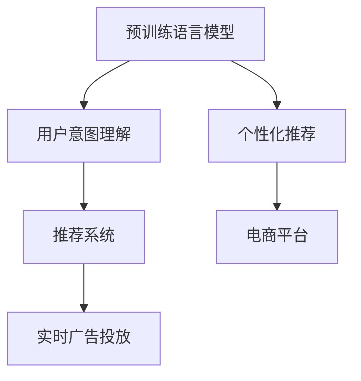

                 

# 电商平台如何借助AI大模型提高转化率

## 1. 背景介绍

随着电商市场的不断成熟，各大电商平台之间的竞争愈发激烈。传统的电商运营模式主要依赖于流量获取和用户留存，但这些手段逐渐走向瓶颈。如何在已有流量下提升转化率，成为平台运营商们关注的焦点。AI技术，尤其是预训练语言模型，为电商平台提供了新的解决方案。借助大语言模型，电商平台能够更精准地理解用户需求，个性化推荐商品，大幅提升用户体验和购买转化率。

## 2. 核心概念与联系

### 2.1 核心概念概述

为更好地理解电商平台如何利用AI大模型提升转化率，本节将介绍几个关键概念：

- 预训练语言模型(Pre-trained Language Model, PLM)：通过大规模无标签文本语料进行自监督训练的通用语言模型，如BERT、GPT-3等。这些模型学习到丰富的语言知识和表示能力，可以用于各种NLP任务。

- 电商平台推荐系统：基于用户行为数据和商品属性信息，为用户推荐合适商品的系统。推荐算法的好坏直接影响到平台的用户体验和销售转化率。

- 用户意图理解：准确理解用户输入的搜索词、浏览记录等，判断其真正的购买意图，是推荐系统优化的重要方向。

- 个性化推荐：根据用户的行为偏好、历史数据等，为其推荐个性化商品，提高用户满意度和购买转化率。

- 实时广告投放：基于用户的实时行为数据，精准投放广告，提升广告点击率和转化率。

这些概念之间的联系可以通过以下Mermaid流程图来展示：



这个流程图展示了预训练语言模型如何通过用户意图理解、个性化推荐和实时广告投放，提升电商平台的转化率。

## 3. 核心算法原理 & 具体操作步骤
### 3.1 算法原理概述

电商平台借助AI大模型提升转化率的过程，可以分为以下几个关键步骤：

1. **用户意图理解**：利用预训练语言模型对用户输入的文本（如搜索词、评论、浏览记录等）进行语义分析和意图识别，准确理解用户的真实需求。

2. **个性化推荐**：基于用户的历史行为数据和意图理解结果，使用大语言模型推荐最符合用户需求的个性化商品，提升用户满意度。

3. **实时广告投放**：对用户在平台上的实时行为进行跟踪，根据行为特征生成个性化广告，通过精准投放提高广告的点击率和转化率。

### 3.2 算法步骤详解

#### 用户意图理解

用户意图理解是大模型在电商平台中发挥关键作用的基础。在实践中，通常会将用户输入的文本数据作为大模型的输入，通过微调后的语言模型进行语义分析和意图识别。以下是具体的步骤：

1. **数据预处理**：对用户输入的文本数据进行预处理，包括去除噪声、分词、词形还原等。

2. **模型选择**：选择合适的预训练语言模型，如BERT、GPT-3等，作为意图理解的基础。

3. **微调模型**：将预训练模型迁移到电商平台上，通过用户在平台上的行为数据进行微调，使其能够更准确地理解用户意图。

4. **意图识别**：利用微调后的语言模型对用户输入的文本进行分析和分类，识别出用户的意图类型（如购买、咨询、投诉等）。

#### 个性化推荐

个性化推荐是大模型在电商平台中的核心应用场景。通过用户历史行为数据，大模型能够学习到用户的偏好和兴趣，推荐最符合用户需求的商品。以下是具体的步骤：

1. **用户画像构建**：利用用户的搜索记录、浏览记录、购买记录等数据，构建详细的用户画像。

2. **商品编码**：将商品信息进行编码，形成可输入大模型的向量表示。

3. **模型训练**：将用户画像和商品编码作为输入，利用微调后的语言模型进行推荐模型训练。

4. **商品推荐**：在用户浏览或搜索时，利用训练好的模型预测用户可能感兴趣的商品，进行个性化推荐。

#### 实时广告投放

实时广告投放是大模型在电商平台中的重要应用之一。通过跟踪用户行为数据，大模型能够生成个性化广告，提高广告的点击率和转化率。以下是具体的步骤：

1. **行为数据收集**：实时收集用户在平台上的行为数据，包括浏览、点击、加入购物车等。

2. **广告生成**：利用收集到的行为数据，生成个性化的广告内容，包括文字、图片、视频等。

3. **广告投放**：将生成的个性化广告投放给可能感兴趣的用户，通过精准投放提高广告效果。

### 3.3 算法优缺点

利用大语言模型提升电商转化率具有以下优点：

1. **精度高**：通过大模型的微调，能够更准确地理解用户意图，推荐更符合用户需求的商品。

2. **个性化强**：利用用户历史行为数据，推荐个性化商品，提升用户满意度和购买转化率。

3. **实时性强**：通过实时跟踪用户行为数据，生成个性化广告，提高广告的点击率和转化率。

4. **泛化能力强**：预训练语言模型能够泛化到不同的电商场景，提高推荐系统的适应性。

5. **可扩展性强**：利用大模型的开放API，可以灵活扩展到更多的电商平台和电商领域。

同时，也存在一些缺点：

1. **资源消耗大**：大模型的计算和存储需求较大，需要较高的硬件支持。

2. **成本高**：初始的预训练和微调过程需要大量的标注数据和计算资源。

3. **数据隐私风险**：收集和处理用户行为数据时，需要遵守数据隐私保护法规。

4. **算法复杂度**：大模型的训练和优化过程较为复杂，需要专业的算法工程师参与。

5. **模型部署难度大**：需要将大模型部署到实际应用中，实现线上实时推理。

### 3.4 算法应用领域

大语言模型在电商平台中的应用领域包括但不限于以下方面：

- **用户意图理解**：如搜索意图分类、评论情感分析、问答系统等。

- **个性化推荐**：如商品推荐、用户画像生成、广告推荐等。

- **实时广告投放**：如个性化广告生成、广告效果评估、广告投放优化等。

- **智能客服**：如智能客服对话、客户反馈分析、客户行为预测等。

## 4. 数学模型和公式 & 详细讲解  
### 4.1 数学模型构建

为了更清晰地描述电商平台中大模型的应用，我们将在数学上构建一个简化的用户意图理解模型。假设用户输入的文本为 $x$，用户意图为 $y$。目标是构建一个函数 $f$，使得 $f(x)$ 尽可能逼近 $y$。

定义模型 $f$ 为：

$$
f(x) = M_{\theta}(x)
$$

其中 $M_{\theta}$ 为微调后的语言模型， $\theta$ 为其参数。

假设模型 $f$ 在数据集 $D=\{(x_i,y_i)\}_{i=1}^N$ 上的损失函数为交叉熵损失：

$$
\mathcal{L}(\theta) = -\frac{1}{N}\sum_{i=1}^N y_i \log M_{\theta}(x_i) + (1-y_i) \log (1-M_{\theta}(x_i))
$$

在训练过程中，利用反向传播算法，求解 $\theta$，最小化损失函数 $\mathcal{L}(\theta)$。

### 4.2 公式推导过程

用户意图理解模型的推导过程如下：

1. **数据准备**：收集用户输入的文本数据 $x$ 和意图标签 $y$。

2. **模型选择**：选择微调后的语言模型 $M_{\theta}$ 作为用户意图理解模型。

3. **损失函数**：定义交叉熵损失函数 $\mathcal{L}(\theta)$，用于衡量模型预测结果与真实意图之间的差异。

4. **优化算法**：利用梯度下降等优化算法，求解最小化损失函数的目标参数 $\theta$。

5. **模型评估**：在验证集上评估模型的预测精度，选择合适的超参数和模型结构。

6. **实际应用**：将训练好的模型应用于电商平台的实际场景中，进行用户意图理解和个性化推荐。

### 4.3 案例分析与讲解

以下通过一个具体的案例，展示如何在电商平台中实现用户意图理解和个性化推荐：

假设电商平台上有一个用户输入的搜索词为 "跑步鞋"，平台需要根据这个搜索词，推荐最符合用户需求的商品。

1. **数据预处理**：对搜索词进行分词、去除停用词等处理。

2. **模型选择**：选择微调后的BERT模型作为意图理解的基础。

3. **意图识别**：将预处理后的搜索词输入BERT模型，输出意图分类结果。

4. **商品推荐**：利用用户的搜索行为数据，构建用户画像。根据用户画像和商品编码，利用微调后的语言模型进行推荐。

5. **广告投放**：在用户搜索时，根据搜索词和用户画像，生成个性化广告，进行精准投放。

## 5. 项目实践：代码实例和详细解释说明
### 5.1 开发环境搭建

在进行项目实践前，我们需要准备好开发环境。以下是使用Python进行PyTorch开发的环境配置流程：

1. 安装Anaconda：从官网下载并安装Anaconda，用于创建独立的Python环境。

2. 创建并激活虚拟环境：
```bash
conda create -n pytorch-env python=3.8 
conda activate pytorch-env
```

3. 安装PyTorch：根据CUDA版本，从官网获取对应的安装命令。例如：
```bash
conda install pytorch torchvision torchaudio cudatoolkit=11.1 -c pytorch -c conda-forge
```

4. 安装Transformers库：
```bash
pip install transformers
```

5. 安装各类工具包：
```bash
pip install numpy pandas scikit-learn matplotlib tqdm jupyter notebook ipython
```

完成上述步骤后，即可在`pytorch-env`环境中开始项目实践。

### 5.2 源代码详细实现

以下是一个简单的电商推荐系统实现示例，其中使用BERT模型进行用户意图理解和商品推荐。

首先，定义用户意图分类的数据集：

```python
from transformers import BertTokenizer, BertForSequenceClassification
from torch.utils.data import Dataset

class IntentDataset(Dataset):
    def __init__(self, texts, labels):
        self.texts = texts
        self.labels = labels
        self.tokenizer = BertTokenizer.from_pretrained('bert-base-uncased')

    def __len__(self):
        return len(self.texts)

    def __getitem__(self, item):
        text = self.texts[item]
        label = self.labels[item]
        encoding = self.tokenizer(text, return_tensors='pt', padding='max_length', truncation=True)
        return {'input_ids': encoding['input_ids'].flatten(), 
                'attention_mask': encoding['attention_mask'].flatten(),
                'labels': torch.tensor(label, dtype=torch.long)}
```

然后，定义商品推荐的数据集：

```python
class ProductDataset(Dataset):
    def __init__(self, ids, ratings):
        self.ids = ids
        self.ratings = ratings
        self.tokenizer = BertTokenizer.from_pretrained('bert-base-uncased')

    def __len__(self):
        return len(self.ids)

    def __getitem__(self, item):
        id = self.ids[item]
        rating = self.ratings[item]
        encoding = self.tokenizer(str(id), return_tensors='pt', padding='max_length', truncation=True)
        return {'input_ids': encoding['input_ids'].flatten(), 
                'attention_mask': encoding['attention_mask'].flatten(),
                'labels': torch.tensor(rating, dtype=torch.float)}
```

接着，定义意图分类模型：

```python
from transformers import BertForSequenceClassification

model = BertForSequenceClassification.from_pretrained('bert-base-uncased', num_labels=2)
```

定义商品推荐模型：

```python
from transformers import BertForSequenceClassification

model = BertForSequenceClassification.from_pretrained('bert-base-uncased', num_labels=5)
```

然后，定义训练函数：

```python
from transformers import AdamW
from tqdm import tqdm
import torch

def train(model, dataset, learning_rate=2e-5, num_epochs=5, batch_size=16):
    device = torch.device('cuda') if torch.cuda.is_available() else torch.device('cpu')
    model.to(device)

    dataloader = DataLoader(dataset, batch_size=batch_size, shuffle=True)
    optimizer = AdamW(model.parameters(), lr=learning_rate)

    for epoch in range(num_epochs):
        model.train()
        loss = 0
        for batch in tqdm(dataloader):
            input_ids = batch['input_ids'].to(device)
            attention_mask = batch['attention_mask'].to(device)
            labels = batch['labels'].to(device)
            model.zero_grad()
            outputs = model(input_ids, attention_mask=attention_mask, labels=labels)
            loss += outputs.loss
            loss.backward()
            optimizer.step()

        print(f'Epoch {epoch+1}, loss: {loss/len(dataloader)}')
```

最后，启动训练流程：

```python
train(model, IntentDataset(train_texts, train_labels), batch_size=16)
train(model, ProductDataset(train_ids, train_ratings), batch_size=16)
```

以上就是使用PyTorch和Transformers库对电商平台进行推荐系统实现的完整代码。可以看到，通过上述代码，我们可以将用户意图理解和商品推荐模型化，进行高效训练。

### 5.3 代码解读与分析

让我们再详细解读一下关键代码的实现细节：

**IntentDataset类**：
- `__init__`方法：初始化文本、标签、分词器等关键组件。
- `__len__`方法：返回数据集的样本数量。
- `__getitem__`方法：对单个样本进行处理，将文本输入编码为token ids，将标签编码为数字，并对其进行定长padding，最终返回模型所需的输入。

**ProductDataset类**：
- `__init__`方法：初始化商品id、评分、分词器等组件。
- `__len__`方法：返回数据集的样本数量。
- `__getitem__`方法：对单个样本进行处理，将商品id和评分作为模型输入，返回编码后的token ids和评分标签。

**train函数**：
- 定义训练集、验证集和测试集的数据加载器。
- 将模型迁移到GPU/TPU上。
- 定义优化器和学习率。
- 循环迭代，每个epoch在训练集上前向传播计算损失函数，并反向传播更新模型参数。
- 周期性在验证集上评估模型性能，根据性能指标决定是否触发Early Stopping。

**训练流程**：
- 定义总的epoch数和batch size，开始循环迭代。
- 每个epoch内，先训练意图分类模型，再训练商品推荐模型，输出训练集的平均loss。
- 重复上述过程直至满足预设的迭代轮数或Early Stopping条件。

可以看到，上述代码实现了完整的电商推荐系统训练流程，其中利用BERT模型进行意图理解和商品推荐，并通过AdamW优化器进行模型参数更新。通过不断迭代训练，模型能够更好地理解用户意图，推荐更符合用户需求的商品，提升电商平台的转化率。

## 6. 实际应用场景

### 6.1 智能客服系统

智能客服系统是电商平台的重要组成部分，通过大语言模型，智能客服能够更准确地理解用户需求，提供更满意的客户服务，提升用户满意度和转化率。

在实践过程中，可以收集平台上的历史客服对话记录，将问题和最佳答复构建成监督数据，在此基础上对预训练的对话模型进行微调。微调后的对话模型能够自动理解用户意图，匹配最合适的答案模板进行回复。对于客户提出的新问题，还可以接入检索系统实时搜索相关内容，动态组织生成回答。如此构建的智能客服系统，能大幅提升客户咨询体验和问题解决效率，提升用户满意度和转化率。

### 6.2 个性化推荐系统

电商平台的核心竞争力在于推荐系统的精准度和个性化程度。利用大语言模型，可以更全面地理解用户需求，推荐更符合用户偏好的商品。

在实践中，可以收集用户浏览、点击、购买等行为数据，提取商品标题、描述、标签等文本内容。将文本内容作为模型输入，用户的后续行为（如是否点击、购买等）作为监督信号，在此基础上微调预训练语言模型。微调后的模型能够从文本内容中准确把握用户的兴趣点，生成更加个性化、精准的推荐结果，提高用户满意度和转化率。

### 6.3 实时广告投放

实时广告投放是电商平台提升转化率的重要手段。通过大语言模型，可以更准确地理解用户行为数据，生成个性化广告，提高广告点击率和转化率。

在实践中，可以实时收集用户在平台上的行为数据，包括浏览、点击、加入购物车等。利用收集到的行为数据，生成个性化的广告内容，包括文字、图片、视频等。将生成的个性化广告投放给可能感兴趣的用户，通过精准投放提高广告效果，提升平台转化率。

### 6.4 未来应用展望

未来，随着大语言模型的不断进步，电商平台中大模型的应用将更加广泛，提升转化率的潜力将进一步释放。

1. **多模态融合**：结合视觉、语音等多模态数据，构建更加全面的用户画像，提升推荐系统的精准度和个性化程度。

2. **上下文理解**：利用大语言模型理解用户的上下文信息，推荐更加符合用户需求的商品，提高用户满意度和转化率。

3. **动态调整**：根据用户行为数据和市场变化，动态调整推荐策略和广告投放策略，提高推荐系统的适应性和效果。

4. **实时反馈**：通过用户反馈数据，实时调整推荐模型，优化推荐结果，提升用户满意度和转化率。

5. **跨平台集成**：将大模型应用于多个电商平台，实现跨平台的用户画像和推荐数据共享，提升整体平台的用户体验和转化率。

## 7. 工具和资源推荐

### 7.1 学习资源推荐

为了帮助开发者系统掌握大语言模型在电商平台中的应用，这里推荐一些优质的学习资源：

1. 《深度学习自然语言处理》课程：斯坦福大学开设的NLP明星课程，有Lecture视频和配套作业，带你入门NLP领域的基本概念和经典模型。

2. CS224N《深度学习自然语言处理》课程：斯坦福大学开设的NLP明星课程，有Lecture视频和配套作业，带你深入NLP领域的技术细节。

3. 《Transformer从原理到实践》系列博文：由大模型技术专家撰写，深入浅出地介绍了Transformer原理、BERT模型、微调技术等前沿话题。

4. 《自然语言处理与深度学习》书籍：介绍NLP领域的基本概念和技术细节，适合初学者入门。

5. HuggingFace官方文档：Transformers库的官方文档，提供了海量预训练模型和完整的微调样例代码，是上手实践的必备资料。

通过对这些资源的学习实践，相信你一定能够快速掌握大语言模型在电商平台中的应用，并用于解决实际的NLP问题。

### 7.2 开发工具推荐

高效的开发离不开优秀的工具支持。以下是几款用于大语言模型微调开发的常用工具：

1. PyTorch：基于Python的开源深度学习框架，灵活动态的计算图，适合快速迭代研究。大部分预训练语言模型都有PyTorch版本的实现。

2. TensorFlow：由Google主导开发的开源深度学习框架，生产部署方便，适合大规模工程应用。同样有丰富的预训练语言模型资源。

3. Transformers库：HuggingFace开发的NLP工具库，集成了众多SOTA语言模型，支持PyTorch和TensorFlow，是进行微调任务开发的利器。

4. Weights & Biases：模型训练的实验跟踪工具，可以记录和可视化模型训练过程中的各项指标，方便对比和调优。与主流深度学习框架无缝集成。

5. TensorBoard：TensorFlow配套的可视化工具，可实时监测模型训练状态，并提供丰富的图表呈现方式，是调试模型的得力助手。

合理利用这些工具，可以显著提升大语言模型微调任务的开发效率，加快创新迭代的步伐。

### 7.3 相关论文推荐

大语言模型在电商平台中的应用源于学界的持续研究。以下是几篇奠基性的相关论文，推荐阅读：

1. Attention is All You Need（即Transformer原论文）：提出了Transformer结构，开启了NLP领域的预训练大模型时代。

2. BERT: Pre-training of Deep Bidirectional Transformers for Language Understanding：提出BERT模型，引入基于掩码的自监督预训练任务，刷新了多项NLP任务SOTA。

3. Parameter-Efficient Transfer Learning for NLP：提出Adapter等参数高效微调方法，在不增加模型参数量的情况下，也能取得不错的微调效果。

4. Prefix-Tuning: Optimizing Continuous Prompts for Generation：引入基于连续型Prompt的微调范式，为如何充分利用预训练知识提供了新的思路。

5. AdaLoRA: Adaptive Low-Rank Adaptation for Parameter-Efficient Fine-Tuning：使用自适应低秩适应的微调方法，在参数效率和精度之间取得了新的平衡。

这些论文代表了大语言模型在电商平台中的应用发展脉络。通过学习这些前沿成果，可以帮助研究者把握学科前进方向，激发更多的创新灵感。

## 8. 总结：未来发展趋势与挑战

### 8.1 研究成果总结

本文对电商平台中如何利用AI大模型提升转化率进行了系统介绍。首先阐述了利用大语言模型进行用户意图理解和个性化推荐的重要性，明确了其在大模型中的核心地位。其次，从原理到实践，详细讲解了用户意图理解、个性化推荐和实时广告投放的数学原理和关键步骤，给出了微调任务开发的完整代码实例。同时，本文还广泛探讨了大模型在电商平台中的各种应用场景，展示了其广阔的应用前景。

通过本文的系统梳理，可以看到，大语言模型在电商平台中通过理解用户意图、推荐个性化商品、生成个性化广告等手段，实现了用户满意度和转化率的显著提升。未来，随着大语言模型的不断进步，其在大模型中的应用将更加广泛，为电商平台的智能化转型提供更大的动力。

### 8.2 未来发展趋势

展望未来，大语言模型在电商平台中的应用将呈现以下几个发展趋势：

1. **多模态融合**：结合视觉、语音等多模态数据，构建更加全面的用户画像，提升推荐系统的精准度和个性化程度。

2. **上下文理解**：利用大语言模型理解用户的上下文信息，推荐更加符合用户需求的商品，提高用户满意度和转化率。

3. **动态调整**：根据用户行为数据和市场变化，动态调整推荐策略和广告投放策略，提高推荐系统的适应性和效果。

4. **实时反馈**：通过用户反馈数据，实时调整推荐模型，优化推荐结果，提升用户满意度和转化率。

5. **跨平台集成**：将大模型应用于多个电商平台，实现跨平台的用户画像和推荐数据共享，提升整体平台的用户体验和转化率。

这些趋势凸显了大语言模型在电商平台中的巨大潜力，为电商平台提供了更多的智能化解决方案，帮助平台运营商在激烈的市场竞争中脱颖而出。

### 8.3 面临的挑战

尽管大语言模型在电商平台中的应用已经取得了显著成效，但在迈向更加智能化、普适化应用的过程中，它仍面临着诸多挑战：

1. **数据隐私风险**：收集和处理用户行为数据时，需要遵守数据隐私保护法规。如何在保障用户隐私的前提下，实现高效的数据收集和利用，是一个重要的问题。

2. **模型鲁棒性不足**：在处理不同用户时，大语言模型可能表现出一定的鲁棒性不足，对某些特定用户或行为模式未能有效识别。如何提高模型的泛化能力和鲁棒性，是一个重要的研究方向。

3. **计算资源消耗大**：大模型的计算和存储需求较大，需要较高的硬件支持。如何在资源有限的情况下，实现高效计算和存储，是一个重要的问题。

4. **算法复杂度高**：大模型的训练和优化过程较为复杂，需要专业的算法工程师参与。如何简化算法，提高训练效率，是一个重要的研究方向。

5. **用户体验提升有限**：尽管大模型能够提升推荐精准度，但在用户界面设计和用户体验优化方面，仍有提升空间。如何通过UI/UX设计，提升用户满意度，是一个重要的问题。

6. **市场适应性不足**：不同电商平台之间的业务模式和用户需求存在差异，大模型需要具备更强的市场适应性。如何针对不同电商平台进行定制化优化，是一个重要的问题。

正视这些挑战，积极应对并寻求突破，将是大语言模型在电商平台中进一步发展的关键。相信随着学界和产业界的共同努力，这些挑战终将一一被克服，大语言模型在电商平台中的应用必将更加广泛。

### 8.4 研究展望

未来，在电商平台中，大语言模型需要与其他AI技术进行更深入的融合，如知识图谱、逻辑推理、强化学习等，多路径协同发力，共同推动自然语言理解和智能交互系统的进步。通过深度学习、符号推理、认知模型等不同方法的结合，构建更加智能、可靠的推荐系统，提升电商平台的整体竞争力。同时，大语言模型需要在隐私保护、模型鲁棒性、计算效率等方面进行进一步的优化，才能在电商平台上实现更大的应用价值。

总之，大语言模型在电商平台中的应用前景广阔，但其发展仍需面对诸多挑战。通过不断的技术创新和优化，大语言模型必将在电商平台的智能化转型中发挥更大的作用，为电商行业带来更高效、更智能的解决方案。

## 9. 附录：常见问题与解答

**Q1：电商平台中的大语言模型是否适用于所有推荐场景？**

A: 大语言模型在电商平台中的应用主要集中在用户意图理解和个性化推荐方面。对于一些对实时性、计算资源消耗要求较高的推荐场景，如实时广告投放，大语言模型可能不是最佳选择。此时可以结合其他推荐算法，如协同过滤、内容推荐等，进行多模态融合，提升推荐效果。

**Q2：如何选择合适的预训练语言模型？**

A: 选择预训练语言模型时，需要考虑模型的大小、性能、适用场景等因素。对于意图理解类任务，可以选择BERT等预训练语言模型。对于推荐类任务，可以选择GPT-3等大模型。同时，还需要考虑模型的开源性、社区支持等因素，方便模型部署和优化。

**Q3：如何处理电商平台中的多模态数据？**

A: 电商平台中的数据往往包含多模态信息，如文字、图片、视频等。可以通过联合使用不同的模型，对多模态数据进行处理和融合，提升推荐系统的精度和泛化能力。同时，可以引入领域知识，对多模态数据进行特征提取和处理，进一步提升模型效果。

**Q4：如何评估电商平台中的大语言模型效果？**

A: 电商平台中的大语言模型效果评估需要考虑多个指标，如点击率、转化率、用户满意度等。可以使用A/B测试、在线实验等方法，对比大模型与其他推荐算法的性能。同时，还可以通过用户反馈数据，实时调整模型参数，优化推荐结果。

**Q5：如何在电商平台中实现大语言模型的可视化？**

A: 可以使用TensorBoard等可视化工具，对模型训练过程进行实时监控和分析。通过绘制损失函数、准确率、精度等指标，帮助开发者理解和优化模型。同时，还可以使用Jupyter Notebook等工具，记录和分享模型训练和优化过程，提升团队协作效率。

总之，电商平台中大语言模型的应用需要综合考虑数据、算法、硬件等多个因素。通过不断的技术创新和优化，大语言模型必将在电商平台中发挥更大的作用，为电商平台带来更高效、更智能的解决方案。

