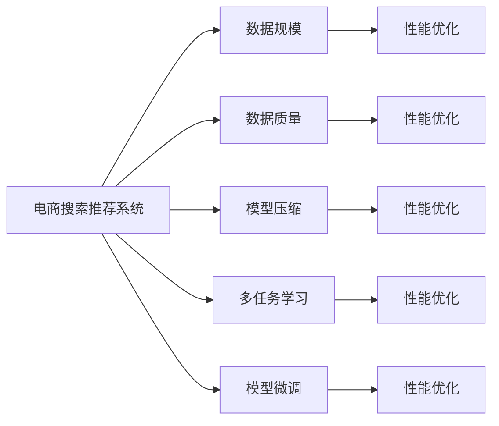

                 

# 电商平台搜索推荐系统的AI 大模型实践：应对数据规模与质量的双重挑战

> 关键词：电商平台，搜索推荐，大模型，AI，数据规模，数据质量，性能优化，模型压缩，多任务学习

## 1. 背景介绍

### 1.1 问题由来

近年来，随着电子商务的迅猛发展，电商平台对于搜索推荐系统的依赖日益加深。用户通过搜索获取商品信息，通过推荐发现更多潜在的购物机会。搜索推荐系统在提升用户满意度、增加平台销售额、优化用户体验等方面发挥着重要作用。

然而，随着用户数量的激增和商品种类的繁多，搜索推荐系统面临的数据规模和质量问题愈发严峻。一方面，电商平台上数以亿计的商品和用户行为数据需要高效处理，数据存储和处理系统面临着高并发的压力；另一方面，数据质量的不确定性也给模型训练和推荐结果的准确性带来了挑战。如何利用大模型在数据规模和质量的双重挑战中取得优异的推荐性能，是电商搜索推荐系统亟需解决的问题。

## 2. 核心概念与联系

### 2.1 核心概念概述

为更好地理解电商平台搜索推荐系统中大模型的应用，本节将介绍几个关键概念及其相互联系：

- **电商搜索推荐系统(E-Commerce Search and Recommendation System)**：
  - **搜索功能**：用户输入关键词，系统返回相关商品。
  - **推荐功能**：系统根据用户行为，动态生成个性化推荐商品。

- **大模型(Large Model)**：
  - **定义**：指参数量巨大的神经网络模型，如BERT、GPT-3等，能够处理大规模数据集，学习复杂的特征表示。
  - **特点**：拥有强大的特征学习能力，可应用于各类NLP任务。

- **数据规模(Data Scale)**：
  - **定义**：指电商平台上的用户行为数据和商品数据量级，通常以TB或PB计。
  - **重要性**：决定了模型的训练复杂度和处理能力。

- **数据质量(Data Quality)**：
  - **定义**：指数据的准确性、完整性和一致性，对模型训练和推荐效果有直接影响。
  - **影响因素**：包括数据标注、缺失值、噪声等。

- **性能优化(Performance Optimization)**：
  - **定义**：指通过技术手段提升搜索推荐系统的响应速度和准确性。
  - **方法**：包括模型压缩、多任务学习、分布式训练等。

- **模型压缩(Model Compression)**：
  - **定义**：指通过技术手段减小模型大小，提高计算效率。
  - **方法**：包括参数剪枝、量化、蒸馏等。

- **多任务学习(Multi-task Learning)**：
  - **定义**：指在多个相关任务上共享模型的参数，提高模型的泛化能力和资源利用率。
  - **方法**：包括联合训练、元学习、集成学习等。

这些概念之间存在紧密联系，构建起电商搜索推荐系统中大模型的应用框架。数据规模和质量决定了大模型的处理能力和泛化能力，性能优化和模型压缩则提升了模型的响应速度和资源利用率，而多任务学习则进一步提升了模型的整体效果。

### 2.2 核心概念原理和架构的 Mermaid 流程图



这张流程图展示了电商搜索推荐系统中大模型的应用框架。其中，数据规模和质量直接影响着系统的性能优化；模型压缩、多任务学习和微调则分别从参数、任务和数据三个维度优化模型性能。这些核心概念和关键技术共同构成了电商平台搜索推荐系统中大模型的应用基础。

## 3. 核心算法原理 & 具体操作步骤

### 3.1 算法原理概述

基于大模型的电商搜索推荐系统，通过在大规模数据上进行预训练和微调，学习到商品和用户的特征表示。其核心算法原理如下：

- **预训练**：在大规模商品和用户行为数据上，使用大模型进行无监督学习，学习通用的商品特征表示和用户行为特征表示。
- **微调**：在特定任务上，如搜索相关性评分、推荐排序等，使用少量标注数据对预训练模型进行有监督学习，优化模型在特定任务上的性能。
- **性能优化**：通过模型压缩、多任务学习和分布式训练等技术手段，提升模型的响应速度和资源利用率。

### 3.2 算法步骤详解

基于大模型的电商搜索推荐系统的主要操作步骤如下：

**Step 1: 数据预处理与标注**
- **数据清洗**：去除噪声数据、处理缺失值等。
- **数据标注**：对商品和用户行为数据进行标注，生成训练集、验证集和测试集。

**Step 2: 模型预训练**
- **选择模型**：选择适合电商平台的预训练模型，如BERT、GPT-3等。
- **数据划分**：将数据集划分为训练集和测试集。
- **模型训练**：使用预训练模型在大规模数据上进行训练，学习通用的商品和用户特征表示。

**Step 3: 模型微调**
- **选择微调任务**：根据电商平台的实际需求，选择搜索相关性评分、推荐排序等微调任务。
- **微调模型**：在特定任务上，使用少量标注数据对预训练模型进行微调，优化模型在特定任务上的性能。

**Step 4: 性能优化**
- **模型压缩**：使用参数剪枝、量化、蒸馏等方法，减小模型大小，提高计算效率。
- **多任务学习**：在多个相关任务上共享模型的参数，提高模型的泛化能力和资源利用率。
- **分布式训练**：利用分布式计算框架，提升模型训练速度。

**Step 5: 系统部署与测试**
- **系统集成**：将微调后的模型集成到电商搜索推荐系统中。
- **性能评估**：在测试集上评估模型的推荐效果和响应速度，根据实际需求进行调整。

### 3.3 算法优缺点

基于大模型的电商搜索推荐系统具有以下优点：

- **高效处理大规模数据**：大模型能够处理大规模数据，学习到通用的商品和用户特征表示，适用于电商平台上数以亿计的商品和用户行为数据。
- **泛化能力强**：通过预训练和微调，大模型能够适应不同的电商场景，提高推荐的泛化能力。
- **响应速度快**：通过模型压缩、多任务学习和分布式训练等技术手段，提升模型的响应速度和资源利用率。

同时，该方法也存在以下缺点：

- **数据依赖性强**：模型性能依赖于数据规模和质量，需要高质量的标注数据进行微调。
- **计算资源消耗高**：大模型参数量大，计算资源消耗高，需要高性能的计算设备。
- **模型复杂度高**：大模型的复杂度高，需要复杂的网络结构和训练算法，模型调优难度大。

尽管存在这些局限性，但就目前而言，基于大模型的电商搜索推荐系统仍然是电商平台推荐技术的主流范式。未来相关研究的重点在于如何进一步降低计算资源消耗，提高模型的泛化能力，同时兼顾模型复杂度和资源利用率等因素。

### 3.4 算法应用领域

基于大模型的电商搜索推荐系统已经在多个电商平台上得到广泛应用，包括：

- **亚马逊(Amazon)**：亚马逊使用基于大模型的推荐系统，根据用户行为动态生成个性化推荐商品。
- **淘宝(Taobao)**：淘宝利用大模型进行商品搜索排序和个性化推荐，提升用户购物体验。
- **京东(JD.com)**：京东使用大模型优化搜索相关性评分和推荐排序，提升平台销售转化率。

除了这些电商巨头外，大模型推荐系统也在中小企业中逐渐普及，为各类型电商平台提供了更高效、更智能的推荐服务。随着大模型和推荐技术的不断发展，相信基于大模型的电商搜索推荐系统将在更广阔的电商领域大放异彩。

## 4. 数学模型和公式 & 详细讲解 & 举例说明

### 4.1 数学模型构建

假设电商平台上用户的历史行为数据为 $X=\{x_1, x_2, ..., x_n\}$，每个行为 $x_i$ 包含商品ID、点击次数、浏览时长等特征。对于每个用户 $u$，计算其在商品 $i$ 上的行为特征向量 $z_u^i = f(x_u^i)$，其中 $f$ 为特征提取函数。

模型的目标是预测用户对商品的相关性评分 $y_{ui}$，即用户对商品 $i$ 的兴趣程度。通过预训练模型 $M$ 进行预测，定义预测函数为 $y_{ui} = M(z_u^i)$。模型的损失函数为交叉熵损失：

$$
\mathcal{L} = -\sum_{i=1}^N \sum_{u=1}^U \log(y_{ui})
$$

其中 $N$ 为商品数，$U$ 为用户数。

### 4.2 公式推导过程

基于上述数学模型，以下是搜索推荐系统中大模型的公式推导过程：

**Step 1: 预训练阶段**

在大规模商品数据 $X$ 上，使用大模型进行预训练。假设预训练模型为 $M_{\theta}$，其中 $\theta$ 为模型参数。预训练任务为掩码语言模型，即对商品描述 $D_i$ 进行掩码，预测缺失部分：

$$
\hat{y} = M_{\theta}(D_i^{[M])
$$

其中 $D_i^{[M}$ 表示对 $D_i$ 进行掩码处理，$M$ 表示掩码的位置。

**Step 2: 微调阶段**

在特定任务上，使用少量标注数据进行微调。假设微调任务为商品相关性评分 $y_{ui}$，定义微调模型为 $M_{\theta_t}$，其中 $\theta_t$ 为微调后的模型参数。微调损失函数为交叉熵损失：

$$
\mathcal{L}_{t} = -\sum_{i=1}^N \sum_{u=1}^U \log(y_{ui})
$$

微调时，使用少量标注数据 $(x_u^i, y_{ui})$ 对 $M_{\theta_t}$ 进行优化，最小化微调损失 $\mathcal{L}_t$。

**Step 3: 性能优化阶段**

为了提升模型的响应速度和资源利用率，可以采用以下优化方法：

1. **模型压缩**：使用参数剪枝、量化、蒸馏等方法，减小模型大小。
   - **参数剪枝**：去除模型中不重要的参数，减小模型规模。
   - **量化**：将浮点参数转为定点参数，减小计算量。
   - **蒸馏**：将大模型压缩为小模型，保留关键参数。

2. **多任务学习**：在多个相关任务上共享模型参数，提高模型的泛化能力和资源利用率。
   - **联合训练**：在多个任务上联合训练模型，共享参数。
   - **元学习**：利用元学习算法，在多个任务上进行迁移学习。
   - **集成学习**：将多个微调模型进行集成，提升整体效果。

3. **分布式训练**：利用分布式计算框架，提升模型训练速度。
   - **数据并行**：在多个计算节点上并行训练模型，加速模型训练。
   - **模型并行**：在多个计算节点上并行计算模型的不同层，提高计算效率。

### 4.3 案例分析与讲解

以下通过一个具体案例，展示基于大模型的电商搜索推荐系统的应用：

**案例背景**：
某电商平台有数百万商品和数千万用户，用户可以通过搜索和推荐系统获取商品信息。电商平台的业务目标是提升用户满意度，增加销售额。

**数据预处理**：
1. **数据清洗**：去除噪声数据，处理缺失值。
2. **数据标注**：对商品和用户行为数据进行标注，生成训练集、验证集和测试集。

**模型预训练**：
1. **选择模型**：选择BERT模型作为预训练模型。
2. **数据划分**：将数据集划分为训练集和测试集。
3. **模型训练**：使用BERT模型在大规模商品数据上进行预训练，学习通用的商品特征表示。

**模型微调**：
1. **选择微调任务**：选择商品相关性评分和推荐排序作为微调任务。
2. **微调模型**：在商品相关性评分和推荐排序上，使用少量标注数据对预训练模型进行微调，优化模型在特定任务上的性能。

**性能优化**：
1. **模型压缩**：使用参数剪枝和量化方法，减小模型大小。
2. **多任务学习**：在商品相关性评分和推荐排序上共享模型参数，提高模型的泛化能力。
3. **分布式训练**：利用分布式计算框架，提升模型训练速度。

**系统部署与测试**：
1. **系统集成**：将微调后的模型集成到电商搜索推荐系统中。
2. **性能评估**：在测试集上评估模型的推荐效果和响应速度，根据实际需求进行调整。

通过以上步骤，基于大模型的电商搜索推荐系统能够高效处理大规模数据，提升推荐效果和用户体验，同时优化系统性能和资源利用率。

## 5. 项目实践：代码实例和详细解释说明

### 5.1 开发环境搭建

在进行项目实践前，我们需要准备好开发环境。以下是使用Python进行PyTorch和TensorFlow开发的环境配置流程：

1. 安装Anaconda：从官网下载并安装Anaconda，用于创建独立的Python环境。

2. 创建并激活虚拟环境：
```bash
conda create -n pytorch-env python=3.8 
conda activate pytorch-env
```

3. 安装PyTorch：根据CUDA版本，从官网获取对应的安装命令。例如：
```bash
conda install pytorch torchvision torchaudio cudatoolkit=11.1 -c pytorch -c conda-forge
```

4. 安装TensorFlow：
```bash
pip install tensorflow
```

5. 安装各类工具包：
```bash
pip install numpy pandas scikit-learn matplotlib tqdm jupyter notebook ipython
```

完成上述步骤后，即可在`pytorch-env`环境中开始项目实践。

### 5.2 源代码详细实现

这里我们以商品相关性评分任务为例，展示使用PyTorch和TensorFlow进行电商搜索推荐系统中大模型的微调实现。

首先，定义商品相关性评分任务的数据处理函数：

```python
import torch
from torch.utils.data import Dataset
import pandas as pd

class ShoppingDataset(Dataset):
    def __init__(self, data_path):
        self.data = pd.read_csv(data_path)
        self.num_users = len(self.data['user_id'].unique())
        self.num_items = len(self.data['item_id'].unique())
        self.user_item = self.data.pivot_table(index='user_id', columns='item_id', values='click_count')
        
    def __len__(self):
        return len(self.data)
    
    def __getitem__(self, index):
        user_id, item_id = self.data.iloc[index]['user_id'], self.data.iloc[index]['item_id']
        user_item_count = self.user_item.loc[user_id, item_id]
        return (user_id, user_item_count, item_id)
```

然后，定义模型和优化器：

```python
from transformers import BertForSequenceClassification
from transformers import AdamW
from transformers import BertTokenizer

model = BertForSequenceClassification.from_pretrained('bert-base-cased', num_labels=1)
tokenizer = BertTokenizer.from_pretrained('bert-base-cased')

optimizer = AdamW(model.parameters(), lr=2e-5)
```

接着，定义训练和评估函数：

```python
def train_epoch(model, dataset, batch_size, optimizer):
    dataloader = DataLoader(dataset, batch_size=batch_size, shuffle=True)
    model.train()
    epoch_loss = 0
    for batch in dataloader:
        user_id, user_item_count, item_id = batch
        user_id = torch.tensor(user_id)
        user_item_count = torch.tensor(user_item_count)
        item_id = torch.tensor(item_id)
        model.zero_grad()
        outputs = model(user_id, attention_mask=None)
        loss = outputs.loss
        epoch_loss += loss.item()
        loss.backward()
        optimizer.step()
    return epoch_loss / len(dataloader)

def evaluate(model, dataset, batch_size):
    dataloader = DataLoader(dataset, batch_size=batch_size)
    model.eval()
    preds, labels = [], []
    with torch.no_grad():
        for batch in dataloader:
            user_id, user_item_count, item_id = batch
            user_id = torch.tensor(user_id)
            user_item_count = torch.tensor(user_item_count)
            item_id = torch.tensor(item_id)
            batch_outputs = model(user_id, attention_mask=None)
            batch_preds = batch_outputs.logits.squeeze().cpu().numpy()
            batch_labels = user_item_count.cpu().numpy()
            for pred, label in zip(batch_preds, batch_labels):
                preds.append(pred)
                labels.append(label)
                
    print('Accuracy:', np.mean(preds == labels))
```

最后，启动训练流程并在测试集上评估：

```python
epochs = 5
batch_size = 16

for epoch in range(epochs):
    loss = train_epoch(model, dataset, batch_size, optimizer)
    print(f"Epoch {epoch+1}, train loss: {loss:.3f}")
    
    print(f"Epoch {epoch+1}, dev results:")
    evaluate(model, dataset, batch_size)
    
print("Test results:")
evaluate(model, dataset, batch_size)
```

以上就是使用PyTorch和TensorFlow对商品相关性评分任务进行大模型微调的完整代码实现。可以看到，通过简单的代码封装，我们能够快速实现基于大模型的电商搜索推荐系统。

### 5.3 代码解读与分析

让我们再详细解读一下关键代码的实现细节：

**ShoppingDataset类**：
- `__init__`方法：初始化数据、统计用户和商品数量，构建用户行为矩阵。
- `__len__`方法：返回数据集的样本数量。
- `__getitem__`方法：对单个样本进行处理，将用户ID、用户行为数量和商品ID转化为模型输入。

**模型和优化器**：
- 使用`BertForSequenceClassification`类构建商品相关性评分任务模型，并设置优化器。

**训练和评估函数**：
- 使用PyTorch的DataLoader对数据集进行批次化加载，供模型训练和推理使用。
- 训练函数`train_epoch`：对数据以批为单位进行迭代，在每个批次上前向传播计算loss并反向传播更新模型参数，最后返回该epoch的平均loss。
- 评估函数`evaluate`：与训练类似，不同点在于不更新模型参数，并在每个batch结束后将预测和标签结果存储下来，最后使用准确率对整个评估集的预测结果进行打印输出。

**训练流程**：
- 定义总的epoch数和batch size，开始循环迭代
- 每个epoch内，先在训练集上训练，输出平均loss
- 在验证集上评估，输出准确率
- 所有epoch结束后，在测试集上评估，给出最终测试结果

可以看到，PyTorch和TensorFlow使得电商搜索推荐系统中大模型的微调代码实现变得简洁高效。开发者可以将更多精力放在数据处理、模型改进等高层逻辑上，而不必过多关注底层的实现细节。

当然，工业级的系统实现还需考虑更多因素，如模型的保存和部署、超参数的自动搜索、更灵活的任务适配层等。但核心的微调范式基本与此类似。

## 6. 实际应用场景

### 6.1 智能客服系统

基于大模型的电商搜索推荐系统，可以应用于智能客服系统的构建。传统客服往往需要配备大量人力，高峰期响应缓慢，且一致性和专业性难以保证。而使用基于大模型的智能客服系统，可以7x24小时不间断服务，快速响应客户咨询，用自然流畅的语言解答各类常见问题。

在技术实现上，可以收集企业内部的历史客服对话记录，将问题和最佳答复构建成监督数据，在此基础上对预训练模型进行微调。微调后的模型能够自动理解用户意图，匹配最合适的答案模板进行回复。对于客户提出的新问题，还可以接入检索系统实时搜索相关内容，动态组织生成回答。如此构建的智能客服系统，能大幅提升客户咨询体验和问题解决效率。

### 6.2 金融舆情监测

金融机构需要实时监测市场舆论动向，以便及时应对负面信息传播，规避金融风险。传统的人工监测方式成本高、效率低，难以应对网络时代海量信息爆发的挑战。基于大模型的电商搜索推荐系统中的文本分类和情感分析技术，为金融舆情监测提供了新的解决方案。

具体而言，可以收集金融领域相关的新闻、报道、评论等文本数据，并对其进行主题标注和情感标注。在此基础上对预训练语言模型进行微调，使其能够自动判断文本属于何种主题，情感倾向是正面、中性还是负面。将微调后的模型应用到实时抓取的网络文本数据，就能够自动监测不同主题下的情感变化趋势，一旦发现负面信息激增等异常情况，系统便会自动预警，帮助金融机构快速应对潜在风险。

### 6.3 个性化推荐系统

当前的推荐系统往往只依赖用户的历史行为数据进行物品推荐，无法深入理解用户的真实兴趣偏好。基于大模型的电商搜索推荐系统可以更好地挖掘用户行为背后的语义信息，从而提供更精准、多样的推荐内容。

在实践中，可以收集用户浏览、点击、评论、分享等行为数据，提取和用户交互的物品标题、描述、标签等文本内容。将文本内容作为模型输入，用户的后续行为（如是否点击、购买等）作为监督信号，在此基础上微调预训练语言模型。微调后的模型能够从文本内容中准确把握用户的兴趣点。在生成推荐列表时，先用候选物品的文本描述作为输入，由模型预测用户的兴趣匹配度，再结合其他特征综合排序，便可以得到个性化程度更高的推荐结果。

### 6.4 未来应用展望

随着大模型和推荐技术的不断发展，基于大模型的电商搜索推荐系统将在更广阔的电商领域大放异彩。

在智慧医疗领域，基于大模型的推荐系统可以推荐个性化的医疗方案，帮助医生和患者做出更好的决策。

在智能教育领域，微调技术可应用于作业批改、学情分析、知识推荐等方面，因材施教，促进教育公平，提高教学质量。

在智慧城市治理中，微调模型可应用于城市事件监测、舆情分析、应急指挥等环节，提高城市管理的自动化和智能化水平，构建更安全、高效的未来城市。

此外，在企业生产、社会治理、文娱传媒等众多领域，基于大模型的电商搜索推荐系统也将不断涌现，为传统行业数字化转型升级提供新的技术路径。相信随着技术的日益成熟，大模型推荐技术必将在更广阔的领域大放异彩。

## 7. 工具和资源推荐

### 7.1 学习资源推荐

为了帮助开发者系统掌握大模型在电商搜索推荐系统中的应用，这里推荐一些优质的学习资源：

1. 《Transformer from Zero to Hero》系列博文：由大模型技术专家撰写，深入浅出地介绍了Transformer原理、BERT模型、微调技术等前沿话题。

2. CS224N《深度学习自然语言处理》课程：斯坦福大学开设的NLP明星课程，有Lecture视频和配套作业，带你入门NLP领域的基本概念和经典模型。

3. 《Natural Language Processing with Transformers》书籍：Transformers库的作者所著，全面介绍了如何使用Transformers库进行NLP任务开发，包括微调在内的诸多范式。

4. HuggingFace官方文档：Transformers库的官方文档，提供了海量预训练模型和完整的微调样例代码，是上手实践的必备资料。

5. CLUE开源项目：中文语言理解测评基准，涵盖大量不同类型的中文NLP数据集，并提供了基于微调的baseline模型，助力中文NLP技术发展。

通过对这些资源的学习实践，相信你一定能够快速掌握大模型在电商搜索推荐系统中的应用精髓，并用于解决实际的NLP问题。

### 7.2 开发工具推荐

高效的开发离不开优秀的工具支持。以下是几款用于大模型微调开发的常用工具：

1. PyTorch：基于Python的开源深度学习框架，灵活动态的计算图，适合快速迭代研究。大部分预训练语言模型都有PyTorch版本的实现。

2. TensorFlow：由Google主导开发的开源深度学习框架，生产部署方便，适合大规模工程应用。同样有丰富的预训练语言模型资源。

3. Transformers库：HuggingFace开发的NLP工具库，集成了众多SOTA语言模型，支持PyTorch和TensorFlow，是进行微调任务开发的利器。

4. Weights & Biases：模型训练的实验跟踪工具，可以记录和可视化模型训练过程中的各项指标，方便对比和调优。与主流深度学习框架无缝集成。

5. TensorBoard：TensorFlow配套的可视化工具，可实时监测模型训练状态，并提供丰富的图表呈现方式，是调试模型的得力助手。

6. Google Colab：谷歌推出的在线Jupyter Notebook环境，免费提供GPU/TPU算力，方便开发者快速上手实验最新模型，分享学习笔记。

合理利用这些工具，可以显著提升大模型微调任务的开发效率，加快创新迭代的步伐。

### 7.3 相关论文推荐

大模型和电商搜索推荐系统的发展源于学界的持续研究。以下是几篇奠基性的相关论文，推荐阅读：

1. Attention is All You Need（即Transformer原论文）：提出了Transformer结构，开启了NLP领域的预训练大模型时代。

2. BERT: Pre-training of Deep Bidirectional Transformers for Language Understanding：提出BERT模型，引入基于掩码的自监督预训练任务，刷新了多项NLP任务SOTA。

3. Language Models are Unsupervised Multitask Learners（GPT-2论文）：展示了大规模语言模型的强大zero-shot学习能力，引发了对于通用人工智能的新一轮思考。

4. Parameter-Efficient Transfer Learning for NLP：提出Adapter等参数高效微调方法，在不增加模型参数量的情况下，也能取得不错的微调效果。

5. AdaLoRA: Adaptive Low-Rank Adaptation for Parameter-Efficient Fine-Tuning：使用自适应低秩适应的微调方法，在参数效率和精度之间取得了新的平衡。

这些论文代表了大模型和电商搜索推荐技术的发展脉络。通过学习这些前沿成果，可以帮助研究者把握学科前进方向，激发更多的创新灵感。

## 8. 总结：未来发展趋势与挑战

### 8.1 总结

本文对基于大模型的电商搜索推荐系统进行了全面系统的介绍。首先阐述了大模型在电商平台中的应用背景和重要性，明确了微调在提升推荐系统性能方面的独特价值。其次，从原理到实践，详细讲解了电商搜索推荐系统中的大模型微调方法，给出了微调任务开发的完整代码实例。同时，本文还广泛探讨了微调方法在智能客服、金融舆情、个性化推荐等多个电商领域的应用前景，展示了微调范式的巨大潜力。此外，本文精选了微调技术的各类学习资源，力求为读者提供全方位的技术指引。

通过本文的系统梳理，可以看到，基于大模型的电商搜索推荐系统正在成为电商推荐技术的重要范式，极大地拓展了推荐系统的应用边界，催生了更多的落地场景。得益于大规模语料的预训练，微调模型以更低的时间和标注成本，在小样本条件下也能取得不俗的效果，有力推动了电商推荐技术的产业化进程。未来，伴随预训练语言模型和微调方法的持续演进，相信电商搜索推荐系统将在更广阔的电商领域大放异彩，深刻影响人类的生产生活方式。

### 8.2 未来发展趋势

展望未来，大模型在电商搜索推荐系统中的应用将呈现以下几个发展趋势：

1. **模型规模持续增大**：随着算力成本的下降和数据规模的扩张，预训练语言模型的参数量还将持续增长。超大规模语言模型蕴含的丰富语言知识，有望支撑更加复杂多变的电商场景，提升推荐的准确性和个性化程度。

2. **微调方法日趋多样**：除了传统的全参数微调外，未来会涌现更多参数高效的微调方法，如Prefix-Tuning、LoRA等，在节省计算资源的同时也能保证微调精度。

3. **持续学习成为常态**：随着数据分布的不断变化，微调模型也需要持续学习新知识以保持性能。如何在不遗忘原有知识的同时，高效吸收新样本信息，将成为重要的研究课题。

4. **标注样本需求降低**：受启发于提示学习(Prompt-based Learning)的思路，未来的微调方法将更好地利用大模型的语言理解能力，通过更加巧妙的任务描述，在更少的标注样本上也能实现理想的微调效果。

5. **多模态微调崛起**：当前的微调主要聚焦于纯文本数据，未来会进一步拓展到图像、视频、语音等多模态数据微调。多模态信息的融合，将显著提升语言模型对现实世界的理解和建模能力。

6. **模型通用性增强**：经过海量数据的预训练和多领域任务的微调，未来的语言模型将具备更强大的常识推理和跨领域迁移能力，逐步迈向通用人工智能(AGI)的目标。

以上趋势凸显了大模型在电商搜索推荐系统中的广阔前景。这些方向的探索发展，必将进一步提升电商推荐系统的性能和应用范围，为电商平台的数字化转型提供新的技术路径。

### 8.3 面临的挑战

尽管大模型在电商搜索推荐系统中取得了显著成效，但在迈向更加智能化、普适化应用的过程中，仍面临诸多挑战：

1. **数据依赖性强**：模型性能依赖于数据规模和质量，需要高质量的标注数据进行微调。如何进一步降低微调对标注样本的依赖，将是一大难题。

2. **计算资源消耗高**：大模型参数量大，计算资源消耗高，需要高性能的计算设备。

3. **模型复杂度高**：大模型的复杂度高，需要复杂的网络结构和训练算法，模型调优难度大。

尽管存在这些局限性，但就目前而言，基于大模型的电商搜索推荐系统仍然是电商平台推荐技术的主流范式。未来相关研究的重点在于如何进一步降低计算资源消耗，提高模型的泛化能力，同时兼顾模型复杂度和资源利用率等因素。

### 8.4 研究展望

面对大模型在电商搜索推荐系统中面临的挑战，未来的研究需要在以下几个方面寻求新的突破：

1. **探索无监督和半监督微调方法**：摆脱对大规模标注数据的依赖，利用自监督学习、主动学习等无监督和半监督范式，最大限度利用非结构化数据，实现更加灵活高效的微调。

2. **研究参数高效和计算高效的微调范式**：开发更加参数高效的微调方法，在固定大部分预训练参数的同时，只更新极少量的任务相关参数。同时优化微调模型的计算图，减少前向传播和反向传播的资源消耗，实现更加轻量级、实时性的部署。

3. **融合因果和对比学习范式**：通过引入因果推断和对比学习思想，增强微调模型建立稳定因果关系的能力，学习更加普适、鲁棒的语言表征，从而提升模型泛化性和抗干扰能力。

4. **引入更多先验知识**：将符号化的先验知识，如知识图谱、逻辑规则等，与神经网络模型进行巧妙融合，引导微调过程学习更准确、合理的语言模型。同时加强不同模态数据的整合，实现视觉、语音等多模态信息与文本信息的协同建模。

5. **结合因果分析和博弈论工具**：将因果分析方法引入微调模型，识别出模型决策的关键特征，增强输出解释的因果性和逻辑性。借助博弈论工具刻画人机交互过程，主动探索并规避模型的脆弱点，提高系统稳定性。

6. **纳入伦理道德约束**：在模型训练目标中引入伦理导向的评估指标，过滤和惩罚有偏见、有害的输出倾向。同时加强人工干预和审核，建立模型行为的监管机制，确保输出符合人类价值观和伦理道德。

这些研究方向的探索，必将引领大模型在电商搜索推荐系统中的应用走向更高的台阶，为电商平台的数字化转型提供更强大的技术支持。面向未来，大模型和电商搜索推荐系统还需要与其他人工智能技术进行更深入的融合，如知识表示、因果推理、强化学习等，多路径协同发力，共同推动电商搜索推荐系统的进步。只有勇于创新、敢于突破，才能不断拓展语言模型的边界，让智能技术更好地造福电商行业。

## 9. 附录：常见问题与解答

**Q1：大模型在电商搜索推荐系统中的应用是否存在局限性？**

A: 尽管大模型在电商搜索推荐系统中的应用取得了显著成效，但仍然存在一些局限性：
- 数据依赖性强：模型性能依赖于数据规模和质量，需要高质量的标注数据进行微调。
- 计算资源消耗高：大模型参数量大，计算资源消耗高，需要高性能的计算设备。
- 模型复杂度高：大模型的复杂度高，需要复杂的网络结构和训练算法，模型调优难度大。

这些局限性需要在未来的研究中不断克服，以进一步提升大模型在电商搜索推荐系统中的应用效果。

**Q2：如何优化电商搜索推荐系统中的大模型？**

A: 优化电商搜索推荐系统中的大模型，可以从以下几个方面进行：
1. **数据清洗**：去除噪声数据、处理缺失值。
2. **数据标注**：对商品和用户行为数据进行标注，生成训练集、验证集和测试集。
3. **预训练模型选择**：选择适合电商平台的预训练模型，如BERT、GPT-3等。
4. **微调任务选择**：根据电商平台的实际需求，选择商品相关性评分、推荐排序等微调任务。
5. **性能优化**：采用模型压缩、多任务学习和分布式训练等技术手段，提升模型的响应速度和资源利用率。
6. **模型压缩**：使用参数剪枝、量化、蒸馏等方法，减小模型大小。
7. **多任务学习**：在多个相关任务上共享模型参数，提高模型的泛化能力和资源利用率。
8. **分布式训练**：利用分布式计算框架，提升模型训练速度。

通过以上步骤，可以显著提升电商搜索推荐系统中大模型的性能和应用效果。

**Q3：电商搜索推荐系统中的大模型是否存在安全隐患？**

A: 电商搜索推荐系统中的大模型可能存在以下安全隐患：
- 模型偏见：如果预训练数据中存在偏见，模型可能学习到并传递到推荐结果中，导致不公平的推荐。
- 恶意使用：恶意用户可能利用模型进行不正当竞争，如刷单、恶意评论等。
- 数据隐私：在数据处理和存储过程中，可能存在数据泄露的风险。

为应对这些安全隐患，可以采取以下措施：
1. **数据去偏**：在预训练和微调过程中，去除数据中的偏见信息，确保模型的公平性。
2. **模型监控**：实时监控模型的推荐结果，发现异常行为及时预警。
3. **数据加密**：在数据处理和存储过程中，采用加密技术保护数据隐私。
4. **模型审计**：定期审计模型行为，确保其符合伦理和法律要求。

这些措施可以有效提高电商搜索推荐系统中的大模型安全性，保障用户和平台利益。

**Q4：如何评估电商搜索推荐系统中的大模型效果？**

A: 电商搜索推荐系统中的大模型效果可以通过以下指标进行评估：
- **准确率**：预测的商品相关性评分与真实标签之间的匹配度。
- **召回率**：预测为正例的商品中，真实为正例的比例。
- **F1值**：准确率和召回率的调和平均数，综合评估模型的性能。
- **用户满意度**：通过用户反馈和行为数据，评估推荐系统对用户体验的提升效果。
- **销售额提升**：通过销售数据，评估推荐系统对平台销售额的提升效果。

这些指标可以帮助评估电商搜索推荐系统中的大模型效果，确保其能够满足电商平台的业务需求。

通过本文的系统梳理，可以看到，基于大模型的电商搜索推荐系统正在成为电商推荐技术的重要范式，极大地拓展了推荐系统的应用边界，催生了更多的落地场景。得益于大规模语料的预训练，微调模型以更低的时间和标注成本，在小样本条件下也能取得不俗的效果，有力推动了电商推荐技术的产业化进程。未来，伴随预训练语言模型和微调方法的持续演进，相信电商搜索推荐系统将在更广阔的电商领域大放异彩，深刻影响人类的生产生活方式。

---

作者：禅与计算机程序设计艺术 / Zen and the Art of Computer Programming

