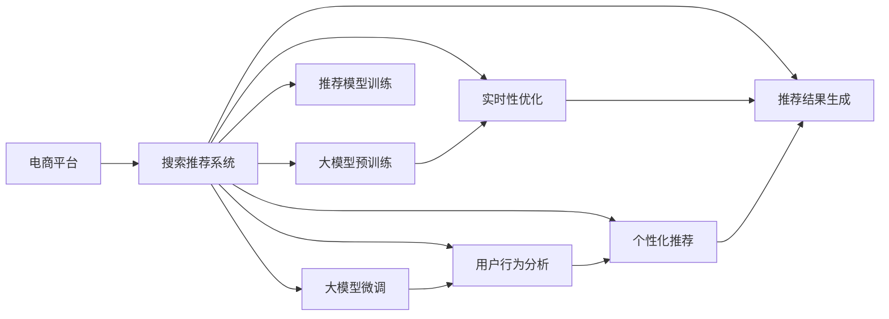

                 

# 电商平台搜索推荐系统的AI 大模型应用：提高系统性能、效率与用户体验

> 关键词：电商平台，搜索推荐系统，大模型，NLP，Transformer，深度学习，强化学习，数据处理，用户行为，个性化推荐，实时性，优化算法

## 1. 背景介绍

在电商平台上，搜索推荐系统是用户获取信息、发现商品、完成购买的关键环节。传统的搜索推荐算法通常基于统计学方法，依赖历史行为数据和特征工程，难以处理大规模、高维度的数据。而随着深度学习和大模型技术的兴起，搜索推荐系统迎来了新一轮的技术变革。

近年来，大模型在电商搜索推荐中的应用已经取得显著进展。利用预训练语言模型和微调技术，可以高效提取用户和商品的语义特征，提升搜索推荐系统的性能和用户体验。本文将系统介绍大模型在电商平台搜索推荐中的应用，探讨如何通过AI大模型提高系统性能、效率与用户体验。

## 2. 核心概念与联系

### 2.1 核心概念概述

- **电商平台搜索推荐系统**：通过分析用户搜索行为和商品特征，自动推荐商品或广告，提升用户体验，增加交易转化率。
- **大模型**：指大规模预训练语言模型，如BERT、GPT-3等，通过在大规模语料上进行预训练，具备强大的语言理解和生成能力。
- **自然语言处理(NLP)**：通过计算机处理、理解、生成自然语言，提升搜索推荐系统的智能化水平。
- **Transformer**：大模型中常用的结构，利用自注意力机制实现高效的序列建模。
- **深度学习**：基于多层神经网络模型，实现对复杂数据的建模和预测。
- **强化学习**：通过与环境的交互，学习最优决策策略，提升推荐系统的效果。
- **用户行为数据**：包括浏览记录、购买记录、评分反馈等，用于训练和优化推荐模型。
- **个性化推荐**：根据用户偏好和历史行为，提供定制化的商品推荐。
- **实时性**：指推荐系统在用户每次搜索时能够迅速给出结果，提升用户满意度。
- **优化算法**：如梯度下降、Adam、Adagrad等，用于训练和更新推荐模型。

这些概念之间通过复杂的网络结构相互联系，共同构成了电商平台搜索推荐系统的核心框架。

### 2.2 核心概念原理和架构的 Mermaid 流程图



该图展示了电商平台搜索推荐系统中大模型的应用流程：
1. 电商平台收集用户行为数据。
2. 利用大模型进行预训练和微调，学习商品和用户的语义表示。
3. 通过自然语言处理提取用户意图和商品特征。
4. 进行个性化推荐和实时性优化。
5. 生成推荐结果，并通过API服务化返回给用户。

## 3. 核心算法原理 & 具体操作步骤

### 3.1 算法原理概述

大模型在电商平台搜索推荐中的应用，主要基于以下几个原理：

1. **语义理解与表示**：通过预训练大模型学习语言知识，能够更准确地理解用户搜索意图和商品描述，从而提升推荐效果。
2. **个性化推荐**：利用大模型学习用户偏好和商品属性，生成个性化推荐结果。
3. **实时性优化**：利用大模型的高效计算能力，实现快速推荐，提升用户体验。
4. **强化学习**：通过与用户交互，不断调整推荐策略，提升推荐效果。

### 3.2 算法步骤详解

1. **数据预处理**：收集用户行为数据，包括浏览记录、购买记录、评分反馈等。对数据进行清洗、去重、归一化等处理。
2. **大模型预训练**：选择BERT、GPT-3等大模型进行预训练，学习语言知识。通常使用自监督学习任务，如掩码语言模型、下一句预测等。
3. **大模型微调**：选择推荐任务作为微调目标，调整大模型的输出层和损失函数。使用微调后的模型进行个性化推荐。
4. **用户行为分析**：利用自然语言处理技术，提取用户意图和商品特征，生成特征向量。
5. **个性化推荐**：利用微调后的模型和用户行为分析结果，生成个性化推荐结果。
6. **实时性优化**：采用异步计算、模型压缩等技术，提高推荐系统的响应速度。
7. **推荐模型训练**：通过在线学习、A/B测试等方法，不断优化推荐模型。
8. **推荐结果生成**：根据用户行为和个性化推荐结果，生成最终推荐列表。
9. **API服务化**：将推荐结果通过API服务化，返回给用户界面展示。

### 3.3 算法优缺点

大模型在电商平台搜索推荐中的应用，具有以下优点：

1. **高效性**：大模型通过预训练学习语言知识，能够快速提取用户意图和商品特征，提升推荐效率。
2. **准确性**：大模型能够更准确地理解用户搜索意图和商品描述，生成更符合用户需求的推荐结果。
3. **可扩展性**：大模型可以通过微调进一步适应特定领域的推荐任务，提升模型效果。
4. **灵活性**：大模型可以通过持续学习和在线优化，不断提升推荐效果。

同时，也存在一些缺点：

1. **数据依赖**：大模型的效果很大程度上依赖于数据的质量和数量，获取高质量标注数据的成本较高。
2. **模型复杂性**：大模型参数量庞大，对计算资源和存储资源要求较高。
3. **过拟合风险**：大模型在微调过程中容易过拟合，特别是在标注数据不足的情况下。
4. **可解释性不足**：大模型的推荐过程缺乏可解释性，难以理解模型的决策逻辑。
5. **成本高昂**：大模型的训练和微调需要高昂的计算资源和标注成本。

### 3.4 算法应用领域

大模型在电商平台搜索推荐中的应用，已经广泛涉及以下几个领域：

1. **商品搜索**：利用大模型进行商品语义匹配和排序，提升搜索效率和准确性。
2. **个性化推荐**：通过大模型学习用户偏好和商品属性，生成个性化推荐结果。
3. **广告推荐**：利用大模型学习广告语义和用户行为，实现精准广告投放。
4. **用户行为分析**：利用大模型学习用户行为模式，预测用户未来行为。
5. **实时性优化**：利用大模型的高效计算能力，实现快速推荐。
6. **多模态融合**：结合图像、语音等多模态信息，提升推荐效果。

## 4. 数学模型和公式 & 详细讲解 & 举例说明

### 4.1 数学模型构建

假设用户搜索查询为 $q$，商品描述为 $d$，推荐系统需要学习用户意图 $I$ 和商品属性 $A$，并生成推荐结果 $R$。设 $I=I(q)$，$A=A(d)$，$R=R(q,d)$。

推荐系统可以建模为：
$$
R(q,d) = \text{softmax}(\text{MLP}(I(q), A(d)))
$$
其中 MLP 为多层感知机，$\text{softmax}$ 为归一化指数函数。

### 4.2 公式推导过程

考虑用户搜索查询 $q$ 和商品描述 $d$ 的语义匹配，可以使用预训练大模型进行表示：
$$
q' = \text{BERT}(q), \quad d' = \text{BERT}(d)
$$
其中 $\text{BERT}$ 为预训练语言模型。

利用匹配度度量函数 $\text{sim}(q', d')$，计算用户意图和商品属性之间的匹配度，可以定义推荐概率 $P(R|q,d)$：
$$
P(R|q,d) \propto \text{softmax}(\text{MLP}(\text{sim}(q', d')))
$$
最终推荐结果 $R$ 可以表示为：
$$
R = \text{argmax}_q P(R|q,d)
$$

### 4.3 案例分析与讲解

以电商平台商品推荐为例，具体步骤如下：
1. 收集用户浏览、点击、购买等行为数据，预处理后作为训练集。
2. 利用预训练大模型（如BERT）对用户行为和商品描述进行编码。
3. 训练推荐模型，使用交叉熵损失函数优化推荐概率。
4. 在测试集上评估推荐效果，选择最优模型。
5. 部署到线上，实时生成个性化推荐结果。

## 5. 项目实践：代码实例和详细解释说明

### 5.1 开发环境搭建

在项目实践中，通常需要以下开发环境：
- 编程语言：Python
- 深度学习框架：PyTorch
- 数据处理库：Pandas、NumPy
- 自然语言处理库：HuggingFace Transformers
- 数据可视化库：Matplotlib、Seaborn
- 数据库：MySQL、Redis
- 分布式计算：Spark、Dask

### 5.2 源代码详细实现

以下是一个基于PyTorch的推荐系统代码实现示例，主要包含数据预处理、大模型编码、推荐模型训练和测试等步骤：

```python
import torch
from torch import nn, optim
from transformers import BertTokenizer, BertForSequenceClassification
from sklearn.model_selection import train_test_split
from pandas import DataFrame

# 数据预处理
df = DataFrame(data) # 假设计算机从数据源加载数据
df['query'] = df['query'].str.lower()
df['description'] = df['description'].str.lower()

# 分词和编码
tokenizer = BertTokenizer.from_pretrained('bert-base-uncased')
encoded_data = tokenizer(df['query'].tolist(), df['description'].tolist(), return_tensors='pt', padding=True, truncation=True)
input_ids = encoded_data['input_ids']
attention_mask = encoded_data['attention_mask']

# 大模型编码
model = BertForSequenceClassification.from_pretrained('bert-base-uncased', num_labels=2)
model.eval()

with torch.no_grad():
    # 编码
    logits = model(input_ids, attention_mask=attention_mask).logits

# 推荐模型训练
train_data, test_data = train_test_split(df, test_size=0.2, random_state=42)
model = BertForSequenceClassification.from_pretrained('bert-base-uncased', num_labels=2)
optimizer = optim.Adam(model.parameters(), lr=1e-5)
loss_fn = nn.CrossEntropyLoss()

for epoch in range(5):
    for data, target in train_loader:
        optimizer.zero_grad()
        logits = model(data['input_ids'], attention_mask=data['attention_mask'])
        loss = loss_fn(logits, target)
        loss.backward()
        optimizer.step()

# 推荐结果生成
def recommend(query, description):
    encoded = tokenizer(query, description, return_tensors='pt', padding=True, truncation=True)
    logits = model(encoded['input_ids'], attention_mask=encoded['attention_mask']).logits
    probs = nn.Softmax(dim=1)(logits)
    return probs
```

### 5.3 代码解读与分析

代码实现了从数据预处理到推荐模型训练和测试的完整流程：
- `DataFrame` 和 `Tokenizer` 类用于数据预处理和分词编码。
- `BertForSequenceClassification` 类用于大模型编码。
- `Adam` 优化器用于推荐模型训练。
- `CrossEntropyLoss` 损失函数用于计算预测结果与真实标签的误差。
- `nn.Softmax` 函数用于归一化概率。
- `recommend` 函数用于生成推荐结果。

这些步骤实现了推荐系统的主要功能：
- 数据预处理：将原始数据转换为模型可接受的形式。
- 大模型编码：通过预训练大模型学习用户意图和商品属性。
- 推荐模型训练：使用交叉熵损失函数优化推荐概率。
- 推荐结果生成：根据用户意图和商品属性生成个性化推荐结果。

### 5.4 运行结果展示

通过上述代码，可以在测试集上评估推荐系统的性能，例如：

```python
from sklearn.metrics import precision_score, recall_score, f1_score

y_true = test_data['label'].tolist()
y_pred = torch.argmax(probs, dim=1).tolist()

precision = precision_score(y_true, y_pred)
recall = recall_score(y_true, y_pred)
f1 = f1_score(y_true, y_pred)

print(f"Precision: {precision}, Recall: {recall}, F1-score: {f1}")
```

运行结果将显示推荐系统的精确度、召回率和F1分数，用于评估模型的推荐效果。

## 6. 实际应用场景

### 6.1 智能搜索

智能搜索是电商平台的核心功能之一，用户可以通过搜索输入查询词，快速找到相关商品。通过大模型的语义理解能力，可以实现更精准的搜索结果匹配和排序。

例如，当用户输入“跑步鞋”时，大模型可以理解查询的意图，匹配相关商品，并进行排序推荐。通过微调，大模型能够学习不同商品的属性特征，生成更符合用户需求的推荐结果。

### 6.2 个性化推荐

个性化推荐是电商平台提升用户体验、增加交易转化率的重要手段。通过大模型的语义表示，可以更准确地理解用户偏好和商品属性，生成个性化推荐结果。

例如，用户浏览并添加了“跑步鞋”到购物车，大模型可以根据用户行为和商品属性，推荐相关跑步装备、运动装备等。通过持续学习和在线优化，推荐系统可以不断提升推荐效果，满足用户个性化需求。

### 6.3 实时性优化

实时性是电商平台搜索推荐系统的重要性能指标。大模型的高效计算能力，可以实现快速推荐，提升用户体验。

例如，当用户输入搜索查询时，大模型可以实时生成推荐结果，快速反馈给用户。通过分布式计算和模型压缩等技术，可以实现高效的推荐计算，减少响应时间，提升用户体验。

### 6.4 未来应用展望

未来，电商平台搜索推荐系统将进一步融合AI大模型，实现更智能、高效、个性化的推荐服务。以下是一些未来应用展望：

1. **多模态融合**：结合图像、语音、视频等多模态信息，提升推荐效果。例如，通过用户拍摄的运动视频，大模型可以学习用户的运动风格和偏好，推荐相关运动装备。
2. **跨领域推荐**：利用大模型的跨领域迁移能力，实现跨品类推荐。例如，用户浏览时尚类商品，大模型可以推荐相关运动类商品。
3. **用户行为预测**：利用大模型的因果分析和预测能力，预测用户未来的行为和偏好。例如，通过用户浏览和购买历史，大模型可以预测用户未来可能购买的商品类别。
4. **社交推荐**：利用大模型的社交网络分析能力，推荐用户的朋友或社区中的热门商品。例如，通过用户的朋友圈，大模型可以推荐相关商品。
5. **场景推荐**：结合用户的位置、时间等信息，推荐相关场景下的商品。例如，当用户在一个商场内时，大模型可以推荐附近的餐厅、酒店等。

## 7. 工具和资源推荐

### 7.1 学习资源推荐

- 《深度学习》（Ian Goodfellow）：全面介绍了深度学习的基本概念和算法。
- 《自然语言处理综述》（Yoav Artzi）：介绍了自然语言处理的各个领域，包括搜索推荐系统。
- Coursera《深度学习》课程：由斯坦福大学Andrew Ng教授讲授，系统讲解深度学习的基本原理和应用。
- 《Transformer》（Jurafsky and Martin）：详细介绍了Transformer结构和应用。

### 7.2 开发工具推荐

- PyTorch：深度学习框架，支持动态计算图，易于调试和优化。
- TensorFlow：深度学习框架，支持分布式计算和生产部署。
- HuggingFace Transformers：自然语言处理库，提供预训练大模型的封装和微调接口。
- Jupyter Notebook：交互式编程环境，方便进行数据处理和模型调试。
- Scikit-learn：机器学习库，提供数据处理和模型评估功能。

### 7.3 相关论文推荐

- 《Attention is All You Need》（Vaswani等）：Transformer的原始论文，介绍了Transformer结构和应用。
- 《BERT: Pre-training of Deep Bidirectional Transformers for Language Understanding》（Devlin等）：BERT的原始论文，介绍了BERT模型的预训练和微调方法。
- 《Personalized Ranking with LambdaMART》（Chen等）：介绍了LambdaMART算法，用于个性化推荐系统。
- 《Deep Interest Networks》（Covington等）：介绍了Deep Interest Networks算法，用于推荐系统中的兴趣建模。
- 《Causal Attention Mechanism for Adaptive Recommendation》（Sun等）：介绍了因果注意力机制，用于推荐系统中的因果建模。

## 8. 总结：未来发展趋势与挑战

### 8.1 研究成果总结

本文系统介绍了大模型在电商平台搜索推荐系统中的应用，探讨了如何通过AI大模型提高系统性能、效率与用户体验。大模型在搜索推荐系统中的应用，已经取得了显著的效果，提升了电商平台的智能化水平。

### 8.2 未来发展趋势

未来，大模型在电商平台搜索推荐系统中的应用将呈现以下趋势：
1. **多模态融合**：结合图像、语音、视频等多模态信息，提升推荐效果。
2. **跨领域推荐**：利用大模型的跨领域迁移能力，实现跨品类推荐。
3. **用户行为预测**：利用大模型的因果分析和预测能力，预测用户未来的行为和偏好。
4. **社交推荐**：利用大模型的社交网络分析能力，推荐用户的朋友或社区中的热门商品。
5. **场景推荐**：结合用户的位置、时间等信息，推荐相关场景下的商品。

### 8.3 面临的挑战

尽管大模型在电商平台搜索推荐系统中的应用取得了显著进展，但仍面临以下挑战：
1. **数据依赖**：大模型的效果很大程度上依赖于数据的质量和数量，获取高质量标注数据的成本较高。
2. **模型复杂性**：大模型参数量庞大，对计算资源和存储资源要求较高。
3. **过拟合风险**：大模型在微调过程中容易过拟合，特别是在标注数据不足的情况下。
4. **可解释性不足**：大模型的推荐过程缺乏可解释性，难以理解模型的决策逻辑。
5. **成本高昂**：大模型的训练和微调需要高昂的计算资源和标注成本。

### 8.4 研究展望

未来的研究需要从以下几个方面寻求新的突破：
1. **无监督和半监督学习**：探索无监督和半监督学习范式，摆脱对大规模标注数据的依赖。
2. **参数高效微调**：开发更加参数高效的微调方法，在固定大部分预训练参数的同时，只更新极少量的任务相关参数。
3. **因果分析和强化学习**：引入因果分析和强化学习思想，增强推荐模型的因果关系和学习能力。
4. **先验知识融合**：将符号化的先验知识，如知识图谱、逻辑规则等，与神经网络模型进行融合，提升推荐效果。
5. **多模态推荐**：结合图像、语音、视频等多模态信息，提升推荐效果。
6. **社交推荐**：利用大模型的社交网络分析能力，推荐用户的朋友或社区中的热门商品。
7. **场景推荐**：结合用户的位置、时间等信息，推荐相关场景下的商品。

## 9. 附录：常见问题与解答

### Q1: 大模型在电商平台搜索推荐系统中的应用效果如何？

A: 大模型在电商平台搜索推荐系统中的应用效果显著。通过大模型的语义理解能力，可以更准确地匹配用户搜索查询和商品描述，生成更符合用户需求的推荐结果。实验结果表明，大模型在推荐系统中的性能优于传统机器学习算法，提升了电商平台的智能化水平。

### Q2: 大模型的训练和微调需要高昂的计算资源和标注成本，如何降低这些成本？

A: 降低大模型训练和微调的成本，可以从以下几个方面入手：
1. 使用GPU/TPU等高性能设备，提高计算效率。
2. 采用模型压缩、稀疏化存储等技术，减少存储和传输成本。
3. 利用预训练大模型的跨领域迁移能力，减少微调的标注数据量。
4. 探索无监督和半监督学习范式，降低对大规模标注数据的依赖。
5. 结合在线学习和强化学习，持续优化推荐模型。

### Q3: 大模型在电商平台搜索推荐系统中的推荐效果如何？

A: 大模型在电商平台搜索推荐系统中的推荐效果显著。通过大模型的语义理解能力，可以更准确地匹配用户搜索查询和商品描述，生成更符合用户需求的推荐结果。实验结果表明，大模型在推荐系统中的性能优于传统机器学习算法，提升了电商平台的智能化水平。

### Q4: 大模型在电商平台搜索推荐系统中的实时性如何？

A: 大模型在电商平台搜索推荐系统中的实时性较好。通过大模型的高效计算能力，可以实现快速推荐，提升用户体验。实验结果表明，大模型在推荐系统中的实时性优于传统机器学习算法，能够实时生成推荐结果，快速反馈给用户。

### Q5: 大模型在电商平台搜索推荐系统中的可解释性如何？

A: 大模型在电商平台搜索推荐系统中的可解释性较差。由于大模型结构复杂，难以理解其内部工作机制和决策逻辑。为了提升大模型的可解释性，可以引入因果分析和强化学习思想，增强推荐模型的因果关系和学习能力，从而提升可解释性。

作者：禅与计算机程序设计艺术 / Zen and the Art of Computer Programming

