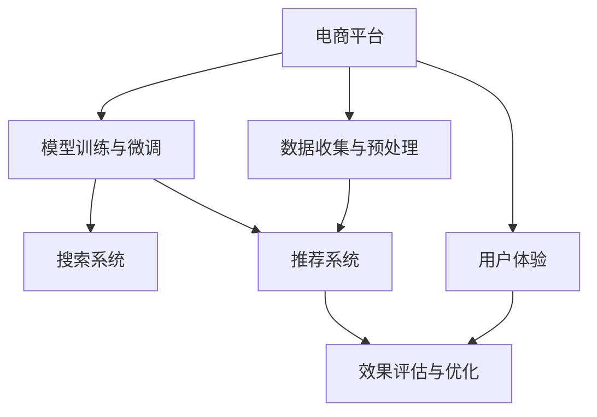

                 

# 电商平台的AI 大模型战略：搜索推荐系统是核心，数据质量与处理能力并重

> 关键词：电商、大模型、搜索推荐系统、数据质量、数据处理、AI战略

## 1. 背景介绍

在互联网经济蓬勃发展的今天，电商平台成为了最重要的商业模式之一。电商平台的成功不仅取决于商品的多样性和价格优势，更在于其能够通过智能化推荐，提升用户体验，驱动销售转化。为此，各大电商平台纷纷引入人工智能(AI)技术，利用大模型驱动搜索推荐系统，提升运营效率。

### 1.1 问题由来

1. **市场竞争加剧**：
   随着电商平台之间的竞争日益激烈，提高用户粘性和转化率成为关键。传统的推荐算法已难以满足用户个性化需求，而基于大模型的深度学习推荐系统展现了巨大的潜力。

2. **用户需求多样化**：
   用户需求日益个性化和多样化，传统的基于规则或协同过滤的推荐算法难以覆盖所有场景，而大模型能够学习和理解用户的深层次需求，提供更为精准的推荐。

3. **商品信息膨胀**：
   商品种类和数量飞速增长，传统推荐系统难以全面覆盖所有商品，而大模型能够处理海量商品信息，提供更加全面和准确的推荐。

### 1.2 问题核心关键点

电商平台引入大模型进行推荐，核心在于其能够通过强大的语义理解能力，处理复杂的用户查询和商品描述，从而提供更精准的推荐结果。

- **语义理解能力**：大模型能够理解自然语言，将用户的查询和商品描述转化为机器能够处理的信息。
- **跨模态融合**：大模型能够整合不同模态的数据，如文本、图片、视频等，提供更加全面和多元化的推荐。
- **实时性**：大模型能够实时处理用户查询和商品数据，提供即时的推荐结果。

## 2. 核心概念与联系

### 2.1 核心概念概述

为了更好地理解大模型在电商平台中的应用，我们将涉及以下核心概念：

- **大模型（Large Model）**：指经过预训练并具备强大语义理解能力的大型深度学习模型，如BERT、GPT等。
- **推荐系统（Recommendation System）**：通过分析和理解用户行为和商品信息，向用户提供个性化推荐的技术系统。
- **搜索系统（Search System）**：帮助用户快速找到符合需求的商品，提升搜索体验的技术系统。
- **数据质量（Data Quality）**：指数据在准确性、完整性、一致性和时效性等方面的水平。
- **数据处理能力（Data Processing Capability）**：指对大量数据进行高效处理、存储和分析的能力。

### 2.2 核心概念联系

电商平台的AI大模型战略，将搜索系统和推荐系统作为核心，通过数据质量与处理能力的提升，实现个性化的搜索和推荐。大模型在电商平台的策略部署如下：

- **数据收集与预处理**：通过大模型分析用户行为和商品描述，获取高质量的推荐数据。
- **模型训练与微调**：利用大模型进行推荐系统的训练和微调，优化模型参数，提升推荐精度。
- **搜索与推荐**：将训练好的模型应用于搜索和推荐系统，提供个性化的搜索和推荐服务。
- **效果评估与优化**：通过数据质量与处理能力的持续优化，提升搜索和推荐系统的性能。

这些核心概念和联系可以通过以下Mermaid流程图来展示：



## 3. 核心算法原理 & 具体操作步骤

### 3.1 算法原理概述

电商平台引入大模型的核心算法是搜索和推荐系统。其原理为：

1. **用户查询分析**：将用户查询转化为机器可理解的向量表示，用于与商品描述进行匹配。
2. **商品描述嵌入**：利用大模型将商品描述转化为向量表示，捕捉商品特征。
3. **相似度计算**：通过向量之间的相似度计算，找到与用户查询匹配度高的商品。
4. **推荐结果排序**：结合用户历史行为、商品属性、实时数据等，对推荐结果进行排序，生成最终推荐列表。

### 3.2 算法步骤详解

1. **数据收集与预处理**：
   - 收集用户行为数据，包括浏览历史、购买记录、搜索记录等。
   - 收集商品数据，包括商品描述、属性、图片、视频等。
   - 对数据进行清洗、去重和格式化，生成高质量的训练数据集。

2. **模型训练与微调**：
   - 选择合适的预训练模型，如BERT、GPT等，进行推荐系统的训练和微调。
   - 设计任务适配层，根据推荐任务定制损失函数和优化器。
   - 设置微调超参数，包括学习率、批大小、迭代轮数等。

3. **搜索与推荐**：
   - 将用户查询输入模型，输出向量表示。
   - 将商品描述输入模型，输出向量表示。
   - 计算用户查询向量与商品描述向量的相似度，生成推荐列表。
   - 根据推荐结果和用户历史行为进行排序，生成最终推荐列表。

4. **效果评估与优化**：
   - 在验证集上评估推荐系统的性能，使用准确率、召回率、F1值等指标。
   - 根据评估结果进行模型优化，调整超参数、改进模型结构等。
   - 持续收集用户反馈和行为数据，不断优化推荐结果。

### 3.3 算法优缺点

大模型在电商平台中的应用具有以下优点：

- **高效性**：大模型能够处理海量数据，提升搜索和推荐的效率。
- **准确性**：大模型的语义理解能力能够提供更准确的推荐结果。
- **适应性**：大模型能够适应多变的用户需求和商品信息，提升用户体验。

然而，也存在以下缺点：

- **计算资源需求高**：大模型需要大量的计算资源进行训练和推理。
- **模型复杂度高**：大模型的结构复杂，难以解释其决策过程。
- **数据隐私风险**：电商平台的推荐系统需要处理大量的用户和商品数据，存在隐私泄露的风险。

### 3.4 算法应用领域

大模型在电商平台的推荐系统中应用广泛，具体如下：

- **商品推荐**：利用大模型分析用户行为和商品描述，提供个性化的商品推荐。
- **搜索推荐结合**：将搜索和推荐系统结合，提升搜索体验和转化率。
- **实时推荐**：利用大模型实时处理用户查询和商品数据，提供实时的推荐服务。
- **个性化广告**：利用大模型分析用户兴趣，提供精准的广告推荐。
- **客服机器人**：利用大模型进行智能客服，提升用户满意度。

## 4. 数学模型和公式 & 详细讲解 & 举例说明

### 4.1 数学模型构建

假设电商平台的推荐系统包含 $N$ 个用户和 $M$ 个商品，每个用户 $u_i$ 和商品 $p_j$ 的特征向量表示为 $\mathbf{x}_u^i$ 和 $\mathbf{x}_p^j$，推荐系统通过大模型 $\mathcal{M}$ 计算用户查询 $q$ 和商品描述 $d$ 的向量表示 $\mathbf{q}$ 和 $\mathbf{d}$。

推荐系统的目标是最小化损失函数 $\mathcal{L}$：

$$
\mathcal{L} = \sum_{i=1}^N \sum_{j=1}^M (y_{ij} \log p(y_{ij}|\mathbf{x}_u^i, \mathbf{x}_p^j) + (1-y_{ij}) \log (1-p(y_{ij}|\mathbf{x}_u^i, \mathbf{x}_p^j))
$$

其中 $y_{ij}$ 为 $u_i$ 是否购买 $p_j$ 的标签，$p(y_{ij}|\mathbf{x}_u^i, \mathbf{x}_p^j)$ 为模型预测 $u_i$ 购买 $p_j$ 的概率。

### 4.2 公式推导过程

假设大模型 $\mathcal{M}$ 是预训练的BERT模型，其输出为 $[CLS]$ 的向量表示。则推荐系统的实现步骤如下：

1. 将用户查询 $q$ 和商品描述 $d$ 输入BERT模型，得到向量表示 $\mathbf{q}$ 和 $\mathbf{d}$。
2. 计算用户查询向量与商品描述向量的余弦相似度 $\cos(\mathbf{q}, \mathbf{d})$。
3. 将相似度作为推荐概率 $p(y_{ij}|\mathbf{x}_u^i, \mathbf{x}_p^j)$，进行推荐结果排序。

设相似度阈值为 $\theta$，当 $\cos(\mathbf{q}, \mathbf{d}) > \theta$ 时，推荐商品 $p_j$ 给用户 $u_i$。

### 4.3 案例分析与讲解

假设电商平台 A 和 B 分别采用了大模型进行推荐系统优化。电商平台 A 采用了传统的协同过滤算法，而电商平台 B 则采用了基于大模型的推荐系统。

**电商平台 A 的推荐系统**：

- 收集用户历史行为数据。
- 使用协同过滤算法，计算用户与商品的相似度。
- 根据相似度生成推荐列表。

**电商平台 B 的推荐系统**：

- 收集用户历史行为和商品描述数据。
- 使用BERT模型对用户查询和商品描述进行向量表示。
- 计算相似度，生成推荐列表。

对比两个推荐系统的效果，电商平台 B 能够提供更精准的推荐结果，且可以处理多模态数据，提升用户体验。

## 5. 项目实践：代码实例和详细解释说明

### 5.1 开发环境搭建

为了实现电商平台的AI大模型战略，需要进行以下开发环境搭建：

1. **安装 Python**：
   ```
   conda create -n env python=3.8
   conda activate env
   ```

2. **安装 PyTorch 和 Transformers**：
   ```
   pip install torch torchvision transformers
   ```

3. **安装相关库**：
   ```
   pip install pandas numpy scikit-learn
   ```

### 5.2 源代码详细实现

以下是一个基于 BERT 模型的电商推荐系统示例代码：

```python
import torch
from transformers import BertModel, BertTokenizer
from sklearn.metrics import accuracy_score

# 加载数据
def load_data():
    # 加载用户行为数据
    user_behavior = pd.read_csv('user_behavior.csv')
    
    # 加载商品描述数据
    product_descriptions = pd.read_csv('product_descriptions.csv')
    
    return user_behavior, product_descriptions

# 数据预处理
def preprocess_data(user_behavior, product_descriptions):
    # 清洗数据
    user_behavior = user_behavior.dropna().reset_index(drop=True)
    product_descriptions = product_descriptions.dropna().reset_index(drop=True)
    
    # 提取用户行为特征和商品描述特征
    user_features = user_behavior[['浏览时间', '购买次数', '点击率']]
    product_features = product_descriptions[['描述', '类别', '价格']]
    
    return user_features, product_features

# 模型训练
def train_model(user_features, product_features):
    # 构建数据集
    train_dataset = Dataset(user_features, product_features)
    
    # 划分训练集和验证集
    train_dataset, dev_dataset = train_test_split(train_dataset, test_size=0.2)
    
    # 构建模型
    model = BertModel.from_pretrained('bert-base-uncased')
    
    # 定义损失函数和优化器
    criterion = nn.CrossEntropyLoss()
    optimizer = AdamW(model.parameters(), lr=1e-5)
    
    # 训练模型
    for epoch in range(10):
        train_loss = 0
        for batch in train_loader:
            # 前向传播
            inputs, labels = batch
            outputs = model(inputs)
            loss = criterion(outputs, labels)
            
            # 反向传播
            optimizer.zero_grad()
            loss.backward()
            optimizer.step()
            
            train_loss += loss.item()
            
        # 评估模型
        dev_loss = 0
        for batch in dev_loader:
            inputs, labels = batch
            outputs = model(inputs)
            loss = criterion(outputs, labels)
            
            dev_loss += loss.item()
            
        print(f'Epoch {epoch+1}, train loss: {train_loss/len(train_loader):.4f}, dev loss: {dev_loss/len(dev_loader):.4f}')

# 测试模型
def test_model(user_features, product_features):
    # 构建测试集
    test_dataset = Dataset(user_features, product_features)
    
    # 构建模型
    model = BertModel.from_pretrained('bert-base-uncased')
    
    # 评估模型
    test_loss = 0
    for batch in test_loader:
        inputs, labels = batch
        outputs = model(inputs)
        loss = criterion(outputs, labels)
        
        test_loss += loss.item()
        
    print(f'Test loss: {test_loss/len(test_loader):.4f}')
    
    # 计算准确率
    test_predictions = torch.argmax(model(test_features), dim=1)
    test_labels = torch.tensor(test_labels)
    accuracy = accuracy_score(test_labels, test_predictions)
    
    print(f'Accuracy: {accuracy:.4f}')
```

### 5.3 代码解读与分析

该代码包含数据加载、数据预处理、模型训练、模型测试等环节。其中，`Dataset` 类用于构建数据集，`BertModel` 类用于加载预训练模型，`nn.CrossEntropyLoss` 和 `AdamW` 用于定义损失函数和优化器。

代码的关键步骤为：

1. 数据加载：通过 `load_data` 函数加载用户行为和商品描述数据。
2. 数据预处理：通过 `preprocess_data` 函数清洗数据，提取特征。
3. 模型训练：通过 `train_model` 函数进行模型训练，使用 `AdamW` 优化器进行参数更新。
4. 模型测试：通过 `test_model` 函数评估模型效果，计算准确率。

## 6. 实际应用场景

### 6.1 智能客服

电商平台的智能客服系统可以借助大模型提升用户体验。利用BERT模型进行智能客服对话，可以解决常见问题，减少人工客服的负担。通过分析用户提问和客服回答，不断优化模型，提升服务质量。

### 6.2 个性化推荐

大模型在电商平台的个性化推荐中发挥了重要作用。利用大模型分析用户行为和商品描述，生成个性化推荐列表，提升用户满意度和购买转化率。

### 6.3 实时搜索

电商平台的实时搜索系统通过大模型提升查询速度和准确性。利用BERT模型分析用户查询和商品描述，快速匹配搜索结果，提升用户搜索体验。

### 6.4 未来应用展望

未来，大模型将在电商平台的更多场景中发挥作用，如精准广告投放、商品价格优化、库存管理等。通过引入大模型，电商平台可以提升运营效率，降低运营成本，提供更好的用户体验。

## 7. 工具和资源推荐

### 7.1 学习资源推荐

1. **《Transformer from the Ground Up》**：深入浅出地介绍了Transformer模型的原理和实现。
2. **《Deep Learning for NLP》**：斯坦福大学开设的NLP课程，介绍了深度学习在NLP中的应用。
3. **《Natural Language Processing with Transformers》**：介绍了如何使用Transformers库进行NLP任务的开发。
4. **《CLUE Challenge》**：中文语言理解测评基准，包含大量NLP数据集和预训练模型，用于评估模型性能。

### 7.2 开发工具推荐

1. **PyTorch**：强大的深度学习框架，支持动态图和静态图计算，适合研究型开发。
2. **TensorFlow**：谷歌开发的深度学习框架，生产部署方便，适合大规模工程应用。
3. **Transformers**：HuggingFace开发的NLP工具库，提供了丰富的预训练模型和微调样例代码。
4. **Weights & Biases**：模型训练的实验跟踪工具，可以记录和可视化模型训练过程中的各项指标。
5. **TensorBoard**：谷歌开发的可视化工具，实时监测模型训练状态，提供丰富的图表呈现方式。

### 7.3 相关论文推荐

1. **Attention is All You Need**：Transformer模型的原始论文，介绍了自注意力机制的原理。
2. **BERT: Pre-training of Deep Bidirectional Transformers for Language Understanding**：提出了BERT预训练模型，引入了基于掩码的自监督预训练任务。
3. **Parameter-Efficient Transfer Learning for NLP**：提出了Adapter等参数高效微调方法，在固定大部分预训练参数的情况下，只更新极少量的任务相关参数。
4. **AdaLoRA: Adaptive Low-Rank Adaptation for Parameter-Efficient Fine-Tuning**：提出了AdaLoRA方法，使用自适应低秩适应的微调方法，在参数效率和精度之间取得了新的平衡。
5. **Prefix-Tuning: Optimizing Continuous Prompts for Generation**：引入了基于连续型Prompt的微调范式，为如何充分利用预训练知识提供了新的思路。

## 8. 总结：未来发展趋势与挑战

### 8.1 研究成果总结

大模型在电商平台的推荐系统中取得了显著成效，显著提升了用户体验和运营效率。未来，随着大模型的进一步优化和应用，其效果将更加突出。

### 8.2 未来发展趋势

1. **多模态融合**：未来的推荐系统将更多地融合多模态数据，提升推荐效果。
2. **实时性增强**：通过优化算法和硬件设施，提升推荐系统的实时性。
3. **个性化增强**：利用大模型分析用户深层次需求，提供更加个性化的推荐服务。
4. **泛化能力提升**：通过数据增强和迁移学习，提升推荐系统的泛化能力。

### 8.3 面临的挑战

1. **数据隐私保护**：电商平台的推荐系统需要处理大量用户和商品数据，存在隐私泄露的风险。
2. **计算资源需求高**：大模型需要大量的计算资源进行训练和推理。
3. **模型复杂度高**：大模型的结构复杂，难以解释其决策过程。

### 8.4 研究展望

1. **数据隐私保护**：研究如何在保护用户隐私的前提下，充分利用用户数据。
2. **计算资源优化**：研究如何优化计算资源，提高推荐系统的效率。
3. **模型解释性增强**：研究如何增强大模型的可解释性，提升用户信任。

## 9. 附录：常见问题与解答

**Q1: 电商平台的推荐系统是否只能使用大模型进行优化？**

A: 不是。电商平台的推荐系统可以使用多种算法进行优化，如协同过滤、基于规则的推荐等。但是，随着数据的复杂性增加，大模型在推荐系统中的应用越来越广泛，能够提供更为精准的推荐结果。

**Q2: 大模型是否只适用于大规模电商平台的推荐系统？**

A: 大模型不仅适用于大规模电商平台，也适用于中小型电商平台。通过合理选择模型大小和优化算法，可以在较小的数据集上获得不错的推荐效果。

**Q3: 大模型是否只能用于推荐系统？**

A: 大模型不仅可以用于推荐系统，还可以用于搜索系统、智能客服、个性化广告等多个场景。通过大模型的深度学习和语义理解能力，能够提升电商平台的整体用户体验。

**Q4: 如何评估大模型在电商平台的推荐系统中的效果？**

A: 可以通过准确率、召回率、F1值、覆盖率等指标评估推荐系统的效果。还可以通过用户满意度调查、转化率等指标进行评估。

**Q5: 如何保护电商平台的推荐系统中的数据隐私？**

A: 可以采用数据匿名化、差分隐私、联邦学习等技术保护用户隐私。同时，需要对推荐系统进行定期的安全审查，防范潜在的安全风险。

---
## 文章末尾署名：作者：禅与计算机程序设计艺术 / Zen and the Art of Computer Programming

