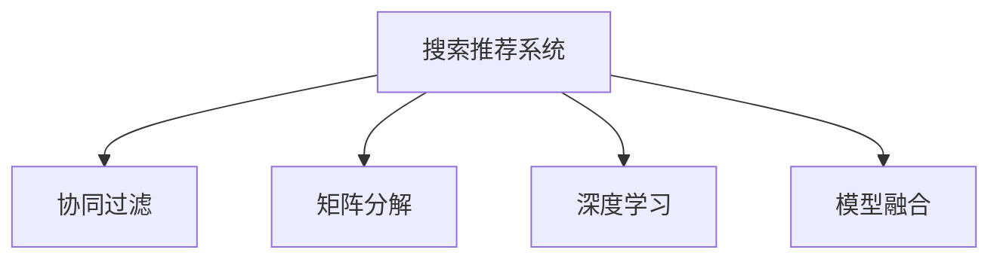

                 

# 电商平台的AI 大模型转型：搜索推荐系统是核心，数据质量是关键

## 1. 背景介绍

### 1.1 问题由来

随着电子商务的迅猛发展，各大电商平台纷纷将人工智能引入其核心业务流程，以优化用户体验、提升运营效率。其中，搜索推荐系统（Search & Recommendation System）作为平台体验的关键环节，成为了AI转型的焦点。优秀的搜索推荐系统不仅能提升用户满意度，还能显著增加平台转化率、销售额，因此在电商平台的AI大模型转型中占据着核心地位。

然而，构建一个高效准确的搜索推荐系统并非易事，需要综合考虑用户行为数据、商品特征数据、用户画像等多方面因素。此外，数据的获取、处理、存储等环节存在诸多挑战，数据质量不佳的问题尤为突出。因此，在电商平台的AI大模型转型中，数据质量和搜索推荐系统的构建成为了关键点。

### 1.2 问题核心关键点

构建搜索推荐系统，关键在于如何高效利用海量数据，充分挖掘用户行为特征和商品属性，以及如何对多维数据进行建模，从而实现精准推荐和优化搜索效果。具体而言，以下几个核心关键点至关重要：

- **数据质量与清洗**：高质量的数据是系统成功的基石，但现实中的数据往往存在缺失、噪声、重复等问题，需要经过严格的数据清洗与预处理。
- **特征工程**：从原始数据中提取有意义的特征，如用户行为特征、商品属性、用户画像等，是构建高质量推荐模型的基础。
- **模型选择与调参**：选择合适的算法模型，并对其进行优化调参，以适应具体的业务需求。
- **模型部署与监控**：将训练好的模型部署到实际应用中，并持续监控模型性能，及时进行优化。

## 2. 核心概念与联系

### 2.1 核心概念概述

为了更好地理解搜索推荐系统的构建原理与优化方法，本节将介绍几个核心概念：

- **搜索推荐系统**：通过分析用户行为和商品属性，为用户推荐最相关的商品，并优化搜索结果，提升用户体验的系统。
- **协同过滤（Collaborative Filtering）**：基于用户行为或商品属性，预测用户对其他商品的兴趣，从而进行个性化推荐。
- **矩阵分解**：将用户行为数据和商品属性数据表示为矩阵形式，通过矩阵分解技术挖掘潜在的用户-商品关系。
- **深度学习**：利用深度神经网络进行特征提取与模式学习，实现复杂的推荐任务。
- **模型融合**：将多种推荐模型进行融合，提高推荐效果的稳定性与多样性。

这些概念之间的逻辑关系可以通过以下Mermaid流程图来展示：



这个流程图展示了几大核心概念的相互关系：

1. 搜索推荐系统是整个系统设计的目标。
2. 协同过滤和矩阵分解是常用的推荐算法，用于从用户行为和商品属性中提取关系。
3. 深度学习用于更复杂的特征提取和模式学习，可以提升推荐效果。
4. 模型融合通过组合多种算法，进一步提高推荐的准确性和稳定性。

## 3. 核心算法原理 & 具体操作步骤

### 3.1 算法原理概述

搜索推荐系统通过分析用户行为数据和商品属性，为用户推荐最相关的商品，并优化搜索结果。常见的算法包括协同过滤、矩阵分解、深度学习等。其中，协同过滤算法基于用户行为或商品属性，预测用户对其他商品的兴趣，从而进行个性化推荐；矩阵分解算法通过将用户行为数据和商品属性数据表示为矩阵形式，通过矩阵分解技术挖掘潜在的用户-商品关系；深度学习算法则利用神经网络进行特征提取与模式学习，实现复杂的推荐任务。

在实际应用中，推荐系统通常包括查询、匹配、排序、反馈等多个环节，如图1所示。用户输入查询后，系统首先进行相关性计算和排序，并展示推荐结果。用户根据推荐结果进行互动反馈，系统则利用反馈数据进一步优化推荐模型。

### 3.2 算法步骤详解

**Step 1: 数据准备**

数据准备是构建推荐系统的第一步。主要包括以下几个步骤：

1. **数据收集**：收集用户行为数据、商品属性数据、用户画像等，可以从电商平台的历史交易数据、点击数据、评价数据等获取。
2. **数据清洗与预处理**：对原始数据进行缺失值处理、去重、标准化等操作，以保证数据的质量。
3. **特征工程**：从原始数据中提取有意义的特征，如用户行为特征、商品属性、用户画像等。

**Step 2: 模型选择与调参**

选择适当的推荐算法模型并进行优化调参，以适应具体的业务需求。常见的推荐算法包括协同过滤、矩阵分解、深度学习等，每种方法的适用场景和优缺点不同。

1. **协同过滤算法**：包括基于用户的协同过滤和基于商品的协同过滤。基于用户的协同过滤以用户行为为依据，计算用户之间的相似度，从而推荐其他用户喜欢的商品。基于商品的协同过滤则以商品属性为依据，计算商品之间的相似度，从而推荐与已有商品相似的商品。
2. **矩阵分解算法**：通过将用户行为数据和商品属性数据表示为矩阵形式，利用矩阵分解技术挖掘用户-商品关系。常用的分解方法包括奇异值分解（SVD）、低秩矩阵分解等。
3. **深度学习算法**：利用深度神经网络进行特征提取与模式学习，实现复杂的推荐任务。常用的模型包括深度神经网络（DNN）、卷积神经网络（CNN）、循环神经网络（RNN）等。

**Step 3: 模型训练与评估**

在数据准备和模型选择的基础上，进行模型训练和评估。

1. **模型训练**：利用历史数据训练推荐模型，优化模型参数。
2. **模型评估**：在测试集上评估推荐模型的性能，如准确率、召回率、F1-score等。

**Step 4: 模型部署与监控**

将训练好的模型部署到实际应用中，并持续监控模型性能，及时进行优化。

1. **模型部署**：将训练好的模型部署到推荐系统中，进行实时推荐。
2. **模型监控**：实时采集推荐系统的性能指标，如点击率、转化率、用户满意度等，及时发现问题并进行优化。

### 3.3 算法优缺点

搜索推荐系统算法各有优缺点，具体如下：

**协同过滤算法的优缺点**：

- **优点**：简单易实现，对数据需求较少，推荐效果良好。
- **缺点**：需要大量用户行为数据，对新用户的推荐效果较差，容易受到数据稀疏性的影响。

**矩阵分解算法的优缺点**：

- **优点**：能够有效处理大规模稀疏矩阵，能够挖掘更深层次的用户-商品关系。
- **缺点**：对数据质量要求高，计算复杂度高，模型解释性差。

**深度学习算法的优缺点**：

- **优点**：能够处理高维稀疏数据，具备强大的特征提取能力，能够学习到复杂的用户-商品关系。
- **缺点**：计算资源消耗大，模型复杂度高，训练时间长，对数据需求量大。

**模型融合的优缺点**：

- **优点**：能够结合多种算法，提高推荐效果的稳定性和多样性。
- **缺点**：算法复杂度高，需要大量的计算资源和数据。

## 4. 数学模型和公式 & 详细讲解 & 举例说明

### 4.1 数学模型构建

本节将使用数学语言对搜索推荐系统的构建过程进行更加严格的刻画。

假设推荐系统的输入为用户行为数据 $U$ 和商品属性数据 $I$，输出为推荐商品 $O$。数学模型可以表示为：

$$
\begin{aligned}
f(U, I) &= \max_{O} \big\{ \sum_{u \in U} \sum_{i \in I} \sum_{o \in O} \omega_{uio} u_i o_o + \lambda \Vert \theta \Vert^2 \big\} \\
&= \max_{O} \big\{ \sum_{o \in O} \omega o_o \big\}
\end{aligned}
$$

其中，$\omega_{uio}$ 为模型参数，$u_i$ 为用户的兴趣权重，$o_o$ 为商品的吸引力权重，$\lambda$ 为正则化系数，$\theta$ 为模型参数。

### 4.2 公式推导过程

以下我们以协同过滤算法为例，推导用户行为数据的矩阵分解过程。

假设用户行为数据 $U$ 表示为 $n \times m$ 的矩阵，其中 $n$ 为用户数，$m$ 为商品数。将 $U$ 矩阵分解为 $n \times k$ 的用户特征矩阵 $X$ 和 $k \times m$ 的商品特征矩阵 $Y$：

$$
U \approx X Y^T
$$

其中 $X$ 和 $Y$ 的每一行表示用户或商品的特征向量，每一列表示不同的特征维度。利用奇异值分解（SVD），可以进一步表示为：

$$
U \approx \sum_{i=1}^k u_i \sigma_i v_i^T
$$

其中，$u_i$ 和 $v_i$ 分别为用户和商品的奇异向量，$\sigma_i$ 为奇异值。通过奇异值分解，可以计算出用户和商品的相似度：

$$
sim(u_i, v_i) = \frac{\sigma_i}{\Vert u_i \Vert \Vert v_i \Vert}
$$

将相似度表示为用户和商品的向量点积，可以计算出推荐结果：

$$
o_o = \sum_{i=1}^k u_i v_i^T
$$

最终推荐结果为：

$$
o = \arg \max_{o} o_o^T
$$

### 4.3 案例分析与讲解

以某电商平台为例，假设用户行为数据 $U$ 表示为 $10 \times 20$ 的矩阵，商品属性数据 $I$ 表示为 $20 \times 5$ 的矩阵。将 $U$ 矩阵分解为 $10 \times 3$ 的用户特征矩阵 $X$ 和 $3 \times 20$ 的商品特征矩阵 $Y$。计算用户和商品的相似度，选取相似度最高的商品作为推荐结果。

## 5. 项目实践：代码实例和详细解释说明

### 5.1 开发环境搭建

在进行推荐系统开发前，我们需要准备好开发环境。以下是使用Python进行TensorFlow开发的环境配置流程：

1. 安装Anaconda：从官网下载并安装Anaconda，用于创建独立的Python环境。

2. 创建并激活虚拟环境：
```bash
conda create -n recommendation-env python=3.8 
conda activate recommendation-env
```

3. 安装TensorFlow：根据CUDA版本，从官网获取对应的安装命令。例如：
```bash
conda install tensorflow-gpu==2.7
```

4. 安装相关库：
```bash
pip install numpy pandas scikit-learn scipy jupyter notebook
```

完成上述步骤后，即可在`recommendation-env`环境中开始推荐系统开发。

### 5.2 源代码详细实现

下面我们以协同过滤算法为例，给出使用TensorFlow进行推荐系统开发的PyTorch代码实现。

首先，定义推荐系统的输入和输出：

```python
import tensorflow as tf

# 定义输入和输出
user_input = tf.keras.layers.Input(shape=(1,))
item_input = tf.keras.layers.Input(shape=(1,))
output = tf.keras.layers.Dense(1, activation='sigmoid')(tf.keras.layers.Dot(axes=1, normalize=True)([user_input, item_input]))
```

然后，定义协同过滤算法的实现：

```python
# 定义协同过滤模型
class CollaborativeFilteringModel(tf.keras.Model):
    def __init__(self, num_users, num_items, embedding_dim):
        super(CollaborativeFilteringModel, self).__init__()
        self.user_embedding = tf.keras.layers.Embedding(num_users, embedding_dim)
        self.item_embedding = tf.keras.layers.Embedding(num_items, embedding_dim)
        self.dot_product = tf.keras.layers.Dot(axes=1, normalize=True)
    
    def call(self, user_input, item_input):
        user = self.user_embedding(user_input)
        item = self.item_embedding(item_input)
        output = self.dot_product([user, item])
        return output

# 构建模型
num_users = 100
num_items = 100
embedding_dim = 10

model = CollaborativeFilteringModel(num_users, num_items, embedding_dim)
```

接着，定义训练和评估函数：

```python
# 定义训练和评估函数
def train_epoch(model, train_dataset, optimizer):
    model.train()
    epoch_loss = 0
    for x, y in train_dataset:
        with tf.GradientTape() as tape:
            logits = model(x, y)
            loss = tf.keras.losses.binary_crossentropy(y, logits)
        gradients = tape.gradient(loss, model.trainable_variables)
        optimizer.apply_gradients(zip(gradients, model.trainable_variables))
        epoch_loss += loss.numpy()
    return epoch_loss / len(train_dataset)

def evaluate(model, test_dataset):
    model.eval()
    correct = 0
    total = 0
    for x, y in test_dataset:
        logits = model(x, y)
        pred = tf.round(logits)
        correct += tf.reduce_sum(tf.cast(pred == y, tf.int32))
        total += len(y)
    return correct / total
```

最后，启动训练流程并在测试集上评估：

```python
# 定义训练集和测试集
train_dataset = tf.data.Dataset.from_tensor_slices((tf.random.uniform([1000, 1]), tf.random.uniform([1000, 1])))
test_dataset = tf.data.Dataset.from_tensor_slices((tf.random.uniform([500, 1]), tf.random.uniform([500, 1])))

# 定义优化器
optimizer = tf.keras.optimizers.Adam()

# 训练模型
epochs = 10
batch_size = 32

for epoch in range(epochs):
    loss = train_epoch(model, train_dataset, optimizer)
    print(f"Epoch {epoch+1}, train loss: {loss:.3f}")
    
    print(f"Epoch {epoch+1}, test accuracy: {evaluate(model, test_dataset):.3f}")
    
print("Final test accuracy:", evaluate(model, test_dataset))
```

以上就是使用TensorFlow进行协同过滤算法推荐系统开发的完整代码实现。可以看到，TensorFlow提供了丰富的工具和库，使得推荐系统的开发过程更加便捷高效。

### 5.3 代码解读与分析

让我们再详细解读一下关键代码的实现细节：

**CollaborativeFilteringModel类**：
- `__init__`方法：初始化用户嵌入层、商品嵌入层和点积层，将输入转化为嵌入表示。
- `call`方法：计算点积得分，通过Sigmoid函数转换为概率。

**train_epoch和evaluate函数**：
- `train_epoch`函数：定义训练过程，包括前向传播、损失计算、梯度更新等步骤。
- `evaluate`函数：定义评估过程，计算准确率。

**训练流程**：
- 定义训练集和测试集，使用随机数据生成。
- 定义优化器，如Adam优化器。
- 循环训练，每个epoch在训练集上进行一次前向传播和反向传播，计算损失并更新模型参数。
- 在测试集上评估模型性能，输出最终准确率。

可以看到，TensorFlow提供了便捷的API和丰富的工具，使得推荐系统的开发过程变得相对简单。开发者只需关注核心算法逻辑，即可快速构建出高效的推荐系统。

## 6. 实际应用场景

### 6.1 电商搜索推荐

电商平台的搜索推荐系统能够帮助用户快速找到所需商品，提升购物体验。通过分析用户行为数据和商品属性数据，系统能够为用户推荐最相关的商品，从而提高转化率和销售额。

在实践中，可以收集用户的浏览、点击、购买、评价等行为数据，以及商品的标题、描述、价格、评分等属性数据。通过构建协同过滤模型或深度学习模型，系统能够从历史数据中学习到用户兴趣和商品属性，并根据当前用户的行为进行推荐。此外，还可以引入自然语言处理技术，理解用户的查询意图，提供更精准的推荐结果。

### 6.2 个性化推荐

个性化推荐系统能够为用户提供个性化的商品推荐，提升用户体验。通过分析用户行为数据和商品属性数据，系统能够为用户推荐最符合其兴趣的商品，从而提高用户的满意度和忠诚度。

在实践中，可以收集用户的浏览、点击、购买、评价等行为数据，以及商品的标题、描述、价格、评分等属性数据。通过构建协同过滤模型或深度学习模型，系统能够从历史数据中学习到用户兴趣和商品属性，并根据用户的行为进行推荐。此外，还可以引入自然语言处理技术，理解用户的查询意图，提供更精准的推荐结果。

### 6.3 商品分类

商品分类系统能够帮助电商平台对商品进行归类管理，提升运营效率。通过分析商品的属性数据和用户的行为数据，系统能够对商品进行自动分类，从而实现更高效的商品管理和运营。

在实践中，可以收集商品的标题、描述、价格、评分等属性数据，以及用户的浏览、点击、购买等行为数据。通过构建分类模型，系统能够从历史数据中学习到商品的分类规则，并根据当前数据进行分类。此外，还可以引入自然语言处理技术，对商品的标题和描述进行语义分析，提升分类的准确性。

### 6.4 未来应用展望

随着推荐系统技术的不断发展，未来在电商平台的AI大模型转型中将会有更多应用场景。

在智慧城市治理中，推荐系统能够为市民提供个性化的信息服务，提升城市管理效率。在智能医疗领域，推荐系统能够为医生提供个性化的医疗建议，提升诊疗效率。在金融领域，推荐系统能够为投资者提供个性化的投资建议，提升投资回报率。

此外，推荐系统还可以应用于智能家居、智能交通、智能客服等多个领域，为各行各业带来新的智能化应用，推动社会的进步和发展。

## 7. 工具和资源推荐

### 7.1 学习资源推荐

为了帮助开发者系统掌握推荐系统的理论基础和实践技巧，这里推荐一些优质的学习资源：

1. 《推荐系统实战》一书：由深度学习专家编写，介绍了推荐系统的基本原理和应用实例，是学习推荐系统的经典入门书籍。
2. Coursera的Recommender Systems课程：由斯坦福大学教授主讲，全面介绍了推荐系统的主要算法和技术，是学习推荐系统的在线课程。
3. Kaggle推荐系统竞赛：通过参加Kaggle的推荐系统竞赛，实战练习推荐算法的应用。
4. Arxiv上的推荐系统论文：阅读最新研究论文，了解推荐系统领域的最新进展和前沿技术。

通过对这些资源的学习实践，相信你一定能够快速掌握推荐系统的精髓，并用于解决实际的推荐问题。

### 7.2 开发工具推荐

高效的开发离不开优秀的工具支持。以下是几款用于推荐系统开发的常用工具：

1. TensorFlow：由Google主导开发的深度学习框架，生产部署方便，适合大规模工程应用。
2. PyTorch：基于Python的开源深度学习框架，灵活动态的计算图，适合快速迭代研究。
3. Scikit-learn：Python的机器学习库，提供了丰富的机器学习算法和工具，适合快速原型开发。
4. Apache Spark：分布式计算框架，适用于大规模数据处理和机器学习任务，可以处理大数据量的推荐系统。
5. Jupyter Notebook：交互式编程工具，支持Python、R等多种语言，方便快速迭代和调试。

合理利用这些工具，可以显著提升推荐系统的开发效率，加快创新迭代的步伐。

### 7.3 相关论文推荐

推荐系统领域的研究始于上世纪90年代，经过多年的发展，已经形成了成熟的研究体系和大量经典论文。以下是几篇奠基性的推荐系统论文，推荐阅读：

1. "Collaborative Filtering for Implicit Feedback Datasets"（ImpeSVD）：提出了基于隐式反馈数据的协同过滤算法，解决了稀疏数据问题。
2. "Factorization Machines for Personalized Recommendation"（FTRL）：提出了因子分解机模型，适用于大规模推荐系统。
3. "Deep Collaborative Filtering"（DeepCF）：提出了深度协同过滤算法，利用神经网络进行特征提取和模式学习。
4. "Adaptive Processing for Top-N Recommendation"（AdaRec）：提出了自适应推荐算法，能够在动态变化的环境下进行推荐。
5. "Neural Factorization Machines"（NFM）：提出了神经网络因子分解机模型，提升了推荐系统的准确性。

这些论文代表了大推荐系统领域的发展脉络。通过学习这些前沿成果，可以帮助研究者把握推荐系统的研究前沿，激发更多的创新灵感。

## 8. 总结：未来发展趋势与挑战

### 8.1 总结

本文对搜索推荐系统的构建原理与优化方法进行了全面系统的介绍。首先阐述了搜索推荐系统在电商平台中的核心地位，以及数据质量的重要性。其次，从原理到实践，详细讲解了推荐系统的数学模型和关键步骤，给出了推荐系统开发的完整代码实例。同时，本文还广泛探讨了推荐系统在电商、金融、医疗等多个领域的应用前景，展示了推荐系统技术的广泛应用。最后，精选了推荐系统的各类学习资源，力求为读者提供全方位的技术指引。

通过本文的系统梳理，可以看到，搜索推荐系统作为电商平台AI大模型转型的核心，其构建和优化过程涉及数据准备、模型选择、调参优化、模型部署等多个环节，每个环节都需要精心设计和调试。在实际应用中，推荐系统需要根据具体业务场景，进行多轮迭代优化，方能实现理想的推荐效果。

### 8.2 未来发展趋势

展望未来，搜索推荐系统技术将呈现以下几个发展趋势：

1. 深度学习与深度强化学习的融合：将深度学习与深度强化学习技术结合，实现更智能化的推荐系统，能够在动态变化的环境下进行实时优化。
2. 多模态数据融合：引入视觉、语音、文本等多种模态数据，提升推荐系统的表现力。
3. 用户行为建模：利用深度学习技术，对用户行为进行更精准的建模，提升推荐系统的个性化程度。
4. 推荐模型集成：通过模型融合技术，集成多种推荐模型，提升推荐效果的稳定性和多样性。
5. 实时推荐：引入实时数据流技术，实现推荐系统的实时推荐和优化。

这些趋势将使推荐系统技术更加智能化、个性化和多样化，为电商平台和其他应用场景带来更加优质的用户体验。

### 8.3 面临的挑战

尽管推荐系统技术已经取得了瞩目成就，但在迈向更加智能化、普适化应用的过程中，它仍面临诸多挑战：

1. 数据质量瓶颈：推荐系统依赖高质量的数据，但现实中的数据往往存在缺失、噪声、重复等问题，数据质量不佳将直接影响推荐效果。
2. 计算资源消耗大：深度学习推荐系统需要大量的计算资源，对硬件配置要求较高，难以在资源受限的场景中应用。
3. 模型复杂度高：推荐系统模型往往较为复杂，难以解释和调试，需要更多领域专家进行支持。
4. 推荐多样性不足：推荐系统过于注重精度，而忽视了推荐的多样性，容易导致用户疲劳。
5. 用户隐私保护：推荐系统需要收集用户的行为数据，如何保护用户隐私成为重要挑战。

这些挑战需要技术界的共同努力，通过多学科交叉和创新，才能克服推荐系统技术在实际应用中的限制，推动其向更高层次发展。

### 8.4 研究展望

面对推荐系统所面临的诸多挑战，未来的研究需要在以下几个方面寻求新的突破：

1. 数据质量提升：通过数据清洗、数据增强、数据标注等技术，提升数据质量，为推荐系统提供更好的训练样本。
2. 计算资源优化：通过分布式计算、模型压缩、模型量化等技术，优化计算资源消耗，降低硬件成本。
3. 模型解释性增强：通过模型可解释性技术，如注意力机制、可解释性模型等，提高推荐系统的透明度和可信度。
4. 推荐多样化优化：通过引入推荐多样性约束，增加推荐结果的多样性，提升用户体验。
5. 用户隐私保护：通过差分隐私、联邦学习等技术，保护用户隐私，增强用户信任。

这些研究方向将使推荐系统技术更加可靠、高效和普适，为各行各业带来更好的推荐服务，提升社会生产力。

## 9. 附录：常见问题与解答

**Q1：推荐系统算法有哪些？**

A: 推荐系统算法主要包括基于协同过滤、矩阵分解、深度学习等。协同过滤算法根据用户行为或商品属性，预测用户对其他商品的兴趣。矩阵分解算法通过将用户行为数据和商品属性数据表示为矩阵形式，利用矩阵分解技术挖掘用户-商品关系。深度学习算法利用神经网络进行特征提取与模式学习，实现复杂的推荐任务。此外，还有基于内容的推荐、基于知识图谱的推荐等算法。

**Q2：推荐系统如何实现实时推荐？**

A: 推荐系统实现实时推荐，需要引入实时数据流技术，如Spark Streaming、Flink等，对实时数据进行处理和分析。同时，可以利用缓存技术，将推荐结果缓存到内存中，减少实时查询的开销。此外，可以使用增量学习技术，对新数据进行实时更新和优化，提高推荐效果。

**Q3：推荐系统如何保护用户隐私？**

A: 推荐系统保护用户隐私，可以通过差分隐私、联邦学习等技术，对用户数据进行匿名化处理，减少隐私泄露风险。同时，可以设计隐私保护模型，如差分隐私模型、联邦学习模型等，在保护隐私的前提下进行推荐。此外，可以通过加密技术，对用户数据进行加密存储和传输，进一步保护用户隐私。

**Q4：推荐系统如何提高推荐多样性？**

A: 推荐系统提高推荐多样性，可以通过引入推荐多样性约束，如多样性正则化、多目标优化等。同时，可以引入随机采样技术，对推荐结果进行随机抽样，增加推荐结果的多样性。此外，可以设计多样性评价指标，如推荐结果的多样性评分、用户满意度评分等，对推荐结果进行评估和优化。

**Q5：推荐系统如何提升推荐效果？**

A: 推荐系统提升推荐效果，可以通过以下几个方面进行优化：1) 数据质量提升：通过数据清洗、数据增强、数据标注等技术，提升数据质量。2) 模型优化：选择合适的推荐算法，进行优化调参。3) 特征工程：从原始数据中提取有意义的特征，如用户行为特征、商品属性、用户画像等。4) 模型融合：将多种推荐模型进行融合，提高推荐效果的稳定性和多样性。5) 实时推荐：引入实时数据流技术，实现推荐系统的实时推荐和优化。

通过本文的系统梳理，可以看到，搜索推荐系统作为电商平台AI大模型转型的核心，其构建和优化过程涉及数据准备、模型选择、调参优化、模型部署等多个环节，每个环节都需要精心设计和调试。在实际应用中，推荐系统需要根据具体业务场景，进行多轮迭代优化，方能实现理想的推荐效果。

总之，电商平台的AI大模型转型中，搜索推荐系统是核心，数据质量是关键。只有通过高质数据和高效算法，才能构建出高效准确的推荐系统，提升电商平台的用户体验和运营效率。未来，随着推荐系统技术的不断发展，其应用场景将更加广泛，为各行各业带来更多智能化、个性化的推荐服务，推动社会的进步和发展。

---

作者：禅与计算机程序设计艺术 / Zen and the Art of Computer Programming

