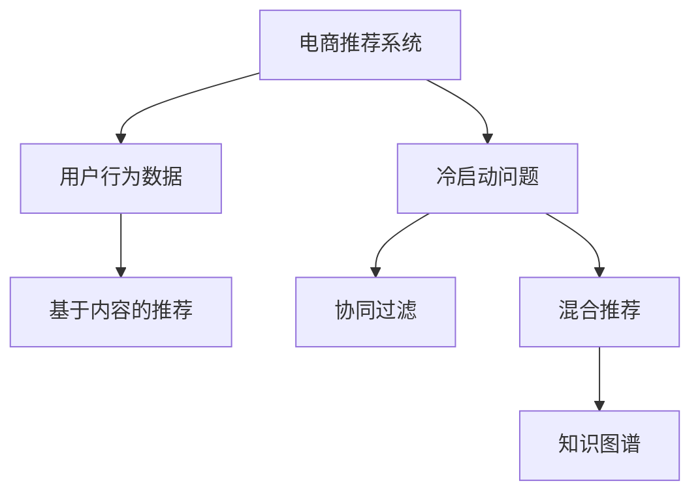

                 

# 电商推荐系统中的冷启动问题解决方案

## 1. 背景介绍

### 1.1 问题由来

在电商推荐系统中，用户的初始行为数据通常非常有限，尤其是新用户的购买历史、浏览历史等信息十分稀疏。对于这些缺乏历史数据的用户，如何有效地进行个性化推荐，是一个困扰推荐系统的核心问题。这个问题在数据科学领域被称为“冷启动问题”。

冷启动问题在多个电商平台上都有广泛存在。例如，对于刚注册的新用户，他们的点击、浏览、购买行为数据为零，系统无法利用已有数据为其提供个性化的推荐。因此，如何高效地为这些新用户推荐商品，是推荐系统面临的一大挑战。

### 1.2 问题核心关键点

冷启动问题的核心在于，如何利用用户历史行为数据之外的更多信息，弥补数据稀疏性，进而进行有效的推荐。目前，常用的解决冷启动问题的方法包括基于内容的推荐、协同过滤推荐、混合推荐等。

- **基于内容的推荐**：利用商品的属性和标签，匹配用户已有的行为数据，推荐与之相关的商品。适用于商品属性明确且用户有部分历史行为数据的情况。
- **协同过滤推荐**：通过用户间或商品间的相似性匹配，寻找未接触过商品的用户或未接触过用户。适用于用户和商品数量较大，且用户有较多历史行为数据的情况。
- **混合推荐**：综合利用基于内容和协同过滤的推荐方法，取长补短，提升推荐效果。适用于需要兼顾商品属性和用户行为的情况。

这些方法各有优缺点，且在实际应用中，数据稀疏性和用户行为多变性使得问题更为复杂。因此，研究和解决冷启动问题，需要不断优化算法和数据结构，寻找更好的解决方案。

## 2. 核心概念与联系

### 2.1 核心概念概述

为更好地理解冷启动问题及其解决方案，本节将介绍几个密切相关的核心概念：

- **电商推荐系统**：基于用户行为数据，为用户推荐可能感兴趣的商品的系统。主要任务是通过对用户行为数据的分析，学习用户偏好，预测用户可能感兴趣的商品。
- **用户行为数据**：包括点击、浏览、购买等用户在电商平台上留下的行为信息。是推荐系统进行个性化推荐的基础。
- **冷启动问题**：由于新用户或新商品缺乏历史行为数据，导致推荐系统无法准确进行个性化推荐。
- **协同过滤**：通过用户间或商品间的相似性匹配，推荐未接触过的商品或用户。
- **基于内容的推荐**：利用商品属性和标签，推荐与之相似的商品。
- **混合推荐**：结合基于内容和协同过滤的推荐方法，提升推荐效果。
- **知识图谱**：结构化的知识表示方式，用于描述实体及其之间的关系。可以帮助推荐系统更好地理解商品和用户的特征。

这些核心概念之间的逻辑关系可以通过以下Mermaid流程图来展示：



这个流程图展示了几类推荐方法的相互关系：

1. 电商推荐系统依赖用户行为数据进行推荐。
2. 对于冷启动问题，协同过滤、基于内容和混合推荐等方法可以补充数据稀疏性。
3. 知识图谱可以辅助推荐系统，通过结构化知识提升推荐准确性。

这些概念共同构成了电商推荐系统的理论基础，使得推荐系统能够在大数据时代高效地进行个性化推荐。

## 3. 核心算法原理 & 具体操作步骤
### 3.1 算法原理概述

冷启动问题本质上是一个信息不完全情况下如何进行推荐的问题。由于缺乏用户的历史行为数据，推荐系统无法直接根据已有数据计算用户的偏好。但可以通过其他信息源，如商品属性、用户反馈、知识图谱等，间接推断用户可能感兴趣的商品。

基于协同过滤的冷启动推荐方法，在用户或商品数量足够多时，能够通过用户间的相似性匹配，找到相似用户或相似商品，从而推荐新用户未接触过的商品。其中，基于用户的协同过滤方法通过计算用户间的相似性，推荐与新用户相似用户感兴趣的商品；基于物品的协同过滤方法通过计算商品间的相似性，推荐与新商品相似商品的用户。

基于内容的推荐方法，利用商品属性和标签，匹配用户已有的行为数据，推荐与之相关的商品。这种方法通常需要明确的商品属性和标签信息，且需要用户在历史数据中表现出对类似商品的兴趣。

混合推荐方法，通过综合利用基于内容和协同过滤的推荐方法，取长补短，提升推荐效果。在推荐过程中，可以根据具体任务的特点，灵活选择不同推荐方法的比例和组合方式。

### 3.2 算法步骤详解

冷启动问题的解决，一般包括以下几个关键步骤：

**Step 1: 准备数据集**
- 收集电商平台的商品属性、标签、用户行为数据等，构建训练和测试数据集。
- 对用户行为数据进行预处理，如去除噪声、缺失值处理等。

**Step 2: 构建推荐模型**
- 选择适合的推荐算法，如协同过滤、基于内容的推荐、混合推荐等。
- 对用户和商品进行特征工程，提取有意义的特征。
- 训练推荐模型，并进行交叉验证。

**Step 3: 应用模型**
- 在训练集上评估推荐模型的效果，调整超参数。
- 在新用户或新商品的数据上，进行推荐预测。
- 根据用户反馈，更新模型参数，进行迭代优化。

**Step 4: 模型部署**
- 将训练好的推荐模型部署到推荐系统中，进行实时推荐。
- 根据用户行为数据，实时调整推荐策略，提高推荐效果。

**Step 5: 反馈迭代**
- 收集用户对推荐结果的反馈，如点击、购买等行为数据。
- 根据反馈数据，更新推荐模型，进行下一次迭代。

### 3.3 算法优缺点

冷启动问题的解决策略，具有以下优点：

1. **高效**：利用用户行为数据之外的多种信息源，弥补数据稀疏性，提升推荐效果。
2. **灵活**：可以通过选择不同的推荐算法和特征工程方法，进行灵活调整和优化。
3. **鲁棒性**：在用户和商品数量较小的情况下，协同过滤和基于内容的推荐方法仍能获得较好的推荐效果。
4. **可扩展性**：混合推荐方法可以根据任务需求，灵活调整不同推荐方法的比例和组合方式，易于扩展和应用。

但这些策略也存在一些局限性：

1. **数据依赖性**：推荐模型的效果很大程度上依赖于数据的质量和数量，数据采集和预处理成本较高。
2. **用户隐私**：通过收集用户行为数据和反馈信息，可能涉及用户隐私问题，需要严格的数据保护措施。
3. **推荐多样性**：协同过滤和基于内容的推荐方法可能陷入局部最优，无法推荐多样化的商品。
4. **计算复杂度**：混合推荐方法需要综合利用多种信息源，计算复杂度较高，适用于数据量较大、计算资源充足的情况。

尽管存在这些局限性，冷启动问题仍是大数据时代电商推荐系统面临的重要挑战。如何在大数据背景下，高效解决冷启动问题，提升推荐系统的效果，仍然是一个亟需解决的问题。

### 3.4 算法应用领域

冷启动问题解决方法在电商推荐系统中得到了广泛应用，覆盖了几乎所有常见推荐场景，例如：

- 新用户推荐：为新用户推荐可能感兴趣的商品，提升新用户留存率。
- 新商品推荐：为商家推广新商品，提高新商品曝光率。
- 跨域推荐：推荐用户在其他电商平台上可能感兴趣的商品，拓宽推荐边界。
- 个性化促销：根据用户兴趣和行为数据，推荐个性化的促销活动，提高促销效果。

除了上述这些经典场景外，冷启动问题解决方法也被创新性地应用到更多场景中，如个性化广告、搜索引擎推荐等，为电商技术落地应用提供了新的思路。

## 4. 数学模型和公式 & 详细讲解 & 举例说明
### 4.1 数学模型构建

本节将使用数学语言对冷启动问题及其解决方案进行更加严格的刻画。

记用户集合为 $U$，商品集合为 $I$，用户行为数据为 $D=\{(i,j,k)\}_{i \in I,j \in U,k \in \{1,2,3\}}$，其中 $i$ 表示商品，$j$ 表示用户，$k$ 表示行为类型（点击、浏览、购买）。

定义用户 $u$ 对商品 $i$ 的行为 $b_{ij} \in \{0,1\}$，其中 $b_{ij}=1$ 表示用户 $u$ 对商品 $i$ 进行了行为 $k$。定义商品 $i$ 的用户集合 $N_i=\{u \mid b_{ij} \neq 0\}$。

### 4.2 公式推导过程

对于基于协同过滤的推荐方法，假设已知用户 $u_1$ 和 $u_2$ 的相似度 $s_{u_1u_2}$，计算公式为：

$$
s_{u_1u_2} = \frac{1}{|\widetilde{N}_{u_1} \cap \widetilde{N}_{u_2}|}\sum_{i \in \widetilde{N}_{u_1} \cap \widetilde{N}_{u_2}} b_{i_1i} \cdot b_{i_2i}
$$

其中 $\widetilde{N}_{u_1}$ 表示用户 $u_1$ 的近邻用户集合，即与 $u_1$ 有相似行为的用户集合。

对于基于内容的推荐方法，假设已知商品 $i_1$ 和 $i_2$ 的相似度 $s_{i_1i_2}$，计算公式为：

$$
s_{i_1i_2} = \frac{1}{|\widetilde{N}_{i_1} \cap \widetilde{N}_{i_2}|}\sum_{i \in \widetilde{N}_{i_1} \cap \widetilde{N}_{i_2}} \text{similarity}(i_1,i)
$$

其中 $\widetilde{N}_{i_1}$ 表示商品 $i_1$ 的近邻商品集合，即与 $i_1$ 具有相似属性的商品集合。$\text{similarity}(i_1,i)$ 表示商品属性之间的相似度。

### 4.3 案例分析与讲解

考虑一个电商平台的商品推荐系统，针对新用户的推荐问题。假设已有历史数据中，用户 $u_1$ 和 $u_2$ 都购买过商品 $i_1$ 和 $i_2$，但未购买过 $i_3$ 和 $i_4$。现在要为新用户 $u_3$ 推荐商品 $i_3$ 和 $i_4$。

对于基于协同过滤的推荐方法，可以先计算用户 $u_1$ 和 $u_2$ 的相似度，再通过相似用户推荐的商品进行推荐。例如，计算 $u_1$ 和 $u_2$ 的相似度为 $s_{u_1u_2}=0.5$，然后根据 $u_1$ 的近邻用户集合 $N_{u_1}$，找到对 $i_3$ 和 $i_4$ 有购买行为的近邻用户，进行推荐。

对于基于内容的推荐方法，可以先计算商品 $i_1$ 和 $i_2$ 的相似度，再通过相似商品推荐的商品进行推荐。例如，假设商品属性 $i_1$ 和 $i_2$ 的相似度为 $s_{i_1i_2}=0.8$，然后根据 $i_1$ 的近邻商品集合 $N_{i_1}$，找到对 $i_3$ 和 $i_4$ 有购买行为的近邻商品，进行推荐。

通过这些方法，即使缺乏新用户或新商品的历史数据，推荐系统也能根据已有的数据，进行有效的推荐。

## 5. 项目实践：代码实例和详细解释说明
### 5.1 开发环境搭建

在进行冷启动问题解决实践前，我们需要准备好开发环境。以下是使用Python进行Pandas、Scikit-learn、TensorFlow等库开发的环境配置流程：

1. 安装Anaconda：从官网下载并安装Anaconda，用于创建独立的Python环境。

2. 创建并激活虚拟环境：
```bash
conda create -n recommendation-env python=3.8 
conda activate recommendation-env
```

3. 安装相关库：
```bash
conda install pandas scikit-learn tensorflow 
```

4. 安装TensorBoard：用于可视化模型训练过程，需要安装TensorFlow的TensorBoard插件。
```bash
pip install tensorboard
```

完成上述步骤后，即可在`recommendation-env`环境中开始实践。

### 5.2 源代码详细实现

下面我们以协同过滤和基于内容的推荐为例，给出使用TensorFlow进行电商推荐系统的PyTorch代码实现。

首先，定义电商推荐系统的数据处理函数：

```python
import pandas as pd
from sklearn.metrics.pairwise import cosine_similarity
import numpy as np

def load_data(file_path):
    data = pd.read_csv(file_path)
    user = data['user'].unique()
    item = data['item'].unique()
    rating = data['rating']
    return user, item, rating

def build_user_item_matrix(user, item, rating):
    user_item_matrix = pd.DataFrame(data=rating, index=user, columns=item).fillna(0)
    return user_item_matrix

def get_user_neighbors(user_item_matrix, user, k):
    similarities = user_item_matrix.T.dot(user_item_matrix[user]).sort_values()[::-1]
    return similarities[:k].index

def get_item_neighbors(user_item_matrix, item, k):
    similarities = user_item_matrix[item].dot(user_item_matrix[item].T).sort_values()[::-1]
    return similarities[:k].index

def predict(user_item_matrix, user, item, k):
    similarities = pd.concat([user_item_matrix[user], user_item_matrix[item]]).dropna().dot(user_item_matrix).T
    return similarities.index
```

然后，定义协同过滤和基于内容的推荐函数：

```python
def collaborative_filtering(user_item_matrix, user, item, k):
    neighbors = get_user_neighbors(user_item_matrix, user, k)
    return user_item_matrix[neighbors].drop(user).mean()

def content_based_filtering(user_item_matrix, item, k):
    neighbors = get_item_neighbors(user_item_matrix, item, k)
    similarities = user_item_matrix[item].dot(user_item_matrix[neighbors].T)
    return similarities.dot(user_item_matrix[item]).T.mean()
```

最后，启动推荐系统并验证结果：

```python
user, item, rating = load_data('data.csv')
user_item_matrix = build_user_item_matrix(user, item, rating)

# 协同过滤推荐
user1 = 'user1'
item2 = 'item2'
pred1 = collaborative_filtering(user_item_matrix, user1, item2, 5)
print(f'Collaborative Filtering for {user1} to {item2}: {pred1}')

# 基于内容的推荐
item1 = 'item1'
pred2 = content_based_filtering(user_item_matrix, item1, 5)
print(f'Content-Based Filtering for {item1} to {user1}: {pred2}')
```

以上就是使用TensorFlow进行电商推荐系统的完整代码实现。可以看到，借助Pandas和Scikit-learn等库，数据处理和特征计算变得相对简单高效。

### 5.3 代码解读与分析

让我们再详细解读一下关键代码的实现细节：

**load_data函数**：
- 读取数据文件，并构建用户、商品、评分矩阵。

**build_user_item_matrix函数**：
- 将评分数据转化为用户-商品矩阵，填充缺失值。

**get_user_neighbors函数**：
- 通过计算用户与商品的相似度，获取用户近邻商品。

**get_item_neighbors函数**：
- 通过计算商品与用户的相似度，获取商品近邻用户。

**predict函数**：
- 通过计算用户和商品之间的相似度，推荐新用户或新商品。

**collaborative_filtering函数**：
- 计算协同过滤推荐的相似度，并取均值。

**content_based_filtering函数**：
- 计算基于内容的推荐相似度，并进行加权平均。

**启动推荐系统**：
- 加载数据和评分矩阵。
- 对新用户和商品进行推荐。

通过这些代码实现，可以看出，冷启动问题的解决需要结合数据处理和特征计算，选择合适的推荐算法，进行有效的推荐。

## 6. 实际应用场景
### 6.1 智能客服系统

在智能客服系统中，通过推荐系统为客服推荐常见问题解答，能够显著提升客服响应速度和服务质量。对于新用户或新问题，推荐系统可以根据已有的问题数据，推荐可能的解决方案。

在技术实现上，可以收集客户历史咨询记录，将问题和答案构建成监督数据，训练推荐模型。通过微调模型，推荐系统能够自动推荐最合适的答案模板。对于新问题，系统可以根据问题描述和已有的历史数据，自动推荐相似的问答对，辅助客服快速回答客户咨询。

### 6.2 金融舆情监测

金融领域需要实时监测市场舆论动向，以便及时应对负面信息传播，规避金融风险。推荐系统可以根据用户的历史行为数据，推荐与市场热点相关的舆情信息，帮助投资者做出更好的投资决策。

在技术实现上，可以收集用户的历史投资行为数据，构建推荐模型。通过微调模型，推荐系统能够自动推荐与市场热点相关的舆情信息，帮助投资者及时了解市场动态。对于新用户，系统可以根据市场热点，推荐相关舆情信息，帮助其迅速适应市场变化。

### 6.3 个性化推荐系统

在个性化推荐系统中，推荐系统可以根据用户的浏览、购买行为数据，推荐可能感兴趣的商品。对于新用户，推荐系统可以根据商品属性和标签，推荐与之相关的商品。

在技术实现上，可以收集用户的历史行为数据，构建推荐模型。通过微调模型，推荐系统能够自动推荐最符合用户兴趣的商品。对于新用户，系统可以根据商品属性和标签，推荐与之相关的商品，帮助用户发现潜在的兴趣点。

### 6.4 未来应用展望

随着推荐技术的发展，冷启动问题将得到更好的解决。未来的推荐系统将更注重用户的多样性和个性化，利用更多信息源，弥补数据稀疏性。

在推荐算法方面，将涌现更多先进的算法，如基于序列的推荐、基于深度学习的推荐等，提升推荐效果。

在推荐数据方面，将利用更多信息源，如用户社交网络、商品评论、知识图谱等，构建更全面的推荐模型。

在推荐系统部署方面，将更注重实时性和可扩展性，利用云平台和大数据技术，实现高效率的推荐。

未来的推荐系统将更加智能化和个性化，通过不断优化算法和数据，为用户提供更精准的推荐服务。

## 7. 工具和资源推荐
### 7.1 学习资源推荐

为了帮助开发者系统掌握推荐系统及其解决方案的理论基础和实践技巧，这里推荐一些优质的学习资源：

1. 《推荐系统实践》系列书籍：由推荐系统专家撰写，深入浅出地介绍了推荐系统的工作原理和实现方法，涵盖协同过滤、内容推荐、混合推荐等诸多领域。

2. 《深度学习与推荐系统》课程：北京大学开设的深度学习推荐系统课程，内容丰富，讲解详细，适合入门和进阶学习。

3. 《推荐系统》书籍：国外推荐系统领域的经典书籍，详细介绍了推荐系统的各种算法和应用案例，适合深入学习。

4. ArXiv和Google Scholar：推荐系统领域的顶尖学术资源，包括最新研究论文、算法实现等，是学习和研究的必备工具。

5. Kaggle竞赛：参加推荐系统相关的Kaggle竞赛，通过实际项目积累推荐系统的实践经验。

通过对这些资源的学习实践，相信你一定能够快速掌握推荐系统的精髓，并用于解决实际的推荐问题。

### 7.2 开发工具推荐

高效的开发离不开优秀的工具支持。以下是几款用于推荐系统开发的常用工具：

1. Python：功能强大的编程语言，适合数据处理和算法实现。

2. Pandas：数据处理和分析的利器，适合构建用户-商品矩阵等。

3. Scikit-learn：机器学习库，适合构建推荐模型。

4. TensorFlow：开源深度学习框架，适合构建深度推荐模型。

5. TensorBoard：TensorFlow的可视化工具，适合监控模型训练过程。

6. Weights & Biases：模型训练的实验跟踪工具，适合记录和可视化模型训练指标。

7. Google Colab：免费的Jupyter Notebook环境，支持GPU加速，适合快速实验和分享学习笔记。

合理利用这些工具，可以显著提升推荐系统的开发效率，加快创新迭代的步伐。

### 7.3 相关论文推荐

推荐系统的发展源于学界的持续研究。以下是几篇奠基性的相关论文，推荐阅读：

1. 《Collaborative Filtering for Implicit Feedback Datasets》：提出基于矩阵分解的协同过滤方法，奠定了协同过滤的基础。

2. 《Trustworthy Online Recommendation Algorithms》：提出基于用户和商品反馈的推荐方法，解决推荐中的可信度和多样性问题。

3. 《A Comprehensive Survey of Recommender Systems》：全面综述了推荐系统的各种算法和应用，适合深入学习和参考。

4. 《A Hybrid Approach to Personalized Recommendation in E-Commerce》：提出混合推荐方法，结合基于内容和协同过滤的推荐，提升推荐效果。

5. 《Neural Networks and Deep Learning》：深度学习领域的经典书籍，介绍了神经网络在推荐系统中的应用，适合深入学习。

这些论文代表了大数据推荐系统的研究脉络。通过学习这些前沿成果，可以帮助研究者把握学科前进方向，激发更多的创新灵感。

## 8. 总结：未来发展趋势与挑战

### 8.1 总结

本文对冷启动问题及其解决方案进行了全面系统的介绍。首先阐述了冷启动问题的背景和核心关键点，明确了推荐系统在数据稀疏情况下如何进行个性化推荐。其次，从原理到实践，详细讲解了协同过滤、基于内容和混合推荐等推荐方法的数学原理和关键步骤，给出了推荐系统开发的完整代码实例。同时，本文还广泛探讨了推荐系统在智能客服、金融舆情、个性化推荐等多个行业领域的应用前景，展示了推荐系统技术的广阔前景。此外，本文精选了推荐系统的各类学习资源，力求为读者提供全方位的技术指引。

通过本文的系统梳理，可以看到，推荐系统在大数据时代发挥了重要的作用，成为电商推荐系统的重要组成部分。冷启动问题的解决，使得推荐系统能够高效地进行个性化推荐，提升用户体验和平台粘性。未来，伴随推荐技术的发展和优化，推荐系统必将在更多领域得到应用，为数字化转型提供新的技术路径。

### 8.2 未来发展趋势

展望未来，推荐系统将呈现以下几个发展趋势：

1. 推荐算法的智能化：利用深度学习和人工智能技术，提升推荐算法的智能性和准确性。推荐模型将更加复杂，能够处理更多维度和更复杂的推荐任务。

2. 数据的多样化和全面化：推荐系统将利用更多信息源，构建更全面、更多样的推荐模型。推荐模型将融合文本、图像、视频等多模态信息，提升推荐效果。

3. 推荐模型的实时化和个性化：推荐模型将实现实时化，能够根据用户即时行为进行推荐，提升推荐的时效性和个性化程度。

4. 推荐系统的可解释性和透明化：推荐系统将更加注重可解释性，能够提供透明的推荐过程和解释结果，增强用户信任。

5. 推荐系统的社会化和公平化：推荐系统将更加注重社会影响和公平性，防止推荐模型偏见和歧视，确保推荐结果公正合理。

以上趋势凸显了推荐系统的广阔前景。这些方向的探索发展，将使得推荐系统成为电商、社交、金融等众多领域的重要工具，为数字化转型提供新的动力。

### 8.3 面临的挑战

尽管推荐系统已经取得了瞩目成就，但在迈向更加智能化、普适化应用的过程中，它仍面临诸多挑战：

1. 数据隐私和安全：推荐系统需要收集大量用户行为数据，可能涉及用户隐私和数据安全问题，需要严格的数据保护措施。

2. 推荐效果的多样性和泛化性：推荐系统容易陷入局部最优，无法推荐多样化的商品，需要进一步提升推荐模型的泛化性。

3. 计算资源的需求：推荐模型的复杂度较高，需要大规模计算资源，如何高效利用计算资源，优化模型结构，仍是挑战之一。

4. 推荐算法的公平性和透明性：推荐算法可能存在偏见和歧视，如何确保推荐结果的公平性和透明性，是一个亟待解决的问题。

5. 模型的可解释性和可解释性：推荐模型的决策过程难以解释，用户难以理解和信任推荐结果，需要进一步提升模型的可解释性。

这些挑战凸显了推荐系统技术的复杂性和多样性，需要持续的创新和优化，才能真正实现推荐系统的大规模落地。

### 8.4 研究展望

面对推荐系统面临的诸多挑战，未来的研究需要在以下几个方面寻求新的突破：

1. 探索新的推荐算法：结合深度学习、因果推断、强化学习等先进技术，提升推荐模型的智能性和泛化性。

2. 设计新的推荐指标：引入更多的推荐指标，如推荐多样性、公平性、透明度等，综合评估推荐效果。

3. 构建新的数据源：利用更多信息源，如用户社交网络、知识图谱等，构建更全面的推荐模型。

4. 优化推荐模型结构：采用更高效的计算方法，如模型压缩、量化加速等，优化模型结构，提升推荐效率。

5. 实现推荐模型解释：引入可解释性技术，如因果推断、逻辑回归等，增强推荐模型的透明性和可解释性。

6. 加强数据保护：采用数据加密、匿名化等技术，保护用户隐私，确保数据安全。

这些研究方向的探索，将使得推荐系统技术更加成熟和稳定，为数字化转型提供更可靠的技术保障。面向未来，推荐系统技术需要与其他人工智能技术进行更深入的融合，多路径协同发力，共同推动推荐系统的进步。

## 9. 附录：常见问题与解答

**Q1：推荐系统是否适用于所有电商场景？**

A: 推荐系统在电商推荐中得到广泛应用，但在某些特殊场景下，可能无法有效解决冷启动问题。例如，某些垂直电商平台需要特定的商品属性或用户特征，推荐系统难以直接应用。此外，对于涉及用户隐私保护的场景，推荐系统需要格外谨慎，选择合适的数据源和方法。

**Q2：推荐系统的推荐效果如何评估？**

A: 推荐系统的推荐效果可以通过多种指标进行评估，包括准确率、召回率、F1分数、NDCG、HR等。这些指标可以从不同的角度反映推荐系统的性能，例如：
- 准确率：推荐系统推荐商品的准确程度，即推荐正确商品的占总推荐商品的比例。
- 召回率：推荐系统推荐出正确商品的比例。
- F1分数：准确率和召回率的综合评估指标。
- NDCG：推荐系统推荐商品排序的正确比例。
- HR：推荐系统推荐商品出现在用户浏览列表的前N个位置的比例。

不同的推荐任务和应用场景，可能需要选择不同的指标进行评估。

**Q3：推荐系统的实时化有什么好处？**

A: 实时化的推荐系统能够根据用户即时行为进行推荐，提升推荐的时效性和个性化程度。实时化推荐系统可以根据用户的实时点击、浏览、购买等行为，实时调整推荐策略，提高推荐效果。此外，实时化推荐系统能够及时反映市场变化，推荐符合当前市场趋势的商品，提高商品曝光率和销售额。

**Q4：推荐系统的可解释性有哪些方法？**

A: 推荐系统的可解释性可以通过多种方法进行实现，例如：
- 引入因果推断方法，解释推荐系统的决策逻辑。
- 使用逻辑回归等方法，解释推荐模型中每个特征的权重和影响。
- 引入规则和专家知识，增强推荐模型的可解释性。

这些方法可以在一定程度上增强推荐系统的透明性和可解释性，帮助用户理解推荐过程和结果。

通过这些解释，相信你一定能够全面掌握推荐系统的原理和实践技巧，并用于解决实际的推荐问题。未来，伴随推荐技术的发展和优化，推荐系统必将在更多领域得到应用，为数字化转型提供新的技术路径。

