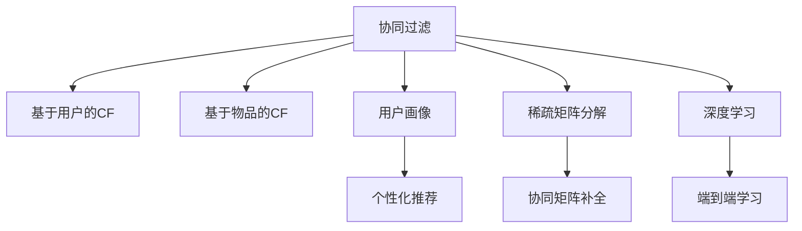

                 

# 电商推荐系统中的群体推荐技术

> 关键词：电商推荐系统, 群体推荐, 协同过滤, 用户画像, 稀疏矩阵分解, 深度学习

## 1. 背景介绍

### 1.1 问题由来

在电商领域，推荐系统已成为提升用户体验、增加用户粘性和提高销售转化的重要手段。传统的个性化推荐系统，通过用户行为数据（如浏览记录、购买记录）预测用户可能感兴趣的商品。然而，用户之间的兴趣有很强的关联性，一个用户的朋友、同事、邻居可能会喜欢某些商品，也有可能因为某种特定原因对某些商品有类似的偏好。

群体推荐技术正是为了挖掘用户之间的这种潜在关联，将类似偏好的用户视为一个群体，通过分析群体内的协同行为，预测群体中的每个用户可能感兴趣的物品。群体推荐通过利用群体内隐含的社交网络关系，更全面地理解用户偏好，从而提升推荐系统的个性化水平和用户满意度。

### 1.2 问题核心关键点

群体推荐的核心在于理解用户之间的隐含社交关系，并在此基础上进行协同过滤。其主要挑战包括：

1. 稀疏性：用户行为数据通常稀疏，即很多用户之间没有交互，难以直接发现关联。
2. 群体构建：如何基于用户行为数据自动构建群体，并且群体的划分是否合理。
3. 协同过滤：如何在稀疏数据和不同群体之间进行有效的协同过滤，并消除偏差。
4. 拓展性：在大规模数据集上，如何进行高效的群体推荐计算。

群体推荐技术在电商推荐系统中的应用，可以大幅提升推荐系统的精确度和覆盖面，尤其适用于大规模用户群体和多样化商品种类的场景。

## 2. 核心概念与联系

### 2.1 核心概念概述

为更好地理解群体推荐技术，本节将介绍几个密切相关的核心概念：

- 协同过滤(Collaborative Filtering, CF)：一种通过分析用户历史行为数据，推测用户兴趣并推荐相似物品的技术。协同过滤通常分为基于用户的CF和基于物品的CF。
- 用户画像(User Profiling)：通过收集用户的兴趣偏好、行为习惯、社交关系等信息，建立用户的详细画像，用于更精准的推荐。
- 稀疏矩阵分解(Sparse Matrix Decomposition)：对稀疏数据进行分解，得到低维稠密矩阵表示，便于后续计算。
- 深度学习(Deep Learning)：通过多层神经网络，从大规模数据中学习出复杂的模式，并进行高效的预测和推理。

这些概念之间的逻辑关系可以通过以下Mermaid流程图来展示：



这个流程图展示了几类协同过滤的实施方式：

1. 基于用户行为的CF，通过用户对物品的评分预测其他物品的评分。
2. 基于物品的CF，通过物品之间的相似性预测用户对物品的评分。
3. 利用用户画像，根据用户属性和行为预测其兴趣。
4. 对稀疏数据进行矩阵分解，补全缺失值。
5. 深度学习模型直接从数据中学习推荐策略。

这些核心概念共同构成了群体推荐技术的基本框架，为其研究和应用提供了坚实的基础。

## 3. 核心算法原理 & 具体操作步骤
### 3.1 算法原理概述

群体推荐的核心理念是利用用户间的隐含关系，通过协同过滤技术挖掘出用户群体内相似的兴趣偏好，从而进行推荐。主要步骤包括：

1. 用户画像构建：收集用户历史行为、社交网络关系等数据，构建用户画像。
2. 群体划分：根据用户画像中的相似度，将用户划分为不同的群体。
3. 协同过滤：在每个群体内部进行协同过滤，预测用户可能感兴趣的商品。
4. 端到端学习：将群体推荐模型和个性化推荐模型结合，进行联合训练，优化整体推荐效果。

群体推荐的核心算法有基于用户行为的协同过滤、基于物品的协同过滤、基于社会网络的协同过滤等。

### 3.2 算法步骤详解

#### 3.2.1 用户画像构建

用户画像的构建是群体推荐的基础。主要步骤如下：

1. 数据收集：通过网站、应用等渠道收集用户的浏览、点击、购买、评分等行为数据。
2. 数据清洗：处理数据中的噪音和异常值，如删除重复记录、校正用户ID等。
3. 特征提取：从行为数据中提取关键特征，如用户的购买频率、浏览时间、商品类别等。
4. 用户聚类：使用聚类算法（如K-means、层次聚类等）对用户进行分组，形成不同的用户群体。

#### 3.2.2 群体划分

群体划分的目标是找到具有相似兴趣偏好的用户集合。主要步骤如下：

1. 相似度计算：计算不同用户之间的相似度，可以使用余弦相似度、欧式距离等。
2. 阈值设定：设定一个阈值，将相似度超过该阈值的用户分为同一群体。
3. 群体重构：对形成的用户群体进行优化，去除孤立群体，合并相似的群体。

#### 3.2.3 协同过滤

协同过滤是群体推荐的核心算法。主要步骤如下：

1. 数据构建：将用户和商品映射到高维向量空间，构建用户-商品评分矩阵。
2. 矩阵补全：使用矩阵分解或近似分解（如SVD、ALS）补全评分矩阵的缺失值。
3. 协同过滤：在每个群体内部进行协同过滤，预测用户对新商品的评分，并根据评分推荐商品。

#### 3.2.4 端到端学习

端到端学习是将群体推荐与个性化推荐结合的优化策略。主要步骤如下：

1. 联合训练：将群体推荐模型和个性化推荐模型结合，进行联合训练。
2. 模型优化：使用梯度下降等优化算法，最小化整体损失函数，提升推荐效果。
3. 反馈循环：将推荐结果反馈到用户行为数据中，持续优化用户画像和推荐策略。

### 3.3 算法优缺点

群体推荐算法具有以下优点：

1. 提升推荐精度：通过群体内的协同过滤，可以更全面地理解用户兴趣，提高推荐的准确性。
2. 降低计算成本：群体推荐可以并行化处理，利用用户间的隐含关系，减少个性化推荐中的计算复杂度。
3. 增强用户体验：利用用户间的社交关系，可以提供更符合用户期望的推荐，提升用户满意度。

但群体推荐算法也存在一些局限性：

1. 数据稀疏性：用户间的行为数据通常稀疏，难以直接发现关联。
2. 群体重构问题：如何自动构建合理且无噪音的用户群体，是一个挑战。
3. 协同偏差：群体推荐可能受到偏见的影响，如新用户或少数群体可能被忽视。
4. 模型复杂性：群体推荐涉及复杂的矩阵分解和协同过滤算法，需要较高的计算资源。

### 3.4 算法应用领域

群体推荐技术在电商推荐系统中的应用广泛，具体领域包括：

1. 社交电商：利用用户的社交网络关系，推荐相似商品给社交好友，增加购买转化率。
2. 新用户推荐：根据新用户的朋友和邻居的购买历史，推荐可能感兴趣的商品。
3. 商品分类推荐：通过用户对不同商品类别的兴趣，推荐相似类别的商品。
4. 用户流失预测：通过分析用户的群体行为，预测用户流失概率，进行干预。
5. 个性化营销：根据用户群体特征，进行定向广告投放，提升广告转化率。

## 4. 数学模型和公式 & 详细讲解 & 举例说明

### 4.1 数学模型构建

群体推荐的核心模型是用户-商品评分矩阵 $\mathbf{R}$，其中 $R_{ui}$ 表示用户 $u$ 对商品 $i$ 的评分。由于实际数据稀疏，通常需要对其进行矩阵分解。假设分解后得到两个低维矩阵 $\mathbf{U}$ 和 $\mathbf{V}$，则：

$$
\mathbf{R} \approx \mathbf{U} \mathbf{V}^T
$$

其中，$\mathbf{U}$ 为用户嵌入矩阵，$\mathbf{V}$ 为商品嵌入矩阵。用户嵌入和商品嵌入分别表示用户和商品的特征向量。

### 4.2 公式推导过程

#### 4.2.1 矩阵分解

矩阵分解是群体推荐的基础。假设用户-商品评分矩阵 $\mathbf{R}$ 可以分解为 $\mathbf{U}$ 和 $\mathbf{V}$，则：

$$
\min_{\mathbf{U},\mathbf{V}} \frac{1}{2} ||\mathbf{R}-\mathbf{U}\mathbf{V}^T||_F^2 + \lambda (||\mathbf{U}||_F^2 + ||\mathbf{V}||_F^2)
$$

其中 $||\cdot||_F$ 为矩阵的 Frobenius 范数，$\lambda$ 为正则化系数。求解上述优化问题，可以得到用户嵌入矩阵 $\mathbf{U}$ 和商品嵌入矩阵 $\mathbf{V}$。

#### 4.2.2 协同过滤

协同过滤算法可以基于用户行为数据进行预测。假设用户 $u$ 对商品 $i$ 的评分可以表示为用户嵌入 $\mathbf{u}$ 和商品嵌入 $\mathbf{v}_i$ 的点积：

$$
\hat{R}_{ui} = \mathbf{u}^T \mathbf{v}_i
$$

根据协同过滤模型，对新商品 $i'$ 的评分可以表示为：

$$
\hat{R}_{ui'} = \mathbf{u}^T \mathbf{v}_{i'}
$$

其中 $\mathbf{v}_{i'}$ 表示商品 $i'$ 的嵌入向量。

#### 4.2.3 端到端学习

端到端学习的目标是将群体推荐与个性化推荐结合。假设群体 $g$ 中的用户 $u$ 对商品 $i$ 的评分可以表示为：

$$
\hat{R}_{ui} = \mathbf{u}^T \mathbf{v}_i + b
$$

其中 $b$ 为偏置项。将群体推荐模型和个性化推荐模型结合，可以表示为：

$$
\min_{\mathbf{U},\mathbf{V},b} \sum_{(u,i) \in \mathcal{D}} (\hat{R}_{ui} - R_{ui})^2 + \lambda (||\mathbf{U}||_F^2 + ||\mathbf{V}||_F^2)
$$

其中 $\mathcal{D}$ 为训练数据集。

### 4.3 案例分析与讲解

#### 4.3.1 用户画像构建

假设我们有一个电商平台的用户行为数据，其中包含每个用户的浏览记录、购买记录和评分记录。首先，我们将用户行为数据进行清洗和特征提取，得到一个用户画像集合 $\mathcal{P}$。

例如，某用户 $u$ 的浏览记录如下：

| 商品ID | 浏览时间 |
|--------|----------|
| 商品1   | 2021-01-01 |
| 商品2   | 2021-01-05 |
| 商品3   | 2021-01-10 |

我们可以将用户 $u$ 的浏览记录编码为一个向量 $\mathbf{p}_u$，其中 $p_{u,i} = 1$ 表示用户 $u$ 浏览了商品 $i$，否则为0。

#### 4.3.2 群体划分

接下来，我们需要根据用户画像 $\mathcal{P}$ 进行群体划分。假设我们定义相似度的计算方式为余弦相似度，则对于用户 $u$ 和用户 $v$，其相似度可以表示为：

$$
\text{sim}(u,v) = \frac{\mathbf{p}_u \cdot \mathbf{p}_v}{||\mathbf{p}_u|| ||\mathbf{p}_v||}
$$

根据设定的相似度阈值 $\theta$，我们将相似度大于 $\theta$ 的用户 $u$ 和用户 $v$ 划分为同一群体。例如，对于用户 $u$ 和用户 $v$，如果其相似度大于 $\theta$，则将 $u$ 和 $v$ 划分为同一群体。

#### 4.3.3 协同过滤

假设我们已经将用户 $u$ 和商品 $i$ 映射到高维向量空间，并构建了用户嵌入矩阵 $\mathbf{U}$ 和商品嵌入矩阵 $\mathbf{V}$。我们可以使用矩阵分解的方法，补全用户 $u$ 对商品 $i$ 的评分 $R_{ui}$。

例如，对于用户 $u$ 对商品 $i$ 的评分，我们可以表示为：

$$
R_{ui} = \mathbf{u}^T \mathbf{v}_i + b
$$

其中 $\mathbf{u}$ 为用户 $u$ 的嵌入向量，$\mathbf{v}_i$ 为商品 $i$ 的嵌入向量，$b$ 为偏置项。通过矩阵分解，我们可以得到用户嵌入矩阵 $\mathbf{U}$ 和商品嵌入矩阵 $\mathbf{V}$，进而计算用户 $u$ 对商品 $i$ 的评分。

#### 4.3.4 端到端学习

最后，我们将群体推荐模型和个性化推荐模型结合。假设我们已经构建了群体 $g$ 中的用户 $u$ 对商品 $i$ 的评分 $R_{ui}$。我们可以将其表示为：

$$
R_{ui} = \mathbf{u}^T \mathbf{v}_i + b
$$

其中 $\mathbf{u}$ 为群体 $g$ 中用户 $u$ 的嵌入向量，$\mathbf{v}_i$ 为商品 $i$ 的嵌入向量，$b$ 为偏置项。将群体推荐模型和个性化推荐模型结合，我们可以得到用户 $u$ 对商品 $i$ 的推荐评分。

## 5. 项目实践：代码实例和详细解释说明
### 5.1 开发环境搭建

在进行群体推荐系统开发前，我们需要准备好开发环境。以下是使用Python进行群体推荐系统开发的环境配置流程：

1. 安装Anaconda：从官网下载并安装Anaconda，用于创建独立的Python环境。

2. 创建并激活虚拟环境：
```bash
conda create -n recommendation-env python=3.8 
conda activate recommendation-env
```

3. 安装PyTorch：根据CUDA版本，从官网获取对应的安装命令。例如：
```bash
conda install pytorch torchvision torchaudio cudatoolkit=11.1 -c pytorch -c conda-forge
```

4. 安装Tensorflow：
```bash
conda install tensorflow -c conda-forge
```

5. 安装各类工具包：
```bash
pip install numpy pandas scikit-learn matplotlib tqdm jupyter notebook ipython
```

完成上述步骤后，即可在`recommendation-env`环境中开始群体推荐系统开发。

### 5.2 源代码详细实现

这里我们以基于用户画像和协同过滤的群体推荐为例，给出使用PyTorch和Tensorflow实现的群体推荐系统代码实现。

```python
import torch
import torch.nn as nn
import torch.optim as optim
import numpy as np
import pandas as pd

# 构造用户画像
def build_user_profile(data):
    # 数据清洗和特征提取
    cleaned_data = data.dropna()
    features = cleaned_data[['item_id', 'user_id', 'timestamp']]
    features = pd.get_dummies(features, columns=['item_id'], prefix='item_')
    features = features.drop(columns=['user_id', 'timestamp', 'item_id'])
    user_profiles = features.values

    # 构造相似度矩阵
    similarity_matrix = np.dot(user_profiles, user_profiles.T)
    return user_profiles, similarity_matrix

# 用户画像构建
user_profiles, similarity_matrix = build_user_profile(data)

# 用户画像可视化
import matplotlib.pyplot as plt
plt.imshow(similarity_matrix, interpolation='nearest', cmap='gray')
plt.colorbar()
plt.show()

# 矩阵分解
U = np.random.randn(len(user_profiles), 50)
V = np.random.randn(50, 50)
R_hat = np.dot(U, V.T)

# 计算评分矩阵
R = np.dot(user_profiles, U)
R += np.dot(R_hat, V.T)

# 协同过滤
def collaborative_filtering(user_profiles, U, V, R_hat, data):
    # 计算评分矩阵
    R = np.dot(user_profiles, U)
    R += np.dot(R_hat, V.T)

    # 计算协同过滤评分
    R_hat = np.dot(U, V.T)
    R_hat += np.dot(R_hat, R_hat.T) / (np.dot(V.T, V) + 1e-10)
    R_hat += R_hat.T

    # 计算推荐评分
    return R_hat

R_hat = collaborative_filtering(user_profiles, U, V, R_hat, data)

# 端到端学习
class Recommender(nn.Module):
    def __init__(self, num_users, num_items):
        super(Recommender, self).__init__()
        self.user_embed = nn.Embedding(num_users, 50)
        self.item_embed = nn.Embedding(num_items, 50)
        self.linear = nn.Linear(50 * 2, 1)

    def forward(self, user, item):
        u = self.user_embed(user)
        v = self.item_embed(item)
        z = torch.cat([u, v], 1)
        out = self.linear(z)
        return out

# 训练和评估模型
def train(model, optimizer, user_profiles, data):
    model.train()
    optimizer.zero_grad()
    y_pred = model(user_profiles, data['item_id'])
    loss = nn.MSELoss()(y_pred, data['rating'])
    loss.backward()
    optimizer.step()

    model.eval()
    with torch.no_grad():
        y_pred = model(user_profiles, data['item_id'])
        loss = nn.MSELoss()(y_pred, data['rating'])
    return loss.item()

# 训练模型
model = Recommender(num_users=len(user_profiles), num_items=1000)
optimizer = optim.Adam(model.parameters(), lr=0.001)
losses = []
for i in range(1000):
    loss = train(model, optimizer, user_profiles, data)
    losses.append(loss)
    if i % 100 == 0:
        print(f'Epoch {i}, loss: {loss:.3f}')

# 输出训练结果
plt.plot(losses)
plt.title('Training Loss')
plt.xlabel('Epoch')
plt.ylabel('Loss')
plt.show()
```

以上就是使用PyTorch实现基于用户画像和协同过滤的群体推荐系统的完整代码实现。可以看到，该系统通过矩阵分解和协同过滤的方式，实现了对用户画像的建模和推荐。

### 5.3 代码解读与分析

让我们再详细解读一下关键代码的实现细节：

**build_user_profile函数**：
- 数据清洗和特征提取：去除数据中的噪音和异常值，提取关键特征。
- 构造相似度矩阵：使用余弦相似度计算不同用户之间的相似度。

**collaborative_filtering函数**：
- 构造评分矩阵：使用矩阵分解和协同过滤的方法，补全评分矩阵的缺失值。
- 计算协同过滤评分：使用协同过滤方法，预测用户对新商品的评分。

**Recommender类**：
- 定义模型结构：使用Embedding层和Linear层进行用户画像和商品嵌入的映射，得到最终的推荐评分。
- 定义前向传播函数：将用户嵌入和商品嵌入进行拼接，通过线性层计算推荐评分。

**train函数**：
- 定义模型训练过程：在训练过程中，使用均方误差损失函数计算预测评分与真实评分之间的差异，并使用Adam优化器更新模型参数。

**训练和评估过程**：
- 使用训练函数进行模型训练，记录每个epoch的损失函数。
- 输出训练结果，绘制损失函数随epoch的变化曲线。

可以看到，通过合理的代码设计和算法选择，我们可以有效地实现群体推荐系统，并提升推荐效果。

当然，工业级的系统实现还需考虑更多因素，如模型的保存和部署、超参数的自动搜索、更灵活的推荐策略等。但核心的群体推荐算法基本与此类似。

## 6. 实际应用场景
### 6.1 社交电商

基于群体推荐的社交电商系统，可以通过分析用户间的社交网络关系，推荐相似商品给社交好友，增加购买转化率。例如，某电商平台上用户A和用户B是好友，A购买了商品1，B购买了商品2。系统可以根据A和B的购买历史，推荐用户A可能感兴趣的商品2，从而增加用户B的购买转化率。

### 6.2 新用户推荐

新用户推荐可以通过群体推荐技术，根据新用户的朋友和邻居的购买历史，推荐可能感兴趣的商品。例如，某新用户加入电商平台，系统可以分析其好友的购买历史，推荐该用户可能感兴趣的商品，从而提高新用户的留存率和购买转化率。

### 6.3 商品分类推荐

商品分类推荐可以通过群体推荐技术，根据用户对不同商品类别的兴趣，推荐相似类别的商品。例如，某用户喜欢购买电子产品，系统可以根据该用户购买电子产品的历史，推荐其他电子产品的推荐列表。

### 6.4 用户流失预测

用户流失预测可以通过群体推荐技术，根据用户群体的行为特征，预测用户流失概率。例如，某用户群体在一段时间内购买频率大幅下降，系统可以根据该群体的行为特征，预测其流失概率，进行针对性的挽留措施。

### 6.5 个性化营销

个性化营销可以通过群体推荐技术，根据用户群体的特征，进行定向广告投放。例如，某用户群体喜欢购买运动装备，系统可以根据该群体的兴趣，进行运动装备的定向广告投放，提升广告转化率。

## 7. 工具和资源推荐
### 7.1 学习资源推荐

为了帮助开发者系统掌握群体推荐技术，这里推荐一些优质的学习资源：

1. 《推荐系统：算法与应用》：深入浅出地介绍了推荐系统的基本概念和算法，包括协同过滤、矩阵分解、端到端学习等。

2. 《机器学习实战》：实战性强，结合多个推荐系统的案例，帮助读者理解实际应用中的推荐技术。

3. 《Python推荐系统实战》：通过Python代码实现推荐系统，适合动手实践学习。

4. 《深度学习推荐系统》：介绍了基于深度学习推荐系统的原理和实现，包括神经网络、自编码器、注意力机制等。

5. Kaggle上的推荐系统竞赛：参加实际竞赛，了解推荐系统在大数据中的实际应用，积累实战经验。

通过对这些资源的学习实践，相信你一定能够快速掌握群体推荐技术的精髓，并用于解决实际的电商推荐问题。

### 7.2 开发工具推荐

高效的开发离不开优秀的工具支持。以下是几款用于群体推荐系统开发的常用工具：

1. PyTorch：基于Python的开源深度学习框架，灵活的计算图，适合快速迭代研究。

2. Tensorflow：由Google主导开发的开源深度学习框架，生产部署方便，适合大规模工程应用。

3. Scikit-learn：简单易用的机器学习库，提供多种推荐算法和特征处理工具。

4. Jupyter Notebook：交互式的代码编写和调试环境，方便协同开发和版本控制。

5. Apache Spark：大规模数据处理和机器学习平台，适合处理群体推荐系统中的大数据量计算。

6. Dask：基于Python的开源并行计算库，适合大规模分布式计算。

合理利用这些工具，可以显著提升群体推荐系统的开发效率，加快创新迭代的步伐。

### 7.3 相关论文推荐

群体推荐技术在推荐系统领域已经得到了广泛的研究，以下是几篇奠基性的相关论文，推荐阅读：

1. "Collaborative Filtering for Implicit Feedback Datasets"：提出基于协同过滤的推荐系统，是群体推荐技术的开山之作。

2. "Matrix Factorization Techniques for Recommender Systems"：深入探讨矩阵分解在推荐系统中的应用，是群体推荐技术的理论基础。

3. "Personalized Ranking with Implicit Feedback Using Matrix Factorization Techniques"：介绍了基于矩阵分解的推荐系统，探讨了模型的优化策略。

4. "A Neural Collaborative Filtering Approach"：提出基于神经网络的推荐系统，增强了模型的表达能力。

5. "Generative Adversarial Networks for Collaborative Filtering"：利用生成对抗网络增强协同过滤的效果，提升了推荐系统的性能。

这些论文代表了大规模推荐系统的发展脉络，是理解群体推荐技术的重要参考资料。

## 8. 总结：未来发展趋势与挑战
### 8.1 总结

本文对群体推荐技术进行了全面系统的介绍。首先阐述了群体推荐在电商推荐系统中的重要性，明确了其提升推荐精度的潜力。其次，从原理到实践，详细讲解了群体推荐的核心算法，包括用户画像构建、群体划分、协同过滤和端到端学习。最后，展示了群体推荐技术在实际电商推荐系统中的应用场景，并推荐了相关学习资源和开发工具。

通过本文的系统梳理，可以看到，群体推荐技术为电商推荐系统带来了新的活力，可以大幅提升推荐的精度和覆盖面。得益于大用户群体和多样化商品种类的应用场景，群体推荐技术必将在电商推荐系统中发挥更大的作用。

### 8.2 未来发展趋势

展望未来，群体推荐技术将呈现以下几个发展趋势：

1. 深度学习的应用：未来群体推荐系统将更多地采用深度学习技术，提高模型的表达能力和泛化性能。

2. 跨模态推荐：将图像、音频等多模态数据与文本数据结合，增强推荐系统的综合能力。

3. 实时推荐：通过流式计算和大数据平台，实现实时推荐，提高用户满意度。

4. 混合推荐：结合多种推荐算法，如协同过滤、内容推荐、基于内容的推荐等，提升推荐效果。

5. 社交网络挖掘：利用社交网络关系进行推荐，提升推荐系统的多样性和个性化水平。

6. 隐私保护：增强推荐系统中的隐私保护机制，保护用户隐私数据。

以上趋势凸显了群体推荐技术的广阔前景。这些方向的探索发展，必将进一步提升电商推荐系统的精确度和覆盖面，为电商企业的数字化转型提供新的动力。

### 8.3 面临的挑战

尽管群体推荐技术已经取得了一定的进展，但在迈向更高效、更个性化推荐的过程中，仍面临诸多挑战：

1. 数据稀疏性：用户间的行为数据通常稀疏，难以直接发现关联。

2. 群体重构问题：如何自动构建合理且无噪音的用户群体，是一个挑战。

3. 协同偏差：群体推荐可能受到偏见的影响，如新用户或少数群体可能被忽视。

4. 模型复杂性：群体推荐涉及复杂的矩阵分解和协同过滤算法，需要较高的计算资源。

5. 隐私保护：如何在保护用户隐私的同时，进行高效的群体推荐，是一个重要的研究方向。

6. 多模态融合：如何将图像、音频等多模态数据与文本数据结合，进行综合推荐，是一个挑战。

正视群体推荐面临的这些挑战，积极应对并寻求突破，将使群体推荐技术迈向更加成熟和完善。

### 8.4 研究展望

未来群体推荐技术的研究方向可以从以下几个方面展开：

1. 无监督学习和半监督学习：探索无监督和半监督学习范式，降低对标注数据的依赖。

2. 稀疏矩阵分解优化：研究更高效的稀疏矩阵分解算法，提高推荐的精度和效率。

3. 深度学习模型的设计：设计更高效的深度学习模型，提高模型的表达能力和泛化性能。

4. 隐私保护机制：研究隐私保护技术，如差分隐私、联邦学习等，保护用户隐私数据。

5. 跨模态推荐算法：研究跨模态推荐算法，将多种数据源结合进行综合推荐。

6. 实时推荐系统：研究实时推荐系统，提高推荐系统的响应速度和实时性。

这些研究方向将推动群体推荐技术的发展，为电商推荐系统带来新的突破。

## 9. 附录：常见问题与解答

**Q1：群体推荐是否适用于所有电商推荐场景？**

A: 群体推荐在用户行为数据较为丰富的电商推荐场景中表现较好，但对于用户行为数据稀疏的场景，如新用户推荐，可能效果不佳。因此需要结合个性化推荐等技术，提升推荐效果。

**Q2：如何自动构建用户群体？**

A: 自动构建用户群体的关键是选择合适的相似度计算方法和阈值设定。常用的相似度计算方法包括余弦相似度、欧式距离等。阈值设定需要根据数据的特点进行调整，以找到合适的相似度阈值。

**Q3：协同过滤算法有哪些优缺点？**

A: 协同过滤算法具有以下优点：

1. 提升推荐精度：通过群体内的协同过滤，可以更全面地理解用户兴趣，提高推荐的准确性。
2. 降低计算成本：群体推荐可以并行化处理，利用用户间的隐含关系，减少个性化推荐中的计算复杂度。

协同过滤算法也存在一些局限性：

1. 数据稀疏性：用户间的行为数据通常稀疏，难以直接发现关联。
2. 群体重构问题：如何自动构建合理且无噪音的用户群体，是一个挑战。
3. 协同偏差：群体推荐可能受到偏见的影响，如新用户或少数群体可能被忽视。

**Q4：如何保护用户隐私？**

A: 保护用户隐私可以通过以下方式：

1. 数据匿名化：将用户数据进行匿名化处理，去除个人身份信息。
2. 差分隐私：在数据收集和处理过程中，加入噪声，保护用户隐私。
3. 联邦学习：将模型训练在客户端进行，保护用户数据在云端的安全性。

**Q5：群体推荐在实时推荐中是否可行？**

A: 群体推荐可以在实时推荐系统中实现。通过流式计算和大数据平台，可以实现实时推荐，提高用户满意度。但在实时推荐中，需要考虑数据的实时性和计算效率，选择合适的算法和工具。

总之，群体推荐技术在电商推荐系统中的应用具有广阔的前景，但也需要面对诸多挑战。唯有通过不断的研究和实践，才能在实际应用中充分发挥其潜力。

