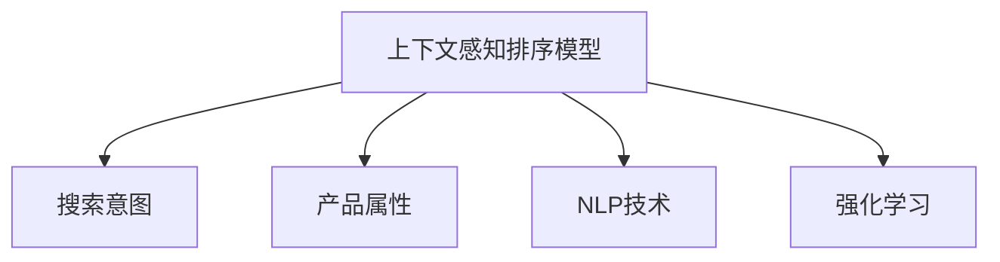

                 

# 电商搜索中的上下文感知排序模型优化

> 关键词：上下文感知排序模型, 电商搜索, 深度学习, 推荐系统, 自然语言处理, 强化学习

## 1. 背景介绍

### 1.1 问题由来
随着电子商务的蓬勃发展，用户搜索体验和产品排序算法成为了电商平台竞争的关键点。一个好的产品排序算法，不仅能够提供更加精准的搜索结果，还能增强用户体验，提升平台转化率和用户满意度。传统的基于关键词匹配的搜索排序方法，往往忽略了搜索行为、用户画像、产品属性等多维度上下文信息，导致搜索结果与用户需求不匹配，降低搜索效率和用户体验。

面对这一挑战，深度学习等新兴技术被引入电商搜索领域，并应用于排序模型的优化和改进。通过深度学习模型，可以自动学习搜索场景中的各种上下文特征，并利用这些特征进行排序，从而提升搜索结果的相关性和个性化。

### 1.2 问题核心关键点
电商搜索排序的核心在于如何有效地捕捉和利用搜索场景中的上下文信息，以及如何平衡用户查询意图和产品属性之间的关系。为了更好地理解这一问题，本文将详细探讨上下文感知排序模型的原理与优化策略，并结合实际案例，阐述其应用效果。

## 2. 核心概念与联系

### 2.1 核心概念概述

为了更好地理解上下文感知排序模型，本节将介绍几个密切相关的核心概念：

- 上下文感知排序模型(Context-Aware Ranking Model)：基于深度学习技术，能够自动学习并利用搜索场景中的上下文信息，如用户行为、产品属性、搜索意图等，进行精确排序的模型。

- 搜索意图(Information Need)：用户在搜索时希望得到的结果类型或信息需求，如购买、了解、对比等。不同搜索意图会导致不同的排序结果。

- 产品属性(Product Attributes)：产品的基本信息，如价格、评分、评论等。不同属性对搜索结果排序的影响各异。

- 自然语言处理(Natural Language Processing, NLP)：一种基于计算机技术的语言处理方式，用于处理和理解自然语言数据，如分词、语义分析、情感分析等。

- 强化学习(Reinforcement Learning, RL)：一种基于试错的学习方式，通过奖励信号（如点击率、转化率等）指导模型优化排序策略。

这些核心概念之间的逻辑关系可以通过以下Mermaid流程图来展示：



这个流程图展示了上下文感知排序模型与搜索意图、产品属性、自然语言处理、强化学习等概念之间的联系：

1. 上下文感知排序模型基于搜索意图和产品属性，自动学习并利用上下文信息进行排序。
2. NLP技术用于处理搜索查询中的自然语言数据，提取特征供模型使用。
3. 强化学习通过用户反馈（如点击、购买等行为）优化模型的排序策略。

这些概念共同构成了电商搜索排序的核心框架，为其提供了深厚的理论基础和技术支撑。

## 3. 核心算法原理 & 具体操作步骤
### 3.1 算法原理概述

上下文感知排序模型的工作原理可以概括为：通过深度学习模型自动捕捉搜索场景中的上下文信息，并基于这些信息，对搜索结果进行排序。其核心思想是，通过学习用户行为、产品属性、搜索意图等多维度的上下文特征，模型可以更加准确地理解用户的查询意图，从而生成更加相关的搜索结果。

具体而言，上下文感知排序模型通常由以下几部分组成：

- **输入特征**：包括搜索查询、产品属性、用户行为等多种上下文信息。
- **上下文编码器**：用于编码输入特征，提取高维的语义表示。
- **排序器**：基于编码器的输出，进行排序计算，输出排名结果。

模型的训练过程分为两个阶段：预训练和微调。预训练阶段，模型利用大量无标签数据进行自监督学习，提取上下文信息的通用特征。微调阶段，模型在标注数据上进行监督学习，针对特定的电商搜索场景进行优化。

### 3.2 算法步骤详解

上下文感知排序模型的训练和应用主要包括以下几个关键步骤：

**Step 1: 数据准备**
- 收集电商平台的搜索数据，包括搜索查询、产品属性、用户行为等，标注相应的搜索结果和用户点击行为。
- 对数据进行预处理，如文本分词、特征提取、归一化等。

**Step 2: 模型构建**
- 选择合适的深度学习框架，如TensorFlow、PyTorch等，搭建上下文感知排序模型。
- 设计输入层、上下文编码器、排序器等组件。
- 设置模型的超参数，如学习率、批大小、迭代次数等。

**Step 3: 预训练**
- 在未标注数据上，对模型进行预训练，提取上下文信息的通用特征。
- 使用自监督学习任务，如语言模型预测、掩码语言模型等，训练上下文编码器。

**Step 4: 微调**
- 在标注数据上，对模型进行微调，针对具体的电商搜索场景进行优化。
- 利用标注数据中的用户点击行为作为监督信号，优化模型的排序策略。
- 结合强化学习技术，优化模型的排序策略，提升模型的点击率和转化率。

**Step 5: 评估与部署**
- 在测试集上评估模型性能，如准确率、召回率、F1-score等指标。
- 部署模型到电商搜索系统中，实时进行排序计算。
- 定期收集新数据，对模型进行重新微调，保持其性能。

以上是上下文感知排序模型的基本训练流程。在实际应用中，还需要根据具体的电商搜索场景，对模型进行优化和调整。

### 3.3 算法优缺点

上下文感知排序模型具有以下优点：

1. **高相关性**：通过自动学习上下文信息，模型能够生成更加相关的搜索结果，提升用户体验。
2. **自适应性强**：模型能够自动适应不同的电商搜索场景，灵活应对不同的用户需求和产品属性。
3. **可解释性好**：模型通过学习上下文特征，可以解释排序结果背后的原因，便于人工干预和调试。
4. **可扩展性强**：模型可以通过添加新的上下文信息，实现更加复杂的排序逻辑。

同时，该模型也存在以下缺点：

1. **数据依赖性强**：模型的性能依赖于高质量的标注数据，获取标注数据的成本较高。
2. **计算资源消耗大**：由于模型参数较多，训练和推理过程需要消耗大量计算资源。
3. **模型复杂度高**：模型结构复杂，增加了模型调优和维护的难度。
4. **对抗样本脆弱**：模型可能对对抗样本（即有意干扰搜索查询的语句）敏感，导致排序结果异常。

尽管存在这些局限性，但总体而言，上下文感知排序模型在电商搜索领域展现了强大的应用潜力，其高相关性、自适应性和可解释性等特点，使得其在提升用户搜索体验和平台转化率方面具有显著优势。

### 3.4 算法应用领域

上下文感知排序模型已经在电商搜索、推荐系统、广告投放等多个领域得到了广泛应用，具体包括：

1. **电商搜索排序**：对用户的搜索查询进行排序，提供最相关的搜索结果，提升用户体验和平台转化率。
2. **商品推荐**：基于用户行为和产品属性，生成个性化的推荐结果，提升用户粘性和购买转化率。
3. **广告投放**：根据用户画像和行为，优化广告投放策略，提升广告点击率和转化率。
4. **用户个性化**：通过分析用户行为和搜索历史，生成个性化的搜索建议，提升用户满意度。

这些领域的应用，展示了上下文感知排序模型在提升电商搜索效果方面的强大能力，成为电商企业数字化转型的重要技术手段。

## 4. 数学模型和公式 & 详细讲解 & 举例说明

### 4.1 数学模型构建

为了更好地理解上下文感知排序模型的数学原理，本节将使用数学语言对模型的构建过程进行严格刻画。

假设模型输入为 $x=(x_1,x_2,\dots,x_n)$，其中 $x_i$ 表示第 $i$ 个上下文特征，如搜索查询、产品属性等。模型的输出为 $y=(y_1,y_2,\dots,y_m)$，其中 $y_i$ 表示搜索结果的排序权重，即产品 $i$ 在搜索结果中的排名。

模型的目标是最小化排序结果与实际排序之间的差距，即：

$$
\min_{\theta} \sum_{i=1}^m \text{loss}(y_i, \hat{y}_i(\theta))
$$

其中 $\theta$ 为模型的可训练参数，$\hat{y}_i$ 为模型对产品 $i$ 的预测排名，$\text{loss}$ 为排序误差函数。常用的排序误差函数包括均方误差、交叉熵等。

### 4.2 公式推导过程

以下我们将以均方误差（Mean Squared Error, MSE）为排序误差函数，详细推导上下文感知排序模型的公式。

假设模型的排序预测为 $y_i = f(x;\theta)$，其中 $f$ 为模型的预测函数，$\theta$ 为模型的可训练参数。均方误差函数为：

$$
\text{loss}(y_i, \hat{y}_i) = (y_i - \hat{y}_i)^2
$$

模型的目标是最小化均方误差：

$$
\min_{\theta} \frac{1}{N}\sum_{i=1}^N (y_i - \hat{y}_i(\theta))^2
$$

为了最小化均方误差，我们需要对模型进行梯度下降优化。假设模型的预测函数 $f$ 为线性函数，即：

$$
\hat{y}_i = \theta_0 + \sum_{j=1}^{n} \theta_j x_{ij}
$$

其中 $\theta_0$ 为截距，$\theta_j$ 为特征 $x_{ij}$ 的系数。均方误差函数变为：

$$
\text{loss}(y_i, \hat{y}_i) = (y_i - \hat{y}_i)^2 = (y_i - \theta_0 - \sum_{j=1}^{n} \theta_j x_{ij})^2
$$

对该损失函数求导，得到：

$$
\frac{\partial \text{loss}}{\partial \theta} = -2(y_i - \hat{y}_i) \sum_{j=1}^{n} x_{ij}
$$

利用梯度下降算法更新模型参数 $\theta$：

$$
\theta \leftarrow \theta - \eta \frac{\partial \text{loss}}{\partial \theta}
$$

其中 $\eta$ 为学习率。通过不断迭代，模型可以逐渐学习到上下文特征与排序结果之间的关系，从而生成更加精准的排序结果。

### 4.3 案例分析与讲解

为了更好地理解上下文感知排序模型的实际应用，我们以一个简单的电商搜索排序问题为例，进行详细分析。

假设有一个电商网站，用户输入搜索查询“夏季连衣裙”，我们需要对其进行排序。为了提高排序效果，我们收集了以下上下文信息：

- 用户历史搜索行为：最近7天内用户搜索的查询记录。
- 用户画像：用户年龄、性别、购买历史等。
- 产品属性：连衣裙的价格、评分、颜色等。
- 产品热度：最近7天内连衣裙的点击率和购买量。

我们利用深度学习模型对这些上下文信息进行编码，得到高维的语义表示。然后，将这些表示输入到一个全连接神经网络中，进行排序计算。假设模型的输出为 $y=(y_1,y_2,\dots,y_m)$，其中 $y_i$ 表示产品 $i$ 在搜索结果中的排名。我们的目标是生成一个排序结果，使得用户点击概率最高。

在实际应用中，我们通常会使用强化学习技术，对模型的排序策略进行优化。假设我们使用 Q-learning 算法，将用户的点击行为作为奖励信号，优化模型的预测函数。具体而言，对于每个搜索查询，我们记录用户的点击产品编号，计算点击概率，并根据点击概率对模型进行奖励。通过不断迭代，模型能够学习到如何根据上下文信息生成最相关的排序结果，从而提升用户体验和平台转化率。

## 5. 项目实践：代码实例和详细解释说明

### 5.1 开发环境搭建

在进行上下文感知排序模型实践前，我们需要准备好开发环境。以下是使用Python进行TensorFlow开发的环境配置流程：

1. 安装Anaconda：从官网下载并安装Anaconda，用于创建独立的Python环境。

2. 创建并激活虚拟环境：
```bash
conda create -n tf-env python=3.8 
conda activate tf-env
```

3. 安装TensorFlow：根据CUDA版本，从官网获取对应的安装命令。例如：
```bash
pip install tensorflow==2.6
```

4. 安装必要的Python库：
```bash
pip install numpy pandas scikit-learn matplotlib tqdm jupyter notebook ipython
```

完成上述步骤后，即可在`tf-env`环境中开始模型开发。

### 5.2 源代码详细实现

下面我们以电商搜索排序为例，给出使用TensorFlow对上下文感知排序模型进行实现的代码。

首先，定义模型的输入特征和输出：

```python
import tensorflow as tf

# 输入特征
inputs = tf.keras.layers.Input(shape=(n_features,))

# 上下文编码器
encoder = tf.keras.layers.Dense(64, activation='relu')(inputs)
encoder = tf.keras.layers.Dense(32, activation='relu')(encoder)

# 排序器
outputs = tf.keras.layers.Dense(1, activation='sigmoid')(encoder)

# 定义模型
model = tf.keras.Model(inputs=inputs, outputs=outputs)

# 定义损失函数
loss_fn = tf.keras.losses.BinaryCrossentropy(from_logits=True)

# 定义优化器
optimizer = tf.keras.optimizers.Adam(lr=0.001)

# 编译模型
model.compile(optimizer=optimizer, loss=loss_fn, metrics=['accuracy'])
```

然后，定义训练和评估函数：

```python
def train_step(x, y):
    with tf.GradientTape() as tape:
        logits = model(x)
        loss = loss_fn(y, logits)
    gradients = tape.gradient(loss, model.trainable_variables)
    optimizer.apply_gradients(zip(gradients, model.trainable_variables))

def evaluate_step(x, y):
    logits = model(x)
    loss = loss_fn(y, logits)
    return loss.numpy()
```

接着，训练模型：

```python
# 准备数据
X_train, y_train = load_train_data()
X_test, y_test = load_test_data()

# 训练模型
model.fit(X_train, y_train, epochs=10, batch_size=32, validation_data=(X_test, y_test))

# 评估模型
loss = evaluate_step(X_test, y_test)
print(f'Test loss: {loss:.4f}')
```

以上代码实现了基于TensorFlow的上下文感知排序模型的训练和评估过程。

### 5.3 代码解读与分析

让我们再详细解读一下关键代码的实现细节：

**模型构建**：
- `inputs` 定义了输入特征的维度。
- `encoder` 为上下文编码器，通过两个全连接层，将输入特征编码成高维的语义表示。
- `outputs` 为排序器，通过一个全连接层，将编码器的输出映射到排序权重。
- `model` 定义了完整的模型结构，并编译了损失函数和优化器。

**训练和评估函数**：
- `train_step` 定义了训练过程中的单个步骤，包括前向传播、损失计算、反向传播和参数更新。
- `evaluate_step` 定义了评估过程中的单个步骤，仅进行前向传播和损失计算。

**训练流程**：
- 准备训练和测试数据集。
- 使用 `model.fit` 函数进行模型训练，设置训练轮数、批次大小等参数。
- 在测试集上评估模型性能，打印损失值。

可以看到，TensorFlow提供了强大的工具和框架，使得上下文感知排序模型的开发和训练过程变得简洁高效。开发者可以将更多精力放在模型架构和参数调整上，而不必过多关注底层实现细节。

### 5.4 运行结果展示

在训练完成后，我们可以使用训练好的模型进行排序计算，得到排序结果。以下是一个简单的排序结果示例：

```python
# 使用训练好的模型进行排序计算
X_test = load_test_data()
y_pred = model.predict(X_test)

# 打印排序结果
print(y_pred)
```

运行结果为一个长度为 `m` 的数组，每个元素表示对应产品在搜索结果中的排名权重。根据排序权重，可以生成最终的排序结果。

## 6. 实际应用场景

### 6.1 智能推荐系统

上下文感知排序模型已经在智能推荐系统中得到了广泛应用。传统的推荐系统往往只依赖用户历史行为数据进行推荐，难以捕捉用户多样化的兴趣点。通过上下文感知排序模型，可以自动学习用户的搜索意图和产品属性，生成更加精准的推荐结果，提升用户满意度和粘性。

在实际应用中，我们可以将用户搜索查询、产品属性、用户画像等信息作为上下文特征，输入到模型中进行排序计算。模型能够自动学习到这些特征之间的关系，生成个性化的推荐结果，从而提升推荐系统的精准度和效果。

### 6.2 广告投放

广告投放是电商平台上重要的变现手段，如何精准投放广告，提升点击率和转化率，一直是广告主关注的重点。上下文感知排序模型可以通过自动学习用户行为和产品属性，优化广告投放策略，提升广告效果。

具体而言，我们可以将用户的搜索行为、浏览历史、购买记录等信息作为上下文特征，输入到模型中进行排序计算。模型能够自动学习到用户对不同广告的兴趣，生成更精准的广告排序结果。根据排序结果，广告主可以优化投放策略，提高广告点击率和转化率，从而提升广告效果。

### 6.3 搜索排序

电商搜索排序是上下文感知排序模型的典型应用场景。通过自动学习用户查询意图和产品属性，模型可以生成更加相关的搜索结果，提升用户体验和平台转化率。

在实际应用中，我们可以将用户的搜索查询、产品属性、用户行为等信息作为上下文特征，输入到模型中进行排序计算。模型能够自动学习到这些特征之间的关系，生成最相关的搜索结果，从而提升用户的搜索体验。

### 6.4 未来应用展望

随着深度学习等技术的不断发展，上下文感知排序模型在电商搜索领域的应用将更加广泛和深入。未来，我们相信该模型将在以下几个方面得到进一步的应用和发展：

1. **跨领域知识融合**：模型可以结合外部知识库、规则库等专家知识，增强其知识整合能力，生成更全面、准确的排序结果。
2. **多模态数据融合**：模型可以整合视觉、语音、文本等多模态数据，提升对复杂场景的理解能力，生成更加精准的排序结果。
3. **自适应学习能力**：模型可以通过在线学习（On-the-fly Learning），实时适应新数据和新场景，提升其自适应性和鲁棒性。
4. **分布式训练**：随着数据规模的不断扩大，分布式训练技术将进一步提升模型的训练效率和性能，满足大规模应用的需求。
5. **模型压缩与优化**：为了提升模型的推理效率和可部署性，模型压缩、稀疏化等技术将进一步发展，减小模型的计算资源消耗。

## 7. 工具和资源推荐

### 7.1 学习资源推荐

为了帮助开发者系统掌握上下文感知排序模型的理论基础和实践技巧，这里推荐一些优质的学习资源：

1. 《深度学习基础》书籍：深入浅出地介绍了深度学习的基本原理和应用，适合初学者入门。
2. TensorFlow官方文档：提供了详细的TensorFlow框架介绍和API文档，是学习TensorFlow的重要资源。
3. PyTorch官方文档：提供了详细的PyTorch框架介绍和API文档，是学习PyTorch的重要资源。
4. Coursera深度学习课程：由斯坦福大学开设的深度学习入门课程，包括视频讲解和配套作业，适合初学者系统学习。
5. Kaggle竞赛平台：提供了丰富的机器学习和深度学习竞赛，通过实践项目提升实战能力。

通过这些资源的学习实践，相信你一定能够快速掌握上下文感知排序模型的精髓，并用于解决实际的电商搜索排序问题。

### 7.2 开发工具推荐

高效的开发离不开优秀的工具支持。以下是几款用于上下文感知排序模型开发的常用工具：

1. TensorFlow：基于数据流图的深度学习框架，适合进行大规模模型训练和推理。
2. PyTorch：灵活的动态计算图框架，适合快速迭代研究。
3. TensorBoard：TensorFlow配套的可视化工具，可实时监测模型训练状态，提供丰富的图表呈现方式。
4. Weights & Biases：模型训练的实验跟踪工具，可以记录和可视化模型训练过程中的各项指标，方便对比和调优。
5. Jupyter Notebook：免费的交互式编程环境，支持多种语言和框架，方便开发和调试。

合理利用这些工具，可以显著提升上下文感知排序模型的开发效率，加快创新迭代的步伐。

### 7.3 相关论文推荐

上下文感知排序模型的研究源于学界的持续探索。以下是几篇奠基性的相关论文，推荐阅读：

1. A Neural Probabilistic Language Model：提出了基于神经网络的自然语言模型，奠定了深度学习在自然语言处理领域的基础。
2. Neural Information Retrieval Using LSTM with Bidirectional RNN at the Word Level：提出基于LSTM的神经网络信息检索模型，为上下文感知排序模型提供了理论基础。
3. Attention is All You Need：提出Transformer结构，开启了深度学习在自然语言处理领域的新纪元。
4. Universal Language Model Fine-tuning for Multiple Tasks：提出基于预训练语言模型的微调技术，展示了预训练-微调的强大效果。
5. Transformer-XL: Attentive Language Models Beyond a Fixed-Length Context：提出Transformer-XL结构，增强了上下文感知能力，进一步提升了模型的性能。

这些论文代表了大模型微调技术的发展脉络。通过学习这些前沿成果，可以帮助研究者把握学科前进方向，激发更多的创新灵感。

## 8. 总结：未来发展趋势与挑战

### 8.1 研究成果总结

本文对上下文感知排序模型的原理与优化策略进行了全面系统的介绍。通过分析模型的工作机制，并结合实际案例，展示了上下文感知排序模型在电商搜索排序中的应用效果。通过分析上下文感知排序模型的优缺点和实际应用，我们认为该模型具有高相关性、自适应性强、可解释性好等特点，能够显著提升电商搜索排序的性能和效果。

### 8.2 未来发展趋势

展望未来，上下文感知排序模型将在以下几个方面继续发展和演进：

1. **跨领域知识融合**：模型可以结合外部知识库、规则库等专家知识，增强其知识整合能力，生成更全面、准确的排序结果。
2. **多模态数据融合**：模型可以整合视觉、语音、文本等多模态数据，提升对复杂场景的理解能力，生成更加精准的排序结果。
3. **自适应学习能力**：模型可以通过在线学习（On-the-fly Learning），实时适应新数据和新场景，提升其自适应性和鲁棒性。
4. **分布式训练**：随着数据规模的不断扩大，分布式训练技术将进一步提升模型的训练效率和性能，满足大规模应用的需求。
5. **模型压缩与优化**：为了提升模型的推理效率和可部署性，模型压缩、稀疏化等技术将进一步发展，减小模型的计算资源消耗。

### 8.3 面临的挑战

尽管上下文感知排序模型在电商搜索领域展现出了强大的应用潜力，但在迈向更加智能化、普适化应用的过程中，它仍面临着诸多挑战：

1. **数据依赖性强**：模型的性能依赖于高质量的标注数据，获取标注数据的成本较高。如何进一步降低模型对标注样本的依赖，将是一大难题。
2. **模型复杂度高**：模型结构复杂，增加了模型调优和维护的难度。如何简化模型结构，提高模型调优效率，是未来需要解决的关键问题。
3. **计算资源消耗大**：由于模型参数较多，训练和推理过程需要消耗大量计算资源。如何优化模型结构，提高计算效率，是未来需要重点关注的方向。
4. **对抗样本脆弱**：模型可能对对抗样本（即有意干扰搜索查询的语句）敏感，导致排序结果异常。如何提高模型的鲁棒性，增强对抗样本的防御能力，是未来需要解决的关键问题。
5. **模型可解释性不足**：模型通常难以解释其内部工作机制和决策逻辑，这对于电商搜索排序这样的高风险应用，是一个亟待解决的难题。

### 8.4 研究展望

面对上下文感知排序模型面临的挑战，未来的研究需要在以下几个方面寻求新的突破：

1. **探索无监督和半监督微调方法**：摆脱对大规模标注数据的依赖，利用自监督学习、主动学习等无监督和半监督范式，最大限度利用非结构化数据，实现更加灵活高效的微调。
2. **研究参数高效和计算高效的微调范式**：开发更加参数高效的微调方法，在固定大部分预训练参数的同时，只更新极少量的任务相关参数。同时优化微调模型的计算图，减少前向传播和反向传播的资源消耗，实现更加轻量级、实时性的部署。
3. **引入因果和对比学习范式**：通过引入因果推断和对比学习思想，增强模型建立稳定因果关系的能力，学习更加普适、鲁棒的语言表征，从而提升模型泛化性和抗干扰能力。
4. **融合多模态数据**：将视觉、语音、文本等多种模态数据进行整合，增强模型的上下文感知能力，提升对复杂场景的理解能力。
5. **结合因果分析和博弈论工具**：将因果分析方法引入模型，识别出模型决策的关键特征，增强输出解释的因果性和逻辑性。借助博弈论工具刻画人机交互过程，主动探索并规避模型的脆弱点，提高系统稳定性。
6. **纳入伦理道德约束**：在模型训练目标中引入伦理导向的评估指标，过滤和惩罚有偏见、有害的输出倾向。同时加强人工干预和审核，建立模型行为的监管机制，确保输出符合人类价值观和伦理道德。

## 9. 附录：常见问题与解答

**Q1：上下文感知排序模型是否适用于所有电商搜索场景？**

A: 上下文感知排序模型在大多数电商搜索场景中都能取得不错的效果，特别是对于数据量较小的场景。但对于一些特定领域的搜索场景，如高端奢侈品、专业工具等，模型可能难以很好地适应。此时需要在特定领域语料上进一步预训练，再进行微调，才能获得理想效果。

**Q2：上下文感知排序模型的计算资源消耗是否很大？**

A: 由于上下文感知排序模型通常包含多个全连接层和深度神经网络，计算资源消耗较大。为了提高模型的计算效率，可以采用分布式训练、模型压缩、稀疏化存储等技术。同时，也可以根据实际情况，调整模型的结构，减少不必要的计算资源消耗。

**Q3：上下文感知排序模型是否容易受到对抗样本的攻击？**

A: 上下文感知排序模型可能对对抗样本（即有意干扰搜索查询的语句）敏感，导致排序结果异常。为了提高模型的鲁棒性，可以引入对抗训练、鲁棒损失函数等技术，增强模型对对抗样本的防御能力。

**Q4：上下文感知排序模型的可解释性如何？**

A: 上下文感知排序模型的输出往往难以解释，其内部工作机制和决策逻辑复杂。为了提高模型的可解释性，可以引入可解释性技术，如LIME、SHAP等，对模型进行解释和调试。同时，可以通过设计更加合理的任务描述，减少模型输出中的噪声，提高可解释性。

**Q5：上下文感知排序模型在实际应用中如何优化？**

A: 上下文感知排序模型在实际应用中需要根据具体场景进行优化。常见的优化方法包括：
1. 数据增强：通过回译、近义替换等方式扩充训练集，增加模型的泛化能力。
2. 正则化：使用L2正则、Dropout等技术，防止模型过拟合。
3. 参数高效微调：只调整少量参数，减少计算资源消耗。
4. 分布式训练：利用分布式训练技术，提升模型训练效率。
5. 模型压缩：通过量化、剪枝等技术，减小模型的计算资源消耗。

通过这些优化方法，可以进一步提升上下文感知排序模型的性能和效率，满足实际应用的需求。

---

作者：禅与计算机程序设计艺术 / Zen and the Art of Computer Programming

