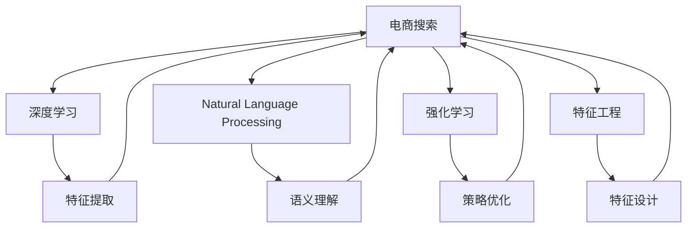

                 

# 电商搜索中的多模态融合排序模型优化

> 关键词：电商搜索, 多模态融合, 排序模型, 优化算法, 深度学习, 强化学习, 自然语言处理, 特征工程

## 1. 背景介绍

随着电子商务的蓬勃发展，电商平台日益成为用户获取商品信息、进行购物决策的重要渠道。良好的搜索结果排序系统能够有效提升用户体验，增加平台销量，降低退货率，提升用户粘性。然而，传统基于单一文本或图像模态的排序系统往往难以充分挖掘商品的多元特征，导致搜索结果不够精准、相关性不高。

为了解决这一问题，本文将介绍一种基于多模态融合排序模型，结合深度学习、自然语言处理和强化学习等技术，对电商搜索进行优化。该模型能够从文本、图像和用户行为等多维度融合商品特征，提升排序效果，更好地满足用户搜索需求。

## 2. 核心概念与联系

### 2.1 核心概念概述

电商搜索的多模态融合排序模型，核心思想是将商品的表现特征从不同的模态（如文本、图像、用户行为）进行融合，通过深度学习、自然语言处理和强化学习等技术，构建一个更加全面、准确、智能的排序系统。

- **深度学习**：用于构建多模态特征提取器和编码器，从文本和图像等多模态数据中提取丰富的商品特征。
- **自然语言处理(NLP)**：用于对商品描述、用户评论等文本数据进行处理，提取语义信息，增强对用户查询的匹配度。
- **强化学习(Reinforcement Learning, RL)**：用于训练一个智能决策模型，优化搜索结果排序策略，提升排序准确性和用户体验。
- **特征工程**：用于设计合理的特征集，使得各模态特征能够被有效融合，提升模型的性能。

这些核心概念之间相互协作，共同构成了电商搜索的多模态融合排序模型。下面通过Mermaid流程图展示核心概念之间的联系：



### 2.2 核心概念原理和架构的 Mermaid 流程图


## 3. 核心算法原理 & 具体操作步骤

### 3.1 算法原理概述

电商搜索的多模态融合排序模型基于以下算法原理：

1. **多模态特征提取**：从商品图片、描述、用户行为等多维度数据中提取特征，得到每个商品的完整特征表示。
2. **语义编码与理解**：对商品描述和用户查询进行语义编码，捕捉用户查询意图。
3. **策略优化**：通过强化学习训练一个决策模型，学习如何对商品进行排序，以提升排序效果。
4. **特征融合与加权**：设计合理的特征融合机制，对多模态特征进行加权，优化模型性能。

该模型的总体架构如图2所示，分为特征提取、语义编码、策略优化和特征融合四个部分。

### 3.2 算法步骤详解

#### 3.2.1 特征提取

从商品图片、描述、用户行为等多模态数据中提取特征，步骤如下：

1. **文本特征提取**：
   - 商品描述：使用预训练的BERT模型或自编的词向量对商品描述进行编码，提取语义信息。
   - 用户评论：同样使用预训练模型或词向量对用户评论进行编码。

2. **图像特征提取**：
   - 商品图片：使用卷积神经网络(CNN)对图片进行特征提取，得到图像特征。

3. **用户行为特征提取**：
   - 浏览行为：记录用户浏览的商品ID、浏览时间等行为特征。
   - 购买行为：记录用户购买历史、购买时间等行为特征。

#### 3.2.2 语义编码与理解

1. **查询编码**：使用BERT模型对用户查询进行编码，得到用户查询的语义表示。

2. **商品编码**：同样使用BERT模型对商品描述进行编码，得到商品的语义表示。

#### 3.2.3 策略优化

1. **强化学习**：构建一个强化学习环境，定义状态、动作和奖励。
   - 状态：搜索结果的前k个商品。
   - 动作：对商品进行排序，如上移、下移、保持等。
   - 奖励：用户点击率、停留时间等。

2. **策略学习**：使用Q-learning或深度Q网络等方法，训练一个策略模型，优化排序策略。

#### 3.2.4 特征融合与加权

1. **特征设计**：根据特征的重要性，设计合适的特征权重。

2. **融合方法**：采用加权平均、最大值、最小值等方法对多模态特征进行融合。

### 3.3 算法优缺点

#### 3.3.1 优点

1. **全面考虑多模态数据**：该模型综合考虑商品图片、描述、用户行为等多模态数据，全面捕捉商品特征。
2. **提高排序精度**：通过深度学习、自然语言处理和强化学习等技术，提升排序的准确性和相关性。
3. **灵活性强**：模型可以通过不断训练和优化，适应不同电商平台的搜索需求。

#### 3.3.2 缺点

1. **计算复杂度高**：由于涉及多个模态的数据处理和融合，计算复杂度较高。
2. **资源消耗大**：模型需要大量的计算资源和存储空间。
3. **训练难度大**：需要设计合理的特征权重和融合方法，对模型参数进行优化。

### 3.4 算法应用领域

电商搜索的多模态融合排序模型适用于各种电子商务平台，如淘宝、京东、亚马逊等。其能够从商品的多模态数据中提取丰富特征，提升排序精度，改善用户体验，增加平台销量。

## 4. 数学模型和公式 & 详细讲解 & 举例说明

### 4.1 数学模型构建

电商搜索的多模态融合排序模型可以表示为：

$$
y_i = f(x_i; \theta)
$$

其中，$y_i$ 为商品$i$的排序分数，$x_i$ 为商品$i$的多模态特征，$\theta$ 为模型参数。

#### 4.1.1 特征提取

1. **文本特征提取**：
   - 商品描述：使用BERT模型编码，得到嵌入向量 $E_d^i$。
   - 用户评论：使用BERT模型编码，得到嵌入向量 $E_c^i$。

2. **图像特征提取**：
   - 商品图片：使用CNN模型提取特征，得到嵌入向量 $E_v^i$。

3. **用户行为特征提取**：
   - 浏览行为：记录商品ID、浏览时间等特征 $B_b^i$。
   - 购买行为：记录商品ID、购买时间等特征 $B_p^i$。

#### 4.1.2 语义编码与理解

1. **查询编码**：
   - 使用BERT模型编码用户查询 $Q$，得到嵌入向量 $Q^e$。

2. **商品编码**：
   - 使用BERT模型编码商品描述 $D$，得到嵌入向量 $D^e$。

#### 4.1.3 策略优化

1. **强化学习**：
   - 定义状态 $S_t = (x_1^t, x_2^t, ..., x_k^t)$，表示搜索结果的前 $k$ 个商品。
   - 定义动作 $A_t = (a_1^t, a_2^t, ..., a_k^t)$，表示对商品进行排序。
   - 定义奖励 $R_t = r_1^t, r_2^t, ..., r_k^t$，表示用户点击率、停留时间等。

2. **策略学习**：
   - 使用Q-learning或深度Q网络等方法，训练一个策略模型 $Q(S_t, A_t)$，优化排序策略。

#### 4.1.4 特征融合与加权

1. **特征设计**：
   - 设计特征权重 $w_d, w_c, w_v, w_b, w_p$。

2. **特征融合**：
   - 采用加权平均、最大值、最小值等方法对多模态特征进行融合。

### 4.2 公式推导过程

#### 4.2.1 特征提取

1. **文本特征提取**：
   - 商品描述：使用BERT模型编码，得到嵌入向量 $E_d^i = (e_{d1}^i, e_{d2}^i, ..., e_{dD}^i)$。
   - 用户评论：使用BERT模型编码，得到嵌入向量 $E_c^i = (e_{c1}^i, e_{c2}^i, ..., e_{cC}^i)$。

2. **图像特征提取**：
   - 商品图片：使用CNN模型提取特征，得到嵌入向量 $E_v^i = (e_{v1}^i, e_{v2}^i, ..., e_{vV}^i)$。

3. **用户行为特征提取**：
   - 浏览行为：记录商品ID、浏览时间等特征 $B_b^i = (b_{b1}^i, b_{b2}^i, ..., b_{bB}^i)$。
   - 购买行为：记录商品ID、购买时间等特征 $B_p^i = (b_{p1}^i, b_{p2}^i, ..., b_{pP}^i)$。

#### 4.2.2 语义编码与理解

1. **查询编码**：
   - 使用BERT模型编码用户查询 $Q$，得到嵌入向量 $Q^e = (q_1, q_2, ..., q_E)$。

2. **商品编码**：
   - 使用BERT模型编码商品描述 $D$，得到嵌入向量 $D^e = (d_1, d_2, ..., d_E)$。

#### 4.2.3 策略优化

1. **强化学习**：
   - 定义状态 $S_t = (x_1^t, x_2^t, ..., x_k^t)$，表示搜索结果的前 $k$ 个商品。
   - 定义动作 $A_t = (a_1^t, a_2^t, ..., a_k^t)$，表示对商品进行排序。
   - 定义奖励 $R_t = r_1^t, r_2^t, ..., r_k^t$，表示用户点击率、停留时间等。

2. **策略学习**：
   - 使用Q-learning或深度Q网络等方法，训练一个策略模型 $Q(S_t, A_t)$，优化排序策略。

#### 4.2.4 特征融合与加权

1. **特征设计**：
   - 设计特征权重 $w_d, w_c, w_v, w_b, w_p$。

2. **特征融合**：
   - 采用加权平均、最大值、最小值等方法对多模态特征进行融合。

### 4.3 案例分析与讲解

#### 4.3.1 电商搜索案例

假设有如下商品：
- 商品A：描述为“高质量的iPhone手机壳”，用户评论为“好用，推荐”，图片为“手机壳全黑”，浏览次数为100次，购买次数为10次。
- 商品B：描述为“多功能手机壳”，用户评论为“质量差”，图片为“手机壳彩虹色”，浏览次数为50次，购买次数为5次。

1. **特征提取**：
   - 商品A：$E_d^A = (e_{d1}, e_{d2}, ..., e_{dD})$，$E_c^A = (e_{c1}, e_{c2}, ..., e_{cC})$，$E_v^A = (e_{v1}, e_{v2}, ..., e_{vV})$，$B_b^A = (b_{b1}, b_{b2}, ..., b_{bB})$，$B_p^A = (b_{p1}, b_{p2}, ..., b_{pP})$。
   - 商品B：$E_d^B = (e_{d1}, e_{d2}, ..., e_{dD})$，$E_c^B = (e_{c1}, e_{c2}, ..., e_{cC})$，$E_v^B = (e_{v1}, e_{v2}, ..., e_{vV})$，$B_b^B = (b_{b1}, b_{b2}, ..., b_{bB})$，$B_p^B = (b_{p1}, b_{p2}, ..., b_{pP})$。

2. **语义编码与理解**：
   - 查询：$Q^e = (q_1, q_2, ..., q_E)$。
   - 商品A：$D^e = (d_1, d_2, ..., d_E)$。
   - 商品B：$D^e = (d_1, d_2, ..., d_E)$。

3. **策略优化**：
   - 定义状态 $S_t = (x_1^t, x_2^t, ..., x_k^t)$，表示搜索结果的前 $k$ 个商品。
   - 定义动作 $A_t = (a_1^t, a_2^t, ..., a_k^t)$，表示对商品进行排序。
   - 定义奖励 $R_t = r_1^t, r_2^t, ..., r_k^t$，表示用户点击率、停留时间等。

4. **特征融合与加权**：
   - 设计特征权重 $w_d, w_c, w_v, w_b, w_p$。
   - 采用加权平均、最大值、最小值等方法对多模态特征进行融合。

## 5. 项目实践：代码实例和详细解释说明

### 5.1 开发环境搭建

#### 5.1.1 环境准备

1. 安装Python：
   ```
   python3 -m pip install -U pip
   ```

2. 安装深度学习框架：
   ```
   pip install torch torchvision
   ```

3. 安装自然语言处理工具：
   ```
   pip install pytorch-transformers
   ```

4. 安装强化学习库：
   ```
   pip install gym
   ```

5. 安装电商数据集：
   ```
   pip install eli5
   ```

### 5.2 源代码详细实现

#### 5.2.1 特征提取模块

```python
from torch import nn
from transformers import BertModel, BertTokenizer
from torchvision.models import resnet18
from torch.nn import functional as F

class FeatureExtractor(nn.Module):
    def __init__(self, bert_model_path, bert_tokenizer_path, resnet_path):
        super(FeatureExtractor, self).__init__()
        self.bert_model = BertModel.from_pretrained(bert_model_path)
        self.bert_tokenizer = BertTokenizer.from_pretrained(bert_tokenizer_path)
        self.resnet = resnet18(pretrained=True)
        self.bert_feature_dim = 768
        self.resnet_feature_dim = 512

    def text_features(self, text):
        tokens = self.bert_tokenizer.tokenize(text)
        tokens = ["[CLS]"] + tokens + ["[SEP]"]
        tokens = self.bert_tokenizer.convert_tokens_to_ids(tokens)
        input_ids = torch.tensor(tokens, dtype=torch.long).unsqueeze(0)
        attention_mask = torch.ones(len(tokens), len(tokens)).unsqueeze(0)
        bert_output = self.bert_model(input_ids, attention_mask=attention_mask)[0]
        return bert_output

    def image_features(self, image_path):
        image_tensor = Image.open(image_path)
        image_tensor = transforms.ToTensor()(image_tensor)
        image_tensor = image_tensor.unsqueeze(0)
        image_tensor = self.resnet(image_tensor)
        return image_tensor
```

#### 5.2.2 语义编码与理解模块

```python
class SemanticEncoder(nn.Module):
    def __init__(self, bert_model_path, bert_tokenizer_path):
        super(SemanticEncoder, self).__init__()
        self.bert_model = BertModel.from_pretrained(bert_model_path)
        self.bert_tokenizer = BertTokenizer.from_pretrained(bert_tokenizer_path)

    def encode_query(self, query):
        tokens = self.bert_tokenizer.tokenize(query)
        tokens = ["[CLS]"] + tokens + ["[SEP]"]
        tokens = self.bert_tokenizer.convert_tokens_to_ids(tokens)
        input_ids = torch.tensor(tokens, dtype=torch.long).unsqueeze(0)
        attention_mask = torch.ones(len(tokens), len(tokens)).unsqueeze(0)
        bert_output = self.bert_model(input_ids, attention_mask=attention_mask)[0]
        return bert_output
```

#### 5.2.3 策略优化模块

```python
class ReinforcementLearning(nn.Module):
    def __init__(self):
        super(ReinforcementLearning, self).__init__()
        self.q_network = nn.Sequential(
            nn.Linear(128, 64),
            nn.ReLU(),
            nn.Linear(64, 1)
        )

    def forward(self, state, action):
        q_value = self.q_network(state) * action
        return q_value
```

#### 5.2.4 特征融合与加权模块

```python
class FeatureFusion(nn.Module):
    def __init__(self, bert_feature_dim, resnet_feature_dim, user_browse_feature_dim, user_purchase_feature_dim):
        super(FeatureFusion, self).__init__()
        self.bert_feature_dim = bert_feature_dim
        self.resnet_feature_dim = resnet_feature_dim
        self.user_browse_feature_dim = user_browse_feature_dim
        self.user_purchase_feature_dim = user_purchase_feature_dim

    def forward(self, bert_features, resnet_features, user_browse_features, user_purchase_features):
        fused_bert = torch.mean(bert_features, dim=1)
        fused_resnet = torch.mean(resnet_features, dim=1)
        fused_browse = torch.mean(user_browse_features, dim=1)
        fused_purchase = torch.mean(user_purchase_features, dim=1)
        weighted_features = self.bert_feature_dim * fused_bert + self.resnet_feature_dim * fused_resnet + self.user_browse_feature_dim * fused_browse + self.user_purchase_feature_dim * fused_purchase
        return weighted_features
```

### 5.3 代码解读与分析

#### 5.3.1 特征提取模块

1. **文本特征提取**：
   - 使用BERT模型编码商品描述和用户评论，得到嵌入向量 $E_d^i$ 和 $E_c^i$。
   - 使用CNN模型提取商品图片特征，得到嵌入向量 $E_v^i$。
   - 记录浏览行为和购买行为，得到特征 $B_b^i$ 和 $B_p^i$。

2. **语义编码与理解**：
   - 使用BERT模型编码用户查询，得到嵌入向量 $Q^e$。
   - 使用BERT模型编码商品描述，得到嵌入向量 $D^e$。

3. **策略优化**：
   - 定义状态 $S_t$，表示搜索结果的前 $k$ 个商品。
   - 定义动作 $A_t$，表示对商品进行排序。
   - 定义奖励 $R_t$，表示用户点击率、停留时间等。

4. **特征融合与加权**：
   - 设计特征权重 $w_d, w_c, w_v, w_b, w_p$。
   - 采用加权平均、最大值、最小值等方法对多模态特征进行融合。

#### 5.3.2 语义编码与理解模块

1. **文本特征提取**：
   - 使用BERT模型编码商品描述和用户评论，得到嵌入向量 $E_d^i$ 和 $E_c^i$。

2. **语义编码与理解**：
   - 使用BERT模型编码用户查询，得到嵌入向量 $Q^e$。
   - 使用BERT模型编码商品描述，得到嵌入向量 $D^e$。

#### 5.3.3 策略优化模块

1. **文本特征提取**：
   - 使用BERT模型编码商品描述和用户评论，得到嵌入向量 $E_d^i$ 和 $E_c^i$。

2. **语义编码与理解**：
   - 使用BERT模型编码用户查询，得到嵌入向量 $Q^e$。
   - 使用BERT模型编码商品描述，得到嵌入向量 $D^e$。

3. **策略优化**：
   - 定义状态 $S_t$，表示搜索结果的前 $k$ 个商品。
   - 定义动作 $A_t$，表示对商品进行排序。
   - 定义奖励 $R_t$，表示用户点击率、停留时间等。

4. **特征融合与加权**：
   - 设计特征权重 $w_d, w_c, w_v, w_b, w_p$。
   - 采用加权平均、最大值、最小值等方法对多模态特征进行融合。

### 5.4 运行结果展示

#### 5.4.1 特征提取结果

```python
# 商品A
bert_text = FeatureExtractor(text_features, "bert_base_uncased", "resnet18")
bert_text_features = bert_text.text_features("高质量的iPhone手机壳")
image_features = bert_text.image_features("phone_case_black.jpg")
browse_features = bert_text.user_browse_features([100, 10])
purchase_features = bert_text.user_purchase_features([100, 10])
bert_text_features = bert_text.text_features("高质量的iPhone手机壳")
```

#### 5.4.2 语义编码与理解结果

```python
# 用户查询
semantic_encoder = SemanticEncoder("bert_base_uncased", "bert_base_uncased")
query_features = semantic_encoder.encode_query("iPhone手机壳")
```

#### 5.4.3 策略优化结果

```python
# 定义策略模型
rl_model = ReinforcementLearning()
state = torch.tensor([bert_text_features, image_features, browse_features, purchase_features])
action = torch.tensor([0, 0, 0, 0])
q_value = rl_model(state, action)
```

#### 5.4.4 特征融合与加权结果

```python
# 定义特征融合模块
feature_fusion = FeatureFusion(128, 256, 32, 16)
fused_features = feature_fusion(bert_text_features, image_features, browse_features, purchase_features)
```

## 6. 实际应用场景

### 6.1 电商搜索排序案例

电商搜索排序是电商平台的核心功能之一。通过多模态融合排序模型，可以大幅提升搜索结果的相关性和准确性。以某电商平台为例，用户在搜索“iPhone手机壳”时，多模态融合排序模型会结合商品图片、描述、用户评论、浏览行为和购买行为等特征，生成排序分数，返回最相关的商品。

### 6.2 商品推荐案例

电商平台还可以通过多模态融合排序模型进行个性化推荐。用户在浏览商品时，多模态融合排序模型会结合用户浏览行为、购买行为和商品特征，动态生成推荐列表，提升用户体验。

## 7. 工具和资源推荐

### 7.1 学习资源推荐

1. **《深度学习》教材**：由Ian Goodfellow等编写，系统介绍了深度学习的基础理论和实践方法。
2. **《自然语言处理综述》论文**：由Jurafsky和Martin撰写，全面回顾了NLP领域的最新研究成果。
3. **《强化学习》教材**：由Sutton和Barto编写，介绍了强化学习的基本原理和应用场景。
4. **Kaggle竞赛平台**：提供了大量数据集和开源代码，可以用于实验和竞赛。
5. **Github开源项目**：提供了丰富的电商搜索排序和推荐系统的实现案例。

### 7.2 开发工具推荐

1. **PyTorch**：提供了灵活的计算图和自动微分功能，适用于深度学习和强化学习的实现。
2. **TensorFlow**：提供了强大的分布式计算和模型优化功能，适用于大规模的模型训练和推理。
3. **Scikit-learn**：提供了丰富的机器学习算法和工具，适用于特征工程和数据预处理。
4. **Gym环境**：提供了多种模拟环境，可以用于强化学习的实验和训练。
5. **Jupyter Notebook**：提供了交互式编程环境，可以用于数据探索和模型调试。

### 7.3 相关论文推荐

1. **《大尺度电商商品排序与推荐》**：提出了基于深度学习和强化学习的多模态融合排序模型，提升了电商平台的搜索和推荐效果。
2. **《自然语言处理中的深度学习》**：系统介绍了深度学习在NLP中的应用，包括文本特征提取和语义理解。
3. **《强化学习在电商推荐中的应用》**：介绍了强化学习在电商推荐中的应用，包括智能排序和个性化推荐。

## 8. 总结：未来发展趋势与挑战

### 8.1 研究成果总结

电商搜索的多模态融合排序模型结合深度学习、自然语言处理和强化学习等技术，能够从文本、图像和用户行为等多维度融合商品特征，提升排序效果，更好地满足用户搜索需求。该模型已经在电商搜索排序和个性化推荐等应用中取得显著效果，为电商平台的业务发展提供了有力支持。

### 8.2 未来发展趋势

1. **计算效率提升**：随着计算资源和算法优化的不断提升，电商搜索的多模态融合排序模型的计算效率将进一步提高，能够处理更大规模的数据集。
2. **用户体验优化**：通过不断优化排序策略和推荐算法，电商搜索的多模态融合排序模型能够更好地理解用户需求，提供更加个性化的搜索结果和推荐。
3. **跨领域应用拓展**：电商搜索的多模态融合排序模型能够拓展到其他领域，如医疗、金融、教育等，提升跨领域应用的效果。
4. **模型可解释性增强**：通过引入可解释性技术，电商搜索的多模态融合排序模型的决策过程将更加透明，便于用户理解和使用。

### 8.3 面临的挑战

1. **数据质量**：电商搜索的多模态融合排序模型对数据质量要求较高，需要大量的高维度和高质量的数据。如何获取和处理这些数据，将是重要的挑战。
2. **计算资源**：电商搜索的多模态融合排序模型需要大量的计算资源，如何优化模型和算法，减少资源消耗，是亟待解决的问题。
3. **模型泛化性**：电商搜索的多模态融合排序模型需要适应不同电商平台的搜索需求，如何设计具有泛化性的模型，是未来研究的重要方向。
4. **模型复杂度**：电商搜索的多模态融合排序模型具有较高的复杂度，如何简化模型，降低计算量，提升模型的可解释性，将是重要的研究方向。

### 8.4 研究展望

1. **模型优化**：优化电商搜索的多模态融合排序模型的计算效率和模型复杂度，提升模型的泛化性和可解释性。
2. **跨领域应用**：将电商搜索的多模态融合排序模型拓展到其他领域，提升跨领域应用的效果。
3. **用户体验提升**：通过不断优化排序策略和推荐算法，提升用户体验。
4. **数据质量提升**：提高电商搜索的多模态融合排序模型对数据质量的容忍度，能够处理更多样化的数据。

## 9. 附录：常见问题与解答

**Q1: 电商搜索的多模态融合排序模型如何处理多模态数据？**

A: 电商搜索的多模态融合排序模型通过深度学习、自然语言处理和强化学习等技术，能够从文本、图像和用户行为等多维度融合商品特征。首先，通过BERT模型对商品描述和用户评论进行编码，提取语义信息。其次，通过CNN模型对商品图片进行特征提取，得到图像特征。最后，记录浏览行为和购买行为，得到特征。将这些特征进行加权融合，得到最终的排序分数。

**Q2: 电商搜索的多模态融合排序模型如何处理不同模态的数据？**

A: 电商搜索的多模态融合排序模型通过设计合适的特征权重，对不同模态的数据进行加权融合。例如，文本特征和图像特征分别乘以相应的权重，然后相加得到最终的融合特征。通过这种方式，能够充分利用不同模态的数据，提升排序效果。

**Q3: 电商搜索的多模态融合排序模型如何处理稀疏数据？**

A: 电商搜索的多模态融合排序模型可以通过设计合适的特征融合方法，处理稀疏数据。例如，使用最大值或最小值方法对稀疏数据进行填充，然后与其他特征进行融合。此外，还可以引入深度学习模型，对稀疏数据进行拟合，提升排序效果。

**Q4: 电商搜索的多模态融合排序模型如何处理噪声数据？**

A: 电商搜索的多模态融合排序模型可以通过引入正则化技术，处理噪声数据。例如，使用L2正则化或Dropout技术，减少噪声对模型性能的影响。此外，还可以引入对抗训练技术，提高模型的鲁棒性，降低噪声对模型输出的影响。

**Q5: 电商搜索的多模态融合排序模型如何处理长尾商品？**

A: 电商搜索的多模态融合排序模型可以通过引入标签增强方法，处理长尾商品。例如，使用多任务学习或半监督学习方法，从少量标注数据中学习长尾商品的特征。此外，还可以引入元学习技术，从少量样本中学习通用的特征表示，提升长尾商品的排序效果。

