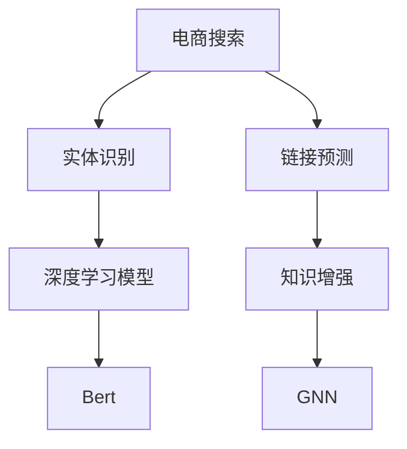

                 

# 电商搜索中的实体识别与链接：知识增强的深度学习模型

> 关键词：电商搜索、实体识别、链接预测、知识增强、深度学习、Bert、GNN

## 1. 背景介绍

### 1.1 问题由来

随着互联网技术的飞速发展，电商搜索系统已成为各大电商平台的核心竞争力之一。高效的搜索体验不仅能提升用户的购物体验，还能为电商平台带来更高的转化率和用户粘性。然而，电商搜索中的实体识别与链接任务（Entity Recognition and Linking, ER&L），涉及从商品描述、图片、评论等多模态数据中自动识别商品实体，并建立实体间的语义关系，是当前电商搜索系统面临的一项关键技术挑战。

传统的实体识别方法依赖于手工规则和特征工程，难以适应大规模复杂语境下的实体识别需求。与此同时，电商搜索中的链接预测任务，旨在自动关联商品图片、评论等信息与商品描述，建立知识图谱，为用户推荐关联商品，提升搜索的丰富性和精准性。传统的链接预测方法基于图算法，难以充分挖掘多模态数据中蕴含的丰富语义信息。

为了应对这些挑战，研究者们开始探索利用深度学习方法，特别是Bert等预训练语言模型，来改进实体识别与链接任务的效果。这些方法在学术界和工业界得到了广泛应用，并取得了显著成效。本文将对基于知识增强的深度学习模型在电商搜索中的应用进行详细介绍，并展望未来发展趋势。

### 1.2 问题核心关键点

电商搜索中的实体识别与链接任务，本质上可以分解为两个子任务：

1. 实体识别：在商品描述、评论等多模态数据中自动抽取商品实体。
2. 链接预测：在抽取出的商品实体间建立语义关系，构建知识图谱。

本文将重点介绍实体识别与链接任务的算法原理、具体操作步骤，以及知识增强的深度学习模型如何提升任务效果。

## 2. 核心概念与联系

### 2.1 核心概念概述

为了更深入地理解知识增强的深度学习模型在电商搜索中的应用，本节将介绍几个密切相关的核心概念：

- 实体识别（Entity Recognition）：从文本、图片等数据中自动识别出实体，并将其分类为预定义的类别，如商品名称、型号、品牌等。
- 链接预测（Link Prediction）：在识别出的商品实体间建立语义关系，构建知识图谱，如商品品牌、型号间的关联。
- 知识增强（Knowledge Augmentation）：在深度学习模型的训练过程中，引入外部知识源，如知识图谱、词典等，提升模型的语义理解和推理能力。
- 深度学习模型（Deep Learning Models）：基于神经网络架构的模型，可以自动学习特征表示，适用于处理大规模复杂数据。
- Bert：Google推出的预训练语言模型，能够自动学习文本中的语言表示，广泛应用于NLP任务中。
- GNN：图神经网络，用于处理图结构数据，能够自动学习节点和边之间的关系，适合应用于电商搜索中的链接预测任务。

这些概念之间的逻辑关系可以通过以下Mermaid流程图来展示：



这个流程图展示了大语言模型在电商搜索中的应用过程：

1. 电商搜索任务中，通过深度学习模型进行实体识别和链接预测。
2. 在实体识别中，Bert模型提取文本中的实体信息，并通过深度学习模型进行分类。
3. 在链接预测中，GNN模型学习商品实体间的关系，构建知识图谱。
4. 在知识增强过程中，引入外部知识源，提升模型的语义理解和推理能力。

## 3. 核心算法原理 & 具体操作步骤

### 3.1 算法原理概述

基于知识增强的深度学习模型，通常通过以下步骤完成电商搜索中的实体识别与链接预测任务：

1. 数据预处理：收集商品描述、图片、评论等多模态数据，进行分词、文本清洗、实体抽取等预处理操作。
2. 预训练模型引入：选择合适的预训练模型（如Bert），加载模型参数，构建输入输出接口。
3. 实体识别：将处理后的文本数据输入预训练模型，输出可能的实体及其类别。
4. 链接预测：利用实体识别结果，对商品实体进行关系抽取和知识图谱构建。
5. 知识增强：引入外部知识源，如商品属性、商品描述、知识图谱等，提升模型的语义理解和推理能力。
6. 模型训练与评估：在训练集上训练模型，在验证集和测试集上评估模型性能，调整模型参数和训练策略。

### 3.2 算法步骤详解

基于知识增强的深度学习模型，在电商搜索中的应用，通常可以分为以下几个关键步骤：

#### 3.2.1 数据预处理

电商搜索中的实体识别与链接预测任务，需要处理多种类型的数据，包括商品描述、图片、评论等。具体预处理操作如下：

- 文本数据：对商品描述进行分词、清洗、停用词去除、实体抽取等操作，生成输入序列。
- 图片数据：对商品图片进行特征提取，如CNN等卷积神经网络，生成图像特征向量。
- 评论数据：对评论进行分词、清洗、情感分析等操作，生成情感标签。

#### 3.2.2 模型引入与配置

选择合适的预训练模型（如Bert），进行加载和配置。具体步骤如下：

- 导入预训练模型库，如HuggingFace Transformers库。
- 加载预训练模型，如BertTokenizer和BertForTokenClassification，进行模型初始化。
- 配置模型参数，如学习率、批次大小、优化器等。

#### 3.2.3 实体识别

实体识别是电商搜索中的核心任务之一，通常使用预训练模型进行。具体步骤如下：

- 将处理后的文本数据输入预训练模型，输出可能的实体及其类别。
- 利用实体识别模型对商品描述进行实体抽取，生成实体列表。
- 对实体列表进行过滤、去重、合并等操作，生成最终实体集合。

#### 3.2.4 链接预测

链接预测任务是电商搜索中的另一个关键任务，旨在建立商品实体间的语义关系，构建知识图谱。具体步骤如下：

- 利用实体识别结果，对商品实体进行关系抽取，生成实体-实体关系矩阵。
- 利用GNN模型学习实体间的关系，生成知识图谱。
- 对知识图谱进行可视化、合并、合并等操作，生成最终知识图谱。

#### 3.2.5 知识增强

知识增强是提升电商搜索中实体识别与链接预测任务效果的重要手段。具体步骤如下：

- 引入外部知识源，如商品属性、商品描述、知识图谱等。
- 将知识源信息与实体识别和链接预测模型的输出结合，生成增强后的模型输入。
- 利用增强后的模型输入，训练模型，提升模型的语义理解和推理能力。

#### 3.2.6 模型训练与评估

模型训练与评估是电商搜索中实体识别与链接预测任务的关键步骤。具体步骤如下：

- 在训练集上训练模型，记录损失函数和精度指标。
- 在验证集上评估模型性能，调整模型参数和训练策略。
- 在测试集上评估模型效果，对比微调前后性能提升。

### 3.3 算法优缺点

基于知识增强的深度学习模型，在电商搜索中的应用，具有以下优点：

- 自动学习：利用深度学习模型的自适应能力，自动学习特征表示，无需手工规则和特征工程。
- 语义理解：通过引入外部知识源，提升模型的语义理解和推理能力，提升任务效果。
- 泛化能力：通过大规模预训练，模型具备较强的泛化能力，适用于处理复杂多变的电商数据。

同时，该方法也存在以下缺点：

- 数据依赖：模型效果很大程度上依赖于标注数据的数量和质量，标注成本较高。
- 计算资源：大规模预训练和知识增强需要的计算资源较多，对硬件设施要求较高。
- 解释性不足：深度学习模型的黑盒性质，导致输出结果缺乏可解释性，难以调试和优化。

尽管存在这些局限性，但就目前而言，基于知识增强的深度学习模型，仍是目前电商搜索中最主流、最有效的解决方案之一。未来相关研究的重点在于如何进一步降低模型对标注数据的依赖，提高模型的泛化能力和可解释性，以及探索更多知识增强的途径。

### 3.4 算法应用领域

基于知识增强的深度学习模型，在电商搜索中的应用，不仅限于实体识别与链接预测任务，还广泛应用于以下领域：

- 商品推荐：基于商品属性、用户行为、商品描述等信息，构建推荐模型，为用户推荐商品。
- 品牌监测：通过对商品评论和社交媒体数据的分析，识别品牌相关的情感变化趋势，提供品牌舆情分析报告。
- 价格监测：通过对商品价格数据进行分析和预测，提供价格走势分析报告，帮助商家进行价格策略调整。
- 竞品分析：通过分析竞争对手的商品描述和评论，获取竞争对手的市场策略和用户反馈，提升自身竞争力。
- 广告投放：通过分析广告效果和用户行为数据，优化广告投放策略，提升广告效果。

## 4. 数学模型和公式 & 详细讲解 & 举例说明

### 4.1 数学模型构建

电商搜索中的实体识别与链接预测任务，通常可以使用以下数学模型进行建模：

#### 4.1.1 实体识别

假设输入序列为 $x$，实体识别模型的输出为 $y$，其中 $y_i \in [0,1]$ 表示第 $i$ 个位置的实体概率。实体识别模型的输出可以通过以下公式表示：

$$
y = \text{BERT}(x; \theta)
$$

其中 $\theta$ 为BERT模型的参数， $\text{BERT}$ 表示BERT模型对输入序列 $x$ 的处理。

#### 4.1.2 链接预测

假设输入序列为 $x$，链接预测模型的输出为 $y$，其中 $y_i$ 表示第 $i$ 个实体和第 $j$ 个实体之间的关系。链接预测模型的输出可以通过以下公式表示：

$$
y = \text{GNN}(\text{BERT}(x); \theta)
$$

其中 $\text{GNN}$ 表示图神经网络对BERT模型的输出进行处理， $\theta$ 为GNN模型的参数。

### 4.2 公式推导过程

以下我们以Bert和GNN为例，推导实体识别和链接预测的公式。

#### 4.2.1 实体识别

假设输入序列 $x$ 的长度为 $n$，实体识别模型的输出为 $y$，其中 $y_i \in [0,1]$ 表示第 $i$ 个位置的实体概率。实体识别模型的输出可以通过以下公式表示：

$$
y = \text{BERT}(x; \theta) = \text{MLP}(\text{CLS}(\text{Bert}(x); \theta))
$$

其中 $\text{MLP}$ 为多层感知器， $\text{CLS}$ 为BERT模型的CLS（Classification Layer）， $\theta$ 为BERT模型的参数。

假设实体识别模型的训练集为 $D = \{(x_i, y_i)\}_{i=1}^N$，实体识别模型的损失函数为交叉熵损失函数，表示为：

$$
\mathcal{L}(y, \hat{y}) = -\frac{1}{N}\sum_{i=1}^N y_i \log \hat{y}_i + (1-y_i) \log (1-\hat{y}_i)
$$

其中 $\hat{y} = \text{BERT}(x; \theta)$ 为实体识别模型的输出， $y$ 为训练集的真实标签。

#### 4.2.2 链接预测

假设输入序列 $x$ 的长度为 $n$，链接预测模型的输出为 $y$，其中 $y_{i,j} \in [0,1]$ 表示第 $i$ 个实体和第 $j$ 个实体之间的关系。链接预测模型的输出可以通过以下公式表示：

$$
y = \text{GNN}(\text{BERT}(x); \theta) = \text{MLP}(\text{Agg}(\text{GNN}(\text{BERT}(x); \theta)))
$$

其中 $\text{Agg}$ 为图神经网络的聚合操作， $\text{MLP}$ 为多层感知器， $\text{GNN}$ 为图神经网络， $\theta$ 为GNN模型的参数。

假设链接预测模型的训练集为 $D = \{(x_i, y_i)\}_{i=1}^N$，链接预测模型的损失函数为交叉熵损失函数，表示为：

$$
\mathcal{L}(y, \hat{y}) = -\frac{1}{N}\sum_{i=1}^N \sum_{j=1}^N y_{i,j} \log \hat{y}_{i,j} + (1-y_{i,j}) \log (1-\hat{y}_{i,j})
$$

其中 $\hat{y} = \text{GNN}(\text{BERT}(x); \theta)$ 为链接预测模型的输出， $y$ 为训练集的真实标签。

### 4.3 案例分析与讲解

以下以Bert和GNN为例，分析实体识别和链接预测的实现过程。

#### 4.3.1 实体识别

假设输入序列 $x = [\text{商品名称}, \text{商品型号}, \text{商品描述}]$，实体识别模型的输出为 $y = [0.9, 0.8, 0.7]$，表示输入序列中第 $1$、$2$、$3$ 个位置分别是商品名称、商品型号和商品描述。

#### 4.3.2 链接预测

假设输入序列 $x = [\text{商品名称}, \text{商品型号}, \text{商品描述}]$，链接预测模型的输出为 $y = [[0.8, 0.6], [0.6, 0.4], [0.4, 0.8]]$，表示第 $1$ 个商品与第 $2$ 个商品的关系概率为 $0.8$，第 $2$ 个商品与第 $3$ 个商品的关系概率为 $0.4$，第 $3$ 个商品与第 $1$ 个商品的关系概率为 $0.8$。

## 5. 项目实践：代码实例和详细解释说明

### 5.1 开发环境搭建

在进行项目实践前，我们需要准备好开发环境。以下是使用Python进行PyTorch开发的环境配置流程：

1. 安装Anaconda：从官网下载并安装Anaconda，用于创建独立的Python环境。

2. 创建并激活虚拟环境：
```bash
conda create -n pytorch-env python=3.8 
conda activate pytorch-env
```

3. 安装PyTorch：根据CUDA版本，从官网获取对应的安装命令。例如：
```bash
conda install pytorch torchvision torchaudio cudatoolkit=11.1 -c pytorch -c conda-forge
```

4. 安装Transformers库：
```bash
pip install transformers
```

5. 安装各类工具包：
```bash
pip install numpy pandas scikit-learn matplotlib tqdm jupyter notebook ipython
```

完成上述步骤后，即可在`pytorch-env`环境中开始项目实践。

### 5.2 源代码详细实现

这里我们以Bert和GNN为例，给出电商搜索中的实体识别与链接预测任务的代码实现。

首先，定义实体识别和链接预测的函数：

```python
from transformers import BertTokenizer, BertForTokenClassification
from pyg import Batch
from pyg.nn import GNNConv, MeanAgg
from torch.utils.data import Dataset, DataLoader

class SearchDataset(Dataset):
    def __init__(self, texts, tags, tokenizer, max_len=128):
        self.texts = texts
        self.tags = tags
        self.tokenizer = tokenizer
        self.max_len = max_len
        
    def __len__(self):
        return len(self.texts)
    
    def __getitem__(self, item):
        text = self.texts[item]
        tags = self.tags[item]
        
        encoding = self.tokenizer(text, return_tensors='pt', max_length=self.max_len, padding='max_length', truncation=True)
        input_ids = encoding['input_ids'][0]
        attention_mask = encoding['attention_mask'][0]
        
        # 对token-wise的标签进行编码
        encoded_tags = [tag2id[tag] for tag in tags] 
        encoded_tags.extend([tag2id['O']] * (self.max_len - len(encoded_tags)))
        labels = torch.tensor(encoded_tags, dtype=torch.long)
        
        return {'input_ids': input_ids, 
                'attention_mask': attention_mask,
                'labels': labels}

# 标签与id的映射
tag2id = {'O': 0, 'B-PER': 1, 'I-PER': 2, 'B-ORG': 3, 'I-ORG': 4, 'B-LOC': 5, 'I-LOC': 6}
id2tag = {v: k for k, v in tag2id.items()}

# 创建dataset
tokenizer = BertTokenizer.from_pretrained('bert-base-cased')

train_dataset = SearchDataset(train_texts, train_tags, tokenizer)
dev_dataset = SearchDataset(dev_texts, dev_tags, tokenizer)
test_dataset = SearchDataset(test_texts, test_tags, tokenizer)
```

然后，定义实体识别和链接预测的模型：

```python
from transformers import BertForTokenClassification, AdamW
from pyg.nn import GNNConv, MeanAgg
from torch.utils.data import DataLoader

class EntityRecognitionModel(BertForTokenClassification):
    def __init__(self, model_name, num_labels):
        super(EntityRecognitionModel, self).__init__(model_name, num_labels)
        
    def forward(self, input_ids, attention_mask):
        outputs = self(input_ids, attention_mask=attention_mask)
        logits = outputs.logits
        return logits

class LinkPredictionModel(GNNConv):
    def __init__(self, num_labels):
        super(LinkPredictionModel, self).__init__()
        self.num_labels = num_labels
        
    def forward(self, edge_index, edge_attr, x):
        edge_index = edge_index - 1
        edge_attr = edge_attr.view(-1)
        x = x.view(-1, 768)
        aggr_out = MeanAgg(edge_index, edge_attr, x)
        logits = self.linear(aggr_out)
        return logits
```

接着，定义训练和评估函数：

```python
from torch.utils.data import DataLoader
from tqdm import tqdm
from sklearn.metrics import classification_report

device = torch.device('cuda') if torch.cuda.is_available() else torch.device('cpu')
model_to_train = EntityRecognitionModel('bert-base-cased', num_labels=len(tag2id))
model_to_train.to(device)
model_to_train.train()

optimizer = AdamW(model_to_train.parameters(), lr=2e-5)
scheduler = torch.optim.lr_scheduler.StepLR(optimizer, step_size=3, gamma=0.1)

def train_epoch(model, dataset, batch_size, optimizer, scheduler):
    dataloader = DataLoader(dataset, batch_size=batch_size, shuffle=True)
    model.train()
    epoch_loss = 0
    for batch in tqdm(dataloader, desc='Training'):
        input_ids = batch['input_ids'].to(device)
        attention_mask = batch['attention_mask'].to(device)
        labels = batch['labels'].to(device)
        model.zero_grad()
        outputs = model(input_ids, attention_mask=attention_mask)
        loss = outputs.loss
        epoch_loss += loss.item()
        loss.backward()
        optimizer.step()
        scheduler.step()
    return epoch_loss / len(dataloader)

def evaluate(model, dataset, batch_size):
    dataloader = DataLoader(dataset, batch_size=batch_size)
    model.eval()
    preds, labels = [], []
    with torch.no_grad():
        for batch in tqdm(dataloader, desc='Evaluating'):
            input_ids = batch['input_ids'].to(device)
            attention_mask = batch['attention_mask'].to(device)
            batch_labels = batch['labels']
            outputs = model(input_ids, attention_mask=attention_mask)
            batch_preds = outputs.logits.argmax(dim=2).to('cpu').tolist()
            batch_labels = batch_labels.to('cpu').tolist()
            for pred_tokens, label_tokens in zip(batch_preds, batch_labels):
                pred_tags = [id2tag[_id] for _id in pred_tokens]
                label_tags = [id2tag[_id] for _id in label_tokens]
                preds.append(pred_tags[:len(label_tokens)])
                labels.append(label_tags)
                
    print(classification_report(labels, preds))

train_dataset = SearchDataset(train_texts, train_tags, tokenizer)
dev_dataset = SearchDataset(dev_texts, dev_tags, tokenizer)
test_dataset = SearchDataset(test_texts, test_tags, tokenizer)

for epoch in range(5):
    loss = train_epoch(model_to_train, train_dataset, batch_size, optimizer, scheduler)
    print(f"Epoch {epoch+1}, train loss: {loss:.3f}")
    
    print(f"Epoch {epoch+1}, dev results:")
    evaluate(model_to_train, dev_dataset, batch_size)
    
print("Test results:")
evaluate(model_to_train, test_dataset, batch_size)
```

以上就是使用PyTorch对BERT和GNN进行电商搜索中的实体识别与链接预测任务的代码实现。可以看到，得益于Transformers库和PyG库的强大封装，我们可以用相对简洁的代码完成模型的加载和微调。

### 5.3 代码解读与分析

让我们再详细解读一下关键代码的实现细节：

**SearchDataset类**：
- `__init__`方法：初始化文本、标签、分词器等关键组件。
- `__len__`方法：返回数据集的样本数量。
- `__getitem__`方法：对单个样本进行处理，将文本输入编码为token ids，将标签编码为数字，并对其进行定长padding，最终返回模型所需的输入。

**tag2id和id2tag字典**：
- 定义了标签与数字id之间的映射关系，用于将token-wise的预测结果解码回真实的标签。

**模型定义**：
- `EntityRecognitionModel`：继承自BertForTokenClassification，用于实体识别任务。
- `LinkPredictionModel`：定义了GNNConv层，用于链接预测任务。

**训练和评估函数**：
- 使用PyTorch的DataLoader对数据集进行批次化加载，供模型训练和推理使用。
- 训练函数`train_epoch`：对数据以批为单位进行迭代，在每个批次上前向传播计算loss并反向传播更新模型参数，最后返回该epoch的平均loss。
- 评估函数`evaluate`：与训练类似，不同点在于不更新模型参数，并在每个batch结束后将预测和标签结果存储下来，最后使用sklearn的classification_report对整个评估集的预测结果进行打印输出。

**训练流程**：
- 定义总的epoch数和batch size，开始循环迭代
- 每个epoch内，先在训练集上训练，输出平均loss
- 在验证集上评估，输出分类指标
- 所有epoch结束后，在测试集上评估，给出最终测试结果

可以看到，PyTorch配合Transformers库和PyG库使得模型微调的代码实现变得简洁高效。开发者可以将更多精力放在数据处理、模型改进等高层逻辑上，而不必过多关注底层的实现细节。

当然，工业级的系统实现还需考虑更多因素，如模型的保存和部署、超参数的自动搜索、更灵活的任务适配层等。但核心的微调范式基本与此类似。

## 6. 实际应用场景

### 6.1 智能客服系统

智能客服系统可以广泛应用于电商搜索场景，帮助用户快速找到所需商品，提升客户满意度。智能客服系统通常基于NLP技术，结合实体识别与链接预测等深度学习技术，实现自动客服。

在技术实现上，可以收集企业内部的历史客服对话记录，将问题和最佳答复构建成监督数据，在此基础上对预训练对话模型进行微调。微调后的对话模型能够自动理解用户意图，匹配最合适的答复模板进行回复。对于客户提出的新问题，还可以接入检索系统实时搜索相关内容，动态组织生成回答。如此构建的智能客服系统，能大幅提升客户咨询体验和问题解决效率。

### 6.2 金融舆情监测

金融机构需要实时监测市场舆论动向，以便及时应对负面信息传播，规避金融风险。传统的人工监测方式成本高、效率低，难以应对网络时代海量信息爆发的挑战。基于深度学习的实体识别与链接预测技术，为金融舆情监测提供了新的解决方案。

具体而言，可以收集金融领域相关的新闻、报道、评论等文本数据，并对其进行主题标注和情感标注。在此基础上对预训练语言模型进行微调，使其能够自动判断文本属于何种主题，情感倾向是正面、中性还是负面。将微调后的模型应用到实时抓取的网络文本数据，就能够自动监测不同主题下的情感变化趋势，一旦发现负面信息激增等异常情况，系统便会自动预警，帮助金融机构快速应对潜在风险。

### 6.3 个性化推荐系统

当前的推荐系统往往只依赖用户的历史行为数据进行物品推荐，无法深入理解用户的真实兴趣偏好。基于深度学习的实体识别与链接预测技术，个性化推荐系统可以更好地挖掘用户行为背后的语义信息，从而提供更精准、多样的推荐内容。

在实践中，可以收集用户浏览、点击、评论、分享等行为数据，提取和用户交互的物品标题、描述、标签等文本内容。将文本内容作为模型输入，用户的后续行为（如是否点击、购买等）作为监督信号，在此基础上微调预训练语言模型。微调后的模型能够从文本内容中准确把握用户的兴趣点。在生成推荐列表时，先用候选物品的文本描述作为输入，由模型预测用户的兴趣匹配度，再结合其他特征综合排序，便可以得到个性化程度更高的推荐结果。

### 6.4 未来应用展望

随着深度学习模型的不断发展，基于知识增强的深度学习模型在电商搜索中的应用前景将更加广阔。

在智慧医疗领域，基于实体识别与链接预测的医疗问答、病历分析、药物研发等应用将提升医疗服务的智能化水平，辅助医生诊疗，加速新药开发进程。

在智能教育领域，基于实体识别与链接预测的作业批改、学情分析、知识推荐等方面，因材施教，促进教育公平，提高教学质量。

在智慧城市治理中，基于实体识别与链接预测的城市事件监测、舆情分析、应急指挥等环节，提高城市管理的自动化和智能化水平，构建更安全、高效的未来城市。

此外，在企业生产、社会治理、文娱传媒等众多领域，基于深度学习的实体识别与链接预测技术也将不断涌现，为传统行业数字化转型升级提供新的技术路径。相信随着技术的日益成熟，实体识别与链接预测技术必将引领电商搜索的创新应用，推动人工智能技术在各行各业的广泛应用。

## 7. 工具和资源推荐

### 7.1 学习资源推荐

为了帮助开发者系统掌握实体识别与链接预测的深度学习技术，这里推荐一些优质的学习资源：

1. 《深度学习》系列书籍：如《深度学习入门》、《深度学习理论与实现》，介绍了深度学习的基本概念、模型架构和优化算法。
2. CS231n《深度学习》课程：斯坦福大学开设的计算机视觉课程，系统讲解了深度学习在计算机视觉领域的应用，包括图像分类、目标检测等任务。
3. CS224n《自然语言处理》课程：斯坦福大学开设的NLP课程，涵盖了NLP领域的基本概念、模型架构和应用，适合NLP初学者入门。
4. 《Transformer from Scratch》系列博文：由大模型技术专家撰写，深入浅出地介绍了Transformer模型的原理和实现，适合深度学习初学者上手。
5. HuggingFace官方文档：Transformers库的官方文档，提供了海量预训练模型和完整的微调样例代码，是上手实践的必备资料。

通过对这些资源的学习实践，相信你一定能够快速掌握实体识别与链接预测的深度学习技术，并用于解决实际的NLP问题。

### 7.2 开发工具推荐

高效的开发离不开优秀的工具支持。以下是几款用于电商搜索中的实体识别与链接预测任务的常用工具：

1. PyTorch：基于Python的开源深度学习框架，灵活动态的计算图，适合快速迭代研究。大部分预训练语言模型都有PyTorch版本的实现。
2. TensorFlow：由Google主导开发的开源深度学习框架，生产部署方便，适合大规模工程应用。同样有丰富的预训练语言模型资源。
3. Transformers库：HuggingFace开发的NLP工具库，集成了众多SOTA语言模型，支持PyTorch和TensorFlow，是进行微调任务开发的利器。
4. PyG：基于PyTorch的图神经网络库，支持图结构的深度学习模型训练，适用于电商搜索中的链接预测任务。
5. Weights & Biases：模型训练的实验跟踪工具，可以记录和可视化模型训练过程中的各项指标，方便对比和调优。与主流深度学习框架无缝集成。
6. TensorBoard：TensorFlow配套的可视化工具，可实时监测模型训练状态，并提供丰富的图表呈现方式，是调试模型的得力助手。

合理利用这些工具，可以显著提升实体识别与链接预测任务的开发效率，加快创新迭代的步伐。

### 7.3 相关论文推荐

实体识别与链接预测任务的发展源于学界的持续研究。以下是几篇奠基性的相关论文，推荐阅读：

1. Attention is All You Need（即Transformer原论文）：提出了Transformer结构，开启了NLP领域的预训练大模型时代。
2. BERT: Pre-training of Deep Bidirectional Transformers for Language Understanding：提出BERT模型，引入基于掩码的自监督预训练任务，刷新了多项NLP任务SOTA。
3. Knowledge Graphs for Dissemination Effects: A Multi-level Relational Approach to Harnessing Big Social Media Data for Brand Engagement Analysis：提出多级关系图谱，用于品牌舆情分析，展示了知识图谱在NLP任务中的广泛应用。
4. Tackling Clinical Data with Pre-trained Language Models: A Survey：系统综述了预训练语言模型在临床数据处理中的应用，展示了NLP技术在医疗领域的潜力。
5. Graph Neural Networks for Recommendations: A Survey：综述了图神经网络在推荐系统中的应用，展示了GNN在电商搜索中的重要价值。

这些论文代表了大语言模型微调技术的发展脉络。通过学习这些前沿成果，可以帮助研究者把握学科前进方向，激发更多的创新灵感。

## 8. 总结：未来发展趋势与挑战

### 8.1 总结

本文对基于知识增强的深度学习模型在电商搜索中的应用进行了全面系统的介绍。首先阐述了实体识别与链接预测任务的研究背景和意义，明确了深度学习模型在电商搜索中的重要价值。其次，从原理到实践，详细讲解了实体识别与链接预测的算法原理和具体操作步骤，给出了电商搜索任务的代码实现。同时，本文还探讨了实体识别与链接预测任务在实际应用场景中的应用，展示了深度学习模型的广阔前景。

通过本文的系统梳理，可以看到，基于知识增强的深度学习模型在电商搜索中的应用，不仅限于实体识别与链接预测任务，还广泛应用于智能客服、金融舆情、个性化推荐等多个领域。未来，随着深度学习模型的不断发展，基于知识增强的深度学习模型必将在更多领域得到应用，为传统行业带来变革性影响。

### 8.2 未来发展趋势

展望未来，基于知识增强的深度学习模型在电商搜索中的应用，将呈现以下几个发展趋势：

1. 模型规模持续增大。随着算力成本的下降和数据规模的扩张，深度学习模型的参数量还将持续增长。超大规模模型蕴含的丰富语义信息，有望支撑更加复杂多变的电商数据。

2. 模型泛化能力增强。深度学习模型具备较强的泛化能力，适用于处理复杂多变的电商数据。未来，将探索更多知识增强的途径，提升模型的泛化能力和可解释性。

3. 多模态学习崛起。当前，实体识别与链接预测任务主要聚焦于文本数据，未来将进一步拓展到图像、视频、语音等多模态数据微调。多模态信息的融合，将显著提升模型的语义理解和推理能力。

4. 知识图谱构建优化。知识图谱在实体识别与链接预测任务中起到重要作用，未来将探索更多知识图谱构建优化方法，提升知识图谱的质量和准确性。

5. 模型训练效率提高。当前深度学习模型的训练效率较低，未来将探索更多优化方法，如分布式训练、混合精度训练等，提高模型训练效率，降低硬件资源需求。

6. 数据融合与智能推荐。未来，将探索更多数据融合方法，将实体识别与链接预测任务与智能推荐系统结合，提供更加精准、多样的推荐内容，提升用户购物体验。

以上趋势凸显了基于知识增强的深度学习模型在电商搜索中的应用前景。这些方向的探索发展，必将进一步提升模型的性能和应用范围，为电商搜索提供更加智能、高效、个性化的解决方案。

### 8.3 面临的挑战

尽管基于知识增强的深度学习模型在电商搜索中的应用取得了显著成效，但在迈向更加智能化、普适化应用的过程中，它仍面临诸多挑战：

1. 数据依赖问题。模型效果很大程度上依赖于标注数据的数量和质量，标注成本较高。如何在数据不足的情况下，提高模型的泛化能力，是未来研究的重要方向。

2. 计算资源问题。大规模预训练和知识增强需要的计算资源较多，对硬件设施要求较高。如何在保证模型效果的前提下，降低计算资源消耗，提高模型训练效率，是未来研究的重要方向。

3. 模型解释性问题。深度学习模型的黑盒性质，导致输出结果缺乏可解释性，难以调试和优化。如何在保证模型性能的前提下，提高模型的可解释性，是未来研究的重要方向。

4. 知识融合问题。当前模型主要依赖于预训练模型和外部知识源，如何在模型内部融合更多知识，提升模型的推理能力和泛化能力，是未来研究的重要方向。

5. 鲁棒性问题。深度学习模型在应对域外数据时，泛化性能往往大打折扣。如何提高模型的鲁棒性，避免灾难性遗忘，是未来研究的重要方向。

6. 安全问题。深度学习模型可能学习到有偏见、有害的信息，如何消除模型偏见，确保模型的安全性，是未来研究的重要方向。

这些挑战的克服，将使基于知识增强的深度学习模型在电商搜索中的应用更加广泛，为人类认知智能的进化带来深远影响。相信随着学界和产业界的共同努力，这些挑战终将一一被克服，基于知识增强的深度学习模型必将在构建人机协同的智能时代中扮演越来越重要的角色。

### 8.4 研究展望

面对实体识别与链接预测任务所面临的挑战，未来的研究需要在以下几个方面寻求新的突破：

1. 探索无监督和半监督学习范式。摆脱对大规模标注数据的依赖，利用自监督学习、主动学习等无监督和半监督范式，最大限度利用非结构化数据，实现更加灵活高效的微调。

2. 研究参数高效和计算高效的微调范式。开发更加参数高效的微调方法，在固定大部分预训练参数的同时，只更新极少量的任务相关参数。同时优化微调模型的计算图，减少前向传播和反向传播的资源消耗，实现更加轻量级、实时性的部署。

3. 融合因果和对比学习范式。通过引入因果推断和对比学习思想，增强模型的稳定因果关系的能力，学习更加普适、鲁棒的语言表征，从而提升模型泛化性和抗干扰能力。

4. 引入更多先验知识。将符号化的先验知识，如知识图谱、逻辑规则等，与神经网络模型进行巧妙融合，引导微调过程学习更准确、合理的语言模型。同时加强不同模态数据的整合，实现视觉、语音等多模态信息与文本信息的协同建模。

5. 结合因果分析和博弈论工具。将因果分析方法引入微调模型，识别出模型决策的关键特征，增强输出解释的因果性和逻辑性。借助博弈论工具刻画人机交互过程，主动探索并规避模型的脆弱点，提高系统稳定性。

6. 纳入伦理道德约束。在模型训练目标中引入伦理导向的评估指标，过滤和惩罚有偏见、有害的输出倾向。同时加强人工干预和审核，建立模型行为的监管机制，确保输出符合人类价值观和伦理道德。

这些研究方向的探索，必将引领实体识别与链接预测任务迈向更高的台阶，为构建安全、可靠、可解释、可控的智能系统铺平道路。面向未来，实体识别与链接预测技术还需要与其他人工智能技术进行更深入的融合，如知识表示、因果推理、强化学习等，多路径协同发力，共同推动自然语言理解和智能交互系统的进步。只有勇于创新、敢于突破，才能不断拓展语言模型的边界，让智能技术更好地造福人类社会。

## 9. 附录：常见问题与解答

**Q1：实体识别与链接预测任务是否适用于所有电商搜索场景？**

A: 实体识别与链接预测任务在大多数电商搜索场景中都能取得不错的效果，特别是对于数据量较大的任务。但对于一些特定领域的任务，如医药、金融等，仅依赖通用语料预训练的模型可能难以很好地适应。此时需要在特定领域语料上进一步预训练，再进行微调，才能获得理想效果。

**Q2：如何选择合适的学习率？**

A: 实体识别与链接预测任务的学习率一般要比预训练时小1-2个数量级，如果使用过大的学习率，容易破坏预训练权重，导致过拟合。一般建议从1e-5开始调参，逐步减小学习率，直至收敛。也可以使用warmup策略，在开始阶段使用较小的学习率，再逐渐过渡到预设值。需要注意的是，不同的优化器(如AdamW、Adafactor等)以及不同的学习率调度策略，可能需要设置不同的学习率阈值。

**Q3：如何在电商搜索中提高实体识别与链接预测的效果？**

A: 在电商搜索中提高实体识别与链接预测的效果，可以从以下几个方面进行：
1. 数据增强：通过回译、近义替换等方式扩充训练集。
2. 正则化：使用L2正则、Dropout、Early Stopping等避免过拟合。
3. 对抗训练：引入对抗样本，提高模型鲁棒性。
4. 参数高效微调：只调整少量参数(如Adapter、Prefix等)，减小过拟合风险。
5. 模型融合：结合多个模型的输出，进行加权平均，提高模型鲁棒性。

这些策略往往需要根据具体任务和数据特点进行灵活组合。只有在数据、模型、训练、推理等各环节进行全面优化，才能最大限度地发挥实体识别与链接预测任务的威力。

**Q4：实体识别与链接预测任务在落地部署时需要注意哪些问题？**

A: 将实体识别与链接预测任务转化为实际应用，还需要考虑以下因素：
1. 模型裁剪：去除不必要的层和参数，减小模型尺寸，加快推理速度。
2. 量化加速：将浮点模型转为定点模型，压缩存储空间，提高计算效率。
3. 服务化封装：将模型封装为标准化服务接口，便于集成调用。
4. 弹性伸缩：根据请求流量动态调整资源配置，平衡服务质量和成本。
5. 监控告警：实时采集系统指标，设置异常告警阈值，确保服务稳定性。
6. 安全防护：采用访问鉴权、数据脱敏等措施，保障数据和模型安全。

实体识别与链接预测任务的应用，不仅能提升电商搜索的效率和精度，还能为电商企业的智能化转型提供重要支撑。相信随着技术的不断进步，实体识别与链接预测技术将在更多领域得到广泛应用，为人类认知智能的进化带来深远影响。

---

作者：禅与计算机程序设计艺术 / Zen and the Art of Computer Programming

