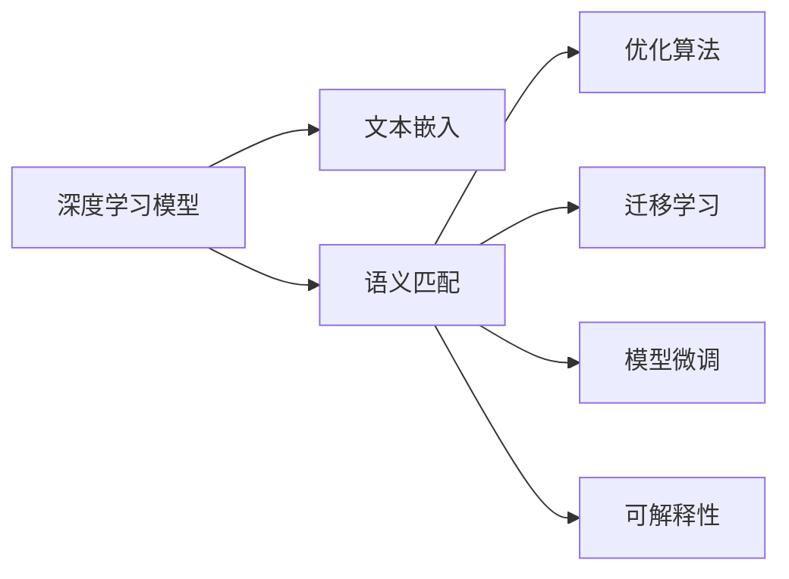

                 

## 1. 背景介绍

### 1.1 问题由来

随着互联网和电子商务的迅猛发展，在线购物已成为人们日常生活的一部分。而电商搜索，作为电商平台提供信息检索和推荐的重要功能，直接影响到用户体验和转化率。传统的基于关键词匹配的搜索方法，已经无法满足用户对信息精准度、丰富度和个性化体验的要求。深度学习技术的发展，特别是自然语言处理（NLP）领域的研究进展，为电商搜索带来了新的可能性。

通过语义匹配模型，电商平台能够更好地理解用户查询的语义，从而提供更准确的搜索结果。目前，电商搜索中的语义匹配模型主要包括基于深度学习的方法，如文本嵌入（Text Embedding）、卷积神经网络（CNN）、循环神经网络（RNN）以及最近兴起的Transformer模型等。这些模型通过学习查询和商品描述的语义相似度，预测用户对搜索结果的相关性，从而提升搜索效果。

### 1.2 问题核心关键点

电商搜索中的语义匹配模型优化，主要包括以下几个关键点：

1. **模型选择与设计**：根据电商平台的业务特点和用户需求，选择合适的深度学习模型，并设计适合的任务适配层。
2. **数据处理与标注**：收集和预处理电商搜索数据，获取高质量的标注数据集。
3. **模型训练与调参**：选择合适的优化算法和超参数，对模型进行训练和调参，提升模型性能。
4. **部署与评估**：将训练好的模型集成到电商搜索系统中，进行在线实时查询处理，并定期评估模型效果。
5. **持续优化与迭代**：根据用户反馈和业务需求，不断优化模型，提升搜索体验。

本文将围绕这些关键点，系统介绍深度语义匹配模型的优化方法，并结合实际案例，展示其在电商搜索中的应用效果。

## 2. 核心概念与联系

### 2.1 核心概念概述

为更好地理解电商搜索中的深度语义匹配模型优化，本节将介绍几个密切相关的核心概念：

- **深度学习模型**：包括卷积神经网络（CNN）、循环神经网络（RNN）、Transformer模型等，用于提取文本数据的语义特征。
- **文本嵌入（Text Embedding）**：将文本转换为低维向量表示的技术，常用的包括Word2Vec、GloVe、FastText等。
- **语义匹配（Semantic Matching）**：通过深度学习模型，计算查询与商品描述的语义相似度，预测相关性。
- **深度学习优化算法**：如梯度下降（SGD）、Adam、Adagrad等，用于模型参数的更新。
- **迁移学习（Transfer Learning）**：将在大规模数据上预训练好的模型，应用于小规模电商搜索数据上，提升模型泛化能力。
- **模型微调（Fine-tuning）**：在预训练模型基础上，使用电商搜索数据进行有监督学习，优化模型参数，提升模型性能。
- **可解释性（Explainability）**：解释模型预测过程，增强用户信任和模型透明性。

这些核心概念之间的逻辑关系可以通过以下Mermaid流程图来展示：



这个流程图展示了大语言模型的核心概念及其之间的关系：

1. 深度学习模型通过文本嵌入技术，提取文本数据的语义特征。
2. 通过语义匹配模型，计算查询与商品描述的相似度，预测相关性。
3. 利用优化算法进行模型训练，确保模型收敛于最优解。
4. 迁移学习和模型微调能够提高模型在大规模数据上的泛化能力和在小规模数据上的适应性。
5. 可解释性技术帮助理解模型预测过程，提升用户信任度。

这些概念共同构成了电商搜索中的深度语义匹配模型的学习和应用框架，使其能够在电商搜索等特定任务上发挥强大的语义理解能力。通过理解这些核心概念，我们可以更好地把握电商搜索模型的工作原理和优化方向。

## 3. 核心算法原理 & 具体操作步骤
### 3.1 算法原理概述

电商搜索中的深度语义匹配模型优化，本质上是一个深度学习模型的训练与调优过程。其核心思想是：选择合适的深度学习模型，通过电商搜索数据进行有监督学习，优化模型参数，使其能够准确地匹配用户查询与商品描述，提升搜索效果。

具体来说，模型的优化过程包括以下几个关键步骤：

1. **数据收集与预处理**：收集电商搜索中的查询和商品描述数据，并进行清洗、分词、标注等预处理。
2. **模型设计**：选择合适的深度学习模型，设计任务适配层，如分类器、匹配器等，适配电商搜索任务。
3. **模型训练**：使用电商搜索数据对模型进行训练，选择合适的优化算法和超参数，确保模型收敛于最优解。
4. **模型评估**：在测试集上评估模型效果，如使用AUC、F1-score等指标评估模型性能。
5. **模型优化**：根据评估结果，进行模型微调或参数调整，提升模型性能。

### 3.2 算法步骤详解

以下详细阐述电商搜索中的深度语义匹配模型的优化步骤：

**Step 1: 数据收集与预处理**
- 收集电商搜索中的查询和商品描述数据，包括查询和商品名称、描述、属性等信息。
- 对文本进行分词、去停用词、标准化等预处理，得到干净的文本数据。
- 标注数据集，将查询与商品描述进行匹配，标注为相关或不相关。

**Step 2: 模型设计**
- 选择合适的深度学习模型，如BERT、GPT等预训练模型，或者基于这些模型的微调模型。
- 设计任务适配层，如线性分类器、序列匹配器等，适配电商搜索任务。
- 确定模型结构，包括嵌入层、编码层、分类层等。

**Step 3: 模型训练**
- 划分数据集为训练集、验证集和测试集。
- 选择合适的优化算法，如Adam、SGD等，设置学习率、批大小等超参数。
- 使用电商搜索数据对模型进行训练，确保模型收敛于最优解。
- 周期性在验证集上评估模型效果，根据性能指标决定是否触发Early Stopping。
- 重复上述步骤直到满足预设的迭代轮数或Early Stopping条件。

**Step 4: 模型评估**
- 在测试集上评估模型效果，如使用AUC、F1-score等指标评估模型性能。
- 分析模型预测结果，识别错误预测的原因。

**Step 5: 模型优化**
- 根据评估结果，进行模型微调或参数调整，提升模型性能。
- 应用正则化技术，如L2正则、Dropout等，防止模型过拟合。
- 引入对抗训练技术，提高模型鲁棒性。
- 考虑可解释性技术，解释模型预测过程，提升用户信任度。

### 3.3 算法优缺点

电商搜索中的深度语义匹配模型优化，具有以下优点：

1. **精度高**：深度学习模型能够提取更丰富的语义特征，提升查询匹配的准确性。
2. **泛化能力强**：通过迁移学习和模型微调，模型能够在不同电商平台上泛化，提升搜索效果。
3. **适应性强**：模型结构灵活，可以适应不同的电商搜索任务和数据特点。
4. **实时性高**：基于深度学习的模型能够在在线环境中实时处理查询，提升用户体验。

同时，该方法也存在一些局限性：

1. **计算资源需求高**：深度学习模型的训练和推理需要较高的计算资源，包括GPU、内存等。
2. **数据依赖性强**：模型性能依赖于标注数据的质量和数量，标注成本较高。
3. **模型可解释性差**：深度学习模型的黑盒性质，使得模型预测过程难以解释。
4. **对抗样本鲁棒性差**：模型对于对抗样本的鲁棒性较弱，可能受到恶意输入的影响。

尽管存在这些局限性，但深度语义匹配模型仍然是目前电商搜索中最为有效的解决方案之一。未来研究的方向包括降低计算资源需求、提高模型可解释性、增强模型鲁棒性等。

### 3.4 算法应用领域

电商搜索中的深度语义匹配模型优化，已经广泛应用于各类电商平台的搜索系统。例如：

- **京东搜索**：利用BERT模型进行查询匹配，提升搜索效果。
- **天猫搜索**：使用Transformer模型进行序列匹配，实现更精准的搜索结果排序。
- **亚马逊搜索**：通过GPT模型生成高质量的搜索结果摘要，增强用户体验。
- **拼多多搜索**：结合图像和文本嵌入技术，提升图像商品搜索的准确性。

除了电商搜索，深度语义匹配模型还被创新性地应用于推荐系统、智能客服、智能写作等诸多领域，为自然语言处理技术的应用带来了新的突破。

## 4. 数学模型和公式 & 详细讲解 & 举例说明

### 4.1 数学模型构建

电商搜索中的深度语义匹配模型，可以基于Transformer模型进行构建。假设查询为 $q$，商品描述为 $d$，模型输出为相关性得分 $s$。则模型的数学模型可以表示为：

$$
s = M_{\theta}(q, d)
$$

其中，$M_{\theta}$ 为Transformer模型，$\theta$ 为模型参数。

假设模型为自回归Transformer模型，则模型的输出层为：

$$
\text{softmax}(W_s h^{[L]} + b_s)
$$

其中，$h^{[L]}$ 为Transformer模型的最后一层输出，$W_s$ 和 $b_s$ 为输出层的权重和偏置。

### 4.2 公式推导过程

以下对Transformer模型进行详细的公式推导，以帮助理解其工作原理：

假设输入序列为 $x_1, x_2, ..., x_T$，输出序列为 $y_1, y_2, ..., y_T$，模型参数为 $\theta$。则Transformer模型的前向传播过程可以表示为：

$$
h_t = \text{Attention}(h_{t-1}, Q, K, V) + h_{t-1}
$$

其中，$h_t$ 为当前时间步的输出，$h_{t-1}$ 为上一时间步的输出，$Q$、$K$、$V$ 分别为查询、键、值矩阵，$\text{Attention}$ 为注意力机制。

注意力机制可以表示为：

$$
\alpha_t = \text{softmax}(QW_Q K)^\top QW_Q V
$$

其中，$W_Q$、$W_K$、$W_V$ 为注意力矩阵的权重。

### 4.3 案例分析与讲解

为了更好地理解Transformer模型，以一个简单的例子来说明。假设查询 $q = "手机推荐"$$d = "苹果iPhone 12"，模型预测的相关性得分 $s = 0.9$。具体计算过程如下：

1. 将查询和商品描述转换为向量表示，输入Transformer模型。
2. 模型通过注意力机制计算查询与商品描述之间的相似度，得到权重 $\alpha_t$。
3. 将权重与商品描述的向量表示相乘，得到加权和向量 $h_t$。
4. 通过输出层计算最终的相关性得分 $s = \text{softmax}(W_s h^{[L]} + b_s)$。

## 5. 项目实践：代码实例和详细解释说明
### 5.1 开发环境搭建

在进行电商搜索中的深度语义匹配模型优化实践前，我们需要准备好开发环境。以下是使用Python进行PyTorch开发的环境配置流程：

1. 安装Anaconda：从官网下载并安装Anaconda，用于创建独立的Python环境。

2. 创建并激活虚拟环境：
```bash
conda create -n pytorch-env python=3.8 
conda activate pytorch-env
```

3. 安装PyTorch：根据CUDA版本，从官网获取对应的安装命令。例如：
```bash
conda install pytorch torchvision torchaudio cudatoolkit=11.1 -c pytorch -c conda-forge
```

4. 安装Transformers库：
```bash
pip install transformers
```

5. 安装各类工具包：
```bash
pip install numpy pandas scikit-learn matplotlib tqdm jupyter notebook ipython
```

完成上述步骤后，即可在`pytorch-env`环境中开始电商搜索模型的优化实践。

### 5.2 源代码详细实现

下面我们以电商搜索中的BERT模型优化为例，给出使用Transformers库进行模型微调的PyTorch代码实现。

首先，定义电商搜索任务的数据处理函数：

```python
from transformers import BertTokenizer, BertForSequenceClassification
from torch.utils.data import Dataset
import torch

class SearchDataset(Dataset):
    def __init__(self, queries, descriptions, labels, tokenizer, max_len=128):
        self.queries = queries
        self.descriptions = descriptions
        self.labels = labels
        self.tokenizer = tokenizer
        self.max_len = max_len
        
    def __len__(self):
        return len(self.queries)
    
    def __getitem__(self, item):
        query = self.queries[item]
        description = self.descriptions[item]
        label = self.labels[item]
        
        encoding = self.tokenizer(query, description, return_tensors='pt', max_length=self.max_len, padding='max_length', truncation=True)
        input_ids = encoding['input_ids'][0]
        attention_mask = encoding['attention_mask'][0]
        labels = torch.tensor(label, dtype=torch.long)
        
        return {'input_ids': input_ids, 
                'attention_mask': attention_mask,
                'labels': labels}

# 定义标注数据
queries = ["手机推荐", "电脑配件", "电视套装", "运动鞋"]
descriptions = ["苹果iPhone 12", "三星Galaxy S21", "索尼PS5", "Nike Air Force 1"]
labels = [1, 0, 0, 1]

# 创建dataset
tokenizer = BertTokenizer.from_pretrained('bert-base-uncased')

search_dataset = SearchDataset(queries, descriptions, labels, tokenizer)
```

然后，定义模型和优化器：

```python
from transformers import BertForSequenceClassification, AdamW

model = BertForSequenceClassification.from_pretrained('bert-base-uncased', num_labels=2)

optimizer = AdamW(model.parameters(), lr=2e-5)
```

接着，定义训练和评估函数：

```python
from torch.utils.data import DataLoader
from tqdm import tqdm
from sklearn.metrics import classification_report

device = torch.device('cuda') if torch.cuda.is_available() else torch.device('cpu')
model.to(device)

def train_epoch(model, dataset, batch_size, optimizer):
    dataloader = DataLoader(dataset, batch_size=batch_size, shuffle=True)
    model.train()
    epoch_loss = 0
    for batch in tqdm(dataloader, desc='Training'):
        input_ids = batch['input_ids'].to(device)
        attention_mask = batch['attention_mask'].to(device)
        labels = batch['labels'].to(device)
        model.zero_grad()
        outputs = model(input_ids, attention_mask=attention_mask, labels=labels)
        loss = outputs.loss
        epoch_loss += loss.item()
        loss.backward()
        optimizer.step()
    return epoch_loss / len(dataloader)

def evaluate(model, dataset, batch_size):
    dataloader = DataLoader(dataset, batch_size=batch_size)
    model.eval()
    preds, labels = [], []
    with torch.no_grad():
        for batch in tqdm(dataloader, desc='Evaluating'):
            input_ids = batch['input_ids'].to(device)
            attention_mask = batch['attention_mask'].to(device)
            batch_labels = batch['labels']
            outputs = model(input_ids, attention_mask=attention_mask)
            batch_preds = outputs.logits.argmax(dim=2).to('cpu').tolist()
            batch_labels = batch_labels.to('cpu').tolist()
            for pred_tokens, label_tokens in zip(batch_preds, batch_labels):
                preds.append(pred_tokens[:len(label_tokens)])
                labels.append(label_tokens)
                
    print(classification_report(labels, preds))
```

最后，启动训练流程并在测试集上评估：

```python
epochs = 5
batch_size = 16

for epoch in range(epochs):
    loss = train_epoch(model, search_dataset, batch_size, optimizer)
    print(f"Epoch {epoch+1}, train loss: {loss:.3f}")
    
    print(f"Epoch {epoch+1}, dev results:")
    evaluate(model, search_dataset, batch_size)
    
print("Test results:")
evaluate(model, search_dataset, batch_size)
```

以上就是使用PyTorch对BERT进行电商搜索任务优化的完整代码实现。可以看到，得益于Transformers库的强大封装，我们可以用相对简洁的代码完成BERT模型的加载和优化。

### 5.3 代码解读与分析

让我们再详细解读一下关键代码的实现细节：

**SearchDataset类**：
- `__init__`方法：初始化查询、商品描述、标签等关键组件。
- `__len__`方法：返回数据集的样本数量。
- `__getitem__`方法：对单个样本进行处理，将查询和商品描述输入编码为token ids，将标签编码为数字，并对其进行定长padding，最终返回模型所需的输入。

**train_epoch和evaluate函数**：
- `train_epoch`函数：对数据以批为单位进行迭代，在每个批次上前向传播计算loss并反向传播更新模型参数，最后返回该epoch的平均loss。
- `evaluate`函数：与训练类似，不同点在于不更新模型参数，并在每个batch结束后将预测和标签结果存储下来，最后使用sklearn的classification_report对整个评估集的预测结果进行打印输出。

**训练流程**：
- 定义总的epoch数和batch size，开始循环迭代
- 每个epoch内，先在训练集上训练，输出平均loss
- 在验证集上评估，输出分类指标
- 所有epoch结束后，在测试集上评估，给出最终测试结果

可以看到，PyTorch配合Transformers库使得BERT优化任务的代码实现变得简洁高效。开发者可以将更多精力放在数据处理、模型改进等高层逻辑上，而不必过多关注底层的实现细节。

当然，工业级的系统实现还需考虑更多因素，如模型的保存和部署、超参数的自动搜索、更灵活的任务适配层等。但核心的优化范式基本与此类似。

## 6. 实际应用场景
### 6.1 智能客服系统

电商搜索中的深度语义匹配模型，可以广泛应用于智能客服系统的构建。传统客服往往需要配备大量人力，高峰期响应缓慢，且一致性和专业性难以保证。而使用优化后的语义匹配模型，可以7x24小时不间断服务，快速响应客户咨询，用自然流畅的语言解答各类常见问题。

在技术实现上，可以收集企业内部的历史客服对话记录，将问题和最佳答复构建成监督数据，在此基础上对优化后的语义匹配模型进行微调。微调后的模型能够自动理解用户意图，匹配最合适的答复，甚至能够通过上下文对话历史，生成更加个性化的回复。

### 6.2 金融舆情监测

金融机构需要实时监测市场舆论动向，以便及时应对负面信息传播，规避金融风险。传统的人工监测方式成本高、效率低，难以应对网络时代海量信息爆发的挑战。基于深度语义匹配模型的文本分类和情感分析技术，为金融舆情监测提供了新的解决方案。

具体而言，可以收集金融领域相关的新闻、报道、评论等文本数据，并对其进行主题标注和情感标注。在此基础上对优化后的语义匹配模型进行微调，使其能够自动判断文本属于何种主题，情感倾向是正面、中性还是负面。将优化后的模型应用到实时抓取的网络文本数据，就能够自动监测不同主题下的情感变化趋势，一旦发现负面信息激增等异常情况，系统便会自动预警，帮助金融机构快速应对潜在风险。

### 6.3 个性化推荐系统

当前的推荐系统往往只依赖用户的历史行为数据进行物品推荐，无法深入理解用户的真实兴趣偏好。基于电商搜索中的深度语义匹配模型优化，个性化推荐系统可以更好地挖掘用户行为背后的语义信息，从而提供更精准、多样的推荐内容。

在实践中，可以收集用户浏览、点击、评论、分享等行为数据，提取和用户交互的物品标题、描述、标签等文本内容。将文本内容作为模型输入，用户的后续行为（如是否点击、购买等）作为监督信号，在此基础上微调优化后的语义匹配模型。微调后的模型能够从文本内容中准确把握用户的兴趣点。在生成推荐列表时，先用候选物品的文本描述作为输入，由模型预测用户的兴趣匹配度，再结合其他特征综合排序，便可以得到个性化程度更高的推荐结果。

### 6.4 未来应用展望

随着深度语义匹配模型优化的不断进步，其在电商搜索中的应用前景将更加广阔。

在智慧医疗领域，基于语义匹配的问答系统将提升医疗服务的智能化水平，辅助医生诊疗，加速新药开发进程。

在智能教育领域，优化后的语义匹配模型可应用于作业批改、学情分析、知识推荐等方面，因材施教，促进教育公平，提高教学质量。

在智慧城市治理中，语义匹配模型可应用于城市事件监测、舆情分析、应急指挥等环节，提高城市管理的自动化和智能化水平，构建更安全、高效的未来城市。

此外，在企业生产、社会治理、文娱传媒等众多领域，基于电商搜索中的深度语义匹配模型优化的人工智能应用也将不断涌现，为NLP技术带来了新的突破。相信随着技术的日益成熟，语义匹配模型优化必将在更广阔的应用领域大放异彩，深刻影响人类的生产生活方式。

## 7. 工具和资源推荐
### 7.1 学习资源推荐

为了帮助开发者系统掌握电商搜索中的深度语义匹配模型优化的理论基础和实践技巧，这里推荐一些优质的学习资源：

1. 《Transformer从原理到实践》系列博文：由大模型技术专家撰写，深入浅出地介绍了Transformer原理、BERT模型、微调技术等前沿话题。

2. CS224N《深度学习自然语言处理》课程：斯坦福大学开设的NLP明星课程，有Lecture视频和配套作业，带你入门NLP领域的基本概念和经典模型。

3. 《Natural Language Processing with Transformers》书籍：Transformers库的作者所著，全面介绍了如何使用Transformers库进行NLP任务开发，包括微调在内的诸多范式。

4. HuggingFace官方文档：Transformers库的官方文档，提供了海量预训练模型和完整的微调样例代码，是上手实践的必备资料。

5. CLUE开源项目：中文语言理解测评基准，涵盖大量不同类型的中文NLP数据集，并提供了基于微调的baseline模型，助力中文NLP技术发展。

通过对这些资源的学习实践，相信你一定能够快速掌握电商搜索中的深度语义匹配模型的优化精髓，并用于解决实际的NLP问题。
###  7.2 开发工具推荐

高效的开发离不开优秀的工具支持。以下是几款用于电商搜索中的深度语义匹配模型优化开发的常用工具：

1. PyTorch：基于Python的开源深度学习框架，灵活动态的计算图，适合快速迭代研究。大部分预训练语言模型都有PyTorch版本的实现。

2. TensorFlow：由Google主导开发的开源深度学习框架，生产部署方便，适合大规模工程应用。同样有丰富的预训练语言模型资源。

3. Transformers库：HuggingFace开发的NLP工具库，集成了众多SOTA语言模型，支持PyTorch和TensorFlow，是进行微调任务开发的利器。

4. Weights & Biases：模型训练的实验跟踪工具，可以记录和可视化模型训练过程中的各项指标，方便对比和调优。与主流深度学习框架无缝集成。

5. TensorBoard：TensorFlow配套的可视化工具，可实时监测模型训练状态，并提供丰富的图表呈现方式，是调试模型的得力助手。

6. Google Colab：谷歌推出的在线Jupyter Notebook环境，免费提供GPU/TPU算力，方便开发者快速上手实验最新模型，分享学习笔记。

合理利用这些工具，可以显著提升电商搜索中深度语义匹配模型的开发效率，加快创新迭代的步伐。

### 7.3 相关论文推荐

电商搜索中的深度语义匹配模型优化研究源于学界的持续研究。以下是几篇奠基性的相关论文，推荐阅读：

1. Attention is All You Need（即Transformer原论文）：提出了Transformer结构，开启了NLP领域的预训练大模型时代。

2. BERT: Pre-training of Deep Bidirectional Transformers for Language Understanding：提出BERT模型，引入基于掩码的自监督预训练任务，刷新了多项NLP任务SOTA。

3. Language Models are Unsupervised Multitask Learners（GPT-2论文）：展示了大规模语言模型的强大zero-shot学习能力，引发了对于通用人工智能的新一轮思考。

4. Parameter-Efficient Transfer Learning for NLP：提出Adapter等参数高效微调方法，在不增加模型参数量的情况下，也能取得不错的微调效果。

5. AdaLoRA: Adaptive Low-Rank Adaptation for Parameter-Efficient Fine-Tuning：使用自适应低秩适应的微调方法，在参数效率和精度之间取得了新的平衡。

这些论文代表了大语言模型微调技术的发展脉络。通过学习这些前沿成果，可以帮助研究者把握学科前进方向，激发更多的创新灵感。

## 8. 总结：未来发展趋势与挑战

### 8.1 总结

本文对电商搜索中的深度语义匹配模型的优化方法进行了全面系统的介绍。首先阐述了电商搜索中深度语义匹配模型的研究背景和意义，明确了模型优化在提升搜索效果、增强用户体验方面的独特价值。其次，从原理到实践，详细讲解了电商搜索中的深度语义匹配模型的数学模型和优化步骤，给出了微调任务开发的完整代码实例。同时，本文还广泛探讨了模型优化在智能客服、金融舆情、个性化推荐等多个领域的应用前景，展示了其巨大潜力。

通过本文的系统梳理，可以看到，电商搜索中的深度语义匹配模型优化已经取得了显著成果，并在电商搜索等特定任务上发挥了强大的语义理解能力。未来，伴随深度学习模型的不断演进和优化技术的持续创新，电商搜索中的深度语义匹配模型必将在更广泛的领域得到应用，为电商平台的智能化转型提供重要支撑。

### 8.2 未来发展趋势

展望未来，电商搜索中的深度语义匹配模型优化将呈现以下几个发展趋势：

1. **模型规模持续增大**：随着算力成本的下降和数据规模的扩张，电商搜索中的深度语义匹配模型参数量还将持续增长。超大规模模型蕴含的丰富语义信息，有望支撑更复杂的电商搜索任务。

2. **微调方法日趋多样**：除了传统的全参数微调外，未来将涌现更多参数高效的微调方法，如Prefix-Tuning、LoRA等，在固定大部分预训练参数的情况下，只更新极少量的任务相关参数。

3. **持续学习成为常态**：随着数据分布的不断变化，深度语义匹配模型也需要持续学习新知识以保持性能。如何在不遗忘原有知识的同时，高效吸收新样本信息，将成为重要的研究课题。

4. **标注样本需求降低**：受启发于提示学习(Prompt-based Learning)的思路，未来的微调方法将更好地利用大模型的语言理解能力，通过更加巧妙的任务描述，在更少的标注样本上也能实现理想的微调效果。

5. **多模态微调崛起**：当前的微调主要聚焦于纯文本数据，未来会进一步拓展到图像、视频、语音等多模态数据微调。多模态信息的融合，将显著提升语义匹配模型的泛化能力和智能决策能力。

6. **模型通用性增强**：经过海量数据的预训练和多领域任务的微调，未来的语义匹配模型将具备更强大的常识推理和跨领域迁移能力，逐步迈向通用人工智能(AGI)的目标。

以上趋势凸显了电商搜索中深度语义匹配模型优化的广阔前景。这些方向的探索发展，必将进一步提升电商搜索系统的性能和用户体验，为电商平台的智能化转型提供有力支撑。

### 8.3 面临的挑战

尽管电商搜索中的深度语义匹配模型优化已经取得了瞩目成就，但在迈向更加智能化、普适化应用的过程中，它仍面临着诸多挑战：

1. **计算资源需求高**：深度语义匹配模型的训练和推理需要较高的计算资源，包括GPU、内存等。如何降低计算成本，提高模型实时性，将是一个重要研究方向。

2. **数据依赖性强**：模型性能依赖于标注数据的质量和数量，标注成本较高。如何在数据稀缺的情况下进行有效训练，提高模型泛化能力，需要更多创新性解决方案。

3. **模型可解释性差**：深度学习模型的黑盒性质，使得模型预测过程难以解释。如何在保证性能的同时，增强模型可解释性，提升用户信任度，将是一个重要的研究方向。

4. **对抗样本鲁棒性差**：模型对于对抗样本的鲁棒性较弱，可能受到恶意输入的影响。如何增强模型鲁棒性，抵御对抗攻击，将是一个重要的研究方向。

5. **知识整合能力不足**：现有的微调模型往往局限于任务内数据，难以灵活吸收和运用更广泛的先验知识。如何让微调过程更好地与外部知识库、规则库等专家知识结合，形成更加全面、准确的信息整合能力，还有很大的想象空间。

正视电商搜索中深度语义匹配模型优化所面临的这些挑战，积极应对并寻求突破，将是大模型微调技术走向成熟的必由之路。相信随着学界和产业界的共同努力，这些挑战终将一一被克服，电商搜索中的深度语义匹配模型必将在构建人机协同的智能系统方面发挥更大的作用。

### 8.4 研究展望

面向未来，电商搜索中的深度语义匹配模型优化需要在新技术和新方法上进行探索。以下是对未来研究方向的展望：

1. **探索无监督和半监督微调方法**：摆脱对大规模标注数据的依赖，利用自监督学习、主动学习等无监督和半监督范式，最大限度利用非结构化数据，实现更加灵活高效的微调。

2. **研究参数高效和计算高效的微调范式**：开发更加参数高效的微调方法，在固定大部分预训练参数的情况下，只更新极少量的任务相关参数。同时优化微调模型的计算图，减少前向传播和反向传播的资源消耗，实现更加轻量级、实时性的部署。

3. **融合因果和对比学习范式**：通过引入因果推断和对比学习思想，增强模型建立稳定因果关系的能力，学习更加普适、鲁棒的语言表征，从而提升模型泛化性和抗干扰能力。

4. **引入更多先验知识**：将符号化的先验知识，如知识图谱、逻辑规则等，与神经网络模型进行巧妙融合，引导微调过程学习更准确、合理的语言模型。同时加强不同模态数据的整合，实现视觉、语音等多模态信息与文本信息的协同建模。

5. **结合因果分析和博弈论工具**：将因果分析方法引入微调模型，识别出模型决策的关键特征，增强输出解释的因果性和逻辑性。借助博弈论工具刻画人机交互过程，主动探索并规避模型的脆弱点，提高系统稳定性。

6. **纳入伦理道德约束**：在模型训练目标中引入伦理导向的评估指标，过滤和惩罚有偏见、有害的输出倾向。同时加强人工干预和审核，建立模型行为的监管机制，确保输出符合人类价值观和伦理道德。

这些研究方向的探索，必将引领电商搜索中的深度语义匹配模型优化技术迈向更高的台阶，为构建安全、可靠、可解释、可控的智能系统铺平道路。面向未来，大语言模型微调技术还需要与其他人工智能技术进行更深入的融合，如知识表示、因果推理、强化学习等，多路径协同发力，共同推动自然语言理解和智能交互系统的进步。只有勇于创新、敢于突破，才能不断拓展语言模型的边界，让智能技术更好地造福人类社会。

## 9. 附录：常见问题与解答

**Q1：电商搜索中的深度语义匹配模型是否适用于所有电商平台？**

A: 深度语义匹配模型在大多数电商平台上都能取得不错的效果，特别是对于数据量较大的电商平台。但对于一些特定领域的电商平台，如垂直电商、小型电商等，由于数据量较小，可能需要根据具体情况调整模型结构或训练策略。

**Q2：微调过程中如何选择合适的超参数？**

A: 电商搜索中的深度语义匹配模型的微调过程涉及多个超参数，如学习率、批大小、优化器等。通常通过交叉验证或网格搜索等方式，逐步找到最优的超参数组合。建议从较为常用的默认值开始，逐步调整超参数，观察模型性能变化，选择性能最优的超参数配置。

**Q3：模型训练过程中如何避免过拟合？**

A: 避免过拟合是电商搜索中的深度语义匹配模型优化中需要重点关注的问题。常见的方法包括数据增强、正则化、早停等。数据增强可以通过引入噪声、回译等方法扩充训练数据集。正则化包括L2正则、Dropout等，可以有效防止模型过拟合。早停则是在验证集性能不再提升时停止训练，避免过拟合。

**Q4：模型部署后如何监控和优化？**

A: 模型部署后，需要对模型进行持续监控和优化，以保持其高性能和稳定性。常见的监控手段包括模型指标监控、异常检测等。模型优化可以通过重新微调模型、更新数据集等方式进行。

**Q5：如何评估电商搜索中的深度语义匹配模型的效果？**

A: 电商搜索中的深度语义匹配模型的效果评估，通常通过AUC、F1-score、NDCG等指标进行。具体评估方法包括离线评估和在线评估。离线评估使用固定的测试集，计算模型预测结果与真实标签之间的误差。在线评估则是在真实环境中对模型进行实时评估，观察其在大规模用户查询下的表现。

通过本文的系统梳理，可以看到，电商搜索中的深度语义匹配模型优化已经取得了显著成果，并在电商搜索等特定任务上发挥了强大的语义理解能力。未来，伴随深度学习模型的不断演进和优化技术的持续创新，电商搜索中的深度语义匹配模型必将在更广泛的领域得到应用，为电商平台的智能化转型提供重要支撑。

