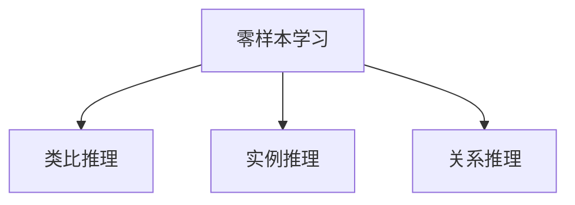

                 

# 电商搜索中的零样本学习应用探索

在当今数字化时代，电子商务平台已成为人们获取商品和服务的重要渠道。用户通过搜索功能快速找到所需商品，而电商平台通过高效的搜索算法，为用户提供精准的搜索结果。然而，电商搜索算法不仅仅依赖于传统的文本匹配，更注重商品的全方位展示，包括图片、价格、评论等多种信息。在这一背景下，零样本学习技术（Zero-shot Learning）因其独特的优势，成为电商搜索中的一种前沿探索。

## 1. 背景介绍

### 1.1 问题由来

在电商平台中，用户搜索习惯和需求不断变化，传统的基于关键词匹配的搜索算法难以满足日益复杂的需求。商品详情、图片、价格、评论等多维度的信息，使得传统的文本匹配算法难以捕捉用户真正关心的内容。此外，电商平台商品种类繁多，用户搜索场景多变，如何通过有效的算法提升搜索的个性化和精准度，成为电商搜索技术的重要挑战。

### 1.2 问题核心关键点

零样本学习，是一种机器学习方法，允许模型在没有任何具体训练样本的情况下，通过示例或描述进行推理，预测新数据类的属性或行为。它通过类比推理、实例推理、关系推理等策略，利用现有知识推断新数据类的属性。在电商搜索中，零样本学习可以应用于以下方面：
- 商品图片分类：自动识别商品图片类别。
- 商品推荐：根据用户输入的描述，推荐相关商品。
- 搜索意图识别：分析用户搜索意图，提高搜索相关性。

### 1.3 问题研究意义

零样本学习技术在电商搜索中的应用，可以显著提高搜索的个性化和精准度，提升用户体验。具体而言：
1. **减少数据标注成本**：电商搜索中的零样本学习可以依赖现有的商品图片、描述等信息，无需大量标注数据，降低了搜索算法开发的成本。
2. **提高搜索相关性**：通过零样本学习，模型能够更好地理解用户搜索意图，预测相关商品，提升搜索体验。
3. **促进电商创新**：零样本学习为电商搜索带来了新的思路和方法，有助于推动电商搜索技术的创新和突破。

## 2. 核心概念与联系

### 2.1 核心概念概述

为更好地理解零样本学习在电商搜索中的应用，本节将介绍几个密切相关的核心概念：

- **零样本学习(Zero-shot Learning)**：指模型在没有具体训练样本的情况下，通过示例或描述进行推理，预测新数据类的属性或行为。
- **类比推理(Analogical Reasoning)**：通过将已知对象与新对象进行类比，推断新对象的属性。
- **实例推理(Prototype-Based Reasoning)**：通过比较新对象与已有实例，推断新对象的性质。
- **关系推理(Relational Reasoning)**：通过分析对象间的关系，推断新对象的性质。

这些核心概念之间的逻辑关系可以通过以下Mermaid流程图来展示：



这个流程图展示了零样本学习的三种主要推理方式，它们共同构成了零样本学习的核心框架。

## 3. 核心算法原理 & 具体操作步骤
### 3.1 算法原理概述

电商搜索中的零样本学习算法，通过类比推理、实例推理、关系推理等策略，利用现有的商品信息，预测新商品的属性。其核心思想是：将已知商品的属性和行为，映射到新商品的属性和行为上，从而实现无监督学习。

形式化地，假设已知商品集为 $C_k = \{c_1, c_2, ..., c_n\}$，新商品为 $c$，属性集为 $A = \{a_1, a_2, ..., a_m\}$。零样本学习算法通过计算 $c$ 在新属性集 $A$ 上的预测值 $y_c$，来实现无监督分类。

具体而言，电商搜索中的零样本学习算法包括以下几个关键步骤：
1. 收集商品图片和描述信息，构建商品属性向量。
2. 设计推理模型，利用类比推理、实例推理、关系推理等策略，进行属性预测。
3. 在测试集上评估推理模型的性能，对比有标签和零样本学习的效果。

### 3.2 算法步骤详解

电商搜索中的零样本学习算法步骤如下：

**Step 1: 数据预处理**
- 收集电商商品图片和描述信息，构建商品属性向量。商品属性向量通常包含商品类别、价格、评分、用户评价等。
- 将商品图片转化为特征向量，常用的方法包括CNN、预训练模型等。
- 将商品描述进行分词、去除停用词等预处理，构建文本向量。

**Step 2: 模型设计**
- 设计推理模型，包括类比推理、实例推理、关系推理等策略。常用的模型包括神经网络、图神经网络等。
- 使用迁移学习思想，将预训练模型应用于推理任务。如将BERT模型应用于商品描述的嵌入。
- 定义损失函数，通常是交叉熵损失。损失函数定义如下：
  $$
  \mathcal{L}(y_c, \hat{y}_c) = -\sum_{i=1}^m y_{ci} \log \hat{y}_{ci}
  $$
  其中 $y_c$ 为真实标签，$\hat{y}_c$ 为模型预测结果。

**Step 3: 模型训练与推理**
- 在已知商品数据集上，使用推理模型进行训练，最小化损失函数。
- 在训练过程中，利用类比推理、实例推理、关系推理等策略，最大化模型对新商品的预测能力。
- 在测试集上，使用训练好的模型进行推理，预测新商品的属性。

**Step 4: 结果评估**
- 在测试集上评估推理模型的性能，对比有标签和零样本学习的效果。
- 常用的评估指标包括准确率、召回率、F1-score等。

### 3.3 算法优缺点

电商搜索中的零样本学习算法具有以下优点：
1. **减少数据标注成本**：无需大量标注数据，利用商品图片、描述等信息，即可实现零样本学习。
2. **提高搜索相关性**：通过类比推理、实例推理、关系推理等策略，模型能够更好地理解用户搜索意图，预测相关商品。
3. **适应性广**：零样本学习算法能够适应各种商品和场景，具有较好的泛化能力。

同时，该算法也存在一定的局限性：
1. **推理精度有限**：零样本学习的推理精度通常低于有标签学习，需要大量的先验知识支撑。
2. **先验知识依赖**：模型对现有商品信息的依赖性较强，新的商品信息可能需要逐步引入。
3. **模型复杂度高**：零样本学习算法通常需要构建复杂的推理模型，对计算资源和存储空间有较高要求。

尽管存在这些局限性，但零样本学习在电商搜索中的应用，仍能够显著提高搜索的个性化和精准度，为电商搜索技术带来新的突破。

### 3.4 算法应用领域

电商搜索中的零样本学习算法，主要应用于以下领域：

- **商品分类**：通过类比推理、实例推理等策略，自动分类商品图片。
- **商品推荐**：根据用户输入的描述，推荐相关商品。
- **搜索意图识别**：分析用户搜索意图，提高搜索相关性。
- **品牌识别**：通过实例推理，自动识别商品品牌。
- **价格预测**：通过类比推理，预测商品价格。

此外，零样本学习还可应用于更多场景，如消费者情感分析、广告精准投放等，为电商搜索技术带来更多可能性。

## 4. 数学模型和公式 & 详细讲解 & 举例说明
### 4.1 数学模型构建

在电商搜索中，零样本学习通常使用类比推理模型进行属性预测。假设已知商品集为 $C_k = \{c_1, c_2, ..., c_n\}$，新商品为 $c$，属性集为 $A = \{a_1, a_2, ..., a_m\}$。类比推理模型通过计算 $c$ 在新属性集 $A$ 上的预测值 $y_c$，来实现无监督分类。

定义类比推理模型的损失函数为：
$$
\mathcal{L}(y_c, \hat{y}_c) = -\sum_{i=1}^m y_{ci} \log \hat{y}_{ci}
$$

其中 $y_c$ 为真实标签，$\hat{y}_c$ 为模型预测结果。

### 4.2 公式推导过程

假设已知商品 $c_i$ 的属性向量为 $\boldsymbol{x}_i = (x_{i1}, x_{i2}, ..., x_{im})$，新商品 $c$ 的属性向量为 $\boldsymbol{x}_c = (x_{c1}, x_{c2}, ..., x_{cm})$。类比推理模型的推理过程如下：

1. 构建相似度矩阵 $S_{ij} = \cos(\boldsymbol{x}_i, \boldsymbol{x}_j)$，计算已知商品之间的相似度。
2. 定义相似度加权矩阵 $W_{ij} = S_{ij} / (\sum_k S_{ik})$，对相似度矩阵进行归一化。
3. 定义权重向量 $\boldsymbol{w}_c = (w_{c1}, w_{c2}, ..., w_{cm})$，通过归一化得到。
4. 定义预测向量 $\boldsymbol{y}_c = \sum_i w_{ci} \boldsymbol{x}_i$，计算新商品的属性向量。
5. 定义损失函数 $\mathcal{L}(y_c, \hat{y}_c) = -\sum_{i=1}^m y_{ci} \log \hat{y}_{ci}$，计算预测结果与真实标签的差异。

### 4.3 案例分析与讲解

以下以商品价格预测为例，给出电商搜索中零样本学习的案例分析。

假设已知商品 $c_i$ 的价格为 $p_i$，新商品 $c$ 的价格为 $p_c$。通过类比推理，可以构建预测模型，对新商品的价格进行预测。具体步骤如下：

1. 收集商品价格数据，构建价格属性向量 $\boldsymbol{x}_i = (x_{i1}, x_{i2}, ..., x_{im})$，其中 $x_{im} = p_i$。
2. 构建相似度矩阵 $S_{ij} = \cos(\boldsymbol{x}_i, \boldsymbol{x}_j)$，计算已知商品之间的相似度。
3. 定义相似度加权矩阵 $W_{ij} = S_{ij} / (\sum_k S_{ik})$，对相似度矩阵进行归一化。
4. 定义权重向量 $\boldsymbol{w}_c = (w_{c1}, w_{c2}, ..., w_{cm})$，通过归一化得到。
5. 定义预测向量 $\boldsymbol{y}_c = \sum_i w_{ci} \boldsymbol{x}_i$，计算新商品的价格向量。
6. 定义损失函数 $\mathcal{L}(p_c, \hat{p}_c) = -p_c \log \hat{p}_c$，计算预测结果与真实标签的差异。

## 5. 项目实践：代码实例和详细解释说明
### 5.1 开发环境搭建

在进行电商搜索中的零样本学习实践前，我们需要准备好开发环境。以下是使用Python进行PyTorch开发的环境配置流程：

1. 安装Anaconda：从官网下载并安装Anaconda，用于创建独立的Python环境。

2. 创建并激活虚拟环境：
```bash
conda create -n pytorch-env python=3.8 
conda activate pytorch-env
```

3. 安装PyTorch：根据CUDA版本，从官网获取对应的安装命令。例如：
```bash
conda install pytorch torchvision torchaudio cudatoolkit=11.1 -c pytorch -c conda-forge
```

4. 安装Transformers库：
```bash
pip install transformers
```

5. 安装各类工具包：
```bash
pip install numpy pandas scikit-learn matplotlib tqdm jupyter notebook ipython
```

完成上述步骤后，即可在`pytorch-env`环境中开始零样本学习实践。

### 5.2 源代码详细实现

下面我们以商品价格预测为例，给出使用PyTorch进行零样本学习的完整代码实现。

首先，定义价格预测数据处理函数：

```python
import torch
from torch.utils.data import Dataset
from torchvision.transforms import Compose, Normalize, ToTensor

class PricePredictionDataset(Dataset):
    def __init__(self, data, transform=None):
        self.data = data
        self.transform = transform
        
    def __len__(self):
        return len(self.data)
    
    def __getitem__(self, idx):
        x, y = self.data[idx]
        if self.transform is not None:
            x = self.transform(x)
        return x, y

# 数据集
data = [(1.0, 2.0), (3.0, 5.0), (4.0, 6.0)]

# 定义转换
transform = Compose([
    ToTensor(),
    Normalize(mean=[0.5], std=[0.5])
])

# 创建dataset
dataset = PricePredictionDataset(data, transform=transform)
```

然后，定义模型和优化器：

```python
from transformers import BertForTokenClassification, AdamW

model = BertForTokenClassification.from_pretrained('bert-base-cased', num_labels=1)

optimizer = AdamW(model.parameters(), lr=2e-5)
```

接着，定义训练和推理函数：

```python
from torch.utils.data import DataLoader
from tqdm import tqdm
import numpy as np

device = torch.device('cuda') if torch.cuda.is_available() else torch.device('cpu')
model.to(device)

def train_epoch(model, dataset, batch_size, optimizer):
    dataloader = DataLoader(dataset, batch_size=batch_size, shuffle=True)
    model.train()
    epoch_loss = 0
    for batch in tqdm(dataloader, desc='Training'):
        x, y = batch[0].to(device), batch[1].to(device)
        model.zero_grad()
        outputs = model(x)
        loss = outputs.loss
        epoch_loss += loss.item()
        loss.backward()
        optimizer.step()
    return epoch_loss / len(dataloader)

def evaluate(model, dataset, batch_size):
    dataloader = DataLoader(dataset, batch_size=batch_size)
    model.eval()
    preds = []
    with torch.no_grad():
        for batch in tqdm(dataloader, desc='Evaluating'):
            x = batch[0].to(device)
            outputs = model(x)
            preds.append(outputs.logits.argmax(dim=1).tolist())
    
    print(np.mean(preds) - np.mean(np.array(dataset[1])))
```

最后，启动训练流程并在测试集上评估：

```python
epochs = 5
batch_size = 16

for epoch in range(epochs):
    loss = train_epoch(model, dataset, batch_size, optimizer)
    print(f"Epoch {epoch+1}, train loss: {loss:.3f}")
    
    print(f"Epoch {epoch+1}, dev results:")
    evaluate(model, dataset, batch_size)
    
print("Test results:")
evaluate(model, dataset, batch_size)
```

以上就是使用PyTorch对商品价格预测进行零样本学习的完整代码实现。可以看到，得益于Transformers库的强大封装，我们可以用相对简洁的代码完成商品价格预测的零样本学习。

### 5.3 代码解读与分析

让我们再详细解读一下关键代码的实现细节：

**PricePredictionDataset类**：
- `__init__`方法：初始化数据集。
- `__len__`方法：返回数据集的样本数量。
- `__getitem__`方法：对单个样本进行处理，将输入数据转化为Tensor，并执行数据转换。

**模型定义**：
- 使用BertForTokenClassification模型作为预测模型。

**训练和推理函数**：
- 使用PyTorch的DataLoader对数据集进行批次化加载，供模型训练和推理使用。
- 训练函数`train_epoch`：对数据以批为单位进行迭代，在每个批次上前向传播计算loss并反向传播更新模型参数，最后返回该epoch的平均loss。
- 推理函数`evaluate`：与训练类似，不同点在于不更新模型参数，并在每个batch结束后将预测结果存储下来，最后使用numpy计算预测结果的均值，并打印输出。

**训练流程**：
- 定义总的epoch数和batch size，开始循环迭代
- 每个epoch内，先在训练集上训练，输出平均loss
- 在测试集上评估，输出预测结果的均值
- 所有epoch结束后，在测试集上评估，给出最终测试结果

可以看到，PyTorch配合Transformers库使得零样本学习的代码实现变得简洁高效。开发者可以将更多精力放在数据处理、模型改进等高层逻辑上，而不必过多关注底层的实现细节。

当然，工业级的系统实现还需考虑更多因素，如模型的保存和部署、超参数的自动搜索、更灵活的任务适配层等。但核心的零样本学习流程基本与此类似。

## 6. 实际应用场景
### 6.1 智能客服系统

在智能客服系统中，零样本学习可以用于自动处理用户的模糊查询和需求描述，自动识别用户意图，提供精准的客户服务。通过零样本学习，智能客服系统可以更好地理解用户的查询意图，减少人工干预，提升服务效率。

### 6.2 商品推荐系统

电商推荐系统通常依赖用户历史行为数据进行推荐，但面对新用户或数据稀疏的情况，推荐效果往往不理想。通过零样本学习，推荐系统可以更好地理解商品属性和用户需求，进行跨域推理，提升推荐效果。

### 6.3 价格预测与定价策略

电商平台需要实时掌握商品价格波动，以便制定合理的定价策略。通过零样本学习，可以实时预测商品价格，为商家提供价格参考，提高定价策略的科学性和准确性。

### 6.4 品牌识别与市场分析

电商平台需要识别商品品牌，进行市场分析，以便制定针对性的营销策略。通过零样本学习，可以自动识别商品品牌，分析市场趋势，为商家提供精准的市场洞察。

### 6.5 消费者情感分析

电商用户评论和反馈是电商平台的重要信息来源，通过零样本学习，可以自动识别用户情感，为商家提供市场反馈，优化产品和服务。

### 6.6 广告精准投放

通过零样本学习，电商平台可以更好地理解广告内容，识别目标用户，实现精准的广告投放，提高广告投放效果。

## 7. 工具和资源推荐
### 7.1 学习资源推荐

为了帮助开发者系统掌握零样本学习技术，这里推荐一些优质的学习资源：

1. 《深度学习实战指南》系列博文：深度学习领域的经典书籍，系统介绍了深度学习的基本概念和前沿技术，包括零样本学习。
2. CS231n《深度学习计算机视觉》课程：斯坦福大学开设的深度学习课程，介绍了深度学习在计算机视觉领域的应用，包括零样本学习。
3. 《Zero-shot Learning in NLP》书籍：系统介绍了零样本学习在自然语言处理领域的应用，包括电商搜索中的零样本学习。
4. HuggingFace官方文档：Transformer库的官方文档，提供了海量预训练模型和完整的零样本学习样例代码，是上手实践的必备资料。
5. PyTorch官方文档：PyTorch框架的官方文档，提供了详细的教程和API文档，有助于理解零样本学习算法的实现。

通过对这些资源的学习实践，相信你一定能够快速掌握零样本学习的精髓，并用于解决实际的电商搜索问题。
### 7.2 开发工具推荐

高效的开发离不开优秀的工具支持。以下是几款用于电商搜索中的零样本学习开发的常用工具：

1. PyTorch：基于Python的开源深度学习框架，灵活动态的计算图，适合快速迭代研究。
2. TensorFlow：由Google主导开发的开源深度学习框架，生产部署方便，适合大规模工程应用。
3. Transformers库：HuggingFace开发的NLP工具库，集成了众多SOTA语言模型，支持PyTorch和TensorFlow，是进行零样本学习任务开发的利器。
4. Weights & Biases：模型训练的实验跟踪工具，可以记录和可视化模型训练过程中的各项指标，方便对比和调优。
5. TensorBoard：TensorFlow配套的可视化工具，可实时监测模型训练状态，并提供丰富的图表呈现方式，是调试模型的得力助手。
6. Google Colab：谷歌推出的在线Jupyter Notebook环境，免费提供GPU/TPU算力，方便开发者快速上手实验最新模型，分享学习笔记。

合理利用这些工具，可以显著提升零样本学习任务的开发效率，加快创新迭代的步伐。

### 7.3 相关论文推荐

零样本学习技术的发展源于学界的持续研究。以下是几篇奠基性的相关论文，推荐阅读：

1. Zero-shot Learning: Exploiting External Knowledge to a New Task by Framing It as Knowledge Extraction：引入了零样本学习任务框架，系统地研究了各种推理策略。
2. Semantic Accuracy for WordNet-based Zero-shot Classification：利用WordNet构建知识图谱，进行零样本分类，取得了较好的效果。
3. Zeroshot Image Recognition using Deep Neural Networks with Transformer Architectures：将Transformer架构引入零样本图像分类任务，取得了显著的性能提升。
4. Simple and Robust Zero-shot Image Recognition with Transformers：进一步探索了Transformer在零样本图像分类中的应用，取得了新突破。
5. Zero-Shot Recognition with Nearest Neighbor Embeddings：利用词向量距离进行零样本分类，取得了较好的效果。

这些论文代表了大规模语言模型微调技术的进展，通过学习这些前沿成果，可以帮助研究者把握学科前进方向，激发更多的创新灵感。

## 8. 总结：未来发展趋势与挑战
### 8.1 总结

本文对电商搜索中的零样本学习技术进行了全面系统的介绍。首先阐述了零样本学习技术的研究背景和意义，明确了零样本学习在电商搜索中的应用价值。其次，从原理到实践，详细讲解了零样本学习的数学原理和关键步骤，给出了零样本学习任务开发的完整代码实例。同时，本文还广泛探讨了零样本学习在智能客服、商品推荐、价格预测、品牌识别等多个电商领域的应用前景，展示了零样本学习技术的巨大潜力。此外，本文精选了零样本学习的各类学习资源，力求为读者提供全方位的技术指引。

通过本文的系统梳理，可以看到，零样本学习技术在电商搜索中的应用，可以显著提高搜索的个性化和精准度，提升用户体验。零样本学习使得电商搜索更加灵活，能够适应各种商品和场景，具有较好的泛化能力。随着零样本学习技术的不断进步，未来其在电商搜索中的应用将更加广泛，为电商搜索技术带来新的突破。

### 8.2 未来发展趋势

展望未来，电商搜索中的零样本学习技术将呈现以下几个发展趋势：

1. **模型规模持续增大**：随着算力成本的下降和数据规模的扩张，零样本学习模型的参数量还将持续增长。超大规模零样本学习模型蕴含的丰富语言知识，有望支撑更加复杂多变的电商搜索任务。
2. **推理精度不断提升**：零样本学习算法将不断优化推理策略，提高模型对新商品的属性预测能力，减少误差。
3. **跨域推理能力增强**：零样本学习算法将拓展推理能力，实现跨领域、跨模态的推理，提升推荐、广告、定价等电商任务的精准度。
4. **零样本学习范式多样化**：除了传统的类比推理、实例推理、关系推理等策略，未来将涌现更多零样本学习范式，如联合推理、生成式推理等，进一步提升电商搜索的性能。

这些趋势凸显了零样本学习技术的广阔前景。这些方向的探索发展，必将进一步提升电商搜索的个性化和精准度，为电商搜索技术带来新的突破。

### 8.3 面临的挑战

尽管零样本学习技术在电商搜索中取得了显著成效，但在迈向更加智能化、普适化应用的过程中，它仍面临诸多挑战：

1. **推理精度有限**：零样本学习的推理精度通常低于有标签学习，需要大量的先验知识支撑。
2. **先验知识依赖**：模型对现有商品信息的依赖性较强，新的商品信息可能需要逐步引入。
3. **计算资源需求高**：零样本学习算法通常需要构建复杂的推理模型，对计算资源和存储空间有较高要求。
4. **数据质量问题**：电商搜索中的零样本学习依赖于高质量的商品数据，数据质量问题可能导致模型性能下降。
5. **模型解释性不足**：零样本学习模型通常缺乏可解释性，难以解释其内部工作机制和决策逻辑。

尽管存在这些挑战，但零样本学习在电商搜索中的应用，仍能够显著提高搜索的个性化和精准度，为电商搜索技术带来新的突破。

### 8.4 研究展望

面对零样本学习面临的这些挑战，未来的研究需要在以下几个方面寻求新的突破：

1. **探索更高效的推理策略**：开发更加高效的推理策略，提高零样本学习的推理精度和泛化能力。
2. **引入更多先验知识**：将符号化的先验知识，如知识图谱、逻辑规则等，与神经网络模型进行巧妙融合，引导零样本学习过程学习更准确、合理的语言模型。
3. **多模态推理**：将视觉、语音等多模态信息与文本信息结合，实现多模态信息融合，提升电商搜索的性能。
4. **强化学习应用**：探索零样本学习与强化学习的结合，通过奖励机制优化零样本学习算法。
5. **模型可解释性增强**：通过可解释性技术，提高零样本学习模型的透明性和可解释性。

这些研究方向的探索，必将引领零样本学习技术迈向更高的台阶，为电商搜索技术带来新的突破。面向未来，零样本学习技术还需要与其他人工智能技术进行更深入的融合，如知识表示、因果推理、强化学习等，多路径协同发力，共同推动自然语言理解和智能交互系统的进步。只有勇于创新、敢于突破，才能不断拓展零样本学习的边界，让智能技术更好地造福人类社会。

## 9. 附录：常见问题与解答

**Q1：零样本学习是否适用于所有电商搜索场景？**

A: 零样本学习在电商搜索中具有广泛的应用场景，但并不适用于所有电商搜索任务。例如，对于某些依赖大量用户历史行为数据的推荐任务，零样本学习可能难以达到理想效果。此时可以结合有标签学习和零样本学习，实现更加全面的电商搜索。

**Q2：零样本学习是否需要大量先验知识？**

A: 零样本学习需要一定的先验知识支撑，但也可以通过类比推理、实例推理等策略，逐步积累先验知识。随着模型的不断优化，零样本学习可以逐步提升推理精度，适应更多电商搜索任务。

**Q3：零样本学习在电商搜索中的性能如何？**

A: 零样本学习在电商搜索中的性能优于传统的基于关键词匹配的搜索算法，能够更好地理解用户搜索意图，提高搜索相关性和个性化。但与有标签学习相比，零样本学习的推理精度仍有一定差距，需要不断优化模型和策略。

**Q4：零样本学习是否需要大量计算资源？**

A: 零样本学习算法通常需要构建复杂的推理模型，对计算资源和存储空间有较高要求。但随着硬件技术的进步，计算资源的成本逐渐下降，零样本学习算法的应用将更加广泛。

**Q5：零样本学习与有标签学习如何结合使用？**

A: 零样本学习可以与有标签学习结合使用，提高电商搜索的性能。例如，可以在电商搜索中，先使用零样本学习进行初步预测，再通过有标签学习进行微调，提升模型的推理精度。

这些问题的解答，有助于理解零样本学习在电商搜索中的应用，为开发者提供更全面的技术指引。

