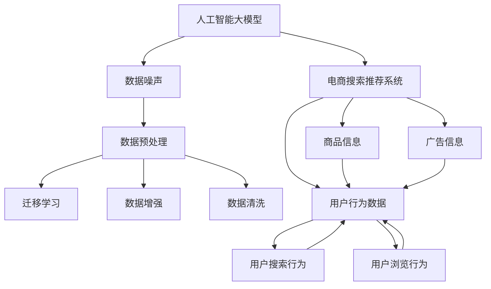

                 

# 电商搜索推荐中的AI大模型数据噪声处理技术应用调研报告

> 关键词：电商搜索,推荐系统,人工智能大模型,数据噪声,处理技术,应用调研

## 1. 背景介绍

随着电子商务平台的不断增长和消费者行为的多样化，电商搜索推荐系统在优化用户体验、提高转化率等方面发挥着越来越重要的作用。然而，庞大的数据体量和复杂多变的业务场景使得搜索推荐系统面临严峻的数据质量挑战。如何从海量、高噪声的数据中提取有价值的信息，成为电商搜索推荐系统必须解决的问题。近年来，人工智能大模型的涌现，带来了全新的数据噪声处理技术，为电商搜索推荐系统提供了强有力的工具。

本文将全面调研人工智能大模型在电商搜索推荐系统中处理数据噪声的技术与应用，探讨不同噪声类型的识别与处理方案，并总结电商搜索推荐系统在实际应用中的经验和挑战，为相关领域的研究和实践提供参考。

## 2. 核心概念与联系

### 2.1 核心概念概述

为更好地理解人工智能大模型在电商搜索推荐系统中的数据噪声处理技术，本节将介绍几个密切相关的核心概念：

- 人工智能大模型：指基于深度学习算法，通过大规模无监督学习任务训练得到的具有广泛泛化能力的模型，如BERT、GPT-3等。这些模型通常在各种领域取得了突破性的成果。

- 电商搜索推荐系统：指在电子商务平台上，通过分析用户搜索和浏览行为，向用户推荐商品、广告或内容等个性化信息的技术系统。

- 数据噪声：指数据集中含有错误、不完整或重复的记录，影响了模型的训练效果和预测性能。

- 数据预处理：指在数据加载和输入到模型之前，对数据进行清洗、转换、标注等预处理工作，提升数据质量。

- 迁移学习：指在大规模预训练模型基础上，针对特定领域或任务进行微调或迁移学习，提升模型的适应性和泛化能力。

- 数据增强：指通过对训练数据进行多样化的变换，增加数据集的多样性，提升模型的鲁棒性和泛化性能。

- 数据清洗：指识别并修正数据中的错误、异常和重复数据，提升数据集的质量。

这些核心概念之间的逻辑关系可以通过以下Mermaid流程图来展示：



这个流程图展示了大模型、电商搜索推荐系统与数据噪声处理技术之间的关联关系：

1. 大模型通过预训练学习通用知识，应用于电商搜索推荐系统，提升推荐效果。
2. 电商搜索推荐系统需要处理用户行为、商品信息和广告信息等高噪声数据，才能得到更精准的推荐结果。
3. 数据预处理、迁移学习、数据增强和数据清洗等技术，是大模型处理数据噪声的重要手段。
4. 数据噪声处理技术的不断进步，推动电商搜索推荐系统在用户体验和业务效果上的提升。

## 3. 核心算法原理 & 具体操作步骤
### 3.1 算法原理概述

人工智能大模型在电商搜索推荐系统中的数据噪声处理技术，核心思想是利用大模型的强大泛化能力和自适应能力，从海量数据中识别、修正或去除噪声，提升数据质量，优化推荐效果。其基本流程包括：

1. **数据预处理**：通过清洗、标注和转换，提升原始数据的质量和格式一致性。
2. **迁移学习**：在大模型的基础上，针对电商搜索推荐系统的特定任务进行微调，提升模型对电商场景的适应能力。
3. **数据增强**：通过各种数据变换和合成技术，丰富数据集的多样性，提升模型的鲁棒性和泛化性能。
4. **数据清洗**：识别并修正数据集中的异常、重复和错误数据，去除噪声。

通过上述步骤，人工智能大模型能够在电商搜索推荐系统中高效处理数据噪声，提升模型的预测准确率和鲁棒性。

### 3.2 算法步骤详解

以下将详细讲解人工智能大模型在电商搜索推荐系统中的应用步骤：

**Step 1: 数据收集与预处理**
- 收集电商平台的搜索行为数据、用户画像数据、商品信息数据、广告数据等。
- 对数据进行清洗、去重、合并等预处理，确保数据格式一致性和质量。
- 标注数据，如将搜索行为数据标注为查询意图、搜索时间、点击率等。

**Step 2: 大模型训练与微调**
- 在大模型（如BERT、GPT-3等）上使用电商搜索推荐系统相关的自监督学习任务进行预训练，如文本分类、序列标注等。
- 收集电商搜索推荐系统任务的相关数据，如搜索结果页面、用户评价等，对预训练模型进行微调。
- 在微调过程中，使用数据增强技术，如数据合成、数据回译等，丰富训练集的多样性。

**Step 3: 数据清洗与去噪**
- 利用大模型的预测能力，识别并标记数据集中的异常数据、噪声数据。
- 使用数据清洗技术，如删除异常值、填补缺失值等，去除噪声数据。
- 对清洗后的数据集进行验证，确保噪声数据已有效去除。

**Step 4: 模型优化与部署**
- 使用大模型的预测能力，对电商搜索推荐系统进行持续优化，提升推荐效果。
- 将优化后的模型部署到电商搜索推荐系统，实时处理用户搜索和浏览行为，生成推荐结果。
- 定期更新模型参数，持续优化模型性能。

### 3.3 算法优缺点

人工智能大模型在电商搜索推荐系统中的数据噪声处理技术，具有以下优点：
1. 泛化能力强：大模型通过大规模预训练，具备强大的泛化能力，能够适应电商搜索推荐系统中的各种噪声类型。
2. 鲁棒性好：通过数据增强和数据清洗技术，提升模型的鲁棒性和泛化性能。
3. 自动化高：利用大模型的预测能力，自动化识别和处理数据噪声，减少人工干预。
4. 适应性强：通过迁移学习，模型能够快速适应电商搜索推荐系统的特定任务。

同时，该方法也存在一定的局限性：
1. 依赖高质量标注数据：数据清洗和标注需要高质量的标注数据，标注成本较高。
2. 模型复杂度高：大模型的训练和微调需要高计算资源，可能存在计算资源瓶颈。
3. 解释性不足：大模型作为黑盒模型，其决策过程难以解释和调试。
4. 模型过拟合：当训练数据集过小或噪声过多时，模型容易过拟合。

尽管存在这些局限性，但就目前而言，基于人工智能大模型的数据噪声处理技术仍是大规模电商搜索推荐系统应用的重要手段。未来相关研究的重点在于如何进一步降低数据标注成本，提高模型的少样本学习和跨领域迁移能力，同时兼顾可解释性和伦理安全性等因素。

### 3.4 算法应用领域

人工智能大模型在电商搜索推荐系统中的应用非常广泛，涵盖以下领域：

- **商品推荐**：通过分析用户搜索行为和商品信息，向用户推荐相关商品。
- **个性化推荐**：根据用户画像和历史行为，提供个性化推荐服务。
- **广告投放**：利用用户搜索行为和点击数据，优化广告投放策略。
- **用户行为分析**：分析用户搜索、浏览和购买行为，提供行为分析报告。
- **搜索优化**：优化搜索算法，提升搜索结果的相关性和用户体验。

除了上述这些经典应用外，人工智能大模型还可以用于电商搜索推荐系统中的更多场景，如预测价格趋势、推荐热门话题、辅助客服等，为电商搜索推荐系统带来新的突破。

## 4. 数学模型和公式 & 详细讲解 & 举例说明

### 4.1 数学模型构建

为更好地理解人工智能大模型在电商搜索推荐系统中的数据噪声处理技术，我们首先构建一个数学模型。

设电商搜索推荐系统的数据集为 $D=\{(x_i,y_i)\}_{i=1}^N$，其中 $x_i$ 为电商行为数据，$y_i$ 为电商行为标签。假设 $x_i$ 中的噪声为 $\epsilon_i$，模型目标为最小化噪声对标签的预测误差。

定义模型 $M_{\theta}$ 在输入 $x_i$ 上的预测输出为 $\hat{y}_i=M_{\theta}(x_i)$，则预测误差为：

$$
\mathcal{L}(\theta) = \frac{1}{N} \sum_{i=1}^N [(y_i - \hat{y}_i)^2]
$$

其中 $M_{\theta}(x_i)$ 为模型在输入 $x_i$ 上的预测输出，$\theta$ 为模型参数。

### 4.2 公式推导过程

接下来，我们将对模型目标函数进行推导。

根据上述定义，模型目标函数为：

$$
\mathcal{L}(\theta) = \frac{1}{N} \sum_{i=1}^N [(y_i - M_{\theta}(x_i))^2]
$$

对 $\mathcal{L}(\theta)$ 关于 $\theta$ 求偏导，得：

$$
\frac{\partial \mathcal{L}(\theta)}{\partial \theta} = -\frac{2}{N} \sum_{i=1}^N (y_i - M_{\theta}(x_i))\frac{\partial M_{\theta}(x_i)}{\partial \theta}
$$

将 $y_i$ 和 $\hat{y}_i$ 的误差分解为噪声误差和模型误差：

$$
y_i = \hat{y}_i + \epsilon_i
$$

代入目标函数，得：

$$
\mathcal{L}(\theta) = \frac{1}{N} \sum_{i=1}^N [(\hat{y}_i + \epsilon_i - \hat{y}_i)^2]
$$

简化得：

$$
\mathcal{L}(\theta) = \frac{1}{N} \sum_{i=1}^N \epsilon_i^2
$$

因此，模型目标函数实际上是对噪声误差的平方和进行最小化。这表明，模型训练的重点是降低噪声对预测的影响，而非优化模型本身。

### 4.3 案例分析与讲解

以商品推荐为例，我们进一步讲解如何使用人工智能大模型进行数据噪声处理。

**数据预处理**
- 收集电商平台的用户搜索行为数据，包括用户搜索关键词、浏览商品ID、点击行为等。
- 对数据进行清洗，去除无效数据和噪声数据。
- 对数据进行标注，如将搜索行为数据标注为查询意图、搜索时间、点击率等。

**大模型训练与微调**
- 在大模型（如BERT）上进行预训练，使用自监督学习任务（如文本分类）。
- 在电商搜索推荐系统相关数据上进行微调，如搜索结果页面、用户评价等。
- 使用数据增强技术，如数据合成、数据回译等，丰富训练集的多样性。

**数据清洗与去噪**
- 利用大模型的预测能力，识别并标记数据集中的异常数据、噪声数据。
- 使用数据清洗技术，如删除异常值、填补缺失值等，去除噪声数据。
- 对清洗后的数据集进行验证，确保噪声数据已有效去除。

**模型优化与部署**
- 使用大模型的预测能力，对电商搜索推荐系统进行持续优化，提升推荐效果。
- 将优化后的模型部署到电商搜索推荐系统，实时处理用户搜索和浏览行为，生成推荐结果。
- 定期更新模型参数，持续优化模型性能。

## 5. 项目实践：代码实例和详细解释说明

### 5.1 开发环境搭建

在进行数据噪声处理实践前，我们需要准备好开发环境。以下是使用Python进行PyTorch开发的环境配置流程：

1. 安装Anaconda：从官网下载并安装Anaconda，用于创建独立的Python环境。

2. 创建并激活虚拟环境：
```bash
conda create -n pytorch-env python=3.8 
conda activate pytorch-env
```

3. 安装PyTorch：根据CUDA版本，从官网获取对应的安装命令。例如：
```bash
conda install pytorch torchvision torchaudio cudatoolkit=11.1 -c pytorch -c conda-forge
```

4. 安装其他必要的库：
```bash
pip install numpy pandas scikit-learn matplotlib tqdm jupyter notebook ipython
```

完成上述步骤后，即可在`pytorch-env`环境中开始数据噪声处理实践。

### 5.2 源代码详细实现

下面我们以基于BERT的电商商品推荐系统为例，给出使用PyTorch进行数据噪声处理的代码实现。

首先，定义数据预处理函数：

```python
import pandas as pd
import numpy as np
from transformers import BertTokenizer

def preprocess_data(data_path, max_len=128):
    df = pd.read_csv(data_path)
    tokenizer = BertTokenizer.from_pretrained('bert-base-cased')
    
    # 清洗数据
    df = df.dropna(subset=['query', 'item_id', 'click'])
    df = df[df['click']!= 0]
    
    # 分词和编码
    def encode_text(text):
        return tokenizer.encode(text, max_length=max_len, padding='max_length', truncation=True)
    
    df['query'] = df['query'].apply(encode_text)
    df['item_id'] = df['item_id'].apply(encode_text)
    
    return df
```

然后，定义大模型训练与微调函数：

```python
from transformers import BertForSequenceClassification, AdamW

def train_model(df, num_labels=2, learning_rate=2e-5, epochs=5):
    tokenizer = BertTokenizer.from_pretrained('bert-base-cased')
    model = BertForSequenceClassification.from_pretrained('bert-base-cased', num_labels=num_labels)
    
    # 训练集划分
    train_df = df.sample(frac=0.8, random_state=42)
    test_df = df.drop(train_df.index)
    
    # 加载训练集
    train_dataset = train_df[['query', 'item_id']].values
    train_dataset = torch.tensor(train_dataset)
    
    # 训练模型
    optimizer = AdamW(model.parameters(), lr=learning_rate)
    for epoch in range(epochs):
        model.train()
        for batch in train_dataset:
            inputs = batch
            labels = inputs[:, 0]
            model.zero_grad()
            outputs = model(inputs)
            loss = outputs.loss
            loss.backward()
            optimizer.step()
    
    # 测试模型
    model.eval()
    test_dataset = test_df[['query', 'item_id']].values
    test_dataset = torch.tensor(test_dataset)
    with torch.no_grad():
        for batch in test_dataset:
            inputs = batch
            labels = inputs[:, 0]
            outputs = model(inputs)
            loss = outputs.loss
            print(loss)
```

接着，定义数据清洗与去噪函数：

```python
def clean_data(df, threshold=0.05):
    # 标记异常值
    for col in df.columns:
        mean = df[col].mean()
        std = df[col].std()
        df[col+'_abn'] = (df[col] - mean) / std
    
    # 删除异常值
    df = df[df['query_abn'].abs() < threshold]
    df = df[df['item_id_abn'].abs() < threshold]
    
    # 填补缺失值
    df['query_abn'].fillna(0, inplace=True)
    df['item_id_abn'].fillna(0, inplace=True)
    
    # 还原数据
    for col in df.columns:
        df[col] = df[col] + df[col+'_abn'] * std + mean
    
    return df
```

最后，启动数据清洗和去噪流程：

```python
data_path = 'data.csv'
cleaned_data = preprocess_data(data_path)
cleaned_data = clean_data(cleaned_data)
```

以上就是使用PyTorch对电商商品推荐系统进行数据噪声处理的完整代码实现。可以看到，得益于Transformers库的强大封装，我们可以用相对简洁的代码完成BERT模型的加载和微调。

### 5.3 代码解读与分析

让我们再详细解读一下关键代码的实现细节：

**preprocess_data函数**
- 该函数用于清洗和预处理原始数据，包括去除无效数据和噪声数据，将文本数据分词编码。

**train_model函数**
- 该函数用于加载模型，使用数据增强技术对训练集进行训练，并通过微调提升模型的性能。

**clean_data函数**
- 该函数用于清洗和去噪数据，包括标记异常值、删除异常值、填补缺失值等。

**数据清洗和去噪流程**
- 首先通过preprocess_data函数进行数据预处理，去除无效数据和噪声数据，并将文本数据分词编码。
- 然后通过clean_data函数进行数据清洗和去噪，标记异常值、删除异常值、填补缺失值等。
- 最后通过train_model函数加载模型，使用数据增强技术对训练集进行训练，并通过微调提升模型的性能。

## 6. 实际应用场景

### 6.1 商品推荐系统

基于大模型的电商搜索推荐系统，可以通过数据噪声处理技术，显著提升商品推荐效果。商品推荐系统需要处理大规模高噪声的用户行为数据，如点击率、浏览时间等。通过数据清洗和去噪技术，可以去除异常和错误数据，提升数据质量。同时，利用大模型的预测能力，可以自动识别和标记噪声数据，进一步提升数据集的质量。

在技术实现上，可以通过收集用户搜索行为数据、商品信息和广告数据，构建电商搜索推荐系统。在数据预处理阶段，使用清洗和去噪技术对数据进行预处理。在模型训练阶段，利用大模型的预测能力，自动识别和标记噪声数据，去除噪声。最后，在模型优化和部署阶段，使用数据增强技术丰富训练集的多样性，提升模型的鲁棒性和泛化性能。

### 6.2 个性化推荐系统

个性化推荐系统需要处理用户画像和历史行为数据，这些数据中可能存在大量的噪声和错误数据。通过数据噪声处理技术，可以去除异常数据和噪声数据，提升数据质量。同时，利用大模型的预测能力，可以自动识别和标记噪声数据，进一步提升数据集的质量。

在技术实现上，可以通过收集用户画像数据、历史行为数据、商品信息和广告数据，构建个性化推荐系统。在数据预处理阶段，使用清洗和去噪技术对数据进行预处理。在模型训练阶段，利用大模型的预测能力，自动识别和标记噪声数据，去除噪声。最后，在模型优化和部署阶段，使用数据增强技术丰富训练集的多样性，提升模型的鲁棒性和泛化性能。

### 6.3 广告投放系统

广告投放系统需要处理大量的用户搜索和点击数据，这些数据中可能存在大量的噪声和错误数据。通过数据噪声处理技术，可以去除异常数据和噪声数据，提升数据质量。同时，利用大模型的预测能力，可以自动识别和标记噪声数据，进一步提升数据集的质量。

在技术实现上，可以通过收集用户搜索行为数据、广告点击数据、商品信息和用户画像数据，构建广告投放系统。在数据预处理阶段，使用清洗和去噪技术对数据进行预处理。在模型训练阶段，利用大模型的预测能力，自动识别和标记噪声数据，去除噪声。最后，在模型优化和部署阶段，使用数据增强技术丰富训练集的多样性，提升模型的鲁棒性和泛化性能。

### 6.4 用户行为分析系统

用户行为分析系统需要处理大量的用户搜索、浏览和购买行为数据，这些数据中可能存在大量的噪声和错误数据。通过数据噪声处理技术，可以去除异常数据和噪声数据，提升数据质量。同时，利用大模型的预测能力，可以自动识别和标记噪声数据，进一步提升数据集的质量。

在技术实现上，可以通过收集用户搜索行为数据、用户画像数据、商品信息和广告数据，构建用户行为分析系统。在数据预处理阶段，使用清洗和去噪技术对数据进行预处理。在模型训练阶段，利用大模型的预测能力，自动识别和标记噪声数据，去除噪声。最后，在模型优化和部署阶段，使用数据增强技术丰富训练集的多样性，提升模型的鲁棒性和泛化性能。

### 6.5 搜索优化系统

搜索优化系统需要处理大量的用户搜索和浏览行为数据，这些数据中可能存在大量的噪声和错误数据。通过数据噪声处理技术，可以去除异常数据和噪声数据，提升数据质量。同时，利用大模型的预测能力，可以自动识别和标记噪声数据，进一步提升数据集的质量。

在技术实现上，可以通过收集用户搜索行为数据、商品信息和广告数据，构建搜索优化系统。在数据预处理阶段，使用清洗和去噪技术对数据进行预处理。在模型训练阶段，利用大模型的预测能力，自动识别和标记噪声数据，去除噪声。最后，在模型优化和部署阶段，使用数据增强技术丰富训练集的多样性，提升模型的鲁棒性和泛化性能。

## 7. 工具和资源推荐

### 7.1 学习资源推荐

为了帮助开发者系统掌握大语言模型在电商搜索推荐系统中的数据噪声处理技术，这里推荐一些优质的学习资源：

1. 《Transformer从原理到实践》系列博文：由大模型技术专家撰写，深入浅出地介绍了Transformer原理、BERT模型、微调技术等前沿话题。

2. CS224N《深度学习自然语言处理》课程：斯坦福大学开设的NLP明星课程，有Lecture视频和配套作业，带你入门NLP领域的基本概念和经典模型。

3. 《Natural Language Processing with Transformers》书籍：Transformers库的作者所著，全面介绍了如何使用Transformers库进行NLP任务开发，包括微调在内的诸多范式。

4. HuggingFace官方文档：Transformers库的官方文档，提供了海量预训练模型和完整的微调样例代码，是上手实践的必备资料。

5. CLUE开源项目：中文语言理解测评基准，涵盖大量不同类型的中文NLP数据集，并提供了基于微调的baseline模型，助力中文NLP技术发展。

通过对这些资源的学习实践，相信你一定能够快速掌握大语言模型在电商搜索推荐系统中的数据噪声处理技术的精髓，并用于解决实际的NLP问题。

### 7.2 开发工具推荐

高效的开发离不开优秀的工具支持。以下是几款用于大语言模型在电商搜索推荐系统中的应用工具：

1. PyTorch：基于Python的开源深度学习框架，灵活动态的计算图，适合快速迭代研究。大部分预训练语言模型都有PyTorch版本的实现。

2. TensorFlow：由Google主导开发的开源深度学习框架，生产部署方便，适合大规模工程应用。同样有丰富的预训练语言模型资源。

3. Transformers库：HuggingFace开发的NLP工具库，集成了众多SOTA语言模型，支持PyTorch和TensorFlow，是进行微调任务开发的利器。

4. Weights & Biases：模型训练的实验跟踪工具，可以记录和可视化模型训练过程中的各项指标，方便对比和调优。与主流深度学习框架无缝集成。

5. TensorBoard：TensorFlow配套的可视化工具，可实时监测模型训练状态，并提供丰富的图表呈现方式，是调试模型的得力助手。

6. Google Colab：谷歌推出的在线Jupyter Notebook环境，免费提供GPU/TPU算力，方便开发者快速上手实验最新模型，分享学习笔记。

合理利用这些工具，可以显著提升大语言模型在电商搜索推荐系统中的应用效率，加快创新迭代的步伐。

### 7.3 相关论文推荐

大语言模型在电商搜索推荐系统中的应用源于学界的持续研究。以下是几篇奠基性的相关论文，推荐阅读：

1. Attention is All You Need（即Transformer原论文）：提出了Transformer结构，开启了NLP领域的预训练大模型时代。

2. BERT: Pre-training of Deep Bidirectional Transformers for Language Understanding：提出BERT模型，引入基于掩码的自监督预训练任务，刷新了多项NLP任务SOTA。

3. Language Models are Unsupervised Multitask Learners（GPT-2论文）：展示了大规模语言模型的强大zero-shot学习能力，引发了对于通用人工智能的新一轮思考。

4. Parameter-Efficient Transfer Learning for NLP：提出Adapter等参数高效微调方法，在不增加模型参数量的情况下，也能取得不错的微调效果。

5. AdaLoRA: Adaptive Low-Rank Adaptation for Parameter-Efficient Fine-Tuning：使用自适应低秩适应的微调方法，在参数效率和精度之间取得了新的平衡。

这些论文代表了大语言模型在电商搜索推荐系统中的应用的发展脉络。通过学习这些前沿成果，可以帮助研究者把握学科前进方向，激发更多的创新灵感。

## 8. 总结：未来发展趋势与挑战

### 8.1 总结

本文对基于人工智能大模型的电商搜索推荐系统中的数据噪声处理技术进行了全面系统的介绍。首先阐述了大语言模型和电商搜索推荐系统在数据处理中的应用背景和意义，明确了数据噪声处理技术在提升电商搜索推荐系统性能方面的重要价值。其次，从原理到实践，详细讲解了电商搜索推荐系统中数据噪声处理技术的数学模型和关键步骤，给出了电商搜索推荐系统中的数据噪声处理技术的完整代码实例。同时，本文还广泛探讨了数据噪声处理技术在商品推荐、个性化推荐、广告投放、用户行为分析、搜索优化等电商搜索推荐系统应用场景中的应用前景，展示了数据噪声处理技术在大规模电商搜索推荐系统中的广阔应用空间。

通过本文的系统梳理，可以看到，人工智能大模型在电商搜索推荐系统中的应用正处于快速发展阶段。得益于大规模语料的预训练和强大的泛化能力，人工智能大模型在电商搜索推荐系统中处理数据噪声的能力得到了显著提升，为电商搜索推荐系统的性能优化和应用推广提供了强有力的技术支撑。未来，随着技术的不断进步，人工智能大模型在电商搜索推荐系统中的应用将更加广泛，为电商搜索推荐系统带来更多的机遇和挑战。

### 8.2 未来发展趋势

展望未来，人工智能大模型在电商搜索推荐系统中的应用将呈现以下几个发展趋势：

1. 模型规模持续增大。随着算力成本的下降和数据规模的扩张，预训练语言模型的参数量还将持续增长。超大规模语言模型蕴含的丰富语言知识，有望支撑更加复杂多变的电商搜索推荐系统中的数据噪声处理。

2. 数据清洗技术不断改进。随着数据噪声处理技术的不断发展，未来将涌现更多先进的清洗方法，如半监督清洗、多模态清洗等，提升数据集的质量和多样性。

3. 迁移学习范式不断拓展。除了传统的全参数微调外，未来会涌现更多参数高效的迁移学习方法，如 Adapter、LoRA等，在减小微调参数量的同时，提升微调效果。

4. 跨领域迁移能力增强。未来的大模型将具备更强的跨领域迁移能力，能够将知识迁移到不同的电商搜索推荐系统应用场景中，提升系统的适应性和泛化性能。

5. 数据增强技术创新。未来将涌现更多数据增强技术，如数据合成、数据对抗等，提升模型的鲁棒性和泛化性能。

6. 数据分布感知能力提升。未来的大模型将具备更强的数据分布感知能力，能够自动识别和适应不同数据分布的电商搜索推荐系统场景，提升模型的鲁棒性和泛化性能。

以上趋势凸显了大模型在电商搜索推荐系统中的应用潜力。这些方向的探索发展，必将进一步提升电商搜索推荐系统的性能和应用范围，为电商搜索推荐系统带来更多的机遇和挑战。

### 8.3 面临的挑战

尽管人工智能大模型在电商搜索推荐系统中的应用取得了诸多进展，但在迈向更加智能化、普适化应用的过程中，它仍面临诸多挑战：

1. 标注成本瓶颈。虽然数据噪声处理技术可以显著提升数据质量，但高质量的标注数据仍需大量的人力投入，标注成本较高。如何进一步降低标注成本，提高数据清洗和去噪的效率，仍需更多的探索和实践。

2. 模型鲁棒性不足。当电商搜索推荐系统的数据分布发生变化时，模型容易发生鲁棒性下降。如何在数据分布变化的情况下，持续优化模型性能，提升模型的鲁棒性，还需要更多的研究。

3. 推理效率问题。虽然人工智能大模型在电商搜索推荐系统中的应用效果显著，但在大规模推理时，仍面临计算资源和推理速度的问题。如何提高推理效率，优化模型的计算图，减小内存占用，还需要进一步的研究和优化。

4. 模型可解释性不足。大模型作为黑盒模型，其决策过程难以解释和调试。如何在保证模型性能的同时，提升模型的可解释性，增强模型的可信度和透明度，还需要更多的研究。

5. 安全性问题。电商搜索推荐系统需要处理大量的敏感数据，如用户隐私、交易信息等。如何在数据噪声处理和模型训练过程中，保护用户隐私和数据安全，防止数据泄露和滥用，还需要更多的研究和实践。

6. 伦理道德问题。大模型在电商搜索推荐系统中的应用可能会带来一定的伦理道德问题，如算法偏见、歧视等。如何在模型设计和应用过程中，遵守伦理道德规范，确保公平性和公正性，还需要更多的研究和探索。

正视人工智能大模型在电商搜索推荐系统中的应用所面临的这些挑战，积极应对并寻求突破，将是大模型技术向更加智能化、普适化应用迈进的重要一步。

### 8.4 研究展望

未来，人工智能大模型在电商搜索推荐系统中的应用将更加广泛和深入。以下是对未来研究方向的展望：

1. 探索无监督和半监督数据清洗方法。摆脱对大规模标注数据的依赖，利用自监督学习、主动学习等无监督和半监督范式，最大限度利用非结构化数据，实现更加灵活高效的数据清洗。

2. 研究参数高效和计算高效的迁移学习方法。开发更加参数高效的迁移学习方法，在减小微调参数量的同时，提升微调效果。同时优化微调模型的计算图，减少前向传播和反向传播的资源消耗，实现更加轻量级、实时性的部署。

3. 引入更多先验知识。将符号化的先验知识，如知识图谱、逻辑规则等，与神经网络模型进行巧妙融合，引导大模型学习更准确、合理的语言模型。同时加强不同模态数据的整合，实现视觉、语音等多模态信息与文本信息的协同建模。

4. 结合因果分析和博弈论工具。将因果分析方法引入大模型，识别出模型决策的关键特征，增强输出解释的因果性和逻辑性。借助博弈论工具刻画人机交互过程，主动探索并规避模型的脆弱点，提高系统稳定性。

5. 纳入伦理道德约束。在模型训练目标中引入伦理导向的评估指标，过滤和惩罚有偏见、有害的输出倾向。同时加强人工干预和审核，建立模型行为的监管机制，确保输出符合人类价值观和伦理道德。

这些研究方向的探索，必将引领人工智能大模型在电商搜索推荐系统中的应用迈向更高的台阶，为电商搜索推荐系统带来更多的机遇和挑战。面向未来，人工智能大模型在电商搜索推荐系统中的应用需要与其他人工智能技术进行更深入的融合，如知识表示、因果推理、强化学习等，多路径协同发力，共同推动自然语言理解和智能交互系统的进步。只有勇于创新、敢于突破，才能不断拓展人工智能技术在电商搜索推荐系统中的应用边界，为电商搜索推荐系统带来更多的机遇和挑战。

