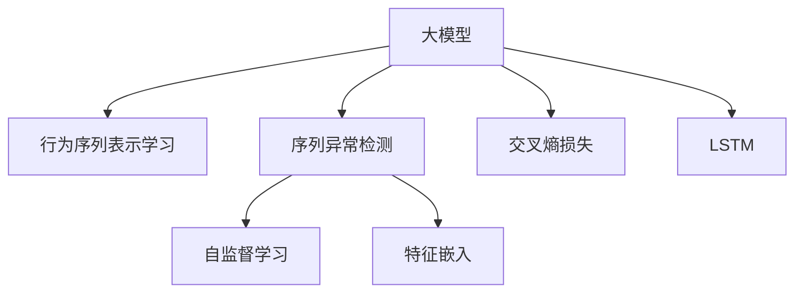

                 

## 1. 背景介绍

### 1.1 问题由来

随着电商行业的发展，用户行为数据的获取和利用变得日益重要。通过分析用户行为序列，可以揭示用户的购买意向、偏好和购买路径，帮助电商平台提升推荐效果、优化用户体验。然而，用户行为数据可能受到攻击、异常行为等因素的影响，导致推荐系统出现误判，给商家和用户带来损失。

因此，异常检测成为电商搜索推荐系统中的重要任务。传统的异常检测方法通常基于统计模型，但难以有效处理大规模稀疏数据和复杂行为序列。近年来，基于深度学习的大模型在异常检测中取得了显著进展，通过学习用户行为的深层特征，提高了异常检测的准确性和泛化能力。

### 1.2 问题核心关键点

电商搜索推荐系统中的用户行为序列异常检测，核心在于构建大模型对用户行为进行建模，并通过训练发现异常行为模式。具体问题包括：

- 如何设计高效的模型架构，捕捉用户行为序列的深层特征？
- 如何构建训练数据集，覆盖各类异常行为模式？
- 如何优化模型训练过程，提升异常检测的准确性和效率？
- 如何将异常检测结果应用到推荐系统中，改善用户体验？

### 1.3 问题研究意义

异常检测技术的成功应用，对于保障电商搜索推荐系统的稳定性和可靠性，提升用户体验，具有重要意义：

1. **保障用户数据安全**：通过检测异常行为，识别潜在的安全威胁，及时阻止攻击行为。
2. **优化推荐效果**：准确识别异常行为，可以帮助平台更好地理解用户需求，优化推荐算法。
3. **提升用户体验**：减少异常推荐，提高推荐系统的准确性和相关性，提升用户满意度。
4. **促进业务决策**：通过异常行为分析，帮助商家进行精准营销和个性化推荐，提高运营效率。

## 2. 核心概念与联系

### 2.1 核心概念概述

为更好地理解基于深度学习的大模型在电商搜索推荐系统中的异常检测应用，本节将介绍几个关键概念：

- **大模型**：以深度神经网络为基础，通过大规模数据进行训练，具备强大的特征提取和表示学习能力。
- **序列异常检测**：针对序列数据，检测其中异常模式的过程。电商用户行为序列具有时间序列特征，适合使用序列异常检测方法。
- **行为序列表示学习**：使用大模型对用户行为序列进行编码，学习出用户行为的深层特征表示。
- **自监督学习**：利用未标注数据进行预训练，学习到通用的特征表示，用于下游任务。
- **特征嵌入**：将输入数据转换为高维向量表示，便于模型进行特征提取和比较。
- **交叉熵损失**：一种常用的分类损失函数，用于衡量模型预测与真实标签的差异。
- **LSTM**：一种适用于序列数据的循环神经网络，具备记忆能力，能够捕捉时间序列特征。

这些概念之间的逻辑关系可以通过以下Mermaid流程图来展示：



这个流程图展示了大模型在电商搜索推荐系统中进行异常检测的一般流程：

1. 大模型学习用户行为序列的深层特征表示。
2. 通过自监督学习预训练模型，学习通用的特征表示。
3. 对用户行为序列进行特征嵌入，转化为高维向量表示。
4. 使用交叉熵损失函数训练模型，识别序列中的异常模式。
5. 引入LSTM等序列网络，捕捉时间序列特征，提升异常检测效果。

## 3. 核心算法原理 & 具体操作步骤
### 3.1 算法原理概述

基于深度学习的大模型在电商搜索推荐系统中的异常检测，主要分为两个步骤：

1. **行为序列表示学习**：使用大模型对用户行为序列进行编码，学习出用户行为的深层特征表示。
2. **序列异常检测**：基于表示学习得到的特征向量，检测用户行为序列中的异常模式。

行为序列表示学习的关键在于选择合适的模型架构，利用大规模无标签数据进行预训练，学习出通用的用户行为表示。而序列异常检测的关键在于设计合适的异常检测指标，并利用标注数据进行有监督训练，优化模型对异常模式的识别能力。

### 3.2 算法步骤详解

#### 3.2.1 行为序列表示学习

**Step 1: 选择模型架构**  
选择合适的深度学习模型，如RNN、LSTM、GRU等。这里以LSTM为例，说明行为序列表示学习的步骤。

**Step 2: 数据预处理**  
对原始用户行为数据进行清洗、归一化、截断等预处理操作，保证输入数据的格式一致。

**Step 3: 数据划分**  
将预处理后的用户行为数据划分为训练集、验证集和测试集，通常按时间顺序进行划分。

**Step 4: 模型训练**  
使用自监督学习策略，利用未标注数据进行预训练。例如，可以使用MSE损失函数训练LSTM模型，以最大化预测值与真实值之间的差异。

**Step 5: 特征提取**  
利用训练好的LSTM模型，将用户行为序列转换为高维特征向量，用于后续的异常检测。

#### 3.2.2 序列异常检测

**Step 1: 数据标注**  
收集标注好的异常行为数据，构建标注数据集。标注数据集应包含正常行为和异常行为的样本。

**Step 2: 模型训练**  
在标注数据集上，使用交叉熵损失函数训练异常检测模型。模型输出异常概率，用于检测异常行为。

**Step 3: 模型优化**  
根据模型在验证集上的性能表现，调整模型超参数，如学习率、批大小、迭代轮数等。

**Step 4: 异常检测**  
使用训练好的异常检测模型，对用户行为序列进行异常检测。根据检测结果，过滤掉异常行为，保证推荐系统的准确性。

### 3.3 算法优缺点

基于深度学习的大模型在电商搜索推荐系统中的异常检测方法具有以下优点：

- **高精度**：大模型具备强大的特征提取能力，能够学习到复杂的用户行为模式，提升异常检测的准确性。
- **鲁棒性**：通过自监督学习预训练，模型能够适应多种数据分布，具备较强的泛化能力。
- **可扩展性**：大模型可以轻松扩展到其他电商领域，如金融、医疗等，具有广泛的应用前景。

同时，也存在一些缺点：

- **计算成本高**：大模型的训练和推理成本较高，需要大量的计算资源。
- **数据需求大**：需要大量标注数据进行训练，标注成本较高。
- **模型复杂度高**：大模型结构复杂，难以理解和调试。
- **解释性差**：模型决策过程难以解释，难以通过人工手段进行调试。

### 3.4 算法应用领域

基于深度学习的大模型在电商搜索推荐系统中的异常检测方法，广泛应用于以下几个领域：

- **用户行为异常检测**：识别用户行为中的异常操作，如恶意点击、虚假交易等。
- **推荐系统异常检测**：检测推荐结果中的异常数据，如恶意点击、恶意评价等。
- **用户设备异常检测**：检测用户设备的异常行为，如恶意软件、网络攻击等。
- **交易异常检测**：检测交易中的异常行为，如欺诈交易、虚假交易等。
- **广告异常检测**：检测广告中的异常内容，如虚假广告、恶意广告等。

这些领域的应用，有助于保障电商搜索推荐系统的稳定性和安全性，提升用户体验和商家收益。

## 4. 数学模型和公式 & 详细讲解 & 举例说明
### 4.1 数学模型构建

在大模型进行电商搜索推荐系统中的异常检测时，通常使用如下数学模型：

设用户行为序列为 $x_t=\{x_1,x_2,\dots,x_t\}$，其中 $x_t$ 表示用户在第 $t$ 步的行为。假设用户行为序列的深度表示为 $h_t=\{h_1,h_2,\dots,h_t\}$，其中 $h_t$ 表示用户行为序列在 $t$ 步的表示。

**行为序列表示学习**：

$$
h_t = \mathcal{LSTM}(h_{t-1}, x_t)
$$

其中 $\mathcal{LSTM}$ 为LSTM网络，$h_t$ 为LSTM模型在 $t$ 步的隐藏状态。

**序列异常检测**：

$$
p(x_t \text{异常}) = \sigma(\mathcal{DNN}(h_t))
$$

其中 $\mathcal{DNN}$ 为深度神经网络，$p(x_t \text{异常})$ 为模型检测用户行为序列 $x_t$ 是否异常的概率。

### 4.2 公式推导过程

以LSTM为例，对用户行为序列进行表示学习：

$$
h_t = f(h_{t-1}, x_t)
$$

其中 $f$ 为LSTM的更新函数。

将 $h_t$ 代入深度神经网络 $\mathcal{DNN}$ 进行异常检测：

$$
p(x_t \text{异常}) = \sigma(\mathcal{DNN}(h_t))
$$

其中 $\sigma$ 为Sigmoid函数，将输出映射到[0,1]范围内，表示异常概率。

### 4.3 案例分析与讲解

以电商搜索推荐系统为例，分析异常检测的具体实现步骤：

**Step 1: 数据预处理**  
对用户行为序列进行归一化、截断等操作。

**Step 2: 数据划分**  
将预处理后的用户行为序列划分为训练集、验证集和测试集。

**Step 3: 模型训练**  
使用自监督学习策略，对LSTM模型进行预训练。

**Step 4: 特征提取**  
将预训练好的LSTM模型应用于用户行为序列，生成高维特征向量。

**Step 5: 模型训练**  
在标注数据集上，使用交叉熵损失函数训练深度神经网络模型。

**Step 6: 异常检测**  
对用户行为序列进行异常检测，过滤掉异常行为。

## 5. 项目实践：代码实例和详细解释说明
### 5.1 开发环境搭建

在进行异常检测实践前，我们需要准备好开发环境。以下是使用Python进行TensorFlow开发的环境配置流程：

1. 安装Anaconda：从官网下载并安装Anaconda，用于创建独立的Python环境。

2. 创建并激活虚拟环境：
```bash
conda create -n tf-env python=3.8 
conda activate tf-env
```

3. 安装TensorFlow：根据CUDA版本，从官网获取对应的安装命令。例如：
```bash
pip install tensorflow
```

4. 安装TensorFlow Addons：用于使用LSTM网络等高级功能。
```bash
pip install tensorflow-addons
```

5. 安装各类工具包：
```bash
pip install numpy pandas scikit-learn matplotlib tqdm jupyter notebook ipython
```

完成上述步骤后，即可在`tf-env`环境中开始异常检测实践。

### 5.2 源代码详细实现

这里我们以LSTM模型为例，给出使用TensorFlow进行电商搜索推荐系统中的异常检测的代码实现。

首先，定义异常检测的数据处理函数：

```python
import tensorflow as tf
from tensorflow.keras.layers import LSTM, Dense
from tensorflow.keras.models import Sequential
from tensorflow.keras.callbacks import EarlyStopping

def preprocess_data(data):
    # 对原始数据进行清洗、归一化等预处理操作
    # ...
    return X, y
```

然后，定义LSTM模型的结构和参数：

```python
model = Sequential()
model.add(LSTM(units=128, input_shape=(None, 1)))
model.add(Dense(units=1, activation='sigmoid'))
```

接着，定义模型的损失函数和优化器：

```python
model.compile(loss='binary_crossentropy', optimizer='adam', metrics=['accuracy'])
```

最后，定义训练和评估函数：

```python
def train_model(model, X_train, y_train, X_val, y_val, batch_size, epochs):
    early_stopping = EarlyStopping(monitor='val_loss', patience=10)
    model.fit(X_train, y_train, batch_size=batch_size, epochs=epochs, validation_data=(X_val, y_val), callbacks=[early_stopping])
    return model

def evaluate_model(model, X_test, y_test):
    loss, accuracy = model.evaluate(X_test, y_test)
    return loss, accuracy
```

最后，启动训练流程并在测试集上评估：

```python
epochs = 50
batch_size = 32

X_train, y_train, X_val, y_val, X_test, y_test = preprocess_data(train_data, val_data, test_data)

model = train_model(model, X_train, y_train, X_val, y_val, batch_size, epochs)

loss, accuracy = evaluate_model(model, X_test, y_test)
print(f'Test loss: {loss:.4f}, Test accuracy: {accuracy:.4f}')
```

以上就是使用TensorFlow对LSTM模型进行电商搜索推荐系统中的异常检测的完整代码实现。可以看到，TensorFlow提供的高级API使得模型构建和训练过程非常简洁高效。

### 5.3 代码解读与分析

让我们再详细解读一下关键代码的实现细节：

**LSTM模型定义**：
- `Sequential`：顺序模型，方便定义模型的层级结构。
- `LSTM`：LSTM层，输入维度为None，表示输入序列可以是变长的。
- `Dense`：全连接层，输出维度为1，使用Sigmoid激活函数。

**模型训练**：
- `compile`方法：定义模型的损失函数和优化器，以及评估指标。
- `fit`方法：对模型进行训练，设置批次大小、迭代轮数等参数。
- `EarlyStopping`回调：用于防止过拟合，如果验证集损失连续10个epoch不降低，则停止训练。

**模型评估**：
- `evaluate`方法：对模型进行评估，返回损失和准确率。

**训练流程**：
- 定义总迭代轮数和批次大小，启动训练循环。
- 在训练集上训练模型，返回模型。
- 在测试集上评估模型，输出测试结果。

可以看到，TensorFlow的高级API大大简化了模型构建和训练过程，使得开发者可以更加专注于算法的实现和优化。

当然，工业级的系统实现还需考虑更多因素，如模型的保存和部署、超参数的自动搜索、更灵活的任务适配层等。但核心的异常检测范式基本与此类似。

## 6. 实际应用场景
### 6.1 智能客服系统

基于异常检测的电商搜索推荐系统，可以应用于智能客服系统的构建。传统的客服系统往往依赖人工，处理复杂问题时效率低下。通过异常检测技术，可以自动识别并处理异常问题，减少人工干预，提高响应速度。

在技术实现上，可以收集客服历史对话数据，构建异常行为标注数据集。训练模型检测异常对话，并在发现异常时及时介入人工客服。这不仅能够提高客服系统的响应速度，还能确保客户问题的及时解决。

### 6.2 金融风控系统

在金融领域，异常检测技术可以有效防范欺诈行为，保障金融安全。通过收集用户交易数据，构建异常行为标注数据集，训练模型检测异常交易行为。一旦检测到异常交易，系统可以立即进行预警，并采取相应的风险控制措施。

在实际应用中，金融风控系统可以实时监控用户交易行为，防止恶意交易和欺诈行为的发生。这不仅能够保障用户的财产安全，还能提升金融机构的运营效率。

### 6.3 物流配送系统

在物流配送系统中，异常检测技术可以用于识别运输过程中的异常事件，如包裹损坏、配送延误等。通过收集物流数据，构建异常事件标注数据集，训练模型检测异常事件。一旦检测到异常事件，系统可以及时调整配送计划，减少损失。

物流配送系统可以利用异常检测技术，实时监控运输过程，识别并处理异常事件。这不仅能够提高配送效率，还能保障货物安全。

### 6.4 未来应用展望

随着异常检测技术的不断发展，其在电商搜索推荐系统中的应用前景将更加广阔。未来，基于深度学习的大模型在异常检测中的作用将更加凸显，带来更多创新应用：

- **跨领域应用**：异常检测技术不仅适用于电商领域，还可以应用于医疗、金融、物流等多个领域。
- **多模态融合**：结合视觉、语音等多种数据源，提升异常检测的准确性和鲁棒性。
- **实时异常检测**：通过实时监控用户行为，及时发现异常行为，提高系统响应速度。
- **异常行为预警**：结合预测模型，对未来可能发生的异常行为进行预警，提高风险控制能力。

这些技术创新将推动异常检测技术的进一步发展，为电商搜索推荐系统带来更加可靠、高效的应用体验。

## 7. 工具和资源推荐
### 7.1 学习资源推荐

为了帮助开发者系统掌握大模型在电商搜索推荐系统中的异常检测理论基础和实践技巧，这里推荐一些优质的学习资源：

1. **《深度学习入门》书籍**：通过理论讲解和实际案例，全面介绍了深度学习的基础知识和应用技巧，适合初学者学习。
2. **CS231n《深度学习与计算机视觉》课程**：斯坦福大学开设的计算机视觉课程，涵盖深度学习在图像、视频等数据上的应用，是学习异常检测的重要参考资料。
3. **Kaggle平台**：全球最大的数据竞赛平台，提供丰富的数据集和竞赛任务，帮助开发者实践异常检测算法。
4. **arXiv预印本网站**：收录了大量深度学习领域的最新研究成果，是了解异常检测前沿技术的最佳途径。
5. **TensorFlow官方文档**：提供详细的API文档和教程，帮助开发者高效使用TensorFlow进行模型构建和训练。

通过对这些资源的学习实践，相信你一定能够快速掌握大模型在电商搜索推荐系统中的异常检测技巧，并用于解决实际的电商问题。

### 7.2 开发工具推荐

高效的开发离不开优秀的工具支持。以下是几款用于大模型在电商搜索推荐系统中的异常检测开发的常用工具：

1. **TensorFlow**：由Google主导开发的深度学习框架，生产部署方便，适合大规模工程应用。
2. **Keras**：高层API，易于使用，适合快速迭代研究。
3. **TensorFlow Addons**：TensorFlow的补充库，提供LSTM等高级功能。
4. **Weights & Biases**：模型训练的实验跟踪工具，可以记录和可视化模型训练过程中的各项指标，方便对比和调优。
5. **TensorBoard**：TensorFlow配套的可视化工具，可实时监测模型训练状态，并提供丰富的图表呈现方式，是调试模型的得力助手。
6. **Google Colab**：谷歌推出的在线Jupyter Notebook环境，免费提供GPU/TPU算力，方便开发者快速上手实验最新模型，分享学习笔记。

合理利用这些工具，可以显著提升大模型在电商搜索推荐系统中的异常检测开发效率，加快创新迭代的步伐。

### 7.3 相关论文推荐

大模型在电商搜索推荐系统中的异常检测技术的发展，得益于学界的持续研究。以下是几篇奠基性的相关论文，推荐阅读：

1. **《异常检测综述》**：全面介绍了异常检测的理论和方法，适合基础理论学习。
2. **《深度学习在图像中的异常检测》**：介绍了深度学习在图像中的异常检测方法，具有很好的参考价值。
3. **《基于LSTM的异常检测》**：使用LSTM网络进行异常检测，详细说明了模型构建和训练步骤。
4. **《深度学习在序列数据中的异常检测》**：介绍了深度学习在序列数据中的异常检测方法，具有很好的应用参考。
5. **《深度学习在电商推荐中的异常检测》**：介绍了深度学习在电商推荐中的异常检测方法，适合实战学习。

这些论文代表了大模型在电商搜索推荐系统中的异常检测技术的发展脉络。通过学习这些前沿成果，可以帮助研究者把握学科前进方向，激发更多的创新灵感。

## 8. 总结：未来发展趋势与挑战
### 8.1 研究成果总结

本文对基于深度学习的大模型在电商搜索推荐系统中的异常检测方法进行了全面系统的介绍。首先阐述了异常检测技术在电商搜索推荐系统中的重要性和研究背景，明确了异常检测在保障系统稳定性和提升用户体验中的关键作用。其次，从原理到实践，详细讲解了异常检测的数学模型和关键步骤，给出了异常检测任务开发的完整代码实例。同时，本文还广泛探讨了异常检测方法在智能客服、金融风控、物流配送等多个领域的应用前景，展示了异常检测技术的广阔前景。

通过本文的系统梳理，可以看到，基于深度学习的大模型在电商搜索推荐系统中的异常检测方法，不仅能够提升系统的稳定性，还能有效识别和处理异常行为，保障用户数据安全，提升用户体验。未来，伴随深度学习技术的不断演进，异常检测技术必将在更多领域得到应用，为智能系统带来更加可靠的保障。

### 8.2 未来发展趋势

展望未来，大模型在电商搜索推荐系统中的异常检测技术将呈现以下几个发展趋势：

1. **模型规模持续增大**：随着算力成本的下降和数据规模的扩张，预训练语言模型的参数量还将持续增长。超大规模语言模型蕴含的丰富语言知识，有望支撑更加复杂多变的异常检测任务。
2. **异常检测方法多样**：除了传统的深度学习模型，未来会涌现更多异常检测方法，如迁移学习、半监督学习等，在降低标注成本的同时，提升异常检测的效率和准确性。
3. **实时异常检测**：通过实时监控用户行为，及时发现异常行为，提高系统响应速度。
4. **多模态融合**：结合视觉、语音等多种数据源，提升异常检测的准确性和鲁棒性。
5. **异常行为预警**：结合预测模型，对未来可能发生的异常行为进行预警，提高风险控制能力。
6. **模型通用性增强**：经过海量数据的预训练和多领域任务的微调，未来的模型将具备更强大的常识推理和跨领域迁移能力，逐步迈向通用人工智能(AGI)的目标。

以上趋势凸显了大模型在电商搜索推荐系统中的异常检测技术的广阔前景。这些方向的探索发展，必将进一步提升异常检测系统的性能和应用范围，为智能系统带来更加可靠、高效的应用体验。

### 8.3 面临的挑战

尽管大模型在电商搜索推荐系统中的异常检测技术已经取得了显著进展，但在迈向更加智能化、普适化应用的过程中，它仍面临着诸多挑战：

1. **标注成本瓶颈**：异常检测任务需要大量标注数据进行训练，标注成本较高。如何降低标注数据的需求，是未来的重要研究方向。
2. **模型鲁棒性不足**：当前异常检测模型面对域外数据时，泛化性能往往大打折扣。对于测试样本的微小扰动，模型的预测也容易发生波动。如何提高异常检测模型的鲁棒性，避免灾难性遗忘，还需要更多理论和实践的积累。
3. **推理效率有待提高**：大规模语言模型虽然精度高，但在实际部署时往往面临推理速度慢、内存占用大等效率问题。如何在保证性能的同时，简化模型结构，提升推理速度，优化资源占用，将是重要的优化方向。
4. **模型可解释性亟需加强**：当前异常检测模型通常被视为"黑盒"系统，难以解释其内部工作机制和决策逻辑。如何赋予异常检测模型更强的可解释性，将是亟待攻克的难题。
5. **安全性有待保障**：异常检测模型难免会学习到有偏见、有害的信息，通过异常检测传递到下游任务，产生误导性、歧视性的输出，给实际应用带来安全隐患。如何从数据和算法层面消除模型偏见，避免恶意用途，确保输出的安全性，也将是重要的研究课题。
6. **知识整合能力不足**：现有的异常检测模型往往局限于任务内数据，难以灵活吸收和运用更广泛的先验知识。如何让异常检测过程更好地与外部知识库、规则库等专家知识结合，形成更加全面、准确的信息整合能力，还有很大的想象空间。

正视异常检测面临的这些挑战，积极应对并寻求突破，将是大模型在电商搜索推荐系统中的应用迈向成熟的必由之路。相信随着学界和产业界的共同努力，这些挑战终将一一被克服，异常检测技术必将在构建安全、可靠、可解释、可控的智能系统铺平道路。

### 8.4 研究展望

面对异常检测技术所面临的种种挑战，未来的研究需要在以下几个方面寻求新的突破：

1. **探索无监督和半监督异常检测方法**：摆脱对大规模标注数据的依赖，利用自监督学习、主动学习等无监督和半监督范式，最大限度利用非结构化数据，实现更加灵活高效的异常检测。
2. **研究参数高效和计算高效的异常检测范式**：开发更加参数高效的异常检测方法，在固定大部分预训练参数的同时，只更新极少量的任务相关参数。同时优化异常检测模型的计算图，减少前向传播和反向传播的资源消耗，实现更加轻量级、实时性的部署。
3. **融合因果和对比学习范式**：通过引入因果推断和对比学习思想，增强异常检测模型建立稳定因果关系的能力，学习更加普适、鲁棒的语言表征，从而提升异常检测模型的泛化性和抗干扰能力。
4. **结合因果分析和博弈论工具**：将因果分析方法引入异常检测模型，识别出模型决策的关键特征，增强输出解释的因果性和逻辑性。借助博弈论工具刻画人机交互过程，主动探索并规避模型的脆弱点，提高系统稳定性。
5. **纳入伦理道德约束**：在异常检测模型的训练目标中引入伦理导向的评估指标，过滤和惩罚有偏见、有害的输出倾向。同时加强人工干预和审核，建立模型行为的监管机制，确保输出符合人类价值观和伦理道德。

这些研究方向的探索，必将引领异常检测技术迈向更高的台阶，为构建安全、可靠、可解释、可控的智能系统铺平道路。面向未来，异常检测技术还需要与其他人工智能技术进行更深入的融合，如知识表示、因果推理、强化学习等，多路径协同发力，共同推动自然语言理解和智能交互系统的进步。只有勇于创新、敢于突破，才能不断拓展语言模型的边界，让智能技术更好地造福人类社会。

## 9. 附录：常见问题与解答

**Q1：电商搜索推荐系统中的异常检测技术是否适用于所有电商平台？**

A: 异常检测技术在大多数电商平台中都能取得不错的效果，特别是对于数据量较大的平台。但对于一些特定领域的电商平台，如医疗、金融等，可能需要进一步针对特定领域进行数据预处理和模型微调，才能获得理想的效果。

**Q2：异常检测模型的训练过程中如何避免过拟合？**

A: 异常检测模型的训练过程中，过拟合是常见的问题。以下是几种常用的避免过拟合的方法：

- **数据增强**：通过数据增强技术，扩充训练集的规模，减少模型对特定样本的依赖。
- **正则化**：使用L2正则、Dropout等技术，限制模型的复杂度，防止过拟合。
- **早停法**：在验证集上监控模型性能，当性能不再提升时停止训练，防止模型过拟合。
- **模型简化**：通过降低模型复杂度，减小模型的过拟合风险。

这些方法通常需要根据具体问题进行调整，找到最佳的参数设置。

**Q3：异常检测模型在实际应用中需要注意哪些问题？**

A: 异常检测模型在实际应用中，需要注意以下问题：

- **模型泛化能力**：确保模型能够适应多种数据分布，避免过拟合。
- **推理速度**：优化模型的推理速度，确保在实时环境中能够高效运行。
- **可解释性**：提高模型的可解释性，确保决策过程透明，易于理解和调试。
- **安全性**：确保模型输出不会带来安全隐患，避免恶意用途。
- **模型部署**：将模型部署到实际系统中，需要考虑算力、存储等资源的限制。

这些问题的解决需要从数据、算法、工程等多个维度进行综合考虑。只有在各个环节都进行全面优化，才能构建高效、可靠的异常检测系统。

**Q4：异常检测模型在电商搜索推荐系统中的应用场景有哪些？**

A: 异常检测模型在电商搜索推荐系统中的应用场景包括：

- **用户行为异常检测**：识别用户行为中的异常操作，如恶意点击、虚假交易等。
- **推荐系统异常检测**：检测推荐结果中的异常数据，如恶意点击、恶意评价等。
- **用户设备异常检测**：检测用户设备的异常行为，如恶意软件、网络攻击等。
- **交易异常检测**：检测交易中的异常行为，如欺诈交易、虚假交易等。
- **广告异常检测**：检测广告中的异常内容，如虚假广告、恶意广告等。

这些应用场景有助于保障电商搜索推荐系统的稳定性和安全性，提升用户体验和商家收益。

---

作者：禅与计算机程序设计艺术 / Zen and the Art of Computer Programming

