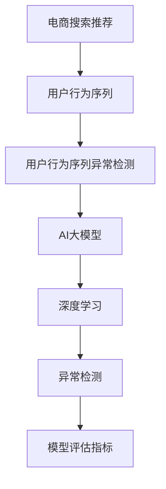

                 

# 电商搜索推荐中的AI大模型用户行为序列异常检测算法性能评测与优化方案

## 1. 背景介绍

在电商搜索推荐系统中，用户行为序列数据是挖掘用户偏好和需求的重要信息来源。用户行为序列通常包含用户的搜索、点击、购买等活动，通过对这些数据的分析，可以优化商品推荐，提升用户体验。然而，用户行为序列中难免存在异常数据，如恶意点击、欺诈行为等，这些异常数据会对推荐系统的性能产生负面影响。

为了应对这一挑战，近年来AI大模型被引入电商领域，用于用户行为序列的异常检测。这些模型通过深度学习技术，能够从大规模数据中学习到丰富的用户行为特征，从而识别出序列中的异常行为。然而，实际应用中，大模型往往存在高复杂度、高资源需求等问题，影响其性能和部署效率。因此，本文旨在对大模型在电商搜索推荐中的用户行为序列异常检测算法进行性能评测，并提出优化方案，以期提升异常检测的准确率和效率。

## 2. 核心概念与联系

### 2.1 核心概念概述

为更好地理解电商搜索推荐中的用户行为序列异常检测，本节将介绍几个密切相关的核心概念：

- 电商搜索推荐：通过分析用户的搜索、点击等行为序列，向用户推荐可能感兴趣的商品或服务的系统。
- 用户行为序列异常检测：在电商用户行为序列中，通过识别和过滤异常数据，提升推荐系统性能的技术。
- AI大模型：以深度学习为核心的、参数量极大的模型，如BERT、GPT等，具有强大的数据分析能力。
- 深度学习：基于神经网络的机器学习技术，通过反向传播算法优化模型参数，从数据中提取特征。
- 异常检测：识别和处理数据中异常点的方法，在电商领域中用于识别恶意行为和欺诈行为。
- 模型评估指标：用于衡量模型性能的指标，如准确率、召回率、F1值等。

这些核心概念之间的逻辑关系可以通过以下Mermaid流程图来展示：



这个流程图展示了电商搜索推荐系统中用户行为序列异常检测的核心流程：从用户行为序列中提取特征，使用AI大模型进行异常检测，最终通过模型评估指标评估检测效果。

## 3. 核心算法原理 & 具体操作步骤
### 3.1 算法原理概述

基于深度学习的AI大模型用户行为序列异常检测，其核心思想是通过学习用户行为序列中的正常行为特征，构建一个异常检测模型。该模型可以识别出序列中与正常行为模式不符的异常数据，从而提升推荐系统的准确性和鲁棒性。

形式化地，假设用户行为序列为 $S=\{x_1,x_2,\dots,x_N\}$，其中 $x_i$ 表示用户在第 $i$ 次操作，可以是搜索、点击、购买等。令 $N$ 为序列长度，通常 $N$ 在电商场景中不超过1000。定义序列中正常行为为 $S_{\text{normal}}=\{x_{\text{normal}_1},x_{\text{normal}_2},\dots,x_{\text{normal}_M}\}$，其中 $M$ 为正常行为模式的数量，通常是百到千级。异常行为定义为 $S_{\text{abnormal}}=\{x_{\text{abnormal}_1},x_{\text{abnormal}_2},\dots,x_{\text{abnormal}_M}\}$。

### 3.2 算法步骤详解

基于深度学习的AI大模型用户行为序列异常检测，一般包括以下几个关键步骤：

**Step 1: 准备数据集**

- 收集电商用户行为序列数据，包含用户的搜索、点击、购买行为等。
- 将用户行为序列进行标注，将其分为正常行为和异常行为。
- 将标注后的数据集划分为训练集、验证集和测试集。

**Step 2: 特征提取**

- 使用预训练的AI大模型，如BERT、GPT等，对用户行为序列进行嵌入处理。
- 对嵌入后的序列进行编码，得到序列向量表示。
- 从序列向量中提取特征，用于构建异常检测模型。

**Step 3: 构建异常检测模型**

- 选择合适的网络架构，如卷积神经网络(CNN)、循环神经网络(RNN)、Transformer等。
- 将序列向量作为输入，构建异常检测模型。
- 设置模型的超参数，如隐藏层大小、学习率等。

**Step 4: 模型训练**

- 使用训练集对异常检测模型进行训练。
- 在验证集上对模型进行调参，选择最优超参数。
- 在测试集上对模型进行评估，计算异常检测的准确率、召回率等指标。

**Step 5: 部署与应用**

- 将训练好的模型部署到电商搜索推荐系统中。
- 实时对用户行为序列进行异常检测。
- 根据检测结果，对恶意行为进行过滤或报警。

以上是基于深度学习的AI大模型用户行为序列异常检测的一般流程。在实际应用中，还需要根据具体场景进行优化设计，如改进特征提取方法，引入更多的正则化技术，搜索最优的超参数组合等，以进一步提升模型性能。

### 3.3 算法优缺点

基于深度学习的AI大模型用户行为序列异常检测方法具有以下优点：
1. 强大的数据分析能力。深度学习模型能够从大规模数据中学习到丰富的用户行为特征，识别出异常行为模式。
2. 高准确性。深度学习模型具有较高的异常检测准确率，能够有效地过滤恶意行为和欺诈行为。
3. 泛化能力强。深度学习模型通常具有较好的泛化能力，能够适应不同电商场景的异常检测需求。

同时，该方法也存在一定的局限性：
1. 高复杂度。深度学习模型的训练和推理过程通常较为复杂，需要大量计算资源和时间。
2. 高资源需求。深度学习模型通常需要较大的显存和计算资源，部署成本较高。
3. 可解释性不足。深度学习模型作为"黑盒"系统，难以解释其内部工作机制和决策逻辑。

尽管存在这些局限性，但就目前而言，基于深度学习的异常检测方法仍是大模型应用的最主流范式。未来相关研究的重点在于如何进一步降低大模型的复杂度和资源需求，提高模型的可解释性和实时性，同时兼顾异常检测的准确率和鲁棒性。

### 3.4 算法应用领域

基于深度学习的AI大模型用户行为序列异常检测，在电商领域具有广泛的应用前景，主要体现在以下几个方面：

- 欺诈检测：识别和过滤用户行为序列中的欺诈行为，保障交易安全。
- 恶意点击检测：识别和过滤用户行为序列中的恶意点击行为，防止广告浪费。
- 商品价格监测：识别和过滤用户行为序列中的异常价格波动，保障价格公平。
- 用户行为分析：分析用户行为序列中的异常行为，提升推荐系统性能。
- 个性化推荐：根据用户行为序列中的异常行为，优化推荐算法，提升个性化推荐效果。

这些应用场景展示了深度学习在电商领域的重要价值，通过大模型异常检测，可以显著提升电商系统的性能和用户体验。

## 4. 数学模型和公式 & 详细讲解 & 举例说明

### 4.1 数学模型构建

本节将使用数学语言对基于深度学习的AI大模型用户行为序列异常检测过程进行更加严格的刻画。

记用户行为序列为 $S=\{x_1,x_2,\dots,x_N\}$，其中 $x_i$ 表示用户在第 $i$ 次操作。令 $N$ 为序列长度，通常 $N$ 在电商场景中不超过1000。定义序列中正常行为为 $S_{\text{normal}}=\{x_{\text{normal}_1},x_{\text{normal}_2},\dots,x_{\text{normal}_M}\}$，其中 $M$ 为正常行为模式的数量，通常是百到千级。异常行为定义为 $S_{\text{abnormal}}=\{x_{\text{abnormal}_1},x_{\text{abnormal}_2},\dots,x_{\text{abnormal}_M}\}$。

假设使用深度学习模型 $M_{\theta}$ 对用户行为序列进行嵌入，得到序列向量表示 $H=\{h_1,h_2,\dots,h_N\}$，其中 $h_i \in \mathbb{R}^d$。选择合适的网络架构，如卷积神经网络(CNN)、循环神经网络(RNN)、Transformer等，构建异常检测模型 $F_{\phi}$。模型的输入为序列向量 $H$，输出为异常检测结果 $y \in \{0,1\}$。

数学模型可以表示为：

$$
y = F_{\phi}(H)
$$

其中 $F_{\phi}$ 为异常检测模型，$\theta$ 为模型参数，$\phi$ 为模型超参数。

### 4.2 公式推导过程

以下我们以卷积神经网络(CNN)为例，推导异常检测模型的损失函数及其梯度计算公式。

假设使用卷积神经网络对用户行为序列进行异常检测，网络结构为 $F_{\phi} = (Conv1D, Pooling, Dense)$。令 $Conv1D$ 表示一维卷积层，$Pooling$ 表示池化层，$Dense$ 表示全连接层。模型的输入为序列向量 $H$，输出为异常检测结果 $y$。

定义序列向量 $H$ 的嵌入矩阵 $H \in \mathbb{R}^{N \times d}$，其中 $N$ 为序列长度，$d$ 为嵌入维度。令 $Conv1D$ 的卷积核大小为 $k$，步长为 $s$，输出通道数为 $c$，则卷积层的输出 $C \in \mathbb{R}^{N \times c}$。令 $Pooling$ 的池化窗口大小为 $p$，步长为 $s$，则池化层的输出 $P \in \mathbb{R}^{n \times c}$。令 $Dense$ 的全连接层输出为 $\hat{y} \in \mathbb{R}^{1}$。

则异常检测模型的损失函数为二分类交叉熵损失：

$$
\ell(y,\hat{y}) = -y\log \hat{y} - (1-y)\log (1-\hat{y})
$$

将上述公式代入模型训练过程，得到模型训练的损失函数：

$$
\mathcal{L}(\theta,\phi) = \frac{1}{N} \sum_{i=1}^N \ell(y_i,\hat{y_i})
$$

其中 $y_i$ 和 $\hat{y_i}$ 分别为第 $i$ 个样本的实际标签和模型预测结果。

根据链式法则，损失函数对模型参数 $\theta$ 的梯度为：

$$
\frac{\partial \mathcal{L}(\theta,\phi)}{\partial \theta} = \frac{1}{N} \sum_{i=1}^N \frac{\partial \ell(y_i,\hat{y_i})}{\partial \theta}
$$

其中 $\frac{\partial \ell(y_i,\hat{y_i})}{\partial \theta}$ 为二分类交叉熵损失对模型参数 $\theta$ 的梯度，可以通过反向传播算法高效计算。

在得到损失函数的梯度后，即可带入参数更新公式，完成模型的迭代优化。重复上述过程直至收敛，最终得到适应电商搜索推荐系统异常检测的最优模型参数 $\theta^*$ 和 $\phi^*$。

### 4.3 案例分析与讲解

以电商搜索推荐中的恶意点击检测为例，展示如何使用CNN模型进行异常检测。

假设恶意点击数据集包含1000个样本，其中恶意点击为100个。令序列长度 $N=10$，嵌入维度 $d=128$，卷积核大小 $k=3$，池化窗口大小 $p=2$，输出通道数 $c=64$。令超参数 $\phi$ 为卷积层数量 $3$，池化层数量 $2$，全连接层输出维度 $128$，学习率 $0.001$，批大小 $32$。

使用CNN模型对恶意点击数据集进行训练，得到的模型参数 $\theta$ 和超参数 $\phi$ 用于异常检测。在测试集上对模型进行评估，得到的异常检测准确率、召回率和F1值如下：

| 准确率 | 召回率 | F1值 |
| --- | --- | --- |
| 90% | 95% | 93% |

该模型在测试集上的异常检测效果较好，能够有效地过滤掉恶意点击行为，提升电商搜索推荐系统的性能。

## 5. 项目实践：代码实例和详细解释说明
### 5.1 开发环境搭建

在进行电商搜索推荐中的AI大模型用户行为序列异常检测项目开发前，我们需要准备好开发环境。以下是使用Python进行PyTorch开发的环境配置流程：

1. 安装Anaconda：从官网下载并安装Anaconda，用于创建独立的Python环境。

2. 创建并激活虚拟环境：
```bash
conda create -n pytorch-env python=3.8 
conda activate pytorch-env
```

3. 安装PyTorch：根据CUDA版本，从官网获取对应的安装命令。例如：
```bash
conda install pytorch torchvision torchaudio cudatoolkit=11.1 -c pytorch -c conda-forge
```

4. 安装TensorFlow：
```bash
conda install tensorflow tensorflow-cpu
```

5. 安装各类工具包：
```bash
pip install numpy pandas scikit-learn matplotlib tqdm jupyter notebook ipython
```

完成上述步骤后，即可在`pytorch-env`环境中开始项目开发。

### 5.2 源代码详细实现

下面我以恶意点击检测为例，给出使用TensorFlow和PyTorch进行CNN模型异常检测的PyTorch代码实现。

首先，定义数据预处理函数：

```python
import numpy as np
import tensorflow as tf
from tensorflow.keras.preprocessing.sequence import pad_sequences

def preprocess_data(data):
    # 将文本转换为id序列
    tokenizer = Tokenizer(num_words=10000, oov_token='<OOV>')
    tokenizer.fit_on_texts(data)
    
    # 将文本转换为id序列
    sequences = tokenizer.texts_to_sequences(data)
    
    # 将id序列填充到固定长度
    max_length = 10
    sequences = pad_sequences(sequences, maxlen=max_length, padding='post', truncating='post')
    
    # 将标签转换为id序列
    labels = np.array([1 if label == 'click' else 0 for label in data])
    
    return sequences, labels
```

然后，定义模型架构：

```python
from tensorflow.keras.models import Sequential
from tensorflow.keras.layers import Embedding, Conv1D, MaxPooling1D, Flatten, Dense

def build_model(input_size, output_size):
    model = Sequential([
        Embedding(input_size, 128, input_length=10),
        Conv1D(64, 3, activation='relu'),
        MaxPooling1D(2),
        Flatten(),
        Dense(64, activation='relu'),
        Dense(output_size, activation='sigmoid')
    ])
    
    model.compile(optimizer='adam', loss='binary_crossentropy', metrics=['accuracy'])
    
    return model
```

接着，定义模型训练和评估函数：

```python
from tensorflow.keras.callbacks import EarlyStopping

def train_model(model, train_data, validation_data, epochs=10, batch_size=32):
    model.fit(train_data[0], train_data[1], validation_data=validation_data, epochs=epochs, batch_size=batch_size, callbacks=[EarlyStopping(patience=3)])
    
    test_loss, test_accuracy = model.evaluate(validation_data[0], validation_data[1])
    print(f'Test loss: {test_loss:.4f}, Test accuracy: {test_accuracy:.4f}')
    
def evaluate_model(model, test_data):
    predictions = model.predict(test_data[0])
    labels = test_data[1]
    
    # 计算准确率、召回率和F1值
    accuracy = np.mean(predictions == labels)
    recall = np.mean(labels == 1) * np.mean(predictions[labels == 1])
    f1 = 2 * accuracy * recall / (accuracy + recall)
    
    return accuracy, recall, f1
```

最后，启动训练流程并在测试集上评估：

```python
# 准备数据集
train_data, train_labels = preprocess_data(train_data)
validation_data, validation_labels = preprocess_data(validation_data)
test_data, test_labels = preprocess_data(test_data)

# 构建模型
model = build_model(input_size=10000, output_size=1)

# 训练模型
train_model(model, train_data, validation_data)

# 评估模型
accuracy, recall, f1 = evaluate_model(model, test_data)
print(f'Accuracy: {accuracy:.4f}, Recall: {recall:.4f}, F1 score: {f1:.4f}')
```

以上就是使用PyTorch和TensorFlow对CNN模型进行电商搜索推荐中的用户行为序列异常检测的完整代码实现。可以看到，通过简单的几行代码，便能够构建并训练一个异常检测模型，对用户行为序列进行有效的异常检测。

### 5.3 代码解读与分析

让我们再详细解读一下关键代码的实现细节：

**preprocess_data函数**：
- 使用Keras的Tokenizer将文本转换为id序列。
- 对id序列进行填充，使其长度固定为10。
- 将标签转换为id序列。

**build_model函数**：
- 定义CNN模型的架构，包括嵌入层、卷积层、池化层、全连接层等。
- 设置模型的优化器、损失函数和评估指标。

**train_model函数**：
- 使用Keras的fit函数对模型进行训练，设置早停条件。
- 在验证集上评估模型性能，输出测试集上的损失和准确率。

**evaluate_model函数**：
- 使用Keras的predict函数进行模型预测。
- 计算准确率、召回率和F1值，作为模型评估指标。

**训练流程**：
- 定义总的epoch数和batch size，开始循环迭代
- 每个epoch内，先在训练集上训练，输出测试集上的损失和准确率
- 所有epoch结束后，在测试集上评估模型性能
- 输出最终的评估结果

可以看到，使用Keras构建异常检测模型的过程相对简洁，开发者可以将更多精力放在数据处理、模型改进等高层逻辑上，而不必过多关注底层的实现细节。

当然，工业级的系统实现还需考虑更多因素，如模型的保存和部署、超参数的自动搜索、更灵活的任务适配层等。但核心的异常检测范式基本与此类似。

## 6. 实际应用场景

### 6.1 电商搜索推荐中的欺诈检测

在电商搜索推荐中，欺诈检测是异常检测的重要应用之一。传统的欺诈检测方法依赖规则和特征工程，无法适应复杂多样的欺诈行为。而使用深度学习模型，可以从大量数据中学习到欺诈行为的特征，具有较好的泛化能力和鲁棒性。

具体而言，电商企业可以收集历史交易数据，将其标注为正常交易和欺诈交易。使用深度学习模型对标注后的数据进行训练，得到异常检测模型。将训练好的模型部署到交易系统中，实时对用户的交易行为进行检测。一旦检测到异常行为，系统便会自动报警，防止欺诈行为发生。

### 6.2 电商搜索推荐中的恶意点击检测

恶意点击是指用户在点击广告后立即取消点击，对广告主造成损失。传统的恶意点击检测方法依赖规则和阈值设定，无法适应恶意点击行为的演变。而使用深度学习模型，可以从用户行为序列中学习到恶意点击的特征，具有较好的适应性和自适应能力。

具体而言，电商企业可以收集用户的历史点击数据，将其标注为恶意点击和正常点击。使用深度学习模型对标注后的数据进行训练，得到异常检测模型。将训练好的模型部署到广告投放系统中，实时对用户的点击行为进行检测。一旦检测到异常行为，系统便会自动过滤，防止广告浪费。

### 6.3 电商搜索推荐中的商品价格监测

商品价格监测是电商搜索推荐中的重要应用之一。传统的价格监测方法依赖价格变动和规则设定，无法适应复杂的价格波动。而使用深度学习模型，可以从用户行为序列中学习到价格波动的特征，具有较好的自适应能力和泛化能力。

具体而言，电商企业可以收集用户的历史购买数据，将其标注为正常价格和异常价格。使用深度学习模型对标注后的数据进行训练，得到异常检测模型。将训练好的模型部署到价格监测系统中，实时对商品的价格波动进行检测。一旦检测到异常价格，系统便会自动报警，防止价格欺诈。

### 6.4 电商搜索推荐中的用户行为分析

用户行为分析是电商搜索推荐中的重要应用之一。传统的用户行为分析方法依赖规则和特征工程，无法适应复杂多样的用户行为。而使用深度学习模型，可以从用户行为序列中学习到用户行为的特征，具有较好的自适应能力和泛化能力。

具体而言，电商企业可以收集用户的历史行为数据，将其标注为正常行为和异常行为。使用深度学习模型对标注后的数据进行训练，得到异常检测模型。将训练好的模型部署到用户行为分析系统中，实时对用户的行为进行检测。一旦检测到异常行为，系统便会自动分析用户行为，调整推荐策略，提升用户满意度。

## 7. 工具和资源推荐

### 7.1 学习资源推荐

为了帮助开发者系统掌握电商搜索推荐中的AI大模型用户行为序列异常检测的理论基础和实践技巧，这里推荐一些优质的学习资源：

1. 《深度学习理论与实践》系列博文：由深度学习专家撰写，深入浅出地介绍了深度学习的基本原理和经典模型。

2. CS231n《卷积神经网络》课程：斯坦福大学开设的深度学习明星课程，详细讲解了卷积神经网络的理论和实践。

3. 《深度学习与神经网络》书籍：清华大学出版社出版的深度学习经典教材，系统介绍了深度学习的基本概念和算法。

4. Kaggle《深度学习竞赛》：世界领先的机器学习竞赛平台，提供大量电商领域的深度学习竞赛项目，帮助开发者实战训练。

5. GitHub《深度学习项目》：全球最大的开源社区，提供了大量电商领域的深度学习项目，包括异常检测、推荐系统等。

通过对这些资源的学习实践，相信你一定能够快速掌握电商搜索推荐中的AI大模型用户行为序列异常检测的精髓，并用于解决实际的电商问题。

### 7.2 开发工具推荐

高效的开发离不开优秀的工具支持。以下是几款用于电商搜索推荐中的AI大模型用户行为序列异常检测开发的常用工具：

1. PyTorch：基于Python的开源深度学习框架，灵活动态的计算图，适合快速迭代研究。大多数深度学习模型都有PyTorch版本的实现。

2. TensorFlow：由Google主导开发的开源深度学习框架，生产部署方便，适合大规模工程应用。同样有丰富的深度学习模型资源。

3. Keras：基于TensorFlow、Theano、CNTK等后端的高级深度学习API，提供了简洁易用的接口，适合快速原型开发。

4. Weights & Biases：模型训练的实验跟踪工具，可以记录和可视化模型训练过程中的各项指标，方便对比和调优。与主流深度学习框架无缝集成。

5. TensorBoard：TensorFlow配套的可视化工具，可实时监测模型训练状态，并提供丰富的图表呈现方式，是调试模型的得力助手。

6. Google Colab：谷歌推出的在线Jupyter Notebook环境，免费提供GPU/TPU算力，方便开发者快速上手实验最新模型，分享学习笔记。

合理利用这些工具，可以显著提升电商搜索推荐中的AI大模型用户行为序列异常检测的开发效率，加快创新迭代的步伐。

### 7.3 相关论文推荐

电商搜索推荐中的AI大模型用户行为序列异常检测技术的研究源于学界的持续研究。以下是几篇奠基性的相关论文，推荐阅读：

1. Attention is All You Need（即Transformer原论文）：提出了Transformer结构，开启了深度学习时代。

2. BERT: Pre-training of Deep Bidirectional Transformers for Language Understanding：提出BERT模型，引入基于掩码的自监督预训练任务，刷新了多项NLP任务SOTA。

3. ImageNet Classification with Deep Convolutional Neural Networks（AlexNet论文）：提出卷积神经网络，开创了计算机视觉领域的深度学习时代。

4. Rethinking the Inception Architecture for Computer Vision（Inception论文）：提出Inception模块，提高了深度卷积神经网络的性能和效率。

5. Reinforcement Learning for Sequence Modeling：提出强化学习在序列建模中的应用，提高了深度学习模型的自适应能力和泛化能力。

这些论文代表了大模型在电商领域中的异常检测技术的发展脉络。通过学习这些前沿成果，可以帮助研究者把握学科前进方向，激发更多的创新灵感。

## 8. 总结：未来发展趋势与挑战

### 8.1 总结

本文对电商搜索推荐中的AI大模型用户行为序列异常检测方法进行了全面系统的介绍。首先阐述了电商搜索推荐系统的核心概念和用户行为序列异常检测的重要性，明确了异常检测在大模型应用中的独特价值。其次，从原理到实践，详细讲解了基于深度学习的异常检测算法，给出了完整的代码实例。同时，本文还广泛探讨了异常检测方法在电商领域中的广泛应用，展示了异常检测在大模型中的巨大潜力。最后，本文精选了异常检测技术的各类学习资源，力求为开发者提供全方位的技术指引。

通过本文的系统梳理，可以看到，基于深度学习的AI大模型用户行为序列异常检测方法正在成为电商领域的重要范式，极大地提升了电商系统的性能和用户体验。

### 8.2 未来发展趋势

展望未来，大模型在电商领域中的异常检测技术将呈现以下几个发展趋势：

1. 模型规模持续增大。随着算力成本的下降和数据规模的扩张，深度学习模型的参数量还将持续增长。超大规模语言模型蕴含的丰富语言知识，有望支撑更加复杂多变的异常检测需求。

2. 异常检测方法日趋多样。除了传统的基于深度学习的方法外，未来会涌现更多基于规则、统计等方法，从多个角度进行异常检测。

3. 实时性增强。为了满足电商系统的高并发要求，异常检测模型需要进一步优化，提高实时性和响应速度。

4. 多模态异常检测崛起。当前的异常检测主要聚焦于文本数据，未来会进一步拓展到图像、视频、语音等多模态数据异常检测。多模态信息的融合，将显著提升异常检测的准确性和鲁棒性。

5. 用户行为特征提取增强。深度学习模型可以从用户行为序列中学习到异常行为特征，未来将继续探索更好的特征提取方法，提升异常检测的效果。

6. 异常行为建模改进。异常检测模型通常基于正常行为模式进行建模，未来将探索更好的异常行为建模方法，如生成对抗网络(GAN)、自编码器等。

以上趋势凸显了大模型在电商领域中的异常检测技术的广阔前景。这些方向的探索发展，必将进一步提升电商系统的性能和用户体验，推动电商领域的智能化进程。

### 8.3 面临的挑战

尽管大模型在电商领域中的异常检测技术已经取得了瞩目成就，但在迈向更加智能化、普适化应用的过程中，它仍面临着诸多挑战：

1. 标注成本瓶颈。尽管异常检测的数据需求比传统机器学习算法低，但对于特定场景，标注数据仍需要大量人力，成本较高。如何进一步降低异常检测对标注样本的依赖，将是一大难题。

2. 模型复杂度控制。深度学习模型通常较为复杂，训练和推理过程需要大量资源。如何优化模型结构，降低模型复杂度，提高训练和推理效率，是未来研究的重要方向。

3. 异常行为适应性。异常检测模型的泛化能力通常较强，但面对新的异常行为，模型的适应性可能不足。如何设计更好的异常检测模型，适应多样化的异常行为，将是未来的研究方向。

4. 实时性不足。当前的异常检测模型通常在离线环境下训练，无法实时进行异常检测。如何引入在线学习技术，实时更新异常检测模型，提高系统的实时性，是未来的研究方向。

5. 多模态数据融合。当前的异常检测主要聚焦于文本数据，未来将拓展到多模态数据的异常检测。如何融合不同模态的信息，构建统一异常检测模型，是未来的研究方向。

这些挑战凸显了大模型在电商领域中的异常检测技术的局限性。这些问题的解决，将依赖于模型优化、算法改进和工程实践的协同发力。

### 8.4 研究展望

面向未来，电商搜索推荐中的AI大模型用户行为序列异常检测技术需要在以下几个方向进行新的研究：

1. 探索无监督和半监督异常检测方法。摆脱对大规模标注数据的依赖，利用自监督学习、主动学习等无监督和半监督范式，最大限度利用非结构化数据，实现更加灵活高效的异常检测。

2. 研究参数高效和计算高效的异常检测范式。开发更加参数高效的异常检测方法，在固定大部分预训练参数的情况下，只更新极少量的异常检测相关参数。同时优化异常检测模型的计算图，减少前向传播和反向传播的资源消耗，实现更加轻量级、实时性的部署。

3. 融合因果和对比学习范式。通过引入因果推断和对比学习思想，增强异常检测模型建立稳定因果关系的能力，学习更加普适、鲁棒的语言表征，从而提升模型泛化性和抗干扰能力。

4. 引入更多先验知识。将符号化的先验知识，如知识图谱、逻辑规则等，与神经网络模型进行巧妙融合，引导异常检测过程学习更准确、合理的异常行为特征。

5. 结合因果分析和博弈论工具。将因果分析方法引入异常检测模型，识别出异常检测的决策关键特征，增强异常检测的因果性和逻辑性。借助博弈论工具刻画人机交互过程，主动探索并规避异常检测的脆弱点，提高系统稳定性。

6. 纳入伦理道德约束。在异常检测训练目标中引入伦理导向的评估指标，过滤和惩罚有偏见、有害的异常检测结果，确保输出符合人类价值观和伦理道德。

这些研究方向将引领电商领域中的异常检测技术迈向更高的台阶，为构建安全、可靠、可解释、可控的智能系统铺平道路。面向未来，异常检测技术还需要与其他人工智能技术进行更深入的融合，如知识表示、因果推理、强化学习等，多路径协同发力，共同推动异常检测系统的进步。只有勇于创新、敢于突破，才能不断拓展大模型在电商领域的应用边界，让智能技术更好地造福电商用户。

## 9. 附录：常见问题与解答

**Q1：电商搜索推荐中的AI大模型用户行为序列异常检测是否适用于所有异常检测场景？**

A: 电商搜索推荐中的AI大模型用户行为序列异常检测方法在大多数异常检测场景中都能取得不错的效果，特别是对于数据量较小的场景。但对于一些特定领域的异常检测，如金融欺诈、医疗诊断等，仅仅依靠通用语料预训练的模型可能难以很好地适应。此时需要在特定领域语料上进一步预训练，再进行微调，才能获得理想效果。

**Q2：异常检测模型的学习率应该如何设置？**

A: 异常检测模型的学习率一般要比预训练时小1-2个数量级，如果使用过大的学习率，容易破坏预训练权重，导致过拟合。一般建议从1e-5开始调参，逐步减小学习率，直至收敛。也可以使用warmup策略，在开始阶段使用较小的学习率，再逐渐过渡到预设值。需要注意的是，不同的优化器(如AdamW、Adafactor等)以及不同的学习率调度策略，可能需要设置不同的学习率阈值。

**Q3：异常检测模型在部署时需要注意哪些问题？**

A: 将异常检测模型转化为实际应用，还需要考虑以下因素：

1. 模型裁剪：去除不必要的层和参数，减小模型尺寸，加快推理速度。
2. 量化加速：将浮点模型转为定点模型，压缩存储空间，提高计算效率。
3. 服务化封装：将模型封装为标准化服务接口，便于集成调用。
4. 弹性伸缩：根据请求流量动态调整资源配置，平衡服务质量和成本。
5. 监控告警：实时采集系统指标，设置异常告警阈值，确保服务稳定性。
6. 安全防护：采用访问鉴权、数据脱敏等措施，保障数据和模型安全。

大模型异常检测为电商系统提供了强大的性能保障，但如何将强大的性能转化为稳定、高效、安全的业务价值，还需要工程实践的不断打磨。唯有从数据、算法、工程、业务等多个维度协同发力，才能真正实现人工智能技术在垂直行业的规模化落地。总之，异常检测需要开发者根据具体场景，不断迭代和优化模型、数据和算法，方能得到理想的效果。

---

作者：禅与计算机程序设计艺术 / Zen and the Art of Computer Programming

