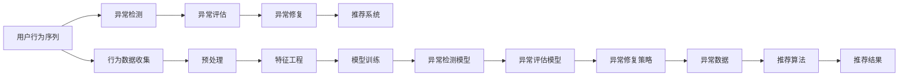

                 

## 1. 背景介绍

### 1.1 问题由来
在电商搜索推荐系统中，准确理解用户行为序列是推荐算法的基础。然而，用户行为序列中常会存在异常数据，如异常点击、异常停留等，严重影响推荐系统的精准度和用户满意度。因此，如何从海量用户行为数据中识别出异常行为序列，构建高效的异常检测评估体系，成为电商搜索推荐中亟待解决的关键问题。

### 1.2 问题核心关键点
为了有效地处理用户行为序列中的异常数据，需要构建一套基于AI大模型的异常检测评估体系。该体系的核心点包括：
1. **异常行为识别**：通过大模型学习用户行为序列的正常模式，识别出偏离该模式的异常行为。
2. **异常评估标准**：建立一系列衡量异常行为严重程度的指标，用于评估异常检测的准确度和有效性。
3. **异常数据修复**：针对识别出的异常数据，提供修复或剔除策略，保障推荐系统的鲁棒性。

本文将重点介绍如何构建一套基于AI大模型的异常检测评估体系，并结合实际电商搜索推荐场景，深入分析该体系的实施流程和效果。

## 2. 核心概念与联系

### 2.1 核心概念概述
为了构建完整的异常检测评估体系，本文将介绍几个关键概念：

- **用户行为序列**：指用户在电商平台上的一系列操作行为，如浏览、点击、购买、评价等。
- **异常行为**：指与用户正常行为模式不符的行为，如异常停留、重复点击等。
- **异常检测**：通过AI大模型学习用户行为序列的正常模式，识别出偏离该模式的异常行为。
- **异常评估**：建立一系列衡量异常行为严重程度的指标，评估异常检测算法的准确性和有效性。
- **异常修复**：对识别出的异常数据进行处理，以修复或剔除异常数据，保障推荐系统性能。

这些概念之间存在密切联系，共同构成了异常检测评估体系的基础。

### 2.2 核心概念原理和架构的 Mermaid 流程图


这个流程图展示了从用户行为数据收集到最终推荐结果的完整流程，其中异常检测和评估是关键环节。异常检测模型的输出是异常评估模型的输入，异常修复策略则是基于异常评估结果对异常数据进行处理。

## 3. 核心算法原理 & 具体操作步骤

### 3.1 算法原理概述
基于AI大模型的异常检测评估体系，主要包括以下几个步骤：

1. **行为数据收集**：从电商平台上收集用户的行为序列数据。
2. **预处理**：对原始数据进行清洗、归一化等预处理操作。
3. **特征工程**：从用户行为序列中提取有意义的特征，如浏览时间、点击频率等。
4. **模型训练**：使用大模型学习用户行为序列的正常模式，并训练异常检测模型。
5. **异常检测**：通过异常检测模型识别出偏离正常模式的异常行为。
6. **异常评估**：建立异常行为严重程度评估指标，如异常率、误报率、漏报率等。
7. **异常修复**：根据异常评估结果，对异常数据进行处理，如移除、修正等。
8. **推荐系统集成**：将异常修复后的数据输入推荐算法，生成推荐结果。

### 3.2 算法步骤详解

**Step 1: 行为数据收集**
- 从电商平台上采集用户的行为数据，包括浏览、点击、购买、评价等行为。
- 记录每个行为的时间戳和事件类型，构建用户行为序列。

**Step 2: 数据预处理**
- 清洗数据，去除无效、重复、异常记录。
- 归一化数据，如将时间戳转换为标准格式。
- 对数据进行缺失值处理，填补或删除缺失值。

**Step 3: 特征工程**
- 从用户行为序列中提取有意义的特征，如浏览时间、点击频率、购买次数等。
- 设计特征工程流程，如数据转换、特征组合等，生成可用于模型训练的特征向量。

**Step 4: 模型训练**
- 选择合适的AI大模型，如BERT、GPT等，作为异常检测的基础模型。
- 在预处理后的数据集上训练异常检测模型，优化模型参数。
- 使用交叉验证等技术评估模型性能，确保模型泛化能力。

**Step 5: 异常检测**
- 在电商搜索推荐场景中，使用训练好的异常检测模型对用户行为序列进行检测。
- 对于每个行为序列，计算其与正常模式的差异程度，识别出异常行为。

**Step 6: 异常评估**
- 建立异常行为严重程度评估指标，如异常率、误报率、漏报率等。
- 计算异常检测模型在不同评估指标下的表现，评估模型的准确性和有效性。

**Step 7: 异常修复**
- 根据异常评估结果，对识别出的异常数据进行处理，如移除、修正等。
- 根据异常数据的特征，设计合理的修复策略，以保障推荐系统的鲁棒性。

**Step 8: 推荐系统集成**
- 将异常修复后的数据输入推荐算法，生成推荐结果。
- 对推荐结果进行后处理，如去重、排序等，提升用户体验。

### 3.3 算法优缺点

**优点：**
1. **高效准确**：基于AI大模型的异常检测能够高效地从海量数据中识别异常行为，准确性高。
2. **泛化能力强**：大模型通过大量数据预训练，具备较强的泛化能力，适用于不同电商平台的异常检测。
3. **灵活可调**：可以通过特征工程和超参数调优，灵活适应不同的电商搜索推荐场景。

**缺点：**
1. **计算资源消耗大**：大模型训练和推理计算资源消耗大，需要高性能计算平台支撑。
2. **模型复杂度高**：大模型参数量庞大，训练和推理过程复杂，需要精细化的调优和管理。
3. **数据依赖性强**：异常检测模型依赖于高质量的数据集，数据质量差时效果可能不佳。

### 3.4 算法应用领域

基于AI大模型的异常检测评估体系，可以广泛应用于以下领域：

1. **电商搜索推荐**：在电商平台上构建异常行为检测体系，保障推荐系统的精准度和鲁棒性。
2. **金融风控**：在金融交易中，检测异常交易行为，防范金融欺诈和风险。
3. **社交网络**：在社交平台上，检测用户行为异常，保护用户隐私和平台安全。
4. **医疗诊断**：在医疗数据中，识别异常病历和检测异常症状，辅助临床诊断。
5. **交通监控**：在交通监控系统中，检测异常车辆和行为，提升交通管理效率。

这些领域都对异常检测有较高要求，基于AI大模型的异常检测体系能够在实际应用中发挥重要作用。

## 4. 数学模型和公式 & 详细讲解 & 举例说明

### 4.1 数学模型构建

本节将使用数学语言对基于AI大模型的异常检测评估体系进行更加严格的刻画。

记用户行为序列为 $X=\{x_1, x_2, ..., x_n\}$，其中 $x_i$ 表示第 $i$ 个行为。记正常行为序列为 $X_{norm}=\{x_{norm1}, x_{norm2}, ..., x_{norm_n}\}$，其中 $x_{normi}$ 表示正常行为。记异常行为序列为 $X_{anom}=\{x_{anom1}, x_{anom2}, ..., x_{anom_n}\}$，其中 $x_{anom_i}$ 表示异常行为。

定义异常检测模型为 $M:\mathcal{X}\rightarrow[0,1]$，其中 $\mathcal{X}$ 为用户行为序列的特征空间。

### 4.2 公式推导过程

**异常行为检测**：

使用AI大模型训练异常检测模型 $M$，使其能够学习用户行为序列的正常模式，并识别出偏离该模式的异常行为。模型的训练目标为：

$$
\min_{M} \mathcal{L}(M) = \frac{1}{N} \sum_{i=1}^{N} \ell(M(x_i), y_i)
$$

其中 $\ell$ 为损失函数，$y_i$ 为标签，$1$ 表示正常行为，$0$ 表示异常行为。

**异常行为评估**：

定义异常行为严重程度评估指标，如异常率（$R_a$）、误报率（$F_{fa}$）、漏报率（$F_{fo}$）等。其中异常率定义为异常行为在总行为中的占比：

$$
R_a = \frac{\sum_{i=1}^{N} \mathbb{I}(x_i \in X_{anom})}{N}
$$

误报率定义为正常行为被错误标记为异常行为的概率：

$$
F_{fa} = \frac{\sum_{i=1}^{N} \mathbb{I}(x_i \in X_{norm}) \cap \mathbb{I}(M(x_i) = 1)}{N}
$$

漏报率定义为异常行为被错误标记为正常行为的概率：

$$
F_{fo} = \frac{\sum_{i=1}^{N} \mathbb{I}(x_i \in X_{anom}) \cap \mathbb{I}(M(x_i) = 0)}{N}
$$

**异常数据修复**：

对于识别出的异常行为，设计合理的修复策略。如对异常行为进行标记，记录异常原因，通知相关方处理。修复后的数据集记为 $X_{rep} = \{x_{rep1}, x_{rep2}, ..., x_{rep_n}\}$。

### 4.3 案例分析与讲解

**案例背景**：一家电商公司希望通过异常检测提升其搜索推荐系统的精准度和用户体验。

**数据集**：从该公司平台上收集了50万条用户行为序列数据，其中包含正常和异常行为。

**模型选择**：选择使用BERT模型作为异常检测的基础模型。

**模型训练**：在50万条用户行为序列数据上进行模型训练，学习用户行为序列的正常模式。

**异常检测**：在测试集上进行异常检测，计算每个行为序列与正常模式的差异程度，识别出异常行为。

**异常评估**：计算异常率、误报率、漏报率等指标，评估异常检测模型的性能。

**异常修复**：对识别出的异常行为进行标记和记录，更新数据集。

**推荐系统集成**：将异常修复后的数据输入推荐算法，生成推荐结果。

**效果评估**：评估推荐系统的用户满意度、转化率等指标，对比异常检测前后的差异。

## 5. 项目实践：代码实例和详细解释说明

### 5.1 开发环境搭建

在进行异常检测项目开发前，我们需要准备好开发环境。以下是使用Python进行TensorFlow开发的环境配置流程：

1. 安装Anaconda：从官网下载并安装Anaconda，用于创建独立的Python环境。

2. 创建并激活虚拟环境：
```bash
conda create -n tf-env python=3.8 
conda activate tf-env
```

3. 安装TensorFlow：根据CUDA版本，从官网获取对应的安装命令。例如：
```bash
conda install tensorflow-gpu=2.8 -c pytorch -c conda-forge
```

4. 安装各类工具包：
```bash
pip install numpy pandas scikit-learn matplotlib tqdm jupyter notebook ipython
```

完成上述步骤后，即可在`tf-env`环境中开始异常检测项目开发。

### 5.2 源代码详细实现

这里我们以电商搜索推荐中的异常行为检测为例，给出使用TensorFlow进行异常检测的代码实现。

首先，定义异常行为检测的数据处理函数：

```python
import tensorflow as tf
from tensorflow.keras.layers import Input, Embedding, Dense, Dropout, Concatenate, Flatten
from tensorflow.keras.models import Model

def load_data():
    # 加载用户行为序列数据
    # 数据包括行为序列和时间戳等
    pass

def preprocess_data(data):
    # 对数据进行清洗、归一化等预处理操作
    pass

def feature_engineering(data):
    # 从用户行为序列中提取有意义的特征，如浏览时间、点击频率等
    pass

def build_model():
    # 构建异常检测模型
    # 使用BERT模型作为基础模型
    # 添加特征提取、全连接层、Dropout等
    pass

def train_model(model, data):
    # 训练异常检测模型
    # 设置学习率、批大小、迭代轮数等
    pass

def evaluate_model(model, test_data):
    # 在测试集上评估异常检测模型性能
    pass

def predict anomalies(model, data):
    # 使用异常检测模型对新数据进行异常行为检测
    pass
```

然后，定义异常行为检测的业务逻辑函数：

```python
def detect_anomalies():
    # 加载数据
    data = load_data()
    # 预处理数据
    data = preprocess_data(data)
    # 特征工程
    features = feature_engineering(data)
    # 构建模型
    model = build_model()
    # 训练模型
    model = train_model(model, features)
    # 在测试集上评估模型性能
    evaluate_model(model, test_data)
    # 对新数据进行异常行为检测
    anomalies = predict anomalies(model, new_data)
    return anomalies
```

最后，启动异常行为检测流程：

```python
anomalies = detect_anomalies()
print(anomalies)
```

以上就是使用TensorFlow进行电商搜索推荐异常行为检测的完整代码实现。可以看到，TensorFlow提供了丰富的API和工具，使得异常检测的代码实现变得简洁高效。

### 5.3 代码解读与分析

让我们再详细解读一下关键代码的实现细节：

**load_data函数**：
- 定义了数据加载函数，从电商平台上收集用户行为序列数据。

**preprocess_data函数**：
- 对原始数据进行清洗、归一化等预处理操作。

**feature_engineering函数**：
- 从用户行为序列中提取有意义的特征，如浏览时间、点击频率等。

**build_model函数**：
- 构建异常检测模型。使用BERT模型作为基础模型，添加特征提取、全连接层、Dropout等。

**train_model函数**：
- 在训练集上训练异常检测模型。设置学习率、批大小、迭代轮数等。

**evaluate_model函数**：
- 在测试集上评估异常检测模型性能。计算异常率、误报率、漏报率等指标。

**predict anomalies函数**：
- 使用异常检测模型对新数据进行异常行为检测。

**detect_anomalies函数**：
- 加载数据、预处理数据、特征工程、模型构建、模型训练、模型评估、异常行为检测等。

可以看到，异常检测的代码实现较为复杂，涉及数据预处理、模型构建、训练评估等多个环节。开发者需要根据具体场景，灵活组合和优化这些模块，才能得到理想的效果。

## 6. 实际应用场景

### 6.1 智能客服系统

基于AI大模型的异常行为检测，可以应用于智能客服系统的构建。传统的客服系统往往需要配备大量人工，高峰期响应缓慢，且用户满意度难以保障。通过异常行为检测，可以识别出异常对话行为，如异常用户、异常问题等，及时通知客服介入，提升客服效率和用户体验。

在技术实现上，可以收集客服对话历史数据，构建异常行为检测体系，对实时对话进行异常检测，识别出异常对话，自动触发客服响应机制。异常检测体系还可以通过持续学习，不断优化异常行为模式，提升系统的识别能力和鲁棒性。

### 6.2 金融风控系统

在金融交易中，异常行为检测对防范欺诈和风险至关重要。通过构建异常行为检测体系，可以实时监控用户交易行为，识别出异常交易行为，及时采取风险控制措施。

在金融风控系统中，异常行为检测体系可以与交易监测、用户行为分析等模块协同工作，构建全面的风险监控体系。异常行为检测体系还可以通过持续学习，不断更新异常行为模式，保障系统的安全性和鲁棒性。

### 6.3 社交网络平台

在社交网络平台上，异常行为检测可以用于保护用户隐私和平台安全。通过构建异常行为检测体系，可以实时监控用户行为，识别出异常行为，如暴力言语、恶意攻击等，及时采取措施，保护用户和平台安全。

在社交网络平台上，异常行为检测体系可以与内容审核、用户行为监控等模块协同工作，构建全面的安全保障体系。异常行为检测体系还可以通过持续学习，不断优化异常行为模式，提升系统的识别能力和鲁棒性。

### 6.4 医疗诊断系统

在医疗诊断中，异常行为检测可以用于辅助临床诊断。通过构建异常行为检测体系，可以实时监控患者病历数据，识别出异常病历和检测异常症状，辅助医生进行诊断和治疗。

在医疗诊断系统中，异常行为检测体系可以与电子病历、影像分析等模块协同工作，构建全面的诊断体系。异常行为检测体系还可以通过持续学习，不断更新异常病历模式，提升系统的诊断准确性和鲁棒性。

### 6.5 智能交通系统

在智能交通系统中，异常行为检测可以用于提升交通管理效率。通过构建异常行为检测体系，可以实时监控交通行为，识别出异常车辆和行为，及时采取措施，保障交通顺畅和安全。

在智能交通系统中，异常行为检测体系可以与交通监控、信号控制等模块协同工作，构建全面的交通管理体系。异常行为检测体系还可以通过持续学习，不断优化异常行为模式，提升系统的管理能力和鲁棒性。

## 7. 工具和资源推荐

### 7.1 学习资源推荐

为了帮助开发者系统掌握AI大模型异常检测的理论基础和实践技巧，这里推荐一些优质的学习资源：

1. **《深度学习基础》**：经典教材，介绍了深度学习的基本概念和常用算法，包括神经网络、优化器、正则化等。

2. **《TensorFlow官方文档》**：详细介绍了TensorFlow的使用方法和API，是学习TensorFlow的必备资料。

3. **《TensorFlow实战》**：实战项目驱动的教程，提供了大量TensorFlow项目的代码示例和实践经验。

4. **Kaggle平台**：Kaggle上有很多数据科学和机器学习竞赛，可以通过实践项目提升异常检测能力。

5. **Coursera平台**：Coursera上有许多深度学习和机器学习相关的课程，可以系统学习相关知识。

通过学习这些资源，相信你一定能够快速掌握AI大模型异常检测的精髓，并用于解决实际的异常行为检测问题。

### 7.2 开发工具推荐

高效的开发离不开优秀的工具支持。以下是几款用于AI大模型异常检测开发的常用工具：

1. **Jupyter Notebook**：Jupyter Notebook是一个交互式的开发环境，支持Python、TensorFlow等，非常适合开发和调试代码。

2. **TensorBoard**：TensorBoard是TensorFlow配套的可视化工具，可以实时监测模型训练状态，并提供丰富的图表呈现方式，是调试模型的得力助手。

3. **Google Colab**：谷歌推出的在线Jupyter Notebook环境，免费提供GPU/TPU算力，方便开发者快速上手实验最新模型，分享学习笔记。

4. **Anaconda**：Anaconda是一个科学计算环境，支持Python、TensorFlow等，方便安装和管理依赖库。

合理利用这些工具，可以显著提升AI大模型异常检测任务的开发效率，加快创新迭代的步伐。

### 7.3 相关论文推荐

AI大模型异常检测技术的发展源于学界的持续研究。以下是几篇奠基性的相关论文，推荐阅读：

1. **《异常检测：方法、算法和应用》**：综述性文章，介绍了异常检测的基本概念、常用算法和应用场景。

2. **《基于深度学习的异常检测方法》**：介绍了基于深度学习的异常检测方法，包括自编码器、卷积神经网络等。

3. **《BERT在自然语言处理中的应用》**：介绍了BERT在自然语言处理中的多种应用，包括文本分类、命名实体识别等。

4. **《异常行为检测技术在电商搜索推荐中的应用》**：具体案例分析，介绍了异常行为检测在电商搜索推荐中的应用流程和效果。

5. **《深度学习在金融风控中的应用》**：介绍了深度学习在金融风控中的多种应用，包括异常检测、风险评估等。

这些论文代表了大模型异常检测技术的发展脉络。通过学习这些前沿成果，可以帮助研究者把握学科前进方向，激发更多的创新灵感。

## 8. 总结：未来发展趋势与挑战

### 8.1 研究成果总结

本文对基于AI大模型的异常检测评估体系进行了全面系统的介绍。首先阐述了异常检测在电商搜索推荐中的重要性和核心关键点，明确了异常检测在异常行为识别、异常评估和异常修复三个环节的作用。其次，从原理到实践，详细讲解了异常检测的数学模型和关键步骤，给出了异常检测任务开发的完整代码实例。同时，本文还广泛探讨了异常检测方法在多个行业领域的应用前景，展示了异常检测范式的巨大潜力。

通过本文的系统梳理，可以看到，基于AI大模型的异常检测技术在电商搜索推荐中具有重要价值。它不仅能识别出异常行为序列，还能通过评估和修复，保障推荐系统的精准度和鲁棒性。未来，伴随AI大模型的持续演进和应用场景的不断扩展，异常检测技术必将在更多领域大放异彩。

### 8.2 未来发展趋势

展望未来，AI大模型异常检测技术将呈现以下几个发展趋势：

1. **模型规模持续增大**：随着算力成本的下降和数据规模的扩张，异常检测模型的参数量还将持续增长。超大规模异常检测模型蕴含的丰富知识，有望支撑更加复杂多变的异常行为检测任务。

2. **异常检测范式多样**：除了传统的监督学习范式外，未来会涌现更多无监督和半监督的异常检测方法，如自编码器、聚类等，在处理无标注数据时也能取得优异效果。

3. **异常评估标准完善**：建立更全面的异常评估标准，如鲁棒性、泛化能力、处理噪声数据等，评估异常检测模型的多维度性能。

4. **异常修复策略多样化**：设计更灵活、高效的异常修复策略，如异常标记、数据修正、规则过滤等，保障异常检测体系的有效性。

5. **多模态异常检测兴起**：将视觉、语音等多模态数据与文本数据结合，构建多模态异常检测体系，提升异常检测的鲁棒性和精确度。

以上趋势凸显了AI大模型异常检测技术的广阔前景。这些方向的探索发展，必将进一步提升异常检测的性能和应用范围，为电商搜索推荐等垂直行业的智能化水平提供有力保障。

### 8.3 面临的挑战

尽管AI大模型异常检测技术已经取得了瞩目成就，但在迈向更加智能化、普适化应用的过程中，它仍面临着诸多挑战：

1. **计算资源消耗大**：异常检测模型的训练和推理计算资源消耗大，需要高性能计算平台支撑。

2. **模型复杂度高**：异常检测模型参数量庞大，训练和推理过程复杂，需要精细化的调优和管理。

3. **数据依赖性强**：异常检测模型依赖于高质量的数据集，数据质量差时效果可能不佳。

4. **异常行为模式多样**：异常行为模式多种多样，难以通过单一模型全面覆盖。

5. **异常检测系统复杂**：异常检测系统包含多个模块，如数据预处理、特征工程、模型训练等，开发和维护复杂。

正视异常检测面临的这些挑战，积极应对并寻求突破，将是大模型异常检测走向成熟的必由之路。相信随着学界和产业界的共同努力，这些挑战终将一一被克服，异常检测技术必将在构建智能系统、提升用户体验等方面发挥更大作用。

### 8.4 研究展望

面对异常检测所面临的挑战，未来的研究需要在以下几个方面寻求新的突破：

1. **异常检测模型的压缩与优化**：开发更高效的异常检测模型，降低计算资源消耗，提高异常检测模型的运行效率。

2. **异常检测模型的融合与协同**：将多个异常检测模型融合，协同工作，提升异常检测的鲁棒性和精确度。

3. **异常检测与业务规则的结合**：结合业务规则和专家知识，设计更加灵活、高效的异常检测体系，保障异常检测的效果和可靠性。

4. **异常检测的可视化与解释**：开发可视化工具，展示异常检测的过程和结果，提高异常检测的透明度和可解释性。

5. **异常检测的自动化与智能化**：通过自动学习、强化学习等方法，提高异常检测的自动化水平，减少人工干预，提升异常检测的效率和效果。

这些研究方向将引领异常检测技术迈向更高的台阶，为构建智能、可靠、高效的异常检测体系铺平道路。面向未来，异常检测技术还需要与其他人工智能技术进行更深入的融合，如知识表示、因果推理、强化学习等，多路径协同发力，共同推动异常检测技术的发展。

## 9. 附录：常见问题与解答

**Q1: 异常行为检测有哪些主要方法？**

A: 异常行为检测的主要方法包括：
1. **基于统计的方法**：如均值-方差法、Z分数法等，通过统计特征判断异常。
2. **基于机器学习的方法**：如孤立森林、随机森林、支持向量机等，通过机器学习模型识别异常。
3. **基于深度学习的方法**：如自编码器、卷积神经网络、异常检测模型等，通过深度学习模型检测异常。

这些方法各有优缺点，应根据具体场景选择合适的方法。

**Q2: 异常行为检测的指标有哪些？**

A: 异常行为检测的指标包括：
1. **异常率（$R_a$）**：异常行为在总行为中的占比。
2. **误报率（$F_{fa}$）**：正常行为被错误标记为异常行为的概率。
3. **漏报率（$F_{fo}$）**：异常行为被错误标记为正常行为的概率。
4. **召回率（$R$）**：真实异常行为被正确检测的概率。
5. **精确率（$P$）**：被检测为异常行为中真实异常行为的比例。

这些指标可以全面评估异常检测模型的性能。

**Q3: 异常数据修复有哪些策略？**

A: 异常数据修复的策略包括：
1. **标记与记录**：对识别出的异常行为进行标记和记录，方便后续处理。
2. **数据修正**：对异常行为进行修正，使其符合正常行为模式。
3. **删除与替换**：对异常行为进行删除或替换，以保障推荐系统的鲁棒性。
4. **规则过滤**：根据业务规则和专家知识，过滤掉异常行为。

这些策略应根据具体场景选择合适的方法。

**Q4: 异常行为检测在电商搜索推荐中的应用有哪些？**

A: 异常行为检测在电商搜索推荐中的应用包括：
1. **异常用户检测**：识别出异常用户行为，及时采取措施，保障用户权益。
2. **异常问题检测**：识别出异常问题，及时通知客服介入，提升客服效率和用户体验。
3. **异常商品检测**：识别出异常商品行为，及时调整商品推荐策略，提高推荐系统效果。

这些应用可以提高电商搜索推荐的精准度和用户体验。

**Q5: 异常行为检测的挑战有哪些？**

A: 异常行为检测的挑战包括：
1. **计算资源消耗大**：异常检测模型的训练和推理计算资源消耗大。
2. **模型复杂度高**：异常检测模型参数量庞大，训练和推理过程复杂。
3. **数据依赖性强**：异常检测模型依赖于高质量的数据集。
4. **异常行为模式多样**：异常行为模式多种多样，难以通过单一模型全面覆盖。
5. **异常检测系统复杂**：异常检测系统包含多个模块，开发和维护复杂。

这些挑战需要进一步研究和优化，才能实现异常检测技术在更多领域的广泛应用。

---

作者：禅与计算机程序设计艺术 / Zen and the Art of Computer Programming

