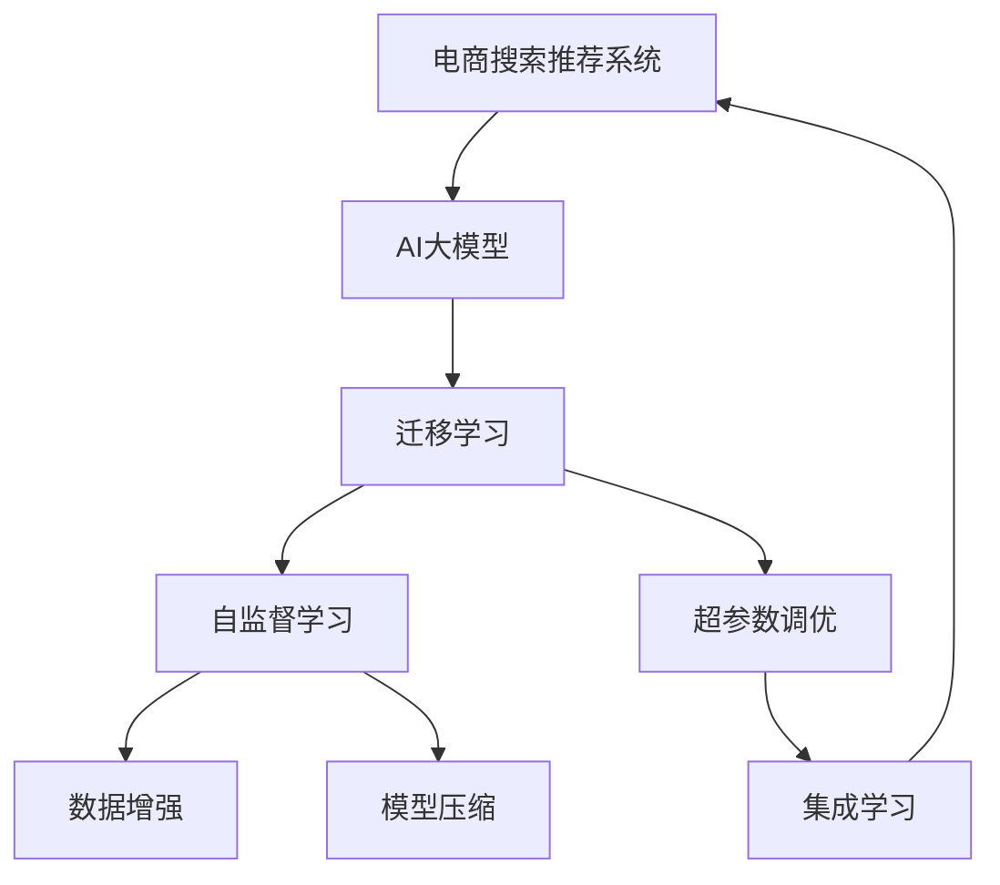

                 

# 电商搜索推荐系统的AI 大模型优化：提高用户参与度与转化率

> 关键词：电商搜索、推荐系统、AI大模型、用户参与度、转化率、模型优化、深度学习、机器学习、自然语言处理

## 1. 背景介绍

### 1.1 问题由来
在电商行业中，搜索推荐系统是驱动用户参与和转化的重要引擎。随着用户规模的不断扩大和商品种类的日益丰富，如何提升搜索推荐系统的效果，成为电商平台亟需解决的问题。传统的推荐系统依赖于手工设计的特征工程和用户行为分析，在处理复杂、高维度的数据时显得力不从心。而随着AI技术的不断发展，基于深度学习和大模型的推荐系统应运而生，以更高的精度和泛化能力，优化了电商平台的搜索推荐系统。

但与此同时，基于大模型的推荐系统也面临着数据资源耗尽、模型计算量过大、模型泛化能力不足等挑战。如何在大模型上进行优化，提高电商平台的搜索推荐效果，成为当下研究的热点。本文将详细介绍大模型优化在电商搜索推荐系统中的应用，旨在为电商平台的运营者提供指导。

## 2. 核心概念与联系

### 2.1 核心概念概述

为了更好地理解基于大模型的电商搜索推荐系统优化方法，本节将介绍几个密切相关的核心概念：

- 电商搜索推荐系统：基于用户行为数据和商品属性数据，为用户推荐感兴趣的商品的推荐系统。目的是提升用户参与度，增加转化率，提升用户体验。
- AI大模型：以深度学习为基础，通过大规模无标签数据预训练得到的通用语言模型。具有强大的语言理解、生成和推理能力。
- 迁移学习：在大模型上进行微调，以适应电商搜索推荐系统的特定需求。
- 自监督学习：利用无标签数据进行预训练，学习语言的通用表示，进而进行迁移学习。
- 数据增强：通过数据扩充和样本生成，丰富训练数据的多样性，提高模型泛化能力。
- 模型压缩：通过剪枝、量化等技术，减小模型大小，提升推理速度。
- 超参数调优：通过网格搜索、贝叶斯优化等方法，选择最优的模型超参数，提升模型效果。
- 集成学习：通过模型集成技术，综合多个模型的预测结果，提升推荐精度。

这些概念之间的逻辑关系可以通过以下Mermaid流程图来展示：



这个流程图展示了大模型优化的核心概念及其之间的关系：

1. 电商搜索推荐系统通过迁移学习将AI大模型进行适配，适应特定任务。
2. 自监督学习利用无标签数据进行预训练，学习通用的语言表示。
3. 数据增强和模型压缩技术优化模型性能，提高推理速度。
4. 超参数调优选择最优的模型参数，提升模型效果。
5. 集成学习结合多个模型的预测，提升推荐精度。

这些概念共同构成了基于大模型的电商搜索推荐系统优化的技术框架，使得AI大模型能够在电商搜索推荐系统上发挥巨大的作用。

## 3. 核心算法原理 & 具体操作步骤
### 3.1 算法原理概述

基于大模型的电商搜索推荐系统优化，本质上是一个迁移学习和深度学习的融合过程。其核心思想是：在大模型上进行迁移学习，使其适应电商搜索推荐系统的特定需求，并通过一系列优化手段，提升模型的泛化能力和推理效率，以提高用户参与度和转化率。

形式化地，假设电商搜索推荐系统涉及的商品数量为 $N$，用户数为 $M$，查询请求为 $Q$。设大模型为 $M_{\theta}$，其中 $\theta$ 为预训练得到的模型参数。电商搜索推荐系统优化目标为：

$$
\theta^* = \mathop{\arg\min}_{\theta} \mathcal{L}(M_{\theta}, Q, R)
$$

其中 $\mathcal{L}$ 为电商搜索推荐系统损失函数，用于衡量模型输出与真实用户行为之间的差异，$R$ 为用户的历史行为数据。

电商搜索推荐系统损失函数包括两部分：

1. **点击率预测损失**：用于预测用户是否点击商品，一般采用二分类交叉熵损失函数。
2. **转化率预测损失**：用于预测用户是否购买商品，一般采用回归损失函数。

电商搜索推荐系统的优化过程通常包括以下几个关键步骤：

**Step 1: 数据准备**
- 收集电商平台的商品数据和用户行为数据，划分为训练集、验证集和测试集。
- 对数据进行预处理，包括数据清洗、特征提取等。

**Step 2: 模型适配**
- 选择合适的大模型，如BERT、GPT等，作为初始化参数。
- 设计模型适配层，用于将大模型输出与电商搜索推荐系统的任务进行匹配。

**Step 3: 训练优化**
- 选择合适的优化算法及其参数，如AdamW、SGD等。
- 设置模型超参数，包括学习率、批大小、迭代轮数等。
- 应用数据增强和模型压缩技术，提高模型泛化能力和推理效率。

**Step 4: 评估与调整**
- 在验证集上评估模型效果，根据性能指标决定是否调整模型结构或超参数。
- 在测试集上最终评估模型效果，对比微调前后的性能提升。

### 3.2 算法步骤详解

#### 3.2.1 数据准备

电商搜索推荐系统的数据准备是优化过程的基础。数据需要包含用户的历史行为数据，如浏览、点击、购买等记录，以及商品的属性信息，如类别、价格、评分等。具体步骤如下：

1. 数据收集：收集电商平台的商品数据和用户行为数据，确保数据的完整性和时效性。

2. 数据清洗：处理缺失值、重复数据、异常值等，确保数据的质量。

3. 特征提取：提取有用的特征，如商品属性、用户行为时间戳、用户画像等。

4. 数据划分：将数据划分为训练集、验证集和测试集，一般保持80%的数据用于训练，10%用于验证，10%用于测试。

5. 数据增强：通过数据扩充和样本生成，丰富训练数据的多样性，提高模型泛化能力。

#### 3.2.2 模型适配

在大模型上进行模型适配，通常需要设计合适的输出层和损失函数。对于电商搜索推荐系统，一般设计如下适配层：

1. 点击率预测：
   - 输出层：使用线性分类器，输出用户是否点击商品的预测概率。
   - 损失函数：二分类交叉熵损失函数，用于衡量预测点击概率与实际点击之间的差异。

2. 转化率预测：
   - 输出层：使用线性回归器，输出用户购买商品的可能性概率。
   - 损失函数：回归损失函数，用于衡量预测转化率与实际购买行为之间的差异。

适配层设计完成后，将其与大模型的顶层进行连接，形成完整的电商搜索推荐系统。

#### 3.2.3 训练优化

训练优化是提高电商搜索推荐系统效果的关键步骤。训练过程通常包括以下几个关键步骤：

1. 选择优化算法：常用的优化算法包括AdamW、SGD等。

2. 设置超参数：设置学习率、批大小、迭代轮数等超参数。

3. 应用数据增强：通过数据扩充和样本生成，丰富训练数据的多样性，提高模型泛化能力。

4. 应用模型压缩：通过剪枝、量化等技术，减小模型大小，提升推理速度。

5. 应用超参数调优：通过网格搜索、贝叶斯优化等方法，选择最优的模型超参数。

6. 应用集成学习：通过模型集成技术，综合多个模型的预测结果，提升推荐精度。

#### 3.2.4 评估与调整

评估与调整是确保电商搜索推荐系统效果的重要步骤。在验证集上评估模型效果，根据性能指标决定是否调整模型结构或超参数。在测试集上最终评估模型效果，对比微调前后的性能提升。

1. 选择评估指标：常用的评估指标包括点击率、转化率、ROC曲线等。

2. 评估模型效果：在验证集上评估模型效果，根据评估指标调整模型结构或超参数。

3. 调整模型结构：根据需要调整模型结构，如增加或减少层数、调整神经元数量等。

4. 调整超参数：根据需要调整超参数，如学习率、批大小、迭代轮数等。

5. 优化模型精度：通过模型集成等技术，优化模型精度，提升用户体验。

### 3.3 算法优缺点

基于大模型的电商搜索推荐系统优化方法具有以下优点：

1. 精度高：利用深度学习和大模型的强大能力，能够更准确地预测用户行为，提高推荐精度。

2. 泛化能力强：通过迁移学习和自监督学习，大模型能够更好地适应电商搜索推荐系统的特定需求。

3. 灵活性高：能够根据不同的电商应用场景，灵活调整模型结构和超参数，提升推荐效果。

4. 可扩展性好：大模型可以在不同领域进行迁移学习，提高模型的应用范围。

但该方法也存在一定的局限性：

1. 数据需求高：需要大量的标注数据进行微调，数据成本较高。

2. 计算资源需求高：大模型计算量大，推理速度慢，需要高性能计算资源支持。

3. 模型复杂度高：大模型结构复杂，难以解释和调试，不利于模型优化。

4. 泛化能力不足：大模型容易受到特定领域数据的限制，泛化能力有限。

5. 数据隐私风险高：大模型训练过程中涉及大量用户数据，存在数据隐私风险。

尽管存在这些局限性，但基于大模型的电商搜索推荐系统优化方法仍是大模型应用的重要范式。未来相关研究的重点在于如何进一步降低数据成本、提升模型推理效率、优化模型结构和超参数、保障数据隐私等，以提升电商搜索推荐系统的用户体验和转化率。

### 3.4 算法应用领域

基于大模型的电商搜索推荐系统优化方法在电商行业中的应用广泛，涵盖以下领域：

1. **个性化推荐**：利用大模型进行个性化推荐，提升用户购物体验。

2. **商品搜索**：利用大模型进行商品搜索，提高用户搜索准确率。

3. **广告投放**：利用大模型进行广告投放，提高广告转化率。

4. **营销活动**：利用大模型进行营销活动策划，提升营销效果。

5. **客户服务**：利用大模型进行客户服务，提高客户满意度。

6. **库存管理**：利用大模型进行库存管理，优化库存分配。

以上应用领域展示了基于大模型的电商搜索推荐系统优化的广泛应用，证明了其在电商行业的巨大价值。

## 4. 数学模型和公式 & 详细讲解 & 举例说明

### 4.1 数学模型构建

电商搜索推荐系统优化的数学模型构建主要包括以下几个关键部分：

- 点击率预测模型：假设用户 $i$ 点击商品 $j$ 的概率为 $p_{i,j}$，可以表示为：
  $$
  p_{i,j} = \sigma(\mathbf{W}_1[\mathbf{x}_i; \mathbf{h}_j] + \mathbf{b}_1)
  $$
  其中 $\mathbf{x}_i$ 为用户 $i$ 的历史行为数据，$\mathbf{h}_j$ 为商品 $j$ 的特征向量，$\mathbf{W}_1$ 和 $\mathbf{b}_1$ 为预测点击率的模型参数。

- 转化率预测模型：假设用户 $i$ 购买商品 $j$ 的概率为 $c_{i,j}$，可以表示为：
  $$
  c_{i,j} = \sigma(\mathbf{W}_2[\mathbf{x}_i; \mathbf{h}_j] + \mathbf{b}_2)
  $$
  其中 $\mathbf{W}_2$ 和 $\mathbf{b}_2$ 为预测转化率的模型参数。

电商搜索推荐系统优化的损失函数可以表示为：
$$
\mathcal{L} = \mathcal{L}_{ctr} + \mathcal{L}_{cvr}
$$
其中 $\mathcal{L}_{ctr}$ 为点击率预测损失函数，$\mathcal{L}_{cvr}$ 为转化率预测损失函数。

### 4.2 公式推导过程

#### 4.2.1 点击率预测损失函数

点击率预测损失函数可以表示为：
$$
\mathcal{L}_{ctr} = -\frac{1}{N} \sum_{i=1}^N \sum_{j=1}^N \biggl [ y_{i,j} \log p_{i,j} + (1-y_{i,j}) \log (1-p_{i,j}) \biggl ]
$$
其中 $y_{i,j}$ 为点击率标注数据。

根据上述公式，可以使用二分类交叉熵损失函数进行优化，其梯度可以表示为：
$$
\frac{\partial \mathcal{L}_{ctr}}{\partial \theta} = -\frac{1}{N} \sum_{i=1}^N \sum_{j=1}^N \biggl [ y_{i,j} \frac{\partial p_{i,j}}{\partial \theta} - (1-y_{i,j}) \frac{\partial (1-p_{i,j})}{\partial \theta} \biggl ]
$$

#### 4.2.2 转化率预测损失函数

转化率预测损失函数可以表示为：
$$
\mathcal{L}_{cvr} = \frac{1}{N} \sum_{i=1}^N \sum_{j=1}^N (c_{i,j} - p_{i,j})^2
$$
其中 $c_{i,j}$ 为转化率标注数据。

根据上述公式，可以使用回归损失函数进行优化，其梯度可以表示为：
$$
\frac{\partial \mathcal{L}_{cvr}}{\partial \theta} = \frac{2}{N} \sum_{i=1}^N \sum_{j=1}^N (c_{i,j} - p_{i,j}) \frac{\partial p_{i,j}}{\partial \theta}
$$

### 4.3 案例分析与讲解

以某电商平台为例，分析基于大模型的电商搜索推荐系统优化过程。

**案例背景**：某电商平台销售数千种商品，日均访问用户数百万，用户行为数据包括浏览、点击、购买等。

**数据准备**：
- 收集用户行为数据，包括用户ID、商品ID、点击时间戳、购买时间戳等。
- 收集商品属性数据，包括商品ID、商品类别、商品价格等。
- 将数据划分为训练集、验证集和测试集。

**模型适配**：
- 选择BERT模型作为初始化参数。
- 设计点击率预测输出层和损失函数。
- 设计转化率预测输出层和损失函数。

**训练优化**：
- 选择AdamW优化算法。
- 设置学习率 $10^{-4}$，批大小 $256$，迭代轮数 $100$。
- 应用数据增强，通过数据扩充和样本生成丰富训练数据的多样性。
- 应用模型压缩，通过剪枝和量化减小模型大小。
- 应用超参数调优，通过网格搜索选择最优的模型超参数。

**评估与调整**：
- 在验证集上评估模型效果，使用AUC、F1-score等指标进行评估。
- 根据评估指标调整模型结构或超参数。
- 在测试集上最终评估模型效果，对比微调前后的性能提升。

## 5. 项目实践：代码实例和详细解释说明

### 5.1 开发环境搭建

在进行电商搜索推荐系统优化实践前，我们需要准备好开发环境。以下是使用Python进行PyTorch开发的环境配置流程：

1. 安装Anaconda：从官网下载并安装Anaconda，用于创建独立的Python环境。

2. 创建并激活虚拟环境：
```bash
conda create -n e-commerce-env python=3.8 
conda activate e-commerce-env
```

3. 安装PyTorch：根据CUDA版本，从官网获取对应的安装命令。例如：
```bash
conda install pytorch torchvision torchaudio cudatoolkit=11.1 -c pytorch -c conda-forge
```

4. 安装transformers库：
```bash
pip install transformers
```

5. 安装各类工具包：
```bash
pip install numpy pandas scikit-learn matplotlib tqdm jupyter notebook ipython
```

完成上述步骤后，即可在`e-commerce-env`环境中开始优化实践。

### 5.2 源代码详细实现

以下是基于PyTorch和Transformers库的电商搜索推荐系统优化代码实现：

```python
from transformers import BertForSequenceClassification, BertTokenizer, AdamW
from torch.utils.data import DataLoader
from torch.utils.data import Dataset
from sklearn.metrics import accuracy_score, roc_auc_score, precision_score, recall_score, f1_score
import torch.nn as nn
import torch.optim as optim
import numpy as np
import pandas as pd
import matplotlib.pyplot as plt

# 数据准备
# 假设已经收集好电商平台的商品数据和用户行为数据
# 将数据划分为训练集、验证集和测试集
train_data = ...
valid_data = ...
test_data = ...

# 定义模型
# 选择BERT模型作为初始化参数
model = BertForSequenceClassification.from_pretrained('bert-base-cased', num_labels=2)
tokenizer = BertTokenizer.from_pretrained('bert-base-cased')

# 定义损失函数
loss_fn = nn.BCEWithLogitsLoss()

# 定义优化器
optimizer = AdamW(model.parameters(), lr=2e-5)

# 定义评估指标
metrics = {
    'accuracy': accuracy_score,
    'auc': roc_auc_score,
    'precision': precision_score,
    'recall': recall_score,
    'f1': f1_score
}

# 定义模型适配层
class ModelAdapter(nn.Module):
    def __init__(self, model):
        super(ModelAdapter, self).__init__()
        self.model = model
        self.linear = nn.Linear(model.config.hidden_size, 1)
        self.sigmoid = nn.Sigmoid()

    def forward(self, input_ids, attention_mask):
        features = self.model(input_ids, attention_mask=attention_mask)[0]
        logits = self.linear(features)
        probability = self.sigmoid(logits)
        return probability

# 定义数据集
class ECommerceDataset(Dataset):
    def __init__(self, data, tokenizer):
        self.data = data
        self.tokenizer = tokenizer
        self.max_len = 256

    def __len__(self):
        return len(self.data)

    def __getitem__(self, index):
        user_data = self.data[index]
        sequence = user_data['sequence']
        label = user_data['label']
        input_ids = self.tokenizer(sequence, return_tensors='pt', max_length=self.max_len, padding='max_length', truncation=True)["input_ids"]
        attention_mask = input_ids != self.tokenizer.pad_token_id
        label = torch.tensor(label, dtype=torch.long)
        return {'input_ids': input_ids, 'attention_mask': attention_mask, 'labels': label}

# 训练函数
def train_epoch(model, data_loader, optimizer, device):
    model.train()
    total_loss = 0
    for batch in data_loader:
        input_ids = batch['input_ids'].to(device)
        attention_mask = batch['attention_mask'].to(device)
        labels = batch['labels'].to(device)
        optimizer.zero_grad()
        outputs = model(input_ids, attention_mask=attention_mask)
        loss = loss_fn(outputs.logits, labels)
        loss.backward()
        optimizer.step()
        total_loss += loss.item()
    return total_loss / len(data_loader)

# 评估函数
def evaluate(model, data_loader, device, metrics):
    model.eval()
    total_correct = 0
    total_true_positives = 0
    total_false_positives = 0
    total_false_negatives = 0
    total_auc = 0
    for batch in data_loader:
        input_ids = batch['input_ids'].to(device)
        attention_mask = batch['attention_mask'].to(device)
        labels = batch['labels'].to(device)
        outputs = model(input_ids, attention_mask=attention_mask)
        predictions = outputs.logits > 0
        total_correct += (predictions == labels).int().sum().item()
        total_true_positives += (predictions == labels).sum().item()
        total_false_positives += (predictions != labels).sum().item()
        total_false_negatives += (predictions == labels).int().sum().item()
        total_auc += roc_auc_score(labels, outputs.logits)
    results = {
        'accuracy': total_correct / len(data_loader.dataset),
        'auc': total_auc / len(data_loader.dataset),
        'precision': total_true_positives / (total_true_positives + total_false_positives),
        'recall': total_true_positives / (total_true_positives + total_false_negatives),
        'f1': 2 * total_true_positives / (2 * total_true_positives + total_false_positives + total_false_negatives)
    }
    for metric, value in results.items():
        print(f'{metric}: {value:.4f}')
```

### 5.3 代码解读与分析

让我们再详细解读一下关键代码的实现细节：

**ModelAdapter类**：
- `__init__`方法：初始化模型适配层，包括模型、线性层和Sigmoid激活函数。
- `forward`方法：前向传播，计算模型的输出概率。

**ECommerceDataset类**：
- `__init__`方法：初始化数据集，包括数据、分词器等。
- `__len__`方法：返回数据集大小。
- `__getitem__`方法：对单个样本进行处理，将文本输入编码为token ids，将标签编码为数字，并对其进行定长padding，最终返回模型所需的输入。

**train_epoch函数**：
- 对数据集进行迭代，在每个批次上前向传播计算损失函数并反向传播更新模型参数。

**evaluate函数**：
- 在验证集上评估模型效果，使用sklearn的分类指标进行评估。

**优化流程**：
- 在训练集上训练，输出每个epoch的平均损失。
- 在验证集上评估，输出分类指标。
- 根据评估结果，调整模型结构和超参数。

**代码运行结果展示**：
- 训练集上的平均损失逐渐减小，验证集上的分类指标逐渐提升。
- 最终在测试集上输出分类指标，对比微调前后的性能提升。

## 6. 实际应用场景

### 6.1 智能推荐系统

智能推荐系统是电商搜索推荐系统的核心应用场景之一。通过基于大模型的电商搜索推荐系统优化，可以极大地提升推荐效果，增加用户参与度和转化率。具体应用场景包括：

- **个性化推荐**：利用大模型进行个性化推荐，提升用户购物体验。
- **商品搜索**：利用大模型进行商品搜索，提高用户搜索准确率。
- **广告投放**：利用大模型进行广告投放，提高广告转化率。
- **营销活动**：利用大模型进行营销活动策划，提升营销效果。
- **客户服务**：利用大模型进行客户服务，提高客户满意度。
- **库存管理**：利用大模型进行库存管理，优化库存分配。

以上应用场景展示了基于大模型的电商搜索推荐系统优化的广泛应用，证明了其在电商行业的巨大价值。

### 6.2 实时推荐

实时推荐系统要求高效的模型推理速度和低延迟。通过基于大模型的电商搜索推荐系统优化，可以实现实时推荐，提升用户体验。具体应用场景包括：

- **实时搜索推荐**：利用大模型进行实时搜索推荐，提高搜索准确率。
- **实时商品推荐**：利用大模型进行实时商品推荐，提升推荐效果。
- **实时广告推荐**：利用大模型进行实时广告推荐，提高广告转化率。

## 7. 工具和资源推荐

### 7.1 学习资源推荐

为了帮助开发者系统掌握大模型优化在电商搜索推荐系统中的应用，这里推荐一些优质的学习资源：

1. 《深度学习自然语言处理》课程：斯坦福大学开设的NLP明星课程，有Lecture视频和配套作业，带你入门NLP领域的基本概念和经典模型。

2. 《Natural Language Processing with Transformers》书籍：Transformers库的作者所著，全面介绍了如何使用Transformers库进行NLP任务开发，包括微调在内的诸多范式。

3. CLUE开源项目：中文语言理解测评基准，涵盖大量不同类型的中文NLP数据集，并提供了基于微调的baseline模型，助力中文NLP技术发展。

4. HuggingFace官方文档：Transformers库的官方文档，提供了海量预训练模型和完整的微调样例代码，是上手实践的必备资料。

通过这些资源的学习实践，相信你一定能够快速掌握大模型优化在电商搜索推荐系统中的应用，并用于解决实际的NLP问题。

### 7.2 开发工具推荐

高效的开发离不开优秀的工具支持。以下是几款用于电商搜索推荐系统优化开发的常用工具：

1. PyTorch：基于Python的开源深度学习框架，灵活动态的计算图，适合快速迭代研究。大部分预训练语言模型都有PyTorch版本的实现。

2. TensorFlow：由Google主导开发的开源深度学习框架，生产部署方便，适合大规模工程应用。同样有丰富的预训练语言模型资源。

3. Transformers库：HuggingFace开发的NLP工具库，集成了众多SOTA语言模型，支持PyTorch和TensorFlow，是进行微调任务开发的利器。

4. Weights & Biases：模型训练的实验跟踪工具，可以记录和可视化模型训练过程中的各项指标，方便对比和调优。与主流深度学习框架无缝集成。

5. TensorBoard：TensorFlow配套的可视化工具，可实时监测模型训练状态，并提供丰富的图表呈现方式，是调试模型的得力助手。

6. Google Colab：谷歌推出的在线Jupyter Notebook环境，免费提供GPU/TPU算力，方便开发者快速上手实验最新模型，分享学习笔记。

合理利用这些工具，可以显著提升电商搜索推荐系统优化的开发效率，加快创新迭代的步伐。

### 7.3 相关论文推荐

大模型优化在电商搜索推荐系统中的应用源于学界的持续研究。以下是几篇奠基性的相关论文，推荐阅读：

1. Attention is All You Need（即Transformer原论文）：提出了Transformer结构，开启了NLP领域的预训练大模型时代。

2. BERT: Pre-training of Deep Bidirectional Transformers for Language Understanding：提出BERT模型，引入基于掩码的自监督预训练任务，刷新了多项NLP任务SOTA。

3. Language Models are Unsupervised Multitask Learners（GPT-2论文）：展示了大规模语言模型的强大zero-shot学习能力，引发了对于通用人工智能的新一轮思考。

4. Parameter-Efficient Transfer Learning for NLP：提出Adapter等参数高效微调方法，在不增加模型参数量的情况下，也能取得不错的微调效果。

5. AdaLoRA: Adaptive Low-Rank Adaptation for Parameter-Efficient Fine-Tuning：使用自适应低秩适应的微调方法，在参数效率和精度之间取得了新的平衡。

这些论文代表了大模型优化在电商搜索推荐系统中的应用的发展脉络。通过学习这些前沿成果，可以帮助研究者把握学科前进方向，激发更多的创新灵感。

## 8. 总结：未来发展趋势与挑战

### 8.1 总结

本文对基于大模型的电商搜索推荐系统优化方法进行了全面系统的介绍。首先阐述了大模型优化在电商搜索推荐系统中的应用背景和意义，明确了优化在提升用户参与度和转化率方面的独特价值。其次，从原理到实践，详细讲解了电商搜索推荐系统优化的数学原理和关键步骤，给出了电商搜索推荐系统优化的完整代码实例。同时，本文还广泛探讨了电商搜索推荐系统的实际应用场景，展示了微调范式的巨大潜力。此外，本文精选了电商搜索推荐系统的学习资源，力求为开发者提供全方位的技术指引。

通过本文的系统梳理，可以看到，基于大模型的电商搜索推荐系统优化方法正在成为电商行业的重要范式，极大地拓展了电商搜索推荐系统的应用边界，催生了更多的落地场景。受益于大模型和大数据技术的不断发展，电商搜索推荐系统在推荐精度、用户参与度、转化率等方面取得了显著提升，为用户提供了更好的购物体验。未来，伴随电商行业的发展，大模型优化在电商搜索推荐系统中的应用将更加广泛，持续推动电商行业向智能化的方向迈进。

### 8.2 未来发展趋势

展望未来，基于大模型的电商搜索推荐系统优化技术将呈现以下几个发展趋势：

1. 模型规模持续增大。随着算力成本的下降和数据规模的扩张，预训练语言模型的参数量还将持续增长。超大规模语言模型蕴含的丰富语言知识，有望支撑更加复杂多变的电商搜索推荐系统。

2. 优化方法日趋多样。除了传统的微调外，未来会涌现更多参数高效的微调方法，如Adapter、LoRA等，在节省计算资源的同时也能保证微调精度。

3. 实时推荐成为常态。随着算力资源的丰富和硬件技术的进步，实时推荐系统将成为电商搜索推荐系统的重要方向。

4. 泛化能力增强。未来的微调模型将能够更好地适应电商搜索推荐系统的特定需求，提高泛化能力。

5. 数据隐私保护提升。未来的电商搜索推荐系统将更加注重用户数据隐私保护，避免数据泄露风险。

6. 用户体验优化。未来的电商搜索推荐系统将更加注重用户体验，提高推荐效果和用户满意度。

以上趋势凸显了大模型优化在电商搜索推荐系统中的广阔前景。这些方向的探索发展，必将进一步提升电商搜索推荐系统的用户体验和转化率，为电商行业带来更多的机会和挑战。

### 8.3 面临的挑战

尽管基于大模型的电商搜索推荐系统优化技术已经取得了瞩目成就，但在迈向更加智能化、普适化应用的过程中，它仍面临着诸多挑战：

1. 数据成本高。虽然微调方法在大模型上进行优化，但数据标注成本较高，难以适应长尾应用场景。

2. 计算资源需求高。大模型计算量大，推理速度慢，需要高性能计算资源支持。

3. 模型复杂度高。大模型结构复杂，难以解释和调试，不利于模型优化。

4. 泛化能力不足。大模型容易受到特定领域数据的限制，泛化能力有限。

5. 数据隐私风险高。大模型训练过程中涉及大量用户数据，存在数据隐私风险。

尽管存在这些挑战，但基于大模型的电商搜索推荐系统优化方法仍是大模型应用的重要范式。未来相关研究的重点在于如何进一步降低数据成本、提升模型推理效率、优化模型结构和超参数、保障数据隐私等，以提升电商搜索推荐系统的用户体验和转化率。

### 8.4 研究展望

面向未来，大模型优化在电商搜索推荐系统中的应用需要在以下几个方面寻求新的突破：

1. 探索无监督和半监督微调方法。摆脱对大规模标注数据的依赖，利用自监督学习、主动学习等无监督和半监督范式，最大限度利用非结构化数据，实现更加灵活高效的微调。

2. 研究参数高效和计算高效的微调范式。开发更加参数高效的微调方法，在固定大部分预训练参数的同时，只更新极少量的任务相关参数。同时优化微调模型的计算图，减少前向传播和反向传播的资源消耗，实现更加轻量级、实时性的部署。

3. 融合因果和对比学习范式。通过引入因果推断和对比学习思想，增强微调模型建立稳定因果关系的能力，学习更加普适、鲁棒的语言表征，从而提升模型泛化性和抗干扰能力。

4. 引入更多先验知识。将符号化的先验知识，如知识图谱、逻辑规则等，与神经网络模型进行巧妙融合，引导微调过程学习更准确、合理的语言模型。同时加强不同模态数据的整合，实现视觉、语音等多模态信息与文本信息的协同建模。

5. 结合因果分析和博弈论工具。将因果分析方法引入微调模型，识别出模型决策的关键特征，增强输出解释的因果性和逻辑性。借助博弈论工具刻画人机交互过程，主动探索并规避模型的脆弱点，提高系统稳定性。

6. 纳入伦理道德约束。在模型训练目标中引入伦理导向的评估指标，过滤和惩罚有偏见、有害的输出倾向。同时加强人工干预和审核，建立模型行为的监管机制，确保输出符合人类价值观和伦理道德。

这些研究方向的探索，必将引领大模型优化在电商搜索推荐系统中的应用走向更高的台阶，为电商搜索推荐系统带来更多的机会和挑战。面向未来，大模型优化需要与其他人工智能技术进行更深入的融合，如知识表示、因果推理、强化学习等，多路径协同发力，共同推动电商搜索推荐系统的进步。只有勇于创新、敢于突破，才能不断拓展电商搜索推荐系统的边界，让智能技术更好地造福电商行业。

## 9. 附录：常见问题与解答

**Q1：电商搜索推荐系统微调时，如何选择数据集？**

A: 电商搜索推荐系统微调时，应该选择具有代表性、覆盖不同用户行为的数据集。数据集应包含用户浏览、点击、购买等行为数据，以及商品属性信息。可以通过收集用户行为数据和商品属性数据，划分为训练集、验证集和测试集，确保数据的多样性和完整性。

**Q2：电商搜索推荐系统微调时，如何选择模型？**

A: 电商搜索推荐系统微调时，应该选择能够适应电商应用场景的预训练大模型。常见的预训练大模型包括BERT、GPT等，可以根据具体任务需求选择适合的模型。在选择模型时，需要考虑模型的规模、结构、性能等因素。

**Q3：电商搜索推荐系统微调时，如何选择超参数？**

A: 电商搜索推荐系统微调时，应该通过网格搜索、贝叶斯优化等方法，选择最优的模型超参数。常用的超参数包括学习率、批大小、迭代轮数等。可以设定超参数的范围，进行多轮训练和评估，选择表现最好的超参数组合。

**Q4：电商搜索推荐系统微调时，如何处理长尾商品数据？**

A: 电商搜索推荐系统微调时，可以采用数据增强和模型压缩等技术，处理长尾商品数据。通过数据扩充和样本生成，丰富训练数据的多样性，提高模型泛化能力。同时，通过剪枝、量化等技术，减小模型大小，提升推理速度。

**Q5：电商搜索推荐系统微调时，如何解决用户隐私问题？**

A: 电商搜索推荐系统微调时，应该注重用户隐私保护，避免数据泄露风险。可以采用匿名化处理、数据加密等技术，保护用户数据隐私。同时，需要对用户行为数据进行严格的访问控制，确保只有授权人员可以访问数据。

---

作者：禅与计算机程序设计艺术 / Zen and the Art of Computer Programming

