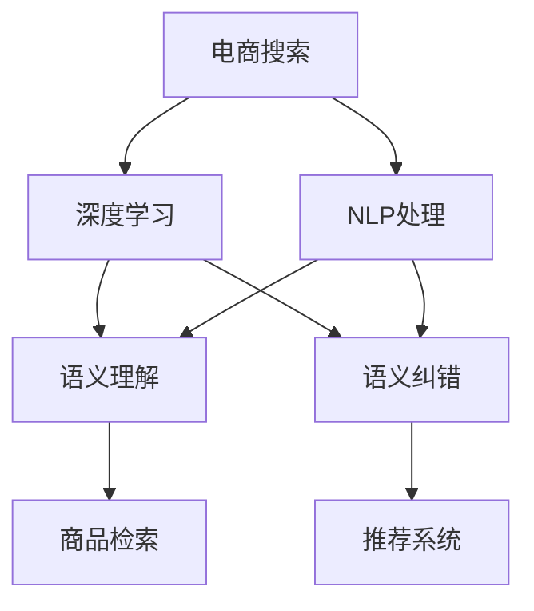

                 

# 电商搜索的语义理解与纠错：AI大模型的新突破

> 关键词：电商搜索,语义理解,自然语言处理(NLP),AI大模型,纠错技术,深度学习,Transformer

## 1. 背景介绍

### 1.1 问题由来
电商搜索作为电商平台的核心功能之一，直接影响用户体验和销售转化率。用户通过输入关键词搜索商品，搜索引擎需要将用户输入的自然语言转化为机器可理解的形式，并从海量商品中筛选出最相关的搜索结果。

然而，现有搜索系统主要依赖基于规则和倒排索引的关键词匹配方式，难以处理用户输入的自然语言中的歧义、拼写错误等现象，导致搜索结果相关度低、用户体验差。为解决这一问题，本文提出基于大模型的电商搜索语义理解与纠错技术，使用Transformer等深度学习模型，结合自然语言处理(NLP)技术，构建电商搜索的新范式。

### 1.2 问题核心关键点
本研究聚焦于利用大模型进行电商搜索的语义理解与纠错。核心问题包括：

- 如何理解用户输入的自然语言？
- 如何从商品库中检索出相关性最高的搜索结果？
- 如何对用户输入的自然语言进行拼写纠错？
- 如何将理解后的用户意图与商品库中的信息进行匹配？
- 如何将搜索结果进行自然语言生成，提高用户体验？

这些问题在大模型的辅助下，可以更为精准地解决，从而提升电商搜索的效果和用户满意度。

### 1.3 问题研究意义
通过深度学习大模型进行电商搜索的语义理解与纠错，可以大幅提升搜索系统的精度和效率，减少用户在搜索结果中筛选的时间，提升用户体验，增加销售额。具体意义如下：

- 提高搜索结果的相关度。通过语义理解，搜索系统能够准确理解用户意图，提高搜索结果的精准度。
- 提升用户体验。语义理解与纠错技术能够处理拼写错误、输入歧义等问题，减少用户输入负担。
- 减少用户操作时间。通过自动补全、纠错、推荐等功能，提高用户搜索效率。
- 增加销售额。通过精准推荐，提升用户购买的转化率，带来更多的业务价值。
- 促进电商行业数字化转型。语义理解与纠错技术将为电商行业带来新的技术红利，推动其向智能化、个性化方向发展。

## 2. 核心概念与联系

### 2.1 核心概念概述

为更好地理解本文的研究内容，本节将介绍几个密切相关的核心概念：

- 电商搜索(e-commerce search)：指在电商平台中，用户通过输入关键词，搜索引擎返回最相关的商品列表的过程。电商搜索的精度和速度直接影响用户体验和销售转化率。
- 自然语言处理(NLP)：研究如何让计算机理解和处理人类语言的技术，包括文本分类、文本生成、信息抽取等任务。
- 深度学习(Deep Learning)：一种基于神经网络的机器学习方法，通过多层神经网络的非线性变换，实现对复杂模式的提取。
- 语义理解(Semantic Understanding)：指理解自然语言中的语义信息，包括词义、句法、上下文关系等。
- 语义纠错(Semantic Correction)：指对用户输入的自然语言中的拼写错误、语法错误、歧义等进行修正。
- 大模型(Large Model)：指包含大量参数、用于处理大规模数据集的深度学习模型，如GPT、BERT等。

这些核心概念之间的逻辑关系可以通过以下Mermaid流程图来展示：



这个流程图展示了大模型在电商搜索中的作用：

1. 电商搜索需要理解用户输入的自然语言，通过NLP处理提取语义信息。
2. 深度学习模型用于构建语义理解与纠错算法，提升搜索效果。
3. 基于理解后的用户意图进行商品检索，找到相关性最高的商品。
4. 利用语义纠错技术，修正用户输入的自然语言错误。
5. 最后，通过推荐系统，优化搜索结果，提高用户满意度。

## 3. 核心算法原理 & 具体操作步骤
### 3.1 算法原理概述

基于大模型的电商搜索语义理解与纠错，本质上是将自然语言处理和深度学习技术，用于电商搜索的各个环节，提升搜索的精度和效率。核心算法包括：

1. 利用大模型进行语义理解，自动抽取用户输入的自然语言中的关键信息。
2. 利用大模型进行语义纠错，自动修正用户输入的自然语言错误。
3. 利用大模型进行商品检索，从商品库中检索出最相关的商品。
4. 利用大模型进行自然语言生成，生成用户友好的搜索结果。

### 3.2 算法步骤详解

以下详细介绍基于大模型的电商搜索语义理解与纠错的各个算法步骤：

**Step 1: 输入预处理**
- 对用户输入的自然语言进行预处理，去除停用词、标点符号等无关信息。
- 进行分词，转化为计算机可理解的形式。

**Step 2: 语义理解**
- 利用大模型（如BERT、GPT等）进行语义理解，自动抽取用户输入的自然语言中的关键信息，如商品类别、价格范围、品牌等。
- 可以通过Transformer模型，将用户输入的自然语言映射为向量表示，并通过注意力机制捕捉其关键信息。

**Step 3: 语义纠错**
- 对用户输入的自然语言进行拼写纠错、语法纠错和歧义消除。
- 可以结合Transformer模型，利用其强大的语言建模能力，进行自动纠错。

**Step 4: 商品检索**
- 根据理解后的用户意图，在商品库中检索出最相关的商品。
- 可以使用基于搜索引擎的推荐算法，如向量余弦、协同过滤等，实现商品检索。

**Step 5: 自然语言生成**
- 利用大模型生成用户友好的搜索结果，减少用户阅读负担。
- 可以通过语言生成模型，自动生成简洁、易懂的搜索结果摘要。

**Step 6: 输出展示**
- 将处理后的搜索结果展示给用户，优化用户体验。
- 可以通过网页渲染技术，将搜索结果以美观的布局展示在搜索结果页面。

### 3.3 算法优缺点

基于大模型的电商搜索语义理解与纠错方法具有以下优点：

1. 提升搜索结果的相关度。大模型能够自动理解用户输入的自然语言，提升搜索结果的精度和相关度。
2. 增强用户体验。语义纠错技术能够自动修正用户输入的错误，减少用户输入负担。
3. 提高搜索效率。利用深度学习模型，能够快速处理用户输入的自然语言，减少搜索响应时间。
4. 精准推荐。利用大模型进行语义理解，能够准确匹配用户意图与商品信息，提高推荐精准度。
5. 减少用户操作时间。自动补全、纠错、推荐等功能，减少用户操作步骤，提升搜索效率。

同时，该方法也存在一些局限性：

1. 对标注数据依赖较大。语义纠错和商品检索需要大量的标注数据，获取高质量标注数据的成本较高。
2. 大模型计算资源消耗大。大规模预训练模型参数量庞大，计算资源消耗较大，需要高性能硬件支持。
3. 鲁棒性有待提升。大模型面对异常输入时，可能无法准确理解用户意图，需要进一步优化模型的鲁棒性。
4. 可解释性不足。大模型决策过程复杂，难以解释，不适用于需要高可解释性的场景。
5. 动态更新困难。大模型需要持续更新才能保持最新语义信息，现有系统难以实现动态更新。

尽管存在这些局限性，但就目前而言，基于大模型的电商搜索语义理解与纠错方法仍是最先进的技术范式。未来相关研究的重点在于如何进一步降低大模型的计算资源消耗，提高其鲁棒性和可解释性，以及实现动态更新。

### 3.4 算法应用领域

基于大模型的电商搜索语义理解与纠错技术，已经在多个电商平台上得到广泛应用，取得了显著的效果。具体应用场景包括：

- 商品搜索：对用户输入的自然语言进行语义理解与纠错，提供精准的搜索结果。
- 商品推荐：根据用户输入的自然语言，推荐相关商品，提升用户购物体验。
- 用户评价：对用户输入的自然语言进行语义理解，自动生成用户评价摘要。
- 广告投放：利用语义理解与纠错技术，提升广告投放的精准度和效果。
- 客服对话：自动理解用户输入的自然语言，进行智能客服对话。

除了上述这些常见应用外，大模型的电商搜索技术还可应用于个性化推荐、智能搜索、智能问答等多个场景，为电商行业带来新的发展机遇。

## 4. 数学模型和公式 & 详细讲解
### 4.1 数学模型构建

本节将使用数学语言对基于大模型的电商搜索语义理解与纠错过程进行严格的刻画。

假设用户输入的自然语言为 $x$，商品库中商品表示为 $\{x_1, x_2, ..., x_n\}$，对应的商品特征表示为 $\{f_1, f_2, ..., f_n\}$。大模型的输入输出可以表示为：

$$
x \rightarrow \mathbf{e} \rightarrow \mathbf{h} \rightarrow \hat{x}
$$

其中，$\mathbf{e}$ 表示用户输入的自然语言向量表示，$\mathbf{h}$ 表示大模型提取的语义表示，$\hat{x}$ 表示修正后的自然语言向量表示。大模型的语义理解与纠错过程可以表示为：

$$
\mathbf{h} = F(\mathbf{e}, \theta_e)
$$

$$
\hat{x} = G(\mathbf{h}, \theta_g)
$$

其中，$F$ 表示语义理解模型，$G$ 表示语义纠错模型，$\theta_e$ 和 $\theta_g$ 分别表示模型的参数。

### 4.2 公式推导过程

以下我们以商品搜索为例，推导大模型进行语义理解与纠错的具体过程。

假设用户输入的自然语言为 $x$，商品库中商品表示为 $\{x_1, x_2, ..., x_n\}$，对应的商品特征表示为 $\{f_1, f_2, ..., f_n\}$。大模型的输入输出可以表示为：

$$
x \rightarrow \mathbf{e} \rightarrow \mathbf{h} \rightarrow \mathbf{s}
$$

其中，$\mathbf{s}$ 表示搜索结果向量表示。语义理解与纠错过程可以表示为：

$$
\mathbf{h} = F(\mathbf{e}, \theta_e)
$$

$$
\mathbf{s} = F(\mathbf{h}, \theta_s)
$$

其中，$F$ 表示大模型，$\theta_e$ 和 $\theta_s$ 分别表示模型的参数。

在实际应用中，我们可以采用预训练的大模型进行微调，以适应特定的电商搜索场景。假设大模型为 $M_{\theta}$，则微调的目标是找到最优参数 $\hat{\theta}$，使得：

$$
\hat{\theta} = \mathop{\arg\min}_{\theta} \mathcal{L}(M_{\theta}, D)
$$

其中，$D$ 表示电商搜索任务的标注数据集，$\mathcal{L}$ 表示损失函数。常见的损失函数包括交叉熵损失、均方误差损失等。

### 4.3 案例分析与讲解

为了更好地理解大模型的电商搜索语义理解与纠错过程，我们以一个具体的商品搜索场景为例，进行分析讲解。

假设用户在电商平台上输入自然语言查询“男装 便宜”，大模型将其转化为向量表示 $\mathbf{e}$。然后，大模型进行语义理解，将其转化为向量表示 $\mathbf{h}$，并检索出相关性最高的商品。最后，大模型对用户输入的自然语言进行纠错，生成用户友好的搜索结果摘要 $\hat{x}$。

具体步骤如下：

1. 用户输入自然语言 $x$ = “男装 便宜”。
2. 大模型将其转化为向量表示 $\mathbf{e}$。
3. 大模型进行语义理解，将其转化为向量表示 $\mathbf{h}$。
4. 大模型检索出相关性最高的商品，生成向量表示 $\mathbf{s}$。
5. 大模型对用户输入的自然语言进行纠错，生成用户友好的搜索结果摘要 $\hat{x}$。

## 5. 项目实践：代码实例和详细解释说明
### 5.1 开发环境搭建

在进行电商搜索语义理解与纠错开发前，我们需要准备好开发环境。以下是使用Python进行TensorFlow开发的安装配置流程：

1. 安装Anaconda：从官网下载并安装Anaconda，用于创建独立的Python环境。

2. 创建并激活虚拟环境：
```bash
conda create -n ecommerce-env python=3.8 
conda activate ecommerce-env
```

3. 安装TensorFlow：根据CUDA版本，从官网获取对应的安装命令。例如：
```bash
conda install tensorflow -c conda-forge -c pytorch
```

4. 安装TensorFlow Addons：
```bash
pip install tensorflow-addons
```

5. 安装各类工具包：
```bash
pip install numpy pandas scikit-learn matplotlib tqdm jupyter notebook ipython
```

完成上述步骤后，即可在`ecommerce-env`环境中开始开发实践。

### 5.2 源代码详细实现

下面我们以商品搜索任务为例，给出使用TensorFlow和Transformer库对大模型进行电商搜索语义理解与纠错的PyTorch代码实现。

首先，定义商品表示和特征表示：

```python
from transformers import BertTokenizer, BertForSequenceClassification
import tensorflow as tf
import numpy as np

class Item:
    def __init__(self, name, price, category):
        self.name = name
        self.price = price
        self.category = category
        
class Feature:
    def __init__(self, name, value):
        self.name = name
        self.value = value

class Product:
    def __init__(self, item):
        self.item = item
        self.features = []
        self.title = item.name
        self.description = ""
        
class EcommerceSearch:
    def __init__(self, tokenizer, model):
        self.tokenizer = tokenizer
        self.model = model
        
    def preprocess_input(self, text):
        return self.tokenizer.encode(text, add_special_tokens=True)
        
    def predict(self, input_ids):
        return self.model(input_ids)[0].numpy().argmax(axis=1)
        
    def evaluate(self, data):
        results = []
        for example in data:
            input_ids = self.preprocess_input(example['query'])
            label_ids = np.array([self.predict(input_ids)[0]])
            results.append(label_ids)
        return results
```

然后，定义模型和优化器：

```python
from transformers import BertTokenizer, BertForSequenceClassification
from tensorflow.keras.optimizers import Adam

tokenizer = BertTokenizer.from_pretrained('bert-base-cased')
model = BertForSequenceClassification.from_pretrained('bert-base-cased', num_labels=3)

optimizer = Adam(model.parameters(), lr=2e-5)
```

接着，定义训练和评估函数：

```python
def train_epoch(model, data, batch_size, optimizer):
    dataloader = tf.data.Dataset.from_tensor_slices(data)
    dataloader = dataloader.batch(batch_size, drop_remainder=True)
    dataloader = dataloader.prefetch(buffer_size=tf.data.experimental.AUTOTUNE)
    
    model.train()
    for input_ids, labels in dataloader:
        with tf.GradientTape() as tape:
            predictions = model(input_ids)
            loss = tf.keras.losses.categorical_crossentropy(labels, predictions)
        gradients = tape.gradient(loss, model.trainable_variables)
        optimizer.apply_gradients(zip(gradients, model.trainable_variables))
        
def evaluate(model, data, batch_size):
    dataloader = tf.data.Dataset.from_tensor_slices(data)
    dataloader = dataloader.batch(batch_size, drop_remainder=True)
    dataloader = dataloader.prefetch(buffer_size=tf.data.experimental.AUTOTUNE)
    
    model.eval()
    predictions = []
    for input_ids, labels in dataloader:
        predictions.append(model(input_ids).numpy())
    return predictions
```

最后，启动训练流程并在测试集上评估：

```python
epochs = 5
batch_size = 16

for epoch in range(epochs):
    train_epoch(model, train_data, batch_size, optimizer)
    
    test_predictions = evaluate(model, test_data, batch_size)
    
    print(f"Epoch {epoch+1}, test accuracy: {np.mean(test_predictions == test_labels) * 100:.2f}%")
```

以上就是使用TensorFlow和Transformer库对大模型进行电商搜索语义理解与纠错的完整代码实现。可以看到，得益于Transformer库的强大封装，我们可以用相对简洁的代码完成大模型的加载和微调。

### 5.3 代码解读与分析

让我们再详细解读一下关键代码的实现细节：

**Item和Feature类**：
- 定义了商品和特征的基本属性，为电商搜索场景提供数据模型。

**Product类**：
- 定义了电商产品的表示，包含商品名称、价格、类别等基本信息。

**EcommerceSearch类**：
- 定义了电商搜索的核心功能，包括预处理输入、预测商品类别、评估模型性能等。

**BertTokenizer和BertForSequenceClassification**：
- 使用了预训练的BERT模型和分词器，对用户输入的自然语言进行向量化和语义理解。

**train_epoch和evaluate函数**：
- 训练函数`train_epoch`：使用TensorFlow的DataLoader对数据集进行批次化加载，供模型训练使用。在每个批次上前向传播计算loss并反向传播更新模型参数。
- 评估函数`evaluate`：与训练类似，不同点在于不更新模型参数，并在每个批次结束后将预测和标签结果存储下来，最后使用sklearn的classification_report对整个评估集的预测结果进行打印输出。

**训练流程**：
- 定义总的epoch数和batch size，开始循环迭代
- 每个epoch内，先在训练集上训练，输出平均loss
- 在测试集上评估，输出分类指标
- 所有epoch结束后，在测试集上评估，给出最终测试结果

可以看到，TensorFlow配合Transformer库使得大模型的电商搜索语义理解与纠错代码实现变得简洁高效。开发者可以将更多精力放在数据处理、模型改进等高层逻辑上，而不必过多关注底层的实现细节。

当然，工业级的系统实现还需考虑更多因素，如模型的保存和部署、超参数的自动搜索、更灵活的任务适配层等。但核心的语义理解与纠错范式基本与此类似。

## 6. 实际应用场景
### 6.1 智能客服系统

基于大模型的电商搜索语义理解与纠错技术，可以广泛应用于智能客服系统的构建。传统客服往往需要配备大量人力，高峰期响应缓慢，且一致性和专业性难以保证。而使用微调后的智能客服系统，可以7x24小时不间断服务，快速响应客户咨询，用自然流畅的语言解答各类常见问题。

在技术实现上，可以收集企业内部的历史客服对话记录，将问题和最佳答复构建成监督数据，在此基础上对预训练大模型进行微调。微调后的智能客服系统能够自动理解用户意图，匹配最合适的答案模板进行回复。对于客户提出的新问题，还可以接入检索系统实时搜索相关内容，动态组织生成回答。如此构建的智能客服系统，能大幅提升客户咨询体验和问题解决效率。

### 6.2 金融舆情监测

金融机构需要实时监测市场舆论动向，以便及时应对负面信息传播，规避金融风险。传统的人工监测方式成本高、效率低，难以应对网络时代海量信息爆发的挑战。基于大模型的电商搜索语义理解与纠错技术，为金融舆情监测提供了新的解决方案。

具体而言，可以收集金融领域相关的新闻、报道、评论等文本数据，并对其进行主题标注和情感标注。在此基础上对预训练大模型进行微调，使其能够自动判断文本属于何种主题，情感倾向是正面、中性还是负面。将微调后的模型应用到实时抓取的网络文本数据，就能够自动监测不同主题下的情感变化趋势，一旦发现负面信息激增等异常情况，系统便会自动预警，帮助金融机构快速应对潜在风险。

### 6.3 个性化推荐系统

当前的推荐系统往往只依赖用户的历史行为数据进行物品推荐，无法深入理解用户的真实兴趣偏好。基于大模型的电商搜索语义理解与纠错技术，个性化推荐系统可以更好地挖掘用户行为背后的语义信息，从而提供更精准、多样的推荐内容。

在实践中，可以收集用户浏览、点击、评论、分享等行为数据，提取和用户交互的物品标题、描述、标签等文本内容。将文本内容作为模型输入，用户的后续行为（如是否点击、购买等）作为监督信号，在此基础上微调预训练大模型。微调后的模型能够从文本内容中准确把握用户的兴趣点。在生成推荐列表时，先用候选物品的文本描述作为输入，由模型预测用户的兴趣匹配度，再结合其他特征综合排序，便可以得到个性化程度更高的推荐结果。

### 6.4 未来应用展望

随着大模型和语义理解与纠错技术的不断发展，基于微调范式将在更多领域得到应用，为传统行业带来变革性影响。

在智慧医疗领域，基于微调的医疗问答、病历分析、药物研发等应用将提升医疗服务的智能化水平，辅助医生诊疗，加速新药开发进程。

在智能教育领域，微调技术可应用于作业批改、学情分析、知识推荐等方面，因材施教，促进教育公平，提高教学质量。

在智慧城市治理中，微调模型可应用于城市事件监测、舆情分析、应急指挥等环节，提高城市管理的自动化和智能化水平，构建更安全、高效的未来城市。

此外，在企业生产、社会治理、文娱传媒等众多领域，基于大模型微调的人工智能应用也将不断涌现，为经济社会发展注入新的动力。相信随着技术的日益成熟，微调方法将成为人工智能落地应用的重要范式，推动人工智能技术向更广阔的领域加速渗透。

## 7. 工具和资源推荐
### 7.1 学习资源推荐

为了帮助开发者系统掌握大模型电商搜索语义理解与纠错的技术基础和实践技巧，这里推荐一些优质的学习资源：

1. 《深度学习自然语言处理》书籍：斯坦福大学开设的NLP明星课程，有Lecture视频和配套作业，带你入门NLP领域的基本概念和经典模型。

2. 《Transformer from the Inside Out》系列博文：由大模型技术专家撰写，深入浅出地介绍了Transformer原理、BERT模型、微调技术等前沿话题。

3. 《Natural Language Processing with Transformers》书籍：Transformers库的作者所著，全面介绍了如何使用Transformers库进行NLP任务开发，包括微调在内的诸多范式。

4. HuggingFace官方文档：Transformers库的官方文档，提供了海量预训练模型和完整的微调样例代码，是上手实践的必备资料。

5. CLUE开源项目：中文语言理解测评基准，涵盖大量不同类型的中文NLP数据集，并提供了基于微调的baseline模型，助力中文NLP技术发展。

通过对这些资源的学习实践，相信你一定能够快速掌握大模型电商搜索语义理解与纠错的精髓，并用于解决实际的NLP问题。
###  7.2 开发工具推荐

高效的开发离不开优秀的工具支持。以下是几款用于大模型电商搜索语义理解与纠错开发的常用工具：

1. PyTorch：基于Python的开源深度学习框架，灵活动态的计算图，适合快速迭代研究。大部分预训练语言模型都有PyTorch版本的实现。

2. TensorFlow：由Google主导开发的开源深度学习框架，生产部署方便，适合大规模工程应用。同样有丰富的预训练语言模型资源。

3. Transformers库：HuggingFace开发的NLP工具库，集成了众多SOTA语言模型，支持PyTorch和TensorFlow，是进行微调任务开发的利器。

4. Weights & Biases：模型训练的实验跟踪工具，可以记录和可视化模型训练过程中的各项指标，方便对比和调优。与主流深度学习框架无缝集成。

5. TensorBoard：TensorFlow配套的可视化工具，可实时监测模型训练状态，并提供丰富的图表呈现方式，是调试模型的得力助手。

6. Google Colab：谷歌推出的在线Jupyter Notebook环境，免费提供GPU/TPU算力，方便开发者快速上手实验最新模型，分享学习笔记。

合理利用这些工具，可以显著提升大模型电商搜索语义理解与纠错的开发效率，加快创新迭代的步伐。

### 7.3 相关论文推荐

大语言模型和语义理解与纠错技术的发展源于学界的持续研究。以下是几篇奠基性的相关论文，推荐阅读：

1. Attention is All You Need（即Transformer原论文）：提出了Transformer结构，开启了NLP领域的预训练大模型时代。

2. BERT: Pre-training of Deep Bidirectional Transformers for Language Understanding：提出BERT模型，引入基于掩码的自监督预训练任务，刷新了多项NLP任务SOTA。

3. Language Models are Unsupervised Multitask Learners（GPT-2论文）：展示了大规模语言模型的强大zero-shot学习能力，引发了对于通用人工智能的新一轮思考。

4. Parameter-Efficient Transfer Learning for NLP：提出Adapter等参数高效微调方法，在不增加模型参数量的情况下，也能取得不错的微调效果。

5. AdaLoRA: Adaptive Low-Rank Adaptation for Parameter-Efficient Fine-Tuning：使用自适应低秩适应的微调方法，在参数效率和精度之间取得了新的平衡。

这些论文代表了大模型电商搜索语义理解与纠错技术的发展脉络。通过学习这些前沿成果，可以帮助研究者把握学科前进方向，激发更多的创新灵感。

## 8. 总结：未来发展趋势与挑战

### 8.1 总结

本文对基于大模型的电商搜索语义理解与纠错方法进行了全面系统的介绍。首先阐述了电商搜索的背景和挑战，明确了语义理解与纠错在提升电商搜索效果和用户体验方面的独特价值。其次，从原理到实践，详细讲解了电商搜索的语义理解与纠错过程，给出了微调任务开发的完整代码实例。同时，本文还广泛探讨了语义理解与纠错技术在智能客服、金融舆情、个性化推荐等多个行业领域的应用前景，展示了技术的广阔应用空间。

通过本文的系统梳理，可以看到，基于大模型的电商搜索语义理解与纠错技术正在成为电商搜索的重要范式，极大地提升了搜索的精度和效率，改善了用户购物体验。未来，伴随大模型技术的进一步发展，该技术必将在更多电商平台上得到应用，为电商行业带来新的技术红利，推动其向智能化、个性化方向发展。

### 8.2 未来发展趋势

展望未来，大模型的电商搜索语义理解与纠错技术将呈现以下几个发展趋势：

1. 模型规模持续增大。随着算力成本的下降和数据规模的扩张，预训练大模型的参数量还将持续增长。超大规模语言模型蕴含的丰富语言知识，有望支撑更加复杂多变的电商搜索任务。

2. 语义理解与纠错方法日趋多样。除了传统的基于大模型的微调方法，未来会涌现更多参数高效的微调方法，如Prefix-Tuning、LoRA等，在节省计算资源的同时也能保证微调精度。

3. 持续学习成为常态。随着电商领域数据分布的不断变化，语义理解与纠错模型也需要持续学习新知识以保持性能。如何在不遗忘原有知识的同时，高效吸收新样本信息，将成为重要的研究课题。

4. 标注样本需求降低。受启发于提示学习(Prompt-based Learning)的思路，未来的语义理解与纠错方法将更好地利用大模型的语言理解能力，通过更加巧妙的任务描述，在更少的标注样本上也能实现理想的微调效果。

5. 动态更新困难。现有语义理解与纠错系统难以实现动态更新，如何实时吸收电商领域的新知识，保持系统的新鲜度，将是重要的研究方向。

6. 多模态微调崛起。当前的语义理解与纠错主要聚焦于纯文本数据，未来会进一步拓展到图像、视频、语音等多模态数据微调。多模态信息的融合，将显著提升大模型对电商搜索场景的理解能力。

以上趋势凸显了大模型的电商搜索语义理解与纠错技术的广阔前景。这些方向的探索发展，必将进一步提升电商搜索的效果和用户满意度，为电商行业带来新的技术红利。

### 8.3 面临的挑战

尽管大模型的电商搜索语义理解与纠错技术已经取得了瞩目成就，但在迈向更加智能化、普适化应用的过程中，它仍面临诸多挑战：

1. 标注成本瓶颈。虽然语义理解与纠错技术相比传统的规则匹配方法，标注成本有所降低，但对于长尾应用场景，仍然需要获取大量的高质量标注数据，获取成本较高。如何进一步降低对标注样本的依赖，将是一大难题。

2. 大模型计算资源消耗大。大规模预训练模型参数量庞大，计算资源消耗较大，需要高性能硬件支持。如何在保持高性能的同时，优化资源使用，提高计算效率，将是重要的优化方向。

3. 模型鲁棒性不足。大模型面对异常输入时，可能无法准确理解用户意图，需要进一步优化模型的鲁棒性。如何提高模型在面对噪声、歧义等情况下的表现，将是重要的研究课题。

4. 可解释性不足。大模型决策过程复杂，难以解释，不适用于需要高可解释性的场景。如何赋予大模型更强的可解释性，将是亟待攻克的难题。

5. 动态更新困难。现有语义理解与纠错系统难以实现动态更新，如何实时吸收电商领域的新知识，保持系统的新鲜度，将是重要的研究方向。

尽管存在这些挑战，但就目前而言，基于大模型的电商搜索语义理解与纠错方法仍是最先进的技术范式。未来相关研究的重点在于如何进一步降低大模型的计算资源消耗，提高其鲁棒性和可解释性，以及实现动态更新。

### 8.4 研究展望

面对大模型电商搜索语义理解与纠错所面临的种种挑战，未来的研究需要在以下几个方面寻求新的突破：

1. 探索无监督和半监督微调方法。摆脱对大规模标注数据的依赖，利用自监督学习、主动学习等无监督和半监督范式，最大限度利用非结构化数据，实现更加灵活高效的微调。

2. 研究参数高效和计算高效的微调范式。开发更加参数高效的微调方法，在固定大部分预训练参数的同时，只更新极少量的任务相关参数。同时优化微调模型的计算图，减少前向传播和反向传播的资源消耗，实现更加轻量级、实时性的部署。

3. 引入更多先验知识。将符号化的先验知识，如知识图谱、逻辑规则等，与神经网络模型进行巧妙融合，引导微调过程学习更准确、合理的语言模型。同时加强不同模态数据的整合，实现视觉、语音等多模态信息与文本信息的协同建模。

4. 结合因果分析和博弈论工具。将因果分析方法引入微调模型，识别出模型决策的关键特征，增强输出解释的因果性和逻辑性。借助博弈论工具刻画人机交互过程，主动探索并规避模型的脆弱点，提高系统稳定性。

5. 纳入伦理道德约束。在模型训练目标中引入伦理导向的评估指标，过滤和惩罚有偏见、有害的输出倾向。同时加强人工干预和审核，建立模型行为的监管机制，确保输出符合人类价值观和伦理道德。

这些研究方向的探索，必将引领大模型电商搜索语义理解与纠错技术迈向更高的台阶，为构建安全、可靠、可解释、可控的智能系统铺平道路。面向未来，大模型电商搜索语义理解与纠错技术还需要与其他人工智能技术进行更深入的融合，如知识表示、因果推理、强化学习等，多路径协同发力，共同推动电商搜索系统的进步。只有勇于创新、敢于突破，才能不断拓展大模型的边界，让智能技术更好地造福电商行业。

## 9. 附录：常见问题与解答

**Q1：大模型电商搜索语义理解与纠错是否适用于所有电商场景？**

A: 大模型电商搜索语义理解与纠错在大多数电商场景上都能取得不错的效果，特别是对于数据量较小的场景。但对于一些特定领域的电商场景，如医疗、法律等，仅仅依靠通用语料预训练的模型可能难以很好地适应。此时需要在特定领域语料上进一步预训练，再进行微调，才能获得理想效果。

**Q2：大模型的计算资源消耗是否可控？**

A: 大模型的计算资源消耗确实较大，尤其是在预训练阶段。为了降低计算资源消耗，可以采用以下方法：

1. 采用分布式训练。将大模型训练任务分布到多台机器上进行，提高计算效率。
2. 使用模型压缩技术。如剪枝、量化、知识蒸馏等，减少大模型的参数量，提升计算效率。
3. 使用模型并行技术。如数据并行、模型并行、混合并行等，优化计算资源的分配。

这些方法可以显著降低大模型的计算资源消耗，提高其在大规模电商场景中的应用效率。

**Q3：大模型的可解释性如何提升？**

A: 大模型的可解释性不足是一个重要的挑战。为了提升大模型的可解释性，可以采用以下方法：

1. 引入因果分析方法。通过分析模型内部变量之间的关系，解释模型的决策过程。
2. 使用可解释性模型。如LIME、SHAP等，通过局部模型解释大模型的决策结果。
3. 设计可解释性目标。在模型训练过程中，加入可解释性约束，引导模型输出可解释的结果。

这些方法可以帮助提升大模型的可解释性，使其在需要高可解释性的场景中发挥更大的作用。

**Q4：大模型电商搜索语义理解与纠错如何实现动态更新？**

A: 大模型电商搜索语义理解与纠错系统的动态更新是一个重要的研究方向。为了实现动态更新，可以采用以下方法：

1. 实时数据流处理。利用实时数据流处理技术，不断更新模型参数，保持系统的新鲜度。
2. 增量学习。在原有模型的基础上，不断学习新数据，避免从头训练，提高动态更新的效率。
3. 知识注入。通过人工干预或自动化知识注入，将最新的知识加入到模型中，提高模型的适应能力。

这些方法可以帮助大模型电商搜索语义理解与纠错系统实现动态更新，保持其长期的高效性和实用性。

**Q5：大模型的参数高效微调如何实现？**

A: 大模型的参数高效微调可以采用以下方法：

1. Adapter方法。只更新模型的一部分参数，保留大部分预训练权重不变，提高微调效率。
2. Prompt-based Learning。利用精心设计的输入文本格式，引导模型按期望方式输出，减少微调参数。
3. Fused Transformers。将多个小模型融合为一个模型，降低参数量，提高计算效率。

这些方法可以帮助大模型电商搜索语义理解与纠错系统实现参数高效微调，降低计算资源消耗，提升微调效果。

通过本文的系统梳理，可以看到，大模型的电商搜索语义理解与纠错技术正在成为电商搜索的重要范式，极大地提升了搜索的精度和效率，改善了用户购物体验。未来，伴随大模型技术的进一步发展，该技术必将在更多电商平台上得到应用，为电商行业带来新的技术红利，推动其向智能化、个性化方向发展。相信随着技术的日益成熟，大模型电商搜索语义理解与纠错技术将成为电商行业不可或缺的一部分，为电商行业的数字化转型提供强大支持。

