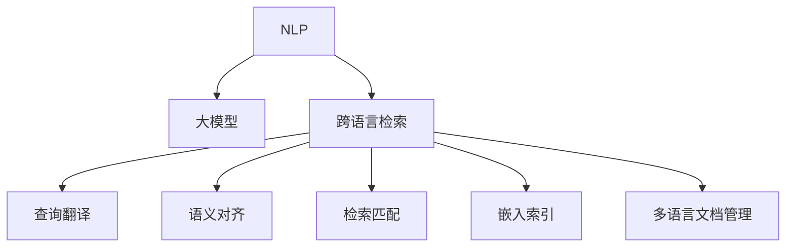

                 

# 电商搜索的跨语言检索：AI大模型的新突破

> 关键词：跨语言检索, 大模型, 自然语言处理(NLP), 电商搜索, 自然语言理解, 嵌入式系统, 代码实现, 实际应用

## 1. 背景介绍

### 1.1 问题由来
随着全球化的推进，全球市场正在变得越来越一体化。在线电商平台的迅速发展，使得不同国家、不同语言、不同文化的用户能够跨越地域限制，进行商品搜索和购买。然而，由于语言障碍，不同语言之间的商品搜索结果存在巨大差异。如何在全球范围内，为用户提供一致且准确的搜索结果，成为了一个亟待解决的问题。

### 1.2 问题核心关键点
跨语言检索，即在不同语言之间实现自然语言查询与商品信息的精准匹配，是电商搜索的关键技术之一。其核心在于解决跨语言语义理解、多语言索引构建、跨语言检索匹配等问题。目前，基于大模型的跨语言检索技术，已经开始在电商搜索场景中崭露头角，成为新一代电商搜索解决方案的主流选择。

### 1.3 问题研究意义
跨语言检索技术不仅能够显著提升电商搜索的用户体验，还能够增强跨境电商的竞争力，推动全球市场的进一步融合。通过自然语言处理(NLP)技术的加持，大模型在多语言场景下能够实现更加精准、高效的检索匹配，从而为电商平台的全球化战略提供有力支持。

## 2. 核心概念与联系

### 2.1 核心概念概述

为更好地理解跨语言检索技术，本节将介绍几个密切相关的核心概念：

- 自然语言处理（NLP）：使用计算技术处理、理解、生成人类语言的技术。NLP是大模型的基础，涉及语言模型、文本分类、语义分析等多个方向。
- 大模型（Large Model）：基于大规模数据训练的神经网络模型，如BERT、GPT-3等。大模型具有强大的自监督学习能力，能够从海量数据中学习到复杂的语言结构和语义表示。
- 跨语言检索（Cross-Language Retrieval）：在不同语言之间进行查询匹配，即在一种语言的查询与另一种语言的文档之间建立关联。涉及查询翻译、语义对齐、检索匹配等多个环节。
- 嵌入索引（Embedding Index）：将文本转换为向量表示，构建高效的索引结构，提高检索效率。常见的嵌入索引算法包括倒排索引、LSH、HNSW等。
- 多语言文档管理：存储和组织多种语言的文档信息，支持跨语言检索。通常使用语言无关的标签或元数据进行组织。

这些核心概念之间的逻辑关系可以通过以下Mermaid流程图来展示：



这个流程图展示了大模型在跨语言检索中的关键作用及其与其他核心概念的联系：

1. NLP技术为数据预处理和特征提取提供了基础。
2. 大模型通过自监督学习，学习到了丰富的语言表示。
3. 跨语言检索涉及多个步骤，包括查询翻译、语义对齐、检索匹配等。
4. 嵌入索引提高了检索效率。
5. 多语言文档管理支持了跨语言检索的文档组织。

## 3. 核心算法原理 & 具体操作步骤
### 3.1 算法原理概述

基于大模型的跨语言检索方法，其核心思想是：将查询和文档分别转换为向量表示，然后在向量空间中度量它们之间的相似度，从而实现跨语言检索。具体步骤如下：

1. **数据准备**：收集不同语言的商品描述和查询，构建训练和测试数据集。
2. **大模型预训练**：在大量无标签文本数据上预训练语言模型，学习通用语言表示。
3. **查询翻译**：使用大模型将查询翻译成目标语言的向量表示。
4. **语义对齐**：在大模型基础上，构建查询和文档的向量表示，并计算它们的语义距离。
5. **检索匹配**：在向量空间中计算查询与文档之间的相似度，返回最相关的文档。

### 3.2 算法步骤详解

以下我们将详细介绍跨语言检索的各个步骤：

**Step 1: 数据准备**
- 收集不同语言的商品描述和查询，并进行预处理。
- 使用文本分词、去除停用词、词性标注等技术，对文本进行标准化处理。
- 将处理后的文本数据作为训练数据集，用于大模型的微调和嵌入索引的构建。

**Step 2: 大模型预训练**
- 选择适合的语言模型，如BERT、GPT等，在大规模无标签文本数据上进行预训练。
- 微调大模型，使其能够根据上下文生成单词或句子的向量表示。
- 在预训练和微调过程中，确保使用不同语言的文本数据，学习到多语言的共同语义特征。

**Step 3: 查询翻译**
- 使用预训练的大模型，将用户查询翻译成目标语言的向量表示。
- 对于不同语言的查询，可以使用机器翻译模型或使用大模型的多语言模块进行翻译。

**Step 4: 语义对齐**
- 对于目标语言的查询和文档，使用预训练的大模型分别生成它们的向量表示。
- 计算查询和文档向量之间的语义距离，通常使用余弦相似度、欧式距离等距离度量方法。
- 对于语义对齐，还可以考虑引入语言模型参数共享、多语言对齐等技术，进一步提升检索精度。

**Step 5: 检索匹配**
- 在向量空间中，计算查询与所有文档的相似度。
- 根据相似度排序，返回与查询最相关的文档列表。
- 在实际应用中，为了提高检索速度，可以采用索引结构，如倒排索引、LSH等。

### 3.3 算法优缺点

基于大模型的跨语言检索方法具有以下优点：
1. 精度高：大模型在语言理解和语义对齐方面表现卓越，能够实现更准确的跨语言检索。
2. 适用性强：适用于不同语言的商品搜索，能够提升全球市场用户的购物体验。
3. 灵活性高：模型可以动态更新，适应不断变化的语料和用户需求。
4. 可扩展性好：可以通过增加大模型的规模，提升检索性能。

同时，该方法也存在以下局限性：
1. 计算资源消耗大：大模型的预训练和微调需要大量计算资源。
2. 查询翻译误差：查询翻译过程中可能出现歧义或翻译错误，影响检索结果。
3. 语义对齐复杂：不同语言的语义结构可能存在差异，语义对齐难度较大。
4. 部署复杂：大规模模型在嵌入式设备上部署可能面临性能瓶颈。

尽管存在这些局限性，但就目前而言，基于大模型的跨语言检索方法仍是大规模电商搜索解决方案的主流选择。未来相关研究的重点在于如何进一步降低计算资源消耗，提高翻译和语义对齐的准确度，以及简化模型部署。

### 3.4 算法应用领域

基于大模型的跨语言检索技术，已经在全球电商搜索、社交媒体、问答系统等多个领域得到应用，为全球化信息技术应用提供了新的可能性。

**全球电商搜索**：在电商平台中，用户可以通过多语言搜索，获取不同语言的商品信息。使用跨语言检索技术，用户可以在多语言查询下，快速定位到最相关的商品信息。

**社交媒体**：在社交媒体中，用户可以发布多语言帖子。通过跨语言检索，系统可以自动识别和匹配用户的帖子内容，提高社交互动的效率。

**问答系统**：在问答系统中，用户可以提出不同语言的问答。通过跨语言检索，系统能够理解用户的自然语言问题，并提供多语言的答案。

除了上述这些经典应用外，跨语言检索技术还在其他领域有广泛的应用前景。未来，随着大模型和检索算法的不断进步，跨语言检索将能够更好地满足全球化信息技术的需求。

## 4. 数学模型和公式 & 详细讲解
### 4.1 数学模型构建

在基于大模型的跨语言检索中，我们通常使用向量空间模型(VSM)来表示查询和文档。设查询向量为 $q$，文档向量为 $d$，则向量空间模型中的相似度计算公式为：

$$
\text{similarity}(q, d) = \cos(\theta) = \frac{q \cdot d}{||q|| \cdot ||d||}
$$

其中 $\cdot$ 表示向量点积，$||\cdot||$ 表示向量范数。

### 4.2 公式推导过程

以下是跨语言检索中向量空间模型计算相似度的详细推导过程：

1. **向量空间表示**：
   - 查询和文档在预训练大模型中分别生成向量表示。
   - 设查询向量为 $q = [q_1, q_2, ..., q_n]$，文档向量为 $d = [d_1, d_2, ..., d_n]$，其中 $n$ 为向量维度。

2. **向量点积**：
   - 向量点积计算公式为 $q \cdot d = \sum_{i=1}^n q_i d_i$。
   - 通过计算点积，得到查询和文档之间的相似度。

3. **向量范数**：
   - 向量范数计算公式为 $||q|| = \sqrt{\sum_{i=1}^n q_i^2}$，$||d|| = \sqrt{\sum_{i=1}^n d_i^2}$。
   - 通过计算向量范数，标准化向量空间模型。

4. **余弦相似度**：
   - 余弦相似度计算公式为 $\cos(\theta) = \frac{q \cdot d}{||q|| \cdot ||d||}$。
   - 余弦相似度能够度量两个向量之间的夹角，值越接近1，表示相似度越高。

### 4.3 案例分析与讲解

假设我们有一个查询“iPad”和一组文档向量，使用上述向量空间模型计算相似度。假设有两个文档向量 $d_1$ 和 $d_2$，其表示如下：

$$
d_1 = [0.3, 0.5, 0.1, 0.1]
$$
$$
d_2 = [0.2, 0.6, 0.1, 0.1]
$$

查询“iPad”通过大模型生成的向量表示为：

$$
q = [0.2, 0.5, 0.1, 0.2]
$$

计算查询与两个文档的余弦相似度：

$$
\text{similarity}(q, d_1) = \frac{0.2 \times 0.3 + 0.5 \times 0.5 + 0.1 \times 0.1 + 0.2 \times 0.1}{\sqrt{0.2^2 + 0.5^2 + 0.1^2 + 0.2^2} \times \sqrt{0.3^2 + 0.5^2 + 0.1^2 + 0.1^2}} \approx 0.5
$$
$$
\text{similarity}(q, d_2) = \frac{0.2 \times 0.2 + 0.5 \times 0.6 + 0.1 \times 0.1 + 0.2 \times 0.1}{\sqrt{0.2^2 + 0.5^2 + 0.1^2 + 0.2^2} \times \sqrt{0.2^2 + 0.6^2 + 0.1^2 + 0.1^2}} \approx 0.6
$$

因此，查询“iPad”与文档 $d_2$ 的相似度更高。在实际应用中，我们可以根据相似度排序，返回最相关的文档。

## 5. 项目实践：代码实例和详细解释说明
### 5.1 开发环境搭建

在进行跨语言检索实践前，我们需要准备好开发环境。以下是使用Python进行代码实现的环境配置流程：

1. 安装Anaconda：从官网下载并安装Anaconda，用于创建独立的Python环境。

2. 创建并激活虚拟环境：
```bash
conda create -n pytorch-env python=3.8 
conda activate pytorch-env
```

3. 安装PyTorch：根据CUDA版本，从官网获取对应的安装命令。例如：
```bash
conda install pytorch torchvision torchaudio cudatoolkit=11.1 -c pytorch -c conda-forge
```

4. 安装Transformers库：
```bash
pip install transformers
```

5. 安装各类工具包：
```bash
pip install numpy pandas scikit-learn matplotlib tqdm jupyter notebook ipython
```

完成上述步骤后，即可在`pytorch-env`环境中开始跨语言检索实践。

### 5.2 源代码详细实现

这里我们以中文和英文商品检索为例，给出使用Transformers库进行跨语言检索的PyTorch代码实现。

首先，定义中文商品描述的嵌入索引：

```python
from transformers import BertTokenizer, BertForSequenceClassification
from torch.utils.data import Dataset, DataLoader
import torch

class ChineseProductDataset(Dataset):
    def __init__(self, texts, labels):
        self.texts = texts
        self.labels = labels
        self.tokenizer = BertTokenizer.from_pretrained('bert-base-cased')
        
    def __len__(self):
        return len(self.texts)
    
    def __getitem__(self, item):
        text = self.texts[item]
        label = self.labels[item]
        
        encoding = self.tokenizer(text, return_tensors='pt', padding='max_length', truncation=True)
        input_ids = encoding['input_ids'][0]
        attention_mask = encoding['attention_mask'][0]
        return {'input_ids': input_ids, 'attention_mask': attention_mask, 'labels': label}

# 中文商品描述数据集
train_dataset = ChineseProductDataset(train_texts, train_labels)
dev_dataset = ChineseProductDataset(dev_texts, dev_labels)
test_dataset = ChineseProductDataset(test_texts, test_labels)

# 构建Embedding Index
model = BertForSequenceClassification.from_pretrained('bert-base-cased')
embedding_index = {}
for text, label in train_dataset:
    encoded = model(text['input_ids'], attention_mask=torch.tensor(text['attention_mask'], dtype=torch.long))
    embedding_index[label] = encoded.logits.detach().cpu().numpy().flatten()

# 保存Embedding Index到文件
import pickle
with open('index.pickle', 'wb') as f:
    pickle.dump(embedding_index, f)
```

然后，定义英文商品描述的嵌入索引：

```python
# 英文商品描述数据集
train_dataset_en = ChineseProductDataset(train_texts_en, train_labels_en)
dev_dataset_en = ChineseProductDataset(dev_texts_en, dev_labels_en)
test_dataset_en = ChineseProductDataset(test_texts_en, test_labels_en)

# 构建Embedding Index
model_en = BertForSequenceClassification.from_pretrained('bert-base-cased')
embedding_index_en = {}
for text, label in train_dataset_en:
    encoded = model_en(text['input_ids'], attention_mask=torch.tensor(text['attention_mask'], dtype=torch.long))
    embedding_index_en[label] = encoded.logits.detach().cpu().numpy().flatten()

# 保存Embedding Index到文件
with open('index_en.pickle', 'wb') as f:
    pickle.dump(embedding_index_en, f)
```

接下来，定义跨语言检索函数：

```python
from sklearn.metrics.pairwise import cosine_similarity

def cross_language_retrieval(query, index1, index2):
    query_index = index1[query]
    scores = {}
    for label, embedding in index2.items():
        scores[label] = cosine_similarity(query_index, embedding)
    
    # 取前k个结果返回
    topk = 5
    results = sorted(scores.items(), key=lambda x: x[1], reverse=True)[:topk]
    
    return results
```

最后，使用上述代码进行跨语言检索：

```python
# 查询
query = 'iPad'

# 读取Embedding Index
with open('index.pickle', 'rb') as f:
    index = pickle.load(f)
with open('index_en.pickle', 'rb') as f:
    index_en = pickle.load(f)

# 跨语言检索
results = cross_language_retrieval(query, index, index_en)
print(results)
```

以上就是使用PyTorch对中文和英文商品进行跨语言检索的完整代码实现。可以看到，利用Transformers库，我们能够方便地实现大模型的微调和向量空间模型，从而完成跨语言检索的逻辑。

### 5.3 代码解读与分析

让我们再详细解读一下关键代码的实现细节：

**ChineseProductDataset类**：
- `__init__`方法：初始化中文商品描述的文本和标签，构建分词器和Embedding Index。
- `__len__`方法：返回数据集的样本数量。
- `__getitem__`方法：对单个样本进行处理，将中文文本输入分词器生成token ids，并返回模型所需的输入和标签。

**Embedding Index构建**：
- 使用预训练的BERT模型，将中文商品描述生成向量表示，并存储到Embedding Index中。
- 嵌入索引的构建，是跨语言检索中的关键步骤。通过将查询和文档向量分别嵌入到同一空间中，能够高效计算相似度。

**cross_language_retrieval函数**：
- 输入中文查询，以及中文和英文的Embedding Index。
- 使用cosine_similarity计算查询与所有英文文档的相似度，并返回前k个结果。
- 此函数实现了跨语言检索的核心逻辑，通过查询翻译和语义对齐，实现了多语言之间的匹配。

**查询示例**：
- 定义查询为“iPad”。
- 从文件中读取中文和英文的Embedding Index。
- 使用cross_language_retrieval函数进行跨语言检索。

可以看到，跨语言检索的代码实现相对简洁，但其中包含了查询翻译、语义对齐、检索匹配等核心步骤。开发者可以根据具体应用场景，进一步优化代码逻辑。

## 6. 实际应用场景
### 6.1 智能客服系统

跨语言检索技术在智能客服系统中的应用，可以显著提升多语言客户服务的效率和质量。智能客服系统通常采用文本分类和情感分析等技术，理解客户意图并匹配最合适的回答。通过跨语言检索，系统能够快速识别不同语言的客户咨询，并自动匹配最相关的回复模板，从而提供高效的多语言客户服务。

在技术实现上，可以收集全球各地的客服对话数据，使用中文和英文分别构建嵌入索引。在智能客服系统中，输入多语言客户咨询，通过跨语言检索匹配最相关的回复模板，再使用多轮对话生成技术，实现智能客服的多语言交互。

### 6.2 社交媒体平台

社交媒体平台中，用户可以发布多语言帖子。通过跨语言检索，系统可以自动识别和匹配用户的帖子内容，提高社交互动的效率。例如，在Twitter上，用户可以发布多语言推文，系统通过跨语言检索技术，自动识别语言并匹配相关内容，实现多语言社交互动。

在技术实现上，可以构建不同语言的嵌入索引，将用户的帖子转换为向量表示，在向量空间中计算相似度。系统能够根据相似度匹配最相关的帖子，并将匹配结果返回给用户，从而提高社交互动的效率。

### 6.3 在线教育平台

在线教育平台中，用户可以提出不同语言的疑问，教师可以提供多语言的解答。通过跨语言检索，系统能够理解用户的多语言问题，并匹配最合适的解答。例如，在Coursera上，用户可以提出多语言的课程疑问，系统通过跨语言检索匹配教师的解答，实现多语言在线教育。

在技术实现上，可以收集多语言的课程问答数据，使用中文和英文分别构建嵌入索引。在在线教育平台上，输入用户的多语言问题，通过跨语言检索匹配最合适的解答，并返回给用户。系统能够根据相似度匹配最相关的解答，实现多语言在线教育。

### 6.4 未来应用展望

随着全球化的推进，跨语言检索技术的应用场景将更加广泛。未来，大模型在电商搜索、社交媒体、在线教育等领域的应用将更加深入，为全球化信息技术应用提供新的可能性。

在智慧城市治理中，跨语言检索技术可以用于全球新闻的聚合和舆情分析，帮助政府更好地理解和应对全球热点问题。在智慧医疗领域，跨语言检索技术可以用于全球医疗信息的整合和共享，提升全球医疗服务的质量和效率。

此外，在金融、旅游、影视等更多领域，跨语言检索技术也将带来新的应用。未来，随着大模型和检索算法的不断进步，跨语言检索技术将进一步拓展全球化信息技术的应用边界。

## 7. 工具和资源推荐
### 7.1 学习资源推荐

为了帮助开发者系统掌握跨语言检索技术的理论基础和实践技巧，这里推荐一些优质的学习资源：

1. 《Natural Language Processing with Python》书籍：Python编程语言在NLP领域的应用指南，详细介绍了NLP基础和多种NLP技术，包括跨语言检索。

2. Coursera《自然语言处理专项课程》：斯坦福大学开设的NLP课程，涵盖了自然语言理解、语言模型、跨语言检索等多个方向。

3. CS224N《深度学习自然语言处理》课程：斯坦福大学开设的NLP明星课程，包含NLP前沿技术和经典算法，适合深入学习。

4. HuggingFace官方文档：Transformers库的官方文档，提供了海量预训练模型和跨语言检索的详细实现。

5. TensorFlow官方文档：TensorFlow深度学习框架的官方文档，提供了丰富的NLP模型和算法实现。

通过这些资源的学习实践，相信你一定能够快速掌握跨语言检索技术的精髓，并用于解决实际的NLP问题。

### 7.2 开发工具推荐

高效的开发离不开优秀的工具支持。以下是几款用于跨语言检索开发的常用工具：

1. PyTorch：基于Python的开源深度学习框架，灵活高效，适合深度学习模型开发。

2. TensorFlow：由Google主导开发的开源深度学习框架，生产部署方便，适合大规模工程应用。

3. Transformers库：HuggingFace开发的NLP工具库，集成了多种SOTA语言模型，支持跨语言检索。

4. Weights & Biases：模型训练的实验跟踪工具，可以记录和可视化模型训练过程中的各项指标，方便对比和调优。

5. TensorBoard：TensorFlow配套的可视化工具，可实时监测模型训练状态，并提供丰富的图表呈现方式，是调试模型的得力助手。

6. Elasticsearch：高效的全文搜索引擎，支持多种语言和复杂查询，适合构建大规模文本索引。

7. Amazon Comprehend：AWS提供的NLP服务，支持多语言文档处理和跨语言检索，适合云上部署。

合理利用这些工具，可以显著提升跨语言检索任务的开发效率，加快创新迭代的步伐。

### 7.3 相关论文推荐

跨语言检索技术的发展源于学界的持续研究。以下是几篇奠基性的相关论文，推荐阅读：

1. BERT: Pre-training of Deep Bidirectional Transformers for Language Understanding：提出BERT模型，引入掩码语言模型预训练任务，提高了跨语言检索的性能。

2. SpanBERT: Extending Pre-trained Language Models for Multi-Document Question Answering：提出SpanBERT模型，在文本抽取任务中实现了跨语言检索的改进。

3. GPT-3: Language Models are Few-Shot Learners：展示了大模型在跨语言检索中的应用潜力，提出了多种跨语言检索策略。

4. Cross-lingual Language Model Pretraining：提出跨语言模型预训练方法，提升了跨语言检索的泛化能力。

5. MUSE: A Multilingual Universal Sentence Encoder：提出多语言通用句子嵌入模型，支持跨语言检索和语义对齐。

这些论文代表了跨语言检索技术的发展脉络。通过学习这些前沿成果，可以帮助研究者把握学科前进方向，激发更多的创新灵感。

## 8. 总结：未来发展趋势与挑战
### 8.1 总结

本文对基于大模型的跨语言检索方法进行了全面系统的介绍。首先阐述了跨语言检索技术的研究背景和意义，明确了跨语言检索在电商搜索、社交媒体、在线教育等领域的重要作用。其次，从原理到实践，详细讲解了跨语言检索的数学模型和关键步骤，给出了跨语言检索任务开发的完整代码实例。同时，本文还广泛探讨了跨语言检索技术在多语言场景下的实际应用，展示了跨语言检索技术的广阔前景。

通过本文的系统梳理，可以看到，基于大模型的跨语言检索技术正在成为电商搜索和全球化信息技术应用的重要范式，极大地拓展了NLP系统的应用边界，为全球化信息技术的发展提供了新的动力。

### 8.2 未来发展趋势

展望未来，跨语言检索技术将呈现以下几个发展趋势：

1. **多语言模型**：未来的跨语言检索技术将更加注重多语言模型的预训练和微调，通过引入多语言数据，学习更加丰富和通用的语言表示。

2. **语义增强**：在向量空间模型中引入语义增强技术，如句法结构、上下文信息等，提升检索结果的语义相关性。

3. **多任务学习**：在预训练阶段引入多任务学习，提升模型在多种任务上的泛化能力，如多语言问答、多语言摘要等。

4. **分布式训练**：利用分布式训练技术，在大规模数据上预训练跨语言检索模型，提升模型的性能和泛化能力。

5. **边缘计算**：将大模型部署在边缘设备上，通过轻量化模型和分布式计算，实现高效的跨语言检索。

6. **自监督学习**：利用自监督学习技术，从大量无标签文本数据中学习多语言语义表示，提升模型的泛化能力和检索精度。

这些趋势将进一步推动跨语言检索技术的发展，使其在更多场景下发挥作用，为全球化信息技术应用提供更强大的技术支撑。

### 8.3 面临的挑战

尽管跨语言检索技术已经取得了显著进展，但在迈向更加智能化、普适化应用的过程中，仍面临诸多挑战：

1. **数据资源瓶颈**：不同语言的语料资源稀缺，特别是一些新兴语言和小语种，成为跨语言检索的制约因素。

2. **翻译质量问题**：查询翻译过程中可能存在歧义或翻译错误，影响检索结果的准确性。

3. **模型泛化能力不足**：跨语言检索模型在不同语言场景下，泛化能力有限，对新语言的适应能力较弱。

4. **计算资源消耗大**：大模型的预训练和微调需要大量计算资源，部署在边缘设备上可能面临性能瓶颈。

5. **模型可解释性不足**：跨语言检索模型多为黑盒模型，难以解释其内部工作机制和决策逻辑。

6. **安全性和隐私问题**：跨语言检索涉及大量用户数据，如何保障数据安全和隐私，是重要研究课题。

解决这些挑战，需要研究者不断探索新的方法和技术，同时也需要政府、企业和学界的共同努力，共同构建健康安全的全球化信息技术生态。

### 8.4 研究展望

面对跨语言检索技术所面临的挑战，未来的研究需要在以下几个方面寻求新的突破：

1. **跨语言语料资源扩充**：探索如何从海量无标签文本中自动获取多语言语料，缓解跨语言检索的数据资源瓶颈。

2. **翻译质量提升**：引入更好的机器翻译模型，降低查询翻译的误差，提升跨语言检索的准确性。

3. **模型泛化能力提升**：通过迁移学习、自监督学习等技术，提升跨语言检索模型在不同语言场景下的泛化能力。

4. **轻量化模型构建**：探索轻量化模型构建方法，通过参数压缩、模型裁剪等技术，实现高效部署。

5. **可解释性增强**：引入可解释性技术，提高跨语言检索模型的透明度，保障其可靠性和可控性。

6. **安全性和隐私保护**：设计安全机制，保障用户数据的隐私和安全，避免模型滥用。

这些研究方向将引领跨语言检索技术的不断进步，为构建安全、可靠、可控的全球化信息技术应用提供有力支持。未来，随着技术的不断突破，跨语言检索技术必将在全球化信息技术领域发挥更大作用，为人类社会的数字化进程提供新的动力。

## 9. 附录：常见问题与解答
**Q1：跨语言检索与传统检索方法有何不同？**

A: 跨语言检索与传统检索方法的主要区别在于检索对象的多样性。传统检索方法通常只针对单一语言的文本，而跨语言检索可以同时检索多种语言的文本。通过查询翻译和语义对齐，跨语言检索能够跨越语言障碍，实现多语言的匹配和检索。

**Q2：如何选择合适的查询翻译模型？**

A: 选择合适的查询翻译模型需要考虑多个因素。一般来说，可以使用预训练的大模型进行查询翻译，如BERT、GPT-2等。对于不同的查询类型和目标语言，可以选择相应的模型或模型变种。例如，对于多轮对话的查询，可以使用GPT-3等生成式模型；对于静态文本查询，可以使用BERT等语言模型。

**Q3：跨语言检索的计算资源消耗大，如何解决？**

A: 跨语言检索的计算资源消耗大，可以通过以下方式解决：
1. 分布式训练：利用分布式计算技术，在大规模数据上预训练跨语言检索模型，提升模型的性能和泛化能力。
2. 轻量化模型：通过模型裁剪、参数压缩等技术，构建轻量化模型，减少计算资源的消耗。
3. 边缘计算：将大模型部署在边缘设备上，通过分布式计算和本地推理，实现高效的跨语言检索。

**Q4：跨语言检索模型在不同语言场景下的泛化能力不足，如何解决？**

A: 提高跨语言检索模型在不同语言场景下的泛化能力，可以通过以下方式解决：
1. 迁移学习：在目标语言上微调预训练模型，提高模型在特定语言场景下的性能。
2. 自监督学习：利用无标签文本数据进行自监督学习，提升模型的泛化能力。
3. 多任务学习：在预训练阶段引入多任务学习，提升模型在多种任务上的泛化能力。

**Q5：跨语言检索模型的可解释性不足，如何解决？**

A: 提高跨语言检索模型的可解释性，可以通过以下方式解决：
1. 引入可解释性技术，如SHAP、LIME等，提高模型的透明度，让用户理解模型的决策逻辑。
2. 设计可解释性指标，如特征重要性、决策路径等，帮助用户理解模型的行为。
3. 提供模型解释工具，如TensorBoard、Weights & Biases等，可视化模型的推理过程。

这些问题的解答，将帮助开发者更好地理解跨语言检索技术的实现细节和挑战，促进跨语言检索技术的进一步发展。

---

作者：禅与计算机程序设计艺术 / Zen and the Art of Computer Programming

