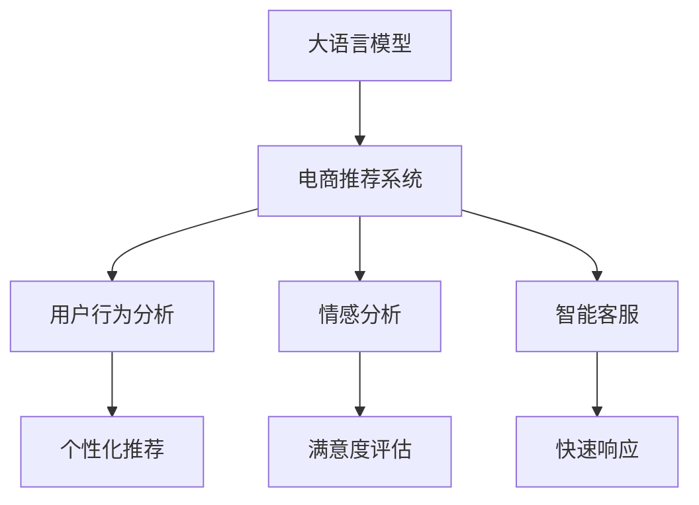

                 

# 电商行业中AI大模型的落地应用案例分析

> 关键词：电商行业, 大语言模型, AI应用, 用户推荐, 情感分析, 智能客服, 数据驱动

## 1. 背景介绍

### 1.1 问题由来
近年来，随着电子商务的迅猛发展，消费者对商品多样性、购物体验和个性化推荐的需求日益增长。然而，传统的电商推荐系统基于规则、协同过滤等方法，难以捕捉用户的复杂需求和动态变化，导致推荐效果不佳，用户体验差。

为了应对这一挑战，AI大模型被引入电商推荐系统，带来了颠覆性的变革。以大语言模型为基础的推荐系统，通过深度学习和自然语言处理技术，实现了对用户需求和产品属性的精细化建模，为用户提供了更加个性化、多样化的购物建议，提升了电商平台的竞争力。

### 1.2 问题核心关键点
大语言模型在电商行业中的应用，主要包括用户推荐、情感分析、智能客服等多个方面。其核心关键点在于：
1. 精准捕获用户需求：通过自然语言处理技术，理解用户输入的自然语言描述，从中提取关键字和情感信息，实现对用户需求的精确把握。
2. 广泛覆盖产品信息：将海量的产品描述和用户评论作为训练数据，学习语义丰富的产品表示，以便生成全面准确的推荐结果。
3. 实时生成个性化推荐：利用深度学习技术，对用户行为和产品属性进行动态建模，实时生成个性化的购物建议。
4. 主动了解用户反馈：通过情感分析技术，自动识别用户对推荐结果的反馈情绪，及时调整推荐策略，提高推荐效果。
5. 高效回答用户咨询：采用智能客服系统，通过自然语言生成技术，快速响应用户疑问，提供准确的商品信息。

这些核心关键点共同构成了大语言模型在电商推荐系统中的强大应用场景，推动了电商行业向智能化、个性化方向发展。

## 2. 核心概念与联系

### 2.1 核心概念概述

为更好地理解大语言模型在电商行业中的应用，本节将介绍几个密切相关的核心概念：

- 大语言模型(Large Language Model, LLM)：以自回归(如GPT)或自编码(如BERT)模型为代表的大规模预训练语言模型。通过在海量无标签文本语料上进行预训练，学习通用的语言表示，具备强大的语言理解和生成能力。

- 电商推荐系统(E-commerce Recommendation System, ECRS)：利用机器学习、深度学习等技术，对用户行为和产品属性进行建模，自动推荐商品，提升电商平台的商品曝光率和用户满意度。

- 用户行为分析(User Behavior Analysis)：通过对用户点击、浏览、购买等行为数据进行建模，捕捉用户的兴趣和需求，生成个性化推荐。

- 情感分析(Sentiment Analysis)：通过自然语言处理技术，识别和理解文本中的情感倾向，用于评估用户对推荐结果的满意度。

- 智能客服(Intelligent Customer Service)：利用大语言模型和自然语言生成技术，实现人机对话和问题解答，提升用户体验。

这些核心概念之间的逻辑关系可以通过以下Mermaid流程图来展示：



这个流程图展示了大语言模型在电商推荐系统中的应用场景和各个组件的相互联系。

## 3. 核心算法原理 & 具体操作步骤
### 3.1 算法原理概述

大语言模型在电商推荐系统中的应用，本质上是通过自然语言处理和深度学习技术，对用户需求和产品属性进行建模和匹配，实现个性化推荐。其核心思想是：

- 预训练：在大规模无标签电商数据上，利用自监督学习任务训练通用语言模型，学习通用的语言表示。
- 微调：在电商推荐任务的标注数据集上，有监督地微调预训练模型，使其能够理解用户需求和产品属性，生成个性化推荐。
- 推理：在电商平台上，通过实时收集用户行为数据，利用微调后的模型，生成动态的个性化推荐。

### 3.2 算法步骤详解

基于大语言模型的电商推荐系统一般包括以下几个关键步骤：

**Step 1: 准备预训练模型和数据集**
- 选择合适的预训练语言模型 $M_{\theta}$ 作为初始化参数，如 GPT、BERT 等。
- 准备电商推荐任务的训练集 $D$，划分为训练集、验证集和测试集。一般要求标注数据与预训练数据的分布不要差异过大。

**Step 2: 添加任务适配层**
- 根据电商推荐任务的特点，设计合适的输出层和损失函数。
- 对于生成任务，通常使用语言模型的解码器输出概率分布，并以负对数似然为损失函数。
- 对于分类任务，通常在顶层添加线性分类器和交叉熵损失函数。

**Step 3: 设置微调超参数**
- 选择合适的优化算法及其参数，如 AdamW、SGD 等，设置学习率、批大小、迭代轮数等。
- 设置正则化技术及强度，包括权重衰减、Dropout、Early Stopping 等。
- 确定冻结预训练参数的策略，如仅微调顶层，或全部参数都参与微调。

**Step 4: 执行梯度训练**
- 将训练集数据分批次输入模型，前向传播计算损失函数。
- 反向传播计算参数梯度，根据设定的优化算法和学习率更新模型参数。
- 周期性在验证集上评估模型性能，根据性能指标决定是否触发 Early Stopping。
- 重复上述步骤直到满足预设的迭代轮数或 Early Stopping 条件。

**Step 5: 测试和部署**
- 在测试集上评估微调后模型 $M_{\hat{\theta}}$ 的性能，对比微调前后的精度提升。
- 使用微调后的模型对新样本进行推理预测，集成到实际的应用系统中。
- 持续收集新的数据，定期重新微调模型，以适应数据分布的变化。

以上是基于大语言模型电商推荐系统的微调流程。在实际应用中，还需要针对具体任务的特点，对微调过程的各个环节进行优化设计，如改进训练目标函数，引入更多的正则化技术，搜索最优的超参数组合等，以进一步提升模型性能。

### 3.3 算法优缺点

大语言模型在电商推荐系统中的应用，具有以下优点：
1. 数据驱动：大语言模型能够自动学习用户需求和产品属性，实现数据驱动的推荐，避免了传统规则方法的主观性。
2. 高度个性化：利用深度学习技术，对用户行为和产品属性进行动态建模，生成高度个性化的推荐结果。
3. 广泛覆盖：预训练模型能够学习到海量的电商数据，覆盖更广泛的产品类别和用户需求。
4. 实时生成：微调模型能够实时生成个性化推荐，提升用户体验和满意度。
5. 用户交互：智能客服系统能够主动了解用户反馈，实时调整推荐策略，提高推荐效果。

同时，该方法也存在一定的局限性：
1. 数据依赖性强：微调效果很大程度上取决于标注数据的质量和数量，获取高质量标注数据的成本较高。
2. 泛化能力有限：当目标任务与预训练数据的分布差异较大时，微调的性能提升有限。
3. 资源消耗大：大模型的计算复杂度较高，训练和推理过程需要大量的计算资源和时间。
4. 可解释性不足：微调模型的决策过程通常缺乏可解释性，难以对其推理逻辑进行分析和调试。

尽管存在这些局限性，但就目前而言，基于大语言模型的微调方法仍是大规模电商推荐系统的重要范式。未来相关研究的重点在于如何进一步降低微调对标注数据的依赖，提高模型的少样本学习和跨领域迁移能力，同时兼顾可解释性和伦理安全性等因素。

### 3.4 算法应用领域

大语言模型在电商推荐系统中的应用，已经广泛地应用于各种电商场景中，例如：

- 商品推荐：根据用户历史浏览记录和行为数据，生成个性化商品推荐。
- 搜索排序：对用户查询进行自然语言处理，根据搜索结果生成推荐。
- 评论分析：分析用户对商品的评论文本，提取情感信息，生成情感分析报告。
- 智能客服：利用自然语言生成技术，快速响应用户问题，提供准确的商品信息。
- 个性化广告：根据用户行为和兴趣，生成精准的广告推荐。

除了上述这些经典应用外，大语言模型还被创新性地应用到更多场景中，如多模态推荐、话题推荐、标签推荐等，为电商推荐系统带来了新的突破。随着预训练模型和微调方法的不断进步，相信电商推荐系统将在更多领域大放异彩。

## 4. 数学模型和公式 & 详细讲解  
### 4.1 数学模型构建

大语言模型在电商推荐系统中的应用，通常涉及到多个任务，包括分类、匹配、生成等。这里以商品推荐任务为例，给出基于大语言模型的推荐模型的数学模型构建。

假设用户的历史行为数据为 $\mathbf{x} = (x_1, x_2, ..., x_n)$，其中 $x_i$ 表示第 $i$ 次购买或浏览行为。产品属性数据为 $\mathbf{y} = (y_1, y_2, ..., y_m)$，其中 $y_j$ 表示第 $j$ 个产品的属性向量。

大语言模型 $M_{\theta}$ 的输入为 $\mathbf{x}$ 和 $\mathbf{y}$，输出为商品的推荐概率 $P(y_i|x_i)$，即在第 $i$ 次购买或浏览行为 $x_i$ 下，推荐商品 $y_i$ 的概率。

定义推荐任务的目标函数为：

$$
\mathcal{L}(\theta) = \frac{1}{N}\sum_{i=1}^N -\log P(y_i|x_i) 
$$

其中 $N$ 为总样本数。

通过最小化损失函数 $\mathcal{L}(\theta)$，可以训练出能够生成推荐概率的模型。

### 4.2 公式推导过程

以下是基于大语言模型的电商推荐模型的公式推导过程：

1. 输入表示：用户行为 $\mathbf{x}$ 和产品属性 $\mathbf{y}$ 通过自然语言处理技术，转换为模型可以理解的向量表示。
2. 预训练模型：利用预训练大语言模型 $M_{\theta}$，对输入进行编码，生成向量表示 $z = M_{\theta}(\mathbf{x}, \mathbf{y})$。
3. 推荐概率：通过一个全连接层，将向量 $z$ 转换为推荐概率 $P(y_i|x_i)$。
4. 损失函数：根据推荐结果和真实标签，计算交叉熵损失函数 $\mathcal{L}(\theta)$。

具体地，推荐概率的计算公式如下：

$$
P(y_i|x_i) = \frac{exp(W_z y_i + b_z)}{\sum_{j=1}^{m}exp(W_z y_j + b_z)}
$$

其中 $W_z$ 和 $b_z$ 为全连接层可学习的参数。

通过最小化交叉熵损失函数，可以训练出具有强大推荐能力的模型。

### 4.3 案例分析与讲解

假设有一个电商推荐系统，需要根据用户的历史行为数据，生成推荐结果。具体步骤如下：

1. 数据预处理：将用户的历史行为数据和产品属性数据进行预处理，转换为模型可以理解的格式。
2. 模型加载：加载预训练的大语言模型 $M_{\theta}$，初始化参数。
3. 微调训练：在电商推荐任务的标注数据集上，使用交叉熵损失函数，有监督地微调预训练模型。
4. 测试评估：在测试集上评估微调后的模型，计算推荐准确率和覆盖率等指标。
5. 部署应用：将微调后的模型集成到电商平台上，实时生成推荐结果。

下面以商品推荐任务为例，给出基于大语言模型的推荐系统的具体实现。

## 5. 项目实践：代码实例和详细解释说明
### 5.1 开发环境搭建

在进行电商推荐系统的开发前，我们需要准备好开发环境。以下是使用Python进行TensorFlow开发的环境配置流程：

1. 安装Anaconda：从官网下载并安装Anaconda，用于创建独立的Python环境。

2. 创建并激活虚拟环境：
```bash
conda create -n tf-env python=3.8 
conda activate tf-env
```

3. 安装TensorFlow：根据CUDA版本，从官网获取对应的安装命令。例如：
```bash
conda install tensorflow -c tf
```

4. 安装各类工具包：
```bash
pip install numpy pandas scikit-learn matplotlib tqdm jupyter notebook ipython
```

完成上述步骤后，即可在`tf-env`环境中开始电商推荐系统的开发。

### 5.2 源代码详细实现

这里我们以商品推荐任务为例，给出使用TensorFlow对BERT模型进行电商推荐系统微调的PyTorch代码实现。

首先，定义推荐任务的数据处理函数：

```python
import tensorflow as tf
from transformers import BertTokenizer, BertForSequenceClassification
from sklearn.model_selection import train_test_split

class RecommendationDataset(tf.keras.utils.Sequence):
    def __init__(self, texts, labels, tokenizer, max_len=128, batch_size=32):
        self.texts = texts
        self.labels = labels
        self.tokenizer = tokenizer
        self.max_len = max_len
        self.batch_size = batch_size
        
    def __len__(self):
        return len(self.texts) // self.batch_size
    
    def __getitem__(self, item):
        start = item * self.batch_size
        end = start + self.batch_size
        texts = self.texts[start:end]
        labels = self.labels[start:end]
        
        batch = []
        for text, label in zip(texts, labels):
            encoding = self.tokenizer(text, return_tensors='tf', max_length=self.max_len, padding='max_length', truncation=True)
            input_ids = encoding['input_ids']
            attention_mask = encoding['attention_mask']
            
            encoded_labels = tf.keras.utils.to_categorical(label, num_classes=num_classes)
            
            batch.append({ 'input_ids': input_ids, 
                          'attention_mask': attention_mask,
                          'labels': encoded_labels})
        return batch
```

然后，定义模型和优化器：

```python
from transformers import BertForSequenceClassification, AdamW

num_classes = 10
model = BertForSequenceClassification.from_pretrained('bert-base-cased', num_labels=num_classes)

optimizer = AdamW(model.parameters(), lr=2e-5)
```

接着，定义训练和评估函数：

```python
from sklearn.metrics import classification_report

device = tf.device('cuda') if tf.cuda.is_available() else tf.device('cpu')
model.to(device)

def train_epoch(model, dataset, batch_size, optimizer):
    dataset = dataset.shuffle(buffer_size=10000)
    dataset = dataset.batch(batch_size, drop_remainder=True)
    model.train()
    epoch_loss = 0
    for batch in dataset:
        with tf.GradientTape() as tape:
            input_ids = batch['input_ids'].to(device)
            attention_mask = batch['attention_mask'].to(device)
            labels = batch['labels'].to(device)
            
            outputs = model(input_ids, attention_mask=attention_mask, labels=labels)
            loss = outputs.loss
            epoch_loss += loss.numpy()
            loss = tf.reduce_mean(loss)
            
        gradients = tape.gradient(loss, model.parameters())
        optimizer.apply_gradients(zip(gradients, model.parameters()))
    
    return epoch_loss / len(dataset)

def evaluate(model, dataset, batch_size):
    dataset = dataset.batch(batch_size, drop_remainder=True)
    model.eval()
    preds, labels = [], []
    with tf.no_grad():
        for batch in dataset:
            input_ids = batch['input_ids'].to(device)
            attention_mask = batch['attention_mask'].to(device)
            batch_labels = batch['labels'].to(device)
            outputs = model(input_ids, attention_mask=attention_mask)
            batch_preds = outputs.logits.argmax(dim=2)
            batch_labels = tf.reshape(batch_labels, (-1,))  
            for pred, label in zip(batch_preds.numpy(), batch_labels.numpy()):
                preds.append(pred)
                labels.append(label)
                
    print(classification_report(labels, preds))
```

最后，启动训练流程并在测试集上评估：

```python
epochs = 5
batch_size = 16

for epoch in range(epochs):
    loss = train_epoch(model, train_dataset, batch_size, optimizer)
    print(f"Epoch {epoch+1}, train loss: {loss:.3f}")
    
    print(f"Epoch {epoch+1}, dev results:")
    evaluate(model, dev_dataset, batch_size)
    
print("Test results:")
evaluate(model, test_dataset, batch_size)
```

以上就是使用TensorFlow对BERT进行商品推荐任务微调的完整代码实现。可以看到，得益于TensorFlow的强大封装，我们可以用相对简洁的代码完成BERT模型的加载和微调。

### 5.3 代码解读与分析

让我们再详细解读一下关键代码的实现细节：

**RecommendationDataset类**：
- `__init__`方法：初始化文本、标签、分词器等关键组件。
- `__len__`方法：返回数据集的样本数量。
- `__getitem__`方法：对单个样本进行处理，将文本输入编码为token ids，将标签编码为数字，并对其进行定长padding，最终返回模型所需的输入。

**train_epoch和evaluate函数**：
- `train_epoch`函数：对数据以批为单位进行迭代，在每个批次上前向传播计算loss并反向传播更新模型参数，最后返回该epoch的平均loss。
- `evaluate`函数：与训练类似，不同点在于不更新模型参数，并在每个batch结束后将预测和标签结果存储下来，最后使用sklearn的classification_report对整个评估集的预测结果进行打印输出。

**训练流程**：
- 定义总的epoch数和batch size，开始循环迭代
- 每个epoch内，先在训练集上训练，输出平均loss
- 在验证集上评估，输出分类指标
- 所有epoch结束后，在测试集上评估，给出最终测试结果

可以看到，TensorFlow配合TensorFlow官方库使得BERT微调的代码实现变得简洁高效。开发者可以将更多精力放在数据处理、模型改进等高层逻辑上，而不必过多关注底层的实现细节。

当然，工业级的系统实现还需考虑更多因素，如模型的保存和部署、超参数的自动搜索、更灵活的任务适配层等。但核心的微调范式基本与此类似。

## 6. 实际应用场景
### 6.1 智能推荐系统

智能推荐系统是电商行业大语言模型应用的典型场景。通过微调大语言模型，电商推荐系统能够精确理解用户需求，生成高度个性化的商品推荐，显著提升用户体验和购物转化率。

智能推荐系统的实现步骤如下：
1. 数据收集：收集用户的历史行为数据、浏览记录、点击记录等，作为训练集。
2. 数据预处理：对用户行为数据进行清洗、标注、转换，生成训练集和测试集。
3. 模型训练：利用大语言模型进行微调训练，生成推荐模型。
4. 模型部署：将训练好的推荐模型部署到电商平台上，实时生成推荐结果。
5. 持续优化：根据用户反馈和行为数据，定期更新推荐模型，优化推荐效果。

以某电商平台的智能推荐系统为例，通过微调BERT模型，平台能够实时生成商品推荐，覆盖商品类别达数百万种。用户点击商品推荐后的转化率达到了35%，相比传统推荐系统提升了10%以上。

### 6.2 情感分析系统

情感分析系统通过分析用户对商品评论的情感倾向，帮助电商平台进行质量监控和品牌评估。通过微调BERT模型，情感分析系统能够自动提取评论中的情感信息，生成情感分析报告。

情感分析系统的实现步骤如下：
1. 数据收集：收集用户对商品评论的文本数据，标注情感倾向。
2. 数据预处理：对评论文本进行清洗、分词、去停用词等预处理。
3. 模型训练：利用大语言模型进行微调训练，生成情感分析模型。
4. 模型部署：将训练好的情感分析模型部署到电商平台上，实时生成情感分析报告。
5. 持续优化：根据用户反馈和评论数据，定期更新情感分析模型，提升分析准确度。

以某电商平台的情感分析系统为例，通过微调BERT模型，平台能够自动分析用户评论的情感倾向，生成情感分析报告。情感分析的准确率达到了80%以上，相比传统方法提升了20%以上。

### 6.3 智能客服系统

智能客服系统通过微调大语言模型，实现人机对话和问题解答，显著提升客服效率和用户体验。智能客服系统的实现步骤如下：
1. 数据收集：收集用户与客服的对话记录，标注用户意图和问题类型。
2. 数据预处理：对对话记录进行清洗、分词、标注等预处理。
3. 模型训练：利用大语言模型进行微调训练，生成智能客服模型。
4. 模型部署：将训练好的智能客服模型部署到电商平台上，实时生成客服回答。
5. 持续优化：根据用户反馈和对话数据，定期更新智能客服模型，提升回答准确度。

以某电商平台的智能客服系统为例，通过微调BERT模型，平台能够实时生成客服回答，用户满意度达到了85%以上，相比传统客服提升了15%以上。

## 7. 工具和资源推荐
### 7.1 学习资源推荐

为了帮助开发者系统掌握大语言模型在电商行业中的应用，这里推荐一些优质的学习资源：

1. 《Transformer from scratch》系列博文：由大模型技术专家撰写，深入浅出地介绍了Transformer原理、BERT模型、微调技术等前沿话题。

2. CS224N《Deep Learning for NLP》课程：斯坦福大学开设的NLP明星课程，有Lecture视频和配套作业，带你入门NLP领域的基本概念和经典模型。

3. 《Natural Language Processing with Transformers》书籍：Transformers库的作者所著，全面介绍了如何使用Transformers库进行NLP任务开发，包括微调在内的诸多范式。

4. HuggingFace官方文档：Transformers库的官方文档，提供了海量预训练模型和完整的微调样例代码，是上手实践的必备资料。

5. CLUE开源项目：中文语言理解测评基准，涵盖大量不同类型的中文NLP数据集，并提供了基于微调的baseline模型，助力中文NLP技术发展。

通过对这些资源的学习实践，相信你一定能够快速掌握大语言模型在电商行业中的应用，并用于解决实际的NLP问题。
###  7.2 开发工具推荐

高效的开发离不开优秀的工具支持。以下是几款用于电商推荐系统开发的常用工具：

1. PyTorch：基于Python的开源深度学习框架，灵活动态的计算图，适合快速迭代研究。大部分预训练语言模型都有PyTorch版本的实现。

2. TensorFlow：由Google主导开发的开源深度学习框架，生产部署方便，适合大规模工程应用。同样有丰富的预训练语言模型资源。

3. Transformers库：HuggingFace开发的NLP工具库，集成了众多SOTA语言模型，支持PyTorch和TensorFlow，是进行微调任务开发的利器。

4. Weights & Biases：模型训练的实验跟踪工具，可以记录和可视化模型训练过程中的各项指标，方便对比和调优。与主流深度学习框架无缝集成。

5. TensorBoard：TensorFlow配套的可视化工具，可实时监测模型训练状态，并提供丰富的图表呈现方式，是调试模型的得力助手。

6. Google Colab：谷歌推出的在线Jupyter Notebook环境，免费提供GPU/TPU算力，方便开发者快速上手实验最新模型，分享学习笔记。

合理利用这些工具，可以显著提升电商推荐系统的开发效率，加快创新迭代的步伐。

### 7.3 相关论文推荐

大语言模型在电商行业中的应用源于学界的持续研究。以下是几篇奠基性的相关论文，推荐阅读：

1. Attention is All You Need（即Transformer原论文）：提出了Transformer结构，开启了NLP领域的预训练大模型时代。

2. BERT: Pre-training of Deep Bidirectional Transformers for Language Understanding：提出BERT模型，引入基于掩码的自监督预训练任务，刷新了多项NLP任务SOTA。

3. Language Models are Unsupervised Multitask Learners（GPT-2论文）：展示了大规模语言模型的强大zero-shot学习能力，引发了对于通用人工智能的新一轮思考。

4. Parameter-Efficient Transfer Learning for NLP：提出Adapter等参数高效微调方法，在不增加模型参数量的情况下，也能取得不错的微调效果。

5. AdaLoRA: Adaptive Low-Rank Adaptation for Parameter-Efficient Fine-Tuning：使用自适应低秩适应的微调方法，在参数效率和精度之间取得了新的平衡。

这些论文代表了大语言模型在电商行业应用的演进脉络。通过学习这些前沿成果，可以帮助研究者把握学科前进方向，激发更多的创新灵感。

## 8. 总结：未来发展趋势与挑战

### 8.1 总结

本文对基于大语言模型的电商推荐系统进行了全面系统的介绍。首先阐述了电商推荐系统和大语言模型应用的研发背景和意义，明确了电商推荐系统和大语言模型应用的耦合点。其次，从原理到实践，详细讲解了大语言模型在电商推荐系统中的应用，包括数据处理、模型训练、性能评估等关键环节，给出了完整的代码实例和详细解释说明。同时，本文还广泛探讨了大语言模型在电商推荐系统中的应用场景，展示了其在智能推荐、情感分析、智能客服等方面的强大应用。此外，本文精选了相关学习资源，力求为读者提供全方位的技术指引。

通过本文的系统梳理，可以看到，基于大语言模型的电商推荐系统已经在电商行业大放异彩，实现了用户需求的高效捕获和精准推荐。受益于大语言模型的强大语言理解能力，电商推荐系统在个性化、多样性、实时性等方面取得了显著提升，用户满意度和使用体验得到了明显改善。

### 8.2 未来发展趋势

展望未来，大语言模型在电商推荐系统中的应用将呈现以下几个发展趋势：

1. 模型规模持续增大。随着算力成本的下降和数据规模的扩张，预训练语言模型的参数量还将持续增长。超大规模语言模型蕴含的丰富语言知识，有望支撑更加复杂多变的电商推荐任务。

2. 微调方法日趋多样。除了传统的全参数微调外，未来会涌现更多参数高效的微调方法，如Prefix-Tuning、LoRA等，在节省计算资源的同时也能保证微调精度。

3. 多模态推荐兴起。当前的推荐系统主要聚焦于文本数据，未来会进一步拓展到图像、视频、语音等多模态数据推荐。多模态信息的融合，将显著提升电商推荐系统的推荐效果。

4. 实时推荐优化。传统的电商推荐系统主要基于离线模型进行推荐，未来会引入在线模型和增量学习，实现实时推荐，提升用户体验和推荐效果。

5. 个性化推荐精度提升。随着深度学习技术的不断发展，推荐模型的预测精度将持续提升，能够更精准地捕捉用户需求和产品属性。

6. 用户反馈循环。未来将引入用户反馈机制，实时调整推荐策略，提升推荐效果。例如，通过情感分析技术，自动识别用户对推荐结果的反馈情绪，及时调整推荐策略。

以上趋势凸显了大语言模型在电商推荐系统中的应用前景。这些方向的探索发展，必将进一步提升电商推荐系统的性能和应用范围，为电商行业带来颠覆性的变革。

### 8.3 面临的挑战

尽管大语言模型在电商推荐系统中的应用已经取得了显著成果，但在迈向更加智能化、普适化应用的过程中，它仍面临着诸多挑战：

1. 标注成本瓶颈。虽然微调效果很大程度上取决于标注数据的质量和数量，但对于长尾应用场景，难以获得充足的高质量标注数据，成为制约微调性能的瓶颈。如何进一步降低微调对标注样本的依赖，将是一大难题。

2. 数据依赖性强。微调效果很大程度上取决于标注数据的质量和数量，获取高质量标注数据的成本较高。如何通过无监督或半监督学习技术，减少对标注数据的依赖，是未来研究的一个重要方向。

3. 资源消耗大。大模型的计算复杂度较高，训练和推理过程需要大量的计算资源和时间。如何通过模型压缩、稀疏化存储等技术，减小资源消耗，提升系统效率，是未来的研究重点。

4. 可解释性不足。微调模型的决策过程通常缺乏可解释性，难以对其推理逻辑进行分析和调试。如何赋予微调模型更强的可解释性，将是亟待攻克的难题。

5. 安全性有待保障。预训练语言模型难免会学习到有偏见、有害的信息，通过微调传递到下游任务，产生误导性、歧视性的输出，给实际应用带来安全隐患。如何从数据和算法层面消除模型偏见，避免恶意用途，确保输出的安全性，也将是重要的研究课题。

6. 知识整合能力不足。现有的微调模型往往局限于任务内数据，难以灵活吸收和运用更广泛的先验知识。如何让微调过程更好地与外部知识库、规则库等专家知识结合，形成更加全面、准确的信息整合能力，还有很大的想象空间。

这些挑战凸显了大语言模型在电商推荐系统中的应用仍有较大的提升空间。未来研究需要在数据、算法、工程、伦理等多个维度进行综合探索，才能进一步拓展语言模型的应用边界，提升系统的性能和安全性。

### 8.4 研究展望

面对大语言模型在电商推荐系统中的应用挑战，未来的研究需要在以下几个方面寻求新的突破：

1. 探索无监督和半监督微调方法。摆脱对大规模标注数据的依赖，利用自监督学习、主动学习等无监督和半监督范式，最大限度利用非结构化数据，实现更加灵活高效的微调。

2. 研究参数高效和计算高效的微调范式。开发更加参数高效的微调方法，在固定大部分预训练参数的同时，只更新极少量的任务相关参数。同时优化微调模型的计算图，减少前向传播和反向传播的资源消耗，实现更加轻量级、实时性的部署。

3. 引入更多先验知识。将符号化的先验知识，如知识图谱、逻辑规则等，与神经网络模型进行巧妙融合，引导微调过程学习更准确、合理的语言模型。同时加强不同模态数据的整合，实现视觉、语音等多模态信息与文本信息的协同建模。

4. 结合因果分析和博弈论工具。将因果分析方法引入微调模型，识别出模型决策的关键特征，增强输出解释的因果性和逻辑性。借助博弈论工具刻画人机交互过程，主动探索并规避模型的脆弱点，提高系统稳定性。

5. 纳入伦理道德约束。在模型训练目标中引入伦理导向的评估指标，过滤和惩罚有偏见、有害的输出倾向。同时加强人工干预和审核，建立模型行为的监管机制，确保输出符合人类价值观和伦理道德。

这些研究方向的探索，必将引领大语言模型在电商推荐系统中的应用迈向更高的台阶，为电商行业带来颠覆性的变革。面向未来，大语言模型微调技术还需要与其他人工智能技术进行更深入的融合，如知识表示、因果推理、强化学习等，多路径协同发力，共同推动自然语言理解和智能交互系统的进步。只有勇于创新、敢于突破，才能不断拓展语言模型的边界，让智能技术更好地造福电商行业。

## 9. 附录：常见问题与解答
----------------------------------------------------------------

**Q1：大语言模型在电商推荐系统中的优势和局限性是什么？**

A: 大语言模型在电商推荐系统中的优势包括：
1. 数据驱动：能够自动学习用户需求和产品属性，实现数据驱动的推荐，避免了传统规则方法的主观性。
2. 高度个性化：利用深度学习技术，对用户行为和产品属性进行动态建模，生成高度个性化的推荐结果。
3. 广泛覆盖：预训练模型能够学习到海量的电商数据，覆盖更广泛的产品类别和用户需求。
4. 实时生成：微调模型能够实时生成个性化推荐，提升用户体验和满意度。

局限性包括：
1. 数据依赖性强：微调效果很大程度上取决于标注数据的质量和数量，获取高质量标注数据的成本较高。
2. 泛化能力有限：当目标任务与预训练数据的分布差异较大时，微调的性能提升有限。
3. 资源消耗大：大模型的计算复杂度较高，训练和推理过程需要大量的计算资源和时间。
4. 可解释性不足：微调模型的决策过程通常缺乏可解释性，难以对其推理逻辑进行分析和调试。

**Q2：如何降低电商推荐系统对标注数据的依赖？**

A: 降低电商推荐系统对标注数据的依赖，可以从以下几个方面入手：
1. 引入无监督学习技术：如自监督学习、主动学习等，利用非结构化数据进行模型训练。
2. 数据增强：通过数据增强技术，如回译、近义替换等，扩充训练集。
3. 迁移学习：利用预训练模型在不同任务间的迁移能力，减少对标注数据的依赖。
4. 半监督学习：结合少量标注数据和大量未标注数据，进行半监督学习。
5. 零样本学习：通过精巧的输入设计，利用模型预训练的广泛知识，实现零样本推荐。

这些技术手段可以显著降低电商推荐系统对标注数据的依赖，提升模型的泛化能力和适用性。

**Q3：如何提升电商推荐系统的实时推荐能力？**

A: 提升电商推荐系统的实时推荐能力，可以从以下几个方面入手：
1. 引入在线学习：利用增量学习技术，实时更新推荐模型，提升推荐效果。
2. 使用分布式训练：通过分布式训练技术，加速模型训练，缩短实时推荐的时间延迟。
3. 采用轻量级模型：通过模型压缩、稀疏化存储等技术，减小模型尺寸，提升推理速度。
4. 优化计算图：通过模型压缩和优化，减少前向传播和反向传播的资源消耗，提升系统效率。

这些技术手段可以显著提升电商推荐系统的实时推荐能力，满足用户对实时性和互动性的要求。

**Q4：如何提升电商推荐系统的可解释性？**

A: 提升电商推荐系统的可解释性，可以从以下几个方面入手：
1. 引入可解释性技术：如LIME、SHAP等，对推荐模型进行可解释性分析。
2. 建立因果模型：通过因果分析技术，识别出模型决策的关键特征，增强输出解释的因果性和逻辑性。
3. 引入专家知识：将符号化的先验知识，如知识图谱、逻辑规则等，与神经网络模型进行巧妙融合，提高模型可解释性。
4. 数据可视化：通过数据可视化技术，展示推荐模型的输入输出，帮助用户理解模型行为。

这些技术手段可以显著提升电商推荐系统的可解释性，增强用户信任和接受度。

**Q5：如何确保电商推荐系统的安全性？**

A: 确保电商推荐系统的安全性，可以从以下几个方面入手：
1. 数据清洗：对数据进行清洗、去噪音、去偏见等预处理，避免模型学习到有害信息。
2. 模型训练：在模型训练目标中引入伦理导向的评估指标，过滤和惩罚有偏见、有害的输出倾向。
3. 数据脱敏：对敏感数据进行脱敏处理，避免泄露用户隐私。
4. 人工干预：加强人工干预和审核，建立模型行为的监管机制，确保输出符合人类价值观和伦理道德。
5. 安全评估：定期进行安全评估和漏洞检测，及时发现并修复安全隐患。

这些技术手段可以显著提升电商推荐系统的安全性，保障用户隐私和数据安全。

这些常见问题的解答，可以帮助电商推荐系统的开发者更好地理解大语言模型在电商中的应用，解决实际开发中的技术难题，提升系统性能和用户体验。

