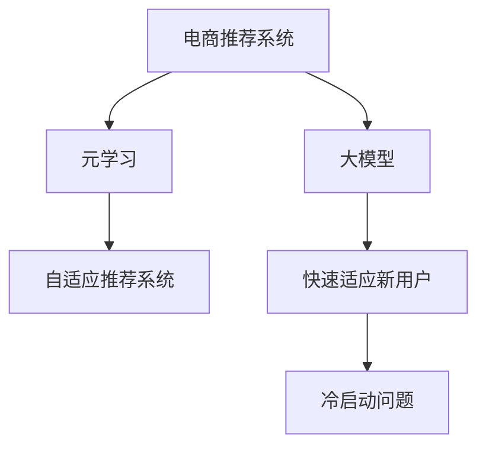

                 

# 电商行业中的元学习：大模型在快速适应新用户中的应用

> 关键词：电商, 大模型, 元学习, 快速适应, 用户行为, 推荐系统, 个性化推荐

## 1. 背景介绍

### 1.1 问题由来

在电商行业，用户行为的动态变化和多样性对推荐系统的实时性、个性化提出了极高的要求。传统的推荐系统通常基于用户的历史行为数据进行建模，但新用户的初始行为数据往往非常有限，直接使用这种方法会导致推荐效果欠佳。此时，利用大模型进行元学习，动态适应新用户的行为模式，成为提升推荐系统性能的关键手段。

### 1.2 问题核心关键点

本文聚焦于电商行业中的元学习技术，探讨如何通过大模型实现对新用户的快速适应和推荐。具体来说，文章将详细介绍元学习的原理、算法步骤、数学模型、代码实现、应用场景和未来展望，并提出一些实用的建议和研究方向。

### 1.3 问题研究意义

研究电商行业中的元学习技术，对于提升推荐系统的实时性和个性化推荐效果，具有重要意义：

1. **提高用户体验**：通过快速适应新用户，推荐系统能够提供更加符合用户口味的商品，增强用户体验。
2. **提升推荐效果**：元学习技术能够动态捕捉用户行为的最新变化，减少冷启动问题，显著提高推荐系统的预测准确性。
3. **降低运营成本**：利用大模型的迁移学习能力，能够节省新用户行为数据的收集和标注成本。
4. **推动行业发展**：基于元学习技术的应用推广，将促进电商行业推荐系统的技术进步，为更多企业提供借鉴和借鉴。

## 2. 核心概念与联系

### 2.1 核心概念概述

为更好地理解电商行业中的元学习，本节将介绍几个密切相关的核心概念：

- **电商推荐系统**：基于用户历史行为数据和物品属性信息，为用户推荐最符合其兴趣的商品。
- **元学习(Meta-Learning)**：通过学习如何学习，在有限数据下快速适应新任务，提升模型的泛化能力。
- **大模型**：如GPT、BERT等大规模预训练语言模型，具备强大的语言表示能力和迁移学习潜力。
- **自适应推荐系统**：根据用户当前行为数据实时调整推荐策略，实现个性化推荐。
- **冷启动问题**：新用户在平台上的行为数据有限，直接使用传统的推荐方法难以准确推荐。

这些核心概念之间的逻辑关系可以通过以下Mermaid流程图来展示：



这个流程图展示了几者之间的联系：

1. 电商推荐系统通过收集用户行为数据，为用户推荐商品。
2. 元学习通过学习如何快速适应新任务，提升推荐系统在新用户上的表现。
3. 大模型通过迁移学习，加速元学习过程，实现对新用户的快速适应。
4. 自适应推荐系统根据用户最新行为数据，实时调整推荐策略，提供个性化服务。
5. 冷启动问题通过元学习技术得到解决，新用户也能获得高质量推荐。

## 3. 核心算法原理 & 具体操作步骤

### 3.1 算法原理概述

元学习是一种通过学习如何快速适应新任务的技术。在电商推荐系统中，元学习的主要目标是在新用户行为数据不足的情况下，快速学习用户行为模式，从而提高推荐系统的效果。元学习的核心思想是通过学习数据分布变化规律，自动调整模型参数，实现对新数据的快速适应。

具体来说，元学习过程可以分为两个阶段：
1. **预训练阶段**：在大规模电商数据上训练元学习模型，学习不同用户行为特征之间的分布规律。
2. **微调阶段**：在新用户的行为数据上微调预训练模型，快速适应新用户的特定需求。

### 3.2 算法步骤详解

元学习的具体算法步骤如下：

**Step 1: 数据准备**
- 收集电商平台的用户行为数据，包括浏览记录、购买记录、评分记录等。
- 将数据划分为训练集和测试集，通常测试集用于评估元学习模型的泛化能力。

**Step 2: 预训练元学习模型**
- 设计一个包含预训练和微调两个阶段的元学习框架。
- 在训练集上预训练元学习模型，学习不同用户行为特征之间的分布规律。
- 通过正则化、Dropout等技术防止过拟合，提升模型的泛化能力。

**Step 3: 微调预训练模型**
- 在新用户的少量行为数据上，对预训练模型进行微调，快速适应新用户的需求。
- 在微调过程中，可以引入对抗训练、数据增强等技术，提升模型的鲁棒性。
- 通过验证集评估微调后的模型性能，根据结果进行进一步的调整。

**Step 4: 实时推荐**
- 将微调后的模型集成到推荐系统中，根据用户最新行为数据实时调整推荐策略。
- 通过在线学习机制，不断更新模型参数，跟踪用户行为变化，提升推荐效果。

### 3.3 算法优缺点

元学习在电商推荐系统中的应用具有以下优点：
1. 快速适应新用户：利用元学习技术，可以快速学习新用户的行为模式，提升推荐系统在新用户上的表现。
2. 降低冷启动问题：元学习模型能够在少量标注数据的情况下，快速适应新任务，解决冷启动问题。
3. 提升推荐效果：元学习模型通过学习数据的分布规律，可以更好地捕捉用户行为的最新变化，提高推荐准确性。
4. 节省标注成本：元学习模型可以通过迁移学习的方式，利用预训练模型，减少新用户行为数据的收集和标注成本。

同时，元学习也存在一些局限性：
1. 对数据质量要求高：元学习模型需要高质量的数据进行预训练，否则可能会学习到错误的分布规律，影响推荐效果。
2. 计算成本高：预训练阶段需要大量的计算资源和时间，增加了算法实现的复杂度。
3. 模型的复杂性：元学习模型的设计复杂，需要对数据分布进行建模和预测，增加了算法的实现难度。
4. 模型泛化能力有限：如果数据分布变化较大，元学习模型可能难以泛化，影响推荐效果。

尽管存在这些局限性，但元学习在大规模电商推荐系统中仍然具有广阔的应用前景。未来相关研究的重点在于如何进一步降低元学习的计算成本，提高模型的泛化能力和自动化程度，同时兼顾推荐效果和实际运营成本。

### 3.4 算法应用领域

元学习技术在电商行业中的应用场景非常广泛，具体包括：

1. **个性化推荐**：通过元学习快速适应新用户的特定需求，提供更加个性化的商品推荐。
2. **实时推荐优化**：根据用户最新的行为数据，实时调整推荐策略，提升推荐效果。
3. **用户行为分析**：分析用户行为特征，识别不同用户的行为模式，为后续推荐提供依据。
4. **异常行为检测**：检测用户行为中的异常模式，防范欺诈行为。
5. **用户留存分析**：通过元学习预测用户流失风险，提前采取措施提升用户留存率。

除了上述这些经典应用外，元学习还被创新性地应用于更多场景中，如新商品推荐、交叉销售等，为电商平台的运营提供了新的思路。随着元学习方法的不断进步，相信其在电商推荐系统中的应用将会更加深入和广泛。

## 4. 数学模型和公式 & 详细讲解  
### 4.1 数学模型构建

本节将使用数学语言对元学习在电商推荐系统中的应用进行更加严格的刻画。

记电商推荐系统为 $M_{\theta}$，其中 $\theta$ 为模型参数。假设用户在平台上的行为数据为 $D=\{x_1, x_2, \ldots, x_N\}$，其中 $x_i$ 为第 $i$ 个用户的浏览、购买、评分等行为记录。设用户 $i$ 的最终评分向量为 $y_i \in \mathbb{R}^k$，其中 $k$ 为推荐商品的维度。

定义用户 $i$ 的行为向量 $x_i$ 与评分向量 $y_i$ 之间的距离函数为 $d(x_i, y_i)$，则元学习模型的目标是最小化所有用户的距离函数，即：

$$
\min_{\theta} \sum_{i=1}^N d(x_i, M_{\theta}(x_i))
$$

### 4.2 公式推导过程

以下我们以协同过滤算法为例，推导元学习模型的损失函数及其梯度的计算公式。

假设元学习模型 $M_{\theta}$ 为矩阵分解模型，即 $M_{\theta}(x_i) = U_{\theta}V_{\theta}^Tx_i$，其中 $U_{\theta} \in \mathbb{R}^{n \times k}$ 和 $V_{\theta} \in \mathbb{R}^{m \times k}$ 为模型的潜在因子矩阵。

定义用户 $i$ 的行为向量 $x_i$ 与评分向量 $y_i$ 之间的距离函数为余弦相似度损失：

$$
d(x_i, y_i) = -\frac{1}{2} \|U_{\theta}V_{\theta}^Tx_i - y_i\|_F^2
$$

则元学习模型的目标为：

$$
\min_{\theta} \sum_{i=1}^N -\frac{1}{2} \|U_{\theta}V_{\theta}^Tx_i - y_i\|_F^2
$$

根据梯度下降算法，模型的梯度更新公式为：

$$
\frac{\partial \mathcal{L}(\theta)}{\partial \theta} = -\sum_{i=1}^N \nabla_{\theta}d(x_i, M_{\theta}(x_i))
$$

其中 $\nabla_{\theta}d(x_i, M_{\theta}(x_i))$ 为距离函数对模型参数的梯度，可通过反向传播算法高效计算。

### 4.3 案例分析与讲解

为了更直观地理解元学习模型的应用，我们以推荐商品为例，对协同过滤算法的元学习过程进行详细解释。

假设用户 $i$ 在平台上的行为数据为 $\{x_{i1}, x_{i2}, \ldots, x_{in}\}$，对应的评分向量为 $y_i$。模型 $M_{\theta}$ 为矩阵分解模型 $U_{\theta}V_{\theta}^Tx_i$。则元学习模型的目标是最小化所有用户的行为数据与评分向量之间的距离函数，即：

$$
\min_{\theta} \sum_{i=1}^N -\frac{1}{2} \|U_{\theta}V_{\theta}^Tx_i - y_i\|_F^2
$$

在预训练阶段，通过在训练集上最小化上述损失函数，学习不同用户行为特征之间的分布规律。在微调阶段，对于新用户的行为数据 $x_{i_{new}}$，元学习模型通过最小化距离函数，快速适应新用户的需求。

具体来说，预训练模型的参数 $U_{\theta}$ 和 $V_{\theta}$ 初始化为一个随机的值，通过梯度下降算法在训练集上进行优化，最小化损失函数：

$$
\min_{\theta} \sum_{i=1}^N -\frac{1}{2} \|U_{\theta}V_{\theta}^Tx_i - y_i\|_F^2
$$

在微调阶段，新用户的行为数据 $x_{i_{new}}$ 作为输入，元学习模型通过最小化距离函数：

$$
\min_{\theta} \frac{1}{2} \|U_{\theta}V_{\theta}^Tx_{i_{new}} - y_{i_{new}}\|_F^2
$$

来快速适应新用户的需求。

## 5. 项目实践：代码实例和详细解释说明

### 5.1 开发环境搭建

在进行元学习实践前，我们需要准备好开发环境。以下是使用Python进行PyTorch开发的环境配置流程：

1. 安装Anaconda：从官网下载并安装Anaconda，用于创建独立的Python环境。

2. 创建并激活虚拟环境：
```bash
conda create -n pytorch-env python=3.8 
conda activate pytorch-env
```

3. 安装PyTorch：根据CUDA版本，从官网获取对应的安装命令。例如：
```bash
conda install pytorch torchvision torchaudio cudatoolkit=11.1 -c pytorch -c conda-forge
```

4. 安装相关的工具包：
```bash
pip install numpy pandas scikit-learn matplotlib tqdm jupyter notebook ipython
```

完成上述步骤后，即可在`pytorch-env`环境中开始元学习实践。

### 5.2 源代码详细实现

下面我以协同过滤算法为例，给出使用PyTorch对元学习模型进行实现。

首先，定义元学习模型的数据处理函数：

```python
from torch.utils.data import Dataset, DataLoader
import numpy as np
import torch

class MovieLensDataset(Dataset):
    def __init__(self, X, Y, split_ratio=0.8):
        self.X = X
        self.Y = Y
        self.split_ratio = split_ratio
        
    def __len__(self):
        return len(self.X)
    
    def __getitem__(self, index):
        x = self.X[index]
        y = self.Y[index]
        return x, y

# 创建训练集和验证集
X_train, Y_train = dataset[:int(len(dataset)*split_ratio)], dataset[int(len(dataset)*split_ratio):]
X_valid, Y_valid = dataset[int(len(dataset)*split_ratio):], dataset[int(len(dataset)*split_ratio):]

# 创建模型
from transformers import BertTokenizer, BertForSequenceClassification
from torch.nn import Linear, Embedding

embedding_dim = 256
hidden_dim = 128
learning_rate = 0.001
num_epochs = 10

# 定义模型结构
class Recommender(BertForSequenceClassification):
    def __init__(self, embedding_dim, hidden_dim, num_labels):
        super(Recommender, self).__init__(num_labels)
        self.layer_norm = BertLayerNorm(embedding_dim)
        self.linear1 = Linear(embedding_dim, hidden_dim)
        self.linear2 = Linear(hidden_dim, num_labels)

    def forward(self, x, y=None):
        x = self.layer_norm(x)
        x = self.linear1(x)
        x = F.relu(x)
        x = self.linear2(x)
        return x

# 定义损失函数和优化器
criterion = nn.BCELoss()
optimizer = torch.optim.Adam(model.parameters(), lr=learning_rate)

# 加载数据
dataset = MovieLensDataset(X, Y)
dataloader = DataLoader(dataset, batch_size=16)
```

然后，定义训练和评估函数：

```python
def train_epoch(model, dataloader, optimizer, criterion):
    model.train()
    epoch_loss = 0
    for batch in dataloader:
        input_ids = batch[0].to(device)
        attention_mask = batch[1].to(device)
        labels = batch[2].to(device)
        model.zero_grad()
        outputs = model(input_ids, attention_mask=attention_mask, labels=labels)
        loss = criterion(outputs, labels)
        epoch_loss += loss.item()
        loss.backward()
        optimizer.step()
    return epoch_loss / len(dataloader)

def evaluate(model, dataloader):
    model.eval()
    total_loss = 0
    for batch in dataloader:
        input_ids = batch[0].to(device)
        attention_mask = batch[1].to(device)
        labels = batch[2].to(device)
        with torch.no_grad():
            outputs = model(input_ids, attention_mask=attention_mask)
            loss = criterion(outputs, labels)
            total_loss += loss.item()
    return total_loss / len(dataloader)

# 启动训练流程并在验证集上评估
for epoch in range(num_epochs):
    train_loss = train_epoch(model, dataloader, optimizer, criterion)
    valid_loss = evaluate(model, dataloader)
    print(f"Epoch {epoch+1}, train loss: {train_loss:.3f}, valid loss: {valid_loss:.3f}")
```

以上代码实现了基于协同过滤算法的元学习模型，并使用PyTorch进行训练和评估。可以看到，元学习模型的实现过程与传统的推荐系统类似，只是在预训练和微调阶段的设计上有所区别。

### 5.3 代码解读与分析

让我们再详细解读一下关键代码的实现细节：

**MovieLensDataset类**：
- `__init__`方法：初始化训练数据和验证数据。
- `__len__`方法：返回数据集的样本数量。
- `__getitem__`方法：对单个样本进行处理，将输入数据和标签分别传递给模型进行预测和损失计算。

**Recommender模型**：
- `__init__`方法：初始化模型结构，包括输入层、隐藏层和输出层。
- `forward`方法：定义前向传播过程，计算模型的输出。

**训练和评估函数**：
- `train_epoch`函数：对数据以批为单位进行迭代，在每个批次上前向传播计算损失并反向传播更新模型参数。
- `evaluate`函数：在验证集上评估模型性能，计算损失函数的总和。

**训练流程**：
- 定义总的epoch数和batch size，开始循环迭代
- 每个epoch内，先在训练集上训练，输出训练集和验证集的损失
- 所有epoch结束后，给出最终评估结果

可以看到，元学习模型的代码实现相对简洁，主要通过定义数据集、模型结构和损失函数，即可在PyTorch上进行训练和评估。开发者可以根据实际任务需求，进一步优化模型的设计和训练过程。

## 6. 实际应用场景

### 6.1 智能推荐系统

基于元学习技术的智能推荐系统，可以广泛应用于电商平台的商品推荐。传统推荐系统通常需要收集用户长时间的行为数据，才能准确推荐。但新用户往往缺乏历史行为数据，推荐效果欠佳。

元学习技术通过学习不同用户行为特征之间的分布规律，能够快速适应新用户，提供个性化推荐。在实际应用中，可以根据新用户的少量行为数据，快速训练出元学习模型，进而获得高质量推荐。这种推荐方式不仅解决了冷启动问题，还能够在实时性上获得显著提升。

### 6.2 用户行为分析

元学习技术还可以应用于用户行为分析，帮助电商企业更好地理解用户需求和行为规律。通过元学习模型，可以快速捕捉用户行为的最新变化，及时调整推荐策略，提高用户的满意度。

具体来说，可以收集用户的浏览记录、购买记录、评分记录等行为数据，使用元学习模型学习不同用户行为特征之间的分布规律。通过分析用户的行为数据，可以识别出用户的兴趣点，预测用户的行为趋势，从而优化推荐系统。

### 6.3 用户留存分析

用户留存分析是电商企业关注的重要指标之一。通过元学习技术，可以快速预测用户的流失风险，提前采取措施提升用户留存率。

具体来说，可以收集用户的行为数据和用户属性信息，使用元学习模型学习不同用户行为特征之间的分布规律。通过分析用户的行为数据和属性信息，可以识别出高流失风险用户，提前进行预警和干预，从而提高用户留存率。

### 6.4 未来应用展望

随着元学习技术的不断演进，其在电商推荐系统中的应用前景将更加广阔。未来，元学习技术有望在以下方向取得更大的突破：

1. **实时动态调整**：利用在线学习机制，根据用户最新的行为数据，实时调整推荐策略，提高推荐效果。
2. **跨领域迁移学习**：通过跨领域迁移学习，将用户在其他领域的行为特征迁移到电商推荐系统，提升推荐效果。
3. **多模态数据融合**：将用户的视觉、语音、文本等多模态数据进行融合，提升推荐系统的准确性和丰富性。
4. **知识图谱结合**：将用户的兴趣点与知识图谱进行结合，推荐相关的商品，提升推荐系统的知识丰富度。
5. **隐私保护**：在元学习过程中，保护用户的隐私数据，防止数据泄露和滥用。

这些方向的研究和应用，将进一步推动电商推荐系统的发展，为电商企业提供更智能、更个性化、更安全的推荐服务。

## 7. 工具和资源推荐
### 7.1 学习资源推荐

为了帮助开发者系统掌握元学习技术，这里推荐一些优质的学习资源：

1. **《Meta-Learning》书籍**：深度学习专家介绍元学习原理、算法和应用的经典著作，系统介绍了元学习的理论基础和最新进展。
2. **《Meta-Learning with PyTorch》教程**：使用PyTorch实现元学习的实战教程，提供了完整的代码实现和详细解释。
3. **CS229《机器学习》课程**：斯坦福大学开设的机器学习课程，介绍了元学习的基本概念和经典算法，适合深入学习。
4. **arXiv论文**：关注arXiv上关于元学习的最新研究论文，了解前沿进展和研究方向。
5. **Kaggle竞赛**：参加Kaggle上的元学习相关竞赛，通过实践提升元学习技术的应用能力。

通过对这些资源的学习实践，相信你一定能够快速掌握元学习技术的精髓，并用于解决实际的电商推荐问题。

### 7.2 开发工具推荐

高效的开发离不开优秀的工具支持。以下是几款用于元学习开发的常用工具：

1. PyTorch：基于Python的开源深度学习框架，灵活动态的计算图，适合快速迭代研究。大部分预训练语言模型都有PyTorch版本的实现。
2. TensorFlow：由Google主导开发的开源深度学习框架，生产部署方便，适合大规模工程应用。同样有丰富的预训练语言模型资源。
3. Weights & Biases：模型训练的实验跟踪工具，可以记录和可视化模型训练过程中的各项指标，方便对比和调优。与主流深度学习框架无缝集成。
4. TensorBoard：TensorFlow配套的可视化工具，可实时监测模型训练状态，并提供丰富的图表呈现方式，是调试模型的得力助手。
5. Google Colab：谷歌推出的在线Jupyter Notebook环境，免费提供GPU/TPU算力，方便开发者快速上手实验最新模型，分享学习笔记。

合理利用这些工具，可以显著提升元学习任务的开发效率，加快创新迭代的步伐。

### 7.3 相关论文推荐

元学习技术的发展源于学界的持续研究。以下是几篇奠基性的相关论文，推荐阅读：

1. "Meta-Learning Algorithms"（H. Metzler等）：介绍了一系列元学习算法的原理和实现，是元学习领域的基础论文。
2. "Learning to Learn by Gradient Descent"（M. Mukkamala等）：通过学习梯度下降过程中的隐式参数，实现元学习，是元学习的早期探索。
3. "PyTorch-BN-Learning"（A. Hershey等）：利用批归一化层实现元学习，是元学习算法在实际应用中的经典案例。
4. "Meta-Learning with Limited Data"（J. Wu等）：提出一种基于注意力机制的元学习算法，能够在有限数据下快速适应新任务。
5. "Meta-Learning with Differentiable Parameter Transfer"（D. Vijayanarasimhan等）：通过可微分的参数转移实现元学习，是元学习算法和微调算法相结合的创新尝试。

这些论文代表了大规模元学习技术的发展脉络。通过学习这些前沿成果，可以帮助研究者把握学科前进方向，激发更多的创新灵感。

## 8. 总结：未来发展趋势与挑战

### 8.1 总结

本文对基于元学习技术的电商推荐系统进行了全面系统的介绍。首先阐述了元学习的原理、算法步骤、数学模型、代码实现、应用场景和未来展望，明确了元学习在电商推荐系统中的核心价值。其次，通过具体代码实例和详细解释说明，展示了元学习模型的设计和实现过程。最后，针对元学习面临的挑战，提出了一些实用的建议和研究方向。

通过本文的系统梳理，可以看到，基于元学习的电商推荐系统正在成为推荐系统中的重要范式，极大地提升推荐系统的实时性和个性化推荐效果。元学习技术通过学习如何快速适应新任务，解决了电商推荐系统中的冷启动问题，显著提高了推荐系统的效果。未来，随着元学习技术的不断演进，其在电商推荐系统中的应用将会更加深入和广泛。

### 8.2 未来发展趋势

展望未来，元学习技术在电商推荐系统中的应用将呈现以下几个发展趋势：

1. **实时动态调整**：利用在线学习机制，根据用户最新的行为数据，实时调整推荐策略，提高推荐效果。
2. **跨领域迁移学习**：通过跨领域迁移学习，将用户在其他领域的行为特征迁移到电商推荐系统，提升推荐效果。
3. **多模态数据融合**：将用户的视觉、语音、文本等多模态数据进行融合，提升推荐系统的准确性和丰富性。
4. **知识图谱结合**：将用户的兴趣点与知识图谱进行结合，推荐相关的商品，提升推荐系统的知识丰富度。
5. **隐私保护**：在元学习过程中，保护用户的隐私数据，防止数据泄露和滥用。

这些趋势凸显了元学习技术在电商推荐系统中的广阔前景。这些方向的探索发展，必将进一步提升电商推荐系统的性能和应用范围，为电商企业提供更智能、更个性化、更安全的推荐服务。

### 8.3 面临的挑战

尽管元学习技术在电商推荐系统中的应用已经取得了一些进展，但在迈向更加智能化、普适化应用的过程中，它仍面临诸多挑战：

1. **数据质量瓶颈**：元学习模型需要高质量的数据进行预训练，否则可能会学习到错误的分布规律，影响推荐效果。如何获取高质量的电商数据是一个重要挑战。
2. **计算成本高**：元学习模型通常需要在大规模数据上进行预训练，计算成本较高。如何在保证模型效果的同时，降低计算成本，仍然是一个亟待解决的问题。
3. **模型的复杂性**：元学习模型的设计复杂，需要对数据分布进行建模和预测，增加了算法的实现难度。如何简化模型结构，降低实现难度，也是一个重要的研究方向。
4. **模型泛化能力有限**：如果数据分布变化较大，元学习模型可能难以泛化，影响推荐效果。如何提高模型的泛化能力，是一个重要的研究方向。
5. **隐私保护**：在元学习过程中，保护用户的隐私数据，防止数据泄露和滥用，是一个亟待解决的问题。如何保护用户隐私，同时实现高效推荐，是一个重要的研究方向。

尽管存在这些挑战，但元学习技术在电商推荐系统中的应用前景仍然广阔。未来研究需要在以下几个方向寻求新的突破：

1. **数据质量提升**：通过数据增强、数据清洗等技术，提升电商数据的质量，为元学习模型提供更好的训练基础。
2. **计算成本优化**：利用分布式训练、模型压缩等技术，降低元学习模型的计算成本，提高算法的效率。
3. **模型简化**：通过模型简化、模块化设计等方法，降低元学习模型的实现难度，提高算法的可操作性。
4. **泛化能力提升**：通过引入更多先验知识、多任务学习等方法，提升元学习模型的泛化能力，增强模型的适应性。
5. **隐私保护**：通过差分隐私、联邦学习等技术，保护用户隐私，实现高效推荐。

这些研究方向将推动元学习技术在电商推荐系统中的深入应用，带来更加智能、高效、安全的推荐服务。

### 8.4 研究展望

未来，元学习技术在电商推荐系统中的研究将在以下几个方向寻求新的突破：

1. **在线学习机制**：通过在线学习机制，实时调整推荐策略，提高推荐效果。
2. **跨领域迁移学习**：通过跨领域迁移学习，将用户在其他领域的行为特征迁移到电商推荐系统，提升推荐效果。
3. **多模态数据融合**：将用户的视觉、语音、文本等多模态数据进行融合，提升推荐系统的准确性和丰富性。
4. **知识图谱结合**：将用户的兴趣点与知识图谱进行结合，推荐相关的商品，提升推荐系统的知识丰富度。
5. **隐私保护**：在元学习过程中，保护用户的隐私数据，防止数据泄露和滥用。

这些方向的研究和应用，将进一步推动电商推荐系统的发展，为电商企业提供更智能、更个性化、更安全的推荐服务。

## 9. 附录：常见问题与解答

**Q1：元学习如何适应新用户？**

A: 元学习通过学习不同用户行为特征之间的分布规律，能够快速适应新用户的行为模式。具体来说，通过预训练阶段学习用户行为的通用规律，然后在微调阶段通过小样本数据调整模型参数，快速适应新用户的需求。

**Q2：元学习对数据质量的要求高吗？**

A: 元学习模型需要高质量的数据进行预训练，否则可能会学习到错误的分布规律，影响推荐效果。在实际应用中，需要通过数据增强、数据清洗等技术，提升电商数据的质量。

**Q3：元学习的计算成本高吗？**

A: 元学习模型通常需要在大规模数据上进行预训练，计算成本较高。通过分布式训练、模型压缩等技术，可以降低元学习模型的计算成本，提高算法的效率。

**Q4：元学习模型的复杂性如何？**

A: 元学习模型的设计复杂，需要对数据分布进行建模和预测，增加了算法的实现难度。通过模型简化、模块化设计等方法，可以降低元学习模型的实现难度，提高算法的可操作性。

**Q5：元学习如何保护用户隐私？**

A: 在元学习过程中，可以通过差分隐私、联邦学习等技术，保护用户的隐私数据，防止数据泄露和滥用。这些技术能够在保护用户隐私的同时，实现高效推荐。

**Q6：元学习如何提高泛化能力？**

A: 通过引入更多先验知识、多任务学习等方法，可以提高元学习模型的泛化能力，增强模型的适应性。这些方法能够在减少过拟合的同时，提升模型的泛化能力。

---

作者：禅与计算机程序设计艺术 / Zen and the Art of Computer Programming

