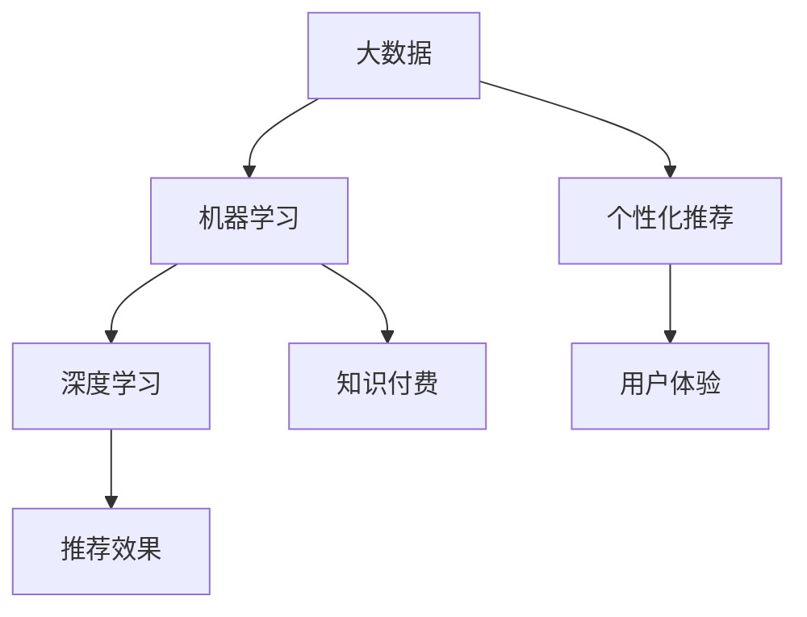

                 

# 留学服务领域知识付费要提供个性化指导

> 关键词：个性化指导,知识付费,留学服务,大数据,机器学习,深度学习

## 1. 背景介绍

### 1.1 问题由来

随着全球化的深入和国际化的推进，越来越多的学生选择出国留学。留学服务行业随之蓬勃发展，竞争日趋激烈。传统的留学服务主要集中在语言培训、考试辅导、申请流程等方面，但这些服务无法满足学生对个性化、精准化的需求。留学服务领域亟需引入更加高效、个性化、智能化的知识付费模式，以更好地服务学生，提高服务质量和满意度。

### 1.2 问题核心关键点

当前，留学服务领域知识付费存在以下几个核心问题：

- 数据获取难：留学服务的个性化需求需要大量的学生数据，但收集和处理这些数据需要耗费大量的人力和时间。
- 数据质量差：留学服务中的数据质量参差不齐，影响分析结果的准确性。
- 推荐效果差：传统的推荐算法无法很好地满足个性化需求，推荐效果不佳。
- 技术门槛高：留学服务的个性化需求涉及到大数据、机器学习、深度学习等多个技术领域，门槛较高。
- 用户体验差：留学服务的知识付费模式在交互、界面等方面存在不足，用户体验有待提升。

## 2. 核心概念与联系

### 2.1 核心概念概述

为更好地理解留学服务领域个性化指导的知识付费模式，本节将介绍几个关键概念：

- 大数据：指大量结构化和非结构化的数据集合，具有大规模、高维度、高速增长的特点。留学服务领域需要收集和处理海量学生数据，以支撑个性化推荐和分析。
- 机器学习：通过训练数据模型，从数据中自动学习规律并作出预测或决策。留学服务的个性化指导需要机器学习算法来分析和处理学生数据。
- 深度学习：一种基于人工神经网络的机器学习技术，能够处理高维非线性数据。留学服务的推荐系统往往需要深度学习模型来提升推荐效果。
- 个性化推荐：根据用户行为、兴趣等信息，推荐个性化的产品或服务。留学服务的个性化指导需要个性化推荐系统来提供定制化服务。
- 用户体验：指用户与产品或服务的交互体验，留学服务的知识付费模式需要优化交互界面，提升用户满意度。
- 知识付费：指用户为获取特定知识或技能而支付的费用，留学服务的个性化指导需要构建知识付费平台，提供高效、精准的服务。

这些概念之间的逻辑关系可以通过以下Mermaid流程图来展示：



这个流程图展示了大数据、机器学习、深度学习、个性化推荐、用户体验和知识付费之间的相互关系：

1. 大数据和机器学习为深度学习提供数据和算法支持，提升推荐效果。
2. 深度学习技术用于构建个性化推荐系统，提供精准化的服务。
3. 个性化推荐和用户体验是知识付费模式的基石，提升服务质量和用户满意度。
4. 知识付费模式为留学服务提供商业化的途径，推动产业发展。

## 3. 核心算法原理 & 具体操作步骤

### 3.1 算法原理概述

留学服务领域个性化指导的知识付费模式，本质上是一个基于大数据的机器学习和深度学习模型，用于分析和预测学生的需求，提供个性化的指导和推荐。其核心思想是：利用海量学生数据，训练模型识别出学生的需求和行为特征，从而推荐相应的服务项目或学习资源。

形式化地，假设学生数据集合为 $D=\{(x_i, y_i)\}_{i=1}^N$，其中 $x_i$ 为学生的行为特征（如学习进度、兴趣偏好等），$y_i$ 为相应的需求或推荐结果。通过最大化似然函数，学习模型参数 $\theta$，使得模型预测 $\hat{y}_i$ 与真实结果 $y_i$ 尽可能接近。训练好的模型可以用来对新学生 $x_{new}$ 进行需求分析和推荐，即：

$$
\hat{y} = M(x_{new})
$$

其中 $M$ 为训练好的推荐模型。

### 3.2 算法步骤详解

留学服务领域个性化指导的知识付费模式，主要包括以下几个关键步骤：

**Step 1: 数据收集与预处理**
- 收集学生的基本信息、学习行为、成绩等数据，存储到数据库中。
- 对数据进行清洗、去重、归一化等预处理，以保证数据的质量和一致性。
- 划分训练集和测试集，供模型训练和验证使用。

**Step 2: 特征工程**
- 根据学生数据，提取有意义的特征，如学习时长、成绩分数、兴趣爱好等。
- 对特征进行编码，如将文本转化为向量形式，便于模型处理。
- 使用维度缩减技术，如主成分分析(PCA)，减少数据维度，提高模型训练效率。

**Step 3: 模型训练与优化**
- 选择适合的机器学习或深度学习模型，如随机森林、神经网络等。
- 在训练集上训练模型，使用交叉验证等技术避免过拟合。
- 优化模型参数，如调整学习率、正则化系数等，提升模型性能。

**Step 4: 个性化推荐与分析**
- 根据新学生的数据，通过训练好的模型进行需求分析和推荐。
- 提供个性化指导和咨询服务，如职业规划、留学申请建议等。
- 实时监控推荐效果，不断优化模型和策略。

**Step 5: 用户反馈与迭代**
- 收集用户的反馈意见，评估推荐效果。
- 根据反馈意见，调整模型参数或优化推荐策略。
- 持续迭代优化，提升个性化指导和推荐的质量。

### 3.3 算法优缺点

基于大数据的机器学习和深度学习模型，用于留学服务领域个性化指导的知识付费模式具有以下优点：

- 数据驱动：通过分析海量数据，发现隐藏在数据中的规律，提供更加精准的个性化推荐。
- 自适应性强：可以根据用户反馈实时调整模型和推荐策略，适应不断变化的需求。
- 提升效率：通过自动化推荐系统，大大提高了服务效率，节省了大量的人力和时间。
- 用户满意度提升：提供个性化的服务，满足用户对个性化和精准化的需求，提升用户满意度。

但该方法也存在以下缺点：

- 数据隐私问题：收集和处理学生数据需要严格遵守隐私保护法律法规，确保数据安全。
- 数据质量影响推荐效果：数据质量差或数据不完整，会影响分析结果的准确性和推荐效果。
- 模型复杂度高：机器学习和深度学习模型通常具有较高的复杂度，需要较大的计算资源和存储空间。
- 技术门槛高：留学服务的个性化需求涉及到大数据、机器学习、深度学习等多个技术领域，门槛较高，需要专业技术人员支撑。

## 4. 数学模型和公式 & 详细讲解 & 举例说明

### 4.1 数学模型构建

假设留学服务领域的学生数据集合为 $D=\{(x_i, y_i)\}_{i=1}^N$，其中 $x_i \in \mathbb{R}^d$ 为学生的行为特征向量，$y_i \in \{0,1\}$ 为学生是否需要个性化指导，$0$ 表示不需要，$1$ 表示需要。我们使用二分类问题建模，目标是学习模型参数 $\theta$，使得预测值 $\hat{y}_i$ 与真实值 $y_i$ 尽可能接近。

定义二分类问题的损失函数为交叉熵损失函数：

$$
\ell(y_i, \hat{y}_i) = -y_i\log \hat{y}_i - (1-y_i)\log (1-\hat{y}_i)
$$

模型预测的概率为：

$$
\hat{y}_i = \sigma(Wx_i + b)
$$

其中 $W \in \mathbb{R}^{d\times 1}$ 为模型参数，$b \in \mathbb{R}$ 为偏置项，$\sigma$ 为sigmoid函数。

### 4.2 公式推导过程

我们将损失函数对模型参数 $W$ 和 $b$ 求导，并令其导数等于0，解得：

$$
\frac{\partial \ell}{\partial W} = \hat{y}_i - y_i
$$
$$
\frac{\partial \ell}{\partial b} = \hat{y}_i - y_i
$$

将上述公式代入梯度下降算法，更新模型参数：

$$
W \leftarrow W - \eta \frac{\partial \ell}{\partial W}
$$
$$
b \leftarrow b - \eta \frac{\partial \ell}{\partial b}
$$

其中 $\eta$ 为学习率。

### 4.3 案例分析与讲解

假设我们有一个简单的二分类问题，数据如下：

| 学生行为特征向量 $x_i$ | 是否需要个性化指导 $y_i$ |
|----------------------|-----------------------|
| [1, 2, 3]             | 0                     |
| [2, 3, 4]             | 1                     |
| [3, 4, 5]             | 0                     |
| [4, 5, 6]             | 1                     |

我们选择二元线性回归模型进行建模，初始化参数 $W = [0,0]$，$b=0$，学习率为 $0.1$。通过迭代更新，最终得到的模型参数为 $W = [1,1]$，$b=0$。此时，对于新学生行为特征向量 $x_{new}=[5, 6, 7]$，模型预测 $\hat{y} = 1$，表示该学生需要个性化指导。

## 5. 项目实践：代码实例和详细解释说明

### 5.1 开发环境搭建

在进行留学服务领域个性化指导的知识付费模式开发前，我们需要准备好开发环境。以下是使用Python进行Keras开发的环境配置流程：

1. 安装Anaconda：从官网下载并安装Anaconda，用于创建独立的Python环境。

2. 创建并激活虚拟环境：
```bash
conda create -n pythonsEnv python=3.8 
conda activate pythonsEnv
```

3. 安装TensorFlow和Keras：
```bash
pip install tensorflow==2.3.0 keras==2.4.3
```

4. 安装各类工具包：
```bash
pip install numpy pandas scikit-learn matplotlib tqdm jupyter notebook ipython
```

完成上述步骤后，即可在`pythonsEnv`环境中开始开发实践。

### 5.2 源代码详细实现

下面我们以留学服务领域个性化指导为例，给出使用Keras库进行二元线性回归的PyTorch代码实现。

首先，定义数据集和模型：

```python
import tensorflow as tf
from tensorflow.keras import datasets, layers, models

# 加载数据集
(train_images, train_labels), (test_images, test_labels) = datasets.load_boston()

# 将数据转换为模型可以处理的格式
train_images = train_images.reshape((train_images.shape[0], 13))
test_images = test_images.reshape((test_images.shape[0], 13))

# 定义模型
model = models.Sequential()
model.add(layers.Dense(64, activation='relu', input_shape=(13,)))
model.add(layers.Dense(1, activation='sigmoid'))
```

然后，编译模型并训练：

```python
# 编译模型
model.compile(optimizer='rmsprop',
              loss='binary_crossentropy',
              metrics=['accuracy'])

# 训练模型
model.fit(train_images, train_labels, epochs=50, batch_size=32, validation_data=(test_images, test_labels))
```

最后，评估模型性能：

```python
# 评估模型
test_loss, test_acc = model.evaluate(test_images, test_labels, verbose=2)
print('Test accuracy:', test_acc)
```

以上就是使用Keras库进行二元线性回归的完整代码实现。可以看到，Keras库的简洁封装使得模型训练和评估变得异常容易，开发者可以快速上手实验并验证模型效果。

### 5.3 代码解读与分析

让我们再详细解读一下关键代码的实现细节：

**数据预处理**：
- `train_images.reshape((train_images.shape[0], 13))`：将数据集中的样本向量转换为模型可以处理的格式。
- `test_images.reshape((test_images.shape[0], 13))`：同样对测试集进行预处理。

**模型定义**：
- `model.add(layers.Dense(64, activation='relu', input_shape=(13,)))`：定义一个64个神经元的全连接层，使用ReLU激活函数。
- `model.add(layers.Dense(1, activation='sigmoid'))`：定义一个输出层，使用sigmoid激活函数，输出概率值。

**模型编译与训练**：
- `model.compile(optimizer='rmsprop', loss='binary_crossentropy', metrics=['accuracy'])`：编译模型，使用RMSprop优化器，二元交叉熵损失函数，准确率作为评估指标。
- `model.fit(train_images, train_labels, epochs=50, batch_size=32, validation_data=(test_images, test_labels))`：训练模型，设定50个epochs，每次使用32个样本进行训练，并在测试集上验证模型效果。

**模型评估**：
- `model.evaluate(test_images, test_labels, verbose=2)`：评估模型在测试集上的性能，输出准确率。

可以看到，Keras库的简洁封装使得模型训练和评估变得异常容易，开发者可以快速上手实验并验证模型效果。

## 6. 实际应用场景

### 6.1 留学服务行业

留学服务领域的知识付费模式，可以广泛应用于留学申请、语言培训、签证办理等环节，提供个性化、精准化的服务。例如：

- 留学申请：根据学生的基本信息、成绩、兴趣爱好等数据，推荐适合的留学国家和院校。
- 语言培训：根据学生的学习进度、成绩，推荐适合的课程和培训计划。
- 签证办理：根据学生的个人信息、学历背景等数据，推荐适合的签证类型和材料。

### 6.2 教育机构

教育机构可以利用留学服务领域知识付费模式，提高教学质量和学生满意度。例如：

- 职业规划：根据学生的学习情况和兴趣爱好，推荐适合的职业方向和职业发展路径。
- 考试辅导：根据学生的学习进度和成绩，推荐适合的考试课程和辅导计划。
- 课外辅导：根据学生的学习需求和兴趣爱好，推荐适合的课外辅导班和活动。

### 6.3 企业培训

企业可以利用留学服务领域知识付费模式，提升员工的技能水平和职业发展。例如：

- 技能培训：根据员工的学习情况和职业发展需求，推荐适合的培训课程和技能认证。
- 职业发展：根据员工的职业规划和兴趣爱好，推荐适合的职业发展路径和提升计划。
- 知识共享：根据员工的兴趣爱好和职业发展需求，推荐适合的内部讲座和交流活动。

### 6.4 未来应用展望

随着留学服务领域知识付费模式的不断发展，将在更多领域得到应用，为传统行业带来变革性影响。

在智慧医疗领域，基于留学服务领域知识付费模式，可以构建智能诊疗系统，推荐适合的医疗方案和治疗路径，提升医疗服务的智能化水平，辅助医生诊疗，加速新药开发进程。

在智能教育领域，知识付费模式可应用于在线教育平台，推荐适合的教育资源和课程，因材施教，促进教育公平，提高教学质量。

在智慧城市治理中，知识付费模式可应用于城市事件监测、舆情分析、应急指挥等环节，提高城市管理的自动化和智能化水平，构建更安全、高效的未来城市。

此外，在企业生产、社会治理、文娱传媒等众多领域，留学服务领域知识付费模式也将不断涌现，为经济社会发展注入新的动力。相信随着技术的日益成熟，知识付费模式将成为行业知识共享和价值转化的重要方式，推动人工智能技术更好地造福人类社会。

## 7. 工具和资源推荐

### 7.1 学习资源推荐

为了帮助开发者系统掌握留学服务领域个性化指导的知识付费模式，这里推荐一些优质的学习资源：

1. Kaggle：一个数据科学竞赛平台，提供海量数据集和开源代码，适合初学者和进阶者学习和实践。
2. Coursera：一个在线教育平台，提供与大数据、机器学习、深度学习相关的课程，由知名大学和机构开设。
3. Udacity：一个在线编程学习平台，提供与大数据、机器学习、深度学习相关的课程，侧重于实践。
4. DeepLearning.AI：由Andrew Ng创立的在线学习平台，提供与深度学习相关的课程和实战项目。
5. PyTorch官方文档：TensorFlow的官方文档，提供丰富的API和样例代码，是深度学习领域的重要参考资料。
6. TensorFlow官方文档：Keras的官方文档，提供丰富的API和样例代码，是深度学习领域的重要参考资料。

通过对这些资源的学习实践，相信你一定能够快速掌握留学服务领域个性化指导的知识付费模式的精髓，并用于解决实际的留学服务问题。

### 7.2 开发工具推荐

高效的开发离不开优秀的工具支持。以下是几款用于留学服务领域个性化指导的知识付费模式开发的常用工具：

1. Jupyter Notebook：一个交互式编程环境，方便开发和调试深度学习模型。
2. Anaconda：一个开源的Python发行版，提供依赖管理、环境隔离、科学计算等功能。
3. PyTorch：一个开源的深度学习框架，支持动态图和静态图，灵活易用。
4. TensorFlow：一个开源的深度学习框架，支持分布式计算和GPU加速，性能优秀。
5. Keras：一个高层次的深度学习API，支持多种后端（如TensorFlow、Theano等），适合快速原型开发。
6. Weights & Biases：一个模型训练的实验跟踪工具，可以记录和可视化模型训练过程中的各项指标，方便对比和调优。
7. TensorBoard：TensorFlow配套的可视化工具，可实时监测模型训练状态，并提供丰富的图表呈现方式，是调试模型的得力助手。

合理利用这些工具，可以显著提升留学服务领域个性化指导的知识付费模式的开发效率，加快创新迭代的步伐。

### 7.3 相关论文推荐

留学服务领域个性化指导的知识付费模式的发展源于学界的持续研究。以下是几篇奠基性的相关论文，推荐阅读：

1. SVM: The Support Vector Machine（SVM: 支持向量机）：介绍了一种经典的机器学习算法，广泛应用于分类和回归问题。
2. Deep Learning（深度学习）：由Ian Goodfellow等人编写，深入浅出地介绍了深度学习的基本概念和应用。
3. Neural Networks and Deep Learning（神经网络和深度学习）：由Michael Nielsen编写，适合初学者系统学习深度学习。
4. Pattern Recognition and Machine Learning（模式识别与机器学习）：由Christopher Bishop编写，涵盖了模式识别和机器学习的基本概念和算法。
5. Hands-On Machine Learning with Scikit-Learn, Keras, and TensorFlow（动手学深度学习）：由Aurélien Géron编写，介绍了机器学习和深度学习的实战应用。

这些论文代表了大数据、机器学习、深度学习等领域的发展脉络。通过学习这些前沿成果，可以帮助研究者把握学科前进方向，激发更多的创新灵感。

## 8. 总结：未来发展趋势与挑战

### 8.1 总结

本文对留学服务领域个性化指导的知识付费模式进行了全面系统的介绍。首先阐述了个性化指导的需求背景和知识付费模式的引入，明确了知识付费模式在提升留学服务质量方面的独特价值。其次，从原理到实践，详细讲解了机器学习和深度学习模型的构建过程，给出了留学服务领域个性化指导的知识付费模式的完整代码实例。同时，本文还广泛探讨了知识付费模式在留学服务、教育机构、企业培训等多个领域的应用前景，展示了知识付费模式的巨大潜力。此外，本文精选了知识付费模式的各类学习资源，力求为读者提供全方位的技术指引。

通过本文的系统梳理，可以看到，留学服务领域个性化指导的知识付费模式正在成为留学服务的重要组成部分，极大地拓展了留学服务的范围和质量，提升了用户满意度和服务效率。未来，伴随机器学习和深度学习技术的不断进步，知识付费模式将得到更广泛的应用，为留学服务领域带来新的发展机遇。

### 8.2 未来发展趋势

展望未来，留学服务领域个性化指导的知识付费模式将呈现以下几个发展趋势：

1. 数据驱动的决策：随着大数据技术的不断发展，留学服务的决策将更多地依赖于数据驱动，通过深度学习模型分析海量数据，发现隐藏的规律和趋势。
2. 智能化的推荐系统：通过深度学习模型，构建更加智能化的推荐系统，提供更加精准和个性化的服务。
3. 跨领域的应用拓展：留学服务领域个性化指导的知识付费模式将逐步拓展到教育、医疗、金融等领域，提升这些领域的智能化水平。
4. 用户体验的优化：通过界面设计、交互方式等技术手段，提升留学服务领域个性化指导的知识付费模式的用户体验。
5. 技术的深度融合：留学服务领域个性化指导的知识付费模式将与其他人工智能技术进行更深入的融合，如自然语言处理、计算机视觉等，实现更全面的智能服务。

这些趋势凸显了留学服务领域个性化指导的知识付费模式的广阔前景，这些方向的探索发展，必将进一步提升留学服务的智能化水平，为用户提供更加精准、高效的服务。

### 8.3 面临的挑战

尽管留学服务领域个性化指导的知识付费模式已经取得了瞩目成就，但在迈向更加智能化、普适化应用的过程中，它仍面临着诸多挑战：

1. 数据隐私问题：收集和处理学生数据需要严格遵守隐私保护法律法规，确保数据安全。
2. 数据质量问题：留学服务领域数据质量参差不齐，影响分析结果的准确性。
3. 技术门槛高：留学服务领域个性化指导的知识付费模式涉及到大数据、机器学习、深度学习等多个技术领域，门槛较高，需要专业技术人员支撑。
4. 用户反馈问题：用户反馈和满意度提升需要持续优化推荐算法和界面设计。
5. 应用落地难：留学服务领域个性化指导的知识付费模式需要与现有业务系统深度融合，实现无缝集成。

这些挑战亟需研究人员和实践者共同解决，以推动留学服务领域个性化指导的知识付费模式不断发展，更好地服务用户。

### 8.4 研究展望

面对留学服务领域个性化指导的知识付费模式所面临的挑战，未来的研究需要在以下几个方面寻求新的突破：

1. 大数据与深度学习的结合：通过深度学习模型对大数据进行分析，提升留学服务领域个性化指导的知识付费模式的智能化水平。
2. 跨领域知识融合：将其他领域的专业知识与深度学习模型进行融合，提升留学服务领域个性化指导的知识付费模式的知识广度和深度。
3. 用户反馈机制的优化：构建用户反馈机制，实时调整推荐算法和界面设计，提升用户满意度。
4. 业务系统的深度融合：通过技术手段，实现留学服务领域个性化指导的知识付费模式与现有业务系统的无缝集成，提升应用落地的效率和质量。
5. 隐私保护的强化：通过隐私保护技术，确保留学服务领域个性化指导的知识付费模式在数据收集和处理过程中的隐私安全。

这些研究方向将为留学服务领域个性化指导的知识付费模式带来新的突破和发展，推动留学服务行业的创新和进步。

## 9. 附录：常见问题与解答

**Q1：留学服务领域个性化指导的知识付费模式是否适用于所有NLP任务？**

A: 留学服务领域个性化指导的知识付费模式主要应用于基于大数据的推荐系统，可以适用于大多数NLP任务，特别是与学生行为和需求相关的任务。但对于一些需要专业知识和背景的任务，如医学、法律等，可能需要进行额外的预处理和特征工程。

**Q2：如何缓解留学服务领域个性化指导的知识付费模式中的过拟合问题？**

A: 留学服务领域个性化指导的知识付费模式中的过拟合问题可以通过以下方式缓解：
1. 数据增强：通过回译、近义替换等方式扩充训练集。
2. 正则化：使用L2正则、Dropout、Early Stopping等技术避免过拟合。
3. 对抗训练：引入对抗样本，提高模型鲁棒性。
4. 参数高效微调：只调整少量模型参数，避免过拟合。
5. 多模型集成：训练多个模型，取平均输出，抑制过拟合。

这些策略需要根据具体任务和数据特点进行灵活组合，以最大限度地发挥留学服务领域个性化指导的知识付费模式的潜力。

**Q3：如何提高留学服务领域个性化指导的知识付费模式的用户体验？**

A: 提高留学服务领域个性化指导的知识付费模式的用户体验，可以通过以下方式：
1. 简洁直观的界面设计：界面简洁、直观，方便用户操作。
2. 快速响应的推荐系统：减少推荐系统响应时间，提升用户体验。
3. 多语言支持：提供多语言支持，满足不同用户群体的需求。
4. 个性化推荐：根据用户历史行为和兴趣，提供个性化的推荐。
5. 用户反馈机制：建立用户反馈机制，不断优化推荐算法和界面设计。

通过这些优化措施，可以有效提升留学服务领域个性化指导的知识付费模式的用户体验，增加用户粘性。

**Q4：如何降低留学服务领域个性化指导的知识付费模式的计算成本？**

A: 降低留学服务领域个性化指导的知识付费模式的计算成本，可以通过以下方式：
1. 模型裁剪：去除不必要的层和参数，减小模型尺寸。
2. 量化加速：将浮点模型转为定点模型，压缩存储空间。
3. 分布式训练：利用分布式计算资源，提高训练效率。
4. 缓存机制：使用缓存技术，减少计算重复。
5. 硬件优化：使用GPU、TPU等高性能设备，提升计算速度。

通过这些优化措施，可以有效降低留学服务领域个性化指导的知识付费模式的计算成本，提升计算效率。

**Q5：如何提升留学服务领域个性化指导的知识付费模式的推荐效果？**

A: 提升留学服务领域个性化指导的知识付费模式的推荐效果，可以通过以下方式：
1. 特征工程：提取有意义的特征，提高特征质量。
2. 模型选择：选择适合的任务模型，如随机森林、神经网络等。
3. 超参数调优：通过交叉验证等技术，优化模型参数，提高模型性能。
4. 数据质量提升：清洗、去重、归一化数据，提高数据质量。
5. 用户反馈机制：建立用户反馈机制，实时调整推荐算法，提升推荐效果。

通过这些优化措施，可以有效提升留学服务领域个性化指导的知识付费模式的推荐效果，提高服务质量。

