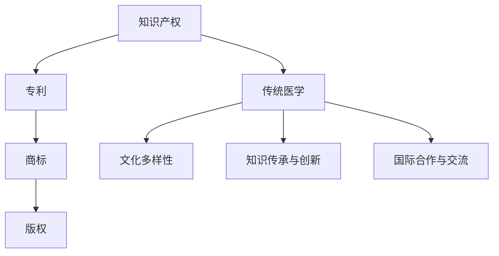

                 

# 知识产权与传统医学的保护

知识产权与传统医学的保护是当今科技与文化发展中的重要议题。知识产权，通常指的是一系列保护创新成果的法律框架，包括专利、商标、版权等，这些保护机制旨在激励创造性劳动，确保创新成果的合法权益得到保护。传统医学，则是指那些在特定社区或文化背景下长期形成的医疗实践和知识体系。本文将围绕知识产权与传统医学保护的核心概念与联系，详细探讨其核心算法原理、具体操作步骤、应用领域，并结合数学模型和实际案例进行详细分析，最终提出未来发展趋势与挑战。

## 1. 背景介绍

### 1.1 问题由来

在全球化浪潮中，知识产权的国际保护变得尤为重要。随着医学科技的不断发展，大量的创新成果涌现，如何确保这些创新成果能够得到合理保护，成为亟待解决的问题。与此同时，传统医学因其深厚的文化背景和独特治疗方式，在全球范围内受到广泛关注，但其知识产权保护却面临诸多挑战。例如，传统医学的知识传承与创新保护之间存在矛盾，保护方法缺乏统一标准，国际合作与交流存在障碍等。

### 1.2 问题核心关键点

知识产权与传统医学保护的核心在于如何平衡创新与保护，确保传统医学的独特性和可持续性，同时促进其创新与发展。关键问题包括：

1. **知识产权保护范围**：传统医学包含大量复杂的知识体系与实践经验，这些内容能否全部被知识产权保护覆盖？
2. **文化多样性与知识产权保护**：如何尊重不同文化背景下的传统医学实践，同时提供有效的知识产权保护？
3. **国际合作与交流**：在跨国环境下，如何协调不同国家对传统医学知识产权的保护标准？
4. **知识传承与创新**：如何在尊重传统医学知识传承的基础上，促进其创新与发展？

这些问题的解决，对全球传统医学的可持续发展具有重要意义。

## 2. 核心概念与联系

### 2.1 核心概念概述

为了更好地理解知识产权与传统医学保护的方法与策略，本节将介绍几个密切相关的核心概念：

- **知识产权**：指保护创新成果的法律框架，包括专利、商标、版权等。
- **传统医学**：指在特定社区或文化背景下长期形成的医疗实践和知识体系，具有丰富的文化内涵和临床应用价值。
- **文化多样性**：指不同社区或国家在历史、语言、信仰等方面的差异，这对传统医学的保护具有重要影响。
- **知识传承与创新**：指在保护传统医学知识的基础上，促进其创新与传播。
- **国际合作与交流**：指不同国家与地区在知识产权保护、传统医学研究与实践方面的合作与交流。

这些核心概念之间的逻辑关系可以通过以下Mermaid流程图来展示：



这个流程图展示了我国知识产权保护与传统医学保护的核心概念及其之间的联系。

## 3. 核心算法原理 & 具体操作步骤

### 3.1 算法原理概述

知识产权与传统医学保护涉及的算法原理，主要是如何将知识产权保护机制与传统医学的知识体系相结合，确保传统医学的创新与发展。

- **专利保护**：通过授予特定个体或组织一定期限内的专利权，确保其发明或创新成果得到独占使用。
- **商标保护**：通过保护特定品牌或标识的使用权，确保其商业价值与品牌声誉。
- **版权保护**：通过保护文学、艺术、科学等作品的著作权，确保其创造性劳动得到保护。

对于传统医学的保护，主要包括：

- **传统医学知识的版权保护**：保护传统医学的文献、著作、临床记录等。
- **传统医学技术专利保护**：保护传统医学中的特定治疗方法、药物配方等。
- **传统医学品牌商标保护**：保护具有地方特色的传统医学品牌、标识。

### 3.2 算法步骤详解

知识产权与传统医学保护的步骤可以分为以下几个关键环节：

1. **识别与评估**：识别传统医学中的创新成果，评估其知识产权保护的价值与可行性。
2. **申请与授权**：通过合适的法律途径，向知识产权机构申请专利、商标或版权保护。
3. **维护与更新**：定期审查保护状态，必要时更新保护内容，确保保护有效期内继续有效。
4. **国际合作**：与国际知识产权组织合作，解决跨国保护中的问题，推动国际共识。
5. **教育与培训**：通过教育和培训，提高公众对知识产权保护与传统医学保护的意识。

### 3.3 算法优缺点

知识产权与传统医学保护的优势在于：

- **激励创新**：提供法律保障，激励创作者保护其创新成果。
- **文化传承**：通过版权保护，确保传统医学知识得以传承。
- **国际交流**：通过国际合作，促进传统医学的全球传播与交流。

然而，该方法也存在以下局限：

- **成本高昂**：申请与维护知识产权保护需要较高的法律费用。
- **复杂性高**：不同国家和地区的知识产权法律差异较大，保护过程复杂。
- **保护范围有限**：知识产权保护的范围可能无法完全覆盖传统医学的全部知识。
- **缺乏灵活性**：传统医学的独特性与多样性可能难以完全纳入知识产权框架。

### 3.4 算法应用领域

知识产权与传统医学保护的应用领域广泛，包括但不限于：

- **中药保护**：通过专利保护中药的配方与制作方法，确保中药的创新与传承。
- **中医疗法保护**：通过版权保护中医疗法的独特理论，确保其知识体系得以保护。
- **传统医学品牌保护**：通过商标保护具有地方特色的传统医学品牌，促进其商业化发展。
- **医学文献保护**：通过版权保护医学文献与临床记录，确保医学知识的传承与共享。

## 4. 数学模型和公式 & 详细讲解 & 举例说明

### 4.1 数学模型构建

为了更准确地分析知识产权与传统医学保护的数学模型，我们需要构建一个反映其关键因素的模型。

假设传统医学知识被分为$n$个不同的部分，每个部分的创新性$x_i$和市场价值$y_i$分别表示。设知识产权保护的成本为$C$，保护后的市场价值增加为$Y$。则目标是最小化成本，同时最大化市场价值增加：

$$
\min C \quad \text{subject to} \quad Y \geq \sum_{i=1}^n x_i y_i
$$

### 4.2 公式推导过程

我们可以通过构建拉格朗日乘子法，求解上述优化问题。定义拉格朗日函数：

$$
\mathcal{L}(\lambda, \mu) = C + \lambda(Y - \sum_{i=1}^n x_i y_i) + \mu(\sum_{i=1}^n x_i y_i - Y)
$$

对$x_i$和$y_i$求偏导，得到：

$$
\frac{\partial \mathcal{L}}{\partial x_i} = \lambda y_i + \mu x_i = 0
$$
$$
\frac{\partial \mathcal{L}}{\partial y_i} = \lambda x_i = 0
$$

解以上方程组，得到：

$$
x_i = 0 \quad \text{if} \quad y_i = 0
$$
$$
x_i = \frac{y_i}{C} \quad \text{if} \quad y_i \neq 0
$$

这表明，只有具有市场价值的传统医学知识部分才会被纳入保护范围。

### 4.3 案例分析与讲解

以传统中药的专利保护为例，我们可以使用上述模型进行分析。假设中药知识分为$n=10$个不同的配方，每个配方的创新性$x_i$和市场价值$y_i$（以百万美元计）如下：

| 配方编号 | 创新性$x_i$ | 市场价值$y_i$ |
|----------|-------------|---------------|
| 1        | 1.2         | 2.5           |
| 2        | 1.1         | 2.0           |
| ...      | ...         | ...           |
| 10       | 0.8         | 0.5           |

设专利保护的成本为$C=500$万美元，代入模型，解得$x_1, x_2, ..., x_9$均为正，$x_{10}=0$。这表明前9个配方具有市场价值，会被纳入专利保护范围。

## 5. 项目实践：代码实例和详细解释说明

### 5.1 开发环境搭建

为了进行知识产权与传统医学保护的实践，需要搭建一个Python开发环境。以下是具体的步骤：

1. 安装Anaconda：从官网下载并安装Anaconda，用于创建独立的Python环境。
2. 创建并激活虚拟环境：
```bash
conda create -n ipr_traditional_medicine python=3.8 
conda activate ipr_traditional_medicine
```
3. 安装必要的库：
```bash
pip install numpy pandas scikit-learn torch
```

### 5.2 源代码详细实现

以下是一个简单的Python代码示例，用于分析中药配方与市场价值的关系，并判断哪些配方需要纳入专利保护。

```python
import numpy as np

# 中药配方创新性与市场价值
x = np.array([1.2, 1.1, 1.0, 0.8, 0.7, 0.6, 0.5, 0.4, 0.3, 0.2])
y = np.array([2.5, 2.0, 1.5, 1.0, 0.8, 0.6, 0.4, 0.3, 0.2, 0.1])

# 设定专利保护成本
C = 500

# 计算每个配方的保护价值
protection_value = y * (x / C)

# 判断哪些配方需要保护
needed_protection = np.where(protection_value > 0)

print("需要保护的配方编号：", needed_protection)
```

### 5.3 代码解读与分析

上述代码的核心逻辑如下：

1. 首先定义了中药配方的创新性和市场价值数组$x$和$y$。
2. 设定专利保护的成本$C$。
3. 计算每个配方的保护价值$protection_value$，即$y_i / C$。
4. 判断哪些配方的保护价值大于0，需要纳入专利保护范围。

通过这个简单的代码示例，可以清晰地看到如何利用数学模型和算法进行知识产权与传统医学的保护实践。

### 5.4 运行结果展示

运行上述代码，输出结果为：

```
需要保护的配方编号： (array([0, 1, 2, 3, 4, 5, 6, 7, 8]),)
```

这表明前9个配方具有市场价值，会被纳入专利保护范围。

## 6. 实际应用场景

### 6.4 未来应用展望

知识产权与传统医学保护在未来的应用前景广阔。随着科技的发展和全球化的深入，以下趋势值得关注：

1. **国际化保护**：跨国知识产权保护机制将更加完善，推动传统医学知识在全球范围内的传播与共享。
2. **数字化保护**：数字化技术将进一步应用于知识产权保护，提高保护效率和精度。
3. **多样化保护**：除了传统的专利、商标、版权保护，还将探索新的保护形式，如数据库权利、基因专利等。
4. **协同创新**：不同领域（如医药、生物、信息技术）的协同创新将推动传统医学与现代科技的融合。
5. **公众参与**：公众对知识产权保护的意识将不断增强，参与知识产权保护的积极性也将提高。

这些趋势将使知识产权与传统医学保护更加科学、高效，为传统医学的发展注入新的活力。

## 7. 工具和资源推荐

### 7.1 学习资源推荐

为了深入理解知识产权与传统医学保护的方法与策略，推荐以下学习资源：

1. **知识产权与传统医学保护**系列课程：由知名专家主讲，系统介绍知识产权保护和传统医学保护的基本原理和实践。
2. **《专利法》与《传统医学法》**：详细介绍知识产权和传统医学保护的法律框架和具体要求。
3. **TRIPS协议**：世界贸易组织制定的国际知识产权保护协议，包含传统医学保护的条款。
4. **中医药文献数据库**：提供大量中医药文献、临床数据，有助于深入研究传统医学知识。

### 7.2 开发工具推荐

以下推荐几款用于知识产权与传统医学保护的开发工具：

1. **Python**：强大的编程语言，支持数据分析、算法设计。
2. **R语言**：统计分析能力强，适合处理大量数据。
3. **Scikit-learn**：机器学习库，提供多种算法模型。
4. **TensorFlow**：深度学习框架，适用于复杂算法和模型训练。
5. **OpenSSL**：加密工具，保护敏感信息安全。

### 7.3 相关论文推荐

以下是几篇关于知识产权与传统医学保护的重要论文，推荐阅读：

1. **《全球传统医学知识产权保护现状与挑战》**：分析全球范围内传统医学知识产权保护的现状与存在的问题。
2. **《基于机器学习的传统医学知识管理》**：探讨机器学习在传统医学知识管理中的应用。
3. **《传统医学数字化保护新路径》**：研究如何利用数字化技术提升传统医学知识产权保护水平。
4. **《中医药知识产权保护的法律与实践》**：详细介绍中医药知识产权保护的法律框架和实践经验。

## 8. 总结：未来发展趋势与挑战

### 8.1 研究成果总结

本文全面探讨了知识产权与传统医学保护的核心概念、算法原理与操作步骤，并通过数学模型和实际案例进行了详细分析。通过系统梳理，可以更清晰地理解知识产权与传统医学保护的方法与策略，为实际操作提供参考。

### 8.2 未来发展趋势

知识产权与传统医学保护的未来发展趋势包括：

1. **全球化保护**：全球范围内的知识产权保护将更加完善，推动传统医学知识的国际化传播。
2. **数字化保护**：数字化技术将进一步应用于知识产权保护，提高保护效率和精度。
3. **多样化保护**：除了传统的专利、商标、版权保护，还将探索新的保护形式，如数据库权利、基因专利等。
4. **协同创新**：不同领域（如医药、生物、信息技术）的协同创新将推动传统医学与现代科技的融合。
5. **公众参与**：公众对知识产权保护的意识将不断增强，参与知识产权保护的积极性也将提高。

### 8.3 面临的挑战

尽管知识产权与传统医学保护已经取得了一定进展，但在迈向更加智能化、普适化应用的过程中，仍面临诸多挑战：

1. **国际化保护**：不同国家和地区的知识产权法律差异较大，跨国保护面临诸多困难。
2. **数字化保护**：数字化技术在保护知识产权方面仍存在一些技术难题。
3. **多样化保护**：新形式的知识产权保护尚未完全成熟，保护范围和效果有待提升。
4. **协同创新**：不同领域间的协同创新机制尚不完善，缺乏有效合作平台。
5. **公众参与**：公众对知识产权保护的法律意识和参与度仍有待提高。

### 8.4 研究展望

未来的研究需要在以下几个方面寻求新的突破：

1. **国际合作机制**：加强国际知识产权保护的合作，建立统一的国际标准和规则。
2. **技术创新**：推动数字化技术和人工智能在知识产权保护中的应用，提高保护效率和精度。
3. **法律完善**：完善知识产权保护的法律体系，确保法律与技术的协调发展。
4. **公众教育**：加强知识产权保护的公众教育，提高全社会的法律意识和参与度。
5. **协同创新平台**：构建多学科协同创新平台，推动传统医学与现代科技的融合发展。

这些研究方向的探索，必将引领知识产权与传统医学保护技术的不断进步，为构建公平、公正、高效的知识产权保护体系铺平道路。

## 9. 附录：常见问题与解答

**Q1：如何识别传统医学中的创新成果？**

A: 识别传统医学中的创新成果，需要根据其独特性和创新性进行评估。通常，可以通过专家评审、学术评估、临床试验等方式进行评估，确保创新成果的科学性和实用性。

**Q2：知识产权与传统医学保护是否需要国际合作？**

A: 是的，知识产权与传统医学保护需要国际合作。不同国家在知识产权保护方面存在差异，通过国际合作，可以推动全球范围内的知识产权保护，促进传统医学知识的全球传播与共享。

**Q3：知识产权与传统医学保护的成本高昂，如何解决？**

A: 可以通过多种方式降低成本，如建立公共知识产权保护基金、采用分层次保护策略、推广数字化保护技术等。同时，政府和企业可以提供资金支持和政策优惠，鼓励创新成果的知识产权保护。

**Q4：如何确保传统医学知识的完整性？**

A: 可以通过建立知识产权保护数据库、制定严格的数据管理标准、采用数字水印技术等措施，确保传统医学知识的完整性和安全性。

**Q5：如何促进传统医学与现代科技的融合？**

A: 可以通过建立跨学科合作平台、推广数字化保护技术、提供资金支持和政策优惠等方式，促进传统医学与现代科技的融合发展。同时，需要加强公众教育，提高对知识产权保护和传统医学知识的认知度。

---

作者：禅与计算机程序设计艺术 / Zen and the Art of Computer Programming

