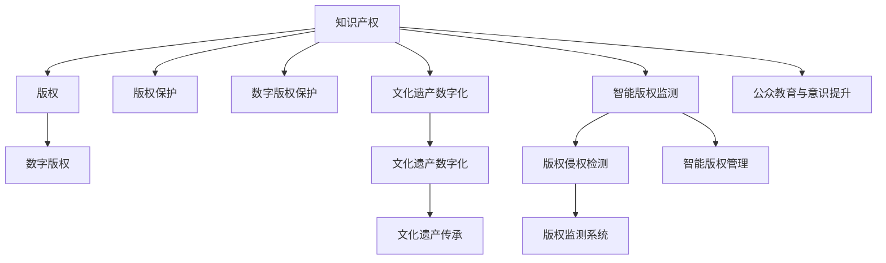

                 

# 知识产权与传统文化保护

> 关键词：知识产权,传统文化,数字版权,版权保护,文化遗产,人工智能,机器学习,自然语言处理(NLP),深度学习

## 1. 背景介绍

### 1.1 问题由来

在全球化进程加速和数字化浪潮的推动下，传统文化正面临着前所未有的冲击和挑战。一方面，互联网与新兴技术的普及使得文化传播和交流更为便捷，但也使得版权保护和知识产权维护问题变得愈发复杂。另一方面，由于历史、地理、法律等多重因素的影响，许多传统文化遗产的保护与传承存在不同程度的困难。

### 1.2 问题核心关键点

传统文化保护的核心在于通过知识产权保护和现代技术手段，确保传统文化的保存、传承和合理利用。主要包含以下关键点：

1. **版权管理**：确保传统文化作品的原创性和归属权得到尊重，通过法律和规则保障版权持有人的利益。
2. **数字版权保护**：采用技术手段防止网络盗版和非法使用，保护数字内容的原创性和完整性。
3. **文化遗产数字化**：通过数字化技术将传统文化遗产转化为数字形式，便于传播和研究。
4. **智能版权监测**：利用人工智能和大数据技术，进行实时版权监测和侵权检测。
5. **公众教育与意识提升**：普及知识产权保护和传统文化保护的知识，增强公众的法律意识和文化自信。

## 2. 核心概念与联系

### 2.1 核心概念概述

为更好地理解知识产权与传统文化保护的技术方案，本节将介绍几个密切相关的核心概念：

- **知识产权 (Intellectual Property, IP)**：指创作者对其智力劳动成果的专有权，包括版权、专利权、商标权、商业秘密权等。
- **版权 (Copyright)**：指作者对其原创作品的专有权利，包括复制权、发行权、出租权等。
- **数字版权 (Digital Copyright)**：指版权在数字形式下的保护，如通过技术手段防止数字内容的非法复制和传播。
- **文化遗产 (Cultural Heritage)**：指一个群体或社会的文化传统和表现形式，包括语言、宗教、习俗、艺术作品等。
- **知识产权保护**：通过法律、行政和技术手段，保护知识产权不受侵犯，确保创作者和权利人的合法权益。
- **传统文化数字化**：将传统文化遗产以数字形式存储和传播，便于研究和传播。
- **人工智能 (Artificial Intelligence, AI)**：指通过计算机模拟人类智能行为的技术，包括机器学习、深度学习、自然语言处理等。
- **版权监测与检测**：通过技术手段监测和检测版权侵权行为，及时发现并阻止非法使用。

这些核心概念之间的逻辑关系可以通过以下Mermaid流程图来展示：



这个流程图展示了他知识产权与传统文化保护的核心概念及其之间的关系：

1. 知识产权通过版权保护得到具体体现。
2. 数字版权保护在版权的基础上，增加了技术手段的防护措施。
3. 文化遗产数字化使得传统文化以数字形式得以保存和传播。
4. 智能版权监测和检测技术辅助版权保护，确保数字内容的合法使用。
5. 公众教育与意识提升提高了社会对知识产权保护的认知和重视。

这些概念共同构成了知识产权与传统文化保护的技术框架，使得保护传统文化成为可能，同时也为科技与文化深度融合提供了坚实基础。

## 3. 核心算法原理 & 具体操作步骤

### 3.1 算法原理概述

知识产权与传统文化保护的技术方案主要包括版权管理、数字版权保护、文化遗产数字化、智能版权监测等。这些技术的核心算法原理可以归纳如下：

- **版权管理**：通过法律和合同约束版权归属，保护原创者的权益。
- **数字版权保护**：通过加密、水印、数字指纹等技术，防止数字内容的非法复制和传播。
- **文化遗产数字化**：利用图像处理、OCR识别、自然语言处理等技术，将传统艺术品、文献、视频等转换为数字形式。
- **智能版权监测**：利用机器学习和深度学习技术，分析网络数据，检测版权侵权行为。

### 3.2 算法步骤详解

以智能版权监测为例，详细讲解其实现步骤：

1. **数据收集**：从网络、图书馆、博物馆等渠道收集大量的版权作品和相关数据，包括图片、文本、音频、视频等。
2. **数据预处理**：对收集到的数据进行清洗、去重、标注等预处理工作，确保数据质量。
3. **特征提取**：使用图像处理、OCR识别、文本分析等技术，提取版权作品的关键特征，如颜色、纹理、文本、关键词等。
4. **模型训练**：选择适合的机器学习模型，如卷积神经网络（CNN）、循环神经网络（RNN）、Transformer等，进行特征提取和分类训练。
5. **实时监测**：部署训练好的模型，对网络数据进行实时分析，检测版权侵权行为。
6. **结果反馈**：将检测结果反馈给版权所有者，采取相应措施，如停止侵权行为、提起诉讼等。

### 3.3 算法优缺点

智能版权监测技术的优点包括：

1. **高效**：可以处理大规模数据，实时检测侵权行为，提高版权保护效率。
2. **准确**：通过深度学习等技术，提高特征提取和分类准确性，减少误判。
3. **自动化**：减少人工审查工作量，提升版权保护工作的自动化水平。

缺点则包括：

1. **成本高**：需要大量的训练数据和计算资源，以及定期维护和更新模型的成本。
2. **数据隐私**：需要收集和处理大量用户数据，可能涉及隐私保护问题。
3. **技术依赖**：对技术和算法的依赖较高，模型的鲁棒性和泛化性需要进一步提高。

### 3.4 算法应用领域

智能版权监测技术主要应用于以下几个领域：

- **网络版权监测**：通过实时分析网络数据，检测侵权行为，如音乐、视频、软件等版权作品的非法传播。
- **图书馆与博物馆**：对馆藏艺术品、文献进行数字化和版权保护，确保展览和出版的合法性。
- **新闻与出版业**：保护新闻报道和出版作品的原创性，防止抄袭和侵权行为。
- **媒体与广告**：监测和防范广告创意的版权侵害，保护创意的原创性。

## 4. 数学模型和公式 & 详细讲解 & 举例说明

### 4.1 数学模型构建

本节将使用数学语言对版权监测模型的构建进行详细讲解。

假设版权作品为 $X$，版权所有者为 $U$，侵权者为 $V$。版权监测模型的目标是通过模型 $M$，对网络数据 $D$ 进行实时分析，判断是否存在侵权行为。模型训练的目标是最小化预测错误率 $E$，即：

$$
\min_{M} E(M, U, V, D)
$$

其中 $M$ 为版权监测模型，$U$ 为版权所有者，$V$ 为侵权者，$D$ 为网络数据集。

### 4.2 公式推导过程

以基于卷积神经网络的版权监测模型为例，推导模型的训练公式。

假设版权作品 $X$ 的特征提取为 $X_f$，侵权行为 $V$ 的特征提取为 $V_f$，网络数据 $D$ 的特征提取为 $D_f$。模型的训练目标为：

$$
\min_{M} \sum_{i=1}^{N} [L(x_i, \hat{x}_i)] + \alpha R(x_i, \hat{x}_i)
$$

其中 $L$ 为损失函数，$R$ 为正则化项，$\alpha$ 为正则化系数，$N$ 为训练样本数，$x_i$ 为真实样本，$\hat{x}_i$ 为模型预测样本。

通过反向传播算法，计算模型参数的梯度：

$$
\frac{\partial L}{\partial \theta} = \frac{\partial L}{\partial \hat{x}} \frac{\partial \hat{x}}{\partial \theta}
$$

其中 $\theta$ 为模型参数，$\hat{x}$ 为模型输出。

结合正则化项 $R$，得到完整的梯度更新公式：

$$
\theta \leftarrow \theta - \eta \frac{\partial L}{\partial \theta} - \eta \alpha \frac{\partial R}{\partial \theta}
$$

其中 $\eta$ 为学习率。

### 4.3 案例分析与讲解

以电影版权监测为例，详细讲解模型的应用场景和效果。

假设有一部新上映的电影，版权所有者为 $U$，网络中存在大量盗版视频 $V$。版权监测模型 $M$ 可以通过分析电影帧图、音频、字幕等特征，提取版权作品的关键信息。对于每段网络视频 $D$，模型会输出一个侵权评分 $S$，评分越高，侵权可能性越大。

在实际应用中，如果评分 $S$ 超过预设阈值 $\beta$，即认为该视频可能为盗版，系统将自动报警，并将结果反馈给版权所有者 $U$。$U$ 可以根据实际情况采取法律措施，如向侵权方提起诉讼等。

## 5. 项目实践：代码实例和详细解释说明

### 5.1 开发环境搭建

在进行版权监测项目开发前，需要准备好开发环境。以下是使用Python进行OpenCV和PyTorch开发的环境配置流程：

1. 安装Anaconda：从官网下载并安装Anaconda，用于创建独立的Python环境。

2. 创建并激活虚拟环境：
```bash
conda create -n image-processing python=3.8 
conda activate image-processing
```

3. 安装OpenCV和PyTorch：
```bash
conda install opencv
pip install torch torchvision
```

4. 安装各类工具包：
```bash
pip install numpy pandas scikit-learn matplotlib tqdm jupyter notebook ipython
```

完成上述步骤后，即可在`image-processing`环境中开始项目开发。

### 5.2 源代码详细实现

以下是一个基于卷积神经网络的版权监测模型的代码实现：

```python
import cv2
import torch
import torchvision.transforms as transforms
from torch.utils.data import Dataset, DataLoader
from torchvision import models
from torch.nn import functional as F

class CopyrightDataset(Dataset):
    def __init__(self, root_dir, transform=None):
        self.root_dir = root_dir
        self.transform = transform
        self.file_list = os.listdir(self.root_dir)
        
    def __len__(self):
        return len(self.file_list)
    
    def __getitem__(self, idx):
        img_path = os.path.join(self.root_dir, self.file_list[idx])
        img = cv2.imread(img_path)
        if self.transform:
            img = self.transform(img)
        return img

# 定义数据预处理
transform = transforms.Compose([
    transforms.Resize((256, 256)),
    transforms.ToTensor(),
    transforms.Normalize(mean=[0.485, 0.456, 0.406], std=[0.229, 0.224, 0.225])
])

# 加载训练集
train_dataset = CopyrightDataset('/path/to/train')
train_loader = DataLoader(train_dataset, batch_size=32, shuffle=True)

# 加载预训练模型
model = models.resnet18(pretrained=True)
num_ftrs = model.fc.in_features

# 定义输出层
model.fc = torch.nn.Linear(num_ftrs, 1)

# 定义损失函数和优化器
criterion = torch.nn.BCELoss()
optimizer = torch.optim.Adam(model.parameters(), lr=0.001)

# 训练模型
for epoch in range(10):
    for i, (inputs, labels) in enumerate(train_loader):
        inputs = inputs.to(device)
        labels = labels.to(device)
        optimizer.zero_grad()
        outputs = model(inputs)
        loss = criterion(outputs, labels)
        loss.backward()
        optimizer.step()

    print(f'Epoch {epoch+1}, Loss: {loss.item()}')
```

### 5.3 代码解读与分析

让我们再详细解读一下关键代码的实现细节：

**CopyrightDataset类**：
- `__init__`方法：初始化数据集根目录和预处理函数。
- `__len__`方法：返回数据集样本数量。
- `__getitem__`方法：对单个样本进行处理，返回预处理后的图像。

**数据预处理**：
- 定义了一个包含图像大小调整、张量转换和归一化的预处理函数。

**模型加载与定义**：
- 加载预训练的ResNet模型，修改全连接层以适应版权监测任务。
- 定义损失函数为二元交叉熵损失。
- 使用Adam优化器进行模型训练。

**训练流程**：
- 定义训练循环，遍历数据集并更新模型参数。
- 每轮循环，先清零梯度，计算损失并反向传播，最后更新模型参数。

通过上述代码，可以看出如何使用PyTorch和OpenCV实现版权监测模型的基础功能。开发者可以在此基础上进行进一步的优化和改进。

### 5.4 运行结果展示

运行上述代码，可以在训练过程中输出每轮的损失值。通过对比不同epoch的损失变化，可以评估模型的训练效果。

## 6. 实际应用场景

### 6.1 版权保护系统

版权保护系统可以广泛应用于影视作品、音乐、软件等多个领域，通过实时监测和自动报警，保护版权持有人的合法权益。

在技术实现上，可以构建一个集中式或分布式的版权保护平台，部署训练好的模型。平台负责实时分析网络数据，检测版权侵权行为，并将结果自动通知版权所有者。版权所有者可以根据报警信息，采取相应的法律措施，如停止侵权、提起诉讼等。

### 6.2 图书馆与博物馆

图书馆和博物馆在数字化藏品时，需要确保数字版权的合法性和完整性。版权保护技术可以在藏品数字化过程中进行实时监测，避免盗版和非法传播。

具体而言，可以对数字化后的图像、文本、音频等作品进行版权识别和保护。对于未经许可的使用行为，系统将自动报警，通知管理员采取相应措施。此外，还可以通过区块链等技术，记录数字版权的每一次流转，确保版权的透明性和可追溯性。

### 6.3 数字媒体平台

数字媒体平台如YouTube、Netflix等，需要严格控制内容的版权合法性。版权监测技术可以应用于平台上的内容审查和监控，防止非法上传和传播。

平台通过部署版权监测模型，对上传内容进行自动分析和检测。对于疑似侵权的内容，系统将自动封禁或删除，并通知版权所有者采取进一步措施。同时，平台也可以通过设置数字版权标识和水印，提高版权保护的有效性。

## 7. 工具和资源推荐

### 7.1 学习资源推荐

为了帮助开发者掌握版权保护技术，这里推荐一些优质的学习资源：

1. 《Python数字版权保护》系列博文：由版权保护专家撰写，介绍了使用Python实现数字版权保护的基本方法和技术。

2. 《版权保护技术综述》课程：国内外知名大学的版权保护课程，涵盖了版权法律、技术实现等方面内容，系统全面。

3. 《数字版权保护实战》书籍：详细介绍了数字版权保护的具体实现方法，结合实际案例，深入浅出。

4. 版权保护开源项目：如Open Rights Finder、Copyright Explorer等，提供了版权管理和监测的示例代码和工具，便于学习和实践。

5. HuggingFace官方文档：提供了大量预训练语言模型和深度学习框架的使用指南，有助于版权保护模型的构建和优化。

通过对这些资源的学习实践，相信你一定能够掌握版权保护技术的精髓，并用于解决实际的版权保护问题。

### 7.2 开发工具推荐

高效的开发离不开优秀的工具支持。以下是几款用于版权保护开发的常用工具：

1. Python：免费开源的编程语言，具有丰富的第三方库和框架，适用于版权保护技术实现。

2. OpenCV：开源计算机视觉库，支持图像处理、视频分析等功能，适合进行版权监测。

3. PyTorch：深度学习框架，支持模型训练和优化，易于上手和扩展。

4. Weights & Biases：实验跟踪工具，可以记录和可视化模型训练过程中的各项指标，方便调试和优化。

5. TensorBoard：可视化工具，实时监测模型训练状态，提供丰富的图表呈现方式，有助于模型调试和分析。

合理利用这些工具，可以显著提升版权保护任务的开发效率，加快创新迭代的步伐。

### 7.3 相关论文推荐

版权保护技术的发展源于学界的持续研究。以下是几篇奠基性的相关论文，推荐阅读：

1. "Copyright Management and Enforcement" by D. A. Ursone, D. S. Wolansky：介绍了版权管理和执行的最新进展，包括技术手段和法律措施。

2. "Digital Copyright and Rights Management" by R. E. Wallace：深入探讨了数字版权管理的现状、挑战和未来方向。

3. "Copyright and Cultural Heritage" by A. Ballard, J. Stoke：讨论了版权保护在文化遗产数字化中的重要性，以及技术保护措施的应用。

4. "Machine Learning for Copyright Monitoring" by N. Rajkumar, S. Roy, T. Ghosh：提出了基于机器学习的版权监测方法，并评估了其效果和应用。

5. "Blockchain and Copyright Protection" by E. Balolgar：探讨了区块链技术在版权保护中的应用，及其带来的潜在价值。

这些论文代表了大版权保护技术的发展脉络。通过学习这些前沿成果，可以帮助研究者把握学科前进方向，激发更多的创新灵感。

## 8. 总结：未来发展趋势与挑战

### 8.1 总结

本文对版权保护与传统文化保护的技术方案进行了全面系统的介绍。首先阐述了版权保护在传统文化保护中的核心价值，明确了版权管理、数字版权保护、文化遗产数字化等关键技术。其次，从原理到实践，详细讲解了版权监测模型的构建和实现过程，给出了版权保护任务的代码实例。同时，本文还探讨了版权保护技术在多个行业领域的应用前景，展示了技术方案的广泛适用性。此外，本文精选了版权保护学习的各类资源，力求为读者提供全方位的技术指引。

通过本文的系统梳理，可以看到，版权保护技术已经成为传统文化保护的重要手段，通过法律、技术和艺术相结合，有效保护了传统文化的知识产权。未来，伴随技术的不断进步和创新，版权保护技术必将发挥更大的作用，为传统文化的发扬光大贡献力量。

### 8.2 未来发展趋势

展望未来，版权保护技术将呈现以下几个发展趋势：

1. **人工智能与版权保护结合**：通过引入人工智能技术，如深度学习、自然语言处理，提高版权监测的准确性和效率。
2. **区块链技术的应用**：利用区块链的透明性和可追溯性，记录版权的每一次流转，保障版权的合法性和安全性。
3. **跨领域融合**：与其他技术如物联网、大数据等进行深度融合，实现更全面的版权管理和监测。
4. **智能合约**：结合区块链和智能合约技术，实现版权自动授权和收益分配，提高版权管理的自动化水平。
5. **多模态版权保护**：结合视觉、语音、文本等多模态数据，进行更全面的版权监测和保护。

这些趋势凸显了版权保护技术的广阔前景，通过技术的不断进步和创新，版权保护将变得更加智能、高效、透明。

### 8.3 面临的挑战

尽管版权保护技术已经取得了显著成果，但在迈向更加智能化、普适化应用的过程中，仍面临诸多挑战：

1. **数据隐私保护**：版权保护技术需要收集和处理大量用户数据，如何保障数据隐私和安全是一个重要问题。
2. **技术复杂性**：版权保护涉及多个技术领域的知识，对技术要求较高，需要多学科协同攻关。
3. **法律与技术协调**：版权保护技术的发展需要与法律体系相结合，如何协调法律与技术的关系，制定合理的版权管理政策，是另一个关键问题。
4. **成本控制**：版权保护技术的应用需要大量计算资源和人力投入，如何降低成本，提高效率，是一个重要研究方向。
5. **版权意识提升**：公众对版权保护意识的提升需要时间，如何通过教育和宣传，提高全社会的版权意识，是另一个重要任务。

这些挑战需要通过技术创新、法律制度完善和社会教育等综合手段来解决，才能实现版权保护技术的广泛应用。

### 8.4 研究展望

面对版权保护所面临的挑战，未来的研究需要在以下几个方面寻求新的突破：

1. **隐私保护**：开发更加隐私友好的版权保护技术，减少对用户隐私的侵犯。
2. **跨领域融合**：结合其他技术如物联网、大数据等，实现更全面的版权管理和监测。
3. **智能合约**：结合区块链和智能合约技术，实现版权自动授权和收益分配，提高版权管理的自动化水平。
4. **多模态保护**：结合视觉、语音、文本等多模态数据，进行更全面的版权监测和保护。
5. **公众教育**：通过教育和技术宣传，提高全社会的版权保护意识，促进版权保护技术的普及和应用。

这些研究方向将推动版权保护技术不断进步，为传统文化保护提供更有力的技术支持。

## 9. 附录：常见问题与解答

**Q1：如何有效保护数字版权？**

A: 有效保护数字版权需要多管齐下，包括法律手段、技术手段和公众教育。

1. **法律手段**：通过法律保护版权持有人的权益，制定版权保护法规，规范版权使用行为。
2. **技术手段**：使用数字水印、加密、区块链等技术手段，防止非法复制和传播。
3. **公众教育**：通过教育普及版权保护知识，提高全社会的版权保护意识。

**Q2：版权监测技术对数字版权保护有何作用？**

A: 版权监测技术在数字版权保护中起到了关键作用，主要体现在以下几个方面：

1. **实时检测**：实时分析网络数据，及时发现和阻止侵权行为。
2. **自动化**：减少人工审查工作量，提高版权保护效率。
3. **精准识别**：通过深度学习等技术，提高特征提取和分类准确性，减少误判。

**Q3：文化遗产数字化需要注意哪些问题？**

A: 文化遗产数字化需要注意以下问题：

1. **数据质量**：确保数字化过程中数据的质量和完整性，避免信息丢失。
2. **版权归属**：明确数字化作品的版权归属，避免侵权行为。
3. **版权管理**：在数字化过程中进行版权管理，确保数字化作品的合法性。
4. **技术标准**：制定数字文化遗产的技术标准，确保数据的可访问性和可互操作性。
5. **存储保护**：采用安全可靠的存储方式，防止数字化作品的损坏和篡改。

**Q4：智能版权监测技术的未来发展方向是什么？**

A: 智能版权监测技术的未来发展方向包括：

1. **人工智能与版权保护结合**：利用人工智能技术，如深度学习、自然语言处理，提高版权监测的准确性和效率。
2. **区块链技术的应用**：利用区块链的透明性和可追溯性，记录版权的每一次流转，保障版权的合法性和安全性。
3. **跨领域融合**：与其他技术如物联网、大数据等进行深度融合，实现更全面的版权管理和监测。
4. **智能合约**：结合区块链和智能合约技术，实现版权自动授权和收益分配，提高版权管理的自动化水平。
5. **多模态版权保护**：结合视觉、语音、文本等多模态数据，进行更全面的版权监测和保护。

这些方向将推动版权保护技术的不断进步，为传统文化保护提供更有力的技术支持。

---

作者：禅与计算机程序设计艺术 / Zen and the Art of Computer Programming

